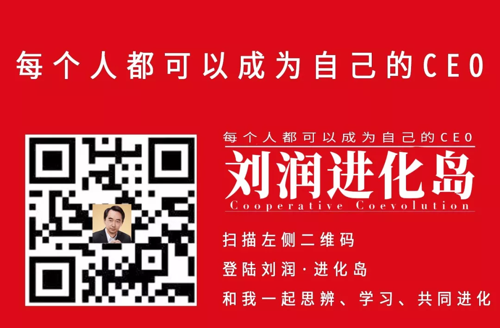

## [转载] 为什么我们常说做to C 的人比较难去做to B ？  
                                                                                              
### 作者                                                                                                                                           
digoal                                                                                         
                                                                                                
### 日期                                                                                           
2018-12-02                                                                                          
                                                                                            
### 标签                                                                                         
PostgreSQL , 思考    
                                                                                              
----                                                                                        
                                                                                                 
## 背景   
## 原文  
https://mp.weixin.qq.com/s/Ye-nNPQ02Tm8ABSa-WJj_A  
  
## 正文  
前几天在线下大课的私享会上，有个同学问了个问题。  
  
他本来一直是做to C软件系统的，积累了很多经验。他发现很多公司也需要这样的系统，他想把能力和经验包装起来，卖给这些公司，问我应该怎么做才能够快速打开市场？  
  
我说，你要想快速打开市场，靠你自己是不行的，你应该组建个团队来帮助你，而且这个团队应该是由从SAP、华为、微软或者IBM这样的公司出来的、销售经验丰富的人组建的。  
  
他说难道就不能放到网上来卖？这不是更方便，也不用做那么重了。  
  
我说，因为你做了很长时间的to C产品，可能对to B行业不太了解。  
  
下面，我就来说说我对to C和to B的理解，它们到底有什么差别，希望对你能有所启发。  
  
   
# 1  
第一，to B和to C的本质差别是决策流程不同。  
  
什么意思？  
  
to B是面向企业，to C是面向个人。  
  
企业的购买决策不是由一个人决定的，而是由流程来决定的。  
  
你买个化妆品，基本不用和老公商量，家里买个贵点的电视，你和老公商量一下，也就拍板定了。  
  
流程特别简单，一个人就拍板了，大不了两个人口头商量一下。你们两人之间不需要审批流程，不需要互相报告，也不需要提个申请，签个字，没那么复杂。  
  
可是to B就不同。  
  
只要是几十个员工以上的企业，就需要有审批流程了。  
  
员工想买个东西，提交申请后，需部门经理同意，还要上报财务经理甚至总经理批。  
  
如果公司再大，就会有专门的采购部，专门负责寻找公司要买的各种各样的东西。甚至会办招标会，向社会公布说我们要采购一批东西，向全社会询问谁有兴趣向我们供货。  
  
这至少需要3家公司比价，还会有监理来看看这3家的产品是不是符合质量要求。  
  
报价结束后，公司内部还会有个评委会对3家公司进行打分，看看各家的信誉怎么样，产品怎么样，技术怎么样等等。  
  
打分完毕后再报给公司的副总经理、副总裁去审批，超过一定金额，可能还要上报总经理审批。  
  
所以你看这个决策中间可能涉及到很多人。  
  
如果说不是购买具体产品，而是寻找解决方案，做一个项目，那就更复杂了。  
  
投这种项目的标书，往往都有几百页甚至上千页，装订成一本一本的，然后成箱成箱的标书送到投标中心，接受各种各样专家评委的评审。  
  
由此可以看出to C和to B最大的本质区别就是决策流程复杂度不同。  
  
这位同学跟我说，我怎么觉得没那么复杂呢？可能是因为我们公司效率比较高，我就定了。  
  
我说那是因为你是公司的老板。  
  
你是公司老板的时候，你定这事挺简单的，那是因为到你这的时候，已经是最终决定了。  
  
你的下属跟你说要买这个东西，你有没有曾经跟你的下属说过，这看上去不错，要不你再去比较一下，多找几个选择，再评估一下。  
  
他想了一下，说好像确实说过类似的话。  
  
我说你只要说过这句话，你的这个决策流程就已经很复杂了。  
  
你的下属在把方案给到你之前，说不定他和他的下属几个人已经对几家经过了几轮比较，最终觉得不错，再拿给你看。  
  
若你让他回去再找，他回去之后会很慎重地再去选几个供应商谈。供应商会天天来和他开会，一次评审会，两次评审会，多次评审会之后，最终才会又拿三个方案给你来定。  
  
最后你说那就A吧。  
  
你觉得这事挺简单，其实下面流程已经相当复杂了。俗话说，领导动动嘴，下属跑断腿。你觉得不复杂，只是你没切身体会到而已。  
  
# 2  
那么，决策流程复杂度不一样又会导致什么？  
  
站在一个卖家的角度来看，你的打法就完全不同了。  
  
to C的时候，消费者可能只要15秒的冲动，他就把东西买了。  
  
可是to B它几乎是不会有冲动的，这么长的决策流程，所有的冲动都被打消了。  
  
你要说服他就只能靠理性，靠感情，靠关系，靠很多要素，综合评判才能作出决定。  
  
这个时候要去影响用户，就不是靠产品的包装、外观或者15秒的冲动就行的。而是要靠一个强大的销售团队，管理用户整个的决策流程。  
  
而要管理流程，你就需要更多的接触，且不仅是一个人的接触，是每个决策者你都要有一些适当的接触。  
  
# 3  
还有第二个很重要的区别，但它已经没有第一个那么重要了，就是它的交付周期通常会很长。  
  
to B一般都会很慎重地购买产品。当然有的时候也会比较简单，比如买个打印机，只需一个采购流程就把它买了。  
  
而有些项目就复杂了，比如说你的这个产品，是把一个系统放到人家公司里面，让他们员工用。  
  
你知道在你放进去之前人家并不是没有系统来完成他的工作，可能它的效率确实不如用你的这个系统来得高。  
  
这就像什么？  
  
就像换一个心脏，原来的心脏也许有一点问题，但是它还是工作着的，还是跟血管连接着的，也许工作得不那么完美。  
  
你今天卖给他的系统相当于卖给他一个人工心脏。  
  
他需要把身体切开，把原来的心脏拿出来，再换上你的人工心脏，再把血管给接上去，这是非常复杂的流程，甚至会出现很大的危险。  
  
所以很多的to B生意，交付的流程冗长而复杂。  
  
这绝不是买个手杖，买来就能用这么简单。  
  
# 4  
所以to B和 to C比，有两大特征。第一大特征是它的决策流程特别复杂。第二是对很多重要的项目来说，它的交付流程也会特别的冗长而复杂。  
  
这两件事情加在一起就几乎决定了to B会非常的重。  
  
因此to B和to C需要的能力也是截然不同的。  
  
to C需要的能力是什么？  
  
to C几乎是不需要有人去说服他的，所以不需要很重的线下的说服工作，也不需要很复杂的线下交互工作。  
  
to C最重要的一个能力是产品本身有颜值、有吸引力。  
  
所以做to C的人特别相信产品，特别相信我只要把产品做好，哪有人不喜欢？  
  
我只要把产品的品质提高10%，销量就能提高50%。  
  
可是to B不同，to B的话，你要打消用户心中的疑虑，你要确保它的每一个更换的环节，都能够非常顺利地执行。  
  
to B不仅是产品，同时更重要的是服务。本质是产品加上服务，甚至在很多时候服务比产品更加重要。  
  
为什么我们经常说做to C的人比较难去做to B？  
  
因为做to B的时候，他不仅要有对消费者使用时的洞察，而且还要有对购买产品的决策流程的洞察，甚至有的时候需要把用户当爹当妈一样来伺候。  
  
这样才能做好，这是很多做to C的人很难理解的。  
  
# 5  
你要做的这个产品其实很好，你把你自己的能力，把这套系统拿出来给别人用，其实特别好，但是你要明白做to B和to C这两个特别大的差别。  
  
所以我给你的建议是，首先要建立一个比较重的销售团队，来帮助你去管理to B复杂的决策流程。  
  
其次你要建立一个强大的服务团队，确保你的系统在别人身体里面使用的时候，这个换心脏的过程是安全且有效的。  
  
一个强大的线下销售团队加上一个强大的服务团队才是把这件事做好的基础。  
  
如果你说这东西太复杂我不想干，那么你可以向SAP学习。  
  
它有一大批的合作伙伴，这些合作伙伴有的是帮助他去实施心脏手术的医生，有的是一大群帮他做销售的代理，这些人加在一起才是一个完整的to B生态系统。  
  
当然你也可以自建这两种能力，或者从外面购买这两种能力。  
  
总之这两种能力就是做to B生意不可缺少的。  
  
--- End ---  
  
  
  
## 参考  
https://mp.weixin.qq.com/s/Ye-nNPQ02Tm8ABSa-WJj_A  
  
  
  
  
  
  
  
  
  
  
  
  
  
  
  
  
  
  
  
  
  
  
  
  
  
  
  
  
  
  
  
  
  
  
  
  
  
  
  
  
  
  
  
  
  
  
  
  
  
  
  
  
  
  
  
  
  
  
  
  
  
  
  
  
  
  
  
  
  
  
#### [PostgreSQL 许愿链接](https://github.com/digoal/blog/issues/76 "269ac3d1c492e938c0191101c7238216")
您的愿望将传达给PG kernel hacker、数据库厂商等, 帮助提高数据库产品质量和功能, 说不定下一个PG版本就有您提出的功能点. 针对非常好的提议，奖励限量版PG文化衫、纪念品、贴纸、PG热门书籍等，奖品丰富，快来许愿。[开不开森](https://github.com/digoal/blog/issues/76 "269ac3d1c492e938c0191101c7238216").  
  
  
#### [9.9元购买3个月阿里云RDS PostgreSQL实例](https://www.aliyun.com/database/postgresqlactivity "57258f76c37864c6e6d23383d05714ea")
  
  
#### [PostgreSQL 解决方案集合](https://yq.aliyun.com/topic/118 "40cff096e9ed7122c512b35d8561d9c8")
  
  
#### [德哥 / digoal's github - 公益是一辈子的事.](https://github.com/digoal/blog/blob/master/README.md "22709685feb7cab07d30f30387f0a9ae")
  
  

  
  
#### [PolarDB 学习图谱: 训练营、培训认证、在线互动实验、解决方案、生态合作、写心得拿奖品](https://www.aliyun.com/database/openpolardb/activity "8642f60e04ed0c814bf9cb9677976bd4")
  
  
#### [购买PolarDB云服务折扣活动进行中, 55元起](https://www.aliyun.com/activity/new/polardb-yunparter?userCode=bsb3t4al "e0495c413bedacabb75ff1e880be465a")
  
  
#### [About 德哥](https://github.com/digoal/blog/blob/master/me/readme.md "a37735981e7704886ffd590565582dd0")
  
