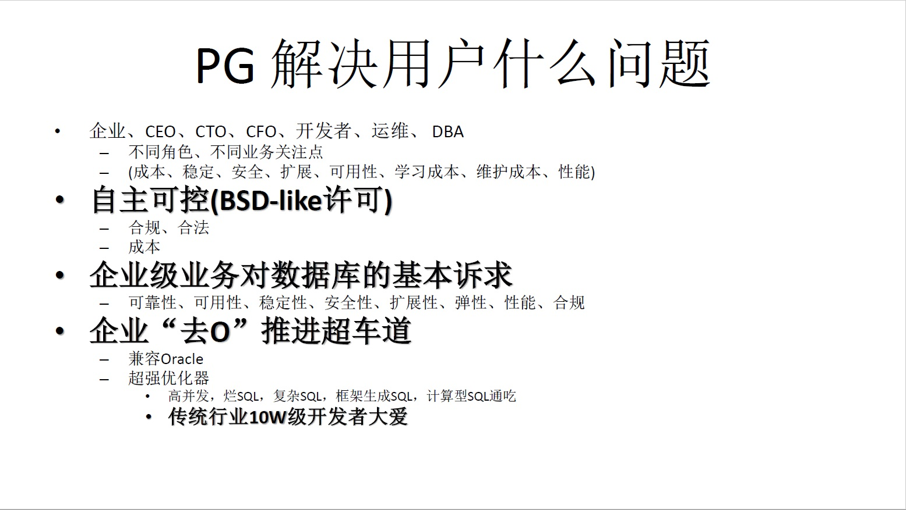
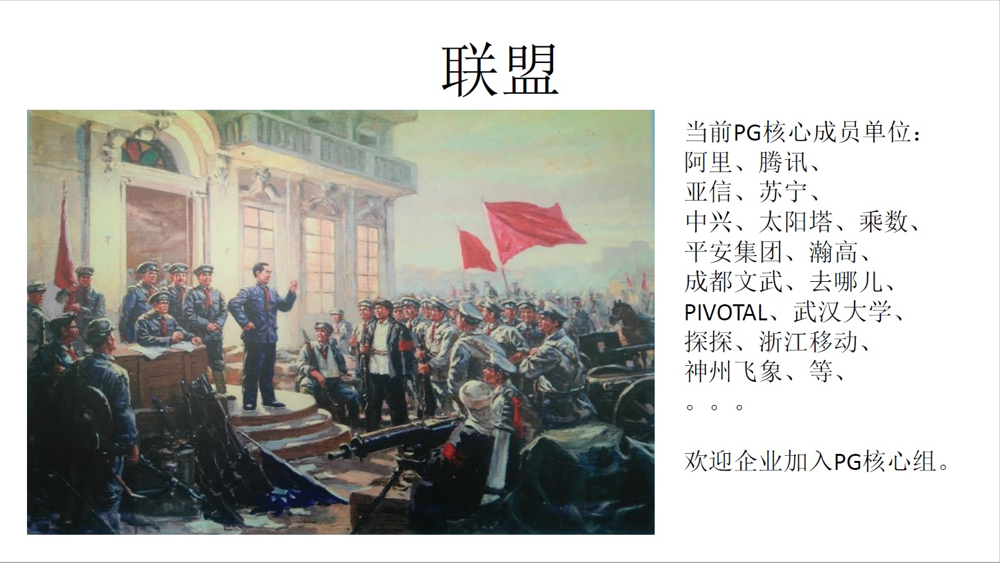

## 中国 PostgreSQL 生态构建思考 - 安全合规、自主可控、去O战略         
                                                                                                            
### 作者                                                        
digoal                                                        
                                                                                     
### 日期                                                                     
2018-12-18                                                 
                                                          
### 标签                                                                                              
PostgreSQL , 生态 , 思考          
                                                                                                            
----                                                                                                      
                                                                                                               
## 背景     
PG生态 - 暨PG中国社区工作汇报  
    
### PG 社区的使命    
1、构建PG数据库技术生态圈  
  
（内核、用户、培训机构、厂商、服务商、软件开发商、高校形成“业务与利益双向驱动”的良性发展生态圈）。  
  
2、解决企业人才培养、输入问题。  
  
3、解决企业商用数据库成本问题。  
  
4、响应国家号召，解决数据库安全、自主可控问题。  
    
### PG 社区的组织架构、组成    
1、社区组织结构  
  
1\.1、轮值主席  
  
1\.2、常委（分管社区官网、官微、宣传、志愿者、财务、垂直行业）  
  
1\.3、分会会长，负责地方事务  
  
1\.4、PG大学虚拟小组  
  
2、社区的构成  
  
2\.1、用户  
  
国网、运营商、平安、阿里、腾讯、华为、去哪儿、探探、中国人寿、...  
  
2\.2、数据库厂商、云厂商  
  
阿里、人大、天曦、南大、腾讯、百度、华为、pivotal、瀚高、...  
  
2\.3、数据库集成、支持服务商  
  
海量、恩墨、乘数、太阳塔、成都文武、飞象数据、...  
  
2\.4、行业软件开发商  
  
润和、亚信、...  
  
2\.5、硬件厂商  
  
宝存、...  
  
2\.6、高校  
  
武汉大学、人民大学、上海交大、...  
  
2\.7、媒体  
  
云栖、IT大咖说、CSDN、开源中国、...兄弟媒体...  
  
2\.8、培训机构  
  
海量、恩墨、东方、...  
  
2\.9、志愿者  
    
### 目前PG 社区的规模    
  
bbs、微信、QQ、微博、钉钉  
  
不完全统计，直接粉丝 15000+ 。 日流量 1000+    
    
### PG 中国社区的运作模式    
  
1、社区为公益组织  
  
平时自由组织活动  
  
全国大会，一年一度，社区常委牵头组织  
  
2、费用  
  
赞助、门票  
  
3、盈利模式探索  
  
流量价值，企业长期赞助。  
  
社区淘宝店，售卖PG社区书籍、文化衫、笔记本等。  
  
盈利回馈社区，支持社区持久运作。  
        
    
### PG 社区的IP    
1、社区活动品牌  
  
1\.1、大象汇  
  
全国峰会  
  
1\.2、开源软件推进联盟PG分会活动  
  
区域会议  
  
1\.3、象行中国  
  
区域会议  
  
1\.4、天天象上  
  
培训、  
  
行业客户分享、  
  
大型行业软件开发商分享、  
  
支持服务提供商、云服务商分享  
    
企业闭门会议。    
  
1\.5、象牙塔  
  
纯培训  
  
2、除此之外，还有官方微博、微信公众号。     
    
3、还需要建立走进企业为中心思想的IP。     
    
4、国产化、自主可控、安全合规、去O联盟为中心思想的IP。    
     
### PG 社区的线上、线下活动    
  
1、线上活动  
  
1\.1、PG 进阶钉钉群  
  
每周直播，专家答疑  
  
1\.2、微信群  
  
1\.3、QQ群  
  
1\.4、公众号  
  
1\.5、BBS  
  
2、线下活动  
  
[《PG 天天象上 “沙龙+走进企业+小镇+高校行” 思考》](20181222_01.md)    
  
2\.1、 天天象上+  
  
培训、  
  
行业客户案例分享、  
  
大型行业软件开发商分享、  
  
支持服务提供商、云服务商分享。  
    
增加企业闭门会议，深度互动、交流。    
  
2\.2、 走进企业+  
  
2\.3、 走进小镇+  
  
2\.4、 高校行  
  
2\.5、 成立地方、垂直行业联络站、发展联盟企业、发展核心组企业  
  
2\.6、 联合行业用户、厂商、软件开发商、服务商、云提供商、社区、政府、兄弟社区力量。  
     
### PG 社区的历史事件    
    
1、2011 用户会成立  
  
2、2015 PG大学(象牙塔)成立  
  
3、2015 象行中国  
  
4、2017 PG社区正式加入“中国开源软件推进联盟”  
  
5、2018 天天象上  
  
一月一城  
  
已传播至：杭州、北京、郑州、上海、广州、深圳、南京  
  
线上线下触达过万人次。  
  
6、2018 云栖社区PG专栏（专人运营）  
  
7、2018 PG 进阶钉钉群  
  
每周直播，专家坐诊，触达人数过万人次。  
  
8、中文PG书籍已达数十本(涵盖内核、管理、开发、调优)。  
  
截止2018.10.31   
    
### PG 社区的人才培养需求    
    
       
    
### 形势分析        
        
贸易战，使得在某些高科技行业受到制裁，高科技行业必须要掌握核心技术。对于数据库来说：使用正版，安全合规、自主可控，降低成本非常重要。        
        
安全合规、自主可控，降低成本，去O已成为国家战略。        
        
        
        
### PG 数据库特色        
        
具备商业价值：企业级的稳定性、可靠性、可用性、扩展性、容灾、安全、性能、功能等方面的能力。具备Oracle兼容性，可以取代ORACLE。        
        
同时具备创新价值：混合负载能力，支持百万级的QPS，管理数TB的数据，支持并行计算，实时数据分析的能力。可以跑混合负载的业务。同时具备多模能力，通过加插件，在一个数据库中实现一份数据，多种处理能力（搜索、图谱、向量、时空、时序、GIS、流计算、机器学习等等能力）。        
        
        
        
### PG 解决什么问题        
PG解决了企业的数据库应用成本、安全合规、自主可控，去O问题。        
        
同时解决了数据库厂商的问题：（BSD Like许可 [PostgreSQL License](https://www.postgresql.org/about/licence/)，随意分发，不需要开源。）理论上来说，只要你有渠道，使用PG封装后就可以成为一个数据库厂商。        
        
        
        
### 市场洗牌        
要解决了企业的数据库应用成本、安全合规、自主可控，去O问题。除了需要数据库厂商的参与，由于更换了数据库（去O），业务可能需要一些改造，这里就需要应用软件开发商的介入，还需要支持服务提供商，周边管理软件开发商，数据同步商...等的介入。        
        
谁走在市场的前面，谁就有可能在新一轮的数据库市场洗牌当中取得更大的市场。        
        
        
        
### 联盟        
国家有政策，用户有需求，你有渠道，他有产品，他可以提供服务，他提供培训，各有所长，必须找到盟友一起努力响应国家号召，完成企业的数据库安全合规、自主可控，降低成本需求。        
        
        
        
        
        
金主，用户，数据库安全合规、自主可控，降低成本需求。        
        
#### 数据库厂商，（BSD Like许可 [PostgreSQL License](https://www.postgresql.org/about/licence/)，随意分发，不需要开源。）理论上来说，只要你有渠道，使用PG封装后就可以成为一个数据库厂商。GPL开源需要，不允许独立分发，除非开源。对于数据库厂商来说，当然不希望开源。开源对厂商的伤害：第一，会被认为是抄袭，第二，技术壁垒意味着被打破        
        
服务商，在转型中提供服务。你先拥有提供去O能力，你可能就能够快速占领市场。        
        
周边软件提供商 (办公软件，BI软件等通用软件，数据同步软件，数据迁移软件，数据库管理软件，异构同步软件，准实时同步软件，跨平台同步软件等)        
        
硬件厂商，拥抱新的数据库，拓展市场。        
        
软件开发商，拥抱新的数据库，拓展市场。        
        
云厂商，拥抱新的数据库，拓展市场。        
        
高校，培养人才，研究方向的转变。        
        
培训机构，拥抱新的数据库，培养市场需要的人才。        
        
### 赛道        
数据库安全合规、自主可控，降低成本需求。整个生态中，有很多参与方，有很多事情需要做，来打造完整的生态。        
        
对于企业来说，选择正确的赛道很重要：        
        
赛道决定了：        
        
你的盟友是谁？        
        
你的竞争对手是谁？        
        
你的渠道有哪些？        
        
你的竞争力如何，前途如何？        
        
        
      
        
  
品牌，赛道两方面，和强势产品拉开差距，避其锋芒，以弱胜强。  
    
例如：     
    
1、MySQL这个赛道，主要是互联网场景，有mongodb和TiDB与之对抗。     
    
2、Oracle这个赛道主要是企业级应用(对数据库的可靠性、稳定性、可用性、安全性、扩展性有极高要求，同时要求能处理极为复杂的业务逻辑，具备数据库存储过程、函数编程能力，具备强大的复杂SQL的处理能力等。)，这个赛道包括有PPAS,PostgreSQL这类企业级数据库。发挥PG企业级数据库的特征，树立PG去O FLAG，整合生态资源，拉起去O大旗。        
    
3、Teradata这个赛道，主要是海量实时分析，传统数仓。  有Greenplum这种MPP数据库产品。    
    
## PG 社区2019年重点工作  
1、围绕去O，组织全国地方性沙龙，全国遍地开花。让去O、企业级数据库与PG成为捆绑词，形成产品FLAG。       
    
天天象上(增加企业介绍、企业闭门会议、增加业务洽谈区。)。     
    
2、走进大型企业，带领PG社区走进企业，形成龙头影响力。    
    
3、雇专职人员，运营社区内容，活动组织，沉淀案例，PR文稿。    
    
4、走进高校。    
    
5、培训、认证。    
    
6、商务，流量运营变现（目前社区的BBS、官方微信微博，技术群等加起来的流量已经足以谈全年的战略合作，人群精准，同时入口够大），谈赞助商全年的合作。    
    
7、继续做PG自有品牌的大流量入口（官方网站，微信，微博，微信群，钉钉群答疑、直播等），掌握资源，为企业与社区的商务合作提供有力支撑。     
    
8、开始做线下渠道入口（小镇经济）。     
    
9、把社区的官方微信、官网的社区介绍重新改版，把重点信息直接在ABOUT里面吐给用户。（PG介绍，中国以及全球的PG用户LOGO，历史的PG峰会、沙龙的议题以及内容简介，PDF下载。钉钉群、官方微信微博二维码。）     
    
10、接入用户时间（碎片、常用软件），增加影响力。   碎片，通常为常见媒体。常用软件，通常为开发者，DBA常用软件。         
  
11、与其他社区展开全年合作，规划全年的联合举办沙龙，打通、融合各个社区的渠道资源。(pivotal, ...)  
          
### PG 资料、微信、钉钉群        
        
        
        
## 个人        
需要拥抱变化，及早学习新的数据库。特别指PostgreSQL（以上已分析为什么是PG？）。        
        
## 企业        
人才梯队培养，产品转型，快速拥抱市场变化。          
        
XX公司，本是某运营商的最大软件供货商，由于没有认识到去O的趋势，用户在去O的驱动下，选择了阿里云ADAM+PPAS(去O产品)+合作伙伴提供的服务。        
        
XX公司，在功能机时代独领风骚，在智能机刚开始兴起时，由于没有快速转变赛道，市场格局发生了变化，最终错过。        
    
## PDF下载  
[PG 生态构建暨PG社区工作汇报](../201801/20180121_01_pdf_002.pdf)    
          
      
      
      
      
      
      
  
  
  
  
  
  
  
  
  
  
  
  
  
  
  
  
  
  
  
  
  
  
  
  
  
  
  
  
  
  
  
  
  
  
  
  
  
  
  
  
  
  
  
  
  
  
  
  
  
  
  
  
  
  
  
  
  
  
  
  
  
  
  
#### [PostgreSQL 许愿链接](https://github.com/digoal/blog/issues/76 "269ac3d1c492e938c0191101c7238216")
您的愿望将传达给PG kernel hacker、数据库厂商等, 帮助提高数据库产品质量和功能, 说不定下一个PG版本就有您提出的功能点. 针对非常好的提议，奖励限量版PG文化衫、纪念品、贴纸、PG热门书籍等，奖品丰富，快来许愿。[开不开森](https://github.com/digoal/blog/issues/76 "269ac3d1c492e938c0191101c7238216").  
  
  
#### [9.9元购买3个月阿里云RDS PostgreSQL实例](https://www.aliyun.com/database/postgresqlactivity "57258f76c37864c6e6d23383d05714ea")
  
  
#### [PostgreSQL 解决方案集合](https://yq.aliyun.com/topic/118 "40cff096e9ed7122c512b35d8561d9c8")
  
  
#### [德哥 / digoal's github - 公益是一辈子的事.](https://github.com/digoal/blog/blob/master/README.md "22709685feb7cab07d30f30387f0a9ae")
  
  

  
  
#### [PolarDB 学习图谱: 训练营、培训认证、在线互动实验、解决方案、生态合作、写心得拿奖品](https://www.aliyun.com/database/openpolardb/activity "8642f60e04ed0c814bf9cb9677976bd4")
  
  
#### [购买PolarDB云服务折扣活动进行中, 55元起](https://www.aliyun.com/activity/new/polardb-yunparter?userCode=bsb3t4al "e0495c413bedacabb75ff1e880be465a")
  
  
#### [About 德哥](https://github.com/digoal/blog/blob/master/me/readme.md "a37735981e7704886ffd590565582dd0")
  
