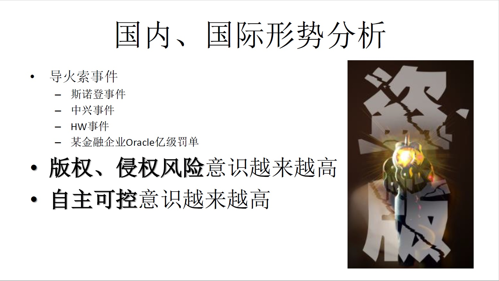

## 中国 PostgreSQL 生态构建思考 - 安全合规、自主可控、去O战略       
                                                                                                          
### 作者                                                      
digoal                                                      
                                                                                   
### 日期                                                                   
2018-12-18                                               
                                                        
### 标签                                                                                            
PostgreSQL , 生态 , 思考        
                                                                                                          
----                                                                                                    
                                                                                                             
## 背景    
      
  
### PG 社区的使命  
  
      
  
### PG 社区的组织架构、组成  
  
      
  
      
  
### 目前PG 社区的规模  
  
      
  
### PG 中国社区的运作模式  
  
      
  
### PG 社区的IP  
除此之外，还有官方微博、微信公众号。  
  
还需要建立走进企业为中心思想的IP。  
  
国产化、自主可控、安全合规、去O联盟为中心思想的IP。  
  
      
  
### PG 社区的线上、线下活动  
  
     
  
     
  
### PG 社区的历史事件  
  
      
  
### PG 社区的人才培养需求  
  
     
  
### 形势分析      
      
贸易战，使得在某些高科技行业受到制裁，高科技行业必须要掌握核心技术。对于数据库来说：使用正版，安全合规、自主可控，降低成本非常重要。      
      
安全合规、自主可控，降低成本，去O已成为国家战略。      
      
      
      
### PG 数据库特色      
      
具备商业价值：企业级的稳定性、可靠性、可用性、扩展性、容灾、安全、性能、功能等方面的能力。具备Oracle兼容性，可以取代ORACLE。      
      
同时具备创新价值：混合负载能力，支持百万级的QPS，管理数TB的数据，支持并行计算，实时数据分析的能力。可以跑混合负载的业务。同时具备多模能力，通过加插件，在一个数据库中实现一份数据，多种处理能力（搜索、图谱、向量、时空、时序、GIS、流计算、机器学习等等能力）。      
      
      
      
### PG 解决什么问题      
PG解决了企业的数据库应用成本、安全合规、自主可控，去O问题。      
      
同时解决了数据库厂商的问题：（BSD Like许可 [PostgreSQL License](https://www.postgresql.org/about/licence/)，随意分发，不需要开源。）理论上来说，只要你有渠道，使用PG封装后就可以成为一个数据库厂商。      
      
      
      
### 市场洗牌      
要解决了企业的数据库应用成本、安全合规、自主可控，去O问题。除了需要数据库厂商的参与，由于更换了数据库（去O），业务可能需要一些改造，这里就需要应用软件开发商的介入，还需要支持服务提供商，周边管理软件开发商，数据同步商...等的介入。      
      
谁走在市场的前面，谁就有可能在新一轮的数据库市场洗牌当中取得更大的市场。      
      
      
      
### 联盟      
国家有政策，用户有需求，你有渠道，他有产品，他可以提供服务，他提供培训，各有所长，必须找到盟友一起努力响应国家号召，完成企业的数据库安全合规、自主可控，降低成本需求。      
      
      
      
      
      
金主，用户，数据库安全合规、自主可控，降低成本需求。      
      
#### 数据库厂商，（BSD Like许可 [PostgreSQL License](https://www.postgresql.org/about/licence/)，随意分发，不需要开源。）理论上来说，只要你有渠道，使用PG封装后就可以成为一个数据库厂商。GPL开源需要，不允许独立分发，除非开源。对于数据库厂商来说，当然不希望开源。开源对厂商的伤害：第一，会被认为是抄袭，第二，技术壁垒意味着被打破      
      
服务商，在转型中提供服务。你先拥有提供去O能力，你可能就能够快速占领市场。      
      
周边软件提供商 (办公软件，BI软件等通用软件，数据同步软件，数据迁移软件，数据库管理软件，异构同步软件，准实时同步软件，跨平台同步软件等)      
      
硬件厂商，拥抱新的数据库，拓展市场。      
      
软件开发商，拥抱新的数据库，拓展市场。      
      
云厂商，拥抱新的数据库，拓展市场。      
      
高校，培养人才，研究方向的转变。      
      
培训机构，拥抱新的数据库，培养市场需要的人才。      
      
### 赛道      
数据库安全合规、自主可控，降低成本需求。整个生态中，有很多参与方，有很多事情需要做，来打造完整的生态。      
      
对于企业来说，选择正确的赛道很重要：      
      
赛道决定了：      
      
你的盟友是谁？      
      
你的竞争对手是谁？      
      
你的渠道有哪些？      
      
你的竞争力如何？      
      
      
    
      
  
例如：   
  
MySQL这个赛道，主要是互联网场景，有mongodb。   
  
Oracle这个赛道主要是企业级应用(对数据库的可靠性、稳定性、可用性、安全性、扩展性有极高要求，同时要求能处理极为复杂的业务逻辑，具备数据库存储过程、函数编程能力，具备强大的复杂SQL的处理能力等。)，这个赛道包括有PPAS,PostgreSQL这类企业级数据库。   
  
Teradata这个赛道，主要是海量实时分析，传统数仓。  有Greenplum这种MPP数据库产品。  
      
### PG 资料、微信、钉钉群      
      
      
      
## 个人      
需要拥抱变化，及早学习新的数据库。特别指PostgreSQL（以上已分析为什么是PG？）。      
      
## 企业      
人才梯队培养，产品转型，快速拥抱市场变化。        
      
XX公司，本是某运营商的最大软件供货商，由于没有认识到去O的趋势，用户在去O的驱动下，选择了阿里云ADAM+PPAS(去O产品)+合作伙伴提供的服务。      
      
XX公司，在功能机时代独领风骚，在智能机刚开始兴起时，由于没有快速转变赛道，市场格局发生了变化，最终错过。      
        
    
    
    
    
## [digoal's 大量PostgreSQL文章入口](https://github.com/digoal/blog/blob/master/README.md "22709685feb7cab07d30f30387f0a9ae")  
    
    
## [免费领取阿里云RDS PostgreSQL实例、ECS虚拟机](https://free.aliyun.com/ "57258f76c37864c6e6d23383d05714ea")  
    
