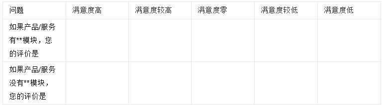
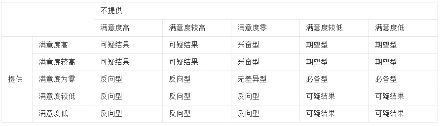
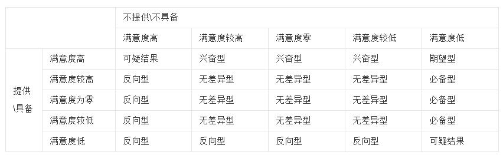
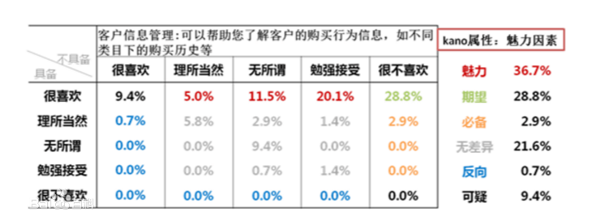
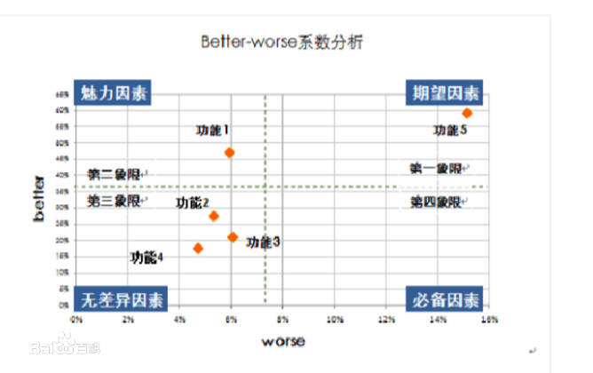
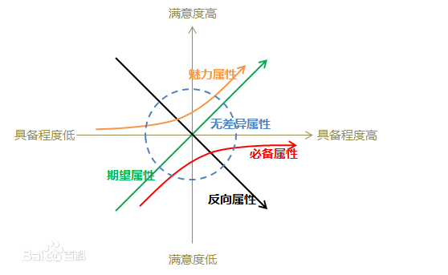

## 产品功能需求归类 - KANO模型，需求调研问卷设计，需求分类实践    
                                                                                                                                        
### 作者                                                                                    
digoal                                                                                    
                                                                                                                 
### 日期                                                                                                 
2019-02-02                                                                             
                                                                                      
### 标签                                                                                                                          
PostgreSQL , 需求分析 , KANO , 基础型 , 期望型 , 魅力型 , 无差异型 , 反向型            
                                                                                                                                        
----                                                                                                                                  
                                                                                                                                           
## 背景    
大部分内容来自百度百科。  
  
产品功能调研，主要目的是帮助研发找到客户对产品的需求分布，该先做什么，后做什么，如何与竞争对手拉开差距。    
    
例如智能手机的基本型需求有语音通话质量、信号覆盖、操作系统兼容、安全性、日常使用和性能：待机时间、速度等。试想一下，一个智能手机没有信号，通话质量差，操作系统不兼容，被感染病毒，待机时间10分钟就没电，如果手机运行速度慢到接近崩溃，这些都会使用户的不满情绪增加，但是上述这些需求都满足后，并不能带来用户满意度的增加，因为用户认为这些是必须要有的。    
    
KANO模型是一个非常经典的需求分析模型。需求调研方法如下：    
    
1、提供、具备某功能：用户是什么反应？（很喜欢、理所当然/还不错/还可以、无所谓、勉强接受/凑活、很不喜欢）或（满意度高、满意度较高、满意度零、满意度较低、满意度低）    
    
2、不提供、不具备某功能：用户是什么反应？（很喜欢、理所当然/还不错/还可以、无所谓、勉强接受/凑活、很不喜欢）或（满意度高、满意度较高、满意度零、满意度较低、满意度低）    
    
调研表，选择目标用户调研，每个功能需要作出如下选择：  
  
    
  
回收调研表，选择一种映射关系，填入表格。  
  
分类方法1表格：  
    
    
  
分类方法2表格：  
  
    
  
根据每个格子的计数进行比例统计，占比最高的为这个产品功能点的需求归类（基本、期望、魅力、无差异、反向、可疑需求），例如，以下为1000份调研表的计数统计，比例来看这个功能点为魅力需求：  
  
    
    
1、必备（基本）型功能    
    
2、期望功能    
    
3、兴奋功能    
    
4、无差异型功能    
    
5、反向型功能    
    
6、可疑功能    
    
## KANO需求归类分析    
    
### 1 基本型需求    
    
也称为必备型需求、理所当然需求，是顾客对企业提供的产品或服务因素的基本要求。是顾客认为产品“必须有”的属性或功能。当其特性不充足(不满足顾客需求)时，顾客很不满意；当其特性充足(满足顾客需求)时，顾客也可能不会因而表现出满意。对于基本型需求，即使超过了顾客的期望，但顾客充其量达到满意，不会对此表现出更多的好感。不过只要稍有一些疏忽，未达到顾客的期望，则顾客满意将一落千丈。对于顾客而言，这些需求是必须满足的，理所当然的。对于这类需求，企业的做法应该是注重不要在这方面失分，需要企业不断地调查和了解顾客需求，并通过合适的方法在产品中体现这些要求。    
    
例如，夏天家庭使用空调，如果空调正常运行，顾客不会为此而对空调质量感到满意；反之，一旦空调出现问题，无法制冷，那么顾客对该品牌空调的满意水平则会明显下降，投诉、抱怨随之而来。再例如，智能手机的基本型需求有语音通话质量、信号覆盖、操作系统兼容、安全性、日常使用和性能：待机时间、速度等。试想一下，一个智能手机没有信号，通话质量差，操作系统不兼容，被感染病毒，待机时间10分钟就没电，如果手机运行速度慢到接近崩溃，这些都会使用户的不满情绪增加，但是上述这些需求都满足后，并不能带来用户满意度的增加，因为用户认为这些是必须要有的。    
    
### 2 期望型需求    
    
也称为意愿型需求。是指顾客的满意状况与需求的满足程度成比例关系的需求，此类需求得到满足或表现良好的话，客户满意度会显著增加，企业提供的产品和服务水平超出顾客期望越多，顾客的满意状况越好。当此类需求得不到满足或表现不好的话，客户的不满也会显著增加。    
    
期望型需求没有基本型需求那样苛刻，要求提供的产品或服务比较优秀，但并不是“必须”的产品属性或服务行为有些期望型需求连顾客都不太清楚，但是是他们希望得到的，也叫用户需求的痒处。这是处于成长期的需求，客户、竞争对手和企业自身都关注的需求，也是体现竞争能力的需求。对于这类需求，企业的做法应该是注重提高这方面的质量，要力争超过竞争对手。    
    
在市场调查中，顾客谈论的通常是期望型需求；质量投诉处理在我国的现状始终不令人满意，该服务也可以被视为期望型需求。如果企业对质量投诉处理得越圆满，那么顾客就越满意。    
    
### 3 魅力型需求    
    
又称兴奋型需求。指不会被顾客过分期望的需求。对于魅力型需求，随着满足顾客期望程度的增加，顾客满意度也会急剧上升，但一旦得到满足，即使表现并不完善，顾客表现出的满意状况则也是非常高的。反之，即使在期望不满足时，顾客也不会因而表现出明显的不满意。    
    
当顾客对一些产品或服务没有表达出明确的需求时，求企业提供给顾客一些完全出乎意料的产品属性或服务行为，使顾客产生惊喜，顾客就会表现出非常满意，从而提高顾客的忠诚度。这类需求往往是代表顾客的潜在需求，企业的做法就是去寻找发掘这样的需求，领先对手。    
    
例如，一些著名品牌的企业能够定时进行产品的质量跟踪和回访，发布最新的产品信息和促销内容，并为顾客提供最便捷的购物方式。对此，即使另一些企业未提供这些服务，顾客也不会由此表现出不满意。    
    
### 4 无差异型需求    
    
不论提供与否，对用户体验无影响。是质量中既不好也不坏的方面，它们不会导致顾客满意或不满意。例如：航空公司为乘客提供的没有实用价值的赠品。    
    
### 5 反向型需求    
    
又称逆向型需求，指引起强烈不满的质量特性和导致低水平满意的质量特性，因为并非所有的消费者都有相似的喜好。许多用户根本都没有此需求，提供后用户满意度反而会下降，而且提供的程度与用户满意程度成反比。例如：一些顾客喜欢高科技产品而另一些人更喜欢普通产品，过多的额外功能会引起顾客不满。      
    
    
## KANO需求分析实践    
    
1、步骤    
    
(1)从顾客角度认识产品或服务需要；    
    
(2)设计问卷调查表；    
    
(3)实施有效的问卷调查；    
    
(4)将调查结果分类汇总，建立质量原型；    
    
(5)分析质量原型，识别具体测量指标的敏感性。    
    
2、过滤无效问卷    
    
在整理问卷调查的时候，清洗掉个别的明显胡乱回答的个例，如全部问题都选择“我很喜欢”或“我一点都喜欢”的。    
    
设计  
  
```  
postgres=# create type choose as enum('很喜欢','理所当然','无所谓','勉强接受','很不喜欢');  
CREATE TYPE  
  
create table tbl (  
  uid int,    -- 用户ID  
  feature text,   -- 被调查的功能点  
  has boolean,    -- 包含、不包含改功能  
  ans choose      -- 用户选择:   '很喜欢','理所当然','无所谓','勉强接受','很不喜欢'      
);  
  
select has,ans,count(distinct uid) from tbl where feature=功能点;  
```  
  
3、方法评价    
    
严格的说，该模型不是一个测量顾客满意度的模型，而是对顾客需求或者说对绩效指标的分类，通常在满意度评价工作前期作为辅助研究模型，KANO模型的目的是通过对顾客的不同需求进行区分处理，帮助企业找出提高企业顾客满意度的切入点。KANO模型是一个典型的定性分析模型，一般不直接用来测量顾客的满意度，它常用于对绩效指标进行分类，帮助企业了解不同层次的顾客需求，找出顾客和企业的接触点，识别使顾客满意的至关重要的因素。    
    
### 注意事项    
    
第一，需求会因人而异；一百个人眼中有一百个林黛玉。要做的是满足目标用户人群中多数人的需求。    
    
第二，需求会因为文化差异而不同；如国内的互联网产品比国外的互联网产品要做得好，    
    
第三，需求会随着时间变化。昨天的期望型需求，甚至魅力型需求，到今天可能已变成了必备型需求。具体如下图所示。    
    
需要持续调研需求、产品需要持续迭代，与时俱进才能取得成绩。而不是照搬过去的、别人的方法或理论。    
    
    
从表格中不难看出，每一个功能在6个维度上（魅力属性、期望属性、必备属性、无差异因素、反向属性、可疑结果）上均可能有得分，将相同维度的比例相加后，可得到各个属性维度的占比总和，总和最大的一个属性维度，便是该功能的属性归属。    
    
某产品希望优化5项功能，但是不知道哪些是用户需要的。通过kano调研分析，可以分别计算出5项功能的better-worse系数，构建如下四分位图。    
    
    
    
第一象限表示：better系数值高，worse系数绝对值也很高的情况。落入这一象限的因素，称之为是期望因素（一维因素），功能5落入此象限，即表示产品提供此功能，用户满意度会提升，当不提供此功能，用户满意度就会降低；    
    
第二象限表示：better系数值高，worse系数绝对值低的情况。落入这一象限的因素，称之为是魅力因素，功能1落入此象限，即表示不提供此功能，用户满意度不会降低，但当提供此功能，用户满意度会有很大提升；    
    
第三象限表示：better系数值低，worse系数绝对值也低的情况。落入这一象限的因素，称之为是无差异因素，功能2、3、4落入此象限，即无论提供或不提供这些功能，用户满意度都不会有改变，这些功能点是用户并不在意的功能；    
    
第四象限表示：better系数值低，worse系数绝对值高的情况。落入这一象限的因素，称之为是必备因素，即表示当产品提供此功能，用户满意度不会提升，当不提供此功能，用户满意度会大幅降低；说明落入此象限的功能是最基本的功能。    
    
在实际中，我们首先要全力以赴地满足用户最基本的需求，即第四象限表示的必备因素，这些需求是用户认为我们有义务做到的事情。在实现最基本的需求之后，我们应尽力去满足用户的期望型需求，即第一象限表示的期望因素，这是质量的竞争性因素。提供用户喜爱的额外服务或产品功能，使其产品和服务优于竞争对手并有所不同，引导用户加强对本产品的良好印象。最后争取实现用户的魅力型需求，即第二象限表示的魅力因素，提升用户的忠诚度。因此，根据kano模型计算出的better-worse系数值，说明该产品先需要优化功能5，然后再满足功能1。而功能2、3、4对用户来说，有或者没有都是无差异型需求，并没有必要花大力气去实现。    
  
  
    
### 结果产出    
    
为了更明显地表述这5类需求，将其放在一张坐标图中，该图体现了每一类需求的特性。横坐标为提供程度，纵坐标为满意程度。    
    
    
    
## 小结    
使用KANO用户需求分析模型，设计问卷调查，找到需求的分类（基础型 , 期望型 , 魅力型 , 无差异型 , 反向型），产品首先要全力以赴地满足用户"最基本的需求"，即第四象限表示的"必备因素"，这些需求是用户认为我们有义务做到的事情。   
  
在实现最基本的需求之后，我们应尽力去满足用户的"期望型需求"，即第一象限表示的期望因素，这是"质量的竞争性"因素。提供用户喜爱的额外服务或产品功能，使其产品和服务优于竞争对手并有所不同，引导用户加强对本产品的良好印象。   
  
最后争取实现用户的"魅力型需求"，即第二象限表示的魅力因素，提升用户的"忠诚度"。    
  
KPI考核也可以参考如上。   
      
## 参考    
https://baike.baidu.com/item/KANO%20%E6%A8%A1%E5%9E%8B/19907824    
  
https://wiki.mbalib.com/zh-tw/KANO%E6%A8%A1%E5%9E%8B  
    
    
    
    
    
    
    
  
  
  
  
  
  
  
  
  
  
  
  
  
  
  
  
  
  
  
  
  
  
  
  
  
  
  
  
  
  
  
  
  
  
  
  
  
  
  
  
  
  
  
  
  
  
  
  
  
  
  
  
  
  
  
  
  
  
  
  
  
  
  
#### [PostgreSQL 许愿链接](https://github.com/digoal/blog/issues/76 "269ac3d1c492e938c0191101c7238216")
您的愿望将传达给PG kernel hacker、数据库厂商等, 帮助提高数据库产品质量和功能, 说不定下一个PG版本就有您提出的功能点. 针对非常好的提议，奖励限量版PG文化衫、纪念品、贴纸、PG热门书籍等，奖品丰富，快来许愿。[开不开森](https://github.com/digoal/blog/issues/76 "269ac3d1c492e938c0191101c7238216").  
  
  
#### [9.9元购买3个月阿里云RDS PostgreSQL实例](https://www.aliyun.com/database/postgresqlactivity "57258f76c37864c6e6d23383d05714ea")
  
  
#### [PostgreSQL 解决方案集合](https://yq.aliyun.com/topic/118 "40cff096e9ed7122c512b35d8561d9c8")
  
  
#### [德哥 / digoal's github - 公益是一辈子的事.](https://github.com/digoal/blog/blob/master/README.md "22709685feb7cab07d30f30387f0a9ae")
  
  

  
  
#### [PolarDB 学习图谱: 训练营、培训认证、在线互动实验、解决方案、生态合作、写心得拿奖品](https://www.aliyun.com/database/openpolardb/activity "8642f60e04ed0c814bf9cb9677976bd4")
  
  
#### [购买PolarDB云服务折扣活动进行中, 55元起](https://www.aliyun.com/activity/new/polardb-yunparter?userCode=bsb3t4al "e0495c413bedacabb75ff1e880be465a")
  
  
#### [About 德哥](https://github.com/digoal/blog/blob/master/me/readme.md "a37735981e7704886ffd590565582dd0")
  
