## 企业数据库选型规则    
                            
### 作者                            
digoal                            
                            
### 日期                            
2019-02-14                            
                            
### 标签                            
PostgreSQL , 数据库选型 , 企业级数据库       
                        
----                      
                        
## 背景    
企业数据库选型规则。  
  
  
## 一、数据库部署形式  
随着硬件发展，指标上会有变化。  
  
部署形式决定了容量上限，计算能力上限，读写带宽上限，RPO，RTO指标，适应场景。  
  
### 1、分布式部署（例如pg+citus插件）  
  
容量上限：100节点以上，PB级。  
  
计算能力上限：100节点以上，6400核以上。  
  
读写带宽上限：100节点以上，200GB/s以上。  
  
RPO：如果每个计算节点都采用多副本存储，RPO=0。  
  
RTO：如果每个计算节点都采用HA，RTO可以做到1分钟内。  
  
使用限制：有一些SQL限制。  
  
适应场景：应用代码可控程度高的情况下，适合TP和AP业务。  
  
### 2、单节点本地存储  
  
容量上限：10TB级。  
  
计算能力上限：64核级。  
  
读写带宽上限：2GB/s级。  
  
RPO：RPO无保障。  
  
RTO：RTO无保障。  
  
使用限制：SQL无限制。  
  
适应场景：测试环境，非生产环境，对数据库RPO，RTO都没有要求的环境。  
  
### 3、单节点多副本存储  
  
容量上限：32TB级。  
  
计算能力上限：64核级。  
  
读写带宽上限：2GB/s级。  
  
RPO：单机房RPO=0，（如果存储支持跨机房多副本，可以做到多机房RPO=0）。  
  
RTO：10分钟级。  
  
使用限制：SQL无限制。  
  
适应场景：非核心场景生产、测试。  
  
### 4、双节点共享存储  
  
容量上限：32TB级。  
  
计算能力上限：64核级。  
  
读写带宽上限：2GB/s级。  
  
RPO：单机房RPO=0，（如果存储支持跨机房多副本，可以做到多机房RPO=0）。  
  
RTO：1分钟级。  
  
使用限制：SQL无限制。  
  
适应场景：核心、非核心场景生产。  
  
### 5、双节点主备异步复制  
  
容量上限：32TB级（使用远程存储），10TB级（使用本机存储）  
  
计算能力上限：64核级。  
  
读写带宽上限：2GB/s级。  
  
RPO：10GB网络，REDO延迟毫秒级、1MB以内。（支持跨机房部署）。心跳机制可确保RPO < 60秒   
  
RTO：1分钟级。  
  
使用限制：SQL无限制。  
  
适应场景：非核心场景生产。  
  
### 6、双节点主备半同步复制  
  
容量上限：32TB级（使用远程存储），10TB级（使用本机存储）  
  
计算能力上限：64核级。  
  
读写带宽上限：2GB/s级。  
  
RPO：  
  
无节点或单一节点异常时，可保证RPO=0。  
  
两个节点都异常时，RPO取决于备份延迟。采用基于PG流复制的持续REDO备份，可以做到RPO毫秒级。  
  
RTO：1分钟级。  
  
使用限制：SQL无限制。  
  
适应场景：核心、非核心场景生产。  
  
### 7、三节点及以上多副本全同步复制  
  
容量上限：32TB级（使用远程存储），10TB级（使用本机存储）  
  
计算能力上限：64核级。  
  
读写带宽上限：2GB/s级。  
  
RPO：  
  
小于半数节点异常时，可保证RPO=0。  
  
半数以上节点异常时，RPO取决于 1、10GB网络，REDO延迟毫秒级、1MB以内。2、备份延迟。采用基于PG流复制的持续REDO备份，可以做到RPO毫秒级。   
  
RTO：1分钟级。  
  
使用限制：SQL无限制。  
  
适应场景：核心场景生产。  
  
### 8、计算存储分离（存储多副本）（比如阿里云POLARDB PG）  
  
容量上限：100TB级。  
  
计算能力上限：16节点，1024核级。  
  
读写带宽上限：32GB/s级。  
  
RPO：单机房RPO=0，（如果存储支持跨机房多副本，可以做到多机房RPO=0）。  
  
RTO：15秒级。  
  
使用限制：SQL无限制。  
  
适应场景：核心、非核心场景生产。  
  
### 9、计算存储分离（存储多副本）+ 双机房半同步  
  
容量上限：100TB级。  
  
计算能力上限：16节点，1024核级。  
  
读写带宽上限：32GB/s级。  
  
RPO：  
  
无节点或单一节点异常时，可保证RPO=0。  
  
两个节点都异常时，RPO取决于备份延迟。采用基于PG流复制的持续REDO备份，可以做到RPO毫秒级。  
  
RTO：15秒级。  
  
使用限制：SQL无限制。  
  
适应场景：核心、非核心场景生产。  
  
### 10、计算存储分离（存储多副本）+ 多机房多副本全同步  
  
容量上限：100TB级。  
  
计算能力上限：16节点，1024核级。  
  
读写带宽上限：32GB/s级。  
  
RPO：  
  
小于半数节点异常时，可保证RPO=0。  
  
半数以上节点异常时，RPO取决于 1、10GB网络，REDO延迟毫秒级、1MB以内。2、备份延迟。采用基于PG流复制的持续REDO备份，可以做到RPO毫秒级。   
  
RTO：15秒级。  
  
使用限制：SQL无限制。  
  
适应场景：核心场景生产。  
  
### 11、只读节点  
  
使用限制：SQL无限制。  
  
适应场景：扩展读能力。  
  
### 12、非核心功能  
  
12\.1、业务透明的读写分离  
  
使用限制：SQL无限制。  
  
适应场景：扩展读能力。  
  
12\.2、跨库交互  
  
使用限制：SQL无限制。  
  
适应场景：跨库DBLINK，跨库外部表，跨库物化视图。  
  
12\.3、单元化  
  
使用限制：SQL无限制。  
  
适应场景：多实例共享少量数据，多写。  
  
  
## 二、云产品形态  
  
### 1、基础版（单机多副本存储）PG 10  
  
当前容量上限：2 TB  
  
未来可达32TB级。  
  
### 2、双机版（异步复制）PG 9.4, 10、PPAS 9.3, 10  
  
当前容量上限：6 TB  
  
### 3、双机版（半同步复制）PG 11  
  
当前容量上限：32 TB  
  
### 4、只读实例  
  
扩展读能力。  
  
### 5、计算存储分离版 PG 11、PPAS 11   
  
16个计算节点，读写分离。  
  
当前容量上限：100 TB  
  
### PG、PPAS、POLARDB PG区别  
除以上区别以外，还有如下区别（pg ppas polarddb选择评判标准：数据量，可用性，可靠性，是否有去O需求，成本）：  
  
1、pg社区版。  
  
2、PPAS兼容PG、同时高度兼容ORACLE。  
  
相比社区版PG，新增AWR报告、SQL防火墙、数据库用户级资源隔离、索引推荐等高级功能。  
  
3、POLARDB PG。  
  
兼容PG、同时高度兼容ORACLE。  
  
相比PPAS、PG，容量达到100TB，计算存储分离，计算可扩展到16节点，支持超低延迟读写分离。  
  
扩容速度快。（扩容不需要迁移数据，非常之快）  
  
可用性高，恢复速度快。（恢复不需要REPLAY WAL，秒级恢复）  
  
备份、恢复速度快。（存储快照，秒级备份）  
  
由于一份存储支持读写分离（PG PPAS使用流复制方式，每个只读节点一份存储），POLARDB成本更低廉。  
  
存储采用按实际使用量付费，不需要规划存储大小，弹性更好。  
  
自研主打产品，未来产品黑科技会集中增加到POLARDB。  
  
## 三、行业合规要求  
一些行业对数据库系统的合规要求：  
  
1、SQL审计  
  
2、扩展性  
  
3、可用性  
  
4、可靠性  
  
5、备份保留时间  
  
6、备份可恢复时间点  
  
7、闪回  
  
8、回收站  
  
9、存储加密  
  
10、数据文件加密  
  
11、类型加密  
  
12、数据访问链路加密  
  
13、连接认证加密  
  
14、加密KEY管理形式  
  
## 四、数据库版本推荐  
  
除非业务有特殊要求。选新不选旧(新版本建议发行2个小版本后使用)。  
  
例如当前PG最新版本为11，已发布两个小版本，推荐使用11最新小版本。  
  
  
## 五、数据库选型推荐  
  
### 1 老业务迁移  
#### 原来使用什么DB？ (PG, EDB PPAS, oracle, sybase, db2, ms sql)     
  
1、pg -> pg  
  
2、edb ppas -> ppas  
  
3、oracle -> pg (用户积极配合改动，并有倾向使用开源版)  
  
平安案例  
  
邮储案例  
  
中国人寿案例  
  
4、oracle -> ppas (用户期望少改动)  
  
中航信案例  
  
大量ZF，传统行业案例  
  
使用ADAM，大量成功去O案例。  
  
https://promotion.aliyun.com/ntms/act/ppasadam.html  
  
5、sybase, db2 -> pg  
  
sybase (铁老大案例)  
  
db2 (苏宁案例)  
  
6、ms sql -> pg  
  
(康恩贝案例)  
  
  
### 2 新业务  
#### 1、如果Oracle可以免费使用，用户选择Oracle的概率是多少？如果超过50%的概率选择Oracle，推荐到PG、POLARDB PG。  
  
#### 2、当前用户技术栈  
  
2\.1、Oracle -> PPAS、POLARDB PG  
  
使用ADAM，大量成功去O案例。  
  
https://promotion.aliyun.com/ntms/act/ppasadam.html  
  
2\.2、sybase, db2 -> pg  
  
2\.3、ms sql -> pg  
  
2\.4、pg -> pg  
  
2\.5、edb ppas -> ppas  
  
#### 3、业务复杂度  
  
3\.1、复杂业务（有较复杂SQL，较复杂业务逻辑） -> PG    
  
例如: 企业crm, erp, oa, 财务, 销售, 经营分析系统，GIS地理信息业务，等。  (此类场景典型PG客户：用友,sap,odoo)  
  
3\.2、简单业务 -> PG (同样完全可以胜任)    
  
#### 4、业务分类  
  
4\.1、纯AP  
  
100TB 以内数据，纯AP(T+1)：POLARDB PG。     
  
32TB 以内数据，纯AP(T+1)：PG 11。     
  
4\.2、实时分析：WHERE条件过滤后数据量亿级。  POLARDB PG。   PG 11。     
  
4\.3、TP  
  
PG, PPAS, POLARDB PG  
  
4\.4、混合场景（有TP，有AP）    
  
100TB以内数据量：  
  
POLARDB PG  
  
32TB 以内数据量：  
  
PG 11  
  
6TB 以内数据量：  
  
PG 10, PPAS 10  
  
产品AP能力主要包括：并行计算、GPU加速、JIT、向量计算、流计算、物化视图、丰富的分析函数、丰富的窗口查询函数、HASH JOIN、MERGE JOIN、丰富的内置函数、丰富的PLSQL语法。  
  
产品TP能力：单节点 百万级QPS  
  
4\.5、海量数据，大量为冷数据，不能删除，极少查询。  
  
pg, ppas, polardb pg，均支持OSS_FDW外部表，冷存储。查询对业务透明。  
  
#### 5、业务有SHARDING需求，但是不想改SQL适配sharding(sharding 带来的SQL使用限制，包括跨库事务，跨库查询，复杂SQL，维度表过大等问题)  
  
100TB以内数据量：  
  
POLARDB PG  
  
32TB 以内数据量：  
  
PG 11  
  
6TB 以内数据量：  
  
PG 10, PPAS 10  
  
#### 6、业务有多模需求，并且要求数据一致性，实时性  
  
如果不要求实时性，一致性，可以再考虑将数据同步到其他产品  
  
6\.1、全文检索、模糊查询（tsvector, tsquery, pg_trgm技术）  
  
6\.2、任意字段多维度组合实时查询（smlar, rum, gin, bitmap scan, varbitx, roaring bitmap等技术）  
  
例如：实时画像系统、营销系统。  
  
6\.3、文本相似查询（pg_trgm技术）  
  
6\.4、向量相似查询（cube技术）  
  
例如：相似推荐系统  
  
6\.5、图像相似查询（imgsmlr技术）  
  
6\.6、GIS地理信息业务（postgis, brin, gist技术）  
  
例如：天文、气象、地震、国土、测绘、车联网、物联网  
  
6\.7、时空轨迹、混合场景业务（ganos, postgis, brin, gist技术）  
  
例如：饿了么，点我达，打车，车联网，  
  
6\.8、时序类（timescaledb 技术）  
  
6\.9、流计算（pipelinedb 技术）  
  
6\.10、图式搜索（CTE 技术）  
  
例如：风控、族谱、社交、内容推荐、用户推荐等 业务。  
  
  
多模类业务，性能功能指标参考HTAP测试  
  
  
[《HTAP 用例测试，性能指标》](../201711/readme.md)  
  
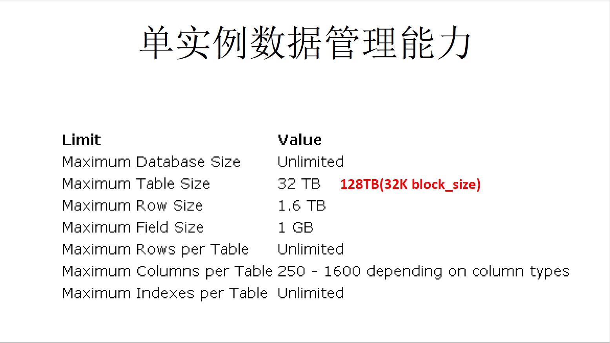  
  
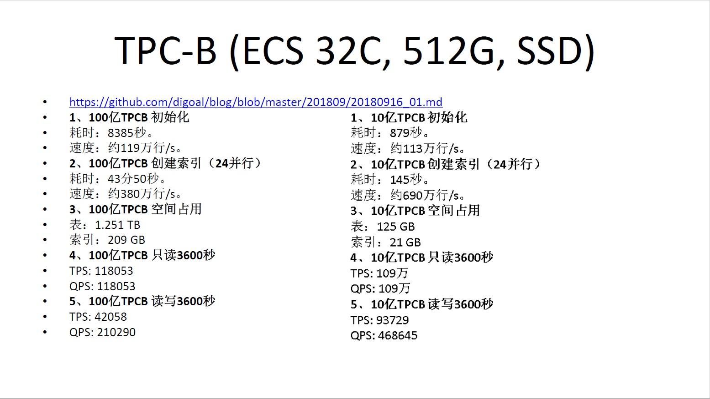  
  
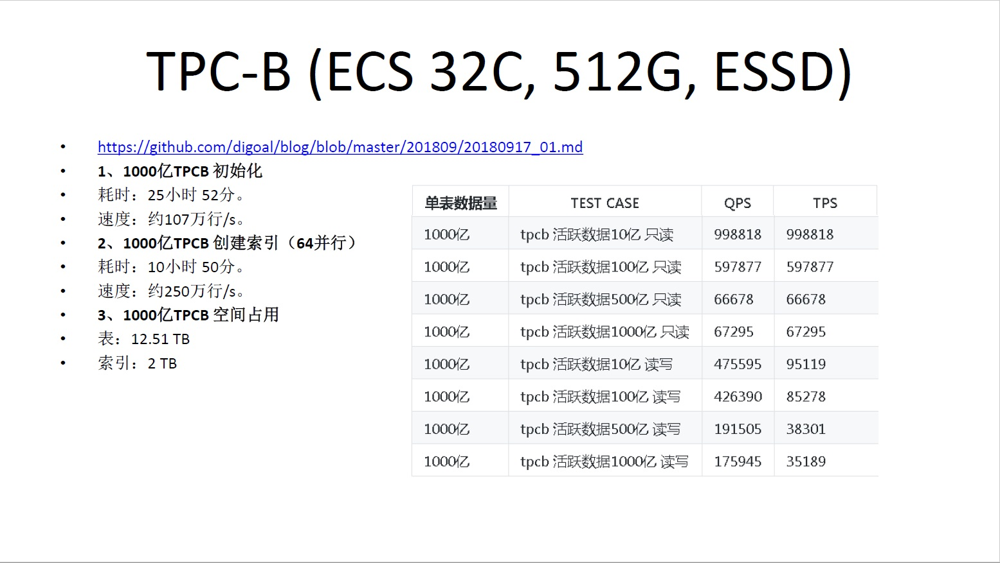  
  
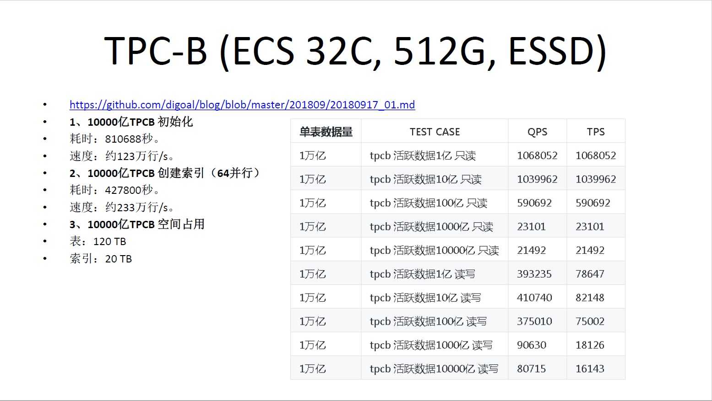  
  
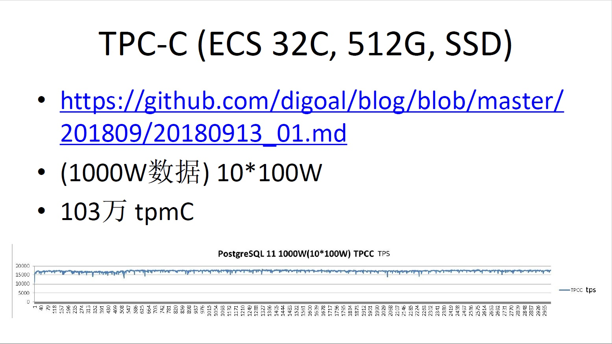  
  
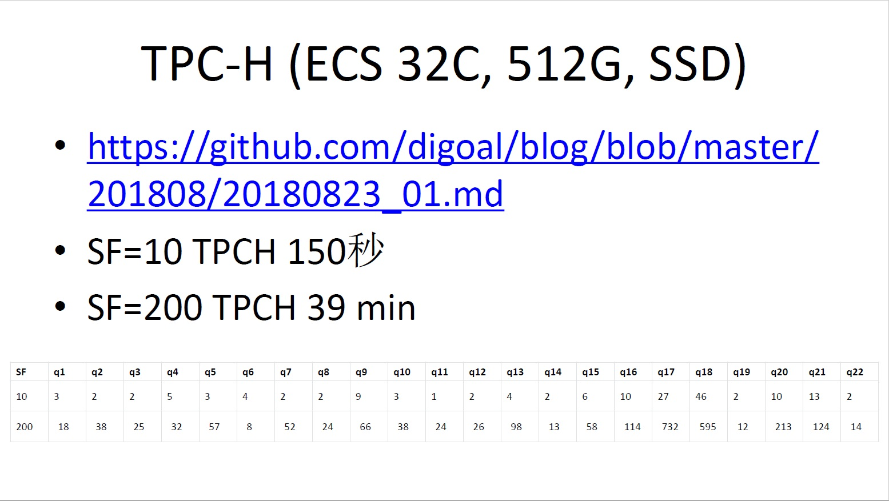  
  
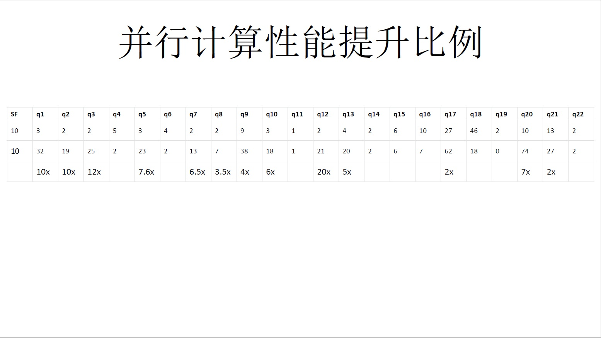  
  
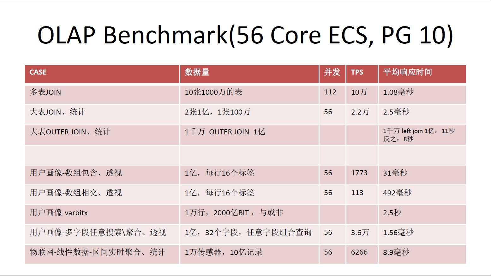  
  
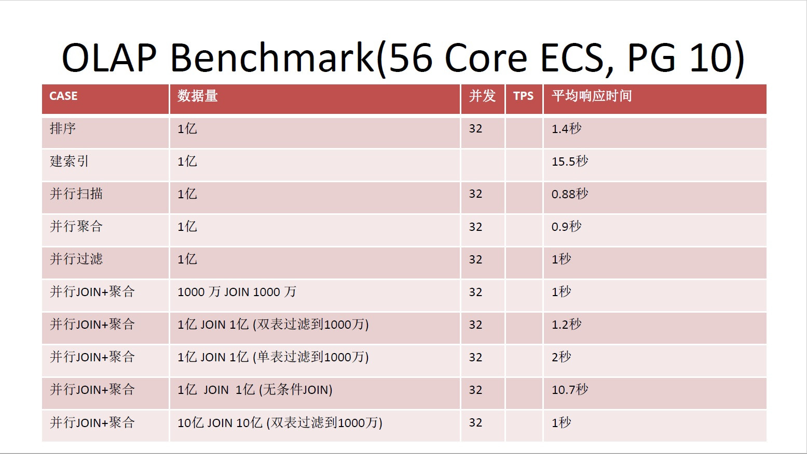  
  
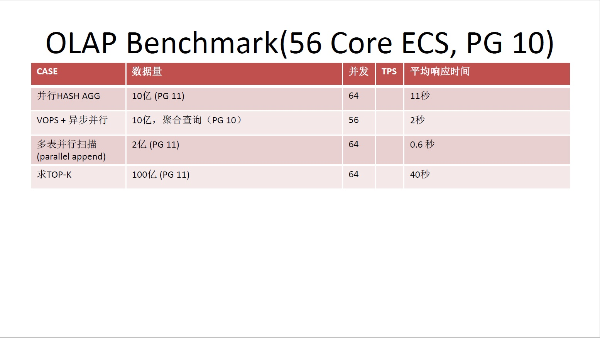  
  
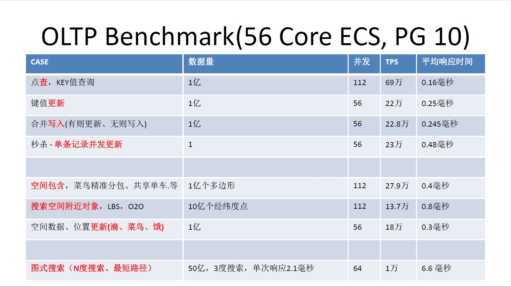  
  
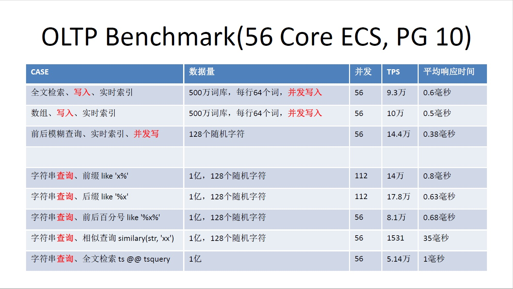  
  
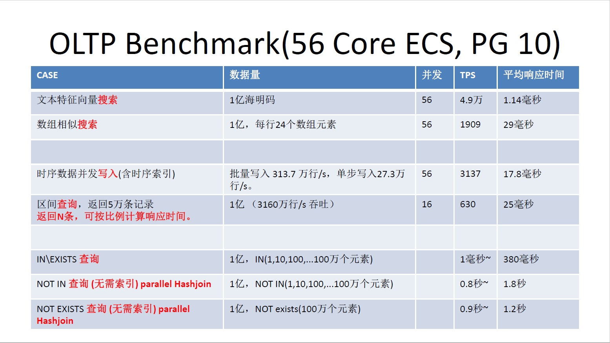  
  
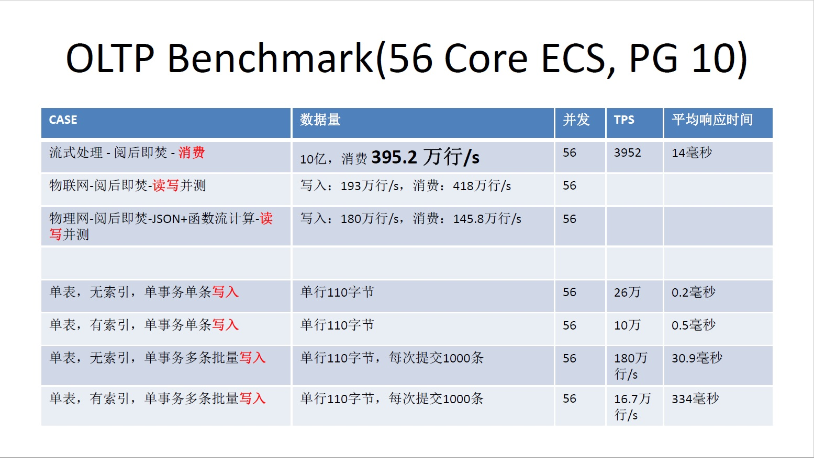  
  
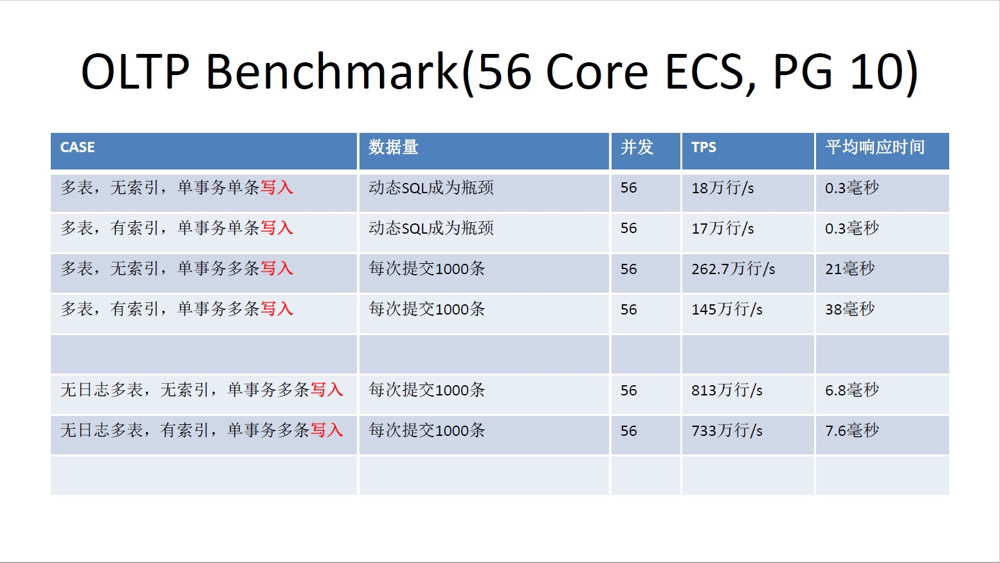  
  
## 参考  
  
[《PostgreSQL 规格评估 - 微观、宏观、精准 多视角估算数据库性能(选型、做预算不求人)》](../201709/20170921_01.md)    
  
[《数据库选型之 - 大象十八摸 - 致 架构师、开发者》](../201702/20170209_01.md)    
  
[《数据库选型思考(PostgreSQL,MySQL,Oracle)》](../201702/20170208_03.md)    
  
[《HTAP 用例测试，性能指标》](../201711/readme.md)  
     
RDS PG PPAS 性能白皮书  
  
https://help.aliyun.com/document_detail/101470.html  
  
https://help.aliyun.com/document_detail/101100.html  
  
  
  
  
  
  
  
  
  
  
  
  
  
  
  
  
  
  
  
  
  
  
  
  
  
  
  
  
  
  
  
  
  
  
  
  
  
  
  
  
  
  
  
  
  
  
  
  
  
  
  
  
  
  
  
  
  
  
  
  
  
  
  
  
  
  
  
  
  
  
#### [PostgreSQL 许愿链接](https://github.com/digoal/blog/issues/76 "269ac3d1c492e938c0191101c7238216")
您的愿望将传达给PG kernel hacker、数据库厂商等, 帮助提高数据库产品质量和功能, 说不定下一个PG版本就有您提出的功能点. 针对非常好的提议，奖励限量版PG文化衫、纪念品、贴纸、PG热门书籍等，奖品丰富，快来许愿。[开不开森](https://github.com/digoal/blog/issues/76 "269ac3d1c492e938c0191101c7238216").  
  
  
#### [9.9元购买3个月阿里云RDS PostgreSQL实例](https://www.aliyun.com/database/postgresqlactivity "57258f76c37864c6e6d23383d05714ea")
  
  
#### [PostgreSQL 解决方案集合](https://yq.aliyun.com/topic/118 "40cff096e9ed7122c512b35d8561d9c8")
  
  
#### [德哥 / digoal's github - 公益是一辈子的事.](https://github.com/digoal/blog/blob/master/README.md "22709685feb7cab07d30f30387f0a9ae")
  
  

  
  
#### [PolarDB 学习图谱: 训练营、培训认证、在线互动实验、解决方案、生态合作、写心得拿奖品](https://www.aliyun.com/database/openpolardb/activity "8642f60e04ed0c814bf9cb9677976bd4")
  
  
#### [购买PolarDB云服务折扣活动进行中, 55元起](https://www.aliyun.com/activity/new/polardb-yunparter?userCode=bsb3t4al "e0495c413bedacabb75ff1e880be465a")
  
  
#### [About 德哥](https://github.com/digoal/blog/blob/master/me/readme.md "a37735981e7704886ffd590565582dd0")
  
