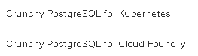
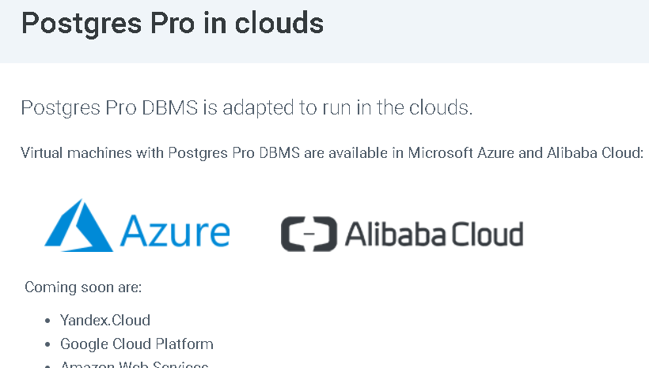
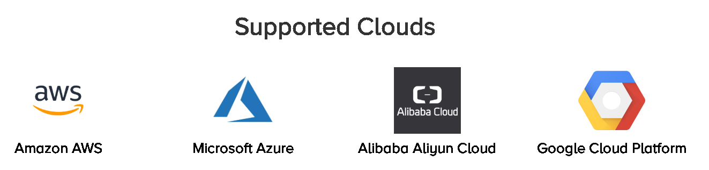
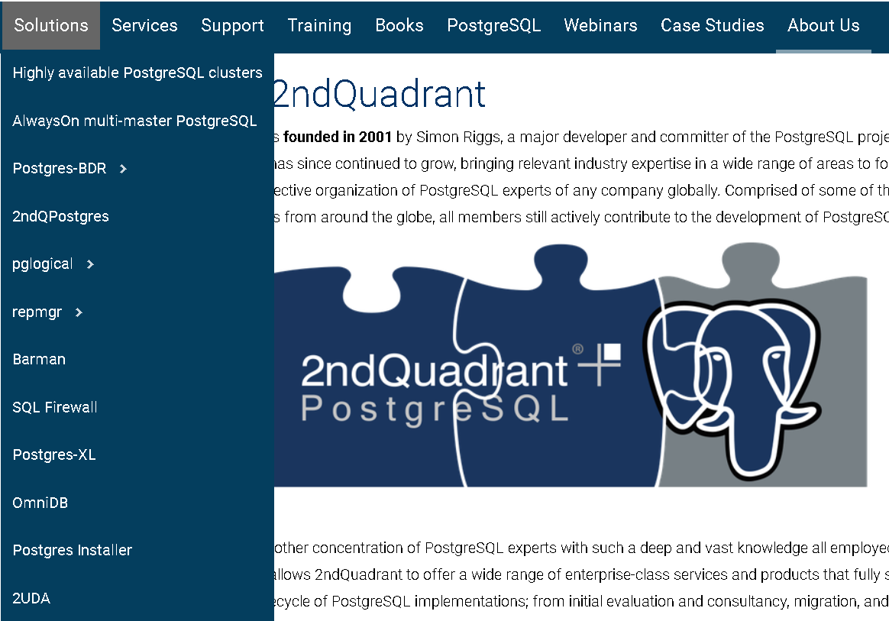

## PostgreSQL hosted in cloud    
                                          
### 作者                                          
digoal                                          
                                          
### 日期                                          
2019-03-11                                          
                                          
### 标签                                          
PostgreSQL , cloud , hosted   
                                      
----                                    
                                      
## 背景       
目前已经有很多cloud hosted database的提供商，其中PG社区的数据库公司已有众多加入此行列。  
  
PostgreSQL社区核心组成员、主要contributor所在公司，已经有超过半数提供了cloud hosted database服务。  
  
核心成员+主要contributor占比高达 25/39     
  
### 1、crunchy 美国   
https://www.crunchydata.com/products/crunchy-postgresql-for-kubernetes/  
  
  
  
#### 内核实力  
1、Tom Lane @ POSTGRES 核心commit 。   
  
Involved in all aspects of PostgreSQL, including bug evaluation and fixes, performance improvements, and major new features, such as schemas. He is also responsible for the optimizer.  
  
2、Peter Geoghegan    
  
UPSERT, sorting improvements, pg_stat_statements, group commit  
  
3、Stephen Frost   
  
Security improvements, GRANT improvements, patch review, project infrastructure.  
  
4、Paul Ramsey   
  
Extension support in postgres_fdw. PostGIS geospatial extension.  
  
5、Joe Conway     
  
Set-returning functions, PL/R, dblink, tablefunc (crosstab), improved bytea and array data types, polymorphic arguments, multi-row VALUES, generate_series, pg_settings/related functions, has_*_privilege functions, shared_preload_libraries, and other features. PGDG sysadmin team, board member PG.US  
  
6、Dave Cramer  
  
Maintainer of the JDBC driver and contributes to PL/R.  
  
  
  
### 2、postgres pro 俄罗斯  
https://postgrespro.com/products/postgrespro/clouds  
  
https://marketplace.alibabacloud.com/store/3212682.html  
  
  
  
#### 内核实力  
1、Oleg Bartunov  
  
Introduced the locale support, has contributed GiST, GIN and SP-GiST extendability infrastructures, full text search, KNN, NoSQL features (hstore and jsonb) and several extensions including fuzzy search (pg_trgm), support for tree-like structures and arrays. Currenty he is working on implementation of SQL/JSON standard from SQL-2016 and jsonb compression.  
  
2、Alexander Korotkov  
  
Pluggable index access methods, advances to GiST and GIN indexes, better algorithms for spatial and fuzzy string search, multicore system optimizations and more  
  
3、Teodor Sigaev  
  
Works on GIST, GIN and other indexes, full-text search, NoSQL features such as SQL/JSON and other extensions.  
  
  
  
### 3、pivotal、vmware 美国  
https://www.vmware.com/products/vfabric-postgres.html  
  
vFabic for PostgreSQL (End of Availability)  
  
https://pivotal.io/pivotal-postgres  
  
Pivotal Postgres is open-source PostgreSQL binaries, packaged and commercially supported by Pivotal.   
  
#### 内核实力  
1、Kevin Grittner  
  
SSI, commitfest manager, patch review, materialized views  
  
2、Heikki Linnakangas  
  
2 phase commit support, reworked FSM and VM, replication/transactions, indexing and much more  
  
3、Michael Paquier  
  
Code review, bug fix, TAP testing, commit fest management.  
  
  
  
### 4、EDB 美国  
https://www.enterprisedb.com/cloud  
  
  
  
#### 内核实力  
1、Bruce Momjian @ postgres 核心组成员  
  
Maintains the TODO list, codes, applies patches, and speaks at conferences.  
  
2、Dave Page @ postgres 核心组成员  
  
Created and maintains pgAdmin, helps manage the postgresql.org websites and project infrastructure, and maintains the PostgreSQL installers.  
  
3、Andres Freund  
  
Replication, performance, scalability, bug fixing and patch review.  
  
4、Devrim Gündüz  
  
Coordinates RPM maintenance at https://yum.postgresql.org for Red Hat/CentOS/Fedora, at https://zypp.postgresql.org for SLES, helps website maintenance, builds PostgreSQL related packages for Fedora and EPEL, and maintains Fedora and CentOS based Live CD's.  
  
5、Robert Haas  
  
Principal author of parallel query. Scalability work, works all over the code with major patches, patch review. Created the original version of commitfest.postgresql.org.  
  
6、Amit Kapila  
  
Parallel Query, durable Hash Indexes, Performance Testing  
  
7、Thomas Munro  
  
Added SKIP LOCKED, remote_apply, replay_lag, Parallel Hash Join, DSA (co-author), trigger transition tables (co-author), various LDAP improvements. Code review, bug fixes.  
  
  
  
### 5、2ndQuadrant  
https://2ndquadrant.com/  
  
暂未提供hosted based postgresql on cloud  
  
目前主要做解决方案和服务。  
  
  
  
  
#### 内核实力  
1、Peter Eisentraut @ postgres 核心组成员  
  
Works on the build system, porting, documentation, and the internationalization effort, and codes many other improvements.  
  
2、Andrew Dunstan  
  
Has contributed in a number of areas, including configuration and logging enhancements, dollar quoting, CSV import/export, upgraded plperlng, the Win32 port, rewriting the initdb and pg_ctl scripts in C, a double metaphone function in contrib, and maintains the buildfarm project.  
  
3、Álvaro Herrera  
  
Fixed CLUSTER, worked on savepoints, added shared row locking, added shared dependency tracking, integrated autovacuum into the backend, added background workers, and helps running the project online infrastructure  
  
4、Petr Jelinek  
  
Logical Replication, DO statement, GRANT ON ALL, ALTER DEFAULT PRIVILEGES, TABLESAMPLE, etc. Works on BDR, pglogical and PgBouncer.  
  
5、Simon Riggs  
  
Point in Time Recovery, Table Partitioning, Hot Standby, Sync Replication, focuses on enterprise issues, performance and scalability, business intelligence and replication/high availability.  
  
6、Tomas Vondra  
  
CREATE STATISTICS, improvements to pageinspect, ANALYZE, distinct value estimates, hash join optimizations, special-purpose memory allocators  
  
  
  
## 另一类是软件开发商  
  
支持各种开源数据库hosted on cloud   
  
https://www.elephantsql.com/  
  
https://www.compose.com/  
  
https://scalegrid.io/  
  
https://www.rackspace.com/cloud/databases  
  
https://aiven.io/postgresql  
  
https://scalegrid.io/postgresql.html  
  
  
  
  
  
  
  
  
  
  
  
  
  
  
  
  
  
  
  
  
  
  
  
  
  
  
  
  
  
  
  
  
  
  
  
  
  
  
  
  
  
  
  
  
  
  
  
  
  
  
  
  
  
  
  
  
  
  
  
  
  
  
  
  
  
  
  
  
  
  
#### [PostgreSQL 许愿链接](https://github.com/digoal/blog/issues/76 "269ac3d1c492e938c0191101c7238216")
您的愿望将传达给PG kernel hacker、数据库厂商等, 帮助提高数据库产品质量和功能, 说不定下一个PG版本就有您提出的功能点. 针对非常好的提议，奖励限量版PG文化衫、纪念品、贴纸、PG热门书籍等，奖品丰富，快来许愿。[开不开森](https://github.com/digoal/blog/issues/76 "269ac3d1c492e938c0191101c7238216").  
  
  
#### [9.9元购买3个月阿里云RDS PostgreSQL实例](https://www.aliyun.com/database/postgresqlactivity "57258f76c37864c6e6d23383d05714ea")
  
  
#### [PostgreSQL 解决方案集合](https://yq.aliyun.com/topic/118 "40cff096e9ed7122c512b35d8561d9c8")
  
  
#### [德哥 / digoal's github - 公益是一辈子的事.](https://github.com/digoal/blog/blob/master/README.md "22709685feb7cab07d30f30387f0a9ae")
  
  

  
  
#### [PolarDB 学习图谱: 训练营、培训认证、在线互动实验、解决方案、生态合作、写心得拿奖品](https://www.aliyun.com/database/openpolardb/activity "8642f60e04ed0c814bf9cb9677976bd4")
  
  
#### [购买PolarDB云服务折扣活动进行中, 55元起](https://www.aliyun.com/activity/new/polardb-yunparter?userCode=bsb3t4al "e0495c413bedacabb75ff1e880be465a")
  
  
#### [About 德哥](https://github.com/digoal/blog/blob/master/me/readme.md "a37735981e7704886ffd590565582dd0")
  
