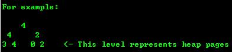
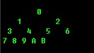
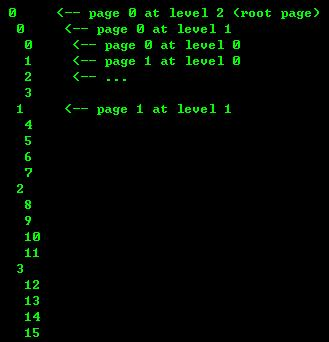

## PostgreSQL Free Space Map Principle    
                                        
### 作者                                           
digoal                                   
                                    
### 日期                                                                                                       
2010-05-11                                 
                                       
### 标签                                    
PostgreSQL , fsm             
                                                                                                          
----                                                                                                    
                                                                                                             
## 背景      
在说FSM之前，先回顾一个PostgreSQL的Limit    
    
```    
Limit   Value    
Maximum Database Size   Unlimited    
Maximum Table Size      32 TB    
Maximum Row Size        1.6 TB    
Maximum Field Size      1 GB    
Maximum Rows per Table  Unlimited    
Maximum Columns per Table       250 – 1600 depending on column types    
Maximum Indexes per Table       Unlimited    
```    
    
表最大可到32T=2^32*8K  (8K 代表一个PAGE),换句话说,一个表最多有2^32个数据块. 记牢这个数字,后面会出现。    
    
最近刚好看了一下PostgreSQL8.4.3的源代码对free space map的介绍，把我的理解写到下面：仅供参考.有兴趣的朋友可以与我线下交流。    
    
## Free Space Map    
    
FSM的目标是快速定位有足够空间用于存储一行的PAGE，或用于判断relation的存储是否需要扩展PAGE。自从8.4一后,FSM被存储在对象相关的”fork”出的文件里（每个表、索引对象有对应的FSM文件，用户不需要管它）。而在以前的版本，FSM是系统启动时分配的静态内存区域（这样的话参数还需要和数据库容量相关，很不合适）。    
    
为了加快扫描速度，保持FSM越小越好。从而，FSM并不存储PAGE的精确剩余空间。每个PAGE消耗1个字节用于记录DATA BLOCK的剩余空间，因此FSM记录的粒度为256, 或者说PAGE（DATA BLOCK）被切割成2^8=256分片被跟踪。另外，由于PAGE（DATA BLOCK）的头部、ITEM POINT需要消耗部分存储，所以剩余空间的值必然小于BLCKSZ,最大MAP值为255。    
    
为了达到快速搜索的目的，FSM PAGES并非简单的排列，而是存储为树型结构，PAGES如此，PAGE内部也是如此。    
    
## FSM page structure    
    
在FSM的内部，使用二元数结构(binary tree)存储，每个页节点（1 byte）对应一个HEAP PAGE的剩余空间（如果是多级FSM，则也可以表示lower level FSM page的ROOT 节点的 VALUE），非页节点存储下级节点(FSM NODE OR FSM page)的大值。    
    
图例    
    
    
    
### FSM PAGE的两种基本操作 (搜索与更新)：    
    
1、搜索一个页面，需要有X（X代表数字）的剩余空间,从树的顶端开始搜索n >= X，直到找到一个节点为止，如果有多个节点满足条件,可以随意取一个节点（可以根据策略，取哪一个，比如就近策略则可能取上次取过的BLOCK）。    
    
2、更新一个页面的剩余空间到X，首先UPDATE leaf node，然后用冒泡算法一直往上更新（比较两个LEAF节点的值，取大值）。直到满足不能再更新的条件为止。    
    
### 二元数结构的好处：    
    
发现不满足X的剩余空间的节点，只需要查看根节点的值。    
    
这种结构下可以实施优化满足条件的算法，如：并发条件下，当有多个节点满足剩余空间的条件时，可以使用prefetch策略，负载均衡策略等。提高性能    
    
上层程序访问FSM时，使用fsm_set_avail() and fsm_search_avail() 函数，这些函数的接口隐藏了FSM的内部结构，把FSM当成有特定数量的SLOT用于存储FSI的黑盒来处理，因此所有上层程序不需要了解FSM的内部结构，只管调用fsm_set_avail() and fsm_search_avail()。    
    
在FSM页面的内部，使用ARRAY来存储二元数结构，但是由于FSM PAGE有头信息，在头上会耗费一定的空间，所以二元数结构在这种情形下并不是一个很好的结构。为什么这么说呢，因为PAGE刚好是2的次方，二元树结构需要占用的空间也是2的次方，在消耗了部分头部的情况下，二元数结构在一个PAGE里面就存储不完了，会丢失最右边的一些LEAF node（不过不要紧，我们就认为一个FSM PAGE能跟踪的HEAP BLOCK数一定小于2^n即可）。    
    
如图    
    
    
    
B右边的LEAF NODE信息都丢失了。    
    
数字在这里代表的是ARRAY存储中的位置(数组下标)。    
    
### next slot pointer for FSM    
    
fp_next_slot,决定一个PAGE中剩余空间的下一个搜索从哪里开始。这样做的目的是避免热块的产生，当有多个数据库进程请求插入同一个表时，有了fp_next_slot，数据可以插入到不同的PAGE中.同时，考虑到磁盘离散扫描将大大消耗磁盘的IO，所以在并发搜索PAGE的情况下fp_next_slot需要尽量返回靠的很近的PAGE，以满足操作系统级的 prefetching and batched writes.    
    
### Higher-level structure    
    
前面说到FSM PAGE的LEAF节点可以存储PAGE的剩余空间 ， 也可以存储来自底层FSM PAGE的根节点的值（换句话说是底层这个FSM PAGE存储的PAGE的剩余空间），同样是树结构存储。    
    
说了这么久，终于找到根源了，FSM PAGE的根，被存储在BLOCK 0的位置。    
    
看图，假设一个FSM PAGE可以跟踪4个HEAP PAGE的信息（真实情况下应该存储（(BLCKSZ – headers) / 2, or ~4000 with default BLCKSIZE（8K））个HEAP PAGE的信息），即FSM PAGE叶子node的数大概是4000个。      
    
    
    
数字代表的是该级别下的FSM PAGE NUMBER，在通过SEARCH算法找到了FSM的LEAF NODE后，接下来就需要定位到表的PAGE了，表的PAGE实际上是通过FSM LEAF NODE的位置号算出来的，公式如下    
    
```    
y = n + (n / F + 1) + (n / F^2 + 1) + … + 1    
    
where F is the fanout (4 in the above example).   
  
The first term n is the number of preceding leaf pages, the second term is the number of pages at level 1, and so forth.    
```    
    
为了使算法足够简单，FSM树结构的级别应该是一个固定值，考虑到前面说的一个表最大有32T, 2^32个HEAP PAGE, 那么在默认HEAP BLCKSZ=8K的情况下，FSM使用三级树已经可以满足。( 4000^3 > 2^32 )    
  
4000即为fsm page内部的leaf node的个数。    
    
## 寻址：    
    
上层程序使用逻辑寻址，包含  
  
1\. 级别，  
  
2\. 逻辑PAGE号，  
  
3\. slot（如果可用）    
    
最底层的FSM PAGE级别为0，中间的级别为1，根节点的级别为2。从上面的图上看出，FSM PAGE的逻辑号为标注的数字，从0开始计算。    
    
## 锁：    
    
从上至下搜索FSM PAGE时，同一时刻只有一个PAGE被锁，锁子PAGE前必须先释放父PAGE的锁，如果子PAGE同时正在被修改，并且没有其他子PAGE能够满足请求的剩余空间，这个时候为了避免死循环，正在申请空间的这个进程将等待子PAGE的父PAGE更新剩余空间后继续。    
    
搜索PAGE时使用的是shared buffer locks，更新PAGE时使用的是 exclusive buffer lock。尽管如此，下一个slot search pointer的值在shared buffer locks模式下也将被更新。fp_next_slot只是一个计数器，在CORRUPTED后可以被重置。所以尽管冒点风险使用fp_next_slot还是优于使用独占锁模式。    
    
## 恢复：    
    
FSM不记录WAL，而是使用自修复机制来恢复异常情况。    
    
首先，无论何时设置一个FSM PAGE节点的值，在冒泡算法执行完后，都需要去比较一下ROOT节点的值，小了的话就马上修复。防止这个FSM PAGE根数据太小。    
    
其次，如果检查到页面CORRUPT了，马上使用冒泡算法修正FSM PAGE节点的值。    
    
VACUUM操作更新所有的最底层的FSM PAGE NODE值，修正过期的FREE SPACE值。FreeSpaceMapVacuum在VACUUM过后被调用，FSM PAGE将被从下至上扫描一遍。修正一些FSM PAGE(upper and lower)之间的分歧数据.    
    
## 参考  
src/backend/storage/freespace/README     
      
https://www.postgresql.org/docs/10/static/pgfreespacemap.html    
    
<a rel="nofollow" href="http://info.flagcounter.com/h9V1"  ></a>    
    
  
  
  
  
  
## [digoal's 大量PostgreSQL文章入口](https://github.com/digoal/blog/blob/master/README.md "22709685feb7cab07d30f30387f0a9ae")
  
