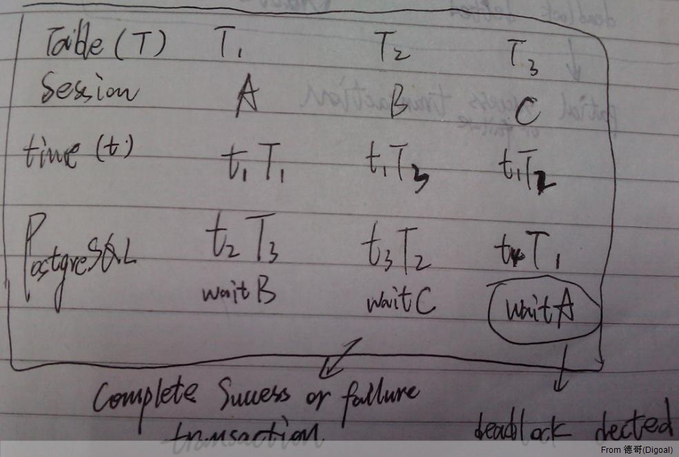
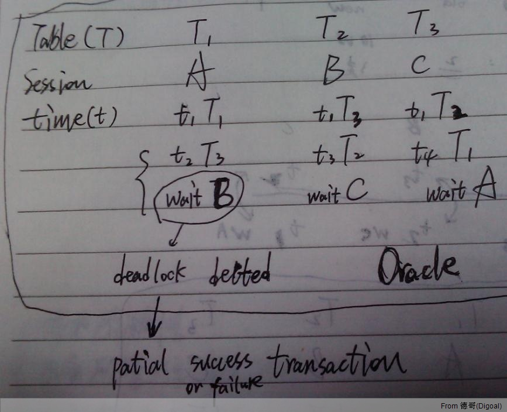

## Compare PostgreSQL and Oracle dead lock detect and transaction  
                                    
### 作者                                                                                 
digoal                               
                                      
### 日期                                 
2011-04-08                             
                                  
### 标签                               
PostgreSQL , Oracle , dead lock              
                                    
----                              
                                       
## 背景      
Oracle 和 PostgreSQL的死锁检测和处理有较大区别。  
  
主要差别在于 :   
  
1\. 死锁被检测到的属于哪个SESSION？Oracle随机检出，从实验来看应该是第一个启动的死锁事务。而PostgreSQL是死锁发生时的最后一个事务，与ORACLE相反（从PG的deadlock_timeout参数可以看出PostgreSQL的死锁检测不是随机的，而是可预见的。This is the amount of time, in milliseconds, to wait on a lock before checking to see if there is a deadlock condition.）。  
  
2\. 死锁被检测到之后的处理上的差别，oracle允许单个事务中的部分SQL执行成功,部分SQL执行失败(其实这是非常严重的缺陷)。而PostgreSQL不允许事务中的部分SQL语句执行成功，要么全部成功，要么全部失败。  
  
如图:  
  
PostgreSQL 模拟死锁场景和检测结果，  
  
  
   
Oracle 模拟死锁场景和检测结果，  
  
  
   
## PostgreSQL
  
```  
deadlock_timeout = 1s  
```  
  
死锁检查会消耗部分数据库资源,如果数据库压力比较大的话可以考虑调大这个值。  
  
SESSION A :  
  
```  
digoal=> begin;  
BEGIN  
Time: 0.122 ms  
digoal=> update tbl_test set id=id+1 where id=100;  
UPDATE 1  
Time: 0.379 ms  
```  
  
SESSION B :  
  
```  
digoal=> begin;  
BEGIN  
Time: 0.126 ms  
digoal=> update tbl_test2 set id=id+1 where id=100;  
UPDATE 1  
Time: 0.437 ms  
```  
  
SESSION C :  
  
```  
digoal=> begin;  
BEGIN  
digoal=> update tbl_test1 set id=id+1 where id=100;  
UPDATE 1  
```  
  
SESSION A :  
  
```  
digoal=> update tbl_test2 set id=id+2 where id=100;  
```  
  
SESSION B :  
  
```  
digoal=> update tbl_test1 set id=id+3 where id=100;  
```  
  
SESSION C :  
  
```  
digoal=> update tbl_test set id=id+4 where id=100;  
ERROR:  deadlock detected  
DETAIL:  Process 11953 waits for ShareLock on transaction 4232; blocked by process 2873.  
Process 2873 waits for ShareLock on transaction 4233; blocked by process 6616.  
Process 6616 waits for ShareLock on transaction 4234; blocked by process 11953.  
HINT:  See server log for query details.  
```  
  
SESSION B :  
  
```  
UPDATE 1  
Time: 7839.728 ms  
```  
  
SESSION A :  
  
```  
UPDATE 0  
Time: 40903.601 ms  
digoal=> commit;  
COMMIT  
Time: 0.099 ms  
```  
  
SESSION C :  
  
```  
digoal=> commit;  
ROLLBACK  
Time: 0.196 ms  
```  
  
注意到在PostgreSQL中，整个SESSION C回滚了。  
  
这个和psql的默认配置有关 :   
  
```  
	   ON_ERROR_ROLLBACK  
               When on, if a statement in a transaction block generates an error, the error is ignored and the  
               transaction continues. When interactive, such errors are only ignored in interactive sessions, and not  
               when reading script files. When off (the default), a statement in a transaction block that generates an  
               error aborts the entire transaction. The on_error_rollback-on mode works by issuing an implicit  
               SAVEPOINT for you, just before each command that is in a transaction block, and rolls back to the  
               savepoint on error.  
  
           ON_ERROR_STOP  
               By default, command processing continues after an error. When this variable is set, it will instead  
               stop immediately. In interactive mode, psql will return to the command prompt; otherwise, psql will  
               exit, returning error code 3 to distinguish this case from fatal error conditions, which are reported  
               using error code 1. In either case, any currently running scripts (the top-level script, if any, and  
               any other scripts which it may have in invoked) will be terminated immediately. If the top-level  
               command string contained multiple SQL commands, processing will stop with the current command.  
```  
  
如果开启ON_ERROR_ROLLBACK, 会在每一句SQL前设置隐形的savepoint, 可以继续下面的SQL, 而不用全部回滚, 如下 :   
  
```  
postgres=# \set ON_ERROR_ROLLBACK on  
postgres=# begin;  
BEGIN  
postgres=# insert into t values (1);  
ERROR:  relation "t" does not exist  
LINE 1: insert into t values (1);  
                    ^  
postgres=# \dt  
No relations found.  
postgres=# create table t (id int);  
CREATE TABLE  
postgres=# insert into t values (1);  
INSERT 0 1  
postgres=# insert into t values ('a');  
ERROR:  invalid input syntax for integer: "a"  
LINE 1: insert into t values ('a');  
                              ^  
postgres=# commit;  
COMMIT  
postgres=# select * from t;  
 id   
----  
  1  
(1 row)  
  
postgres=# \set ON_ERROR_ROLLBACK off  
postgres=# begin;  
BEGIN  
postgres=# insert into t values (1);  
INSERT 0 1  
postgres=# insert into t values ('a');  
ERROR:  invalid input syntax for integer: "a"  
LINE 1: insert into t values ('a');  
                              ^  
postgres=# commit;  
ROLLBACK  
postgres=# select * from t;  
 id   
----  
  1  
(1 row)  
```  
  
## Oracle
  
SESSION A:  
  
```  
SQL> update tbl_test set id=id+1 where id=100;  
1 row updated.  
Elapsed: 00:00:00.00  
```  
  
SESSION B:  
  
```  
SQL>  update tbl_test2 set id=id+1 where id=100;  
1 row updated.  
Elapsed: 00:00:00.01  
```  
  
SESSION C:  
  
```  
SQL>  update tbl_test1 set id=id+1 where id=100;  
1 row updated.  
Elapsed: 00:00:00.00  
```  
  
SESSION A:  
  
```  
SQL>  update tbl_test2 set id=id+2 where id=100;  
```  
  
SESSION B:  
  
```  
SQL>  update tbl_test1 set id=id+3 where id=100;  
0 rows updated.  
Elapsed: 00:00:39.50  
```  
  
SESSION C:  
  
```  
SQL>  update tbl_test set id=id+4 where id=100;  
0 rows updated.  
Elapsed: 00:00:17.34  
```  
  
SESSION A:  
  
```  
SQL>  update tbl_test2 set id=id+2 where id=100  
        *  
ERROR at line 1:  
ORA-00060: deadlock detected while waiting for resource  
Elapsed: 00:00:18.05  
```  
  
SESSION A:  
  
```  
SQL> commit;  
Commit complete.  
Elapsed: 00:00:00.01  
```  
  
SESSION B:  
  
```  
SQL> commit;  
Commit complete.  
Elapsed: 00:00:00.00  
```  
  
SESSION C:  
  
```  
SQL> commit;  
Commit complete.  
Elapsed: 00:00:00.01  
```  
  
显然，ORACLE的SESSION A检测到了死锁，并且COMMIT后SESSION A部分SQL执行成功。  
  
```  
SQL> select * from tbl_test where id>=100;  
        ID  
----------  
       101  
Elapsed: 00:00:00.00  
```  
  
Oracle 允许事务中部分SQL执行成功, 可能会带来一些比较麻烦的问题, 如下.  
  
举个简单的例子:充值。  
  
A花了100元购买100个斯凯币。  
  
```  
update tbl_account_rmb set amount=amount-100 where id='A';  
success  
update tbl_account_kb set amount=amount+100 where id='A';  
deadlock,failed.  
commit;  
```  
  
此时A的100元花出去了，但是KB没有充值到账。  
  
<a rel="nofollow" href="http://info.flagcounter.com/h9V1"  ></a>  
  
  
  
  
  
  
## [digoal's 大量PostgreSQL文章入口](https://github.com/digoal/blog/blob/master/README.md "22709685feb7cab07d30f30387f0a9ae")
  
