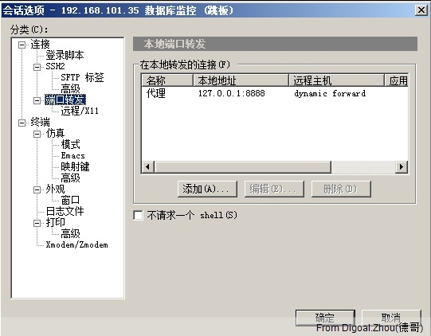
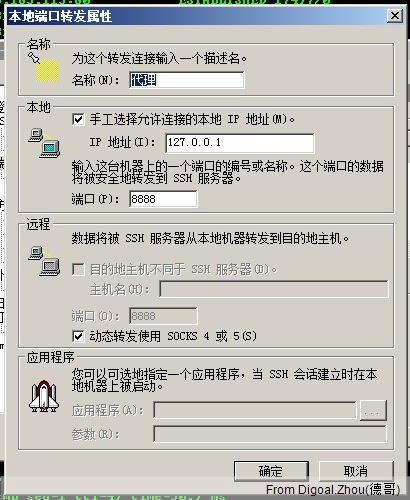
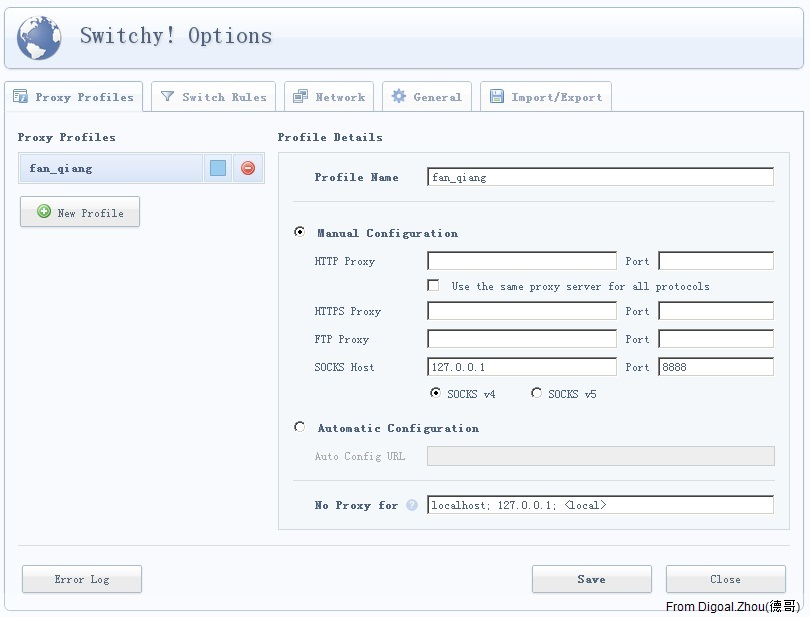
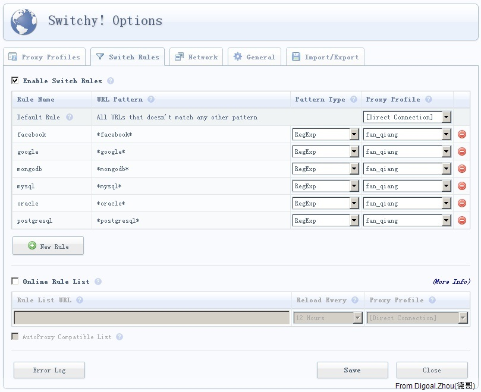
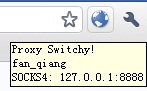

## Use SecureCRT and Chrome & Proxy Switchy! Plugin  
                                     
### 作者                                     
digoal                                      
                                        
### 日期                                      
2011-05-18                                                              
                                      
### 标签                                                                                                                                                      
Linux , ssh , 端口代理    
                                  
----                                      
                                    
## 背景    
最近在单位上外国的网站经常上不去，包括PostgreSQL , mongoDB , Oracle , MySQL等,都上不去了。  
  
但是用手机或3G无线上网卡都可以上这些网站，包括在IDC的服务器也可以访问这些网站，后来据说是针对企业网做了出口过滤。  
  
在网上找了一下，有很多可以通过SSH代理来翻墙的说法。  
  
当然，我这里的目的不是翻墙，主要是需要访问以上的技术网站。  
  
我这里的做法是选中一台IDC的LINUX服务器，使用SecureCRT连接过去，然后开启一个隧道。结合GOOGLE CHROME的插件来实现代理上网。  
  
1\. 选中一台IDC的LINUX主机，使用SecureCRT连接过去。  
  
选项  -  回话选项  -  端口转发  -  编辑(本地端口转发属性) :   
  
  
  
  
   
这里添加一个本地监听端口8888，在127.0.0.1上面监听（比较安全）。  
  
远程选择 动态转发使用SOCKS 4 或 5 .   
  
2\. 查看本地监听  
  
```  
cmd  
netstat -ao  
 TCP    127.0.0.1:8888         BJB0152:0              LISTENING       5676  
```  
  
3\. 下载安装chrome  
  
4\. 安装chrome插件Proxy Switchy!  
  
建议到这里下载  
  
http://code.google.com/p/switchy/downloads/list  
  
5\. 配置Proxy Switchy!插件  
  
定义profile  
  
  
   
定义规则  
  
默认规则是直连，不通过Switchy  
  
其他的规则使用前面定义的profile  
  
  
   
使用Auto Switch Mode模式,或者选择fan_qiang 那么所有的都走fan_qiang这个profile.  
  
   
  
  
  
注意SAVE  
  
6\. 访问一个使用PROFILE来连接的网站，如我这里设置的www.google.com.hk  
  
7\. 在LINUX主机上看看有没有产生流量  
  
```  
[root@digoal.zhou ~]# netstat -anp|grep \:80  
tcp        0      0 192.168.101.35:19200        64.233.183.139:80           ESTABLISHED 3455/0                
tcp        0      0 192.168.101.35:56544        220.181.9.71:80             ESTABLISHED 3455/0                
tcp        0      0 192.168.101.35:56553        220.181.9.71:80             TIME_WAIT   -                     
tcp        0      0 192.168.101.35:25647        220.181.31.179:80           ESTABLISHED 3455/0                
tcp        0      0 192.168.101.35:25644        220.181.31.179:80           CLOSE_WAIT  3455/0                
tcp        0      0 192.168.101.35:25638        220.181.31.179:80           ESTABLISHED 3455/0                
tcp        0      0 192.168.101.35:19359        74.125.53.101:80            ESTABLISHED 3455/0                
tcp        0      0 192.168.101.35:37037        220.181.76.42:80            ESTABLISHED 3455/0                
tcp        0      0 192.168.101.35:45819        220.181.31.180:80           CLOSE_WAIT  3455/0                
tcp        0      0 192.168.101.35:45827        220.181.31.180:80           CLOSE_WAIT  3455/0                
tcp        0      0 192.168.101.35:42864        64.233.183.102:80           ESTABLISHED 3455/0                
tcp        0      0 192.168.101.35:43801        220.181.72.147:80           ESTABLISHED 3455/0                
tcp        0      0 192.168.101.35:64581        220.181.76.43:80            ESTABLISHED 3455/0                
tcp        0      0 192.168.101.35:41506        220.181.76.51:80            CLOSE_WAIT  3455/0                
tcp        0      0 192.168.101.35:41505        220.181.76.51:80            CLOSE_WAIT  3455/0                
tcp        0      0 192.168.101.35:55549        123.58.180.5:80             CLOSE_WAIT  3455/0                
tcp        0      0 192.168.101.35:46275        220.181.9.72:80             ESTABLISHED 3455/0  
```  
  
                                                                                                  
                                                       
  
<a rel="nofollow" href="http://info.flagcounter.com/h9V1"  ></a>  
  
  
  
  
  
  
## [digoal's 大量PostgreSQL文章入口](https://github.com/digoal/blog/blob/master/README.md "22709685feb7cab07d30f30387f0a9ae")
  
