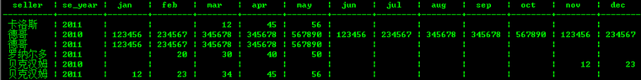
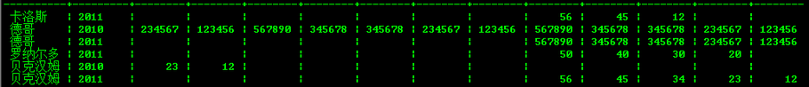

## 行列变换 - Use tablefunc complete row & column cross display in PostgreSQL    
                    
### 作者                                                                 
digoal               
                      
### 日期                 
2011-06-12                
                  
### 标签               
PostgreSQL , 行列变换 , tablefunc        
                    
----              
                       
## 背景              
一般在提交报表的时候，可能会使用到对数据表的行列变换的需求。  
  
如以下数据:  
  
```  
digoal=> select * from tbl_sellers_info order by seller,se_year,se_month;  
  seller  | se_year | se_month | se_amount   
----------+---------+----------+-----------  
 卡洛斯   |    2011 |        3 |        12  
 卡洛斯   |    2011 |        4 |        45  
 卡洛斯   |    2011 |        5 |        56  
 德哥     |    2010 |        1 |    123456  
 德哥     |    2010 |        2 |    234567  
 德哥     |    2010 |        3 |    345678  
 德哥     |    2010 |        4 |    345678  
 德哥     |    2010 |        5 |    567890  
 德哥     |    2010 |        6 |    123456  
 德哥     |    2010 |        7 |    234567  
 德哥     |    2010 |        8 |    345678  
 德哥     |    2010 |        9 |    345678  
 德哥     |    2010 |       10 |    567890  
 德哥     |    2010 |       11 |    123456  
 德哥     |    2010 |       12 |    234567  
 德哥     |    2011 |        1 |    123456  
 德哥     |    2011 |        2 |    234567  
 德哥     |    2011 |        3 |    345678  
 德哥     |    2011 |        4 |    345678  
 德哥     |    2011 |        5 |    567890  
 罗纳尔多 |    2011 |        2 |        20  
 罗纳尔多 |    2011 |        3 |        30  
 罗纳尔多 |    2011 |        4 |        40  
 罗纳尔多 |    2011 |        5 |        50  
 贝克汉姆 |    2010 |       11 |        12  
 贝克汉姆 |    2010 |       12 |        23  
 贝克汉姆 |    2011 |        1 |        12  
 贝克汉姆 |    2011 |        2 |        23  
 贝克汉姆 |    2011 |        3 |        34  
 贝克汉姆 |    2011 |        4 |        45  
 贝克汉姆 |    2011 |        5 |        56  
(31 rows)  
```  
  
例如要按照每个SELLER出具每年的月度销售情况，可能需要进行行列变换。  
   
  
  
在PostgreSQL9.1里面有一个比较好用的extension，tablefunc，可以轻松的完成行列转换。  
  
下面会有例子来简单的描述以下这个extension.  
  
1\. 安装tablefunc extension.  
  
```  
\c digoal postgres  
You are now connected to database "digoal" as user "postgres".  
digoal=# create extension tablefunc;  
CREATE EXTENSION  
digoal=# \c digoal digoal  
You are now connected to database "digoal" as user "digoal".  
```  
  
安装完后会创建几个TYPE,几个函数.\  
  
```  
type:  
CREATE TYPE tablefunc_crosstab_N AS (     row_name TEXT,     category_1 TEXT,     category_2 TEXT,         .         .         .     category_N TEXT );  
 public | tablefunc_crosstab_2 | tablefunc_crosstab_2 | tuple |          |   
 public | tablefunc_crosstab_3 | tablefunc_crosstab_3 | tuple |          |   
 public | tablefunc_crosstab_4 | tablefunc_crosstab_4 | tuple |          |   
  
function  
normal_rand(int numvals, float8 mean, float8 stddev) returns setof float8  
crosstab(text sql) crosstab(text sql, int N)  
crosstabN(text sql)  
crosstab(text source_sql, text category_sql)  
connectby(text relname, text keyid_fld, text parent_keyid_fld           [, text orderby_fld ], text start_with, int max_depth           [, text branch_delim ])  
```  
  
2\. 创建测试表  
  
```  
create table tbl_sellers_info (seller text,se_year int,se_month int,se_amount int);  
insert into tbl_sellers_info values ('德哥',2011,01,123456);  
insert into tbl_sellers_info values ('德哥',2011,02,234567);  
insert into tbl_sellers_info values ('德哥',2011,03,345678);  
insert into tbl_sellers_info values ('德哥',2011,04,345678);  
insert into tbl_sellers_info values ('德哥',2011,05,567890);  
insert into tbl_sellers_info values ('贝克汉姆',2011,01,12);  
insert into tbl_sellers_info values ('贝克汉姆',2011,02,23);  
insert into tbl_sellers_info values ('贝克汉姆',2011,03,34);  
insert into tbl_sellers_info values ('贝克汉姆',2011,04,45);  
insert into tbl_sellers_info values ('贝克汉姆',2011,05,56);  
insert into tbl_sellers_info values ('卡洛斯',2011,03,12);  
insert into tbl_sellers_info values ('卡洛斯',2011,04,45);  
insert into tbl_sellers_info values ('卡洛斯',2011,05,56);  
insert into tbl_sellers_info values ('罗纳尔多',2011,02,20);  
insert into tbl_sellers_info values ('罗纳尔多',2011,03,30);  
insert into tbl_sellers_info values ('罗纳尔多',2011,04,40);  
insert into tbl_sellers_info values ('罗纳尔多',2011,05,50);  
insert into tbl_sellers_info values ('德哥',2010,01,123456);  
insert into tbl_sellers_info values ('德哥',2010,02,234567);  
insert into tbl_sellers_info values ('德哥',2010,03,345678);  
insert into tbl_sellers_info values ('德哥',2010,04,345678);  
insert into tbl_sellers_info values ('德哥',2010,05,567890);  
insert into tbl_sellers_info values ('德哥',2010,06,123456);  
insert into tbl_sellers_info values ('德哥',2010,07,234567);  
insert into tbl_sellers_info values ('德哥',2010,08,345678);  
insert into tbl_sellers_info values ('德哥',2010,09,345678);  
insert into tbl_sellers_info values ('德哥',2010,10,567890);  
insert into tbl_sellers_info values ('德哥',2010,11,123456);  
insert into tbl_sellers_info values ('德哥',2010,12,234567);  
insert into tbl_sellers_info values ('贝克汉姆',2010,11,12);  
insert into tbl_sellers_info values ('贝克汉姆',2010,12,23);  
```  
  
3\. 下面我们用crosstab(text source_sql, text category_sql) 来满足需求.  
  
```  
select substr(seller,1,char_length(seller)-4) seller,substr(seller,char_length(seller)-3) se_year,jan  ,feb  ,mar  ,apr  ,may  ,jun  ,jul  ,aug  ,sep  ,oct  ,nov  ,dec from crosstab('select seller||se_year,se_month,se_amount from tbl_sellers_info order by 1',   
'select distinct se_month from tbl_sellers_info order by 1') as (seller text,Jan numeric,feb numeric,mar numeric,apr numeric,may numeric,jun numeric,jul numeric,aug numeric,sep numeric,oct numeric,nov numeric,dec numeric) order by 1,2;  
```  
  
```
select 
  substr(seller,1,char_length(seller)-4) seller,  
  substr(seller,char_length(seller)-3) se_year,  
  jan  ,
  feb  ,
  mar  ,
  apr  ,
  may  ,
  jun  ,
  jul  ,
  aug  ,
  sep  ,
  oct  ,
  nov  ,
  dec 
from crosstab(
  'select seller||se_year, se_month, se_amount from tbl_sellers_info order by 1',   -- 这个是需要进行行列变换的源SQL
  'select distinct se_month from tbl_sellers_info order by 1'  -- 这个在这里代表的是月份，也就是se_month的值
) 
as   -- crosstab 输出格式
(  seller text,
   Jan numeric,
   feb numeric,
   mar numeric,
   apr numeric,
   may numeric,
   jun numeric,
   jul numeric,
   aug numeric,
   sep numeric,
   oct numeric,
   nov numeric,
   dec numeric
) 
order by 1,2;
```
  
分析一下这个函数:  
  
参数一:(这个是需要进行行列变换的源SQL)  
  
```  
select seller||se_year,se_month,se_amount from tbl_sellers_info order by 1  
```  
  
参数二:(这个在这里代表的是月份，也就是se_month的值)  
  
```  
select distinct se_month from tbl_sellers_info order by 1  
```  
  
或者  
  
```  
select * from generate_series(1,12) order by 1  
```  
  
出来的结果都是一样的。  
  
输出:  
  
```  
(seller text,Jan numeric,feb numeric,mar numeric,apr numeric,may numeric,jun numeric,jul numeric,aug numeric,sep numeric,oct numeric,nov numeric,dec numeric)  
```  
  
seller代表的是seller||se_year,这里必须这么做，因为需要按照这个来分组.  
  
后面的就是月份了，数据类型是和se_amount一致就行了。  
  
输出结果就是前面提到的图片。  
  
行记录中没有的月份在变换后该月数据为空.例如卡洛斯只有2011年的3,4,5月份有数据，那么其他月份就是空白的。  
  
另外一个要注意的是，输出结果的顺序是select * from generate_series(1,12) order by 1来决定的.  
  
例如  
  
```  
select * from generate_series(1,12) order by 1 desc   
```  
  
那么输出的顺序就是反的,因此必须严格的排序.  
  
  
  
```
  seller  | se_year |  jan   |  feb   |  mar   |  apr   |  may   |  jun   |  jul   |  aug   |  sep   |  oct   |  nov   |  dec   
----------+---------+--------+--------+--------+--------+--------+--------+--------+--------+--------+--------+--------+--------
 卡洛斯   | 2011    |        |        |     12 |     45 |     56 |        |        |        |        |        |        |       
 德哥     | 2010    | 123456 | 234567 | 345678 | 345678 | 567890 | 123456 | 234567 | 345678 | 345678 | 567890 | 123456 | 234567
 德哥     | 2011    | 123456 | 234567 | 345678 | 345678 | 567890 |        |        |        |        |        |        |       
 罗纳尔多 | 2011    |        |     20 |     30 |     40 |     50 |        |        |        |        |        |        |       
 贝克汉姆 | 2010    |        |        |        |        |        |        |        |        |        |        |     12 |     23
 贝克汉姆 | 2011    |     12 |     23 |     34 |     45 |     56 |        |        |        |        |        |        |       
(6 rows)
```
   
  
另外的几个crosstab函数用法与此类似,只不过没有这个灵活。  
  
而normal_rand用于返回一系列正态分布值。connect_by用于做异构查询（前面我有写过用with rescursive来实现）。就不再演示。  
  
## 参考  
  
http://www.postgresql.org/docs/9.1/static/tablefunc.html  

  
<a rel="nofollow" href="http://info.flagcounter.com/h9V1"  ></a>  
  
  
  
  
  
  
## [digoal's 大量PostgreSQL文章入口](https://github.com/digoal/blog/blob/master/README.md "22709685feb7cab07d30f30387f0a9ae")
  
