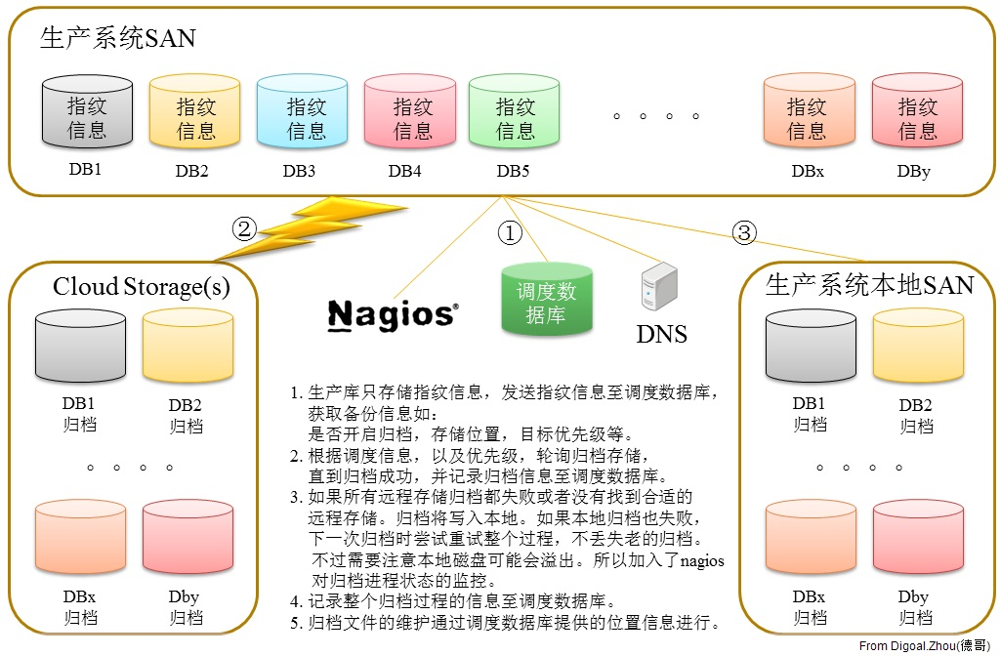
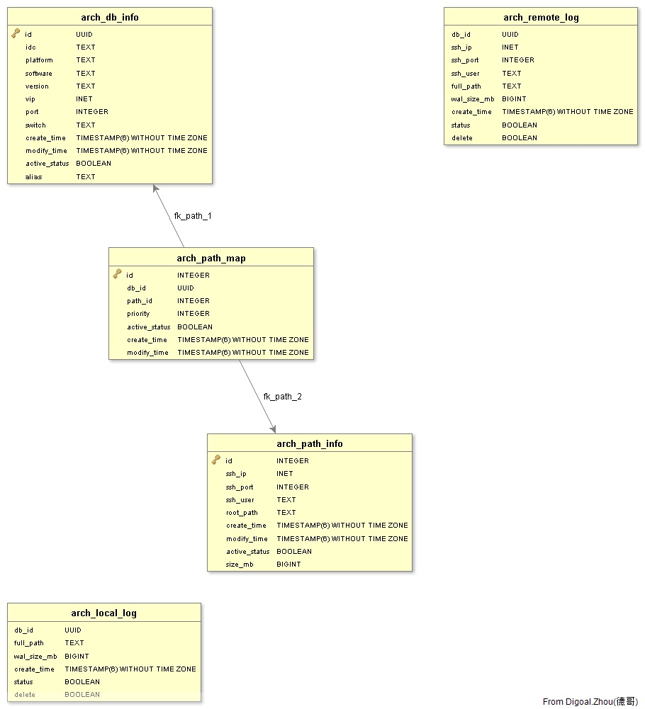

## PostgreSQL Archived in the Cloud  
                  
### 作者                                     
digoal                                      
                  
### 日期                                      
2011-06-23                                                                
                  
### 标签                  
PostgreSQL , 监控 , 流式监控 , 云归档                                             
                  
----                  
                  
## 背景                                
建立一个集中调度的PostgreSQL归档系统。  
  
特点:  
  
1\. 生产库存储指纹信息。  
  
2\. 调度库存储  
  
指纹信息，以及生产库的其他补充信息。  
  
归档服务器（存储）信息。  
  
生产库与归档服务器的映射信息，包括优先级信息等等。  
  
归档日志信息。  
  
3\. DNS存储环境IP与域名信息。  
  
4\. Nagios 负责实时监控归档状态信息。  
  
方案概貌 :   
  
  
  
数据结构:  
  
```  
digoal=> \d arch_db_info  
               Table "digoal.arch_db_info"  
    Column     |            Type             | Modifiers   
---------------+-----------------------------+-----------  
 id            | uuid                        | not null  
 idc           | text                        |   
 platform      | text                        |   
 software      | text                        |   
 version       | text                        |   
 vip           | inet                        |   
 port          | integer                     |   
 create_time   | timestamp without time zone |   
 modify_time   | timestamp without time zone |   
 active_status | boolean                     |   
Indexes:  
    "arch_db_info_pkey" PRIMARY KEY, btree (id)  
    "uk_db_info_1" UNIQUE, btree (idc, vip, port)  
Referenced by:  
    TABLE "arch_path_map" CONSTRAINT "fk_path_1" FOREIGN KEY (db_id) REFERENCES arch_db_info(id)  
  
digoal=> \d arch_path_info  
              Table "digoal.arch_path_info"  
    Column     |            Type             | Modifiers   
---------------+-----------------------------+-----------  
 id            | integer                     | not null  
 ssh_ip        | inet                        |   
 ssh_port      | integer                     |   
 ssh_user      | text                        |   
 root_path     | text                        |   
 create_time   | timestamp without time zone |   
 modify_time   | timestamp without time zone |   
 active_status | boolean                     |   
Indexes:  
    "arch_path_info_pkey" PRIMARY KEY, btree (id)  
    "uk_path_info_1" UNIQUE, btree (ssh_ip, ssh_port, root_path)  
Referenced by:  
    TABLE "arch_path_map" CONSTRAINT "fk_path_2" FOREIGN KEY (path_id) REFERENCES arch_path_info(id)  
  
digoal=> \d arch_path_map  
              Table "digoal.arch_path_map"  
    Column     |            Type             | Modifiers   
---------------+-----------------------------+-----------  
 id            | integer                     | not null  
 db_id         | uuid                        |   
 path_id       | integer                     |   
 priority      | integer                     |   
 active_status | boolean                     |   
 create_time   | timestamp without time zone |   
 modify_time   | timestamp without time zone |   
Indexes:  
    "arch_path_map_pkey" PRIMARY KEY, btree (id)  
    "uk_path_map_1" UNIQUE, btree (db_id, path_id)  
Foreign-key constraints:  
    "fk_path_1" FOREIGN KEY (db_id) REFERENCES arch_db_info(id)  
    "fk_path_2" FOREIGN KEY (path_id) REFERENCES arch_path_info(id)  
  
digoal=> \d arch_remote_log   
              Table "digoal.arch_remote_log"  
     Column     |            Type             | Modifiers   
----------------+-----------------------------+-----------  
 db_id          | uuid                        |   
 ssh_ip         | inet                        |   
 ssh_port       | integer                     |   
 ssh_user       | text                        |   
 full_path      | text                        |   
 wal_size_bytes | bigint                      |   
 create_time    | timestamp without time zone |   
 status         | boolean                     |   
  
digoal=> \d arch_local_log   
              Table "digoal.arch_local_log"  
     Column     |            Type             | Modifiers   
----------------+-----------------------------+-----------  
 db_id          | uuid                        |   
 full_path      | text                        |   
 wal_size_bytes | bigint                      |   
 create_time    | timestamp without time zone |   
 status         | boolean                     |   
```  
  
其他功能围绕集中调度开发。  
  
ER图:  
  
  
    
                                                                                                  
                                                        
  
  
  
  
  
  
  
  
  
  
  
  
  
  
  
  
  
  
  
  
  
  
  
  
  
  
  
  
  
  
  
  
  
  
  
  
  
  
  
  
  
  
  
  
  
  
  
  
  
  
  
  
  
  
  
  
  
  
  
  
  
  
  
  
  
  
  
  
  
  
  
  
  
#### [PostgreSQL 许愿链接](https://github.com/digoal/blog/issues/76 "269ac3d1c492e938c0191101c7238216")
您的愿望将传达给PG kernel hacker、数据库厂商等, 帮助提高数据库产品质量和功能, 说不定下一个PG版本就有您提出的功能点. 针对非常好的提议，奖励限量版PG文化衫、纪念品、贴纸、PG热门书籍等，奖品丰富，快来许愿。[开不开森](https://github.com/digoal/blog/issues/76 "269ac3d1c492e938c0191101c7238216").  
  
  
#### [9.9元购买3个月阿里云RDS PostgreSQL实例](https://www.aliyun.com/database/postgresqlactivity "57258f76c37864c6e6d23383d05714ea")
  
  
#### [PostgreSQL 解决方案集合](https://yq.aliyun.com/topic/118 "40cff096e9ed7122c512b35d8561d9c8")
  
  
#### [德哥 / digoal's github - 公益是一辈子的事.](https://github.com/digoal/blog/blob/master/README.md "22709685feb7cab07d30f30387f0a9ae")
  
  

  
  
#### [PolarDB 学习图谱: 训练营、培训认证、在线互动实验、解决方案、生态合作、写心得拿奖品](https://www.aliyun.com/database/openpolardb/activity "8642f60e04ed0c814bf9cb9677976bd4")
  
  
#### [购买PolarDB云服务折扣活动进行中, 55元起](https://www.aliyun.com/activity/new/polardb-yunparter?userCode=bsb3t4al "e0495c413bedacabb75ff1e880be465a")
  
  
#### [About 德哥](https://github.com/digoal/blog/blob/master/me/readme.md "a37735981e7704886ffd590565582dd0")
  
