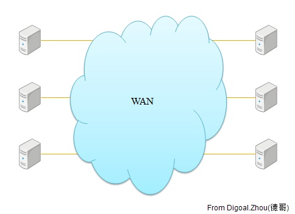
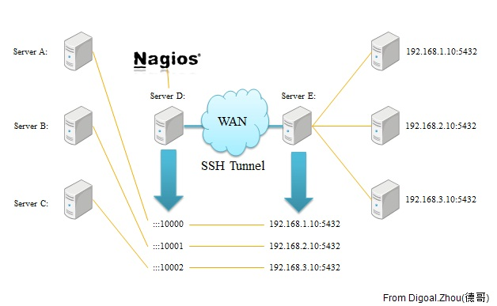
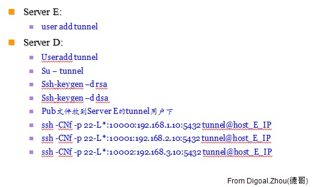
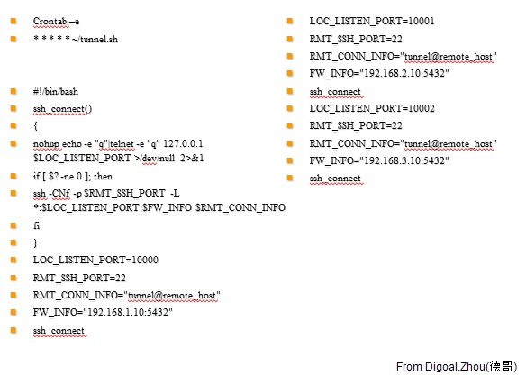
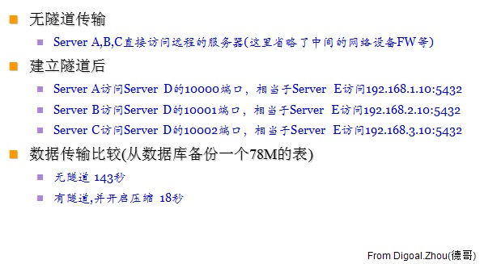
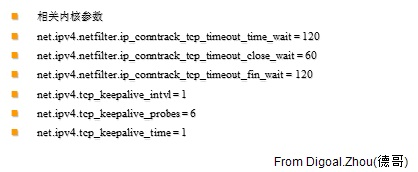

## ssh隧道加密压缩方法 - a simple wan speed method  
                                       
### 作者                                       
digoal                                        
                                          
### 日期                                        
2011-06-29                                                                
                                        
### 标签                                                                                                                                                        
Linux , ssh , 端口代理 , 隧道 , 传输压缩        
                                    
----                                        
                                      
## 背景      
前几天写过一篇用SSH TUNNEL加速PostgreSQL数据传输的BLOG  
  
http://blog.163.com/digoal@126/blog/static/163877040201152753352356/  
  
今天再把这个方法略微通俗化一下  
  
    
   
    
   
    
   
    
   
    
   
    
   
## 参考  
man ssh  
  
man ssh_config  
    
                                                                                                    
                                                         
  
  
  
  
  
  
  
  
## [digoal's 大量PostgreSQL文章入口](https://github.com/digoal/blog/blob/master/README.md "22709685feb7cab07d30f30387f0a9ae")
  
