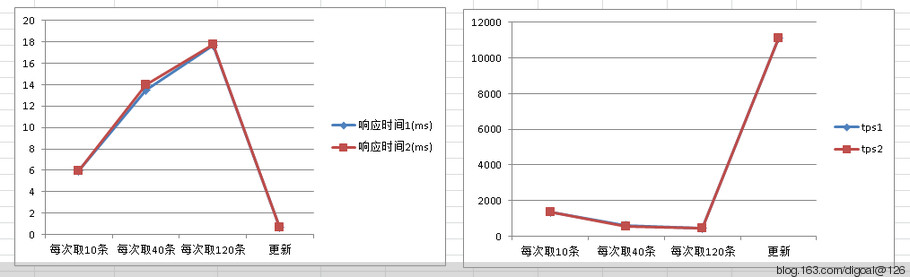

## PostgreSQL 9.1 nearest-neighbor search use gist index  
                                      
### 作者                                      
digoal                                      
                                      
### 日期                                      
2011-10-18                                    
                                      
### 标签                                      
PostgreSQL , knn , 近邻查询 , gist , 地理位置 , O2O    
                                      
----                                      
                                      
## 背景                         
PostgreSQL 9.1 新增了gist索引按近邻来排序的操作符(order by operator)。  
  
例如：  
  
```  
digoal=>  create table gist_test (id serial primary key,location point);  
NOTICE:  CREATE TABLE will create implicit sequence "gist_test_id_seq" for serial column "gist_test.id"  
NOTICE:  CREATE TABLE / PRIMARY KEY will create implicit index "gist_test_pkey" for table "gist_test"  
CREATE TABLE  
Time: 40.290 ms  
digoal=> insert into gist_test (location) select cast ('(1,'||generate_series(1,1000000)||')' as point);  
INSERT 0 1000000  
Time: 11143.666 ms  
digoal=> create index idx_gist_test_1 on gist_test using gist (location point_ops);  
CREATE INDEX  
Time: 14874.948 ms  
```  
  
那么以下操作将按索引扫描输出结果。效率非常之高。  
  
```  
digoal=> select * from gist_test order by location <-> cast ('(1,2)' as point) limit 10;  
 id | location   
----+----------  
  2 | (1,2)  
  3 | (1,3)  
  1 | (1,1)  
  4 | (1,4)  
  5 | (1,5)  
  6 | (1,6)  
  7 | (1,7)  
  8 | (1,8)  
  9 | (1,9)  
 10 | (1,10)  
(10 rows)  
Time: 0.716 ms  
digoal=> explain verbose select * from gist_test order by location <-> cast ('(1,2)' as point) limit 10;  
                                               QUERY PLAN                                                  
---------------------------------------------------------------------------------------------------------  
 Limit  (cost=0.00..0.50 rows=10 width=20)  
   Output: id, location, ((location <-> '(1,2)'::point))  
   ->  Index Scan using idx_gist_test_1 on digoal.gist_test  (cost=0.00..50374.43 rows=1000000 width=20)  
         Output: id, location, (location <-> '(1,2)'::point)  
         Order By: (gist_test.location <-> '(1,2)'::point)  
(5 rows)  
Time: 0.465 ms  
```  
  
如果没有索引的话，效率是这样的 :  
  
```  
digoal=> drop index idx_gist_test_1 ;  
DROP INDEX  
Time: 60.281 ms  
digoal=> explain verbose select * from gist_test order by location <-> cast ('(1,2)' as point) limit 10;  
                                      QUERY PLAN                                         
---------------------------------------------------------------------------------------  
 Limit  (cost=40479.64..40479.67 rows=10 width=20)  
   Output: id, location, ((location <-> '(1,2)'::point))  
   ->  Sort  (cost=40479.64..42979.64 rows=1000000 width=20)  
         Output: id, location, ((location <-> '(1,2)'::point))  
         Sort Key: ((gist_test.location <-> '(1,2)'::point))  
         ->  Seq Scan on digoal.gist_test  (cost=0.00..18870.00 rows=1000000 width=20)  
               Output: id, location, (location <-> '(1,2)'::point)  
(7 rows)  
Time: 0.613 ms  
digoal=> select * from gist_test order by location <-> cast ('(1,2)' as point) limit 10;  
 id | location   
----+----------  
  2 | (1,2)  
  3 | (1,3)  
  1 | (1,1)  
  4 | (1,4)  
  5 | (1,5)  
  6 | (1,6)  
  7 | (1,7)  
  8 | (1,8)  
  9 | (1,9)  
 10 | (1,10)  
(10 rows)  
Time: 437.322 ms  
```  
  
效果立竿见影。  
  
<->操作符的使用场景 :   
  
```  
digoal=> create or replace function get_type(i_oid oid) returns text as $$                          
declare  
v_type text;  
begin  
select typname into v_type from pg_type where oid=i_oid limit 1;  
return v_type;  
end;  
$$ language plpgsql;  
  
digoal=> select oprname,get_type(oprleft),get_type(oprright) from pg_operator where oprname='<->';  
 oprname | get_type | get_type   
---------+----------+----------  
 <->     | point    | point  
 <->     | point    | lseg  
 <->     | point    | path  
 <->     | point    | box  
 <->     | point    | line  
 <->     | point    | circle  
 <->     | lseg     | lseg  
 <->     | lseg     | box  
 <->     | lseg     | line  
 <->     | path     | path  
 <->     | box      | box  
 <->     | polygon  | polygon  
 <->     | line     | box  
 <->     | line     | line  
 <->     | circle   | polygon  
 <->     | circle   | circle  
(16 rows)  
```  
  
另外, postgis 2.0也增加了<-> operator.  
  
目前使用的是KNN算法.  
  
raw结果有一点点的误差, 如果可以接受的话, 不需要重排因为会增加开销. 我测试了陌陌发现也未修正这个结果, 但是误差并不算大.  
  
例如以下order by geometry <-> geometry的结果有一定误差 :   
  
```  
  user_id  | st_distance_sphere   
-----------+--------------------  
 105137620 |                  0  
 302151638 |   17.1253091983443  
 284707523 |   297.073719657173  
 305881734 |   468.361916333953  
 304983707 |   493.019043438912  
 283249783 |   861.119017114206  
 295055791 |   861.135253407573  
 303738892 |   734.735620683819  
 283827579 |   734.735620683819  
 283394455 |   772.808877940454  
 300115846 |   943.892953926387  
 277775985 |   1082.41544076904  
```  
  
符号介绍 :   
  
```  
<-> :   
  
Returns the distance between two points.   
  
For point / point checks it uses floating point accuracy (as opposed to the double precision accuracy of the underlying point geometry).   
  
For other geometry types the distance between the floating point bounding box centroids is returned.   
  
Useful for doing distance ordering and nearest neighbor limits using KNN gist functionality.  
```  
  
创建符号的SQL如下 :   
  
```  
postgis/postgis.sql.in.c  
  
#if POSTGIS_PGSQL_VERSION >= 91  
CREATE OPERATOR <-> (  
    LEFTARG = geometry, RIGHTARG = geometry, PROCEDURE = geometry_distance_centroid,  
    COMMUTATOR = '<->'  
);  
```  
  
使用到如下函数 :   
  
```  
-- Availability: 2.0.0  
CREATE OR REPLACE FUNCTION geometry_distance_centroid(geom1 geometry, geom2 geometry)   
        RETURNS float8   
        AS 'MODULE_PATHNAME' ,'gserialized_distance_centroid_2d'  
        LANGUAGE 'c' IMMUTABLE STRICT;  
```  
  
源码 :   
  
  
postgis/gserialized_gist_2d.c  
  
```  
/***********************************************************************  
* GiST 2-D Index Operator Functions  
*/  
  
PG_FUNCTION_INFO_V1(gserialized_distance_centroid_2d);  
Datum gserialized_distance_centroid_2d(PG_FUNCTION_ARGS)  
{  
        BOX2DF b1, b2;  
        Datum gs1 = PG_GETARG_DATUM(0);  
        Datum gs2 = PG_GETARG_DATUM(1);      
          
        POSTGIS_DEBUG(3, "entered function");  
  
        /* Must be able to build box for each argument (ie, not empty geometry). */  
        if ( (gserialized_datum_get_box2df_p(gs1, &b1) == LW_SUCCESS) &&  
             (gserialized_datum_get_box2df_p(gs2, &b2) == LW_SUCCESS) )  
        {             
                double distance = box2df_distance_leaf_centroid(&b1, &b2);  
                POSTGIS_DEBUGF(3, "got boxes %s and %s", box2df_to_string(&b1), box2df_to_string(&b2));  
                PG_RETURN_FLOAT8(distance);  
        }  
        PG_RETURN_FLOAT8(MAXFLOAT);  
}  
```  
  
PostGIS 附近用户信息查询测试数据如下 :   
  
测试环境 :   
  
```  
CentOS 5.x 64bit  
PostgreSQL 9.1  
PostGIS 2.0.1  
MEM 8GB*12  
CPU 2 * Intel(R) Xeon(R) CPU E5504  @ 2.00GHz  
```  
  
场景一, 77W数据量测试结果 :   
  
  
   
场景二, 2475W数据量测试结果 :   
  
  
   
## 测试小结  
  
1\. 瓶颈: CPU.  
  
2\. 数据量对性能影响较大 . 数据分布稀疏的地域, 取出数据速度明显慢过数据密集地区 .   
  
3\. 排序的结果与实际的距离存在一定误差, 约10%.  
  
4\. 未来读请求扩展: 1. SQL 2. CPU 3. 数据复制.  
  
5\. 未来写请求扩展: 1. SQL 2. CPU 3. 分库.  
  
6\. 更新优化, 对应用户上传的位置与数据库中存储的位置相差10米是可以考虑不更新数据库记录. 这样可以减少更新的请求数.  
  
7\. 请求优化, 将计算距离的运算放到应用端. 不在数据库中直接完成, 减少DB的运算开销.  请求响应速度会有 12.7% 的性能提升.  
  
8\. 增加一个point类型的列, 将geometry转成point, cast(replace(substr(ST_AsText(lonlat),6),' ',',') as point) . 对于非边界用户, 使用point来下来取附近用户信息(因为point取的速度要明显快于geometry), 对于边界用户使用geometry来取附近用户信息. 需要应用程序在取到位置信息后进行判别, 针对边界和非边界地理信息分别采用不同的方法.  
   
## 详细测试数据
  
### 一、数据量773632

每次读取10条附近用户信息  
  
1\. 同时取出skyid和距离  
  
   平均响应时间1.50毫秒 每秒处理5318次请求. CPU使用率100%.  
  
2\. 取出skyid,和地理位置. 距离交给程序计算.  
  
   平均响应时间1.21毫秒, 每秒处理6568次请求. CPU使用率100%.  
  
每次读取40条附近用户信息  
  
1\. 同时取出skyid和距离  
  
   平均响应时间2.36毫秒 每秒处理3380次请求. CPU使用率100%.  
  
2\. 取出skyid,和地理位置. 距离交给程序计算.  
  
   平均响应时间1.91毫秒, 每秒处理4167次请求. CPU使用率100%.  
  
每次读取120条附近用户信息  
  
1\. 同时取出skyid和距离  
  
   平均响应时间3.78毫秒 每秒处理2109次请求. CPU使用率100%.  
  
2\. 取出skyid,和地理位置. 距离交给程序计算.  
  
   平均响应时间2.85毫秒, 每秒处理2795次请求. CPU使用率100%.  
  
地理位置更新测试 :   
  
平均响应时间0.23毫秒, 每秒处理33621次请求. CPU使用率90%.  
   
### 二、数据量24756224
  
每次读取10条附近用户信息  
  
1\. 同时取出skyid和距离  
  
   平均响应时间5.98毫秒 每秒处理1336次请求. CPU使用率100%.  
  
2\. 取出skyid,和地理位置. 距离交给程序计算.  
  
   平均响应时间5.97毫秒, 每秒处理1338次请求. CPU使用率100%.  
  
每次读取40条附近用户信息  
  
1\. 同时取出skyid和距离  
  
   平均响应时间13.5毫秒 每秒处理593次请求. CPU使用率100%.  
  
2\. 取出skyid,和地理位置. 距离交给程序计算.  
  
   平均响应时间14.0毫秒, 每秒处理571次请求. CPU使用率100%.  
  
每次读取120条附近用户信息  
  
1\. 同时取出skyid和距离  
  
   平均响应时间17.7毫秒 每秒处理451次请求. CPU使用率100%.  
  
2\. 取出skyid,和地理位置. 距离交给程序计算.  
  
   平均响应时间17.8毫秒, 每秒处理449次请求. CPU使用率100%.  
  
地理位置更新测试 :   
  
平均响应时间0.71毫秒, 每秒处理11100次请求. CPU使用率90%  
  
还有一种优化方式, 把geometry转成point, 对point来排序. 如下 :   
  
中国经纬度范围, 没有涉及跨正负区域, 离边界也还有一段距离, 使用point来度量距离可行 :  
  
最北点位于黑龙江省北部漠河已被黑龙江主航道中心线处，纬度为北纬53度。  
  
最南点位于南海南部的曾母暗沙，纬度为北纬4度。  
  
最东点位于黑龙江与乌苏里江主航道中心线的交汇处，精度为东经135度。  
  
最西点位于帕米尔高原上，经度为东经73度。  
  
如果把几何类型转存为point类型, 在距离排序时与使用geometry类型排序得到的结果一致. 取附近用户信息的性能有大幅提升.  
  
```  
urslbs_test=> alter table test1 add column col1 point;  
urslbs_test=> update test1 set col1 = cast(replace(substr(ST_AsText(lonlat),6),' ',',') as point);  
urslbs_test=> create index idx_test1_col1 on test1 using gist(col1);  
urslbs_test=> select cast(replace(substr(ST_AsText('0101000020E61000002FC786C9AF2A5D40866BFF14D8254440'::geometry(Point,4326)),6),' ',',') as point);  
         replace            
--------------------------  
 (116.6669792,40.2956568)  
(1 row)  
urslbs_test=> select point_distance(col1,'(116.6669792,40.2956568)'::point), st_distance_sphere('0101000020E61000002FC786C9AF2A5D40866BFF14D8254440'::geometry(Point,4326), lonlat) from test1 order by col1 <-> '(116.6669792,40.2956568)'::point limit 10;  
    point_distance    | st_distance_sphere   
----------------------+--------------------  
                    0 |                  0  
 0.000154592140808128 |   17.1253091983443  
  0.00336883988488212 |   297.073719657173  
  0.00490960806990255 |   468.361916333953  
   0.0049619458693147 |   493.019043438912  
  0.00786551161781989 |   861.135253407573  
  0.00786595648666547 |   861.119017114206  
  0.00792924406107087 |   734.735620683819  
  0.00792924406107087 |   734.735620683819  
  0.00817754802614712 |   772.808877940454  
(10 rows)  
  
urslbs_test=> select st_distance_sphere('0101000020E61000002FC786C9AF2A5D40866BFF14D8254440'::geometry(Point,4326), lonlat) from test1 order by lonlat <-> '0101000020E61000002FC786C9AF2A5D40866BFF14D8254440'::geometry(Point,4326) limit 10;  
 st_distance_sphere   
--------------------  
                  0  
   17.1253091983443  
   297.073719657173  
   468.361916333953  
   493.019043438912  
   861.135253407573  
   861.119017114206  
   734.735620683819  
   734.735620683819  
   772.808877940454  
(10 rows)  
```  
  
  
   
具体测试数据如下 :   
  
一、数据量773632 :   
  
读测试(取出skyid,和地理位置. 距离交给程序计算.) :   
  
每次读取10条附近用户信息  
  
   平均响应时间0.40毫秒, 每秒处理19573次请求. CPU使用率100%.  
  
每次读取40条附近用户信息  
  
   平均响应时间0.66毫秒, 每秒处理12004次请求. CPU使用率100%.  
  
每次读取120条附近用户信息  
  
   平均响应时间1.24毫秒, 每秒处理6444次请求. CPU使用率100%.  
  
二、数据量24756224 :   
  
读测试(取出skyid,和地理位置. 距离交给程序计算.) :   
  
每次读取10条附近用户信息  
  
   平均响应时间3.34毫秒, 每秒处理2390次请求. CPU使用率100%.  
  
每次读取40条附近用户信息  
  
   平均响应时间4.73毫秒, 每秒处理1689次请求. CPU使用率100%.  
  
每次读取120条附近用户信息  
  
   平均响应时间7.38毫秒, 每秒处理1082次请求. CPU使用率100%.  
  
## 参考  
1\. http://www.postgis.org/documentation/manual-2.0/geometry_distance_centroid.html  
  
2\. http://en.wikipedia.org/wiki/Nearest_neighbor_search  
  
3\. http://en.wikipedia.org/wiki/KNN  
    
  
<a rel="nofollow" href="http://info.flagcounter.com/h9V1"  ></a>  
  
  
  
  
  
  
## [digoal's 大量PostgreSQL文章入口](https://github.com/digoal/blog/blob/master/README.md "22709685feb7cab07d30f30387f0a9ae")
  
