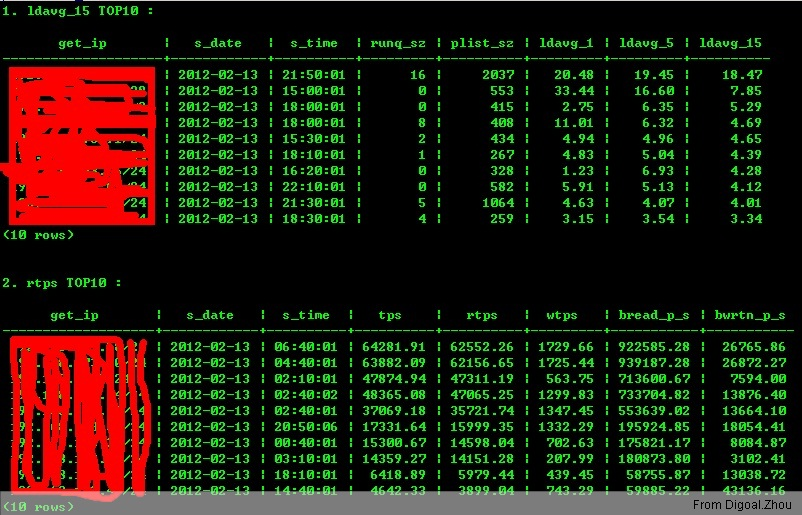
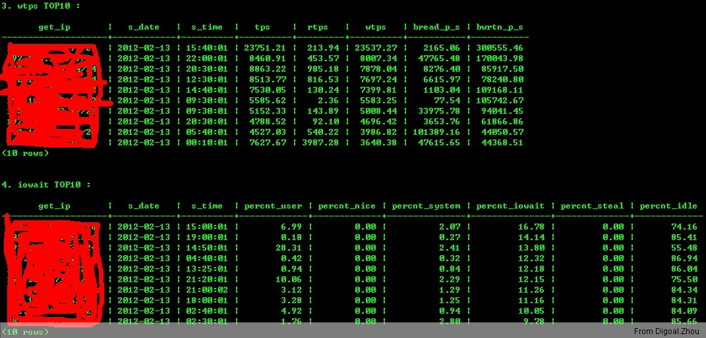
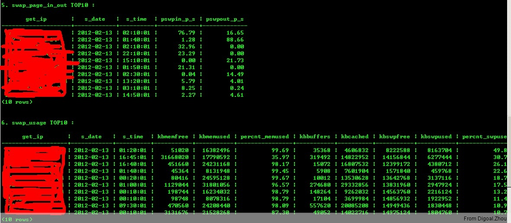
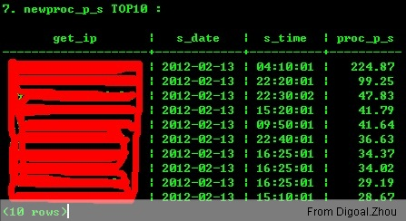

## Use PostgreSQL collect and analyze Operation System statistics  
                  
### 作者                 
digoal                  
                  
### 日期                
2012-02-14               
                  
### 标签                
PostgreSQL , monitor , 批量监控 , sar , os , operation system stats    
                  
----                
                  
## 背景    
当你管理的服务器越来越多的时候, 哪个服务器才是你最需要关注的?  
  
通过各个监控维度的排行, 可以知道你到底需要关注或者优先关注哪些服务器.  
  
这个通过nagios,cacti等监控软件当然是可以做到的.  
  
不过不太灵活, 因为服务器的配置各不一样, 关注的维度也不一样, PostgreSQL数据库的递归调用和窗口函数可以很好的运用来输出各种各样的统计数据, 有了数据也就利于展现了。  
  
## 本文测试环境 :   
  
```  
OS : RHEL5  
DB : PostgreSQL 9.1.2  
```  
  
假设我这里有1000台跑了mongoDB, PostgreSQL, Oracle, MySQL等数据库的服务器需要将它们的SAR报告集中到一台PostgreSQL数据库中.  
  
集中之后对报告进行分析, 找出需要关注的服务器来.   
  
## 一、首先看看我们要收集什么信息 :   
  
我这里举了一个简单的例子, 收集前一天sar的统计报告. 如下 :   
  
1\. sar -b  
  
反映系统的每秒读写IO请求等, 详情  
  
```  
       -b     Report I/O and transfer rate statistics.  The following values are displayed:  
  
              tps  
                     Total number of transfers per second that were issued to physical devices.  A transfer is an  I/O  
                     request to a physical device. Multiple logical requests can be combined into a single I/O request  
                     to the device.  A transfer is of indeterminate size.  
  
              rtps  
                     Total number of read requests per second issued to physical devices.  
  
              wtps  
                     Total number of write requests per second issued to physical devices.  
  
              bread/s  
                     Total amount of data read from the devices in blocks per second.  Blocks are equivalent  to  sec-  
                     tors  with  2.4  kernels  and newer and therefore have a size of 512 bytes. With older kernels, a  
                     block is of indeterminate size.  
  
              bwrtn/s  
                     Total amount of data written to devices in blocks per second.  
```  
  
2\. sar -B  
  
反映每秒系统写入或从磁盘读出的page数, 详情  
  
```  
       -B     Report paging statistics. The following values are displayed:  
  
              pgpgin/s  
                     Total number of kilobytes the system paged in from disk  per  second.   Note:  With  old  kernels  
                     (2.2.x) this value is a number of blocks per second (and not kilobytes).  
  
              pgpgout/s  
                     Total  number  of  kilobytes  the  system  paged  out to disk per second.  Note: With old kernels  
                     (2.2.x) this value is a number of blocks per second (and not kilobytes).  
  
              fault/s  
                     Number of page faults (major + minor) made by the system per  second  (post  2.5  kernels  only).  
                     This  is  not  a count of page faults that generate I/O, because some page faults can be resolved  
                     without I/O.  
  
              majflt/s  
                     Number of major faults the system has made per second, those which have required loading a memory  
                     page from disk (post 2.5 kernels only).  
```  
  
3\. sar -c  
  
反映系统每秒创建的进程数, 如果这个数字很大可能是应用程序连接数据库是短连接, 并且请求数据库频繁, 而PostgreSQL采用的是客户端连接过来fork新进程然后这个新进程与客户端进行交互的模式, 因此这种情况会造成数据库服务器大量的关闭和创建进程, sar -c能反映这种情况. 使用短连接还有一个坏处就是当系统中使用到sequence, 并且这个sequence被大量的这种短连接进程请求, 那么它设置的sequence cache没有效果并且会造成大量的跳号.  
  
详情  
  
```  
       -c     Report process creation activity.  
  
              proc/s  
                     Total number of processes created per second.  
```  
  
4\. sar -q  
  
反映系统的负载, 详情  
  
```  
       -q     Report queue length and load averages. The following values are displayed:  
  
              runq-sz  
                     Run queue length (number of processes waiting for run time).  
  
              plist-sz  
                     Number of processes and threads in the process list.  
  
              ldavg-1  
                     System load average for the last minute.  
  
              ldavg-5  
                     System load average for the past 5 minutes.  
  
              ldavg-15  
                     System load average for the past 15 minutes.  
```  
  
5\. sar -r  
  
反映系统的内存和SWAP的使用情况, 详情  
  
```  
       -r     Report memory and swap space utilization statistics.  The following values are displayed:  
  
              kbmemfree  
                     Amount of free memory available in kilobytes.  
  
              kbmemused  
                     Amount  of  used  memory  in kilobytes. This does not take into account memory used by the kernel  
                     itself.  
  
              %memused  
                     Percentage of used memory.  
  
              kbbuffers  
                     Amount of memory used as buffers by the kernel in kilobytes.  
  
              kbcached  
                     Amount of memory used to cache data by the kernel in kilobytes.  
  
              kbswpfree  
                     Amount of free swap space in kilobytes.  
  
              kbswpused  
                     Amount of used swap space in kilobytes.  
  
              %swpused  
                     Percentage of used swap space.  
  
              kbswpcad  
                     Amount of cached swap memory in kilobytes.  This is memory that once was swapped out, is  swapped  
                     back in but still also is in the swap area (if memory is needed it doesn’t need to be swapped out  
                     again because it is already in the swap area. This saves I/O).  
```  
  
6\. sar -R  
  
反映每秒被free的内存, 新增给buffer的内存, 新增给cache的内存. 详情  
  
```  
       -R     Report memory statistics. The following values are displayed:  
  
              frmpg/s  
                     Number of memory pages freed by the system per second.  A negative value represents a  number  of  
                     pages  allocated  by  the  system.   Note that a page has a size of 4 kB or 8 kB according to the  
                     machine architecture.  
  
              bufpg/s  
                     Number of additional memory pages used as buffers by the system per  second.   A  negative  value  
                     means fewer pages used as buffers by the system.  
  
              campg/s  
                     Number  of additional memory pages cached by the system per second.  A negative value means fewer  
                     pages in the cache.  
```  
  
7\. sar -u  
  
反映系统CPU在user, nice, system, iowait, steal, idle的分配比例. 详情  
  
```  
       -u     Report CPU utilization. The following values are displayed:  
  
              %user  
                     Percentage of CPU utilization that occurred while executing at the user level (application).  
  
              %nice  
                     Percentage of CPU utilization that occurred while executing at the user level with nice priority.  
  
              %system  
                     Percentage of CPU utilization that occurred while executing at the system level (kernel).  
  
              %iowait  
                     Percentage of time that the CPU or CPUs were idle during which the system had an outstanding disk  
                     I/O request.  
  
              %steal  
                     Show the percentage of time spent in involuntary wait by the virtual CPU or CPUs while the hyper-  
                     visor was servicing another virtual processor.  
  
              %idle  
                     Percentage of time that the CPU or CPUs were idle and the system did not have an outstanding disk  
                     I/O request.  
  
              Note: On SMP machines a processor that does not have any activity at all (0.00 for  every  field)  is  a  
              disabled (offline) processor.  
```  
  
8\. sar -v  
  
inode, file 或其他内核表的报告, 详情  
  
```  
       -v     Report status of inode, file and other kernel tables.  The following values are displayed:  
  
              dentunusd  
                     Number of unused cache entries in the directory cache.  
  
              file-sz  
                     Number of used file handles.  
  
              inode-sz  
                     Number of used inode handlers.  
  
              super-sz  
                     Number of super block handlers allocated by the kernel.  
  
              %super-sz  
                     Percentage  of  allocated  super  block handlers with regard to the maximum number of super block  
                     handlers that Linux can allocate.  
  
              dquot-sz  
                     Number of allocated disk quota entries.  
  
              %dquot-sz  
                     Percentage of allocated disk quota entries with regard to the maximum number of cached disk quota  
                     entries that can be allocated.  
  
              rtsig-sz  
                     Number of queued RT signals.  
  
              %rtsig-sz  
                     Percentage  of  queued  RT  signals  with  regard to the maximum number of RT signals that can be  
                     queued.  
```  
  
9\. sar -w  
  
反映每秒上下文的切换数量, 详情  
  
```  
       -w     Report system switching activity.  
  
              cswch/s  
                     Total number of context switches per second.  
```  
  
10\. sar -W  
  
反映SWAP每秒被换进或换出的数量, 详情  
  
```  
       -W     Report swapping statistics. The following values are displayed:  
  
              pswpin/s  
                     Total number of swap pages the system brought in per second.  
  
              pswpout/s  
                     Total number of swap pages the system brought out per second.  
```  
  
## 二、接下来看看数据库表的设计 :   
  
我这里使用的是sar用户和sar库以及tbs_sar表空间, 首先初始化数据库 :   
  
```  
create role sar nosuperuser nocreatedb nocreaterole noinherit login encrypted password 'DIGOAL';  
create tablespace tbs_sar owner digoal location '/home/sar/tbs_sar';  
create database sar with owner digoal template template0 encoding 'UTF8' tablespace tbs_sar;  
grant all on database sar to sar;  
grant all on tablespace tbs_sar to sar;  
\c sar sar  
create schema sar authorization sar;  
```  
  
创建序列, 函数 和表 :   
  
```  
create sequence seq_server_id start with 1 increment by 1;  
```  
  
存放Server信息, 本例只为说明方法, 所以这个表设计得比较简单, 实际使用当中可以加入其他字段, 如IDC, 维护人, 项目名称等。  
  
```  
create table server(  
id int primary key,  
ip inet not null unique,  
info text);  
```  
  
根据IP地址获取ServerID的函数, 没有则新分配  
  
```  
create or replace function get_server_id (i_ip inet) returns int as $BODY$  
declare  
v_id int;  
begin  
select id into v_id from server where ip=i_ip;  
if not found then  
insert into server(id, ip) values(nextval('seq_server_id'::regclass), i_ip);  
select id into v_id from server where ip=i_ip;  
end if;  
return v_id;  
exception   
when others then  
return -1;  
end  
$BODY$ language plpgsql;  
```  
  
根据ServerID获取IP的函数  
  
```  
create or replace function get_ip (i_id int) returns inet as $BODY$  
declare  
v_ip inet;  
begin  
select ip into v_ip from server where id=i_id;  
return v_ip;  
exception  
when others then  
return '0.0.0.0/0'::inet;  
end  
$BODY$ language plpgsql;  
```  
  
根据ServerID获取服务器info的函数  
  
```  
create or replace function get_info (i_id int) returns text as $BODY$  
declare  
v_info text;  
begin  
select info into v_info from server where id=i_id;  
return v_info;  
exception  
when others then  
return 'no info';  
end  
$BODY$ language plpgsql;  
```  
  
统计昨天未收集到SAR日志的函数  
  
```  
create or replace function get_server_nodata_yesterday() returns setof text as $BODY$  
declare  
v_result text;  
begin  
perform 1 from (select s1.* from server s1 left outer join  
(select * from (select server_id,row_number() over (partition by server_id order by s_date desc) from sar_context where s_date=current_date-1) t1   
where row_number=1) t2 on (s1.id=t2.server_id) where t2.server_id is null) t;  
if found then  
return next 'sar_context: ';  
return query select s1.ip||', '||s1.info from server s1 left outer join  
(select * from (select server_id,row_number() over (partition by server_id order by s_date desc) from sar_context where s_date=current_date-1) t1   
where row_number=1) t2 on (s1.id=t2.server_id) where t2.server_id is null;  
end if;  
  
perform 1 from (select s1.* from server s1 left outer join  
(select * from (select server_id,row_number() over (partition by server_id order by s_date desc) from sar_cpu where s_date=current_date-1) t1   
where row_number=1) t2 on (s1.id=t2.server_id) where t2.server_id is null) t;  
if found then  
return next 'sar_cpu: ';  
return query select s1.ip||', '||s1.info from server s1 left outer join  
(select * from (select server_id,row_number() over (partition by server_id order by s_date desc) from sar_cpu where s_date=current_date-1) t1   
where row_number=1) t2 on (s1.id=t2.server_id) where t2.server_id is null;  
end if;  
  
perform 1 from (select s1.* from server s1 left outer join  
(select * from (select server_id,row_number() over (partition by server_id order by s_date desc) from sar_inode where s_date=current_date-1) t1   
where row_number=1) t2 on (s1.id=t2.server_id) where t2.server_id is null) t;  
if found then  
return next 'sar_inode: ';  
return query select s1.ip||', '||s1.info from server s1 left outer join  
(select * from (select server_id,row_number() over (partition by server_id order by s_date desc) from sar_inode where s_date=current_date-1) t1   
where row_number=1) t2 on (s1.id=t2.server_id) where t2.server_id is null;  
end if;  
  
perform 1 from (select s1.* from server s1 left outer join  
(select * from (select server_id,row_number() over (partition by server_id order by s_date desc) from sar_io where s_date=current_date-1) t1   
where row_number=1) t2 on (s1.id=t2.server_id) where t2.server_id is null) t;  
if found then  
return next 'sar_io: ';  
return query select s1.ip||', '||s1.info from server s1 left outer join  
(select * from (select server_id,row_number() over (partition by server_id order by s_date desc) from sar_io where s_date=current_date-1) t1   
where row_number=1) t2 on (s1.id=t2.server_id) where t2.server_id is null;  
end if;  
  
perform 1 from (select s1.* from server s1 left outer join  
(select * from (select server_id,row_number() over (partition by server_id order by s_date desc) from sar_load where s_date=current_date-1) t1   
where row_number=1) t2 on (s1.id=t2.server_id) where t2.server_id is null) t;  
if found then  
return next 'sar_load: ';  
return query select s1.ip||', '||s1.info from server s1 left outer join  
(select * from (select server_id,row_number() over (partition by server_id order by s_date desc) from sar_load where s_date=current_date-1) t1   
where row_number=1) t2 on (s1.id=t2.server_id) where t2.server_id is null;  
end if;  
  
perform 1 from (select s1.* from server s1 left outer join  
(select * from (select server_id,row_number() over (partition by server_id order by s_date desc) from sar_mem where s_date=current_date-1) t1   
where row_number=1) t2 on (s1.id=t2.server_id) where t2.server_id is null) t;  
if found then  
return next 'sar_mem: ';  
return query select s1.ip||', '||s1.info from server s1 left outer join  
(select * from (select server_id,row_number() over (partition by server_id order by s_date desc) from sar_mem where s_date=current_date-1) t1   
where row_number=1) t2 on (s1.id=t2.server_id) where t2.server_id is null;  
end if;  
  
perform 1 from (select s1.* from server s1 left outer join  
(select * from (select server_id,row_number() over (partition by server_id order by s_date desc) from sar_mem_swap where s_date=current_date-1) t1   
where row_number=1) t2 on (s1.id=t2.server_id) where t2.server_id is null) t;  
if found then  
return next 'sar_mem_swap: ';  
return query select s1.ip||', '||s1.info from server s1 left outer join  
(select * from (select server_id,row_number() over (partition by server_id order by s_date desc) from sar_mem_swap where s_date=current_date-1) t1   
where row_number=1) t2 on (s1.id=t2.server_id) where t2.server_id is null;  
end if;  
  
perform 1 from (select s1.* from server s1 left outer join  
(select * from (select server_id,row_number() over (partition by server_id order by s_date desc) from sar_page where s_date=current_date-1) t1   
where row_number=1) t2 on (s1.id=t2.server_id) where t2.server_id is null) t;  
if found then  
return next 'sar_page: ';  
return query select s1.ip||', '||s1.info from server s1 left outer join  
(select * from (select server_id,row_number() over (partition by server_id order by s_date desc) from sar_page where s_date=current_date-1) t1   
where row_number=1) t2 on (s1.id=t2.server_id) where t2.server_id is null;  
end if;  
  
perform 1 from (select s1.* from server s1 left outer join  
(select * from (select server_id,row_number() over (partition by server_id order by s_date desc) from sar_proc where s_date=current_date-1) t1   
where row_number=1) t2 on (s1.id=t2.server_id) where t2.server_id is null) t;  
if found then  
return next 'sar_proc: ';  
return query select s1.ip||', '||s1.info from server s1 left outer join  
(select * from (select server_id,row_number() over (partition by server_id order by s_date desc) from sar_proc where s_date=current_date-1) t1   
where row_number=1) t2 on (s1.id=t2.server_id) where t2.server_id is null;  
end if;  
  
perform 1 from (select s1.* from server s1 left outer join  
(select * from (select server_id,row_number() over (partition by server_id order by s_date desc) from sar_swap where s_date=current_date-1) t1   
where row_number=1) t2 on (s1.id=t2.server_id) where t2.server_id is null) t;  
if found then  
return next 'sar_swap: ';  
return query select s1.ip||', '||s1.info from server s1 left outer join  
(select * from (select server_id,row_number() over (partition by server_id order by s_date desc) from sar_swap where s_date=current_date-1) t1   
where row_number=1) t2 on (s1.id=t2.server_id) where t2.server_id is null;  
end if;  
  
return;  
end  
$BODY$ language plpgsql;  
```  
  
sar信息存放表 :   
  
```  
create table sar_io  
(server_id int not null,  
s_date date not null,  
s_time time not null,  
tps numeric,  
rtps numeric,  
wtps numeric,  
bread_p_s numeric,  
bwrtn_p_s numeric,  
unique(server_id,s_date,s_time));  
  
create table sar_page  
(server_id int not null,  
s_date date not null,  
s_time time not null,  
pgpgin_p_s numeric,  
pgpgout_p_s numeric,  
fault_p_s numeric,  
majflt_p_s numeric,  
unique(server_id,s_date,s_time));  
  
create table sar_proc  
(server_id int not null,  
s_date date not null,  
s_time time not null,  
proc_p_s numeric,  
unique(server_id,s_date,s_time));  
  
create table sar_load  
(server_id int not null,  
s_date date not null,  
s_time time not null,  
runq_sz numeric,  
plist_sz numeric,  
ldavg_1 numeric,  
ldavg_5 numeric,  
ldavg_15 numeric,  
unique(server_id,s_date,s_time));  
  
create table sar_mem_swap  
(server_id int not null,  
s_date date not null,  
s_time time not null,  
kbmemfree numeric,  
kbmemused numeric,  
percnt_memused numeric,  
kbbuffers numeric,  
kbcached numeric,  
kbswpfree numeric,  
kbswpused numeric,  
percnt_swpused numeric,  
kbswpcad numeric,  
unique(server_id,s_date,s_time));  
  
create table sar_mem  
(server_id int not null,  
s_date date not null,  
s_time time not null,  
frmpg_p_s numeric,  
bufpg_p_s numeric,  
campg_p_s numeric,  
unique(server_id,s_date,s_time));  
  
create table sar_cpu  
(server_id int not null,  
s_date date not null,  
s_time time not null,  
percnt_user numeric,  
percnt_nice numeric,  
percnt_system numeric,  
percnt_iowait numeric,  
percnt_steal numeric,  
percnt_idle numeric,  
unique(server_id,s_date,s_time));  
  
create table sar_inode  
(server_id int not null,  
s_date date not null,  
s_time time not null,  
dentunusd numeric,  
file_sz numeric,  
inode_sz numeric,  
super_sz numeric,  
percnt_super_sz numeric,  
dquot_sz numeric,  
percnt_dquot_sz numeric,  
rtsig_sz numeric,  
percnt_rtsig_sz numeric,  
unique(server_id,s_date,s_time));  
  
create table sar_context  
(server_id int not null,  
s_date date not null,  
s_time time not null,  
cswch_p_s numeric,  
unique(server_id,s_date,s_time));  
  
create table sar_swap  
(server_id int not null,  
s_date date not null,  
s_time time not null,  
pswpin_p_s numeric,  
pswpout_p_s numeric,  
unique(server_id,s_date,s_time));  
```  
  
## 三、在需要收集sar报告的操作系统中配置如下程序用来收集sar信息 :   
  
收集用到了PostgreSQL的psql程序, 所以需要在系统中安装PostgreSQL客户端. 安装过程略.  
  
假设PostgreSQL数据库的连接信息如下, IP 10.10.10.1 , Port 1931 , DBNAME sar , USER sar , PASSWORD DIGOAL  
  
配置 ~/.pgpass文件  
  
```  
10.10.10.1:1931:sar:sar:DIGOAL  
  
chmod 400 ~/.pgpass  
```  
  
编写sar_collect.sh脚本, 用于收集昨天的SAR报告  
  
```  
vi /home/postgres/sar_collect.sh  
  
#!/bin/bash  
# 环境变量, 数据库连接, 避免风暴随机等待60秒内  
. /home/postgres/.bash_profile  
DB_URL="-h 10.10.10.1 -p 1931 -U sar -d sar"  
sleep $(($RANDOM%60))  
  
NET_DEV="`/sbin/route -n|grep UG|awk '{print $8}'|head -n 1`"  
IP_ADDR="'`/sbin/ip addr show $NET_DEV|grep inet|grep "global $NET_DEV$"|awk '{print $2}'`'"  
SAR_FILE="/var/log/sa/sa`date -d -1day +%d`"  
SAR_DATE="'`date -d -1day +%Y-%m-%d`'"  
SERVER_ID="`psql -A -t $DB_URL -c "select * from get_server_id($IP_ADDR)"`"  
  
# sar -b, sar_io tps      rtps      wtps   bread/s   bwrtn/s  
SQL=`sar -b -f $SAR_FILE|grep -E 'AM[ ]+([0-9]+|\.+|all|-)|PM[ ]+([0-9]+|\.+|all|-)'|awk '{print "insert into sar_io(server_id, s_date, s_time, tps, rtps, wtps, bread_p_s, bwrtn_p_s) values('$SERVER_ID', '$SAR_DATE',","\47"$1$2"\47,",$3",",$4",",$5",",$6",",$7");"}'`  
psql $DB_URL -c "$SQL"  
  
# sar -B, sar_page pgpgin/s pgpgout/s   fault/s  majflt/s  
SQL=`sar -B -f $SAR_FILE|grep -E 'AM[ ]+([0-9]+|\.+|all|-)|PM[ ]+([0-9]+|\.+|all|-)'|awk '{print "insert into sar_page(server_id, s_date, s_time, pgpgin_p_s, pgpgout_p_s, fault_p_s, majflt_p_s) values('$SERVER_ID', '$SAR_DATE',","\47"$1$2"\47,",$3",",$4",",$5",",$6");"}'`  
psql $DB_URL -c "$SQL"  
  
# sar -c, sar_proc proc/s  
SQL=`sar -c -f $SAR_FILE|grep -E 'AM[ ]+([0-9]+|\.+|all|-)|PM[ ]+([0-9]+|\.+|all|-)'|awk '{print "insert into sar_proc(server_id, s_date, s_time, proc_p_s) values('$SERVER_ID', '$SAR_DATE',","\47"$1$2"\47,",$3");"}'`  
psql $DB_URL -c "$SQL"  
  
# sar -q, sar_load runq-sz  plist-sz   ldavg-1   ldavg-5  ldavg-15  
SQL=`sar -q -f $SAR_FILE|grep -E 'AM[ ]+([0-9]+|\.+|all|-)|PM[ ]+([0-9]+|\.+|all|-)'|awk '{print "insert into sar_load(server_id, s_date, s_time, runq_sz, plist_sz, ldavg_1, ldavg_5, ldavg_15) values('$SERVER_ID', '$SAR_DATE',","\47"$1$2"\47,",$3",",$4",",$5",",$6",",$7");"}'`  
psql $DB_URL -c "$SQL"  
  
# sar -r, sar_mem_swap kbmemfree kbmemused  %memused kbbuffers  kbcached kbswpfree kbswpused  %swpused  kbswpcad  
SQL=`sar -r -f $SAR_FILE|grep -E 'AM[ ]+([0-9]+|\.+|all|-)|PM[ ]+([0-9]+|\.+|all|-)'|awk '{print "insert into sar_mem_swap(server_id, s_date, s_time, kbmemfree, kbmemused, percnt_memused, kbbuffers, kbcached, kbswpfree, kbswpused, percnt_swpused, kbswpcad) values('$SERVER_ID', '$SAR_DATE',","\47"$1$2"\47,",$3",",$4",",$5",",$6",",$7",",$8",",$9",",$10",",$11");"}'`  
psql $DB_URL -c "$SQL"  
  
# sar -R, sar_mem frmpg/s   bufpg/s   campg/s  
SQL=`sar -R -f $SAR_FILE|grep -E 'AM[ ]+([0-9]+|\.+|all|-)|PM[ ]+([0-9]+|\.+|all|-)'|awk '{print "insert into sar_mem(server_id, s_date, s_time, frmpg_p_s, bufpg_p_s, campg_p_s) values('$SERVER_ID', '$SAR_DATE',","\47"$1$2"\47,",$3",",$4",",$5");"}'`  
psql $DB_URL -c "$SQL"  
  
# sar -u, sar_cpu %user     %nice   %system   %iowait    %steal     %idle  
SQL=`sar -u -f $SAR_FILE|grep -E 'AM[ ]+([0-9]+|\.+|all|-)|PM[ ]+([0-9]+|\.+|all|-)'|awk '{print "insert into sar_cpu(server_id, s_date, s_time, percnt_user, percnt_nice, percnt_system, percnt_iowait, percnt_steal, percnt_idle) values('$SERVER_ID', '$SAR_DATE',","\47"$1$2"\47,",$4",",$5",",$6",",$7",",$8",",$9");"}'`  
psql $DB_URL -c "$SQL"  
  
# sar -v, sar_inode dentunusd   file-sz  inode-sz  super-sz %super-sz  dquot-sz %dquot-sz  rtsig-sz %rtsig-sz  
SQL=`sar -v -f $SAR_FILE|grep -E 'AM[ ]+([0-9]+|\.+|all|-)|PM[ ]+([0-9]+|\.+|all|-)'|awk '{print "insert into sar_inode(server_id, s_date, s_time, dentunusd, file_sz, inode_sz, super_sz, percnt_super_sz, dquot_sz, percnt_dquot_sz, rtsig_sz, percnt_rtsig_sz) values('$SERVER_ID', '$SAR_DATE',","\47"$1$2"\47,",$3",",$4",",$5",",$6",",$7",",$8",",$9",",$10",",$11");"}'`  
psql $DB_URL -c "$SQL"  
  
# sar -w, sar_context cswch/s  
SQL=`sar -w -f $SAR_FILE|grep -E 'AM[ ]+([0-9]+|\.+|all|-)|PM[ ]+([0-9]+|\.+|all|-)'|awk '{print "insert into sar_context(server_id, s_date, s_time, cswch_p_s) values('$SERVER_ID', '$SAR_DATE',","\47"$1$2"\47,",$3");"}'`  
psql $DB_URL -c "$SQL"  
  
# sar -W, sar_swap pswpin/s pswpout/s  
SQL=`sar -W -f $SAR_FILE|grep -E 'AM[ ]+([0-9]+|\.+|all|-)|PM[ ]+([0-9]+|\.+|all|-)'|awk '{print "insert into sar_swap(server_id, s_date, s_time, pswpin_p_s, pswpout_p_s) values('$SERVER_ID', '$SAR_DATE',","\47"$1$2"\47,",$3",",$4");"}'`  
psql $DB_URL -c "$SQL"  
  
# Author : Digoal.Zhou  
# THE END  
```  
  
修改权限 :   
  
```  
chmod 500 sar_collect.sh  
```  
  
新建执行计划,   
  
```  
crontab -e  
  
1 2 * * * /home/postgres/sar_collect.sh  
```  
  
## 四、然后看看几条简单的报告SQL, 使用row_number窗口函数  :   
  
```  
# 昨天15分钟最大负载排名前10,后一条为平均值排行  
# 负载过高需要关注这些服务器上运行的数据库和业务是否健康, 例如是否需要建索引, 是否需要使用绑定变量等.  
select get_ip(server_id),* from (select *,row_number() over (partition by server_id order by ldavg_15 desc) from sar_load where s_date=current_date-1) t where row_number=1 order by ldavg_15 desc limit 10;  
select get_info(server_id),get_ip(server_id),round(avg(ldavg_15),2) ldavg_15 from sar_load where s_date=current_date-1 group by server_id,s_date order by ldavg_15 desc limit 10;  
  
# 昨天最大读请求数排名前10,后一条为平均值排行  
# 读请求过高需要关注这些服务器上运行的数据库和业务是否健康, 例如是否需要建索引, 是否需要加内存, 是否需要对存储性能扩容等.   
select get_ip(server_id),* from (select *,row_number() over (partition by server_id order by rtps desc) from sar_io where s_date=current_date-1) t where row_number=1 order by rtps desc limit 10;  
select get_info(server_id),get_ip(server_id),round(avg(rtps),2) rtps from sar_io where s_date=current_date-1 group by server_id,s_date order by rtps desc limit 10;  
  
# 昨天最大写请求数排名前10,后一条为平均值排行  
# 写请求过高需要关注这些服务器上运行的数据库和业务是否健康, 例如是否需要减少索引, 是否需要使用异步IO, 是否需要对存储性能进行扩容等.   
select get_ip(server_id),* from (select *,row_number() over (partition by server_id order by wtps desc) from sar_io where s_date=current_date-1) t where row_number=1 order by wtps desc limit 10;  
select get_info(server_id),get_ip(server_id),round(avg(wtps),2) wtps from sar_io where s_date=current_date-1 group by server_id,s_date order by wtps desc limit 10;  
  
# 昨天最大iowait排名前10,后一条为平均值排行  
# iowait过高需要关注这些服务器上运行的数据库和业务是否健康, 例如是否需要加内存, 是否需要将常用数据放入内存, 是否需要对存储性能进行扩容等.  
select get_ip(server_id),* from (select *,row_number() over (partition by server_id order by percnt_iowait desc) from sar_cpu where s_date=current_date-1) t where row_number=1 order by percnt_iowait desc limit 10;  
select get_info(server_id),get_ip(server_id),round(avg(percnt_iowait),2) percnt_iowait from sar_cpu where s_date=current_date-1 group by server_id,s_date order by percnt_iowait desc limit 10;  
  
# 昨天最大swap页进出排名前10,后一条为平均值排行  
# swap也进出过高需要关注这些服务器上运行的数据库和业务是否健康, 例如是否需要加内存, 是否需要将常用数据放入内存等.   
select get_ip(server_id),* from (select *,row_number() over (partition by server_id order by pswpin_p_s+pswpout_p_s desc) from sar_swap where s_date=current_date-1) t where row_number=1 order by pswpin_p_s+pswpout_p_s desc limit 10;  
select get_info(server_id),get_ip(server_id),round(avg(pswpin_p_s+pswpout_p_s),2) pswpin_out_p_s from sar_swap where s_date=current_date-1 group by server_id,s_date order by pswpin_out_p_s desc limit 10;  
  
# 昨天最大SWAP使用比例前10,后一条为平均值排行  
# SWAP使用率过高需要关注这些服务器上运行的数据库和业务是否健康, 例如是否需要加内存, 是否需要调整数据库参数, 是否需要使用大页等.   
select get_ip(server_id),* from (select *,row_number() over (partition by server_id order by percnt_swpused desc) from sar_mem_swap where s_date=current_date-1) t where row_number=1 order by percnt_swpused desc limit 10;  
select get_info(server_id),get_ip(server_id),round(avg(percnt_swpused),2) percnt_swpused from sar_mem_swap where s_date=current_date-1 group by server_id,s_date order by percnt_swpused desc limit 10;  
  
# 昨天每秒新建进程排名前10,后一条为平均值排行  
# 每秒新建进程数过高需要关注这些服务器上运行的数据库和业务是否健康, 例如是否需要加个数据库连接池使用长连接, Oracle是否需要使用共享连接, 应用程序是否可以将短连接改成长连接的模式等.   
select get_ip(server_id),* from (select *,row_number() over (partition by server_id order by proc_p_s desc) from sar_proc where s_date=current_date-1) t where row_number=1 order by  proc_p_s  desc limit 10;  
select get_info(server_id),get_ip(server_id),round(avg(proc_p_s),2) proc_p_s from sar_proc where s_date=current_date-1 group by server_id,s_date order by proc_p_s desc limit 10;  
```  
  
报告如图 :   
  
  
  
  
  
  
  
  
  
  
## 五、最后通过邮件将报告发送给自己 :   
发送邮件脚本 :   
  
```  
#!/bin/bash  
. /home/postgres/.bash_profile  
  
EMAIL="digoal@126.com"  
  
echo -e `date +%F\ %T` >/tmp/sar_report.log  
echo -e "\n---- WeeklyAvgValue TOP10: ----\n" >>/tmp/sar_report.log  
  
echo -e "\n1. ldavg_15 TOP10 :\n" >>/tmp/sar_report.log  
psql -h 127.0.0.1 sar sar -c "select get_info(server_id),get_ip(server_id),round(avg(ldavg_15),2) ldavg_15 from sar_load where s_date<=current_date-1 and s_date>=current_date-7 group by server_id order by ldavg_15 desc limit 10;" >>/tmp/sar_report.log  
  
echo -e "\n2. rtps TOP10 :\n" >>/tmp/sar_report.log  
psql -h 127.0.0.1 sar sar -c "select get_info(server_id),get_ip(server_id),round(avg(rtps),2) rtps from sar_io where s_date<=current_date-1 and s_date>=current_date-7 group by server_id order by rtps desc limit 10;" >>/tmp/sar_report.log  
  
echo -e "\n3. wtps TOP10 :\n" >>/tmp/sar_report.log  
psql -h 127.0.0.1 sar sar -c "select get_info(server_id),get_ip(server_id),round(avg(wtps),2) wtps from sar_io where s_date<=current_date-1 and s_date>=current_date-7 group by server_id order by wtps desc limit 10;" >>/tmp/sar_report.log  
  
echo -e "\n4. iowait TOP10 :\n" >>/tmp/sar_report.log  
psql -h 127.0.0.1 sar sar -c "select get_info(server_id),get_ip(server_id),round(avg(percnt_iowait),2) percnt_iowait from sar_cpu where s_date<=current_date-1 and s_date>=current_date-7 group by server_id order by percnt_iowait desc limit 10;" >>/tmp/sar_report.log  
  
echo -e "\n5. swap_page_in_out TOP10 :\n" >>/tmp/sar_report.log  
psql -h 127.0.0.1 sar sar -c "select get_info(server_id),get_ip(server_id),round(avg(pswpin_p_s+pswpout_p_s),2) pswpin_out_p_s from sar_swap where s_date<=current_date-1 and s_date>=current_date-7 group by server_id order by pswpin_out_p_s desc limit 10;" >>/tmp/sar_report.log  
  
echo -e "\n6. swap_usage TOP10 :\n" >>/tmp/sar_report.log  
psql -h 127.0.0.1 sar sar -c "select get_info(server_id),get_ip(server_id),round(avg(percnt_swpused),2) percnt_swpused from sar_mem_swap where s_date<=current_date-1 and s_date>=current_date-7 group by server_id order by percnt_swpused desc limit 10;" >>/tmp/sar_report.log  
  
echo -e "\n7. newproc_p_s TOP10 :\n" >>/tmp/sar_report.log  
psql -h 127.0.0.1 sar sar -c "select get_info(server_id),get_ip(server_id),round(avg(proc_p_s),2) proc_p_s from sar_proc where s_date<=current_date-1 and s_date>=current_date-7 group by server_id order by proc_p_s desc limit 10;" >>/tmp/sar_report.log  
  
echo -e "\n---- DailyAvgValue TOP10: ----\n" >>/tmp/sar_report.log  
  
echo -e "\n1. ldavg_15 TOP10 :\n" >>/tmp/sar_report.log  
psql -h 127.0.0.1 sar sar -c "select get_info(server_id),get_ip(server_id),round(avg(ldavg_15),2) ldavg_15 from sar_load where s_date=current_date-1 group by server_id order by ldavg_15 desc limit 10;" >>/tmp/sar_report.log  
  
echo -e "\n2. rtps TOP10 :\n" >>/tmp/sar_report.log  
psql -h 127.0.0.1 sar sar -c "select get_info(server_id),get_ip(server_id),round(avg(rtps),2) rtps from sar_io where s_date=current_date-1 group by server_id order by rtps desc limit 10;" >>/tmp/sar_report.log  
  
echo -e "\n3. wtps TOP10 :\n" >>/tmp/sar_report.log  
psql -h 127.0.0.1 sar sar -c "select get_info(server_id),get_ip(server_id),round(avg(wtps),2) wtps from sar_io where s_date=current_date-1 group by server_id order by wtps desc limit 10;" >>/tmp/sar_report.log  
  
echo -e "\n4. iowait TOP10 :\n" >>/tmp/sar_report.log  
psql -h 127.0.0.1 sar sar -c "select get_info(server_id),get_ip(server_id),round(avg(percnt_iowait),2) percnt_iowait from sar_cpu where s_date=current_date-1 group by server_id order by percnt_iowait desc limit 10;" >>/tmp/sar_report.log  
  
echo -e "\n5. swap_page_in_out TOP10 :\n" >>/tmp/sar_report.log  
psql -h 127.0.0.1 sar sar -c "select get_info(server_id),get_ip(server_id),round(avg(pswpin_p_s+pswpout_p_s),2) pswpin_out_p_s from sar_swap where s_date=current_date-1 group by server_id order by pswpin_out_p_s desc limit 10;" >>/tmp/sar_report.log  
  
echo -e "\n6. swap_usage TOP10 :\n" >>/tmp/sar_report.log  
psql -h 127.0.0.1 sar sar -c "select get_info(server_id),get_ip(server_id),round(avg(percnt_swpused),2) percnt_swpused from sar_mem_swap where s_date=current_date-1 group by server_id order by percnt_swpused desc limit 10;" >>/tmp/sar_report.log  
  
echo -e "\n7. newproc_p_s TOP10 :\n" >>/tmp/sar_report.log  
psql -h 127.0.0.1 sar sar -c "select get_info(server_id),get_ip(server_id),round(avg(proc_p_s),2) proc_p_s from sar_proc where s_date=current_date-1 group by server_id order by proc_p_s desc limit 10;" >>/tmp/sar_report.log  
  
echo -e "\n---- DailyMaxValue TOP10: ----\n" >>/tmp/sar_report.log  
  
echo -e "\n1. ldavg_15 TOP10 :\n" >>/tmp/sar_report.log  
psql -h 127.0.0.1 sar sar -c "select get_info(server_id),get_ip(server_id),s_date,s_time,runq_sz,plist_sz,ldavg_1,ldavg_5,ldavg_15 from (select *,row_number() over (partition by server_id order by ldavg_15 desc) from sar_load where s_date=current_date-1) t where row_number=1 order by ldavg_15 desc limit 10;" >>/tmp/sar_report.log  
  
echo -e "\n2. rtps TOP10 :\n" >>/tmp/sar_report.log  
psql -h 127.0.0.1 sar sar -c "select get_info(server_id),get_ip(server_id),s_date,s_time,tps,rtps,wtps,bread_p_s,bwrtn_p_s from (select *,row_number() over (partition by server_id order by rtps desc) from sar_io where s_date=current_date-1) t where row_number=1 order by rtps desc limit 10;" >>/tmp/sar_report.log  
  
echo -e "\n3. wtps TOP10 :\n" >>/tmp/sar_report.log  
psql -h 127.0.0.1 sar sar -c "select get_info(server_id),get_ip(server_id),s_date,s_time,tps,rtps,wtps,bread_p_s,bwrtn_p_s from (select *,row_number() over (partition by server_id order by wtps desc) from sar_io where s_date=current_date-1) t where row_number=1 order by wtps desc limit 10;" >>/tmp/sar_report.log  
  
echo -e "\n4. iowait TOP10 :\n" >>/tmp/sar_report.log  
psql -h 127.0.0.1 sar sar -c "select get_info(server_id),get_ip(server_id),s_date,s_time,percnt_user,percnt_nice,percnt_system,percnt_iowait,percnt_steal,percnt_idle from (select *,row_number() over (partition by server_id order by percnt_iowait desc) from sar_cpu where s_date=current_date-1) t where row_number=1 order by percnt_iowait desc limit 10;" >>/tmp/sar_report.log  
  
echo -e "\n5. swap_page_in_out TOP10 :\n" >>/tmp/sar_report.log  
psql -h 127.0.0.1 sar sar -c "select get_info(server_id),get_ip(server_id),s_date,s_time,pswpin_p_s,pswpout_p_s from (select *,row_number() over (partition by server_id order by pswpin_p_s+pswpout_p_s desc) from sar_swap where s_date=current_date-1) t where row_number=1 order by pswpin_p_s+pswpout_p_s desc limit 10;" >>/tmp/sar_report.log  
  
echo -e "\n6. swap_usage TOP10 :\n" >>/tmp/sar_report.log  
psql -h 127.0.0.1 sar sar -c "select get_info(server_id),get_ip(server_id),s_date,s_time,kbmemfree,kbmemused,percnt_memused,kbbuffers,kbcached,kbswpfree,kbswpused,percnt_swpused,kbswpcad from (select *,row_number() over (partition by server_id order by percnt_swpused desc) from sar_mem_swap where s_date=current_date-1) t where row_number=1 order by percnt_swpused desc limit 10;" >>/tmp/sar_report.log  
  
echo -e "\n7. newproc_p_s TOP10 :\n" >>/tmp/sar_report.log  
psql -h 127.0.0.1 sar sar -c "select get_info(server_id),get_ip(server_id),s_date,s_time,proc_p_s from (select *,row_number() over (partition by server_id order by proc_p_s desc) from sar_proc where s_date=current_date-1) t where row_number=1 order by proc_p_s desc limit 10;" >>/tmp/sar_report.log  
  
echo -e "\n---- get_server_nodata_yesterday: ----\n" >>/tmp/sar_report.log  
psql -h 127.0.0.1 sar sar -c "select * from get_server_nodata_yesterday();" >>/tmp/sar_report.log  
  
cat /tmp/sar_report.log|mutt -s "`date +$F` DB Servers RS Consume Top10" $EMAIL  
# Author : Digoal.Zhou  
# THE END  
```  
  
配置mutt环境, 假设数据库编码为UTF-8, 否则中文可能出错.  
  
```  
vi ~/.muttrc  
set envelope_from=yes  
set from=digoal@126.com  
set realname="德哥"  
set use_from=yes  
set charset="UTF-8"  
```  
  
## 六、其他,   
1\. 展现可以通过WEB形式来做, 这里只是举了个简单的收集和统计的例子, 未设计WEB开发.  
  
2\. 1000台服务器一天收集的这些sar日志数据量约200MB. 按照现在的硬盘容量, 放几年没问题.   
  
## 参考  
man sar  
  
<a rel="nofollow" href="http://info.flagcounter.com/h9V1"  ></a>  
  
  
  
  
  
  
## [digoal's 大量PostgreSQL文章入口](https://github.com/digoal/blog/blob/master/README.md "22709685feb7cab07d30f30387f0a9ae")
  
