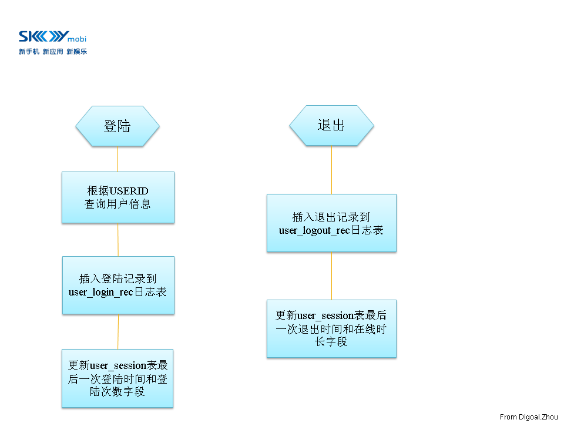

## PostgreSQL性能优化综合案例讲解 - 1  
                
### 作者                                                             
digoal           
                  
### 日期             
2012-03-13            
              
### 标签           
PostgreSQL , 性能优化 , 综合案例           
                
----          
                   
## 背景          
备注  
  
部署部分可以请参考  
  
[《PostgreSQL on Linux 最佳部署手册》](../201611/20161121_01.md)  
  
## 【软件环境】   
  
```  
CentOS 5 x64  
PostgreSQL 9.1.3  
plproxy 2.3  
pgbouncer 1.4.2  
```  
  
## 【测试模型】  
设计一个包含INSERT, UPDATE, SELECT语句的业务模型用于本优化案例.  
  
业务逻辑 :   
  
  
   
  
## 【测试表】  
  
```  
create table user_info  
(userid int,  
engname text,  
cnname text,  
occupation text,  
birthday date,  
signname text,  
email text,  
qq numeric,  
crt_time timestamp without time zone,  
mod_time timestamp without time zone  
);  
  
create table user_session  
(userid int,  
logintime timestamp(0) without time zone,  
login_count bigint default 0,  
logouttime timestamp(0) without time zone,  
online_interval interval default interval '0'  
);  
  
create table user_login_rec  
(userid int,  
login_time timestamp without time zone,  
ip inet  
);  
  
create table user_logout_rec  
(userid int,  
logout_time timestamp without time zone,  
ip inet  
);  
```  
  
## 【初始化数据】  
  
```  
insert into user_info (userid,engname,cnname,occupation,birthday,signname,email,qq,crt_time,mod_time)  
select generate_series(1,20000000),  
'digoal.zhou',  
'德哥',  
'DBA',  
'1970-01-01'  
,E'公益是一辈子的事, I\'m Digoal.Zhou, Just do it!',  
'digoal@126.com',  
276732431,  
clock_timestamp(),  
NULL;  
  
insert into user_session (userid) select generate_series(1,20000000);  
  
set work_mem='2048MB';  
set maintenance_work_mem='2048MB';  
alter table user_info add constraint pk_user_info primary key (userid);  
alter table user_session add constraint pk_user_session primary key (userid);  
```  
  
## 【业务函数】  
模拟用户登录的函数  
  
```  
create or replace function f_user_login   
(i_userid int,  
OUT o_userid int,  
OUT o_engname text,  
OUT o_cnname text,  
OUT o_occupation text,  
OUT o_birthday date,  
OUT o_signname text,  
OUT o_email text,  
OUT o_qq numeric  
)  
as $BODY$  
declare  
begin  
select userid,engname,cnname,occupation,birthday,signname,email,qq  
into o_userid,o_engname,o_cnname,o_occupation,o_birthday,o_signname,o_email,o_qq  
from user_info where userid=i_userid;  
insert into user_login_rec (userid,login_time,ip) values (i_userid,now(),inet_client_addr());  
update user_session set logintime=now(),login_count=login_count+1 where userid=i_userid;  
return;  
end;  
$BODY$  
language plpgsql;  
```  
  
模拟用户退出的函数  
  
```  
create or replace function f_user_logout  
(i_userid int,  
OUT o_result int  
)  
as $BODY$  
declare  
begin  
insert into user_logout_rec (userid,logout_time,ip) values (i_userid,now(),inet_client_addr());  
update user_session set logouttime=now(),online_interval=online_interval+(now()-logintime) where userid=i_userid;  
o_result := 0;  
return;  
exception   
when others then  
o_result := 1;  
return;  
end;  
$BODY$  
language plpgsql;  
```  
  
## 【搭建测试模型】  
1\.  搭建环境, 安装PostgreSQL9.1.3数据库软件并初始化数据库(略).  
  
2\.  调整数据库postgresql.conf参数. 打开日志, SQL统计, 跟踪, 以及性能参数, 便于优化过程中取证.  
  
```  
监听IPv4的所有IP.  
listen_addresses = '0.0.0.0'  
  
最大允许1000个连接.  
max_connections = 1000  
  
为超级用户保留3个可用连接.  
superuser_reserved_connections = 3  
  
默认的unix socket文件放在/tmp, 修改为$PGDATA, 以确保安全.  
unix_socket_directory = '.'  
  
默认的访问权限是0777, 修改为0700更安全.  
unix_socket_permissions = 0700  
  
Linux下面默认是2小时.tcp的keepalives包发送间隔以及重试次数, 如果客户端没有响应, 将主动释放对应的SOCKET.  
tcp_keepalives_idle = 60  
tcp_keepalives_interval = 10  
tcp_keepalives_count = 6  
  
大的shared_buffers需要大的checkpoint_segments,同时需要申请更多的System V共享内存资源.  
这个值不需要设的太大, 因为PostgreSQL还依赖操作系统的cache来提高读性能, 另外, 写操作频繁的数据库这个设太大反而会增加checkpoint压力.  
shared_buffers = 512MB  
  
这个值越大, VACUUM, CREATE INDEX的操作越快, 当然大到一定程度瓶颈就不在内存了, 可能是CPU例如创建索引.  
这个值是一个操作的内存使用上限, 而不是一次性分配出去的. 并且需要注意如果开启了autovacuum, 最大可能有autovacuum_max_workers*maintenance_work_mem的内存被系统消耗掉.  
maintenance_work_mem = 512MB  
  
一般设置为比系统限制的略少,ulimit -a : stack size              (kbytes, -s) 10240  
max_stack_depth = 8MB  
  
手动执行vacuum操作时, 默认是没有停顿执行到底的, 为了防止VACUUM操作消耗太多数据库服务器硬件资源, 这个值是指vacuum在消耗多少资源后停顿多少时间,以便其他的操作可以使用更多的硬件资源.  
vacuum_cost_delay = 10ms  
#vacuum_cost_page_hit = 1               # 0-10000 credits  
#vacuum_cost_page_miss = 10             # 0-10000 credits  
#vacuum_cost_page_dirty = 20            # 0-10000 credits  
#vacuum_cost_limit = 200                # 1-10000 credits  
  
默认bgwriter进程执行一次后会停顿200ms再被唤醒执行下一次操作, 当数据库的写操作很频繁的时候, 200ms可能太长, 导致其他进程需要花费过多的时间来进行bgwriter的操作.  
bgwriter_delay = 10ms  
  
如果需要做数据库WAL日志备份的话至少需要设置成archive级别, 如果需要做hot_standby那么需要设置成hot_standby, 由于这个值修改需要重启数据库, 所以先设置成hot_standby比较好. 当然hot_standby意味着WAL记录得更详细, 如果没有打算做hot_standby设置得越低性能越好.  
wal_level = hot_standby  
  
wal buffers默认是-1 根据shared_buffers的设置自动调整shared_buffers*3% .最大限制是XLOG的segment_size.  
wal_buffers = 32MB  
  
多少个xlog file产生后开始checkpoint操作, 这个值越大, 允许shared_buffer中的被频繁访问的脏数据存储得更久. 一定程度上可以提高数据库性能. 但是太大的话会导致在数据库发生checkpoint的时候需要处理更多的脏数据带来长时间的IO开销. 太小的话会导致产生更多的WAL文件(因为full page writes=on,CHECKPOINT后的第一次块的改变要写全块, checkpoint越频繁, 越多的数据更新要写全块导致产生更多WAL).  
checkpoint_segments = 64  
  
这个和checkpoint_segments的效果是一样的, 只是触发的条件是时间条件.  
checkpoint_timeout = 5min  
  
归档参数的修改也需要重启数据库, 所以就先打开吧.  
archive_mode = on  
  
这个是归档调用的命令, 我这里用date代替, 所以归档的时候调用的是输出时间而不是拷贝wal文件.  
archive_command = '/bin/date'  
  
如果要做hot standby这个必须大于0, 并且修改之后要重启数据库所以先设置为32.  
max_wal_senders = 32  
  
这是个standby 数据库参数, 为了方便角色切换, 我一般是所有的数据库都把他设置为on 的.  
hot_standby = on  
  
这个参数是说数据库中随机的PAGE访问的开销占seq_page_cost的多少倍 , seq_page_cost默认是1. 其他的开销都是seq_page_cost的倍数. 这些都用于基于成本的执行计划选择.  
random_page_cost = 2.0  
  
和上一个参数一样, 用于基于成本的执行计划选择. 不是说会用多少cache, 它只是个度量值. 表示系统有多少内存可以作为操作系统的cache. 越大的话, 数据库越倾向使用index这种适合random访问的执行计划.  
effective_cache_size = 12000MB  
  
下面是日志输出的配置.  
log_destination = 'csvlog'  
logging_collector = on  
log_directory = '/var/applog/pg_log/digoal/1921'  
log_truncate_on_rotation = on  
log_rotation_age = 1d  
log_rotation_size = 10MB  
  
这个参数调整的是记录执行时间超过1秒的SQL到日志中, 一般用于跟踪哪些SQL执行时间长.  
log_min_duration_statement = 1000ms  
  
记录每一次checkpoint到日志中.  
log_checkpoints = on  
  
记录锁等待超过1秒的操作, 一般用于排查业务逻辑上的问题.  
log_lock_waits = on  
deadlock_timeout = 1s  
  
记录DDL语句, 一般用于跟踪数据库中的危险操作.  
log_statement = 'ddl'  
  
这个原本是1024表示跟踪的SQL在1024的地方截断, 超过1024将无法显示全SQL. 修改为2048会消耗更多的内存(基本可以忽略), 不过可以显示更长的SQL.   
track_activity_query_size = 2048  
  
默认autovacuum就是打开的, log_autovacuum_min_duration = 0记录所有的autovacuum操作.  
autovacuum = on  
log_autovacuum_min_duration = 0  
  
这个模块用于记录数据库中的最近的1000条SQL以及这些SQL的统计信息, 如执行了多少次, 总共耗时是多少. 一般用于发现业务上最频繁调用的SQL是什么, 有针对性的进行SQL优化.  
shared_preload_libraries = 'pg_stat_statements'  
custom_variable_classes = 'pg_stat_statements'  
pg_stat_statements.max = 1000  
pg_stat_statements.track = all  
```  
  
其他参数值默认.  
  
这些参数的详细解释如有疑问请参考PostgreSQL官方文档.  
  
  
3\. 新建数据库用户digoal, 库digoal. 并使用前面的测试模型新建表以及函数, 初始化数据.  
  
下面的测试过程中只测登陆部分, 未测试退出部分, 因为登陆过程已经包含了INSERT, UPDATE, SELECT. 基本上可以反映整个调优过程了.  
  
## 【调优阶段1】  
使用pgbench进行压力测试, 发现瓶颈并合理优化.  
  
1\. pgbench用到的登陆脚本  
  
```  
cat login.sql   
\setrandom userid 1 20000000  
select userid,engname,cnname,occupation,birthday,signname,email,qq from user_info where userid=:userid;  
insert into user_login_rec (userid,login_time,ip) values (:userid,now(),inet_client_addr());  
update user_session set logintime=now(),login_count=login_count+1 where userid=:userid;  
```  
  
2\. pgbench用到的退出脚本  
  
```  
cat logout.sql   
\setrandom userid 1 20000000  
insert into user_logout_rec (userid,logout_time,ip) values (:userid,now(),inet_client_addr());  
update user_session set logouttime=now(),online_interval=online_interval+(now()-logintime) where userid=:userid;  
```  
  
3\. 压力测试  
  
```  
pgbench -M simple -r -c 8 -f /home/postgres/test/login.sql -j 8 -n -T 180 -h 172.16.3.33 -p 1921 -U digoal digoal  
```  
  
4\. 压力测试结果  
  
```  
transaction type: Custom query  
scaling factor: 1  
query mode: simple  
number of clients: 8  
number of threads: 8  
duration: 180 s  
number of transactions actually processed: 62675  
tps = 348.084647 (including connections establishing)  
tps = 348.100337 (excluding connections establishing)  
statement latencies in milliseconds:  
        0.004577        \setrandom userid 1 20000000  
        12.963789       select userid,engname,cnname,occupation,birthday,signname,email,qq from user_info where userid=:userid;  
        5.540750        insert into user_login_rec (userid,login_time,ip) values (:userid,now(),inet_client_addr());  
        4.457834        update user_session set logintime=now(),login_count=login_count+1 where userid=:userid;  
```  
  
5\. 瓶颈分析与优化  
  
压力测试中查看数据库服务器的iostat -x  
  
```  
avg-cpu:  %user   %nice %system %iowait  %steal   %idle  
           0.69    0.00    0.25   24.11    0.00   74.95  
  
Device:         rrqm/s   wrqm/s   r/s   w/s   rsec/s   wsec/s avgrq-sz avgqu-sz   await  svctm  %util  
cciss/c0d0        0.00     6.00  0.00  1.50     0.00    60.00    40.00     0.01    6.67   6.67   1.00  
cciss/c0d0p1      0.00     6.00  0.00  1.50     0.00    60.00    40.00     0.01    6.67   6.67   1.00  
cciss/c0d0p2      0.00     0.00  0.00  0.00     0.00     0.00     0.00     0.00    0.00   0.00   0.00  
cciss/c0d0p3      0.00     0.00  0.00  0.00     0.00     0.00     0.00     0.00    0.00   0.00   0.00  
cciss/c0d1        0.00     0.00  0.00  0.00     0.00     0.00     0.00     0.00    0.00   0.00   0.00  
cciss/c0d2        0.00   638.50 10.00 217.50   160.00  6444.00    29.03   152.58  707.89   4.40 100.10  
cciss/c0d3        0.00     0.00  0.00  0.00     0.00     0.00     0.00     0.00    0.00   0.00   0.00  
cciss/c0d4        0.00     0.00  0.00  0.00     0.00     0.00     0.00     0.00    0.00   0.00   0.00  
cciss/c0d5        0.00     0.00  0.00  0.00     0.00     0.00     0.00     0.00    0.00   0.00   0.00  
dm-0              0.00     0.00  0.00  0.00     0.00     0.00     0.00     0.00    0.00   0.00   0.00  
dm-1              0.00     0.00 10.00 866.50   160.00  6932.00     8.09   446.26  510.49   1.14 100.10  
dm-2              0.00     0.00  0.00  0.00     0.00     0.00     0.00     0.00    0.00   0.00   0.00  
dm-3              0.00     0.00  0.00  0.00     0.00     0.00     0.00     0.00    0.00   0.00   0.00  
dm-4              0.00     0.00  0.00  0.00     0.00     0.00     0.00     0.00    0.00   0.00   0.00  
```  
  
操作系统的平均IO请求等待700多毫秒, PostgreSQL数据文件所处的块设备使用率100%. 存在严重的IO性能瓶颈.  
  
使用pgfincore降低读的物理IO请求.  
  
pgfincore的相关文章可参考如下,  
  
《use posix_fadvise pre-cache frequency data》  
  
http://blog.163.com/digoal@126/blog/static/163877040201062944945126/  
  
《a powerful upgrade from pgfincore 1.0》  
  
http://blog.163.com/digoal@126/blog/static/1638770402011630102117658/  
  
《TOAST table with pgfincore》  
  
http://blog.163.com/digoal@126/blog/static/16387704020120524144140/  
  
pgfincore所起的作用类似EnterpriseDB的InfiniteCache或者熟悉Oracle的朋友可能更易于接受的KEEP BUFFER POOL.  
  
载入os cache  
  
```  
digoal=> select reltoastrelid from pg_class where relname='user_info';  
 reltoastrelid   
---------------  
         16424  
(1 row)  
  
digoal=> select relname from pg_class where oid=16424;  
    relname       
----------------  
 pg_toast_16421  
(1 row)  
  
digoal=> \c digoal postgres  
seYou are now connected to database "digoal" as user "postgres".  
digoal=# select * from pgfadvise_willneed('pg_toast.pg_toast_16421');  
                   relpath                    | os_page_size | rel_os_pages | os_pages_free   
----------------------------------------------+--------------+--------------+---------------  
 pg_tblspc/16385/PG_9.1_201105231/16386/16424 |         4096 |            0 |        243865  
(1 row)  
  
digoal=# select * from pgfadvise_willneed('digoal.user_info');  
                    relpath                     | os_page_size | rel_os_pages | os_pages_free   
------------------------------------------------+--------------+--------------+---------------  
 pg_tblspc/16385/PG_9.1_201105231/16386/16421   |         4096 |       262144 |        243834  
 pg_tblspc/16385/PG_9.1_201105231/16386/16421.1 |         4096 |       262144 |        243834  
 pg_tblspc/16385/PG_9.1_201105231/16386/16421.2 |         4096 |       244944 |        243834  
(3 rows)  
  
digoal=# select * from pgfadvise_willneed('digoal.user_session');  
                    relpath                     | os_page_size | rel_os_pages | os_pages_free   
------------------------------------------------+--------------+--------------+---------------  
 pg_tblspc/16385/PG_9.1_201105231/16386/16431   |         4096 |       262144 |        243834  
 pg_tblspc/16385/PG_9.1_201105231/16386/16431.1 |         4096 |        33640 |        243834  
(2 rows)  
  
digoal=# select reltoastrelid from pg_class where relname='user_session';  
 reltoastrelid   
---------------  
             0  
(1 row)  
  
digoal=# select * from pgfadvise_willneed('digoal.pk_user_session');  
                   relpath                    | os_page_size | rel_os_pages | os_pages_free   
----------------------------------------------+--------------+--------------+---------------  
 pg_tblspc/16385/PG_9.1_201105231/16386/16438 |         4096 |       109680 |        243865  
(1 row)  
  
digoal=# select * from pgfadvise_willneed('digoal.pk_user_info');  
                   relpath                    | os_page_size | rel_os_pages | os_pages_free   
----------------------------------------------+--------------+--------------+---------------  
 pg_tblspc/16385/PG_9.1_201105231/16386/16436 |         4096 |       109680 |        235567  
(1 row)  
```  
  
## 【调优阶段2】  
1\. 压力测试  
  
```  
pgbench -M simple -r -c 8 -f /home/postgres/test/login.sql -j 8 -n -T 180 -h 172.16.3.33 -p 1921 -U digoal digoal  
```  
  
2\. 测试结果  
  
```  
transaction type: Custom query  
scaling factor: 1  
query mode: simple  
number of clients: 8  
number of threads: 8  
duration: 180 s  
number of transactions actually processed: 264895  
tps = 1471.517096 (including connections establishing)  
tps = 1471.585818 (excluding connections establishing)  
statement latencies in milliseconds:  
        0.004226        \setrandom userid 1 20000000  
        0.459824        select userid,engname,cnname,occupation,birthday,signname,email,qq from user_info where userid=:userid;  
        2.457797        insert into user_login_rec (userid,login_time,ip) values (:userid,now(),inet_client_addr());  
        2.501684        update user_session set logintime=now(),login_count=login_count+1 where userid=:userid;  
```  
  
3\. 瓶颈分析与优化  
  
SELECT语句的延时已经通过上一个优化阶段下降到了0.45毫秒, INSERT和UPDATE语句的平均耗时也从原来的5.5和4.45下降到了2.5.原因是select的请求在内存中命中了, 因此update和insert不需要和select争抢物理io请求, 处理效率自然有一定的提高.  
  
但是INSERT和UPDATE的语句延时还有2.5毫秒存在很大的可优化空间.  
  
开启PostgreSQL的异步提交日志.  
  
```  
synchronous_commit = off  
wal_writer_delay = 10ms  
```  
  
与Oracle的异步日志差别请参考 :   
  
《PostgreSQL and Oracle's async commit》  
  
http://blog.163.com/digoal@126/blog/static/16387704020121229223072/  
  
## 【调优阶段3】  
1\. 压力测试  
  
```  
pgbench -M simple -r -c 8 -f /home/postgres/test/login.sql -j 8 -n -T 180 -h 172.16.3.33 -p 1921 -U digoal digoal  
```  
  
2\. 测试结果  
  
```  
transaction type: Custom query  
scaling factor: 1  
query mode: simple  
number of clients: 8  
number of threads: 8  
duration: 180 s  
number of transactions actually processed: 685344  
tps = 3751.377919 (including connections establishing)  
tps = 3751.568948 (excluding connections establishing)  
statement latencies in milliseconds:  
        0.003474        \setrandom userid 1 20000000  
        0.418716        select userid,engname,cnname,occupation,birthday,signname,email,qq from user_info where userid=:userid;  
        0.511601        insert into user_login_rec (userid,login_time,ip) values (:userid,now(),inet_client_addr());  
        1.188277        update user_session set logintime=now(),login_count=login_count+1 where userid=:userid;  
```  
  
3\. 瓶颈分析与优化  
  
客户端连接使用simple协议, 存在一定的可优化空间.  
  
修改协议为extended, 查看性能提升多少.  
  
## 【调优阶段4】  
1\. 压力测试  
  
```  
pgbench -M extended -r -c 8 -f /home/postgres/test/login.sql -j 8 -n -T 180 -h 172.16.3.33 -p 1921 -U digoal digoal  
```  
  
2\. 测试结果  
  
```  
transaction type: Custom query  
scaling factor: 1  
query mode: extended  
number of clients: 8  
number of threads: 8  
duration: 180 s  
number of transactions actually processed: 970981  
tps = 5394.015368 (including connections establishing)  
tps = 5394.215477 (excluding connections establishing)  
statement latencies in milliseconds:  
        0.003345        \setrandom userid 1 20000000  
        0.381675        select userid,engname,cnname,occupation,birthday,signname,email,qq from user_info where userid=:userid;  
        0.296300        insert into user_login_rec (userid,login_time,ip) values (:userid,now(),inet_client_addr());  
        0.792592        update user_session set logintime=now(),login_count=login_count+1 where userid=:userid;  
```  
  
3\. 瓶颈分析与优化  
  
客户端连接使用extended协议, 存在一定的可优化空间.  
  
修改协议为prepared, 查看性能提升多少.  
  
参见 :   
  
《PostgreSQL prepared statement: SPI_prepare, prepare|execute COMMAND, PL/pgsql STYLE: custom & generic plan cache》  
  
http://blog.163.com/digoal@126/blog/static/1638770402012112452432251/  
  
## 【调优阶段5】  
1\. 压力测试  
  
```  
pgbench -M prepared -r -c 8 -f /home/postgres/test/login.sql -j 8 -n -T 180 -h 172.16.3.33 -p 1921 -U digoal digoal  
```  
  
2\. 测试结果  
  
```  
transaction type: Custom query  
scaling factor: 1  
query mode: prepared  
number of clients: 8  
number of threads: 8  
duration: 180 s  
number of transactions actually processed: 1044186  
tps = 5800.589330 (including connections establishing)  
tps = 5800.902491 (excluding connections establishing)  
statement latencies in milliseconds:  
        0.003465        \setrandom userid 1 20000000  
        0.319665        select userid,engname,cnname,occupation,birthday,signname,email,qq from user_info where userid=:userid;  
        0.266931        insert into user_login_rec (userid,login_time,ip) values (:userid,now(),inet_client_addr());  
        0.777822        update user_session set logintime=now(),login_count=login_count+1 where userid=:userid;  
```  
  
3\. 瓶颈分析与优化  
  
压力测试的脚本中使用的是普通的SQL语句, 未使用初始化时用到的登陆函数和退出函数. 使用普通SQL显然比使用函数多了交互的次数以及每次发送的数据包的大小.  
  
使用函数看看性能能提升多少.  
  
## 【调优阶段6】  
1\. 登陆脚本  
  
```  
cat login.sql   
\setrandom userid 1 20000000  
SELECT f_user_login(:userid);  
```  
  
2\. 退出脚本  
  
```  
cat logout.sql   
\setrandom userid 1 20000000  
SELECT f_user_logout(:userid);  
```  
  
3\. 压力测试  
  
```  
pgbench -M prepared -r -c 8 -f /home/postgres/test/login.sql -j 8 -n -T 180 -h 172.16.3.33 -p 1921 -U digoal digoal  
```  
  
4\. 测试结果  
  
```  
transaction type: Custom query  
scaling factor: 1  
query mode: prepared  
number of clients: 8  
number of threads: 8  
duration: 180 s  
number of transactions actually processed: 1616746  
tps = 8981.596290 (including connections establishing)  
tps = 8981.995800 (excluding connections establishing)  
statement latencies in milliseconds:  
        0.004012        \setrandom userid 1 20000000  
        0.881060        SELECT f_user_login(:userid);  
```  
  
5\. 瓶颈分析与优化  
  
到这个时候看起来好像没什么好优化的了, 其实不然.  
  
我们知道在整个登陆过程中用到了SELECT, UPDATE, INSERT.  
  
其中UPDATE的表有一个PK索引, 每次更新需要修改数据表的同时还需要更新索引. 所以理论上这个更新操作表越小性能越高.  
  
我们可以通过拆表来提升性能. 如下 :   
  
拆表 :   
  
```  
create table user_info_0 (like user_info including all);  
create table user_info_1 (like user_info including all);  
create table user_info_2 (like user_info including all);  
create table user_info_3 (like user_info including all);  
create table user_info_4 (like user_info including all);  
  
create table user_session_0 (like user_session including all);  
create table user_session_1 (like user_session including all);  
create table user_session_2 (like user_session including all);  
create table user_session_3 (like user_session including all);  
create table user_session_4 (like user_session including all);  
```  
  
插入初始化数据 :   
  
```  
insert into user_info_0 (userid,engname,cnname,occupation,birthday,signname,email,qq,crt_time,mod_time)  
select generate_series(1,4000000),  
'digoal.zhou',  
'德哥',  
'DBA',  
'1970-01-01'  
,E'公益是一辈子的事, I\'m Digoal.Zhou, Just do it!',  
'digoal@126.com',  
276732431,  
clock_timestamp(),  
NULL;  
  
insert into user_info_1 (userid,engname,cnname,occupation,birthday,signname,email,qq,crt_time,mod_time)  
select generate_series(4000001,8000000),  
'digoal.zhou',  
'德哥',  
'DBA',  
'1970-01-01'  
,E'公益是一辈子的事, I\'m Digoal.Zhou, Just do it!',  
'digoal@126.com',  
276732431,  
clock_timestamp(),  
NULL;  
  
insert into user_info_2 (userid,engname,cnname,occupation,birthday,signname,email,qq,crt_time,mod_time)  
select generate_series(8000001,12000000),  
'digoal.zhou',  
'德哥',  
'DBA',  
'1970-01-01'  
,E'公益是一辈子的事, I\'m Digoal.Zhou, Just do it!',  
'digoal@126.com',  
276732431,  
clock_timestamp(),  
NULL;  
  
insert into user_info_3 (userid,engname,cnname,occupation,birthday,signname,email,qq,crt_time,mod_time)  
select generate_series(12000001,16000000),  
'digoal.zhou',  
'德哥',  
'DBA',  
'1970-01-01'  
,E'公益是一辈子的事, I\'m Digoal.Zhou, Just do it!',  
'digoal@126.com',  
276732431,  
clock_timestamp(),  
NULL;  
  
insert into user_info_4 (userid,engname,cnname,occupation,birthday,signname,email,qq,crt_time,mod_time)  
select generate_series(16000001,20000000),  
'digoal.zhou',  
'德哥',  
'DBA',  
'1970-01-01'  
,E'公益是一辈子的事, I\'m Digoal.Zhou, Just do it!',  
'digoal@126.com',  
276732431,  
clock_timestamp(),  
NULL;  
  
insert into user_session_0 (userid) select generate_series(1,4000000);  
insert into user_session_1 (userid) select generate_series(4000001,8000000);  
insert into user_session_2 (userid) select generate_series(8000001,12000000);  
insert into user_session_3 (userid) select generate_series(12000001,16000000);  
insert into user_session_4 (userid) select generate_series(16000001,20000000);  
  
set work_mem='2048MB';  
set maintenance_work_mem='2048MB';  
alter table user_info_0 add primary key (userid);  
alter table user_info_1 add primary key (userid);  
alter table user_info_2 add primary key (userid);  
alter table user_info_3 add primary key (userid);  
alter table user_info_4 add primary key (userid);  
alter table user_session_0 add primary key (userid);  
alter table user_session_1 add primary key (userid);  
alter table user_session_2 add primary key (userid);  
alter table user_session_3 add primary key (userid);  
alter table user_session_4 add primary key (userid);  
```  
  
同样通过pgfincore把他们加载到内存中, 这里不详细描述.  
  
新建登陆和退出函数  
  
```  
create or replace function f_user_login_0  
(i_userid int,  
OUT o_userid int,  
OUT o_engname text,  
OUT o_cnname text,  
OUT o_occupation text,  
OUT o_birthday date,  
OUT o_signname text,  
OUT o_email text,  
OUT o_qq numeric  
)  
as $BODY$  
declare  
begin  
select userid,engname,cnname,occupation,birthday,signname,email,qq  
into o_userid,o_engname,o_cnname,o_occupation,o_birthday,o_signname,o_email,o_qq  
from user_info_0 where userid=i_userid;  
insert into user_login_rec (userid,login_time,ip) values (i_userid,now(),inet_client_addr());  
update user_session_0 set logintime=now(),login_count=login_count+1 where userid=i_userid;  
return;  
end;  
$BODY$  
language plpgsql;  
  
create or replace function f_user_login_1  
(i_userid int,  
OUT o_userid int,  
OUT o_engname text,  
OUT o_cnname text,  
OUT o_occupation text,  
OUT o_birthday date,  
OUT o_signname text,  
OUT o_email text,  
OUT o_qq numeric  
)  
as $BODY$  
declare  
begin  
select userid,engname,cnname,occupation,birthday,signname,email,qq  
into o_userid,o_engname,o_cnname,o_occupation,o_birthday,o_signname,o_email,o_qq  
from user_info_1 where userid=i_userid;  
insert into user_login_rec (userid,login_time,ip) values (i_userid,now(),inet_client_addr());  
update user_session_1 set logintime=now(),login_count=login_count+1 where userid=i_userid;  
return;  
end;  
$BODY$  
language plpgsql;  
  
create or replace function f_user_login_2  
(i_userid int,  
OUT o_userid int,  
OUT o_engname text,  
OUT o_cnname text,  
OUT o_occupation text,  
OUT o_birthday date,  
OUT o_signname text,  
OUT o_email text,  
OUT o_qq numeric  
)  
as $BODY$  
declare  
begin  
select userid,engname,cnname,occupation,birthday,signname,email,qq  
into o_userid,o_engname,o_cnname,o_occupation,o_birthday,o_signname,o_email,o_qq  
from user_info_2 where userid=i_userid;  
insert into user_login_rec (userid,login_time,ip) values (i_userid,now(),inet_client_addr());  
update user_session_2 set logintime=now(),login_count=login_count+1 where userid=i_userid;  
return;  
end;  
$BODY$  
language plpgsql;  
  
create or replace function f_user_login_3  
(i_userid int,  
OUT o_userid int,  
OUT o_engname text,  
OUT o_cnname text,  
OUT o_occupation text,  
OUT o_birthday date,  
OUT o_signname text,  
OUT o_email text,  
OUT o_qq numeric  
)  
as $BODY$  
declare  
begin  
select userid,engname,cnname,occupation,birthday,signname,email,qq  
into o_userid,o_engname,o_cnname,o_occupation,o_birthday,o_signname,o_email,o_qq  
from user_info_3 where userid=i_userid;  
insert into user_login_rec (userid,login_time,ip) values (i_userid,now(),inet_client_addr());  
update user_session_3 set logintime=now(),login_count=login_count+1 where userid=i_userid;  
return;  
end;  
$BODY$  
language plpgsql;  
  
create or replace function f_user_login_4  
(i_userid int,  
OUT o_userid int,  
OUT o_engname text,  
OUT o_cnname text,  
OUT o_occupation text,  
OUT o_birthday date,  
OUT o_signname text,  
OUT o_email text,  
OUT o_qq numeric  
)  
as $BODY$  
declare  
begin  
select userid,engname,cnname,occupation,birthday,signname,email,qq  
into o_userid,o_engname,o_cnname,o_occupation,o_birthday,o_signname,o_email,o_qq  
from user_info_4 where userid=i_userid;  
insert into user_login_rec (userid,login_time,ip) values (i_userid,now(),inet_client_addr());  
update user_session_4 set logintime=now(),login_count=login_count+1 where userid=i_userid;  
return;  
end;  
$BODY$  
language plpgsql;  
  
create or replace function f_user_logout_0  
(i_userid int,  
OUT o_result int  
)  
as $BODY$  
declare  
begin  
insert into user_logout_rec (userid,logout_time,ip) values (i_userid,now(),inet_client_addr());  
update user_session_0 set logouttime=now(),online_interval=online_interval+(now()-logintime) where userid=i_userid;  
o_result := 0;  
return;  
exception   
when others then  
o_result := 1;  
return;  
end;  
$BODY$  
language plpgsql;  
  
create or replace function f_user_logout_1  
(i_userid int,  
OUT o_result int  
)  
as $BODY$  
declare  
begin  
insert into user_logout_rec (userid,logout_time,ip) values (i_userid,now(),inet_client_addr());  
update user_session_1 set logouttime=now(),online_interval=online_interval+(now()-logintime) where userid=i_userid;  
o_result := 0;  
return;  
exception   
when others then  
o_result := 1;  
return;  
end;  
$BODY$  
language plpgsql;  
  
create or replace function f_user_logout_2  
(i_userid int,  
OUT o_result int  
)  
as $BODY$  
declare  
begin  
insert into user_logout_rec (userid,logout_time,ip) values (i_userid,now(),inet_client_addr());  
update user_session_2 set logouttime=now(),online_interval=online_interval+(now()-logintime) where userid=i_userid;  
o_result := 0;  
return;  
exception   
when others then  
o_result := 1;  
return;  
end;  
$BODY$  
language plpgsql;  
  
create or replace function f_user_logout_3  
(i_userid int,  
OUT o_result int  
)  
as $BODY$  
declare  
begin  
insert into user_logout_rec (userid,logout_time,ip) values (i_userid,now(),inet_client_addr());  
update user_session_3 set logouttime=now(),online_interval=online_interval+(now()-logintime) where userid=i_userid;  
o_result := 0;  
return;  
exception   
when others then  
o_result := 1;  
return;  
end;  
$BODY$  
language plpgsql;  
  
create or replace function f_user_logout_4  
(i_userid int,  
OUT o_result int  
)  
as $BODY$  
declare  
begin  
insert into user_logout_rec (userid,logout_time,ip) values (i_userid,now(),inet_client_addr());  
update user_session_4 set logouttime=now(),online_interval=online_interval+(now()-logintime) where userid=i_userid;  
o_result := 0;  
return;  
exception   
when others then  
o_result := 1;  
return;  
end;  
$BODY$  
language plpgsql;  
```  
  
## 【调优阶段7】  
1\. 登陆脚本  
  
```  
cat login*.sql  
\setrandom userid 1 4000000  
SELECT f_user_login_0(:userid);  
\setrandom userid 4000001 8000000  
SELECT f_user_login_1(:userid);  
\setrandom userid 8000001 12000000  
SELECT f_user_login_2(:userid);  
\setrandom userid 12000001 16000000  
SELECT f_user_login_3(:userid);  
\setrandom userid 16000001 20000000  
SELECT f_user_login_4(:userid);  
```  
  
2\. 退出脚本  
  
```  
cat logout*.sql  
\setrandom userid 1 4000000  
SELECT f_user_logout_0(:userid);  
\setrandom userid 4000001 8000000  
SELECT f_user_logout_1(:userid);  
\setrandom userid 8000001 12000000  
SELECT f_user_logout_2(:userid);  
\setrandom userid 12000001 16000000  
SELECT f_user_logout_3(:userid);  
\setrandom userid 16000001 20000000  
SELECT f_user_logout_4(:userid);  
```  
  
3\. 压力测试  
  
```  
pgbench -M prepared -r -c 1 -f /home/postgres/test/login0.sql -j 1 -n -T 180 -h 172.16.3.33 -p 1921 -U digoal digoal >./log.login0 &  
pgbench -M prepared -r -c 1 -f /home/postgres/test/login1.sql -j 1 -n -T 180 -h 172.16.3.33 -p 1921 -U digoal digoal >./log.login1 &  
pgbench -M prepared -r -c 2 -f /home/postgres/test/login2.sql -j 2 -n -T 180 -h 172.16.3.33 -p 1921 -U digoal digoal >./log.login2 &  
pgbench -M prepared -r -c 2 -f /home/postgres/test/login3.sql -j 2 -n -T 180 -h 172.16.3.33 -p 1921 -U digoal digoal >./log.login3 &  
pgbench -M prepared -r -c 2 -f /home/postgres/test/login4.sql -j 2 -n -T 180 -h 172.16.3.33 -p 1921 -U digoal digoal >./log.login4 &  
```  
  
4\. 测试结果  
  
```  
cat log.log*  
transaction type: Custom query  
scaling factor: 1  
query mode: prepared  
number of clients: 1  
number of threads: 1  
duration: 180 s  
number of transactions actually processed: 233348  
tps = 1281.818097 (including connections establishing)  
tps = 1281.837109 (excluding connections establishing)  
statement latencies in milliseconds:  
        0.003492        \setrandom userid 1 4000000  
        0.771932        SELECT f_user_login_0(:userid);  
transaction type: Custom query  
scaling factor: 1  
query mode: prepared  
number of clients: 1  
number of threads: 1  
duration: 180 s  
number of transactions actually processed: 233466  
tps = 1282.514774 (including connections establishing)  
tps = 1282.573500 (excluding connections establishing)  
statement latencies in milliseconds:  
        0.003546        \setrandom userid 4000001 8000000  
        0.771399        SELECT f_user_login_1(:userid);  
transaction type: Custom query  
scaling factor: 1  
query mode: prepared  
number of clients: 2  
number of threads: 2  
duration: 180 s  
number of transactions actually processed: 475466  
tps = 2612.200783 (including connections establishing)  
tps = 2612.281526 (excluding connections establishing)  
statement latencies in milliseconds:  
        0.003605        \setrandom userid 8000001 12000000  
        0.757312        SELECT f_user_login_2(:userid);  
transaction type: Custom query  
scaling factor: 1  
query mode: prepared  
number of clients: 2  
number of threads: 2  
duration: 180 s  
number of transactions actually processed: 468904  
tps = 2576.380443 (including connections establishing)  
tps = 2576.488485 (excluding connections establishing)  
statement latencies in milliseconds:  
        0.003587        \setrandom userid 12000001 16000000  
        0.767869        SELECT f_user_login_3(:userid);  
transaction type: Custom query  
scaling factor: 1  
query mode: prepared  
number of clients: 2  
number of threads: 2  
duration: 180 s  
number of transactions actually processed: 439381  
tps = 2414.347086 (including connections establishing)  
tps = 2414.425600 (excluding connections establishing)  
statement latencies in milliseconds:  
        0.004431        \setrandom userid 16000001 20000000  
        0.817879        SELECT f_user_login_4(:userid);  
```  
  
总计 :   
  
```  
tps = 10167.261183 (including connections establishing)  
tps = 10167.261183 (excluding connections establishing)  
```  
  
5\. 瓶颈分析与优化  
  
到这里我们还没有关注过表空间, 其实这些表拆分后它们还在同一个表空间里面. 把它们放在不同的表空间可以扩展它们整体的IO吞吐能力.  
  
```  
postgres=# \db+  
                                           List of tablespaces  
    Name    |  Owner   |                  Location                   |  Access privileges  | Description   
------------+----------+---------------------------------------------+---------------------+-------------  
 digoal     | postgres | /pgdata/digoal/1921/data02/pg_tbs/digoal    | postgres=C/postgres+|   
            |          |                                             | digoal=C/postgres   |   
 digoal_01  | postgres | /pgdata/digoal/1921/data03/pg_tbs/digoal_01 | postgres=C/postgres+|   
            |          |                                             | digoal=C/postgres   |   
 digoal_02  | postgres | /pgdata/digoal/1921/data04/pg_tbs/digoal_02 | postgres=C/postgres+|   
            |          |                                             | digoal=C/postgres   |   
 digoal_03  | postgres | /pgdata/digoal/1921/data05/pg_tbs/digoal_03 | postgres=C/postgres+|   
            |          |                                             | digoal=C/postgres   |   
 digoal_04  | postgres | /pgdata/digoal/1921/data06/pg_tbs/digoal_04 | postgres=C/postgres+|   
            |          |                                             | digoal=C/postgres   |   
digoal=> alter table user_info_0 set tablespace digoal_04;  
ALTER TABLE  
digoal=> alter table user_info_2 set tablespace digoal_01;  
ALTER TABLE  
digoal=> alter table user_info_3 set tablespace digoal_02;  
ALTER TABLE  
digoal=> alter table user_info_4 set tablespace digoal_03;  
  
digoal=> alter index user_info_0_pkey set tablespace digoal_04;  
ALTER INDEX  
digoal=> alter index user_info_2_pkey set tablespace digoal_01;  
ALTER INDEX  
digoal=> alter index user_info_3_pkey set tablespace digoal_02;  
ALTER INDEX  
digoal=> alter index user_info_4_pkey set tablespace digoal_03;  
  
digoal=> alter table user_session_0 set tablespace digoal_04;  
ALTER TABLE  
digoal=> alter table user_session_2 set tablespace digoal_01;  
ALTER TABLE  
digoal=> alter table user_session_3 set tablespace digoal_02;  
ALTER TABLE  
digoal=> alter table user_session_4 set tablespace digoal_03;  
  
digoal=> alter index user_session_0_pkey set tablespace digoal_04;  
ALTER INDEX  
digoal=> alter index user_session_2_pkey set tablespace digoal_01;  
ALTER INDEX  
digoal=> alter index user_session_3_pkey set tablespace digoal_02;  
ALTER INDEX  
digoal=> alter index user_session_4_pkey set tablespace digoal_03;  
```  
  
重新把它们加载到内存.  
  
下节 :   
  
http://blog.163.com/digoal@126/blog/static/163877040201221333411196/  
  
## 【附】  
pgbench simple|extended|prepare 部分源码 :   
  
1\. pgbench.c  
  
```  
        if (commands[st->state]->type == SQL_COMMAND)  
        {  
                const Command *command = commands[st->state];  
                int                     r;  
  
                if (querymode == QUERY_SIMPLE)  
                {  
                        char       *sql;  
  
                        sql = xstrdup(command->argv[0]);  
                        sql = assignVariables(st, sql);  
  
                        if (debug)  
                                fprintf(stderr, "client %d sending %s\n", st->id, sql);  
                        r = PQsendQuery(st->con, sql);  
                        free(sql);  
                }  
                else if (querymode == QUERY_EXTENDED)  
                {  
                        const char *sql = command->argv[0];  
                        const char *params[MAX_ARGS];  
  
                        getQueryParams(st, command, params);  
  
                        if (debug)  
                                fprintf(stderr, "client %d sending %s\n", st->id, sql);  
                        r = PQsendQueryParams(st->con, sql, command->argc - 1,  
                                                                  NULL, params, NULL, NULL, 0);  
                }  
                else if (querymode == QUERY_PREPARED)  
                {  
                        char            name[MAX_PREPARE_NAME];  
                        const char *params[MAX_ARGS];  
  
                        if (!st->prepared[st->use_file])  
                        {  
                                int                     j;  
                                for (j = 0; commands[j] != NULL; j++)  
                                {  
                                        PGresult   *res;  
                                        char            name[MAX_PREPARE_NAME];  
  
                                        if (commands[j]->type != SQL_COMMAND)  
                                                continue;  
                                        preparedStatementName(name, st->use_file, j);  
                                        res = PQprepare(st->con, name,  
                                                  commands[j]->argv[0], commands[j]->argc - 1, NULL);  
                                        if (PQresultStatus(res) != PGRES_COMMAND_OK)  
                                                fprintf(stderr, "%s", PQerrorMessage(st->con));  
                                        PQclear(res);  
                                }  
                                st->prepared[st->use_file] = true;  
                        }  
  
                        getQueryParams(st, command, params);  
                        preparedStatementName(name, st->use_file, st->state);  
  
                        if (debug)  
                                fprintf(stderr, "client %d sending %s\n", st->id, name);  
                        r = PQsendQueryPrepared(st->con, name, command->argc - 1,  
                                                                        params, NULL, NULL, 0);  
                }  
```  
  
2\. src/interfaces/libpq/fe-exec.c  

  
<a rel="nofollow" href="http://info.flagcounter.com/h9V1"  ></a>  
  
  
  
  
  
  
## [digoal's 大量PostgreSQL文章入口](https://github.com/digoal/blog/blob/master/README.md "22709685feb7cab07d30f30387f0a9ae")
  
