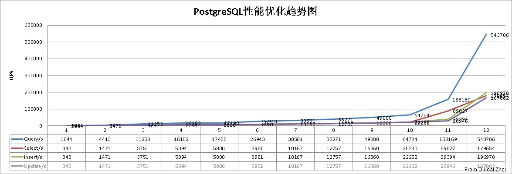
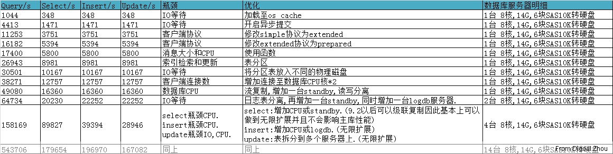

## PostgreSQL性能优化综合案例讲解 - 2    
                  
### 作者                                                               
digoal             
                    
### 日期               
2012-03-13              
                
### 标签             
PostgreSQL , 性能优化 , 综合案例             
                  
----            
                     
## 背景            
备注    
    
部署部分可以请参考    
    
[《PostgreSQL on Linux 最佳部署手册》](../201611/20161121_01.md)    
    
## 【调优阶段8】  
1\. 压力测试  
  
```  
pgbench -M prepared -r -c 1 -f /home/postgres/test/login0.sql -j 1 -n -T 180 -h 172.16.3.33 -p 1921 -U digoal digoal >./log.login0 &  
pgbench -M prepared -r -c 1 -f /home/postgres/test/login1.sql -j 1 -n -T 180 -h 172.16.3.33 -p 1921 -U digoal digoal >./log.login1 &  
pgbench -M prepared -r -c 2 -f /home/postgres/test/login2.sql -j 2 -n -T 180 -h 172.16.3.33 -p 1921 -U digoal digoal >./log.login2 &  
pgbench -M prepared -r -c 2 -f /home/postgres/test/login3.sql -j 2 -n -T 180 -h 172.16.3.33 -p 1921 -U digoal digoal >./log.login3 &  
pgbench -M prepared -r -c 2 -f /home/postgres/test/login4.sql -j 2 -n -T 180 -h 172.16.3.33 -p 1921 -U digoal digoal >./log.login4 &  
```  
  
2\. 测试结果  
  
```  
cat log.log*  
transaction type: Custom query  
scaling factor: 1  
query mode: prepared  
number of clients: 1  
number of threads: 1  
duration: 180 s  
number of transactions actually processed: 296485  
tps = 1647.130827 (including connections establishing)  
tps = 1647.153173 (excluding connections establishing)  
statement latencies in milliseconds:  
        0.003394        \setrandom userid 1 4000000  
        0.599293        SELECT f_user_login_0(:userid);  
transaction type: Custom query  
scaling factor: 1  
query mode: prepared  
number of clients: 1  
number of threads: 1  
duration: 180 s  
number of transactions actually processed: 270077  
tps = 1500.414232 (including connections establishing)  
tps = 1500.434330 (excluding connections establishing)  
statement latencies in milliseconds:  
        0.004436        \setrandom userid 4000001 8000000  
        0.656274        SELECT f_user_login_1(:userid);  
transaction type: Custom query  
scaling factor: 1  
query mode: prepared  
number of clients: 2  
number of threads: 2  
duration: 180 s  
number of transactions actually processed: 543390  
tps = 3018.814281 (including connections establishing)  
tps = 3018.901510 (excluding connections establishing)  
statement latencies in milliseconds:  
        0.004553        \setrandom userid 8000001 12000000  
        0.652033        SELECT f_user_login_2(:userid);  
transaction type: Custom query  
scaling factor: 1  
query mode: prepared  
number of clients: 2  
number of threads: 2  
duration: 180 s  
number of transactions actually processed: 592774  
tps = 3293.147194 (including connections establishing)  
tps = 3293.235012 (excluding connections establishing)  
statement latencies in milliseconds:  
        0.003446        \setrandom userid 12000001 16000000  
        0.599297        SELECT f_user_login_3(:userid);  
transaction type: Custom query  
scaling factor: 1  
query mode: prepared  
number of clients: 2  
number of threads: 2  
duration: 180 s  
number of transactions actually processed: 593614  
tps = 3297.831371 (including connections establishing)  
tps = 3297.946707 (excluding connections establishing)  
statement latencies in milliseconds:  
        0.003421        \setrandom userid 16000001 20000000  
        0.598465        SELECT f_user_login_4(:userid);  
```  
  
总计 :   
  
```  
tps = 12757.337905 (including connections establishing)  
tps = 12757.670732 (excluding connections establishing)  
```  
  
3\. 瓶颈分析与优化  
  
测试中我们使用的数据库服务器cpu是8核的服务器, 根据以往的经验, 当活跃的进程数等于核数的2倍时可以发挥CPU的最大能力.  
  
所以我们通过增加并发连接来看看到底有多少性能提升.  
  
## 【调优阶段9】  
1\. 压力测试  
  
```  
pgbench -M prepared -r -c 2 -f /home/postgres/test/login0.sql -j 2 -n -T 180 -h 172.16.3.33 -p 1921 -U digoal digoal >./log.login0 &  
pgbench -M prepared -r -c 2 -f /home/postgres/test/login1.sql -j 2 -n -T 180 -h 172.16.3.33 -p 1921 -U digoal digoal >./log.login1 &  
pgbench -M prepared -r -c 4 -f /home/postgres/test/login2.sql -j 4 -n -T 180 -h 172.16.3.33 -p 1921 -U digoal digoal >./log.login2 &  
pgbench -M prepared -r -c 4 -f /home/postgres/test/login3.sql -j 4 -n -T 180 -h 172.16.3.33 -p 1921 -U digoal digoal >./log.login3 &  
pgbench -M prepared -r -c 4 -f /home/postgres/test/login4.sql -j 4 -n -T 180 -h 172.16.3.33 -p 1921 -U digoal digoal >./log.login4 &  
```  
  
2\. 测试结果  
  
```  
cat log.log*  
transaction type: Custom query  
scaling factor: 1  
query mode: prepared  
number of clients: 2  
number of threads: 2  
duration: 180 s  
number of transactions actually processed: 375743  
tps = 2087.443600 (including connections establishing)  
tps = 2087.489913 (excluding connections establishing)  
statement latencies in milliseconds:  
        0.003492        \setrandom userid 1 4000000  
        0.949744        SELECT f_user_login_0(:userid);  
transaction type: Custom query  
scaling factor: 1  
query mode: prepared  
number of clients: 2  
number of threads: 2  
duration: 180 s  
number of transactions actually processed: 367801  
tps = 2043.313370 (including connections establishing)  
tps = 2043.386454 (excluding connections establishing)  
statement latencies in milliseconds:  
        0.003710        \setrandom userid 4000001 8000000  
        0.969828        SELECT f_user_login_1(:userid);  
transaction type: Custom query  
scaling factor: 1  
query mode: prepared  
number of clients: 4  
number of threads: 4  
duration: 180 s  
number of transactions actually processed: 730267  
tps = 4057.007177 (including connections establishing)  
tps = 4057.148280 (excluding connections establishing)  
statement latencies in milliseconds:  
        0.003962        \setrandom userid 8000001 12000000  
        0.976372        SELECT f_user_login_2(:userid);  
transaction type: Custom query  
scaling factor: 1  
query mode: prepared  
number of clients: 4  
number of threads: 4  
duration: 180 s  
number of transactions actually processed: 738398  
tps = 4101.985844 (including connections establishing)  
tps = 4102.135039 (excluding connections establishing)  
statement latencies in milliseconds:  
        0.003615        \setrandom userid 12000001 16000000  
        0.966314        SELECT f_user_login_3(:userid);  
transaction type: Custom query  
scaling factor: 1  
query mode: prepared  
number of clients: 4  
number of threads: 4  
duration: 180 s  
number of transactions actually processed: 732793  
tps = 4070.957105 (including connections establishing)  
tps = 4071.200533 (excluding connections establishing)  
statement latencies in milliseconds:  
        0.003882        \setrandom userid 16000001 20000000  
        0.973208        SELECT f_user_login_4(:userid);  
```  
  
总计 :   
  
```  
tps = 16360.707096 (including connections establishing)  
tps = 16361.360219 (excluding connections establishing)  
```  
  
3\. 瓶颈分析与优化  
  
继续增加连接,tps还可以再提高吗? : 不可以.  
  
8核的机器16个活动的会话基本上就到达它的上限了.   
  
因此要提高tps还可以加CPU.  
  
下面增加连接到30个的测试结果证明了上面的结论.  
  
```  
pgbench -M prepared -r -c 6 -f /home/postgres/test/login0.sql -j 6 -n -T 180 -h 172.16.3.33 -p 1921 -U digoal digoal >./log.login0 &  
pgbench -M prepared -r -c 6 -f /home/postgres/test/login1.sql -j 6 -n -T 180 -h 172.16.3.33 -p 1921 -U digoal digoal >./log.login1 &  
pgbench -M prepared -r -c 6 -f /home/postgres/test/login2.sql -j 6 -n -T 180 -h 172.16.3.33 -p 1921 -U digoal digoal >./log.login2 &  
pgbench -M prepared -r -c 6 -f /home/postgres/test/login3.sql -j 6 -n -T 180 -h 172.16.3.33 -p 1921 -U digoal digoal >./log.login3 &  
pgbench -M prepared -r -c 6 -f /home/postgres/test/login4.sql -j 6 -n -T 180 -h 172.16.3.33 -p 1921 -U digoal digoal >./log.login4 &  
```  
  
结果  
  
```  
cat log.log*  
transaction type: Custom query  
scaling factor: 1  
query mode: prepared  
number of clients: 6  
number of threads: 6  
duration: 180 s  
number of transactions actually processed: 544811  
tps = 3026.494301 (including connections establishing)  
tps = 3026.608244 (excluding connections establishing)  
statement latencies in milliseconds:  
        0.003768        \setrandom userid 1 4000000  
        1.973230        SELECT f_user_login_0(:userid);  
transaction type: Custom query  
scaling factor: 1  
query mode: prepared  
number of clients: 6  
number of threads: 6  
duration: 180 s  
number of transactions actually processed: 544485  
tps = 3024.298399 (including connections establishing)  
tps = 3024.468785 (excluding connections establishing)  
statement latencies in milliseconds:  
        0.003735        \setrandom userid 4000001 8000000  
        1.974466        SELECT f_user_login_1(:userid);  
transaction type: Custom query  
scaling factor: 1  
query mode: prepared  
number of clients: 6  
number of threads: 6  
duration: 180 s  
number of transactions actually processed: 544778  
tps = 3025.262019 (including connections establishing)  
tps = 3025.469901 (excluding connections establishing)  
statement latencies in milliseconds:  
        0.003707        \setrandom userid 8000001 12000000  
        1.973661        SELECT f_user_login_2(:userid);  
transaction type: Custom query  
scaling factor: 1  
query mode: prepared  
number of clients: 6  
number of threads: 6  
duration: 180 s  
number of transactions actually processed: 542008  
tps = 3010.921306 (including connections establishing)  
tps = 3011.146550 (excluding connections establishing)  
statement latencies in milliseconds:  
        0.003662        \setrandom userid 12000001 16000000  
        1.983714        SELECT f_user_login_3(:userid);  
transaction type: Custom query  
scaling factor: 1  
query mode: prepared  
number of clients: 6  
number of threads: 6  
duration: 180 s  
number of transactions actually processed: 539505  
tps = 2996.511493 (including connections establishing)  
tps = 2996.874239 (excluding connections establishing)  
statement latencies in milliseconds:  
        0.003768        \setrandom userid 16000001 20000000  
        1.992923        SELECT f_user_login_4(:userid);  
```  
  
总计 :   
  
```  
tps = 15083.487518 (including connections establishing)  
tps = 15084.567719 (excluding connections establishing)  
```  
  
连接数超过2倍核数后根本不会有性能提升了, 这台服务器的潜力基本上挖掘得差不多了.  
  
接下来就需要通过增加服务器来提升数据库的整体性能了.  
  
首先要用到的是PostgreSQL的流复制, 通过hot standby可以进行读写分离, 也就是将SELECT的请求分发到hot standby上.  
  
(需要注意跨库事务的问题, 如standby的延时, 这里不详细阐述)  
  
新建查询函数和插入更新函数 :   
  
```  
create or replace function f_user_login_sel_0  
(i_userid int,  
OUT o_userid int,  
OUT o_engname text,  
OUT o_cnname text,  
OUT o_occupation text,  
OUT o_birthday date,  
OUT o_signname text,  
OUT o_email text,  
OUT o_qq numeric  
)  
as $BODY$  
declare  
begin  
select userid,engname,cnname,occupation,birthday,signname,email,qq  
into o_userid,o_engname,o_cnname,o_occupation,o_birthday,o_signname,o_email,o_qq  
from user_info_0 where userid=i_userid;  
return;  
end;  
$BODY$  
language plpgsql;  
  
create or replace function f_user_login_sel_1  
(i_userid int,  
OUT o_userid int,  
OUT o_engname text,  
OUT o_cnname text,  
OUT o_occupation text,  
OUT o_birthday date,  
OUT o_signname text,  
OUT o_email text,  
OUT o_qq numeric  
)  
as $BODY$  
declare  
begin  
select userid,engname,cnname,occupation,birthday,signname,email,qq  
into o_userid,o_engname,o_cnname,o_occupation,o_birthday,o_signname,o_email,o_qq  
from user_info_1 where userid=i_userid;  
return;  
end;  
$BODY$  
language plpgsql;  
  
create or replace function f_user_login_sel_2  
(i_userid int,  
OUT o_userid int,  
OUT o_engname text,  
OUT o_cnname text,  
OUT o_occupation text,  
OUT o_birthday date,  
OUT o_signname text,  
OUT o_email text,  
OUT o_qq numeric  
)  
as $BODY$  
declare  
begin  
select userid,engname,cnname,occupation,birthday,signname,email,qq  
into o_userid,o_engname,o_cnname,o_occupation,o_birthday,o_signname,o_email,o_qq  
from user_info_2 where userid=i_userid;  
return;  
end;  
$BODY$  
language plpgsql;  
  
create or replace function f_user_login_sel_3  
(i_userid int,  
OUT o_userid int,  
OUT o_engname text,  
OUT o_cnname text,  
OUT o_occupation text,  
OUT o_birthday date,  
OUT o_signname text,  
OUT o_email text,  
OUT o_qq numeric  
)  
as $BODY$  
declare  
begin  
select userid,engname,cnname,occupation,birthday,signname,email,qq  
into o_userid,o_engname,o_cnname,o_occupation,o_birthday,o_signname,o_email,o_qq  
from user_info_3 where userid=i_userid;  
return;  
end;  
$BODY$  
language plpgsql;  
  
create or replace function f_user_login_sel_4  
(i_userid int,  
OUT o_userid int,  
OUT o_engname text,  
OUT o_cnname text,  
OUT o_occupation text,  
OUT o_birthday date,  
OUT o_signname text,  
OUT o_email text,  
OUT o_qq numeric  
)  
as $BODY$  
declare  
begin  
select userid,engname,cnname,occupation,birthday,signname,email,qq  
into o_userid,o_engname,o_cnname,o_occupation,o_birthday,o_signname,o_email,o_qq  
from user_info_4 where userid=i_userid;  
return;  
end;  
$BODY$  
language plpgsql;  
  
create or replace function f_user_login_insupd_0  
(i_userid int  
)  
returns int as $BODY$  
declare  
begin  
insert into user_login_rec (userid,login_time,ip) values (i_userid,now(),inet_client_addr());  
update user_session_0 set logintime=now(),login_count=login_count+1 where userid=i_userid;  
return 0;  
exception  
when others then  
return 1;  
end;  
$BODY$  
language plpgsql;  
  
create or replace function f_user_login_insupd_1  
(i_userid int  
)  
returns int as $BODY$  
declare  
begin  
insert into user_login_rec (userid,login_time,ip) values (i_userid,now(),inet_client_addr());  
update user_session_1 set logintime=now(),login_count=login_count+1 where userid=i_userid;  
return 0;  
exception  
when others then  
return 1;  
end;  
$BODY$  
language plpgsql;  
  
create or replace function f_user_login_insupd_2  
(i_userid int  
)  
returns int as $BODY$  
declare  
begin  
insert into user_login_rec (userid,login_time,ip) values (i_userid,now(),inet_client_addr());  
update user_session_2 set logintime=now(),login_count=login_count+1 where userid=i_userid;  
return 0;  
exception  
when others then  
return 1;  
end;  
$BODY$  
language plpgsql;  
  
create or replace function f_user_login_insupd_3  
(i_userid int  
)  
returns int as $BODY$  
declare  
begin  
insert into user_login_rec (userid,login_time,ip) values (i_userid,now(),inet_client_addr());  
update user_session_3 set logintime=now(),login_count=login_count+1 where userid=i_userid;  
return 0;  
exception  
when others then  
return 1;  
end;  
$BODY$  
language plpgsql;  
  
create or replace function f_user_login_insupd_4  
(i_userid int  
)  
returns int as $BODY$  
declare  
begin  
insert into user_login_rec (userid,login_time,ip) values (i_userid,now(),inet_client_addr());  
update user_session_4 set logintime=now(),login_count=login_count+1 where userid=i_userid;  
return 0;  
exception  
when others then  
return 1;  
end;  
$BODY$  
language plpgsql;  
```  
  
hot standby库也需要将数据加载到内存, 具体操作略.  
  
## 【调优阶段10】  
1\. 测试脚本  
  
```  
cat log*  
\setrandom userid 1 4000000  
SELECT f_user_login_insupd_0(:userid);  
\setrandom userid 4000001 8000000  
SELECT f_user_login_insupd_1(:userid);  
\setrandom userid 8000001 12000000  
SELECT f_user_login_insupd_2(:userid);  
\setrandom userid 12000001 16000000  
SELECT f_user_login_insupd_3(:userid);  
\setrandom userid 16000001 20000000  
SELECT f_user_login_insupd_4(:userid);  
\setrandom userid 1 4000000  
SELECT f_user_login_sel_0(:userid);  
\setrandom userid 4000001 8000000  
SELECT f_user_login_sel_1(:userid);  
\setrandom userid 8000001 12000000  
SELECT f_user_login_sel_2(:userid);  
\setrandom userid 12000001 16000000  
SELECT f_user_login_sel_3(:userid);  
\setrandom userid 16000001 20000000  
SELECT f_user_login_sel_4(:userid);  
```  
  
2\. 压力测试  
  
```  
pgbench -M prepared -r -c 3 -f /home/postgres/test_zsplit/login_sel0.sql -j 3 -n -T 180 -h 172.16.3.33 -p 1921 -U digoal digoal >./log.login_sel0 &  
pgbench -M prepared -r -c 3 -f /home/postgres/test_zsplit/login_sel1.sql -j 3 -n -T 180 -h 172.16.3.33 -p 1921 -U digoal digoal >./log.login_sel1 &  
pgbench -M prepared -r -c 3 -f /home/postgres/test_zsplit/login_sel2.sql -j 3 -n -T 180 -h 172.16.3.33 -p 1921 -U digoal digoal >./log.login_sel2 &  
pgbench -M prepared -r -c 3 -f /home/postgres/test_zsplit/login_sel3.sql -j 3 -n -T 180 -h 172.16.3.33 -p 1921 -U digoal digoal >./log.login_sel3 &  
pgbench -M prepared -r -c 4 -f /home/postgres/test_zsplit/login_sel4.sql -j 4 -n -T 180 -h 172.16.3.33 -p 1921 -U digoal digoal >./log.login_sel4 &  
pgbench -M prepared -r -c 3 -f /home/postgres/test_zsplit/login_insupd0.sql -j 3 -n -T 180 -h 172.16.3.150 -p 1921 -U digoal digoal >./log.login_insupd0 &  
pgbench -M prepared -r -c 3 -f /home/postgres/test_zsplit/login_insupd1.sql -j 3 -n -T 180 -h 172.16.3.150 -p 1921 -U digoal digoal >./log.login_insupd1 &  
pgbench -M prepared -r -c 3 -f /home/postgres/test_zsplit/login_insupd2.sql -j 3 -n -T 180 -h 172.16.3.150 -p 1921 -U digoal digoal >./log.login_insupd2 &  
pgbench -M prepared -r -c 3 -f /home/postgres/test_zsplit/login_insupd3.sql -j 3 -n -T 180 -h 172.16.3.150 -p 1921 -U digoal digoal >./log.login_insupd3 &  
pgbench -M prepared -r -c 4 -f /home/postgres/test_zsplit/login_insupd4.sql -j 4 -n -T 180 -h 172.16.3.150 -p 1921 -U digoal digoal >./log.login_insupd4 &  
```  
  
3\. 测试结果  
  
  
hot standby的测试数据 :   
  
```  
cat log.login_sel*  
transaction type: Custom query  
scaling factor: 1  
query mode: prepared  
number of clients: 3  
number of threads: 3  
duration: 180 s  
number of transactions actually processed: 552618  
tps = 3012.767914 (including connections establishing)  
tps = 3012.877330 (excluding connections establishing)  
statement latencies in milliseconds:  
        0.003166        \setrandom userid 1 4000000  
        0.988247        SELECT f_user_login_sel_0(:userid);  
transaction type: Custom query  
scaling factor: 1  
query mode: prepared  
number of clients: 3  
number of threads: 3  
duration: 180 s  
number of transactions actually processed: 750314  
tps = 4089.671930 (including connections establishing)  
tps = 4089.771337 (excluding connections establishing)  
statement latencies in milliseconds:  
        0.003030        \setrandom userid 4000001 8000000  
        0.726462        SELECT f_user_login_sel_1(:userid);  
transaction type: Custom query  
scaling factor: 1  
query mode: prepared  
number of clients: 3  
number of threads: 3  
duration: 180 s  
number of transactions actually processed: 727839  
tps = 3967.242817 (including connections establishing)  
tps = 3967.364415 (excluding connections establishing)  
statement latencies in milliseconds:  
        0.003260        \setrandom userid 8000001 12000000  
        0.748466        SELECT f_user_login_sel_2(:userid);  
transaction type: Custom query  
scaling factor: 1  
query mode: prepared  
number of clients: 3  
number of threads: 3  
duration: 180 s  
number of transactions actually processed: 715952  
tps = 3903.028278 (including connections establishing)  
tps = 3903.130455 (excluding connections establishing)  
statement latencies in milliseconds:  
        0.003077        \setrandom userid 12000001 16000000  
        0.761439        SELECT f_user_login_sel_3(:userid);  
transaction type: Custom query  
scaling factor: 1  
query mode: prepared  
number of clients: 4  
number of threads: 4  
duration: 180 s  
number of transactions actually processed: 964366  
tps = 5257.974345 (including connections establishing)  
tps = 5258.120849 (excluding connections establishing)  
statement latencies in milliseconds:  
        0.003153        \setrandom userid 16000001 20000000  
        0.753196        SELECT f_user_login_sel_4(:userid);  
```  
  
总计 :   
  
```  
tps = 20230.685284 (including connections establishing)  
tps = 20231.264386 (excluding connections establishing)  
```  
  
primary的测试数据 :   
  
```  
cat log.login_insupd*  
transaction type: Custom query  
scaling factor: 1  
query mode: prepared  
number of clients: 3  
number of threads: 3  
duration: 180 s  
number of transactions actually processed: 745415  
tps = 4141.145602 (including connections establishing)  
tps = 4141.250129 (excluding connections establishing)  
statement latencies in milliseconds:  
        0.003236        \setrandom userid 1 4000000  
        0.716912        SELECT f_user_login_insupd_0(:userid);  
transaction type: Custom query  
scaling factor: 1  
query mode: prepared  
number of clients: 3  
number of threads: 3  
duration: 180 s  
number of transactions actually processed: 737761  
tps = 4098.582645 (including connections establishing)  
tps = 4098.704693 (excluding connections establishing)  
statement latencies in milliseconds:  
        0.003360        \setrandom userid 4000001 8000000  
        0.723997        SELECT f_user_login_insupd_1(:userid);  
transaction type: Custom query  
scaling factor: 1  
query mode: prepared  
number of clients: 3  
number of threads: 3  
duration: 180 s  
number of transactions actually processed: 761171  
tps = 4228.709500 (including connections establishing)  
tps = 4228.817139 (excluding connections establishing)  
statement latencies in milliseconds:  
        0.003333        \setrandom userid 8000001 12000000  
        0.701648        SELECT f_user_login_insupd_2(:userid);  
transaction type: Custom query  
scaling factor: 1  
query mode: prepared  
number of clients: 3  
number of threads: 3  
duration: 180 s  
number of transactions actually processed: 761960  
tps = 4233.031271 (including connections establishing)  
tps = 4233.166856 (excluding connections establishing)  
statement latencies in milliseconds:  
        0.003306        \setrandom userid 12000001 16000000  
        0.700967        SELECT f_user_login_insupd_3(:userid);  
transaction type: Custom query  
scaling factor: 1  
query mode: prepared  
number of clients: 4  
number of threads: 4  
duration: 180 s  
number of transactions actually processed: 999167  
tps = 5550.893825 (including connections establishing)  
tps = 5551.246720 (excluding connections establishing)  
statement latencies in milliseconds:  
        0.003385        \setrandom userid 16000001 20000000  
        0.712689        SELECT f_user_login_insupd_4(:userid);  
```  
  
总计 :   
  
```  
tps = 22252.362843 (including connections establishing)  
tps = 22253.185537 (excluding connections establishing)  
  
QPS :   
qps = 20230.685284 + (22252.362843 * 2) (including connections establishing)  
qps = 20231.264386 + (22253.185537 * 2) (excluding connections establishing)  
```  
  
4\. 瓶颈分析与优化  
  
主节点 :   
  
```  
avg-cpu:  %user   %nice %system %iowait  %steal   %idle  
          56.30    0.00   21.72    4.24    0.00   17.73  
Device:         rrqm/s   wrqm/s   r/s   w/s   rsec/s   wsec/s avgrq-sz avgqu-sz   await  svctm  %util  
sda               0.00     0.00  0.00  0.00     0.00     0.00     0.00     0.00    0.00   0.00   0.00  
sda1              0.00     0.00  0.00  0.00     0.00     0.00     0.00     0.00    0.00   0.00   0.00  
sda2              0.00     0.00  0.00  0.00     0.00     0.00     0.00     0.00    0.00   0.00   0.00  
sda3              0.00     0.00  0.00  0.00     0.00     0.00     0.00     0.00    0.00   0.00   0.00  
sdc               0.00  2781.50  0.00 93.50     0.00 22876.00   244.66     0.09    0.93   0.90   8.40  
sdd               0.00 10656.50  0.00 2302.50     0.00 105300.00    45.73   108.00   27.85   0.43 100.05  
dm-0              0.00     0.00  0.00 2875.50     0.00 23004.00     8.00     2.56    0.89   0.03   8.30  
dm-1              0.00     0.00  0.00 12943.00     0.00 103544.00     8.00   569.00   34.94   0.08 100.10  
dm-2              0.00     0.00  0.00 2832.50     0.00 22660.00     8.00     2.55    0.90   0.03   8.05  
dm-3              0.00     0.00  0.00 41.50     0.00   332.00     8.00     0.02    0.54   0.06   0.25  
dm-4              0.00     0.00  0.00  1.50     0.00    12.00     8.00     0.00    0.00   0.00   0.00  
dm-5              0.00     0.00  0.00  1.00     0.00     8.00     8.00     0.01    0.00   4.00   0.40  
dm-6              0.00     0.00  0.00 11545.50     0.00 92364.00     8.00   505.23   33.04   0.08  91.75  
dm-7              0.00     0.00  0.00 1396.50     0.00 11172.00     8.00    63.54   50.65   0.15  20.65  
```  
  
standby节点 :   
  
```  
avg-cpu:  %user   %nice %system %iowait  %steal   %idle  
           0.00    0.00    0.31   12.87    0.00   86.82  
Device:         rrqm/s   wrqm/s   r/s   w/s   rsec/s   wsec/s avgrq-sz avgqu-sz   await  svctm  %util  
cciss/c0d0        0.00  1222.39  0.00 996.52     0.00 19136.32    19.20   113.22  116.63   1.00  99.55  
cciss/c0d0p1      0.00     2.99  0.00  1.00     0.00    31.84    32.00     0.10  101.50 101.50  10.10  
cciss/c0d0p2      0.00     0.00  0.00  0.00     0.00     0.00     0.00     0.00    0.00   0.00   0.00  
cciss/c0d0p3      0.00  1219.40  0.00 995.52     0.00 19104.48    19.19   113.12  116.64   1.00  99.55  
cciss/c0d1        0.00     0.00  0.00  0.00     0.00     0.00     0.00     0.00    0.00   0.00   0.00  
cciss/c0d2        0.00  1384.08  0.00 251.74     0.00 13297.51    52.82   142.31  522.75   3.95  99.55  
cciss/c0d3        0.00     0.00  0.00  0.00     0.00     0.00     0.00     0.00    0.00   0.00   0.00  
cciss/c0d4        0.00     0.00  0.00  0.00     0.00     0.00     0.00     0.00    0.00   0.00   0.00  
cciss/c0d5        0.00     0.00  0.00  0.00     0.00     0.00     0.00     0.00    0.00   0.00   0.00  
dm-0              0.00     0.00  0.00  0.00     0.00     0.00     0.00     0.00    0.00   0.00   0.00  
dm-1              0.00     0.00  0.00 1638.81     0.00 13110.45     8.00   946.36  538.61   0.61  99.55  
dm-2              0.00     0.00  0.00  0.00     0.00     0.00     0.00     0.00    0.00   0.00   0.00  
dm-3              0.00     0.00  0.00  0.00     0.00     0.00     0.00     0.00    0.00   0.00   0.00  
dm-4              0.00     0.00  0.00  0.00     0.00     0.00     0.00     0.00    0.00   0.00   0.00  
dm-5              0.00     0.00  0.00 2193.03     0.00 17544.28     8.00   275.53  132.89   0.45  99.55  
```  
  
显然IO到达瓶颈了. 为什么每次IO都顶不住呢? 是的, 机械硬盘的随机IOPS能力就是这么差, 不要有太高的奢望.  
  
要提升IOPS要么就用高端存储要么就选择SSD硬盘. 下次有机会找块ssd硬盘来测试一下它的iops能力到底有多强.  
  
那么这些IO是怎么产生的呢?  
  
1\. 主库的IO来自insert和update请求.  
  
2\. hot standby的IO来自stream data recovery.  
  
因为我的测试环境没有办法扩存储, 所以这里就不通过扩存储来解决这个瓶颈了, 还是加服务器.   
  
但是这次加2台服务器, 1台用来做hot standby. 另一台我要把insert请求剥离过去.  
  
也就是总共用4台服务器.  
  
具体的操作如下 :   
  
  
初始化新增的日志库 :   
  
```  
create table user_login_rec  
(userid int,  
login_time timestamp without time zone,  
ip inet  
);  
  
create table user_logout_rec  
(userid int,  
logout_time timestamp without time zone,  
ip inet  
);  
  
create or replace function f_user_login_ins  
(i_userid int)  
returns int as $BODY$  
declare  
begin  
insert into user_login_rec (userid,login_time,ip) values (i_userid,now(),inet_client_addr());  
return 0;  
exception  
when others then  
return 1;  
end;  
$BODY$  
language plpgsql;  
```  
  
主库新增函数 :   
  
```  
create or replace function f_user_login_upd_0  
(i_userid int  
)  
returns int as $BODY$  
declare  
begin  
update user_session_0 set logintime=now(),login_count=login_count+1 where userid=i_userid;  
return 0;  
exception  
when others then  
return 1;  
end;  
$BODY$  
language plpgsql;  
  
create or replace function f_user_login_upd_1  
(i_userid int  
)  
returns int as $BODY$  
declare  
begin  
update user_session_1 set logintime=now(),login_count=login_count+1 where userid=i_userid;  
return 0;  
exception  
when others then  
return 1;  
end;  
$BODY$  
language plpgsql;  
  
create or replace function f_user_login_upd_2  
(i_userid int  
)  
returns int as $BODY$  
declare  
begin  
update user_session_2 set logintime=now(),login_count=login_count+1 where userid=i_userid;  
return 0;  
exception  
when others then  
return 1;  
end;  
$BODY$  
language plpgsql;  
  
create or replace function f_user_login_upd_3  
(i_userid int  
)  
returns int as $BODY$  
declare  
begin  
update user_session_3 set logintime=now(),login_count=login_count+1 where userid=i_userid;  
return 0;  
exception  
when others then  
return 1;  
end;  
$BODY$  
language plpgsql;  
  
create or replace function f_user_login_upd_4  
(i_userid int  
)  
returns int as $BODY$  
declare  
begin  
update user_session_4 set logintime=now(),login_count=login_count+1 where userid=i_userid;  
return 0;  
exception  
when others then  
return 1;  
end;  
$BODY$  
language plpgsql;  
```  
  
再增加一台standby, 流复制过程略, 请参考我写过的流复制环境搭建BLOG.  
  
《PostgreSQL HOT STANDBY using Stream》  
  
http://blog.163.com/digoal@126/blog/static/16387704020110442050808/  
  
优化当前环境如下,  
  
```  
primary : 172.16.3.150  
standby1 : 172.16.3.33  
standby2 : 172.16.3.39  
logdb : 172.16.3.40  
```  
  
## 【调优阶段11】  
1\. 测试脚本  
  
```  
postgres@db5-> cat login_ins.sql   
\setrandom userid 1 20000000  
SELECT f_user_login_ins(:userid);  
postgres@db5-> cat login_sel*  
\setrandom userid 1 4000000  
SELECT f_user_login_sel_0(:userid);  
\setrandom userid 4000001 8000000  
SELECT f_user_login_sel_1(:userid);  
\setrandom userid 8000001 12000000  
SELECT f_user_login_sel_2(:userid);  
\setrandom userid 12000001 16000000  
SELECT f_user_login_sel_3(:userid);  
\setrandom userid 16000001 20000000  
SELECT f_user_login_sel_4(:userid);  
postgres@db5-> cat login_upd*  
\setrandom userid 1 4000000  
SELECT f_user_login_upd_0(:userid);  
\setrandom userid 4000001 8000000  
SELECT f_user_login_upd_1(:userid);  
\setrandom userid 8000001 12000000  
SELECT f_user_login_upd_2(:userid);  
\setrandom userid 12000001 16000000  
SELECT f_user_login_upd_3(:userid);  
\setrandom userid 16000001 20000000  
SELECT f_user_login_upd_4(:userid);  
```  
  
2\. 压力测试  
  
```  
pgbench -M prepared -r -c 3 -f /home/postgres/test_zsplit/login_sel0.sql -j 3 -n -T 180 -h 172.16.3.33 -p 1921 -U digoal digoal >./log.login33_sel0 &  
pgbench -M prepared -r -c 3 -f /home/postgres/test_zsplit/login_sel1.sql -j 3 -n -T 180 -h 172.16.3.33 -p 1921 -U digoal digoal >./log.login33_sel1 &  
pgbench -M prepared -r -c 3 -f /home/postgres/test_zsplit/login_sel2.sql -j 3 -n -T 180 -h 172.16.3.33 -p 1921 -U digoal digoal >./log.login33_sel2 &  
pgbench -M prepared -r -c 3 -f /home/postgres/test_zsplit/login_sel3.sql -j 3 -n -T 180 -h 172.16.3.33 -p 1921 -U digoal digoal >./log.login33_sel3 &  
pgbench -M prepared -r -c 4 -f /home/postgres/test_zsplit/login_sel4.sql -j 4 -n -T 180 -h 172.16.3.33 -p 1921 -U digoal digoal >./log.login33_sel4 &  
pgbench -M prepared -r -c 3 -f /home/postgres/test_zsplit/login_sel0.sql -j 3 -n -T 180 -h 172.16.3.39 -p 1921 -U digoal digoal >./log.login39_sel0 &  
pgbench -M prepared -r -c 3 -f /home/postgres/test_zsplit/login_sel1.sql -j 3 -n -T 180 -h 172.16.3.39 -p 1921 -U digoal digoal >./log.login39_sel1 &  
pgbench -M prepared -r -c 3 -f /home/postgres/test_zsplit/login_sel2.sql -j 3 -n -T 180 -h 172.16.3.39 -p 1921 -U digoal digoal >./log.login39_sel2 &  
pgbench -M prepared -r -c 3 -f /home/postgres/test_zsplit/login_sel3.sql -j 3 -n -T 180 -h 172.16.3.39 -p 1921 -U digoal digoal >./log.login39_sel3 &  
pgbench -M prepared -r -c 4 -f /home/postgres/test_zsplit/login_sel4.sql -j 4 -n -T 180 -h 172.16.3.39 -p 1921 -U digoal digoal >./log.login39_sel4 &  
pgbench -M prepared -r -c 3 -f /home/postgres/test_zsplit/login_upd0.sql -j 3 -n -T 180 -h 172.16.3.150 -p 1921 -U digoal digoal >./log.login_upd0 &  
pgbench -M prepared -r -c 3 -f /home/postgres/test_zsplit/login_upd1.sql -j 3 -n -T 180 -h 172.16.3.150 -p 1921 -U digoal digoal >./log.login_upd1 &  
pgbench -M prepared -r -c 3 -f /home/postgres/test_zsplit/login_upd2.sql -j 3 -n -T 180 -h 172.16.3.150 -p 1921 -U digoal digoal >./log.login_upd2 &  
pgbench -M prepared -r -c 3 -f /home/postgres/test_zsplit/login_upd3.sql -j 3 -n -T 180 -h 172.16.3.150 -p 1921 -U digoal digoal >./log.login_upd3 &  
pgbench -M prepared -r -c 4 -f /home/postgres/test_zsplit/login_upd4.sql -j 4 -n -T 180 -h 172.16.3.150 -p 1921 -U digoal digoal >./log.login_upd4 &  
pgbench -M prepared -r -c 16 -f /home/postgres/test_zsplit/login_ins.sql -j 16 -n -T 180 -h 172.16.3.40 -p 1921 -U digoal digoal >./log.login_ins &  
```  
  
3\. 测试结果  
  
```  
cat log.login33_sel*  
transaction type: Custom query  
scaling factor: 1  
query mode: prepared  
number of clients: 3  
number of threads: 3  
duration: 180 s  
number of transactions actually processed: 1534211  
tps = 8523.315651 (including connections establishing)  
tps = 8523.524318 (excluding connections establishing)  
statement latencies in milliseconds:  
        0.002438        \setrandom userid 1 4000000  
        0.346514        SELECT f_user_login_sel_0(:userid);  
transaction type: Custom query  
scaling factor: 1  
query mode: prepared  
number of clients: 3  
number of threads: 3  
duration: 180 s  
number of transactions actually processed: 1533785  
tps = 8520.894378 (including connections establishing)  
tps = 8521.168645 (excluding connections establishing)  
statement latencies in milliseconds:  
        0.002423        \setrandom userid 4000001 8000000  
        0.346564        SELECT f_user_login_sel_1(:userid);  
transaction type: Custom query  
scaling factor: 1  
query mode: prepared  
number of clients: 3  
number of threads: 3  
duration: 180 s  
number of transactions actually processed: 1544585  
tps = 8580.974433 (including connections establishing)  
tps = 8581.260902 (excluding connections establishing)  
statement latencies in milliseconds:  
        0.002448        \setrandom userid 8000001 12000000  
        0.344071        SELECT f_user_login_sel_2(:userid);  
transaction type: Custom query  
scaling factor: 1  
query mode: prepared  
number of clients: 3  
number of threads: 3  
duration: 180 s  
number of transactions actually processed: 1482080  
tps = 8233.719776 (including connections establishing)  
tps = 8234.138037 (excluding connections establishing)  
statement latencies in milliseconds:  
        0.002435        \setrandom userid 12000001 16000000  
        0.358877        SELECT f_user_login_sel_3(:userid);  
transaction type: Custom query  
scaling factor: 1  
query mode: prepared  
number of clients: 4  
number of threads: 4  
duration: 180 s  
number of transactions actually processed: 1982503  
tps = 11013.842899 (including connections establishing)  
tps = 11014.329592 (excluding connections establishing)  
statement latencies in milliseconds:  
        0.002422        \setrandom userid 16000001 20000000  
        0.357698        SELECT f_user_login_sel_4(:userid);  
  
cat log.login39_sel*  
transaction type: Custom query  
scaling factor: 1  
query mode: prepared  
number of clients: 3  
number of threads: 3  
duration: 180 s  
number of transactions actually processed: 1534696  
tps = 8526.005287 (including connections establishing)  
tps = 8526.221472 (excluding connections establishing)  
statement latencies in milliseconds:  
        0.002436        \setrandom userid 1 4000000  
        0.346352        SELECT f_user_login_sel_0(:userid);  
transaction type: Custom query  
scaling factor: 1  
query mode: prepared  
number of clients: 3  
number of threads: 3  
duration: 180 s  
number of transactions actually processed: 1542513  
tps = 8569.192037 (including connections establishing)  
tps = 8569.392061 (excluding connections establishing)  
statement latencies in milliseconds:  
        0.002416        \setrandom userid 4000001 8000000  
        0.344625        SELECT f_user_login_sel_1(:userid);  
transaction type: Custom query  
scaling factor: 1  
query mode: prepared  
number of clients: 3  
number of threads: 3  
duration: 180 s  
number of transactions actually processed: 1508389  
tps = 8379.888796 (including connections establishing)  
tps = 8380.257897 (excluding connections establishing)  
statement latencies in milliseconds:  
        0.002426        \setrandom userid 8000001 12000000  
        0.352536        SELECT f_user_login_sel_2(:userid);  
transaction type: Custom query  
scaling factor: 1  
query mode: prepared  
number of clients: 3  
number of threads: 3  
duration: 180 s  
number of transactions actually processed: 1491690  
tps = 8287.124725 (including connections establishing)  
tps = 8287.453198 (excluding connections establishing)  
statement latencies in milliseconds:  
        0.002464        \setrandom userid 12000001 16000000  
        0.356436        SELECT f_user_login_sel_3(:userid);  
transaction type: Custom query  
scaling factor: 1  
query mode: prepared  
number of clients: 4  
number of threads: 4  
duration: 180 s  
number of transactions actually processed: 2014650  
tps = 11192.426565 (including connections establishing)  
tps = 11192.867173 (excluding connections establishing)  
statement latencies in milliseconds:  
        0.002418        \setrandom userid 16000001 20000000  
        0.351905        SELECT f_user_login_sel_4(:userid);  
  
cat log.login_ins   
transaction type: Custom query  
scaling factor: 1  
query mode: prepared  
number of clients: 16  
number of threads: 16  
duration: 180 s  
number of transactions actually processed: 7091331  
tps = 39394.952222 (including connections establishing)  
tps = 39397.035365 (excluding connections establishing)  
statement latencies in milliseconds:  
        0.002984        \setrandom userid 1 20000000  
        0.399208        SELECT f_user_login_ins(:userid);  
  
cat log.login_upd*  
transaction type: Custom query  
scaling factor: 1  
query mode: prepared  
number of clients: 3  
number of threads: 3  
duration: 180 s  
number of transactions actually processed: 968016  
tps = 5377.633815 (including connections establishing)  
tps = 5377.769568 (excluding connections establishing)  
statement latencies in milliseconds:  
        0.002434        \setrandom userid 1 4000000  
        0.552395        SELECT f_user_login_upd_0(:userid);  
transaction type: Custom query  
scaling factor: 1  
query mode: prepared  
number of clients: 3  
number of threads: 3  
duration: 180 s  
number of transactions actually processed: 965529  
tps = 5363.841108 (including connections establishing)  
tps = 5364.017826 (excluding connections establishing)  
statement latencies in milliseconds:  
        0.002461        \setrandom userid 4000001 8000000  
        0.553797        SELECT f_user_login_upd_1(:userid);  
transaction type: Custom query  
scaling factor: 1  
query mode: prepared  
number of clients: 3  
number of threads: 3  
duration: 180 s  
number of transactions actually processed: 969904  
tps = 5388.302421 (including connections establishing)  
tps = 5388.476038 (excluding connections establishing)  
statement latencies in milliseconds:  
        0.002436        \setrandom userid 8000001 12000000  
        0.551348        SELECT f_user_login_upd_2(:userid);  
transaction type: Custom query  
scaling factor: 1  
query mode: prepared  
number of clients: 3  
number of threads: 3  
duration: 180 s  
number of transactions actually processed: 990833  
tps = 5504.605729 (including connections establishing)  
tps = 5504.844893 (excluding connections establishing)  
statement latencies in milliseconds:  
        0.002448        \setrandom userid 12000001 16000000  
        0.539510        SELECT f_user_login_upd_3(:userid);  
transaction type: Custom query  
scaling factor: 1  
query mode: prepared  
number of clients: 4  
number of threads: 4  
duration: 180 s  
number of transactions actually processed: 1316258  
tps = 7312.497604 (including connections establishing)  
tps = 7312.837009 (excluding connections establishing)  
statement latencies in milliseconds:  
        0.002405        \setrandom userid 16000001 20000000  
        0.541622        SELECT f_user_login_upd_4(:userid);  
```  
  
总计 :   
  
```  
QPS :   
158169.217446 ( select 89827.384547, insert 39394.952222, update 28946.880677 )  
158175.593994 ( select 89830.613295, insert 39397.035365, update 28947.945334 )  
```  
  
4\. 瓶颈分析与优化  
  
如果前面的拆库是纵向的拆的话, 那么接下来要提升性能就得横向的来拆了.  
  
例如 :   
  
select能力可以通过数据库流复制扩展, 9.2以后可以级联复制因此基本上可以做到不影响主库性能的情况下无限扩展.  
  
insert能力可以通过增加logdb服务器扩展, 无限扩展.  
  
update能力可以通过将表拆分到多个服务器上, 无限扩展.  
  
横向分库,需要考虑跨库事务的问题, 1.plproxy  
  
参考 :   
  
《A Smart PostgreSQL extension plproxy 2.2 practices》  
  
http://blog.163.com/digoal@126/blog/static/163877040201192535630895/  
  
## 【调优阶段12】  
本文的最后一个阶段, 由于服务器有限, 所以我这里测试的是一个节点的性能, 以前测试过plproxy, 性能是线性扩展的.  
  
因此测试一个节点基本上就可以推算出多节点的性能.  
  
1\. 压力测试  
  
```  
pgbench -M prepared -r -c 16 -f /home/postgres/test_zsplit/login_upd0.sql -j 16 -n -T 180 -h 172.16.3.150 -p 1921 -U digoal digoal >./log.login_upd0 &  
```  
  
2\. 测试结果  
  
```  
cat log.login_upd0  
transaction type: Custom query  
scaling factor: 1  
query mode: prepared  
number of clients: 16  
number of threads: 16  
duration: 180 s  
number of transactions actually processed: 6015759  
tps = 33416.574452 (including connections establishing)  
tps = 33419.030898 (excluding connections establishing)  
statement latencies in milliseconds:  
        0.002152        \setrandom userid 1 4000000  
        0.473792        SELECT f_user_login_upd_0(:userid);  
```  
  
因此5个节点的性能约等于 :   
  
```  
tps = 167082.872260 ( 33416.574452 * 5 ) (including connections establishing)  
tps = 167095.154490 ( 33419.030898 * 5 ) (excluding connections establishing)  
```  
  
3\. 瓶颈分析与优化  
  
同11阶段 :   
  
select能力可以通过数据库流复制扩展, 9.2以后可以级联复制因此基本上可以做到不影响主库性能的情况下无限扩展.  
  
insert能力可以通过增加logdb服务器扩展, 无限扩展.  
  
update能力可以通过将表拆分到多个服务器上, 无限扩展.  
  
横向分库,需要考虑跨库事务的问题, 1.plproxy  
  
## 【调优性能图表1】  
  
   
## 【调优性能图表2】  
  
   
  
## 【其他可优化点补充】  
1\. 批量提交,降低IO请求量, 并发请求很高的场景. 但是当并发场景这么高的时候已经可以考虑增加服务器分库了.  
  
相关参数  
  
```  
#commit_delay = 0  
#commit_siblings = 5  
```  
  
参考《Test PostgreSQL 9.1's group commit》  
  
http://blog.163.com/digoal@126/blog/static/1638770402011102214142132/  
  
2\. 连接池,如pgbouncer(适用于短连接, 大量空闲连接的情况.)  
  
3\. 绑定变量, 性能提升参考  
  
《how many performance decreased use dynamic SQL》  
  
http://blog.163.com/digoal@126/blog/static/1638770402011109103953350/  
  
4\. user_session中记录了用户的登陆统计信息和退出统计信息, 由于MVCC特性, 每次更新都会新产生一条tuple, 因此如果将登陆和退出的统计拆开,  就能减少新增的tuple的大小. 一定程度上提升性能.  
  
```  
user_session_login (userid, logintime, login_count)  
user_session_logout (userid, logouttime, online_interval)  
```  
  
5\. OS级别也有可以优化的地方, 比如文件系统的mount参数可以加上noatime.  
  
6\. 服务器硬件也有可以优化的地方, 比如numa.  
  
7\. PostgreSQL也还有可以微调的参数, 比如bgwriter_lru_maxpages和bgwriter_lru_multiplier它们的值也将影响数据库和文件系统交互的频率以及每次交互产生的io请求数.  
  
8\. 在做分表优化的时候, 本例使用的是按userid分段拆分成了5个表. 其实还可以按hash取模拆, 按时间段拆等等. 拆分的关键是尽量按照常用的条件字段进行拆分. 另外需要注意的是, 我这里没有提到PostgreSQL的partition table的实现, 而是直接使用应用端来识别数据在哪个分区. 原因是PostgreSQL的partition table需要通过rule或者触发器来实现, 大量的消耗数据库服务器的CPU, 不推荐使用. 性能下降和Oracle的比较可参考,  
  
  《execute plan difference between Oracle and PostgreSQL's partition table》  
  
  http://blog.163.com/digoal@126/blog/static/163877040201212432441676/  
  
  《Compare Oracle's & PostgreSQL's Partition Table write performance》  
  
  http://blog.163.com/digoal@126/blog/static/163877040201123084853271/  
  
  《PostgreSQL partition table's arithmetic tuning example》  
  
  http://blog.163.com/digoal@126/blog/static/1638770402011210114036419/  
  
## 【小结】  
1\. 诊断角度  
  
操作系统层面: 查看CPU, IO.  
  
数据库层面:   
  
查看pg_stat_statements  
  
```  
       Column        |       Type       | Modifiers   
---------------------+------------------+-----------  
 userid              | oid              |   
 dbid                | oid              |   
 query               | text             |   
 calls               | bigint           |   
 total_time          | double precision |   
 rows                | bigint           |   
 shared_blks_hit     | bigint           |   
 shared_blks_read    | bigint           |   
 shared_blks_written | bigint           |   
 local_blks_hit      | bigint           |   
 local_blks_read     | bigint           |   
 local_blks_written  | bigint           |   
 temp_blks_read      | bigint           |   
 temp_blks_written   | bigint           |   
```  
  
其他pg_stat性能视图  
  
日志中的long SQL,  
  
2\. 优化角度  
  
参数, SQL, 架构, 连接池, 表空间拆分, 存储cache, 分表, 分库  
  
## 【参考】  
1\.《PostgreSQL HOT STANDBY using Stream》  
  
http://blog.163.com/digoal@126/blog/static/16387704020110442050808/  
  
2\.《A Smart PostgreSQL extension plproxy 2.2 practices》  
  
http://blog.163.com/digoal@126/blog/static/163877040201192535630895/  
  
3\.《Test PostgreSQL 9.1's group commit》  
  
http://blog.163.com/digoal@126/blog/static/1638770402011102214142132/  
  
4\.《how many performance decreased use dynamic SQL》  
  
http://blog.163.com/digoal@126/blog/static/1638770402011109103953350/  
  
5\.《execute plan difference between Oracle and PostgreSQL's partition table》  
  
http://blog.163.com/digoal@126/blog/static/163877040201212432441676/  
  
6\.《Compare Oracle's & PostgreSQL's Partition Table write performance》  
  
http://blog.163.com/digoal@126/blog/static/163877040201123084853271/  
  
7\.《PostgreSQL partition table's arithmetic tuning example》  
  
http://blog.163.com/digoal@126/blog/static/1638770402011210114036419/  
  
8\.《Use pgbench test Your PostgreSQL DBSystem performace》  
  
  
http://blog.163.com/digoal@126/blog/static/163877040201151534631313/  
  
9\.《Use pg_test_fsync test which wal_sync_method is fastest in your filesystem》  
  
http://blog.163.com/digoal@126/blog/static/163877040201141795025354/  
  
10\.《a powerful upgrade from pgfincore 1.0》  
  
http://blog.163.com/digoal@126/blog/static/1638770402011630102117658/  
  
11\.《use posix_fadvise pre-cache frequency data》  
  
http://blog.163.com/digoal@126/blog/static/163877040201062944945126/  
  
12\.《TOAST table with pgfincore》  
  
http://blog.163.com/digoal@126/blog/static/16387704020120524144140/  
  
  
13\.《PostgreSQL and Oracle's async commit》  
  
http://blog.163.com/digoal@126/blog/static/16387704020121229223072/  

  
<a rel="nofollow" href="http://info.flagcounter.com/h9V1"  ></a>  
  
  
  
  
  
  
## [digoal's 大量PostgreSQL文章入口](https://github.com/digoal/blog/blob/master/README.md "22709685feb7cab07d30f30387f0a9ae")
  
