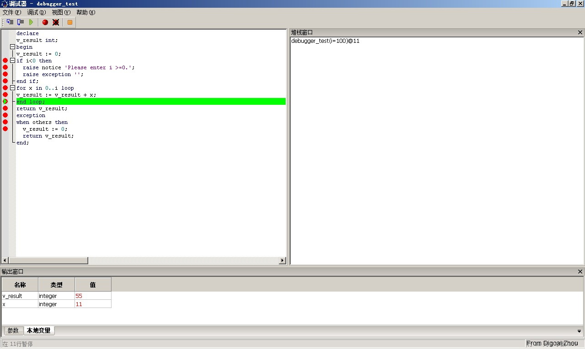

## PostgreSQL 9.1.3 plpgsql debugger module  
                                                                                            
### 作者                                                                                               
digoal                                                                                       
                                                                                        
### 日期                                                                                                                                                           
2012-03-20                                                                                     
                                                                                           
### 标签                                                                                        
PostgreSQL , plpgsql , pldebugger      
                                                                                                                                                              
----                                                                                                                                                        
                                                                                                                                                                 
## 背景                           
[更新]  
  
该项目更新为pldebugger  
  
http://git.postgresql.org/gitweb/?p=pldebugger.git;a=summary  
  
今天一位网友在群里面问PostgreSQL 9.0如何debug 函数. 我记得在8.3的时候有一个插件叫edb-debugger是可以使用的. 手头上没有9.0的数据库, 于是测试了一下在9.1上能不能用, 结果是编译不通过.  
  
最后找到了解决办法, 记录如下.  
  
在pgfoundry中有一个开源的edb-debugger插件可以用来调试PostgreSQL的PLPGSQL函数.  
  
http://pgfoundry.org/projects/edb-debugger/   
  
但是这个版本太老, 在PostgreSQL 9.1中无法编译通过, 报错如下.  
  
```  
 make   
Makefile:63: warning: overriding commands for target `install'  
../../src/makefiles/pgxs.mk:120: warning: ignoring old commands for target `install'  
Makefile:77: warning: overriding commands for target `installdirs'  
../../src/makefiles/pgxs.mk:150: warning: ignoring old commands for target `installdirs'  
gcc -O2 -Wall -Wmissing-prototypes -Wpointer-arith -Wdeclaration-after-statement -Wendif-labels -Wformat-security -fno-strict-aliasing -fwrapv -fpic  -I. -I. -I../../src/include -D_GNU_SOURCE -I/usr/include/libxml2   -c -o pldbgapi.o pldbgapi.c  
pldbgapi.c: In function ‘pldbg_attach_to_port’:  
pldbgapi.c:346: warning: implicit declaration of function ‘MAKE_OFFSET’  
pldbgapi.c: In function ‘pldbg_wait_for_target’:  
pldbgapi.c:474: warning: implicit declaration of function ‘SHM_OFFSET_VALID’  
pldbgapi.c:476: warning: implicit declaration of function ‘MAKE_PTR’  
pldbgapi.c:476: warning: cast to pointer from integer of different size  
gcc -O2 -Wall -Wmissing-prototypes -Wpointer-arith -Wdeclaration-after-statement -Wendif-labels -Wformat-security -fno-strict-aliasing -fwrapv -fpic  -L../../src/port  -Wl,-rpath,'/opt/pgsql/lib',--enable-new-dtags  -shared -o pldbgapi.so pldbgapi.o  
gcc -O2 -Wall -Wmissing-prototypes -Wpointer-arith -Wdeclaration-after-statement -Wendif-labels -Wformat-security -fno-strict-aliasing -fwrapv -fpic  -I. -I. -I../../src/include -D_GNU_SOURCE -I/usr/include/libxml2   -c -o targetinfo.o targetinfo.c  
targetinfo.c: In function ‘getTriggerFuncOid’:  
targetinfo.c:268: error: ‘SnapshotNow’ undeclared (first use in this function)  
targetinfo.c:268: error: (Each undeclared identifier is reported only once  
targetinfo.c:268: error: for each function it appears in.)  
targetinfo.c: In function ‘getProcOidBySig’:  
targetinfo.c:508: error: too few arguments to function ‘FuncnameGetCandidates’  
targetinfo.c: In function ‘getProcOidByName’:  
targetinfo.c:555: error: too few arguments to function ‘FuncnameGetCandidates’  
make: *** [targetinfo.o] Error 1  
rm pldbgapi.o  
```  
  
不知道为什么不更新了, 作者是这两位.  
  
```  
Korry Douglas (korry.douglas@enterprisedb.com)  
Dave Page (dave.page@enterprisedb.com)  
```  
  
在EDB发布的EDB-AS版本中是包含了debugger的.  
  
只是直接把它的so文件拷贝到开源版本的PostgreSQL中无法使用.  
  
例如我把EDB-AS 9.1.2.2版本的$libdir/plugins/plugin_debugger.so文件拷贝到开源的PostgreSQL $PGHOME/lib/plugins/目录下.  
  
配置postgresql.conf  
  
```  
shared_preload_libraries = '$libdir/plugins/plugin_debugger'  
```  
  
在启动数据库时报错如下 :   
  
```  
FATAL:  could not load library "/opt/pgsql/lib/plugins/plugin_debugger.so": /opt/pgsql/lib/plugins/plugin_debugger.so: undefined symbol: NonSPLFunctionContext  
```  
  
这个NonSPLFunctionContext在PostgresPlus/9.1AS/include/server/utils/elog.h 文件里面定义的.  
  
但是把它拷贝到开源的PostgreSQL的/opt/pgsql/include/server/utils/elog.h后依旧.  
  
虽然pgfoundry里面提供下载的只有0.9.3版本, 庆幸的是cvs里面有最新的.  
  
请见参考链接, 把这些文件下载过了后放到源码的contrib目录里面新建一个debugger目录.  
  
编译过程 :   
  
```  
su - root  
. /home/postgres/.bash_profile  
cd /opt/soft_bak/postgresql-9.1.3/contrib/debugger/  
make  
make install  
```  
  
修改数据库配置文件 :   
  
```  
vi $PGDATA/postgresql.conf  
shared_preload_libraries = '$libdir/plugins/plugin_debugger'  
```  
  
重启数据库,  
  
在需要调试的数据库里面使用超级用户安装函数和类.  
  
```  
psql -h 127.0.0.1 digoal postgres -f /opt/pgsql/share/contrib/pldbgapi.sql   
CREATE TYPE  
CREATE TYPE  
CREATE TYPE  
CREATE TYPE  
CREATE TYPE  
CREATE FUNCTION  
CREATE FUNCTION  
CREATE FUNCTION  
CREATE FUNCTION  
CREATE FUNCTION  
CREATE FUNCTION  
CREATE FUNCTION  
CREATE FUNCTION  
CREATE FUNCTION  
CREATE FUNCTION  
CREATE FUNCTION  
CREATE FUNCTION  
CREATE FUNCTION  
CREATE FUNCTION  
CREATE FUNCTION  
CREATE FUNCTION  
CREATE FUNCTION  
CREATE FUNCTION  
CREATE FUNCTION  
CREATE FUNCTION  
```  
  
创建一个测试函数 :   
  
```  
create or replace function debugger_test (i int) returns int as $$  
declare  
v_result int;  
begin  
v_result := 0;  
if i<0 then  
  raise notice 'Please enter i >=0.';  
  raise exception '';  
end if;  
for x in 0..i loop  
v_result := v_result + x;  
end loop;  
return v_result;  
exception  
when others then  
  v_result := 0;  
  return v_result;  
end;  
$$ language plpgsql;  
```  
  
使用pgAdmin登陆到这个数据库, 右键点击函数的时候就有调试选项了.  
  
  
  
一个调试页面截图 :   
  
  
   
## 参考  
http://pgfoundry.org/forum/forum.php?set=custom&forum_id=657&style=nested&max_rows=25&submit=Change+View  
  
http://www.pgadmin.org/docs/1.14/debugger.html  
  
http://cvs.pgfoundry.org/cgi-bin/cvsweb.cgi/edb-debugger/server/  
  
http://git.postgresql.org/git/pldebugger.git   
  
使用git安装:  
  
PostgreSQL plpgsql function debugging module : pldebugger  
  
http://blog.163.com/digoal@126/blog/static/16387704020125511841144/  
  
  
  
  
  
  
  
  
  
  
  
  
  
  
  
  
  
  
  
  
  
  
  
  
  
  
  
  
  
  
  
  
  
  
  
  
  
  
  
  
  
  
  
  
  
  
  
  
  
  
  
  
  
  
  
  
  
  
  
  
  
  
  
  
  
  
  
  
  
  
  
  
  
#### [PostgreSQL 许愿链接](https://github.com/digoal/blog/issues/76 "269ac3d1c492e938c0191101c7238216")
您的愿望将传达给PG kernel hacker、数据库厂商等, 帮助提高数据库产品质量和功能, 说不定下一个PG版本就有您提出的功能点. 针对非常好的提议，奖励限量版PG文化衫、纪念品、贴纸、PG热门书籍等，奖品丰富，快来许愿。[开不开森](https://github.com/digoal/blog/issues/76 "269ac3d1c492e938c0191101c7238216").  
  
  
#### [9.9元购买3个月阿里云RDS PostgreSQL实例](https://www.aliyun.com/database/postgresqlactivity "57258f76c37864c6e6d23383d05714ea")
  
  
#### [PostgreSQL 解决方案集合](https://yq.aliyun.com/topic/118 "40cff096e9ed7122c512b35d8561d9c8")
  
  
#### [德哥 / digoal's github - 公益是一辈子的事.](https://github.com/digoal/blog/blob/master/README.md "22709685feb7cab07d30f30387f0a9ae")
  
  

  
  
#### [PolarDB 学习图谱: 训练营、培训认证、在线互动实验、解决方案、生态合作、写心得拿奖品](https://www.aliyun.com/database/openpolardb/activity "8642f60e04ed0c814bf9cb9677976bd4")
  
  
#### [购买PolarDB云服务折扣活动进行中, 55元起](https://www.aliyun.com/activity/new/polardb-yunparter?userCode=bsb3t4al "e0495c413bedacabb75ff1e880be465a")
  
  
#### [About 德哥](https://github.com/digoal/blog/blob/master/me/readme.md "a37735981e7704886ffd590565582dd0")
  
