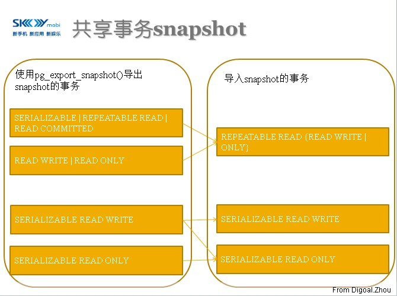

## PostgreSQL 共享事务快照功能 - PostgreSQL 9.2 can share snapshot between multi transactions  
                                                                                                            
### 作者                                                                                                                                                         
digoal                                                                                                       
                                                                                                              
### 日期                                                                                                         
2012-05-16                                                                                                        
                                                                                                          
### 标签                                                                                                       
PostgreSQL , 事务快照 , snapshot                       
                                                                                                            
----                                                                                                      
                                                                                                               
## 背景                    
从PostgreSQL 9.2看核心开发人员"玩花招".  
  
我感觉PostgreSQL在核心开发人员的手里就像足球在巴西球员的脚下一样, 玩得一溜一溜的.  
  
PostgreSQL 9.2 新增的一个功能，允许事务共享它当时的snapshot给其他的事务使用。  
  
PostgreSQL的核心开发人员实在可爱，不过也多亏了PG的MVCC机制，才能方便的实现这个功能。  
  
这项功能其实是基于PostgreSQL MVCC机制而生的，为什么需要一个这样的功能呢。  
  
我们来想象一个场景，  
  
```
1\. 11:00:00, 会话1启动了一个repeatable read事务.  
  
2\. 11:00:00到11:00:01时间段内, 其他会话对数据库进行了一些新增修改和删除数据的操作并提交了.  
  
3\. 11:00:02, 会话2启动了一个repeatable read事务.  
```
  
显然这种情况下，会话1的这个事务看不到在11:00:00 到 11:00:01 时间段内提交的数据.  
  
但是会话2可以看到在11:00:00 到 11:00:01 时间段内提交的数据.  
  
如果要让会话2的这个事务看到和会话1的事务一样的snapshot怎么办呢? 在PostgreSQL 9.2 以前没有办法办到.  
  
PostgreSQL 9.2 新增了一个函数, pg_export_snapshot(). 这个函数用在会话1启动事务后, 输出一个字符串.  
  
这个字符串可以被其他的多个事务用于"导入". 注意, 其他事务必须在事务发出第一条SQL前"导入"其他事务的状态. 并且只能"导入"一次.  
  
注意, 这些共享事务snapshot的事务直接，自己内部的改变其他事务是看不到的。  
  
注意执行SET TRANSACTION SNAPSHOT '$snapshot ID';的事务, 也就是import snapshot的事务必须是repeatable read或serializable的事务.   
  
还有其他的一些限制，看图 :   
  
  
   
我们来通过测试详细的讲解一些它是怎么实现的 ：  
  
测试一(export的事务是repeatable read的)、  
  
先创建一些测试数据,  
  
```  
digoal=# create table test (id int);  
CREATE TABLE  
digoal=# insert into test values (1),(2);  
INSERT 0 2  
```  
  
会话1 :   
  
```  
digoal=# begin TRANSACTION ISOLATION LEVEL repeatable read;  
BEGIN  
digoal=# SELECT pg_export_snapshot();  
 pg_export_snapshot   
--------------------  
 000006A3-1  
(1 row)  
digoal=# insert into test values (3);  
INSERT 0 1  
digoal=# SELECT pg_export_snapshot();  
 pg_export_snapshot   
--------------------  
 000006A3-2  
(1 row)  
digoal=# select * from txid_current();  
 txid_current   
--------------  
         1699  
(1 row)  
  
digoal=# select * from txid_current_snapshot();  
 txid_current_snapshot   
-----------------------  
 1699:1699:  
(1 row)  
```  
  
会话2（插入一条新数据并自动提交） :   
  
```  
digoal=# insert into test values (4);  
INSERT 0 1  
```  
  
会话3 (能查看到会话2插入的数据) :   
  
```  
digoal=# select * from test;  
 id   
----  
  1  
  2  
  4  
(3 rows)  
```  
  
会话4 (导入会话1的第一个snapshot, 因此看不到会话2提交的数据) :   
  
```  
digoal=# begin TRANSACTION ISOLATION LEVEL repeatable read;  
BEGIN  
digoal=# SET TRANSACTION SNAPSHOT '000006A3-1';  
SET  
digoal=# select * from test;  
 id   
----  
  1  
  2  
(2 rows)  
digoal=# select * from txid_current();  
 txid_current   
--------------  
         1701  
(1 row)  
  
-- snapshot输出和会话1一样.  
  
digoal=# select * from txid_current_snapshot();  
 txid_current_snapshot   
-----------------------  
 1699:1699:  
(1 row)  
```  
  
会话5 (导入会话1的第二个snapshot, 因此看不到会话2提交的数据, 同时验证了看不到会话1修改过的数据, 前面已经讲过了.) :   
  
```  
digoal=# begin TRANSACTION ISOLATION LEVEL REPEATABLE READ;  
BEGIN  
digoal=# SET TRANSACTION SNAPSHOT '000006A3-2';  
SET  
digoal=# select * from test;  
 id   
----  
  1  
  2  
(2 rows)  
-- 当前事务ID  
digoal=# select * from txid_current();  
 txid_current   
--------------  
         1702  
(1 row)  
-- snapshot输出和会话1一样.  
digoal=# select * from txid_current_snapshot();  
 txid_current_snapshot   
-----------------------  
 1699:1699:  
(1 row)  
```  
  
会话1 :   
  
```  
digoal=# commit;  
COMMIT  
```  
  
会话4 (会话1提交后, 这个snapshot还存在, 只要还有导入了这个snapshot的事务存在着) :   
  
```  
digoal=# select * from test;  
 id   
----  
  1  
  2  
(2 rows)  
```  
  
会话5 (会话1提交后, 这个snapshot还存在, 只要还有导入了这个snapshot的事务存在着) :   
  
```  
digoal=# select * from test;  
 id   
----  
  1  
  2  
(2 rows)  
```  
  
测试二(export的事务是read committed的, 与repeatable read不同的是, 这里在事务中多次执行pg_export_snapshot()将能明显的体现不同, repeatable read和serializable是看不到事务中其他事务提交的数据的, read committed则可以看到, 多次调用pg_export_snapshot()只需要在read committed 场景使用)、  
  
测试前清除数据 :   
  
```  
digoal=# truncate test;  
TRUNCATE TABLE  
digoal=# insert into test values (1),(2);  
INSERT 0 2  
```  
  
会话1 :   
  
```  
digoal=#  begin TRANSACTION ISOLATION LEVEL read committed;  
BEGIN  
digoal=# SELECT pg_export_snapshot();  
 pg_export_snapshot   
--------------------  
 000006B7-1  
(1 row)  
  
digoal=#  insert into test values (3);  
INSERT 0 1  
digoal=# SELECT pg_export_snapshot();  
 pg_export_snapshot   
--------------------  
 000006B7-2  
(1 row)  
  
digoal=# select * from test;  
 id   
----  
  1  
  2  
  3  
(3 rows)  
```  
  
会话2 :   
  
```  
digoal=# insert into test values (4);  
INSERT 0 1  
```  
  
会话1 :  
  
```  
digoal=# select * from test;  
 id   
----  
  1  
  2  
  3  
  4  
(4 rows)  
digoal=# SELECT pg_export_snapshot();  
 pg_export_snapshot   
--------------------  
 000006B7-3  
(1 row)  
```  
  
会话3 :   
  
```  
digoal=# begin TRANSACTION ISOLATION LEVEL repeatable read;  
BEGIN  
digoal=# SET TRANSACTION SNAPSHOT '000006B7-1';  
SET  
digoal=# select * from test;  
 id   
----  
  1  
  2  
(2 rows)  
```  
  
会话4 :   
  
```  
digoal=# begin TRANSACTION ISOLATION LEVEL REPEATABLE READ;  
BEGIN  
digoal=# SET TRANSACTION SNAPSHOT '000006B7-2';  
SET  
digoal=# select * from test;  
 id   
----  
  1  
  2  
(2 rows)  
```  
  
会话5 :   
  
```  
digoal=# begin TRANSACTION ISOLATION LEVEL repeatable read;  
BEGIN  
digoal=# SET TRANSACTION SNAPSHOT '000006B7-3';  
SET  
digoal=# SELECT * FROM TEST;  
 id   
----  
  1  
  2  
  4  
(3 rows)  
```  
  
会话2 :   
  
```  
digoal=# insert into test values (5);  
INSERT 0 1  
```  
  
会话1 :   
  
```  
digoal=# select * from test;  
 id   
----  
  1  
  2  
  3  
  4  
  5  
(5 rows)  
```  
  
会话3,4,5看到的结果与前面看到的结果一致 :   
  
会话3 :   
  
```  
digoal=# begin TRANSACTION ISOLATION LEVEL repeatable read;  
BEGIN  
digoal=# SET TRANSACTION SNAPSHOT '000006B7-1';  
SET  
digoal=# select * from test;  
 id   
----  
  1  
  2  
(2 rows)  
```  
  
会话4 :   
  
```  
digoal=# begin TRANSACTION ISOLATION LEVEL REPEATABLE READ;  
BEGIN  
digoal=# SET TRANSACTION SNAPSHOT '000006B7-2';  
SET  
digoal=# select * from test;  
 id   
----  
  1  
  2  
(2 rows)  
```  
  
会话5 :   
  
```  
digoal=# begin TRANSACTION ISOLATION LEVEL repeatable read;  
BEGIN  
digoal=# SET TRANSACTION SNAPSHOT '000006B7-3';  
SET  
digoal=# SELECT * FROM TEST;  
 id   
----  
  1  
  2  
  4  
(3 rows)  
```  
  
## 小结  
import时，其实只是把执行export事务的当时的txid_current_snapshot传递过来. 不会传递事务的属性如(read committed或repeatable read或serializable).   
  
因此, 我们从例子2看到共享事务snapshot的事务之间，除了存在自己修改的数据的差异之外，对于执行export的事务如果是read committed的，它看到的数据和执行import的事务看到的数据也是存在差异的。  
  
## 参考  
http://www.postgresql.org/docs/9.2/static/sql-set-transaction.html  
  
http://www.postgresql.org/docs/9.2/static/functions-admin.html#FUNCTIONS-SNAPSHOT-SYNCHRONIZATION  
  
<a rel="nofollow" href="http://info.flagcounter.com/h9V1"  ></a>  
  
  
  
  
  
  
## [digoal's 大量PostgreSQL文章入口](https://github.com/digoal/blog/blob/master/README.md "22709685feb7cab07d30f30387f0a9ae")
  
