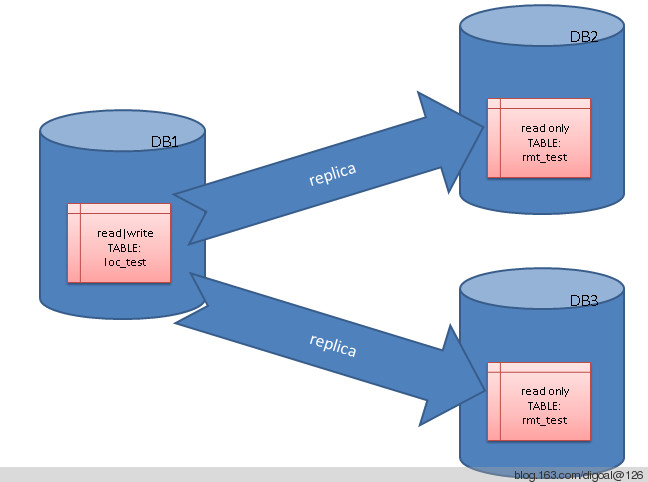

## 表级复制(base on trigger) -- one(rw) to many(ro|rw)   
                                                                                                                            
### 作者                                                                                                                           
digoal                                                                                                                            
                                                                                                                            
### 日期                                                                                                                          
2012-08-31                                    
                                                                                                                            
### 标签                                                                                                                          
PostgreSQL , 逻辑复制 , 表级复制 , trigger , 触发器                                                                                                    
                                                              
----                                                                                                                          
                                                                  
## 背景              
本文在9.2下面测试, 较老版本可能系统表的字段名不一样, 需要修改触发器函数相关部分, 如pg_stat_activity的pid, 老版本是procpid.  
  
数据同步是一个比较老的话题了, 在PostgreSQL中有比较多的同步手段, 例如流复制, slony, londiste, pgpool等.  
  
不过这些都需要诸多的配置, 流复制的话更是需要将所有的物理数据都复制过去. 同时也不能实现双向同步(multi-master).  
  
如果只想同步少量的数据(改动量不太大), 例如单表. 或者单表中的某些列, 甚至单表中某些符合条件的行同步到其他一个或多个节点.   
  
甚至是需要双向可写的复制(oracle 物化视图无法实现). 这些简单的使用以上工具是无法实现的.  
  
下面使用触发器和dblink来举个例子, 实现以上的功能, 同时是实时的同步(但是必须注意到使用触发器带来的开销, 所以不是所有场景都适用).  
  
(PS: 使用postgres_fdw + 触发器 可以达到同样的目的，支持同步模式)    
  
## 正文   
这里用到的同步表都需要有主键.  
  
例如要将一个表同步到一个(或多个)远程节点 :   
  
  
   
源表信息如下 :   
  
```  
schema : digoal  
table_name : loc_test  
```  
  
表结构 :   
  
```  
digoal=> \d loc_test  
                 Table "digoal.loc_test"  
   Column    |              Type              | Modifiers   
-------------+--------------------------------+-----------  
 id          | integer                        | not null  
 info        | text                           |   
 create_time | timestamp(0) without time zone |   
 modify_time | timestamp(0) without time zone |   
Indexes:  
    "loc_test_pkey" PRIMARY KEY, btree (id)  
```  
  
源表所在服务器上的用来记录同步错误的SQL的表如下 :   
  
用于后续修复数据.  
  
```  
create table sync_err_rec(id serial8 primary key, nsp_name name, table_name name, dst_server text, dst_query text, create_time timestamp without time zone);  
digoal=> \d sync_err_rec  
                                      Table "digoal.sync_err_rec"  
   Column    |            Type             |                         Modifiers                           
-------------+-----------------------------+-----------------------------------------------------------  
 id          | bigint                      | not null default nextval('sync_err_rec_id_seq'::regclass)  
 nsp_name    | name                        |   
 table_name  | name                        |   
 dst_server  | text                        |   
 dst_query   | text                        |   
 create_time | timestamp without time zone |   
Indexes:  
    "sync_err_rec_pkey" PRIMARY KEY, btree (id)  
```  
  
远程表信息如下 :   
  
```  
schema : digoal  
table_name : rmt_digoal  
```  
  
表结构 :   
  
```  
digoal=> \d rmt_test  
                 Table "digoal.rmt_test"  
   Column    |              Type              | Modifiers   
-------------+--------------------------------+-----------  
 id          | integer                        | not null  
 info        | text                           |   
 create_time | timestamp(0) without time zone |   
 modify_time | timestamp(0) without time zone |   
Indexes:  
    "rmt_test_pkey" PRIMARY KEY, btree (id)  
```  
  
步骤如下 :   
  
1\. 创建数据库连接 :   
  
回收pg_user_mappings的public权限, 否则普通用户能查看到它的内容, 包含密码, 比较危险.  
  
```  
digoal=# revoke all on pg_user_mappings from public;  
REVOKE  
```  
  
创建fdw.  
  
```  
CREATE FOREIGN DATA WRAPPER postgresql VALIDATOR postgresql_fdw_validator;  
```  
  
创建远程服务器. 指定远程IP, 端口, 库名, 连接参数.  
  
注意这里使用了客户端选项application_name=aaa_bbb_digoal, 后面将被用于远程数据库表的触发器用来判断是什么客户端连上来的.  
  
以便允许源表这里连上来做DML操作, 但是拒绝其他做DML操作, 这样就可以控制目标表的只读.  
  
```  
CREATE SERVER dst_digoal FOREIGN DATA WRAPPER postgresql OPTIONS (hostaddr '192.168.20.47', port '1921', dbname 'digoal', options '-c application_name=aaa_bbb_digoal');  
```  
  
赋予server权限给操作源表的用户, 例如这里使用digoal操作源表.  
  
```  
GRANT USAGE ON FOREIGN SERVER dst_digoal TO digoal;  
```  
  
创建user mapping, 用户密码是连接远程数据库的用户密码.  
  
```  
CREATE USER MAPPING FOR digoal SERVER dst_digoal OPTIONS (user 'digoal', password 'DIGOAL321');  
```  
  
2\. 用于复制的触发器函数如下.  
  
这个函数分两种情况, 大家可以根据自己的需要修改函数内容 :   
  
2\.1\. 如果远程执行失败,允许本地成功,本地写sync_err_rec  
  
2\.2\. 如果远程执行失败,保证本地也失败,本地不写sync_err_rec  
  
```  
CREATE OR REPLACE FUNCTION f_sync_loc_test()  
RETURNS trigger  
LANGUAGE plpgsql  
AS $BODY$  
DECLARE  
  v_conn_name text := 'digoal';  -- 连接名  
  v_dst_server text := 'dst_digoal';  -- foreign server  
  v_conn_status text;  -- 存储dblink_connect(v_conn_name, v_dst_server)的返回值  
  v_nsp_name name := TG_TABLE_SCHEMA;  -- 触发器变量, 触发这个触发器的表所在的schema  
  v_table_name name := TG_TABLE_NAME;  -- 触发器变量, 触发这个触发器的表名  
  v_dst_nsp_name name := 'digoal';  -- 目标schema, 当需要复制到其他schema下时, 这里改成其schema名即可  
  v_dst_table_name name := 'rmt_test';  -- 目标表名  
  v_query text;  -- 使用dblink_build_sql_insert, dblink_build_sql_update, dblink_build_sql_delete得到的SQL, 用于调用dblink_exec远程执行.  
  v_query_upd1 text;  -- update需要用到delete和insert  
  v_query_upd2 text;  -- update需要用到delete和insert  
  v_dst_query text;  -- v_query修改后的语句, 主要就是修改目标schema和目标表名  
  v_dst_query_upd1 text;  -- update需要用到delete和insert  
  v_dst_query_upd2 text;  -- update需要用到delete和insert  
  v_pk_vector int2vector;  -- dblink_build_sql_insert, dblink_build_sql_update, dblink_build_sql_delete要用到的被复制的表的PK列s的逻辑位置  
  v_pk_cnt int;  -- dblink_build_sql_insert, dblink_build_sql_update, dblink_build_sql_delete要用到的被复制的表的PK列个数  
  v_pk_att_vals_array text[];  -- pk值  
  v_exec_status text;  -- 存储dblink_exec(v_conn_name, v_dst_query, true|false)的返回值.  
  v_disconn_status text;  -- 存储dblink_disconnect(v_conn_name)的返回值.  
BEGIN  
  v_pk_vector := int2vector '1';  
  v_pk_cnt := 1;  
  -- v_pk_vector和v_pk_cnt也可以使用以下SQL得到.  
  -- select string_agg(position::text,' ')::int2vector,count(*) into v_pk_vector,v_pk_cnt   
  --  from dblink_get_pkey(v_nsp_name||'.'||v_table_name);  
  case TG_OP  
  when 'INSERT' then  
    -- 生成远程要执行的insert语句, id是这个表的主键. 如果是多列值的则需要得到按v_pk_vector顺序的text[]  
    v_pk_att_vals_array := ('{'||NEW.id||'}')::text[];  
    select * into v_query from dblink_build_sql_insert(v_nsp_name||'.'||v_table_name, v_pk_vector, v_pk_cnt, v_pk_att_vals_array, v_pk_att_vals_array);  
  when 'DELETE' then  
    -- 生成远程要执行的delete语句, id是这个表的主键. 如果是多列值的则需要得到按v_pk_vector顺序的text[]  
    v_pk_att_vals_array := ('{'||OLD.id||'}')::text[];  
    select * into v_query from dblink_build_sql_delete(v_nsp_name||'.'||v_table_name, v_pk_vector, v_pk_cnt, v_pk_att_vals_array);  
  when 'UPDATE' then  
    -- 生成远程要执行的update语句, id是这个表的主键. 如果是多列值的则需要得到按v_pk_vector顺序的text[]  
    -- 这里没有使用dblink_build_sql_update来生成update语句, 因为主键也可能被更新. 所以只能拆成两部分.  
    v_pk_att_vals_array := ('{'||OLD.id||'}')::text[];  
    select * into v_query_upd1 from dblink_build_sql_delete(v_nsp_name||'.'||v_table_name, v_pk_vector, v_pk_cnt, v_pk_att_vals_array);  
    v_pk_att_vals_array := ('{'||NEW.id||'}')::text[];  
    select * into v_query_upd2 from dblink_build_sql_insert(v_nsp_name||'.'||v_table_name, v_pk_vector, v_pk_cnt, v_pk_att_vals_array, v_pk_att_vals_array);  
  when 'TRUNCATE' then  
    -- 生成远程要执行的truncate语句. 注意这里是truncate table only. 如果是子表, 可以在子表上继续减这样的触发器.  
    v_query := 'truncate table only '||v_table_name;  
  end case;  
  -- 将目标schema和目标表名替换现有表名.  
  case TG_OP  
  when 'UPDATE' then  
    v_dst_query_upd1 := regexp_replace(v_query_upd1, v_table_name, v_dst_nsp_name||'.'||v_dst_table_name, '');  
    v_dst_query_upd2 := regexp_replace(v_query_upd2, v_table_name, v_dst_nsp_name||'.'||v_dst_table_name, '');  
    v_dst_query := v_dst_query_upd1||';'||v_dst_query_upd2;  
  else  
    v_dst_query := regexp_replace(v_query, v_table_name, v_dst_nsp_name||'.'||v_dst_table_name, '');  
  end case;  
  -- 如果想打印用于复制的SQL是否正确, 可以使用以下语句 :   
  -- raise notice 'v_dst_query:%', v_dst_query;  
  -- 判断连接是否存在, 不存在则创建.  
  if ( dblink_get_connections() @> ('{'||v_conn_name||'}')::text[] ) then   
  else  
    select * into v_conn_status from dblink_connect(v_conn_name, v_dst_server);  
  end if;  
  -- 如果远程执行失败,确保本地成功,本地写sync_err_rec  
  select * into v_exec_status from dblink_exec(v_conn_name, v_dst_query, false);  
  if (v_exec_status = 'ERROR') then  
    insert into sync_err_rec (nsp_name, table_name, dst_server, dst_query, create_time)   
      values (v_nsp_name, v_table_name, v_dst_server, v_dst_query, clock_timestamp());  
  end if;  
  -- 如果想要远程失败,本地失败,本地不写sync_err_rec. 使用以下SQL替换前面几条SQL.   
  -- 不了解的话可以去查询dblink_exec的详解.  
  -- select * into v_exec_status from dblink_exec(v_conn_name, v_dst_query, true);  
  -- -------------------------------------------------------------------------------  
  -- 不建议每次断开连接, 因为频繁的连接还是会带来很大开销的, 除非你在本地建立pgbouncer, 让pgbouncer来维持长连接.  
  -- 断开连接的语句如下.  
  -- select * into v_disconn_status from dblink_disconnect(v_conn_name);  
  return null;  
exception  
when others then  
  raise notice 'v_conn_status:%, v_exec_status:%, v_disconn_status:%.', v_conn_status, v_exec_status, v_disconn_status;  
  insert into sync_err_rec (nsp_name, table_name, dst_server, dst_query, create_time)   
    values (v_nsp_name, v_table_name, v_dst_server, v_dst_query, clock_timestamp());  
  -- 如果想要远程失败,本地失败,本地不写sync_err_rec. 同时还需要以下语句.  
  -- raise;  
  return null;  
END;  
$BODY$;  
```  
  
3\. 创建DML以及truncate的复制触发器.  
  
CREATE TRIGGER loc_test_sync_dml AFTER DELETE or UPDATE or INSERT ON loc_test FOR EACH ROW EXECUTE PROCEDURE f_sync_loc_test();  
  
CREATE TRIGGER loc_test_sync_truncate AFTER TRUNCATE ON loc_test FOR EACH STATEMENT EXECUTE PROCEDURE f_sync_loc_test();  
  
4\. -- 可选, 如果你不想远程表被复制程序以外的会话对这个表进行dml和truncate操作, 使用以下触发器来控制.  
  
远程表避免增删改和truncate, 无法避免drop.  
  
```  
CREATE OR REPLACE FUNCTION f_rmt_test()  
RETURNS trigger  
LANGUAGE plpgsql  
AS $BODY$  
DECLARE  
v_application_name text;  
v_pg_backend_pid int;  
BEGIN  
  -- 获取会话的postgres pid  
  select pg_backend_pid() into v_pg_backend_pid;  
  -- 根据这个PID获取application_name, 这个就可以用来区分是不是复制程序连上来的会话.9.1(含9.1)以前的版本pg_stat_activity.procpid.  
  select application_name into v_application_name from pg_stat_activity where pid=v_pg_backend_pid;  
  -- 如果不是复制程序连上来的会话, 返回一个错误就行.  
  if (v_application_name <> 'aaa_bbb_digoal' ) then  
    raise exception 'you cann''t modify this table.';  
  end if;  
  return null;  
END;  
$BODY$;  
```  
  
拒绝除复制程序以外的会话进行DML以及TRUNCATE的触发器 :   
  
```  
create trigger trg_rmt_test_1 BEFORE INSERT OR DELETE OR UPDATE OR TRUNCATE ON rmt_test FOR EACH STATEMENT EXECUTE PROCEDURE f_rmt_test();  
```  
  
5\. 好了, 现在来测试一下从loc_test复制到rmt_test的情况.  
  
本例使用到的触发器函数, 如果远程执行失败,允许本地成功,本地写sync_err_rec  
  
源站 :   
  
```  
digoal=> insert into loc_test values (1, 'digoal', now(), now());  
INSERT 0 1  
  
-- 插入测试  
  
digoal=> select * from loc_test ;  
 id |  info  |     create_time     |     modify_time       
----+--------+---------------------+---------------------  
  1 | digoal | 2012-08-31 14:33:17 | 2012-08-31 14:33:17  
(1 row)  
  
-- 没有错误记录  
  
digoal=> select * from sync_err_rec ;  
 nsp_name | table_name | dst_server | dst_query | create_time   
----------+------------+------------+-----------+-------------  
(0 rows)  
```  
  
目标站点 :   
  
```  
digoal=> select * from rmt_test ;  
 id |  info  |     create_time     |     modify_time       
----+--------+---------------------+---------------------  
  1 | digoal | 2012-08-31 14:33:17 | 2012-08-31 14:33:17  
(1 row)  
```  
  
源站更新测试 :   
  
```  
digoal=> update loc_test set info='DIGOAL';  
NOTICE:  v_dst_query:DELETE FROM digoal.rmt_test WHERE id = '1';INSERT INTO digoal.rmt_test(id,info,create_time,modify_time) VALUES('1','DIGOAL','2012-08-31 14:59:41','2012-08-31 14:59:41')  
UPDATE 1  
digoal=> select * from loc_test ;  
 id |  info  |     create_time     |     modify_time       
----+--------+---------------------+---------------------  
  1 | DIGOAL | 2012-08-31 14:59:41 | 2012-08-31 14:59:41  
(1 row)  
```  
  
目标站点 :   
  
```  
digoal=> select * from rmt_test ;  
 id |  info  |     create_time     |     modify_time       
----+--------+---------------------+---------------------  
  1 | DIGOAL | 2012-08-31 14:59:41 | 2012-08-31 14:59:41  
(1 row)  
```  
  
源站删除测试 :   
  
```  
digoal=> delete from loc_test ;  
NOTICE:  v_dst_query:DELETE FROM digoal.rmt_test WHERE id = '1'  
DELETE 1  
digoal=> select * from loc_test ;  
 id | info | create_time | modify_time   
----+------+-------------+-------------  
(0 rows)  
```  
  
目标站点 :   
  
```  
digoal=> select * from rmt_test ;  
 id | info | create_time | modify_time   
----+------+-------------+-------------  
(0 rows)  
```  
  
源站批量插入测试 :   
  
```  
digoal=> insert into loc_test select generate_series(1,100),'DIGOAL',now(),now();  
digoal=> insert into loc_test select id+1000,'TEST',now(),now() from loc_test ;  
  
digoal=> select sum(hashtext(t.*::text)),count(*) from loc_test t;  
    sum     | count   
------------+-------  
 8757913752 |   200  
(1 row)  
```  
  
目标站点 :   
  
```  
digoal=> select sum(hashtext(t.*::text)),count(*) from rmt_test t;  
    sum     | count   
------------+-------  
 8757913752 |   200  
(1 row)  
```  
  
源站truncate测试 :   
  
```  
digoal=> truncate table loc_test ;  
NOTICE:  v_dst_query:truncate table only digoal.rmt_test  
TRUNCATE TABLE  
digoal=> select count(*) from loc_test ;  
 count   
-------  
     0  
(1 row)  
```  
  
目标站点 :   
  
```  
digoal=> select count(*) from rmt_test ;  
 count   
-------  
     0  
(1 row)  
```  
  
如果网络发生异常, 或者用户更改密码了, 无法复制到远程数据库,  将会记录到sync_err_rec表.   
  
以下模拟远程用户修改密码, 无法复制的情况.  
  
目标库修改连接的用户密码 :  
  
```  
digoal=# alter role digoal encrypted password 'test';  
ALTER ROLE  
```  
  
源站测试插入失败测试 :   
  
```  
digoal=> insert into loc_test values (1,'DIGOAL',now(),now());  
NOTICE:  v_dst_query:INSERT INTO digoal.rmt_test(id,info,create_time,modify_time) VALUES('1','DIGOAL','2012-08-31 15:40:29','2012-08-31 15:40:29')  
NOTICE:  v_conn_status:<NULL>, v_exec_status:<NULL>, v_disconn_status:<NULL>.  
INSERT 0 1  
```  
  
查看源站loc_test表, 记录已经插入 :   
  
```  
digoal=> select * from loc_test ;  
 id |  info  |     create_time     |     modify_time       
----+--------+---------------------+---------------------  
  1 | DIGOAL | 2012-08-31 15:08:07 | 2012-08-31 15:08:07  
(1 row)  
```  
  
查看错误记录表, 记录已经插入 :   
  
```  
digoal=> select * from sync_err_rec ;  
 id | nsp_name | table_name | dst_server |                                                           dst_query                        
                                     |        create_time           
----+----------+------------+------------+------------------------------------------------------------------------------------------  
-------------------------------------+----------------------------  
  7 | digoal   | loc_test   | dst_digoal | INSERT INTO digoal.rmt_test(id,info,create_time,modify_time) VALUES('1','DIGOAL','2012-08  
-31 15:40:29','2012-08-31 15:40:29') | 2012-08-31 15:40:29.301519  
(1 row)  
```  
  
查看远程表 :   
  
```  
digoal=> select * from rmt_test ;  
 id | info | create_time | modify_time   
----+------+-------------+-------------  
(0 rows)  
```  
  
源站更新失败测试 :   
  
```  
digoal=> update loc_test set id=2;  
NOTICE:  v_dst_query:DELETE FROM digoal.rmt_test WHERE id = '1';INSERT INTO digoal.rmt_test(id,info,create_time,modify_time) VALUES('2','DIGOAL','2012-08-31 15:40:29','2012-08-31 15:40:29')  
NOTICE:  v_conn_status:<NULL>, v_exec_status:<NULL>, v_disconn_status:<NULL>.  
UPDATE 1  
digoal=> select * from loc_test ;  
 id |  info  |     create_time     |     modify_time       
----+--------+---------------------+---------------------  
  2 | DIGOAL | 2012-08-31 15:40:29 | 2012-08-31 15:40:29  
(1 row)  
digoal=> select * from sync_err_rec ;  
 id | nsp_name | table_name | dst_server |                                                                                dst_query   
                                                                                |        create_time           
----+----------+------------+------------+------------------------------------------------------------------------------------------  
--------------------------------------------------------------------------------+----------------------------  
  7 | digoal   | loc_test   | dst_digoal | INSERT INTO digoal.rmt_test(id,info,create_time,modify_time) VALUES('1','DIGOAL','2012-08  
-31 15:40:29','2012-08-31 15:40:29')                                            | 2012-08-31 15:40:29.301519  
  8 | digoal   | loc_test   | dst_digoal | DELETE FROM digoal.rmt_test WHERE id = '1';INSERT INTO digoal.rmt_test(id,info,create_tim  
e,modify_time) VALUES('2','DIGOAL','2012-08-31 15:40:29','2012-08-31 15:40:29') | 2012-08-31 15:41:14.607253  
(2 rows)  
```  
  
目标站点表目前仍无记录 :   
  
```  
digoal=> select * from rmt_test ;  
 id | info | create_time | modify_time   
----+------+-------------+-------------  
(0 rows)  
```  
  
6\. 接下来要写个函数来处理sync_err_rec里面的错误记录, 必须按照create_time顺序处理.  
  
```  
create or replace function deal_sync_err_rec (i_dst_server text, i_dst_query text, i_id int8) returns boolean as $$  
declare  
  v_conn_name text := 'digoal';  -- 连接名  
  v_conn_status text;  -- 存储dblink_connect(v_conn_name, v_dst_server)的返回值  
  v_exec_status text;  -- 存储dblink_exec(v_conn_name, v_dst_query, true|false)的返回值.  
begin  
  -- 删除sync_err_rec中对应的记录.  
  delete from sync_err_rec where id=i_id;  
  if ( dblink_get_connections() @> ('{'||v_conn_name||'}')::text[] ) then   
  else  
    select * into v_conn_status from dblink_connect(v_conn_name, i_dst_server);  
  end if;  
  -- 这里使用的是true, 所以远程异常, 本地也异常. 确保到这一步还可以回退, 只要这一步执行成功, 那本地删除的sync_err_rec和远程都执行成功.  
  select * into v_exec_status from dblink_exec(v_conn_name, i_dst_query, true);  
  -- raise notice 'v_conn_status:%, v_exec_status:%.', v_conn_status, v_exec_status;  
  return true;  
END;  
$$ language plpgsql;  
```  
  
处理 :   
  
先把密码修改回来,  
  
```  
digoal=# alter role digoal encrypted password 'DIGOAL321';  
ALTER ROLE  
```  
  
然后使用以下SQL进行处理 :   
  
注意一次只处理一条, 因为远端和本地未使用跨库事务. 只能一条一条来. 直到sync_err_rec 表没记录为止.  
  
处理顺序按照create_time 排序, 所以create_time 使用了timestamp without time zone类型以及clock_timestamp()进行插入, 精确到秒后面6位. 基本能满足唯一且顺序需求.  
  
下一篇BLOG将针对deal_sync_err_rec函数进行优化, 改成批量处理.  
  
```  
digoal=> select deal_sync_err_rec(dst_server,dst_query,id) from   
digoal-> (select dst_server,dst_query,id from sync_err_rec order by create_time limit 1) t;  
 deal_sync_err_rec   
-------------------  
 t  
(1 row)  
digoal=> select deal_sync_err_rec(dst_server,dst_query,id) from   
(select dst_server,dst_query,id from sync_err_rec order by create_time limit 1) t;  
 deal_sync_err_rec   
-------------------  
 t  
(1 row)  
digoal=> select deal_sync_err_rec(dst_server,dst_query,id) from   
(select dst_server,dst_query,id from sync_err_rec order by create_time limit 1) t;  
 deal_sync_err_rec   
-------------------  
(0 rows)  
```  
  
查看修复后的目标站点数据 :   
  
```  
digoal=> select * from rmt_test ;  
 id |  info  |     create_time     |     modify_time       
----+--------+---------------------+---------------------  
  2 | DIGOAL | 2012-08-31 15:40:29 | 2012-08-31 15:40:29  
(1 row)  
```  
  
与源站数据一致.  
  
```  
digoal=> select * from loc_test ;  
 id |  info  |     create_time     |     modify_time       
----+--------+---------------------+---------------------  
  2 | DIGOAL | 2012-08-31 15:40:29 | 2012-08-31 15:40:29  
(1 row)  
```  
  
# 小结  
1\. 本文所举的例子都是一对一的复制, 如果要实现一对多个目标站点, 只要增加触发器即可. 本文不再举例.  
  
如 :   
  
新增触发器函数 :  
  
```  
CREATE OR REPLACE FUNCTION f_sync_loc_test1()  
略去内容....  
end;  
$BODY$;  
```  
  
新增触发器 :   
  
```  
CREATE TRIGGER loc_test_sync_dml1 AFTER DELETE or UPDATE or INSERT ON loc_test FOR EACH ROW EXECUTE PROCEDURE f_sync_loc_test1();  
CREATE TRIGGER loc_test_sync_truncate1 AFTER TRUNCATE ON loc_test FOR EACH STATEMENT EXECUTE PROCEDURE f_sync_loc_test1();  
```  
  
2\. CREATE SERVER里面用到的option来自如下 :   
  
src/backend/tcop/postgres.c  
  
```  
        /*  
         * Parse command-line options.  CAUTION: keep this in sync with  
         * postmaster/postmaster.c (the option sets should not conflict) and with  
         * the common help() function in main/main.c.  
         */  
  
  
postgres --help  
-c NAME=VALUE      set run-time parameter  
```  
  
3\. 初始化操作(原始数据同步)需要避免有其他会话修改源表. 可以考虑使用 lock table in exclusive mode ;  
  
4\. 如果要针对列或者行级别的过滤, 只需要调整触发器即可.  
  
5\. 触发器函数参数传递不是通过普通的函数参数传递, 而是通过以下数据结构.  
  
src/include/commands/trigger.h   
  
```  
typedef struct TriggerData  
{  
        NodeTag         type;  
        TriggerEvent tg_event;  
        Relation        tg_relation;  
        HeapTuple       tg_trigtuple;  
        HeapTuple       tg_newtuple;  
        Trigger    *tg_trigger;  
        Buffer          tg_trigtuplebuf;  
        Buffer          tg_newtuplebuf;  
} TriggerData;  
```  
  
先写到这里, 下次再讲multi-master复制. 感兴趣的朋友也可以自己写一个玩玩.  
  
也要利用application_name.  
  
下一篇讲(deal_sync_err_rec的优化以及multi master replication) :   
  
http://blog.163.com/digoal@126/blog/static/1638770402012731944439/  
  
6\. 最近由于项目组需求, 开发了一个可以用作多表使用的通用触发器函数如下 :   
  
http://blog.163.com/digoal@126/blog/static/163877040201321125220134/  
  
值请使用quote_literal来解析, 本文的例子中OLD,NEW暂未修改, 请使用时自行修改或参考上文.  
  
## 注意  
1\. 本文前面所写触发器存在严重漏洞, 当数据复制遇到错误时, 将记录到错误表, 后续正常的数据可远程执行, 从而导致错误数据和正常数据在本地执行顺序和远端执行顺序不一致.  
  
解决办法请参见下一篇BLOG末尾部分. (一旦遇到错误, 则后续的操作不再直接提交到远端, 而是统统记录到错误表)  
  
http://blog.163.com/digoal@126/blog/static/1638770402012731944439/  
  
2\. pg_user_mappings回收public权限后, 使用普通用户执行pg_dump可能会报错:  
  
需要使用超级用户执行pg_dump .  
  
```  
pg_dump -F p -f ./1.sql -t loc_test -h 127.0.0.1 -U local local  
pg_dump: SQL command failed  
pg_dump: Error message from server: ERROR:  permission denied for relation pg_user_mappings  
pg_dump: The command was: SELECT usename, array_to_string(ARRAY(SELECT option_name || ' ' || quote_literal(option_value) FROM pg_options_to_table(umoptions)), ', ') AS umoptions  
FROM pg_user_mappings WHERE srvid = 164409694  
```  
  
                                                              
                                                                      
                                     
  
<a rel="nofollow" href="http://info.flagcounter.com/h9V1"  ></a>  
  
  
  
  
  
  
## [digoal's 大量PostgreSQL文章入口](https://github.com/digoal/blog/blob/master/README.md "22709685feb7cab07d30f30387f0a9ae")
  
