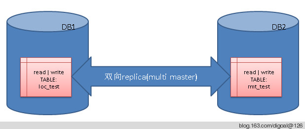

## 表级复制(base on trigger) -- multi master replication & performance tuning     
                                                                                                                              
### 作者                                                                                                                             
digoal                                                                                                                              
                                                                                                                              
### 日期                                                                                                                            
2012-08-31                                      
                                                                                                                              
### 标签                                                                                                                            
PostgreSQL , 逻辑复制 , 表级复制 , trigger , 触发器                                                                                                      
                                                                
----                                                                                                                            
                                                                    
## 背景                
本文在9.2下面测试, 较老版本可能系统表的字段名不一样, 需要修改触发器函数相关部分, 如pg_stat_activity的pid, 老版本是procpid.    
    
数据同步是一个比较老的话题了, 在PostgreSQL中有比较多的同步手段, 例如流复制, slony, londiste, pgpool等.    
    
不过这些都需要诸多的配置, 流复制的话更是需要将所有的物理数据都复制过去. 同时也不能实现双向同步(multi-master).    
    
如果只想同步少量的数据(改动量不太大), 例如单表. 或者单表中的某些列, 甚至单表中某些符合条件的行同步到其他一个或多个节点.     
    
甚至是需要双向可写的复制(oracle 物化视图无法实现). 这些简单的使用以上工具是无法实现的.    
    
下面使用触发器和dblink来举个例子, 实现以上的功能, 同时是实时的同步(但是必须注意到使用触发器带来的开销, 所以不是所有场景都适用).    
    
(PS: 使用postgres_fdw + 触发器 可以达到同样的目的，支持同步模式)      
    
## 正文     
前一篇介绍了使用触发器实现远程同步数据.  
  
http://blog.163.com/digoal@126/blog/static/1638770402012731203716/   
  
这篇将上一篇的处理异常记录的函数进行优化. 本例的连接名将不再特别指定, 直接与dst_server同名.  
  
函数改成如下 :   
  
```  
create or replace function deal_sync_err_rec (i_limit int) returns boolean as $$  
declare  
  v_conn_name text;  -- 连接名  
  v_conn_status text;  -- 存储dblink_connect(v_conn_name, v_dst_server)的返回值  
  v_exec_status text;  -- 存储dblink_exec(v_conn_name, v_dst_query, true|false)的返回值.  
  v_dst_server text;  -- foreign server, 一次取一个. 根据这个dst_server再抽取错误的同步记录, 进行处理.  
  v_dst_query text;  -- sync_err_rec中记录的SQL语句  
  v_id int8[];  -- sync_err_rec的主键, 用于记录一批记录, BATCH删除.  
begin  
  -- 取出最早的记录的dst_server, 接下来将处理这个dst_server发生的错误.  
  select dst_server into v_dst_server from sync_err_rec order by create_time limit 1;  
  -- 空表示没有记录直接返回  
  if (v_dst_server is NULL) then  
    return true;  
  end if;  
  -- 将v_dst_server的值赋予给连接名  
  v_conn_name := v_dst_server;  
  -- 取出一批记录  
  select array_agg(id), string_agg(dst_query, ';') into v_id, v_dst_query from   
    (select id,dst_query from sync_err_rec where dst_server=v_dst_server order by create_time limit i_limit) t;  
  -- 删除sync_err_rec中对应的记录.  
  delete from sync_err_rec where id in (select unnest(v_id));  
  if ( dblink_get_connections() @> ('{'||v_conn_name||'}')::text[] ) then   
  else  
    select * into v_conn_status from dblink_connect(v_conn_name, v_dst_server);  
  end if;  
  -- 这里使用的是true, 所以远程异常, 本地也异常. 确保到这一步还可以回退, 只要这一步执行成功, 那本地删除的sync_err_rec和远程都执行成功.  
  select * into v_exec_status from dblink_exec(v_conn_name, v_dst_query, true);  
  -- raise notice 'v_conn_status:%, v_exec_status:%.', v_conn_status, v_exec_status;  
  return true;  
END;  
$$ language plpgsql;  
```  
  
这一篇BLOG重点将介绍multi master replication的例子.  
  
  
   
如下 :   
  
创建两个用户 :   
  
```  
postgres=# create role local login encrypted password 'LOCAL321';  
CREATE ROLE  
postgres=# create role remote login encrypted password 'REMOTE321';  
CREATE ROLE  
```  
  
创建两个数据库 :   
  
```  
postgres=# create database local owner local;  
CREATE DATABASE  
postgres=# create database remote owner remote;  
CREATE DATABASE  
```  
  
创建dblink模块 :   
  
```  
postgres=# \c local postgres  
You are now connected to database "local" as user "postgres".  
local=# create extension dblink;  
CREATE EXTENSION  
local=# \c remote postgres  
You are now connected to database "remote" as user "postgres".  
remote=# create extension dblink;  
CREATE EXTENSION  
```  
  
创建schema :   
  
```  
local=> create schema local;  
CREATE SCHEMA  
local=> \c remote remote  
You are now connected to database "remote" as user "remote".  
remote=> create schema remote;  
CREATE SCHEMA  
```  
  
创建测试表 :   
  
本例将使用联合索引 :   
  
```  
remote=> \c local local  
You are now connected to database "local" as user "local".  
local=> create table loc_test (pk1 int, pk2 text, info text, crt_time timestamp(0), mod_time timestamp(0), primary key(pk1,pk2));  
NOTICE:  CREATE TABLE / PRIMARY KEY will create implicit index "loc_test_pkey" for table "loc_test"  
CREATE TABLE  
local=> select string_agg(position::text,' ')::int2vector,count(*) from dblink_get_pkey('local.loc_test');  
 string_agg | count   
------------+-------  
 1 2        |     2  
(1 row)  
local=> create table sync_err_rec(id serial8 primary key, nsp_name name, table_name name, dst_server text, dst_query text, create_time timestamp without time zone);  
NOTICE:  CREATE TABLE will create implicit sequence "sync_err_rec_id_seq" for serial column "sync_err_rec.id"  
NOTICE:  CREATE TABLE / PRIMARY KEY will create implicit index "sync_err_rec_pkey" for table "sync_err_rec"  
CREATE TABLE  
```  
  
创建测试表 :   
  
```  
postgres=# \c remote remote  
You are now connected to database "remote" as user "remote".  
remote=> create table rmt_test (pk1 int, pk2 text, info text, crt_time timestamp(0), mod_time timestamp(0), primary key(pk1,pk2));  
NOTICE:  CREATE TABLE / PRIMARY KEY will create implicit index "rmt_test_pkey" for table "rmt_test"  
CREATE TABLE  
remote=> select string_agg(position::text,' ')::int2vector,count(*) from dblink_get_pkey('remote.rmt_test');  
 string_agg | count   
------------+-------  
 1 2        |     2  
(1 row)  
remote=> create table sync_err_rec(id serial8 primary key, nsp_name name, table_name name, dst_server text, dst_query text, create_time timestamp without time zone);  
NOTICE:  CREATE TABLE will create implicit sequence "sync_err_rec_id_seq" for serial column "sync_err_rec.id"  
NOTICE:  CREATE TABLE / PRIMARY KEY will create implicit index "sync_err_rec_pkey" for table "sync_err_rec"  
CREATE TABLE  
```  
  
回收pg_user_mappings的public权限 :   
  
```  
local=> \c local postgres  
You are now connected to database "local" as user "postgres".  
local=# revoke all on pg_user_mappings from public;  
REVOKE  
```  
  
回收pg_user_mappings的public权限 :   
  
```  
local=# \c remote postgres  
You are now connected to database "remote" as user "postgres".  
remote=# revoke all on pg_user_mappings from public;  
REVOKE  
```  
  
创建server :   
  
```  
postgres=# \c local postgres  
You are now connected to database "local" as user "postgres".  
local=# CREATE FOREIGN DATA WRAPPER postgresql VALIDATOR postgresql_fdw_validator;  
CREATE FOREIGN DATA WRAPPER  
local=# CREATE SERVER dst FOREIGN DATA WRAPPER postgresql OPTIONS (hostaddr '172.16.3.150', port '9999', dbname 'remote', options '-c application_name=aaa_bbb_digoal');  
CREATE SERVER  
local=# GRANT USAGE ON FOREIGN SERVER dst TO local;  
GRANT  
local=# CREATE USER MAPPING FOR local SERVER dst OPTIONS (user 'remote', password 'REMOTE321');  
CREATE USER MAPPING  
```  
  
创建server :   
  
```  
local=# \c remote postgres  
You are now connected to database "remote" as user "postgres".  
remote=# CREATE FOREIGN DATA WRAPPER postgresql VALIDATOR postgresql_fdw_validator;  
CREATE FOREIGN DATA WRAPPER  
remote=# CREATE SERVER dst FOREIGN DATA WRAPPER postgresql OPTIONS (hostaddr '172.16.3.150', port '9999', dbname 'local', options '-c application_name=aaa_bbb_digoal');  
CREATE SERVER  
remote=# GRANT USAGE ON FOREIGN SERVER dst TO remote;  
GRANT  
remote=# CREATE USER MAPPING FOR remote SERVER dst OPTIONS (user 'local', password 'LOCAL321');  
CREATE USER MAPPING  
```  
  
在local数据库创建触发器函数以及触发器 :   
  
```  
remote=> \c local local  
You are now connected to database "local" as user "local".  
  
CREATE OR REPLACE FUNCTION f_sync_test()  
RETURNS trigger  
LANGUAGE plpgsql  
AS $BODY$  
DECLARE  
  v_dst_server text := 'dst';  -- foreign server  
  v_conn_name text := v_dst_server;  -- 连接名, 本例配置与dst_server一致.  
  v_conn_status text;  -- 存储dblink_connect(v_conn_name, v_dst_server)的返回值  
  v_nsp_name name := TG_TABLE_SCHEMA;  -- 触发器变量, 触发这个触发器的表所在的schema  
  v_table_name name := TG_TABLE_NAME;  -- 触发器变量, 触发这个触发器的表名  
  v_dst_nsp_name name := 'remote';  -- 目标schema, 当需要复制到其他schema下时, 这里改成其schema名即可  
  v_dst_table_name name := 'rmt_test';  -- 目标表名  
  v_query text;  -- 使用dblink_build_sql_insert, dblink_build_sql_update, dblink_build_sql_delete得到的SQL, 用于调用dblink_exec远程执行.  
  v_query_upd1 text;  -- update需要用到delete和insert  
  v_query_upd2 text;  -- update需要用到delete和insert  
  v_dst_query text;  -- v_query修改后的语句, 主要就是修改目标schema和目标表名  
  v_dst_query_upd1 text;  -- update需要用到delete和insert  
  v_dst_query_upd2 text;  -- update需要用到delete和insert  
  v_pk_vector int2vector;  -- dblink_build_sql_insert, dblink_build_sql_update, dblink_build_sql_delete要用到的被复制的表的PK列s的逻辑位置  
  v_pk_cnt int;  -- dblink_build_sql_insert, dblink_build_sql_update, dblink_build_sql_delete要用到的被复制的表的PK列个数  
  v_pk_att_vals_array text[];  -- pk值  
  v_exec_status text;  -- 存储dblink_exec(v_conn_name, v_dst_query, true|false)的返回值.  
  -- multi master replication 需要以下参数分辨更新来源, 否则会出现环形触发.  
  v_application_name text;  
  v_pg_backend_pid int;  
BEGIN  
  -- 获取会话的postgres pid  
  select pg_backend_pid() into v_pg_backend_pid;  
  -- 根据这个PID获取application_name, 这个就可以用来区分是不是复制程序连上来的会话. 9.1(含9.1)以前的版本pg_stat_activity.procpid.  
  select application_name into v_application_name from pg_stat_activity where pid=v_pg_backend_pid;  
  -- 如果是复制程序连上来的会话, 直接返回null, 否则会出现环形触发.  
  if (v_application_name = 'aaa_bbb_digoal' ) then  
    return null;  
  end if;  
  v_pk_vector := int2vector '1 2';  
  v_pk_cnt := 2;  
  -- v_pk_vector和v_pk_cnt也可以使用以下SQL得到.  
  -- select string_agg(position::text,' ')::int2vector,count(*) into v_pk_vector,v_pk_cnt   
  --  from dblink_get_pkey(v_nsp_name||'.'||v_table_name);  
  case TG_OP  
  when 'INSERT' then  
    -- 生成远程要执行的insert语句, id是这个表的主键. 如果是多列值的则需要得到按v_pk_vector顺序的text[]  
    v_pk_att_vals_array := ('{'||NEW.pk1||','||NEW.pk2||'}')::text[];  
    select * into v_query from dblink_build_sql_insert(v_nsp_name||'.'||v_table_name, v_pk_vector, v_pk_cnt, v_pk_att_vals_array, v_pk_att_vals_array);  
  when 'DELETE' then  
    -- 生成远程要执行的delete语句, id是这个表的主键. 如果是多列值的则需要得到按v_pk_vector顺序的text[]  
    v_pk_att_vals_array := ('{'||OLD.pk1||','||OLD.pk2||'}')::text[];  
    select * into v_query from dblink_build_sql_delete(v_nsp_name||'.'||v_table_name, v_pk_vector, v_pk_cnt, v_pk_att_vals_array);  
  when 'UPDATE' then  
    -- 生成远程要执行的update语句, id是这个表的主键. 如果是多列值的则需要得到按v_pk_vector顺序的text[]  
    -- 这里没有使用dblink_build_sql_update来生成update语句, 因为主键也可能被更新. 所以只能拆成两部分.  
    v_pk_att_vals_array := ('{'||OLD.pk1||','||OLD.pk2||'}')::text[];  
    select * into v_query_upd1 from dblink_build_sql_delete(v_nsp_name||'.'||v_table_name, v_pk_vector, v_pk_cnt, v_pk_att_vals_array);  
    v_pk_att_vals_array := ('{'||NEW.pk1||','||NEW.pk2||'}')::text[];  
    select * into v_query_upd2 from dblink_build_sql_insert(v_nsp_name||'.'||v_table_name, v_pk_vector, v_pk_cnt, v_pk_att_vals_array, v_pk_att_vals_array);  
  when 'TRUNCATE' then  
    -- 生成远程要执行的truncate语句. 注意这里是truncate table only. 如果是子表, 可以在子表上继续减这样的触发器.  
    v_query := 'truncate table only '||v_table_name;  
  end case;  
  -- 将目标schema和目标表名替换现有表名.  
  case TG_OP  
  when 'UPDATE' then  
    v_dst_query_upd1 := regexp_replace(v_query_upd1, v_table_name, v_dst_nsp_name||'.'||v_dst_table_name, '');  
    v_dst_query_upd2 := regexp_replace(v_query_upd2, v_table_name, v_dst_nsp_name||'.'||v_dst_table_name, '');  
    v_dst_query := v_dst_query_upd1||';'||v_dst_query_upd2;  
  else  
    v_dst_query := regexp_replace(v_query, v_table_name, v_dst_nsp_name||'.'||v_dst_table_name, '');  
  end case;  
  -- 如果想打印用于复制的SQL是否正确, 可以使用以下语句 :   
  -- raise notice 'v_dst_query:%', v_dst_query;  
  -- 判断连接是否存在, 不存在则创建.  
  if ( dblink_get_connections() @> ('{'||v_conn_name||'}')::text[] ) then   
  else  
    select * into v_conn_status from dblink_connect(v_conn_name, v_dst_server);  
  end if;  
  -- 如果远程执行失败,确保本地成功,本地写sync_err_rec  
  select * into v_exec_status from dblink_exec(v_conn_name, v_dst_query, false);  
  if (v_exec_status = 'ERROR') then  
    insert into sync_err_rec (nsp_name, table_name, dst_server, dst_query, create_time)   
      values (v_nsp_name, v_table_name, v_dst_server, v_dst_query, clock_timestamp());  
  end if;  
  -- 如果想要远程失败,本地失败,本地不写sync_err_rec. 使用以下SQL替换前面几条SQL.   
  -- 不了解的话可以去查询dblink_exec的详解.  
  -- select * into v_exec_status from dblink_exec(v_conn_name, v_dst_query, true);  
  -- -------------------------------------------------------------------------------  
  -- 不建议每次断开连接, 因为频繁的连接还是会带来很大开销的, 除非你在本地建立pgbouncer, 让pgbouncer来维持长连接.  
  -- 断开连接的语句如下.  
  -- select * into v_disconn_status from dblink_disconnect(v_conn_name);  
  return null;  
exception  
when others then  
  raise notice 'v_conn_status:%, v_exec_status:%.', v_conn_status, v_exec_status;  
  insert into sync_err_rec (nsp_name, table_name, dst_server, dst_query, create_time)   
    values (v_nsp_name, v_table_name, v_dst_server, v_dst_query, clock_timestamp());  
  -- 如果想要远程失败,本地失败,本地不写sync_err_rec. 同时还需要以下语句.  
  -- raise;  
  return null;  
END;  
$BODY$;  
  
CREATE TRIGGER loc_test_sync_dml AFTER DELETE or UPDATE or INSERT ON loc_test FOR EACH ROW EXECUTE PROCEDURE f_sync_test();  
CREATE TRIGGER loc_test_sync_truncate AFTER TRUNCATE ON loc_test FOR EACH STATEMENT EXECUTE PROCEDURE f_sync_test();  
```  
  
在remote数据库上创建触发器函数以及触发器 :   
  
```  
local=> \c remote remote  
You are now connected to database "remote" as user "remote".  
  
CREATE OR REPLACE FUNCTION f_sync_test()  
RETURNS trigger  
LANGUAGE plpgsql  
AS $BODY$  
DECLARE  
  v_dst_server text := 'dst';  -- foreign server  
  v_conn_name text := v_dst_server;  -- 连接名, 本例配置与dst_server一致.  
  v_conn_status text;  -- 存储dblink_connect(v_conn_name, v_dst_server)的返回值  
  v_nsp_name name := TG_TABLE_SCHEMA;  -- 触发器变量, 触发这个触发器的表所在的schema  
  v_table_name name := TG_TABLE_NAME;  -- 触发器变量, 触发这个触发器的表名  
  v_dst_nsp_name name := 'local';  -- 目标schema, 当需要复制到其他schema下时, 这里改成其schema名即可  
  v_dst_table_name name := 'loc_test';  -- 目标表名  
  v_query text;  -- 使用dblink_build_sql_insert, dblink_build_sql_update, dblink_build_sql_delete得到的SQL, 用于调用dblink_exec远程执行.  
  v_query_upd1 text;  -- update需要用到delete和insert  
  v_query_upd2 text;  -- update需要用到delete和insert  
  v_dst_query text;  -- v_query修改后的语句, 主要就是修改目标schema和目标表名  
  v_dst_query_upd1 text;  -- update需要用到delete和insert  
  v_dst_query_upd2 text;  -- update需要用到delete和insert  
  v_pk_vector int2vector;  -- dblink_build_sql_insert, dblink_build_sql_update, dblink_build_sql_delete要用到的被复制的表的PK列s的逻辑位置  
  v_pk_cnt int;  -- dblink_build_sql_insert, dblink_build_sql_update, dblink_build_sql_delete要用到的被复制的表的PK列个数  
  v_pk_att_vals_array text[];  -- pk值  
  v_exec_status text;  -- 存储dblink_exec(v_conn_name, v_dst_query, true|false)的返回值.  
  -- multi master replication 需要以下参数分辨更新来源, 否则会出现环形触发.  
  v_application_name text;  
  v_pg_backend_pid int;  
BEGIN  
  -- 获取会话的postgres pid  
  select pg_backend_pid() into v_pg_backend_pid;  
  -- 根据这个PID获取application_name, 这个就可以用来区分是不是复制程序连上来的会话.9.1(含9.1)以前的版本pg_stat_activity.procpid.  
  select application_name into v_application_name from pg_stat_activity where pid=v_pg_backend_pid;  
  -- 如果是复制程序连上来的会话, 直接返回null, 否则会出现环形触发.  
  if (v_application_name = 'aaa_bbb_digoal' ) then  
    return null;  
  end if;    
  v_pk_vector := int2vector '1 2';  
  v_pk_cnt := 2;  
  -- v_pk_vector和v_pk_cnt也可以使用以下SQL得到.  
  -- select string_agg(position::text,' ')::int2vector,count(*) into v_pk_vector,v_pk_cnt   
  --  from dblink_get_pkey(v_nsp_name||'.'||v_table_name);  
  case TG_OP  
  when 'INSERT' then  
    -- 生成远程要执行的insert语句, id是这个表的主键. 如果是多列值的则需要得到按v_pk_vector顺序的text[]  
    v_pk_att_vals_array := ('{'||NEW.pk1||','||NEW.pk2||'}')::text[];  
    select * into v_query from dblink_build_sql_insert(v_nsp_name||'.'||v_table_name, v_pk_vector, v_pk_cnt, v_pk_att_vals_array, v_pk_att_vals_array);  
  when 'DELETE' then  
    -- 生成远程要执行的delete语句, id是这个表的主键. 如果是多列值的则需要得到按v_pk_vector顺序的text[]  
    v_pk_att_vals_array := ('{'||OLD.pk1||','||OLD.pk2||'}')::text[];  
    select * into v_query from dblink_build_sql_delete(v_nsp_name||'.'||v_table_name, v_pk_vector, v_pk_cnt, v_pk_att_vals_array);  
  when 'UPDATE' then  
    -- 生成远程要执行的update语句, id是这个表的主键. 如果是多列值的则需要得到按v_pk_vector顺序的text[]  
    -- 这里没有使用dblink_build_sql_update来生成update语句, 因为主键也可能被更新. 所以只能拆成两部分.  
    v_pk_att_vals_array := ('{'||OLD.pk1||','||OLD.pk2||'}')::text[];  
    select * into v_query_upd1 from dblink_build_sql_delete(v_nsp_name||'.'||v_table_name, v_pk_vector, v_pk_cnt, v_pk_att_vals_array);  
    v_pk_att_vals_array := ('{'||NEW.pk1||','||NEW.pk2||'}')::text[];  
    select * into v_query_upd2 from dblink_build_sql_insert(v_nsp_name||'.'||v_table_name, v_pk_vector, v_pk_cnt, v_pk_att_vals_array, v_pk_att_vals_array);  
  when 'TRUNCATE' then  
    -- 生成远程要执行的truncate语句. 注意这里是truncate table only. 如果是子表, 可以在子表上继续减这样的触发器.  
    v_query := 'truncate table only '||v_table_name;  
  end case;  
  -- 将目标schema和目标表名替换现有表名.  
  case TG_OP  
  when 'UPDATE' then  
    v_dst_query_upd1 := regexp_replace(v_query_upd1, v_table_name, v_dst_nsp_name||'.'||v_dst_table_name, '');  
    v_dst_query_upd2 := regexp_replace(v_query_upd2, v_table_name, v_dst_nsp_name||'.'||v_dst_table_name, '');  
    v_dst_query := v_dst_query_upd1||';'||v_dst_query_upd2;  
  else  
    v_dst_query := regexp_replace(v_query, v_table_name, v_dst_nsp_name||'.'||v_dst_table_name, '');  
  end case;  
  -- 如果想打印用于复制的SQL是否正确, 可以使用以下语句 :   
  -- raise notice 'v_dst_query:%', v_dst_query;  
  -- 判断连接是否存在, 不存在则创建.  
  if ( dblink_get_connections() @> ('{'||v_conn_name||'}')::text[] ) then   
  else  
    select * into v_conn_status from dblink_connect(v_conn_name, v_dst_server);  
  end if;  
  -- 如果远程执行失败,确保本地成功,本地写sync_err_rec  
  select * into v_exec_status from dblink_exec(v_conn_name, v_dst_query, false);  
  if (v_exec_status = 'ERROR') then  
    insert into sync_err_rec (nsp_name, table_name, dst_server, dst_query, create_time)   
      values (v_nsp_name, v_table_name, v_dst_server, v_dst_query, clock_timestamp());  
  end if;  
  -- 如果想要远程失败,本地失败,本地不写sync_err_rec. 使用以下SQL替换前面几条SQL.   
  -- 不了解的话可以去查询dblink_exec的详解.  
  -- select * into v_exec_status from dblink_exec(v_conn_name, v_dst_query, true);  
  -- -------------------------------------------------------------------------------  
  -- 不建议每次断开连接, 因为频繁的连接还是会带来很大开销的, 除非你在本地建立pgbouncer, 让pgbouncer来维持长连接.  
  -- 断开连接的语句如下.  
  -- select * into v_disconn_status from dblink_disconnect(v_conn_name);  
  return null;  
exception  
when others then  
  raise notice 'v_conn_status:%, v_exec_status:%.', v_conn_status, v_exec_status;  
  insert into sync_err_rec (nsp_name, table_name, dst_server, dst_query, create_time)   
    values (v_nsp_name, v_table_name, v_dst_server, v_dst_query, clock_timestamp());  
  -- 如果想要远程失败,本地失败,本地不写sync_err_rec. 同时还需要以下语句.  
  -- raise;  
  return null;  
END;  
$BODY$;  
  
CREATE TRIGGER rmt_test_sync_dml AFTER DELETE or UPDATE or INSERT ON rmt_test FOR EACH ROW EXECUTE PROCEDURE f_sync_test();  
CREATE TRIGGER rmt_test_sync_truncate AFTER TRUNCATE ON rmt_test FOR EACH STATEMENT EXECUTE PROCEDURE f_sync_test();  
```  
  
在local和remote数据库上都创建deal_sync_err_rec函数, 用来处理同步错误的记录.  
  
```  
create or replace function deal_sync_err_rec (i_limit int) returns boolean as $$  
declare  
  v_conn_name text;  -- 连接名  
  v_conn_status text;  -- 存储dblink_connect(v_conn_name, v_dst_server)的返回值  
  v_exec_status text;  -- 存储dblink_exec(v_conn_name, v_dst_query, true|false)的返回值.  
  v_dst_server text;  -- foreign server, 一次取一个. 根据这个dst_server再抽取错误的同步记录, 进行处理.  
  v_dst_query text;  -- sync_err_rec中记录的SQL语句  
  v_id int8[];  -- sync_err_rec的主键, 用于记录一批记录, BATCH删除.  
begin  
  -- 取出最早的记录的dst_server, 接下来将处理这个dst_server发生的错误.  
  select dst_server into v_dst_server from sync_err_rec order by create_time limit 1;  
  -- 空表示没有记录直接返回  
  if (v_dst_server is NULL) then  
    return true;  
  end if;  
  -- 将v_dst_server的值赋予给连接名  
  v_conn_name := v_dst_server;  
  -- 取出一批记录  
  select array_agg(id), string_agg(dst_query, ';') into v_id, v_dst_query from   
    (select id,dst_query from sync_err_rec where dst_server=v_dst_server order by create_time limit i_limit) t;  
  -- 删除sync_err_rec中对应的记录.  
  delete from sync_err_rec where id in (select unnest(v_id));  
  if ( dblink_get_connections() @> ('{'||v_conn_name||'}')::text[] ) then   
  else  
    select * into v_conn_status from dblink_connect(v_conn_name, v_dst_server);  
  end if;  
  -- 这里使用的是true, 所以远程异常, 本地也异常. 确保到这一步还可以回退, 只要这一步执行成功, 那本地删除的sync_err_rec和远程都执行成功.  
  select * into v_exec_status from dblink_exec(v_conn_name, v_dst_query, true);  
  -- raise notice 'v_conn_status:%, v_exec_status:%.', v_conn_status, v_exec_status;  
  return true;  
END;  
$$ language plpgsql;  
```  
  
接下来开始测试 :   
  
1\. 在local库测试DML以及truncate  
  
```  
remote=> \c local local  
You are now connected to database "local" as user "local".  
local=> insert into  loc_test select generate_series(1,10000),'digoal'||random(),'test'||random(),now(),clock_timestamp();  
INSERT 0 10000  
```  
  
比对两库有无差异  
  
```  
local :   
local=> select sum(hashtext(t.*::text)),count(*) from loc_test t;  
     sum      | count   
--------------+-------  
 -74860910528 | 10000  
(1 row)  
  
remote :   
remote=> select sum(hashtext(t.*::text)),count(*) from rmt_test t;  
     sum      | count   
--------------+-------  
 -74860910528 | 10000  
(1 row)  
```  
  
```  
local=> update loc_test set info=pk2;  
UPDATE 10000  
```  
  
比对两库有无差异  
  
```  
local :   
local=> select sum(hashtext(t.*::text)),count(*) from loc_test t;  
     sum      | count   
--------------+-------  
 -119013305607 | 10000  
(1 row)  
  
remote :   
remote=> select sum(hashtext(t.*::text)),count(*) from rmt_test t;  
     sum      | count   
--------------+-------  
 -119013305607 | 10000  
(1 row)  
```  
  
```  
local=> delete from loc_test where pk1<1000;  
DELETE 999  
```  
  
比对两库有无差异  
  
```  
local :   
local=> select sum(hashtext(t.*::text)),count(*) from loc_test t;  
     sum      | count   
--------------+-------  
 -100635112078 |  9001  
(1 row)  
  
remote :   
remote=> select sum(hashtext(t.*::text)),count(*) from rmt_test t;  
     sum      | count   
--------------+-------  
 -100635112078 |  9001  
(1 row)  
```  
  
```  
local=> truncate loc_test ;  
TRUNCATE TABLE  
```  
  
比对两库有无差异  
  
```  
local :   
local=> select sum(hashtext(t.*::text)),count(*) from loc_test t;  
     sum      | count   
--------------+-------  
     |     0  
(1 row)  
  
remote :   
remote=> select sum(hashtext(t.*::text)),count(*) from rmt_test t;  
     sum      | count   
--------------+-------  
     |     0  
(1 row)  
```  
  
2\. 在remote库测试DML以及truncate  
  
```  
remote=> insert into rmt_test select generate_series(1,10000),'digoal'||random(),'test'||random(),now(),clock_timestamp();  
INSERT 0 10000  
```  
  
比对两库有无差异  
  
```  
local :   
local=> select sum(hashtext(t.*::text)),count(*) from loc_test t;  
     sum      | count   
--------------+-------  
 -25035561749 | 10000  
(1 row)  
  
remote :   
remote=> select sum(hashtext(t.*::text)),count(*) from rmt_test t;  
     sum      | count   
--------------+-------  
 -25035561749 | 10000  
(1 row)  
```  
  
UPDATE, DELETE, TRUNCATE得到的结果local, remote库都一致, 这里不再列出.  
  
3\. 测试异常, 把remote的login权限去除, 然后在local库插入10000条记录, 可以看到记录被写入了loc_test同时也写入了sync_err_rec表.  
  
```  
remote=# alter role remote nologin;  
ALTER ROLE  
```  
  
注意要把所有连接remote的用户全部踢掉, 否则local还连在remote上, 测试将得不到要的结果.  
  
```  
remote=# select pg_terminate_backend(pid) from pg_stat_activity where usename='remote';  
 pg_terminate_backend   
----------------------  
 t  
```  
  
在local库插入10000条记录  
  
```  
\c local local  
local=> insert into loc_test select generate_series(1,10000),'digoal'||random(),'test'||random(),now(),clock_timestamp();  
```  
  
将报出10000条如下NOTICE  
  
```  
NOTICE:  v_conn_status:<NULL>, v_exec_status:<NULL>.  
INSERT 0 10000  
```  
  
查看loc_test 以及 sync_err_rec.  
  
```  
local=> select count(*) from loc_test ;  
 count   
-------  
 10000  
(1 row)  
  
local=> select count(*) from sync_err_rec;  
 count   
-------  
 10000  
(1 row)  
```  
  
4\. 处理异常记录, 先把remote用户的login权限加上, 然后到local库调用deal_sync_err_rec函数.  
  
```  
local=> \c remote postgres  
You are now connected to database "remote" as user "postgres".  
remote=# alter role remote login;  
ALTER ROLE  
```  
  
处理1000条错误同步记录.  
  
```  
remote=# \c local local  
You are now connected to database "local" as user "local".  
local=> select * from deal_sync_err_rec(1000);  
 deal_sync_err_rec   
-------------------  
 t  
(1 row)  
```  
  
看到sync_err_rec减少了1000条记录.  
  
```  
local=> select count(*) from sync_err_rec;  
 count   
-------  
  9000  
(1 row)  
```  
  
远程库将多出1000条记录.  
  
```  
local=> \c remote remote  
You are now connected to database "remote" as user "remote".  
remote=> select count(*) from rmt_test ;  
 count   
-------  
  1000  
(1 row)  
```  
  
继续将所有的错误记录都修复.  
  
```  
local=> select * from deal_sync_err_rec(10000);  
 deal_sync_err_rec   
-------------------  
 t  
(1 row)  
```  
  
现在sync_err_rec中将没有记录.  
  
```  
local=> select count(*) from sync_err_rec;  
 count   
-------  
     0  
(1 row)  
```  
  
比对两库有无差异   
  
```  
local :   
select sum(hashtext(t.*::text)),count(*) from loc_test t;  
local=> select sum(hashtext(t.*::text)),count(*) from loc_test t;  
     sum      | count   
--------------+-------  
 -29845555432 | 10000  
(1 row)  
remote :   
remote=> select sum(hashtext(t.*::text)),count(*) from rmt_test t;  
     sum      | count   
--------------+-------  
 -29845555432 | 10000  
(1 row)  
```  
  
初步测试完全正常.  
  
## 小结  
1\. multi - master复制需要解决冲突的问题.  
  
  本例没有实现冲突解决, 只将同步错误记录到sync_err_rec表.  
  
  在设计多主复制时, 应该尽可能避免两边更新同一条记录, 可以考虑两边使用不同的主键取值范围.  
  
    例如A库的主键是mod(id,2)=0;  
  
    B库的主键是mod(id,2)=1;  
  
    这样可以避免两边去操作同一条记录.  
  
2\. 认真看的朋友一定会发现, 这里的复制存在一个比较大的漏洞, 当异常发生后, 记录写入sync_err_rec表, 但是当恢复正常后, 如果又发生了DML操作, 远程数据库执行SQL的顺序将发生颠倒, 也就是说sync_err_rec里面记录的SQL还未执行, 由触发器触发的SQL已经开始执行了.   
打个比方,   
  
2\.1\. sync_err_rec中有一条(UPDATE) DELETE from remote.rmt_test where pk1=1 and pk2='digoal';INSERT into remote.rmt_test values(1, 'digoal', 'test',...);  
  
2\.2\. 恢复正常后. 又对loc_test进行了2个DML操作.   
  
```  
DELETE from local.loc_test where pk1=1 and pk2='digoal';   
INSERT INTO local.loc_test values(1, 'digoal', 'DDDDDDDDD',....);  
```  
  
此时在remote库, 应该是remote.rmt_test values(1, 'digoal', 'DDDDDDDDD',....)的记录存在.  
  
3\. 修复sync_err_rec的记录. 那么会抹去 remote.rmt_test values(1, 'digoal', 'DDDDDDDDD',....);这条记录, 变成老的记录remote.rmt_test values(1, 'digoal', 'test',...) .  
  
怎么修复这个问题呢?  
  
3\.1\. 在loc_test的触发器中调用deal_sync_err_rec可行吗?   
  
如果可行, 必须一次性处理掉所有dst_server在sync_err_rec中的所有记录. 也是个麻烦事. (如果异常记录太多的话).  
  
确保sync_err_rec中的记录只允许在远程执行一次,  如果是并发的触发deal_sync_err_rec会不会有问题 ?   
  
我们来看看deal_sync_err_rec这个函数 :   
  
```  
begin  
  -- 取出最早的记录的dst_server, 接下来将处理这个dst_server发生的错误.  
  -- 如果是并发执行, sync_err_rec中的同样的记录可能会被多个会话取到.   
  select dst_server into v_dst_server from sync_err_rec order by create_time limit 1;  
  -- 空表示没有记录直接返回  
  if (v_dst_server is NULL) then  
    return true;  
  end if;  
  -- 将v_dst_server的值赋予给连接名  
  v_conn_name := v_dst_server;  
  -- 取出一批记录  
  -- 如果是并发执行, sync_err_rec中的同样的记录可能会被多个会话取到.   
  select array_agg(id), string_agg(dst_query, ';') into v_id, v_dst_query from   
    (select id,dst_query from sync_err_rec where dst_server=v_dst_server order by create_time limit i_limit) t;  
  -- 删除sync_err_rec中对应的记录.  
  -- 当某个会话先获得了这些记录的行锁, 那么delete执行后删除掉的行总数应该等于select unnest(v_id)的记录数.  
  -- 而等待中的会话删除的行数应该是0. 但是不会报错, 只是要等别人释放这些行锁. 这里就是并行执行deal_sync_err_rec的问题所在.  
  -- 修复并行执行deal_sync_err_rec的问题, 这里要加一个判断, 如果删除行数不等于select unnest(v_id)的记录数. 返回异常.  
  -- 那么loc_test的触发器函数在接收到这个异常后, 将会记录这次触发DML或者TRUNCATE的SQL到sync_err_rec表,   
  -- 也不会去调用dblink_exec(v_conn_name, v_dst_query, true);远程执行.   
  -- 但是问题又来了, 在(1.成功执行deal_sync_err_rec的会话后) 和 (2.记录这次触发DML或者TRUNCATE的SQL到sync_err_rec表前) 之间,   
  -- sync_err_rec这个表里面的数据对其他会话来说是无记录的, 也就是说其他会话的DML将复制到远程, 又发生SQL执行顺序的问题了.  
  delete from sync_err_rec where id in (select unnest(v_id));  
  if ( dblink_get_connections() @> ('{'||v_conn_name||'}')::text[] ) then   
  else  
    select * into v_conn_status from dblink_connect(v_conn_name, v_dst_server);  
  end if;  
  -- 这里使用的是true, 所以远程异常, 本地也异常. 确保到这一步还可以回退, 只要这一步执行成功, 那本地删除的sync_err_rec和远程都执行成功.  
  select * into v_exec_status from dblink_exec(v_conn_name, v_dst_query, true);  
  -- raise notice 'v_conn_status:%, v_exec_status:%.', v_conn_status, v_exec_status;  
  return true;  
END;  
```  
  
结论, 在loc_test的触发器中调用deal_sync_err_rec不可行.  
  
那么更好的办法是, 如果发现sync_err_rec有对应的dst_server的记录,那就直接往sync_err_rec里面写, 而不要复制到远程. (或者sync_err_rec没有记录, 并且sync_err_rec被其他会话加了RowExclusiveLock锁, 此时可能正在处理sync_err_rec中的记录或者其他会话在写入,  那也要直接往sync_err_rec里面写, 而不要复制到远程. 最终都是为了保证SQL的执行顺序), 让deal_sync_err_rec来处理异常. 所以需要修改被复制表的触发器函数.  
  
修改后的函数如下 :   
  
3\.2\. deal_sync_err_rec函数增加显锁  
  
```  
  select dst_server into v_dst_server from sync_err_rec order by create_time limit 1 for update;  
```  
  
完全函数 :   
  
```  
create or replace function deal_sync_err_rec (i_limit int) returns boolean as $$  
declare  
  v_conn_name text;  -- 连接名  
  v_conn_status text;  -- 存储dblink_connect(v_conn_name, v_dst_server)的返回值  
  v_exec_status text;  -- 存储dblink_exec(v_conn_name, v_dst_query, true|false)的返回值.  
  v_dst_server text;  -- foreign server, 一次取一个. 根据这个dst_server再抽取错误的同步记录, 进行处理.  
  v_dst_query text;  -- sync_err_rec中记录的SQL语句  
  v_id int8[];  -- sync_err_rec的主键, 用于记录一批记录, BATCH删除.  
begin  
  -- 取出最早的记录的dst_server, 加上RowExclusiveLock锁, 接下来将处理这个dst_server发生的错误.  
  select dst_server into v_dst_server from sync_err_rec order by create_time limit 1 for update;  
  -- 空表示没有记录直接返回  
  if (v_dst_server is NULL) then  
    return true;  
  end if;  
  -- 将v_dst_server的值赋予给连接名  
  v_conn_name := v_dst_server;  
  -- 取出一批记录  
  select array_agg(id), string_agg(dst_query, ';') into v_id, v_dst_query from   
    (select id,dst_query from sync_err_rec where dst_server=v_dst_server order by create_time limit i_limit) t;  
  -- 删除sync_err_rec中对应的记录.  
  delete from sync_err_rec where id in (select unnest(v_id));  
  if ( dblink_get_connections() @> ('{'||v_conn_name||'}')::text[] ) then   
  else  
    select * into v_conn_status from dblink_connect(v_conn_name, v_dst_server);  
  end if;  
  -- 这里使用的是true, 所以远程异常, 本地也异常. 确保到这一步还可以回退, 只要这一步执行成功, 那本地删除的sync_err_rec和远程都执行成功.  
  select * into v_exec_status from dblink_exec(v_conn_name, v_dst_query, true);  
  -- raise notice 'v_conn_status:%, v_exec_status:%.', v_conn_status, v_exec_status;  
  return true;  
END;  
$$ language plpgsql;  
```  
  
3\.3. 触发器函数增加逻辑  
  
```  
  -- 判断sync_err_rec是否被其他会话加RowExclusiveLock锁. 如果发现, 往sync_err_rec写入触发SQL,   
  -- 返回NULL. 不再继续调用dblink_exec(v_conn_name, v_dst_query, false)  
  perform 1 from pg_locks where   
    relation=(select oid from pg_class where relname='sync_err_rec')   
    and pid != pg_backend_pid()  
    and mode='RowExclusiveLock'  
    limit 1;  
  if found then  
    insert into sync_err_rec (nsp_name, table_name, dst_server, dst_query, create_time)   
      values (v_nsp_name, v_table_name, v_dst_server, v_dst_query, clock_timestamp());  
    return null;  
  end if;  
  -- 判断sync_err_rec中是否有dst_server=v_dst_server的记录. 如果发现, 往sync_err_rec写入触发SQL,   
  -- 返回NULL. 不再继续调用dblink_exec(v_conn_name, v_dst_query, false)  
  perform 1 from sync_err_rec where dst_server=v_dst_server limit 1;  
  if found then  
    insert into sync_err_rec (nsp_name, table_name, dst_server, dst_query, create_time)   
      values (v_nsp_name, v_table_name, v_dst_server, v_dst_query, clock_timestamp());  
    return null;  
  end if;  
```  
  
完全函数 :   
  
```  
CREATE OR REPLACE FUNCTION f_sync_test()  
RETURNS trigger  
LANGUAGE plpgsql  
AS $BODY$  
DECLARE  
  v_dst_server text := 'dst';  -- foreign server  
  v_conn_name text := v_dst_server;  -- 连接名, 本例配置与dst_server一致.  
  v_conn_status text;  -- 存储dblink_connect(v_conn_name, v_dst_server)的返回值  
  v_nsp_name name := TG_TABLE_SCHEMA;  -- 触发器变量, 触发这个触发器的表所在的schema  
  v_table_name name := TG_TABLE_NAME;  -- 触发器变量, 触发这个触发器的表名  
  v_dst_nsp_name name := 'remote';  -- 目标schema, 当需要复制到其他schema下时, 这里改成其schema名即可  
  v_dst_table_name name := 'rmt_test';  -- 目标表名  
  v_query text;  -- 使用dblink_build_sql_insert, dblink_build_sql_update, dblink_build_sql_delete得到的SQL, 用于调用dblink_exec远程执行.  
  v_query_upd1 text;  -- update需要用到delete和insert  
  v_query_upd2 text;  -- update需要用到delete和insert  
  v_dst_query text;  -- v_query修改后的语句, 主要就是修改目标schema和目标表名  
  v_dst_query_upd1 text;  -- update需要用到delete和insert  
  v_dst_query_upd2 text;  -- update需要用到delete和insert  
  v_pk_vector int2vector;  -- dblink_build_sql_insert, dblink_build_sql_update, dblink_build_sql_delete要用到的被复制的表的PK列s的逻辑位置  
  v_pk_cnt int;  -- dblink_build_sql_insert, dblink_build_sql_update, dblink_build_sql_delete要用到的被复制的表的PK列个数  
  v_pk_att_vals_array text[];  -- pk值  
  v_exec_status text;  -- 存储dblink_exec(v_conn_name, v_dst_query, true|false)的返回值.  
  -- multi master replication 需要以下参数分辨更新来源, 否则会出现环形触发.  
  v_application_name text;  
  v_pg_backend_pid int;  
BEGIN  
  -- 获取会话的postgres pid  
  select pg_backend_pid() into v_pg_backend_pid;  
  -- 根据这个PID获取application_name, 这个就可以用来区分是不是复制程序连上来的会话.9.1(含9.1)以前的版本pg_stat_activity.procpid.  
  select application_name into v_application_name from pg_stat_activity where pid=v_pg_backend_pid;  
  -- 如果是复制程序连上来的会话, 直接返回null, 否则会出现环形触发.  
  if (v_application_name = 'aaa_bbb_digoal' ) then  
    return null;  
  end if;  
  v_pk_vector := int2vector '1 2';  
  v_pk_cnt := 2;  
  -- v_pk_vector和v_pk_cnt也可以使用以下SQL得到.  
  -- select string_agg(position::text,' ')::int2vector,count(*) into v_pk_vector,v_pk_cnt   
  --  from dblink_get_pkey(v_nsp_name||'.'||v_table_name);  
  case TG_OP  
  when 'INSERT' then  
    -- 生成远程要执行的insert语句, id是这个表的主键. 如果是多列值的则需要得到按v_pk_vector顺序的text[]  
    v_pk_att_vals_array := ('{'||NEW.pk1||','||NEW.pk2||'}')::text[];  
    select * into v_query from dblink_build_sql_insert(v_nsp_name||'.'||v_table_name, v_pk_vector, v_pk_cnt, v_pk_att_vals_array, v_pk_att_vals_array);  
  when 'DELETE' then  
    -- 生成远程要执行的delete语句, id是这个表的主键. 如果是多列值的则需要得到按v_pk_vector顺序的text[]  
    v_pk_att_vals_array := ('{'||OLD.pk1||','||OLD.pk2||'}')::text[];  
    select * into v_query from dblink_build_sql_delete(v_nsp_name||'.'||v_table_name, v_pk_vector, v_pk_cnt, v_pk_att_vals_array);  
  when 'UPDATE' then  
    -- 生成远程要执行的update语句, id是这个表的主键. 如果是多列值的则需要得到按v_pk_vector顺序的text[]  
    -- 这里没有使用dblink_build_sql_update来生成update语句, 因为主键也可能被更新. 所以只能拆成两部分.  
    v_pk_att_vals_array := ('{'||OLD.pk1||','||OLD.pk2||'}')::text[];  
    select * into v_query_upd1 from dblink_build_sql_delete(v_nsp_name||'.'||v_table_name, v_pk_vector, v_pk_cnt, v_pk_att_vals_array);  
    v_pk_att_vals_array := ('{'||NEW.pk1||','||NEW.pk2||'}')::text[];  
    select * into v_query_upd2 from dblink_build_sql_insert(v_nsp_name||'.'||v_table_name, v_pk_vector, v_pk_cnt, v_pk_att_vals_array, v_pk_att_vals_array);  
  when 'TRUNCATE' then  
    -- 生成远程要执行的truncate语句. 注意这里是truncate table only. 如果是子表, 可以在子表上继续减这样的触发器.  
    v_query := 'truncate table only '||v_table_name;  
  end case;  
  -- 将目标schema和目标表名替换现有表名.  
  case TG_OP  
  when 'UPDATE' then  
    v_dst_query_upd1 := regexp_replace(v_query_upd1, v_table_name, v_dst_nsp_name||'.'||v_dst_table_name, '');  
    v_dst_query_upd2 := regexp_replace(v_query_upd2, v_table_name, v_dst_nsp_name||'.'||v_dst_table_name, '');  
    v_dst_query := v_dst_query_upd1||';'||v_dst_query_upd2;  
  else  
    v_dst_query := regexp_replace(v_query, v_table_name, v_dst_nsp_name||'.'||v_dst_table_name, '');  
  end case;  
  -- 如果想打印用于复制的SQL是否正确, 可以使用以下语句 :   
  -- raise notice 'v_dst_query:%', v_dst_query;  
  -- 判断sync_err_rec是否被其他会话加RowExclusiveLock锁. 如果发现, 往sync_err_rec写入触发SQL,   
  -- 返回NULL. 不再继续调用dblink_exec(v_conn_name, v_dst_query, false)  
  perform 1 from pg_locks where   
    relation=(select oid from pg_class where relname='sync_err_rec')   
    and pid != pg_backend_pid()  
    and mode='RowExclusiveLock'  
    limit 1;  
  if found then  
    insert into sync_err_rec (nsp_name, table_name, dst_server, dst_query, create_time)   
      values (v_nsp_name, v_table_name, v_dst_server, v_dst_query, clock_timestamp());  
    return null;  
  end if;  
  -- 判断sync_err_rec中是否有dst_server=v_dst_server的记录. 如果发现, 往sync_err_rec写入触发SQL,   
  -- 返回NULL. 不再继续调用dblink_exec(v_conn_name, v_dst_query, false)  
  perform 1 from sync_err_rec where dst_server=v_dst_server limit 1;  
  if found then  
    insert into sync_err_rec (nsp_name, table_name, dst_server, dst_query, create_time)   
      values (v_nsp_name, v_table_name, v_dst_server, v_dst_query, clock_timestamp());  
    return null;  
  end if;  
  -- 判断连接是否存在, 不存在则创建.  
  if ( dblink_get_connections() @> ('{'||v_conn_name||'}')::text[] ) then   
  else  
    select * into v_conn_status from dblink_connect(v_conn_name, v_dst_server);  
  end if;  
  -- 如果远程执行失败,确保本地成功,本地写sync_err_rec  
  select * into v_exec_status from dblink_exec(v_conn_name, v_dst_query, false);  
  if (v_exec_status = 'ERROR') then  
    insert into sync_err_rec (nsp_name, table_name, dst_server, dst_query, create_time)   
      values (v_nsp_name, v_table_name, v_dst_server, v_dst_query, clock_timestamp());  
  end if;  
  -- 如果想要远程失败,本地失败,本地不写sync_err_rec. 使用以下SQL替换前面几条SQL.   
  -- 不了解的话可以去查询dblink_exec的详解.  
  -- select * into v_exec_status from dblink_exec(v_conn_name, v_dst_query, true);  
  -- -------------------------------------------------------------------------------  
  -- 不建议每次断开连接, 因为频繁的连接还是会带来很大开销的, 除非你在本地建立pgbouncer, 让pgbouncer来维持长连接.  
  -- 断开连接的语句如下.  
  -- select * into v_disconn_status from dblink_disconnect(v_conn_name);  
  return null;  
exception  
when others then  
  raise notice 'v_conn_status:%, v_exec_status:%.', v_conn_status, v_exec_status;  
  insert into sync_err_rec (nsp_name, table_name, dst_server, dst_query, create_time)   
    values (v_nsp_name, v_table_name, v_dst_server, v_dst_query, clock_timestamp());  
  -- 如果想要远程失败,本地失败,本地不写sync_err_rec. 同时还需要以下语句.  
  -- raise;  
  return null;  
END;  
$BODY$;  
```  
  
3\.4\. 对于multi - master环境. 要保证多点的SQL执行顺序问题(如local和remote全局SQL执行顺序一致). 不是这么简单能实现的.  
  
     不在这里的讨论范畴.  
  
这里只确保本地SQL以及发往远程的SQL执行顺序是一致的.  
  
3\.5\. 最近由于项目组需求, 开发了一个可以用作多表使用的通用触发器函数如下 :   
  
http://blog.163.com/digoal@126/blog/static/163877040201321125220134/  
  
值请使用quote_literal来解析, 本文的例子中OLD,NEW暂未修改, 请使用时自行修改或参考上文.  
    
                                                                
                                                                        
                                       
  
<a rel="nofollow" href="http://info.flagcounter.com/h9V1"  ></a>  
  
  
  
  
  
  
## [digoal's 大量PostgreSQL文章入口](https://github.com/digoal/blog/blob/master/README.md "22709685feb7cab07d30f30387f0a9ae")
  
