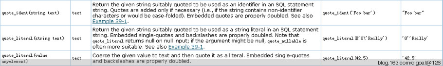

## PostgreSQL general public partition table trigger  
                                                                                      
### 作者                                                                                         
digoal                                                                                 
                                                                                  
### 日期                                                                                                                                                     
2012-09-07                                                                               
                                                                                     
### 标签                                                                                  
PostgreSQL , trigger , partition table   
                                                                                                                                                        
----                                                                                                                                                  
                                                                                                                                                           
## 背景                     
触发器在数据库中的使用非常广泛, 例如用来跟踪用户行为, 用户登录过滤(Oracle中), 数据复制, 数据分区等等.   
  
以前写过一些类似的应用场景案例分享, 感兴趣的朋友可以参考本文的末尾部分, 有相关的链接.   
  
特别是在数据分区应用场景中, PostgreSQL目前没有将分区这部分代码作为COMMAND来实现.   
  
因此DBA可能经常需要写繁琐的触发器, 例如昨天我们这边一位同事写的触发器, 我看了之后第一感觉就是太繁琐, 维护麻烦, 如下 :   
  
```  
CREATE OR REPLACE FUNCTION digoal.p_insert_info_trigger()  
 RETURNS trigger  
 LANGUAGE plpgsql  
AS $function$  
BEGIN  
IF ( NEW.createtime >= DATE '2012-09-01' AND NEW.createtime < DATE '2012-09-02' ) THEN  
INSERT INTO tbl_rop_info_20120901 VALUES (NEW.*);  
ELSIF ( NEW.createtime >= DATE '2012-09-02' AND NEW.createtime < DATE '2012-09-03' ) THEN  
INSERT INTO tbl_rop_info_20120902 VALUES (NEW.*);  
-- 中间略去几千行类似代码.   
ELSIF ( NEW.createtime >= DATE '2015-06-19' AND NEW.createtime < DATE '2015-06-20' ) THEN  
INSERT INTO tbl_rop_info_20150619 VALUES (NEW.*);  
ELSE  
RAISE EXCEPTION 'Date out of range. Fix the p_insert_info_trigger() function!';  
END IF;  
RETURN NULL;  
END;  
$function$;  
```  
  
能不能写一个通用的触发器呢? 减轻一下DBA维护这类代码的工作量.  
  
当然是有的, 下面是例子 :   
  
本例使用的是按照时间月份分区的通用触发器, 如果想改成hash取模或者按天分区的. 可以稍微修改一下这个触发器.  
  
关于这个通用触发器的调优, 以后有时间再阐述.  
  
为了更加通用, 我这里使用了2个触发器函数的参数, 第1个是子表的前缀, 第2个是分区字段.  
  
我们定一个规则，表按照月分区，分区表名为tbl_yyyymm。  
  
```  
create or replace function general_trg_insert() returns trigger as $$  
declare  
  v_partition_column name;  
  v_subtable_prefix name;  
  v_subtable_suffix name;  
  v_subtable name;  
  v_sql text;  
begin  
  v_subtable_prefix := TG_ARGV[0];  
  v_partition_column := TG_ARGV[1];  
  
  --  按分区字段值计算分区后缀  
  execute $_$select to_char((('$_$||replace(NEW::text,$_$'$_$,$_$''$_$)||$_$'::$_$||TG_TABLE_SCHEMA||'.'||TG_TABLE_NAME||').'||v_partition_column||')::timestamp, $_$yyyymm$_$)' into v_subtable_suffix;  
  
  --  拼接子表的表名  
  v_subtable := v_subtable_prefix||'_'||v_subtable_suffix;  
  
  --  生成动态SQL, 数据插入对应子表  
  v_sql := 'insert into '||TG_TABLE_SCHEMA||'.'||v_subtable||$_$ select ('$_$||replace(NEW::text,$_$'$_$,$_$''$_$)||$_$'::$_$||TG_TABLE_SCHEMA||'.'||TG_TABLE_NAME||').*';  
    
  -- 以下为DEBUG, 正式可以删掉raise notice.  
  -- raise notice 'v_sql: %', v_sql;  
  --  执行动态SQL  
  execute v_sql;  
  RETURN NULL;  
END;  
$$ language plpgsql;  
```  
  
测试：  
  
创建父表：  
  
```  
digoal=> create table rmt.tbl_login_log(id int primary key,info text,crt_time timestamp(6));  
```  
  
创建测试子表，子表的命名规则：前缀_后缀。  
  
```  
digoal=> create table tbl_login_log_201504 (like tbl_login_log including all) inherits (tbl_login_log);  
```  
  
在父表上创建触发器，创建触发器时指定2个参数，分别表示父表的表名，以及分区字段名。  
  
```  
digoal=> create trigger tg_tbl_login_log_insert before insert on rmt.tbl_login_log for each row execute procedure general_trg_insert('tbl_login_log','crt_time');  
```  
  
插入测试数据：  
  
```  
digoal=> insert into rmt.tbl_login_log values (1,E'I\'m digoal.zhou', now());  
NOTICE:  v_sql: insert into rmt.tbl_login_log_201504 select ('(1,"I''m digoal.zhou","2015-04-19 18:22:18.21593")'::rmt.tbl_login_log).*  
INSERT 0 0  
```  
  
查看子表是否有数据。  
  
注意检查逃逸字符是否正常，这个在写触发器函数的时候一定要注意。  
  
本例使用replace将单引号替换成两个单引号规避了这个问题。  
  
```  
digoal=> select tableoid::regclass,* from rmt.tbl_login_log;  
         tableoid         | id |      info       |         crt_time            
--------------------------+----+-----------------+---------------------------  
 rmt.tbl_login_log_201504 |  1 | I'm digoal.zhou | 2015-04-19 18:22:18.21593  
(1 row)  
```  
  
CPU单核插入速度 :   
  
```  
digoal=> insert into rmt.tbl_login_log select generate_series(2,100000),'digoal',now();  
INSERT 0 0  
Time: 19803.455 ms  
```  
  
直接插入子表的速度 :   
  
```  
digoal=> truncate rmt.tbl_login_log_201504 ;  
TRUNCATE TABLE  
Time: 30.486 ms  
digoal=> insert into rmt.tbl_login_log_201504 select generate_series(2,100000),'digoal',now();  
INSERT 0 99999  
Time: 431.048 ms  
```  
  
说明通用触发器比直接插入子表的速度下降45倍. 所以对于插入请求较多的表不适合使用.  
  
使用非通用触发器的性能测试如下 :   
  
触发器函数 :   
  
```  
CREATE OR REPLACE FUNCTION p_insert_info_trigger()  
 RETURNS trigger  
 LANGUAGE plpgsql  
AS $function$  
BEGIN  
IF ( NEW.crt_time >= DATE '2015-04-01' AND NEW.crt_time < DATE '2015-05-01' ) THEN  
INSERT INTO rmt.tbl_login_log_201504 VALUES (NEW.*);  
ELSE  
RAISE EXCEPTION 'Date out of range. Fix the p_insert_info_trigger() function!';  
END IF;  
RETURN NULL;  
END;  
$function$;  
```  
  
删除原触发器 :   
  
```  
digoal=> drop trigger tg_tbl_login_log_insert on rmt.tbl_login_log;  
DROP TRIGGER  
Time: 0.937 ms  
```  
  
创建触发器 :   
  
```  
digoal=> create trigger tg_tbl_login_log_insert before insert on rmt.tbl_login_log for each row execute procedure p_insert_info_trigger();  
CREATE TRIGGER  
Time: 1.006 ms  
```  
  
删除表记录 :   
  
```  
digoal=> truncate rmt.tbl_login_log_201504 ;  
TRUNCATE TABLE  
Time: 22.200 ms  
```  
  
插入同样的数据 :   
  
```  
digoal=> insert into rmt.tbl_login_log select generate_series(2,100000),'digoal',now();  
INSERT 0 0  
Time: 2734.205 ms  
```  
  
结果使用非通用触发器的性能是通用触发器的7倍.   
  
通用触发器插入一个没有创建好子表的情况，将报错如下：  
  
```  
digoal=> insert into rmt.tbl_login_log values (1,E'I\'m digoal.zhou', '2012-01-01'::timestamp);  
ERROR:  relation "rmt.tbl_login_log_201201" does not exist  
LINE 1: insert into rmt.tbl_login_log_201201 select ('(1,"I''m digoa...  
                    ^  
QUERY:  insert into rmt.tbl_login_log_201201 select ('(1,"I''m digoal.zhou","2012-01-01 00:00:00")'::rmt.tbl_login_log).*  
CONTEXT:  PL/pgSQL function general_trg_insert() line 24 at EXECUTE statement  
Time: 0.849 ms  
```  
  
正因为是通用触发器，所以当然是为了通用而设计的，下面使用这个通用触发器再建立一个分区表的使用。  
  
表结构与前面一个不一样，分区字段也不一样，schema也不一样。看看能不能正常使用？  
  
```  
digoal=> create table rmt.tbl_logout_log  
(userid int primary key,   
firstname text,   
lastname text,   
age int,   
email text,   
ctime timestamp(6));  
```  
  
分区字段换成ctime，命名为t_yyyymm。  
  
```  
digoal=> create table rmt.t_201504 (like rmt.tbl_logout_log including all) inherits(rmt.tbl_logout_log);  
```  
  
创建触发器, 注意触发器函数的2个参数的变化：  
  
```  
digoal=> create trigger tg_tbl_logout_log_insert before insert on rmt.tbl_logout_log for each row execute procedure general_trg_insert('t','ctime');  
```  
  
插入测试数据：  
  
```  
digoal=> insert into rmt.tbl_logout_log values (1,'zhou','digoal',30,'digoal@126.com',now());  
INSERT 0 0  
Time: 3.919 ms  
```  
  
查看数据。  
  
```  
digoal=> select tableoid::regclass,* from rmt.tbl_logout_log ;  
   tableoid   | userid | firstname | lastname | age |     email      |           ctime              
--------------+--------+-----------+----------+-----+----------------+----------------------------  
 rmt.t_201504 |      1 | zhou      | digoal   |  30 | digoal@126.com | 2015-04-19 18:36:58.234009  
(1 row)  
```  
  
## 其他  
1\. 下面两个触发器函数中的变量: ( 类似C里面 main(int argc, char *argv[]) )  
  
```  
TG_NARGS   
Data type integer; the number of arguments given to the trigger procedure in the CREATE TRIGGER statement.  
  
TG_ARGV[]  
Data type array of text; the arguments from the CREATE TRIGGER statement.   
The index counts from 0. Invalid indexes (less than 0 or greater than or equal to tg_nargs) result in a null value.  
```  
  
2\. NEW在触发器中是一个TG_TABLE_NAME类型的变量. 所以在动态SQL中可以把它转成TG_TABLE_NAME的类型.   
  
    这样才能方便的取出它存储的单项值. 为后面拼装INSERT的动态SQL提供可能.  
  
    如下 :   
  
```  
    execute 'select quote_nullable(($_$'||NEW||'$_$::'||TG_TABLE_NAME||').'||v_attname||')' into v_values_tmp;  
```  
  
3\. 其他你可能需要了解但是本文未详细描述的如, 游标, plpgsql函数语法, 字符串封装函数, 触发器变量等 请参考如下URL.  
  
http://www.postgresql.org/docs/9.2/static/plpgsql-cursors.html  
  
http://www.postgresql.org/docs/9.2/static/plpgsql-statements.html#PLPGSQL-QUOTE-LITERAL-EXAMPLE  
  
http://www.postgresql.org/docs/9.2/static/functions-string.html  
  
http://www.postgresql.org/docs/9.2/static/plpgsql-trigger.html  
  
http://www.postgresql.org/docs/9.2/static/sql-createtrigger.html  
  
4\. 字符串封装, 特别提一下 :   
  
  
   
拼装时, 如果是表名, 列名. 使用quote_ident封装(双引号封装), 如果是值, 可以使用quote_literal或者quote_nullable.  
  
## 小结  
1\. 权衡维护量和性能, 通用的触发器要用到动态SQL(增加15%左右CPU开销).   
  
    IF ELSIF写的触发器虽然没有动态SQL, 但是当条件命中在末端时, 上千个判断带来的CPU开销比动态SQL性能更烂.  
  
    通用触发器的性能比非通用触发器要查25倍。 所以还有很大的优化空间。  
  
2\. IF ELSIF也可有优化手段, 参考《PostgreSQL partition table's arithmetic tuning example》  
  
3\. 通用触发器简化了触发器的编写和维护工作, 但是也带来了巨大的性能损失, 当然还有很大的优化空间.  
  
## 参考  
trigger 在分区表方面的应用案例:  
  
1\. PostgreSQL Partition Table Example  
  
http://blog.163.com/digoal@126/blog/static/1638770402012325111528424/  
  
2\. PostgreSQL partition table's arithmetic tuning example  
  
http://blog.163.com/digoal@126/blog/static/1638770402011210114036419/  
  
3\. execute plan difference between Oracle and PostgreSQL's partition table  
  
http://blog.163.com/digoal@126/blog/static/163877040201212432441676/  
  
4\. Compare Oracle's & PostgreSQL's Partition Table write performance  
  
http://blog.163.com/digoal@126/blog/static/163877040201123084853271/  
  
5\. Partition Table monitor on PostgreSQL  
  
http://blog.163.com/digoal@126/blog/static/163877040201082964624615/  
  
6\. how many performance decreased use dynamic SQL  
  
http://blog.163.com/digoal@126/blog/static/1638770402011109103953350/  
  
trigger 在其他方面的应用案例:  
  
1\. implement PostgreSQL table have one and only one row  
  
http://blog.163.com/digoal@126/blog/static/163877040201251931517556/  
  
2\. table level replication use trigger -- one(rw) to many(ro|rw)  
  
http://blog.163.com/digoal@126/blog/static/1638770402012731203716/  
  
3\. table level replication use trigger -- multi master replication & performance tuning  
  
http://blog.163.com/digoal@126/blog/static/1638770402012731944439/  
  
4\. USE hstore store table's trace record  
  
http://blog.163.com/digoal@126/blog/static/163877040201252575529358/  
  
5\. Use timetravel function trace tuple's DML.   
  
http://blog.163.com/digoal@126/blog/static/16387704020120133019990/  
  
<a rel="nofollow" href="http://info.flagcounter.com/h9V1"  ></a>  
  
  
  
  
  
  
## [digoal's 大量PostgreSQL文章入口](https://github.com/digoal/blog/blob/master/README.md "22709685feb7cab07d30f30387f0a9ae")
  
