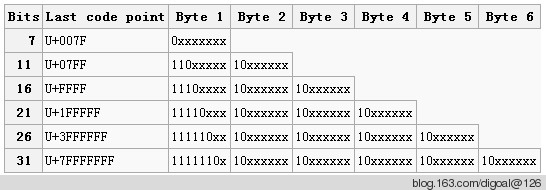
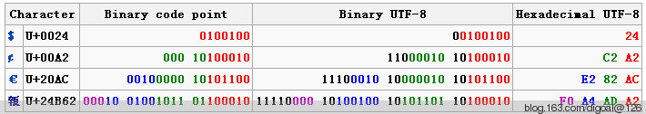

## PostgreSQL WHY ERROR: invalid byte sequence for encoding "UTF8"       
                                                                
### 作者                                                               
digoal                                                                
                                                                
### 日期                                                              
2012-12-28                                                                 
                                                                
### 标签                                                              
PostgreSQL , SQL_ASCII , 乱码 , 不检测编码合法性 , client_encoding                                                                                                             
                                                                
----                                                              
                                                                
## 背景                  
使用PostgreSQL 的朋友可能遇到过类似ERROR:  invalid byte sequence for encoding "UTF8": 0x00 的报错.    
    
这是什么原因呢? 本文就来解释一下 :     
    
首先我们这里说的是UTF8字符集, 我的测试环境如下 :     
    
```    
ocz@db-172-16-3-150-> psql digoal digoal    
psql (9.2.1)    
Type "help" for help.    
digoal=> \l    
                             List of databases    
   Name    |  Owner   | Encoding | Collate | Ctype |   Access privileges       
-----------+----------+----------+---------+-------+-----------------------    
 digoal    | postgres | UTF8     | C       | C     | =Tc/postgres         +    
           |          |          |         |       | postgres=CTc/postgres+    
           |          |          |         |       | digoal=CTc/postgres    
 postgres  | postgres | UTF8     | C       | C     |     
 skycac    | postgres | UTF8     | C       | C     | =Tc/postgres         +    
           |          |          |         |       | postgres=CTc/postgres+    
           |          |          |         |       | skycac=CTc/postgres    
 template0 | postgres | UTF8     | C       | C     | =c/postgres          +    
           |          |          |         |       | postgres=CTc/postgres    
 template1 | postgres | UTF8     | C       | C     | =c/postgres          +    
           |          |          |         |       | postgres=CTc/postgres    
(5 rows)    
```    
    
Encoding = UTF8.    
    
这个字符集的详细信息可以去看本文参考部分提到的几篇文章.    
    
UTF8是变长的, 1-6个字节.    
    
它需要遵循如下编码规则 :     
    
    
    
实际能使用的比特位总数是7, 11, 16, 21, 26, 31.     
    
上图每个字节中的x表示可以实际使用的位置. 其他的位置必须固定, 这么设计的好处之一是读到第一个字节的时候就知道这个字符占用几个字节.    
    
正因为有以上规定, 凡是不符合这个规则的都视为非法字符.    
    
合法使用的例子 :     
    
    
    
Binary UTF-8的黑色数字就是固定位置的数字.    
    
例如在数据库中查询以上Hexadecimal UTF-8 :     
    
```    
digoal=> select E'\x24';    
 ?column?     
----------    
 $    
(1 row)    
digoal=> select E'\xC2\xA2';    
 ?column?     
----------    
 ￠    
(1 row)    
digoal=> select E'\xe2\x82\xac';    
 ?column?     
----------    
 ?    
(1 row)    
```    
    
反向转换也是可以的 :     
    
```    
digoal=> select 'a'::bytea;    
 bytea     
-------    
 \x61    
(1 row)    
digoal=> select 'abc'::bytea;    
  bytea       
----------    
 \x616263    
(1 row)    
digoal=> select '你好'::bytea;    
     bytea          
----------------    
 \xe4bda0e5a5bd    
(1 row)    
```    
    
如果输入的字符编码违反了图中的规定, 就会报错 :     
    
例如 :     
    
10001111 转换成16进制是8F, 查询就报错 :     
    
```    
digoal=> select E'\x8f';    
ERROR:  invalid byte sequence for encoding "UTF8": 0x8f    
```    
    
又或者 :     
    
```    
digoal=> select E'\x00';    
ERROR:  invalid byte sequence for encoding "UTF8": 0x00    
```    
    
0x00报错又是为什么呢? 它是合法的UTF8字符!    
    
因为 ：psql does not support embedded NUL bytes in variable values.　NUL就是E'\x00'.    
    
如果要存储NUL, 请使用bytea类型 :     
    
```    
digoal=> select '\x00'::bytea;    
 bytea     
-------    
 \x00    
(1 row)    
```    
    
convert函数观察编码合法性    
    
```  
postgres=# \df *convert*  
                              List of functions  
   Schema   |     Name     | Result data type | Argument data types |  Type    
------------+--------------+------------------+---------------------+--------  
 pg_catalog | convert      | bytea            | bytea, name, name   | normal  
 pg_catalog | convert_from | text             | bytea, name         | normal  
 pg_catalog | convert_to   | bytea            | text, name          | normal  
(3 rows)  
```  
    
转义参考 :     
    
String Constants with C-style Escapes    
    
String Constants with Unicode Escapes    
    
## 参考    
1\. http://en.wikipedia.org/wiki/UTF-8    
    
2\. http://en.wikipedia.org/wiki/Unicode    
    
3\. http://tools.ietf.org/html/rfc3629    
    
4\. http://www.postgresql.org/docs/9.1/static/sql-syntax-lexical.html    
    
5\. http://stackoverflow.com/questions/1347646/postgres-error-on-insert-error-invalid-byte-sequence-for-encoding-utf8-0x0?rq=1    
                  
6\. 如果是从ORACLE迁移过来，可以使用Oracle的empty_clob()处理一下0x00字符。  
                                       
  
<a rel="nofollow" href="http://info.flagcounter.com/h9V1"  ></a>  
  
  
  
  
  
  
## [digoal's 大量PostgreSQL文章入口](https://github.com/digoal/blog/blob/master/README.md "22709685feb7cab07d30f30387f0a9ae")
  
