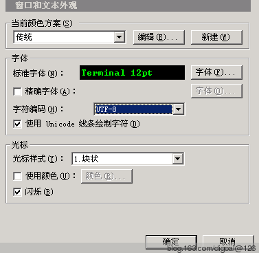
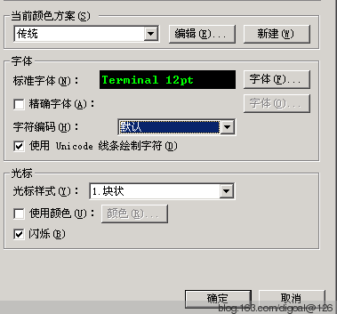

## PostgreSQL SQL_ASCII encoding introduce     
                                                          
### 作者                                                         
digoal                                                          
                                                          
### 日期                                                        
2013-05-10                                                           
                                                          
### 标签                                                        
PostgreSQL , SQL_ASCII , 乱码 , 不检测编码合法性 , client_encoding                                                                                                       
                                                          
----                                                        
                                                          
## 背景            
一位网友想将PostgreSQL数据库从sql_ascii编码迁移到utf8编码.  
  
这里涉及到编码的转换, 首先要了解一下sql_ascii的编码含义 :   
  
```  
The SQL_ASCII setting behaves considerably differently from the other settings.   
  
When the server character set is SQL_ASCII, the server interprets byte values 0-127 according to the ASCII standard, while byte values 128-255 are taken as uninterpreted characters.   
  
No encoding conversion will be done when the setting is SQL_ASCII.   
  
Thus, this setting is not so much a declaration that a specific encoding is in use, as a declaration of ignorance about the encoding.   
  
In most cases, if you are working with any non-ASCII data, it is unwise to use the SQL_ASCII setting because PostgreSQL will be unable to help you by converting or validating non-ASCII characters.  
```  
  
注意这句话 :   
  
```  
PostgreSQL will be unable to help you by converting or validating non-ASCII characters.  
```  
  
说白了ASCII存储的就是单字节流. 并且没有能力判断多字节字符的有效性, 所以会一股脑存储进去.  
  
换句话说你可能在SQL_ASCII中存储了utf8编码的字符, 也存储了gbk编码的字符, 还存储了其他编码的字符.  
  
那么要将sql_ascii转换成UTF8就不是一件易事了, 会遇到多种字符的转换工作.   
  
最好自己写个转换程序, 一行一行的转换.  
  
## 正文  
例子 :   
  
初始化一个SQL_ASCII数据库集群 :   
  
```  
initdb -E SQL_ASCII --locale=C -U postgres -W -D /pgdata1222  
```  
  
启动数据库 :   
  
```  
pg_ctl start -D /pgdata1222  
```  
  
查看当前服务器字符集环境  
  
```  
pg93@db-172-16-3-33-> locale  
LANG=en_US.utf8  
LC_CTYPE="en_US.utf8"  
LC_NUMERIC="en_US.utf8"  
LC_TIME="en_US.utf8"  
LC_COLLATE="en_US.utf8"  
LC_MONETARY="en_US.utf8"  
LC_MESSAGES="en_US.utf8"  
LC_PAPER="en_US.utf8"  
LC_NAME="en_US.utf8"  
LC_ADDRESS="en_US.utf8"  
LC_TELEPHONE="en_US.utf8"  
LC_MEASUREMENT="en_US.utf8"  
LC_IDENTIFICATION="en_US.utf8"  
LC_ALL=  
```  
  
连接数据库  
  
```  
pg93@db-172-16-3-33-> psql -h 127.0.0.1 -p 1222  
psql (9.3devel)  
Type "help" for help.  
digoal=# \l+  
                                                               List of databases  
   Name    |  Owner   | Encoding  | Collate | Ctype |   Access privileges   |  Size   | Tablespace |                Description       
              
-----------+----------+-----------+---------+-------+-----------------------+---------+------------+--------------------------------  
------------  
 postgres  | postgres | SQL_ASCII | C       | C     |                       | 6554 kB | pg_default | default administrative connecti  
on database  
 template0 | postgres | SQL_ASCII | C       | C     | =c/postgres          +| 6425 kB | pg_default | unmodifiable empty database  
           |          |           |         |       | postgres=CTc/postgres |         |            |   
 template1 | postgres | SQL_ASCII | C       | C     | =c/postgres          +| 6425 kB | pg_default | default template for new databa  
ses  
           |          |           |         |       | postgres=CTc/postgres |         |            |   
(3 rows)  
digoal=# show client_encoding;  
 client_encoding   
-----------------  
 UTF8  
(1 row)  
```  
  
把客户端编码改成sql_ascii, 这样的话客户端也不检查多字节编码合法性, 服务端也是sql_ascii, 所以服务端也不检测.  
  
**就可以随意输入了.**   
  
检查当前终端的编码  
  
    
  
插入数据  
  
```  
digoal=# insert into t values ('刘德华');  
INSERT 0 1  
```  
  
将终端改成gbk, 再插入  
  
    
  
```  
digoal=# insert into t values ('刘德华');  
INSERT 0 1  
```  
  
现在数据库里面有两条数据了, 并且两条数据的编码不一样.  
  
```  
digoal=# select *,info::bytea from t;  
   info    |         info           
-----------+----------------------  
 鍒樺痉鍗?| \xe58898e5beb7e58d8e  
 刘德华    | \xc1f5b5c2bbaa  
(2 rows)  
```  
  
如果要把两条数据都转换成utf8字符集的话, 肯定是有问题的. 因为每种字符集都有自己的编码规则.  
  
这2行字节流（存在数据库中的二进制）显然不一样的.  
  
如果你真的在使用sql_ascii的服务端编码, 那么比较靠谱或明智的用法是设置postgresql.conf client_encoding参数，通过它来强行验证数据合法性.  
  
```  
client_encoding=utf8  
```  
  
从而规避不做任何字符合法性检测的问题.  
  
下面我们来看看将终端设置成gbk, client_encoding设置成utf8然后插入中文的效果 :   
  
```  
digoal=# show client_encoding;  
 client_encoding   
-----------------  
 UTF8  
(1 row)  
postgres=# insert into t values ('刘德华');  
ERROR:  invalid byte sequence for encoding "UTF8": 0xc1 0xf5  
ERROR:  invalid byte sequence for encoding "UTF8": 0xc1 0xf5  
```  
  
这时报错了, 因为client_encoding设置了utf8字符集, 而终端(这里指我的SecureCRT软件)是gbk, 终端根据gbk编码将中文字符转换成字节流\xc1f5b5c2bbaa, 插入数据库.  
  
\xc1f5b5c2bbaa不是一个合法的UTF8编码字符串  
  
此时插入就会失败，是不是帮到你了呢？  
  
注意这个报错和服务器的环境没有关系.  
  
```  
pg93@db-172-16-3-33-> export LANG=en_US.gbk  
pg93@db-172-16-3-33-> psql -h 127.0.0.1 -p 1222  
psql (9.3devel)  
Type "help" for help.  
digoal=# set client_encoding='utf8';  
SET  
```  
  
SecureCRT软件终端保持gbk不变  
  
```  
digoal=# insert into t values ('刘德华');  
digoal'# ';  
digoal(# );  
ERROR:  invalid byte value for encoding "SQL_ASCII": 0xe5  
ERROR:  invalid byte value for encoding "SQL_ASCII": 0xe5  
```  
  
## 参考  
1\. PostgreSQL WHY ERROR: invalid byte sequence for encoding "UTF8"  
  
http://blog.163.com/digoal@126/blog/static/163877040201211281407682/  
            
                                 
  
<a rel="nofollow" href="http://info.flagcounter.com/h9V1"  ></a>  
  
  
  
  
  
  
## [digoal's 大量PostgreSQL文章入口](https://github.com/digoal/blog/blob/master/README.md "22709685feb7cab07d30f30387f0a9ae")
  
