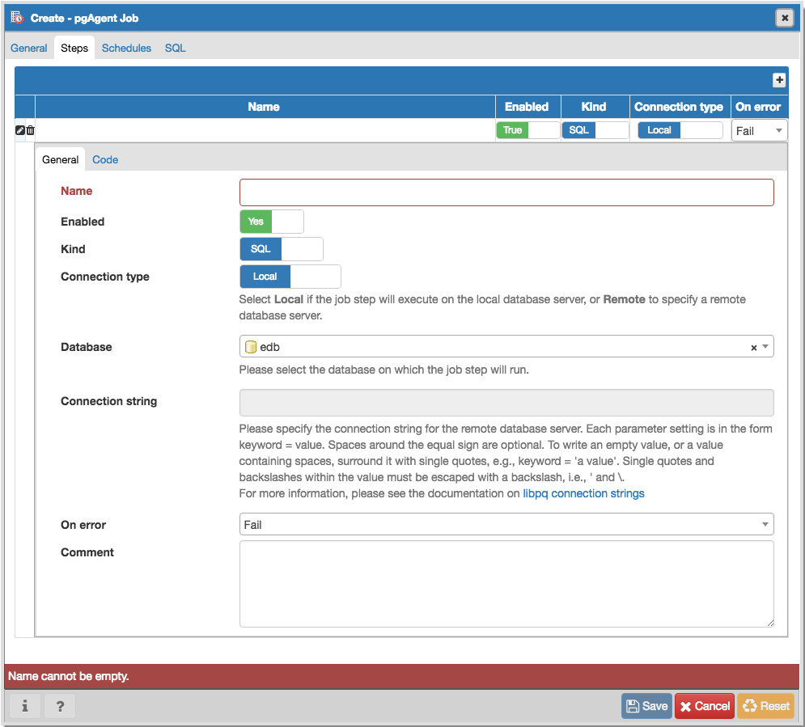
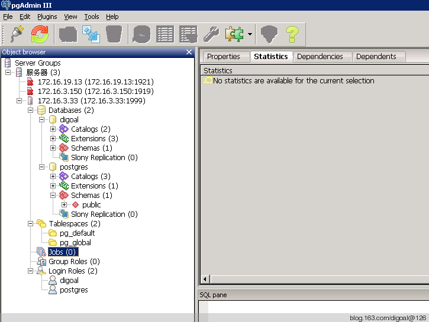

## PostgreSQL Oracle 兼容性之 - DBMS_JOBS - Daily Maintenance - Timing Tasks(pgagent)    
                    
### 作者                    
digoal                    
                    
### 日期                    
2013-05-31                   
                    
### 标签                    
PostgreSQL , pgagent , Oracle兼容性 , job , dbms_jobs       
                    
----                    
                    
## 背景       
在PostgreSQL中跑JOB任务的方法。    
  
### 用到三个组件：  
  
1、pgagent客户端，用于定时连接到PG数据库执行任务。  
  
2、PostgreSQL pgagent数据库插件，必须在PostgreSQL数据库端编译安装pgagent 或 pgadmin(内部打包了pgagent)。包括一些表、函数、视图，被用于管理pgagent任务。  
  
3、pgadmin GUI，结合pgagent数据库插件，可以使用pgadmin连接到pg数据库，并管理JOB任务。  
  
### 调度信息存在哪里？  
  
连接到目标库的postgres库中，执行create extension pgagent。  
  
### 有哪些连接串，分别在哪里？  
  
1、调度库postgres的连接串，也就是pgagent客户端连接数据库的连接串。  
  
2、执行目标任务的数据库的连接串，也就是pgagent存在调度库postgres中的，每个任务中的连接串。  
  
  
  
http://www.postgresql.org/docs/current/static/libpq.html#libpq-connect  
  
### 密码存在哪里更安全？  
  
建议将数据库密码存在.pgpass或PGPASSFILE环境变量定义的密码文件中。  
  
如果不存在密码文件中，你需要在连接串中配置，会显示出来。  
    
## pgagent  介绍  
PostgreSQL 定时任务可以通过操作系统的定时任务功能来实现, 例如Linux 的crontab.     
    
也可以通过pgagent插件来实现, pgagent插件可以安装在数据库端，也可以安装在远端.    
    
pgagent的调度信息存储在PostgreSQL数据库的postgres库中, 可以通过pgadmin可以在图形化界面来配置调度表.    
    
pgagent是一个后台进程, 会定期的读取配置好的调度信息, 根据调度信息执行job, 并记录执行日志.    
    
一般来说建议将pgagent安装在本地数据库服务器中, 调度信息也存放在本地数据库的postgres库中, 那么在执行job时, pgagent连接本地数据库即可. 否则的话还需要配置目标库的密码, 建议用.pgpass来配置(并配置文件权限), 如果配置在命令行中可以被ps进程查看.   当然还是配置在数据库端最安全。    
  
为了更方便的管理pgagent任务，可以使用pgadmin+pgagent插件来进行管理。   
  
## pgagent客户端的安装    
首先下载pgagent :     
    
http://git.postgresql.org/gitweb/?p=pgagent.git;a=summary    
    
    
阅读README, 编译pgagent需要先安装以下软件 :     
    
```    
- A C/C++ compiler, such as GCC or Microsoft Visual C++ on Windows.    
- CMake 2.6 (from www.cmake.org)    
- A wxWidgets 2.8.x installation, configured per the requirements for    
  pgAdmin:    
  http://git.postgresql.org/gitweb/?p=pgadmin3.git;a=blob_plain;f=INSTALL;hb=HEAD    
- A PostgreSQL 8.3 or higher installation    
```    
    
安装gcc    
    
```    
rpm -ivh gcc-4.1.2-51.el5    
```    
    
安装cmake    
    
```    
tar -zxvf cmake-2.8.8.tar.gz    
cd cmake-2.8.8    
./bootstrap --prefix=/opt/cmake2.8.8    
gmake    
gmake install    
```    
    
安装好后将cmake的bin目录放到PATH变量.    
    
```    
vi ~/.bash_profile    
export PATH=/opt/cmake2.8.8/bin:$PATH    
. ~/.bash_profile    
```    
    
安装wxWidgets    
    
```    
wget http://prdownloads.sourceforge.net/wxwindows/wxGTK-2.8.12.tar.gz    
tar -zxvf wxGTK-2.8.12.tar.gz    
cd wxGTK-2.8.12    
./configure --enable-shared=no --enable-unicode=yes --prefix=/opt/wxGTK-2.8.12    
make    
make install    
```    
    
将bin加入PATH    
    
```    
vi ~/.bash_profile    
export PATH=/opt/wxGTK-2.8.12/bin:$PATH    
export LD_LIBRARY_PATH=/opt/wxGTK-2.8.12/lib:$LD_LIBRARY_PATH    
. ~/.bash_profile    
```    
    
安装PostgreSQL, 略.    
    
PostgreSQL 10 on CentOS 6.x x64    
    
```    
yum install -y https://dl.fedoraproject.org/pub/epel/epel-release-latest-6.noarch.rpm    
yum install -y https://download.postgresql.org/pub/repos/yum/10/redhat/rhel-6-x86_64/pgdg-centos10-10-2.noarch.rpm    
yum install -y postgresql10*      
```    
    
PostgreSQL 10 on CentOS 7.x x64    
    
```    
yum install -y https://dl.fedoraproject.org/pub/epel/epel-release-latest-7.noarch.rpm    
yum install -y https://download.postgresql.org/pub/repos/yum/10/redhat/rhel-7-x86_64/pgdg-centos10-10-2.noarch.rpm    
yum install -y postgresql10*      
```    
    
将pg_config加入PATH    
    
```    
vi ~/.bash_profile    
export PATH=/opt/pgsql9.3/bin:$PATH    
. ~/.bash_profile    
```    
    
安装pgagent    
    
```    
tar -zxvf pgagent-d6c5a80.tar.gz    
cd pgagent-d6c5a80    
ccmake ./    
  
生成配置    
 CMAKE_BUILD_TYPE                                                                                                                      
 CMAKE_INSTALL_PREFIX             修改为此项 /opt/pgagent                                                                                         
 PG_CONFIG_PATH                   /opt/pgsql9.3/bin/pg_config                                                                          
 STATIC_BUILD                     ON                                                                                                   
 WX_CONFIG_PATH                   /opt/wxGTK-2.8.12/bin/wx-config                                                                      
 WX_DEBUG                         OFF    
    
按c配置,然后按g产生配置    
    
接下来就可以编译安装了    
    
make    
make install    
```    
    
配置.bash_profile    
    
```    
vi ~/.bash_profile    
export PATH=/opt/pgagent/bin:$PATH    
. ~/.bash_profile    
```    
    
在本地库的postgres库中创建调度信息, 表, 函数 :     
    
```    
psql -h 127.0.0.1 -p 1999 -U postgres -d postgres -f /opt/pgagent/share/pgagent.sql    
```    
    
安装好后, 使用pgadmin连接到本地库就可以看到jobs选项 :     
    
    
    
## pgagent 详细使用文档  
https://www.pgadmin.org/docs/pgadmin4/1.x/pgagent.html  
  
## pgagent 配置举例    
### 安装pgagent插件  
  
```  
create extensioin pgagent;  
  
create extension plpgsql;  -- 通常plpgsql默认已经安装了  
```  
  
创建pgagent插件后就可以使用pgadmin配置job了.     
  
### 启动pgagent客户端.    
    
pgagent是一个后台进程, 时刻要去读取存储在数据库中的调度信息以执行定时任务. 所以首先要启动pgagent.    
    
```    
[root@db-172-16-3-33 ~]# pgagent --help    
  
Usage:  
  /path/to/pgagent [options] <connect-string>  
  
options:  
  -f run in the foreground (do not detach from the terminal)  
  -t <poll time interval in seconds (default 10)>  
  -r <retry period after connection abort in seconds (>=10, default 30)>  
  -s <log file (messages are logged to STDOUT if not specified)>  
  -l <logging verbosity (ERROR=0, WARNING=1, DEBUG=2, default 0)>  
```    
    
例如, -t 1表示每秒读取一次调度数据 :     
    
```    
pgagent -t 1 -l 2 -s /var/log/pgagent.log hostaddr=127.0.0.1 port=1999 dbname=postgres user=postgres    
```    
    
建议不要把password配置在命令行中, 尽量配置在密码文件中，例如 :     
    
```    
vi ~/.pgpass    
  
127.0.0.1:1999:postgres:postgres:postgres    
chmod 400 ~/.pgpass    
```    
    
## 案例1 :     
需求 : 在本地数据库中定时执行sql    
    
job配置    
  
https://www.pgadmin.org/docs/pgadmin4/1.x/pgagent_jobs.html  
    
1\. 在pgadmin的jobs上右键新建job.    
    
2\. 在属性栏配置job name, 例如j1.    
    
3\. 在steps中新建并配置step name, 本地库名;    
    
在定义栏配置要执行的sql :     
    
```    
create table if not exists test_sum(sdate date, cnt int8);    
insert into test_sum select current_date,count(*) from pg_class group by current_date;    
```    
    
可以配置多个step, 执行时按名称以及step id排序执行 :     
    
```    
// job.cpp - pgAgent job    
    
int Job::Execute()    
{    
        int rc = 0;    
        bool succeeded = false;    
        DBresult *steps = threadConn->Execute(    
                              wxT("SELECT * ")    
                              wxT("  FROM pgagent.pga_jobstep ")    
                              wxT(" WHERE jstenabled ")    
                              wxT("   AND jstjobid=") + jobid +    
                              wxT(" ORDER BY jstname, jstid"));    
```    
    
4\. 在schedule栏中新建并配置调度名, 开始时间, 如果有结束时间的话还需要配置结束时间.    
    
days中可以配置周, 月, 日    
    
times中可以配置小时, 分钟.    
    
exceptions中配置排他.    
    
配置完后, 在steps以及jos的统计信息栏可以看到每次JOB或者step执行的情况.    
    
## 案例2 :     
需求 : 定时执行脚本(batch)    
    
脚本配置    
    
```    
[root@db-172-16-3-33 ~]# cat /root/b.sh    
#!/bin/bash    
psql -h 127.0.0.1 -p 1999 -U postgres postgres <<EOF    
create table if not exists t(id int);    
insert into t values (1);    
EOF    
exit $?    
chmod 500 b.sh    
```    
    
以上假设pgagent是以root用户执行的. 否则要考虑脚本的可执行权限.    
    
job配置, 同上    
    
schedule配置, 同上    
    
step配置, 选择batch, 不需要选择数据库. 定义中输入/root/b.sh .其他同上.    
    
## 案例3 :     
需求 : 在远程数据库中定时执行SQL    
    
job配置, 同上.    
    
schedule配置, 同上.    
    
step配置, 需要输入远程数据库的连接信息. 密码配置在conn string中. 所以不安全.    
    
例如 :     
    
```    
hostaddr=172.16.3.150 port=1000 user=postgres dbname=postgres password=pwd    
```    
    
这里支持.pgpass. 所以建议不要使用远程定时任务.    
    
连接信息参考 :     
    
http://www.postgresql.org/docs/devel/static/libpq-connect.html    
    
## EnterpriseDB (EDB PPAS)  
如果你用的是ppas，请下载ppas的版本。   用法与上面类似。     
    
https://www.enterprisedb.com/software-downloads-postgres     
    
https://www.enterprisedb.com/tut-how-use-pgagent-postgres-plus     
  
## pg_cron
pg_cron也是一个PG的JOB管理插件，启动work process进行管理，不需要再部署一台pgagent客户端了。    
  
https://github.com/citusdata/pg_cron  
    
## 参考    
1\. http://www.postgresql.org/docs/devel/static/libpq-connect.html    
    
2\. http://pgadmin.org/     
  
3\. https://www.pgadmin.org/docs/pgadmin4/1.x/pgagent.html  
  
4\. http://www.postgresonline.com/journal/archives/19-Setting-up-PgAgent-and-Doing-Scheduled-Backups.html   
  
5\. https://www.2cto.com/database/201305/208271.html  
  
<a rel="nofollow" href="http://info.flagcounter.com/h9V1"  ></a>  
  
  
  
  
  
  
## [digoal's 大量PostgreSQL文章入口](https://github.com/digoal/blog/blob/master/README.md "22709685feb7cab07d30f30387f0a9ae")
  
