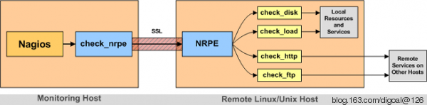
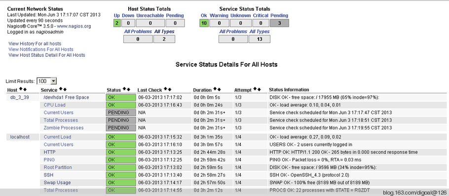

## PostgreSQL monitor - nagios client installation  
           
### 作者           
digoal            
              
### 日期            
2013-06-03                                      
            
### 标签                                                                                                                            
PostgreSQL , 监控 , nagios          
          
----            
          
## 背景      
本文将介绍nagios客户端的安装, 这个需要安装在被监控的主机上.   
  
以及如何配置监控.  
  
## 一, 客户端配置  
1\. 安装nagios-plugins  
  
下载最新稳定版  
  
```  
wget http://prdownloads.sourceforge.net/sourceforge/nagiosplug/nagios-plugins-1.4.16.tar.gz  
[root@db-172-16-3-39 soft_bak]# tar -zxvf nagios-plugins-1.4.16.tar.gz  
[root@db-172-16-3-39 soft_bak]# cd nagios-plugins-1.4.16  
```  
  
添加执行监控脚本的用户, 可以忽略. 因为你可能会用postgres用户进行监控.  
  
```  
[root@db-172-16-3-39 nagios-plugins-1.4.16]# useradd nagios  
```  
  
编译安装  
  
```  
[root@db-172-16-3-39 nagios-plugins-1.4.16]# ./configure --with-nagios-user=nagios --with-nagios-group=nagios --prefix=/opt/nagios  
[root@db-172-16-3-39 nagios-plugins-1.4.16]# make  
[root@db-172-16-3-39 nagios-plugins-1.4.16]# make install  
[root@db-172-16-3-39 nagios-plugins-1.4.16]# chown nagios:nagios /opt/nagios  
[root@db-172-16-3-39 nagios-plugins-1.4.16]# chown -R nagios:nagios /opt/nagios/libexec  
```  
  
2\. 安装xinetd服务  
  
```  
[root@db-172-16-3-39 nagios-plugins-1.4.16]# yum install -y xinetd  
```  
  
3\. 安装NRPE - Nagios Remote Plugin Executor  
  
NRPE是一个远程的插件, nagios server通过check_nrpe来调用远端的这个插件监控远端服务.   
  
其实nagios server通过check_by_ssh也可以来监控远端服务, 只是使用check_by_ssh的CPU开销比较大, 当被监控的服务很多的时候, 就不适用了. 所以推荐使用check_nrpe.  
  
  
   
NRPE下载地址  
  
```  
http://downloads.sourceforge.net/project/nagios/nrpe-2.x/nrpe-2.14/nrpe-2.14.tar.gz?r=&ts=1363788540&use_mirror=hivelocity  
```  
  
解压  
  
```  
[root@db-172-16-3-39 soft_bak]# tar -zxvf nrpe-2.14.tar.gz  
[root@db-172-16-3-39 soft_bak]# cd nrpe-2.14  
[root@db-172-16-3-39 nrpe-2.14]# ./configure --prefix=/opt/nagios  
[root@db-172-16-3-39 nrpe-2.14]# make all  
[root@db-172-16-3-39 nrpe-2.14]# make install-plugin  
[root@db-172-16-3-39 nrpe-2.14]# make install-daemon  
[root@db-172-16-3-39 nrpe-2.14]# make install-daemon-config  
[root@db-172-16-3-39 nrpe-2.14]# make install-xinetd  
```  
  
编辑xinetd nrpe配置文件.  
  
修改only_from, 允许本地Ip和nagios server ip连接. 新增log_type配置, 不写日志.  
  
```  
[root@db-172-16-3-39 nrpe-2.14]# vi /etc/xinetd.d/nrpe  
# default: on  
# description: NRPE (Nagios Remote Plugin Executor)  
service nrpe  
{  
        flags           = REUSE  
        socket_type     = stream  
        port            = 5666  
        wait            = no  
        user            = nagios  
        group           = nagios  
        server          = /opt/nagios/bin/nrpe  
        server_args     = -c /opt/nagios/etc/nrpe.cfg --inetd  
        log_on_failure  += USERID  
        disable         = no  
        only_from       = 127.0.0.1 172.16.3.33  
        log_type        = FILE /dev/null  
}  
```  
  
修改/etc/services  
  
```  
[root@db-172-16-3-39 nrpe-2.14]# vi /etc/services  
  
nrpe 5666/tcp # NRPE, 添加到文件末尾  
```  
  
每次修改/etc/xinetd.d/nrpe或/opt/nagios/etc/nrpe.cfg后需要重启xinetd 服务.  
  
```  
[root@db-172-16-3-39 nrpe-2.14]# service xinetd restart  
Stopping xinetd: [FAILED]  
Starting xinetd: [  OK  ]  
```  
  
查看nrpe是否正常启动  
  
```  
[root@db-172-16-3-39 nrpe-2.14]# netstat -anpo|grep xinetd  
tcp        0      0 0.0.0.0:5666                0.0.0.0:*                   LISTEN      933/xinetd          off (0.00/0/0)  
unix  2      [ ]         DGRAM                    7922940 933/xinetd  
[root@db-172-16-3-39 nrpe-2.14]# netstat -at|grep nrpe  
tcp        0      0 *:nrpe                      *:*                         LISTEN   
```  
  
使用check_nrpe命令检查nrpe后台进程是否启动.  
  
```  
[root@db-172-16-3-39 nrpe-2.14]# /opt/nagios/libexec/check_nrpe -H localhost  
NRPE v2.14  
```  
  
以上返回表示正常.  
  
使用check_nrpe 通过tcp调用远端 /opt/nagios/etc/nrpe.cfg 中配置的command.  
  
```  
[root@db-172-16-3-39 nrpe-2.14]# /opt/nagios/libexec/check_nrpe -H localhost -c check_load  
OK - load average: 0.00, 0.02, 0.00|load1=0.000;15.000;30.000;0; load5=0.020;10.000;25.000;0; load15=0.000;5.000;20.000;0;  
```  
  
nagios server也是通过调用check_nrpe来检测远端服务, 所以在nagios server端需要安装check_nrpe插件.  
  
## 二, nagios 服务端配置  
1\. 安装check_nrpe插件, 注意prefix与客户端不一样. 还有只需要安装插件即可.  
  
```  
[root@db-172-16-3-33 soft_bak]# tar -zxvf nrpe-2.14.tar.gz  
[root@db-172-16-3-33 soft_bak]# cd nrpe-2.14  
[root@db-172-16-3-33 nrpe-2.14]# ./configure --prefix=/opt/nagios-3.5.0  
[root@db-172-16-3-33 nrpe-2.14]# make all  
[root@db-172-16-3-33 nrpe-2.14]# make install-plugin  
```  
  
2\. 配置主配置文件 /opt/nagios-3.5.0/etc/nagios.cfg  
  
```  
# You can specify individual object config files as shown below:  
cfg_file=/opt/nagios-3.5.0/etc/objects/commands.cfg  
cfg_file=/opt/nagios-3.5.0/etc/objects/contacts.cfg  
cfg_file=/opt/nagios-3.5.0/etc/objects/timeperiods.cfg  
cfg_file=/opt/nagios-3.5.0/etc/objects/templates.cfg  
# Definitions for monitoring the local (Linux) host  
cfg_file=/opt/nagios-3.5.0/etc/objects/localhost.cfg  
```  
  
nagios启动时会解析并加载这些配置文件.  
  
编辑  /opt/nagios-3.5.0/etc/objects/commands.cfg  
  
将check_nrpe添加进去.  
  
```  
[root@db-172-16-3-33 db_servers]# vi /opt/nagios-3.5.0/etc/objects/commands.cfg  
# add by digoal  
define command{  
  command_name check_nrpe  
  command_line $USER1$/check_nrpe -H $HOSTADDRESS$ -c $ARG1$  
}  
```  
  
上面的$USER1$定义在环境变量文件 :   
  
```  
/opt/nagios-3.5.0/etc/resource.cfg  
# Sets $USER1$ to be the path to the plugins  
$USER1$=/opt/nagios-3.5.0/libexec  
  
# Sets $USER2$ to be the path to event handlers  
#$USER2$=/opt/nagios-3.5.0/libexec/eventhandlers  
  
# Store some usernames and passwords (hidden from the CGIs)  
#$USER3$=someuser  
#$USER4$=somepassword  
```  
  
(可选)定义一个linux主机模板, 名为linux-box, 原始的模板也在templates.cfg这个文件中, 后面也会用到原始模板 :   
  
```  
[root@db-172-16-3-33 db_servers]# vi /opt/nagios-3.5.0/etc/objects/templates.cfg  
# add by digoal  
# host template linux-box  
define host{  
  name linux-box           ; Name of this template  
  use generic-host         ; Inherit default values  
  check_period 24x7  
  check_interval 5  
  retry_interval 1  
  max_check_attempts 10  
  check_command check-host-alive  
  notification_period 24x7  
  notification_interval 30  
  notification_options d,r  
  contact_groups admins  
  register 0               ; DONT REGISTER THIS - ITS A TEMPLATE  
}  
```  
  
当然我们也可以定制配置文件目录, 目录中以cfg结尾的文件, 在nagios启动时都会解析和加载.  
  
修改主配置文件, 在OBJECT CONFIGURATION FILE配置组中新增如下行 :   
  
```  
cfg_dir=/opt/nagios-3.5.0/etc/db_servers  
```  
  
新建目录, 修改权限  
  
```  
[root@db-172-16-3-33 etc]# mkdir -p /opt/nagios-3.5.0/etc/db_servers  
[root@db-172-16-3-33 etc]# chown nagios:nagios db_servers  
```  
  
在该目录中新建配置文件 :   
  
配置主机 :   
  
```  
[root@db-172-16-3-33 etc]# cd /opt/nagios-3.5.0/etc/db_servers/  
[root@db-172-16-3-33 db_servers]# vi hosts.cfg  
define host{  
  use linux-box ; Inherit default values from a template  
  host_name db_3_39 ; The name we're giving to this server  
  alias postgresql_3_39 ; A longer name for the server  
  address 172.16.3.39 ; IP address of the server  
}  
[root@db-172-16-3-33 db_servers]# chown nagios:nagios hosts.cfg  
```  
  
配置主机对应的服务 :   
  
```  
[root@db-172-16-3-33 db_servers]# cd /opt/nagios-3.5.0/etc/db_servers/  
[root@db-172-16-3-33 db_servers]# vi services.cfg  
define service{  
  use generic-service  
  host_name db_3_39   ; this is host.host_name  
  service_description Current Users  
  check_command check_nrpe!check_users  ;check_users对应客户端/opt/nagios/etc/nrpe.cfg中定义的command, 后面亦如此.  
}  
define service{  
  use generic-service  
  host_name db_3_39  
  service_description CPU Load  
  check_command check_nrpe!check_load  
}  
define service{  
  use generic-service  
  host_name db_3_39  
  service_description /dev/hda1 Free Space  
  check_command check_nrpe!check_hda1  
}  
define service{  
  use generic-service  
  host_name db_3_39  
  service_description Total Processes  
  check_command check_nrpe!check_total_procs  
}  
define service{  
  use generic-service  
  host_name db_3_39  
  service_description Zombie Processes  
  check_command check_nrpe!check_zombie_procs  
}  
```  
  
修改配置文件权限  
  
```  
[root@db-172-16-3-33 db_servers]# chown nagios:nagios *.cfg   
```  
  
检测配置文件是否合法  
  
```  
[root@db-172-16-3-33 db_servers]# /opt/nagios-3.5.0/bin/nagios -v /opt/nagios-3.5.0/etc/nagios.cfg  
```  
  
如果配置文件没有错误的话, 重启nagios  
  
```  
[root@db-172-16-3-33 db_servers]# service nagios restart  
Running configuration check...done.  
Stopping nagios: done.  
Starting nagios: done.  
```  
  
nagios显示截图如下 :   
  
   
  
PENDING是指还未执行check, 所以状态未知.  
  
## 三, 客户端对应的nrpe.cfg配置  
  
```  
[root@db-172-16-3-39 nrpe-2.14]# vi /opt/nagios/etc/nrpe.cfg  
command[check_users]=/opt/nagios/libexec/check_users -w 5 -c 10  
command[check_load]=/opt/nagios/libexec/check_load -w 15,10,5 -c 30,25,20  
command[check_hda1]=/opt/nagios/libexec/check_disk -w 20% -c 10% -p /  
command[check_zombie_procs]=/opt/nagios/libexec/check_procs -w 5 -c 10 -s Z  
command[check_total_procs]=/opt/nagios/libexec/check_procs -w 150 -c 200  
```  
  
自定义监控也是配置这些东西. 配置完后需要重启xinetd服务.  
  
```  
[root@db-172-16-3-39 nrpe-2.14]# service xinetd restart  
Stopping xinetd: [  OK  ]  
Starting xinetd: [  OK  ]  
```  
  
## 参考  
1\. http://blog.163.com/digoal@126/blog/static/16387704020135313354383/  
  
2\. http://downloads.sourceforge.net/project/nagios/nrpe-2.x/nrpe-2.14/nrpe-2.14.tar.gz?r=&ts=1363788540&use_mirror=hivelocity  
  
3\. nrpe-2.14/docs/NRPE.pdf  
                                                                
                                                                        
                              
  
<a rel="nofollow" href="http://info.flagcounter.com/h9V1"  ></a>  
  
  
  
  
  
  
## [digoal's 大量PostgreSQL文章入口](https://github.com/digoal/blog/blob/master/README.md "22709685feb7cab07d30f30387f0a9ae")
  
