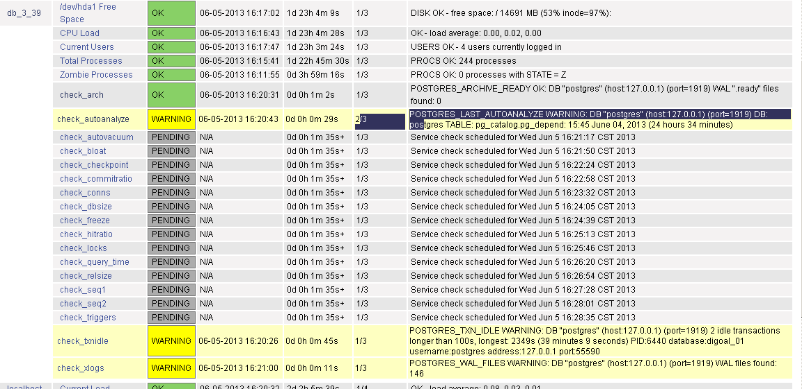

## PostgreSQL monitor - check_postgres usage - 2  
               
### 作者               
digoal                
                  
### 日期                
2013-06-05                                          
                
### 标签                                                                                                                                
PostgreSQL , 监控 , nagios , check_postgres              
              
----                
              
## 背景          
本例要介绍一下结合nagios使用check_postgres监控数据库的配置.  
  
7\. 配置被监控机  
  
7\.1 修改本地执行监控命令的用户和组, 因为在监控中会涉及数据库表空间文件系统等监控, 而这些目录可能是700权限的. 所以尽量使用postgres的启动用户. 如下 :   
  
```  
[root@db-172-16-3-39 ~]# vi /etc/xinetd.d/nrpe  
        user            = pg92  
        group           = pg92  
```  
  
7\.2 修改监控项配置, 新增监控项  
  
```  
[root@db-172-16-3-39 ~]# vi /opt/nagios/etc/nrpe.cfg  
command[check_arch]=opt/check_postgres-2.20.0/check_postgres.pl --output=nagios -H 127.0.0.1 -p 1919 -db postgres -u postgres --action=archive_ready -w 10 -c 20  
command[check_freeze]=/opt/check_postgres-2.20.0/check_postgres.pl --output=nagios -H 127.0.0.1 -p 1919 -db postgres -u postgres --action=autovac_freeze -w 90% -c 95% --exclude=template1,template0  
command[check_conns]=/opt/check_postgres-2.20.0/check_postgres.pl --output=nagios -H 127.0.0.1 -p 1919 -db postgres -u postgres --action=backends -w=120 -c=150  
command[check_bloat]=/opt/check_postgres-2.20.0/check_postgres.pl --output=nagios -H 127.0.0.1 -p 1919 -db postgres,digoal_01 -u postgres --action=bloat -w="30% or 100M" -c="40% or 200M" --perflimit=5  
command[check_checkpoint]=/opt/check_postgres-2.20.0/check_postgres.pl --output=nagios --datadir=/pgdata1919 --action=checkpoint -w 300s -c 600s  
command[check_commitratio]=/opt/check_postgres-2.20.0/check_postgres.pl --output=nagios -H 127.0.0.1 -p 1919 -db postgres -u postgres --action=commitratio -w 90% -c 80%  
command[check_dbsize]=/opt/check_postgres-2.20.0/check_postgres.pl --output=nagios -H 127.0.0.1 -p 1919 -db postgres -u postgres --action=database_size -w 1T -c 2T  
command[check_triggers]=/opt/check_postgres-2.20.0/check_postgres.pl --output=nagios -H 127.0.0.1 -p 1919 -db postgres,digoal_01 -u postgres --action=disabled_triggers -w 1 -c 2  
command[check_hitratio]=/opt/check_postgres-2.20.0/check_postgres.pl --output=nagios -H 127.0.0.1 -p 1919 -db postgres,digoal_01 -u postgres --action=hitratio -w 90% -c 80%  
command[check_relsize]=/opt/check_postgres-2.20.0/check_postgres.pl --output=nagios -H 127.0.0.1 -p 1919 -db postgres,digoal_01 -u postgres --action=relation_size -w 10G -c 20G --perflimit=5  
command[check_autovacuum]=/opt/check_postgres-2.20.0/check_postgres.pl --output=nagios -H 127.0.0.1 -p 1919 -u postgres --db postgres,digoal_01 --action=last_autovacuum --perflimit=3 -w '1 h'  
command[check_autoanalyze]=/opt/check_postgres-2.20.0/check_postgres.pl --output=nagios -H 127.0.0.1 -p 1919 -u postgres --db postgres,digoal_01 --action=last_autoanalyze --perflimit=3 -w '1 h'  
command[check_locks]=/opt/check_postgres-2.20.0/check_postgres.pl --output=nagios -H 127.0.0.1 -p 1919 -u postgres --db postgres --action=locks -w 100 -c total=250:waiting=5:exclusive=20  
command[check_query_time]=/opt/check_postgres-2.20.0/check_postgres.pl --output=nagios -H 127.0.0.1 -p 1919 -u postgres --db postgres --action=query_time -w '10s'  
command[check_seq1]=/opt/check_postgres-2.20.0/check_postgres.pl --output=nagios -H 127.0.0.1 -p 1919 -u postgres --db digoal_01 --action=sequence -w 90%  
command[check_seq2]=/opt/check_postgres-2.20.0/check_postgres.pl --output=nagios -H 127.0.0.1 -p 1919 -u postgres --db postgres --action=sequence -w 90%  
command[check_txnidle]=/opt/check_postgres-2.20.0/check_postgres.pl --output=nagios -H 127.0.0.1 -p 1919 -u postgres --db postgres --action=txn_idle -w "1 for 100s" -c "3 for 100s"  
command[check_xlogs]=/opt/check_postgres-2.20.0/check_postgres.pl --output=nagios -H 127.0.0.1 -p 1919 -u postgres --db postgres --action=wal_files -w 100  
```  
  
7\.3 重启xinetd  
  
```  
[root@db-172-16-3-39 ~]# service xinetd restart  
```  
  
8\. 配置nagios服务端,   
  
配置服务之前, 可以先使用nrpe远程调用以下远端的命令, 看看是否正常, 正常后再配置服务.  
  
```  
[root@db-172-16-3-33 db_servers]# /opt/nagios-3.5.0/libexec/check_nrpe -H 172.16.3.39 -c check_arch  
ERROR: Could not find a suitable psql executable  
```  
  
这里报错, 找不到psql命令.  
  
所以需要在被监控机上指定psql的路径. 首先要修改check_postgres.pl脚本, 允许使用环境变量.  
  
```  
[root@db-172-16-3-39 ~]# vi /opt/check_postgres-2.20.0/check_postgres.pl  
## If this is true, $opt{PSQL} and $opt{PGBINDIR} are disabled for security reasons  
our $NO_PSQL_OPTION = 0;  
```  
  
然后修改nrpe.cfg, 指定环境变量. --PGBINDIR=/opt/pgsql92/bin  
  
```  
[root@db-172-16-3-39 ~]# vi /opt/nagios/etc/nrpe.cfg  
command[check_arch]=opt/check_postgres-2.20.0/check_postgres.pl --PGBINDIR=/opt/pgsql92/bin --output=nagios -H 127.0.0.1 -p 1919 -db postgres -u postgres --action=archive_ready -w 10 -c 20  
```  
  
其他命令略, 请自行修改.  
  
修改好后重启xinetd服务  
  
再次通过nrpe调用, OK  
  
```  
[root@db-172-16-3-33 db_servers]# /opt/nagios-3.5.0/libexec/check_nrpe -H 172.16.3.39 -c check_arch  
POSTGRES_ARCHIVE_READY OK: DB "postgres" (host:127.0.0.1) (port=1919) WAL ".ready" files found: 0 | time=0.01s files=0;10;20  
```  
  
本例参考前面讲解nagios配置的环境, 所以以下文件以及配置好了, 只需要添加监控服务即可.  
  
```  
[root@db-172-16-3-33 db_servers]# cd /opt/nagios-3.5.0/etc/db_servers  
[root@db-172-16-3-33 db_servers]# less hosts.cfg   
define host{  
  use linux-box ; Inherit default values from a template  
  host_name db_3_39 ; The name we're giving to this server  
  alias postgresql_3_39 ; A longer name for the server  
  address 172.16.3.39 ; IP address of the server  
}  
```  
  
增加监控服务 :   
  
同一主机的service_description不能重复.  
  
```  
[root@db-172-16-3-33 db_servers]# vi services.cfg  
define service{  
  use generic-service  
  host_name db_3_39  
  service_description check_arch  
  check_command check_nrpe!check_arch  
}  
define service{  
  use generic-service  
  host_name db_3_39  
  service_description check_freeze  
  check_command check_nrpe!check_freeze  
}  
define service{  
  use generic-service  
  host_name db_3_39  
  service_description check_conns  
  check_command check_nrpe!check_conns  
}  
define service{  
  use generic-service  
  host_name db_3_39  
  service_description check_bloat  
  check_command check_nrpe!check_bloat  
}  
define service{  
  use generic-service  
  host_name db_3_39  
  service_description check_checkpoint  
  check_command check_nrpe!check_checkpoint  
}  
define service{  
  use generic-service  
  host_name db_3_39  
  service_description check_commitratio  
  check_command check_nrpe!check_commitratio  
}  
define service{  
  use generic-service  
  host_name db_3_39  
  service_description check_dbsize  
  check_command check_nrpe!check_dbsize  
}  
define service{  
  use generic-service  
  host_name db_3_39  
  service_description check_triggers  
  check_command check_nrpe!check_triggers  
}  
define service{  
  use generic-service  
  host_name db_3_39  
  service_description check_hitratio  
  check_command check_nrpe!check_hitratio  
}  
define service{  
  use generic-service  
  host_name db_3_39  
  service_description check_relsize  
  check_command check_nrpe!check_relsize  
}  
define service{  
  use generic-service  
  host_name db_3_39  
  service_description check_autovacuum  
  check_command check_nrpe!check_autovacuum  
}  
define service{  
  use generic-service  
  host_name db_3_39  
  service_description check_autoanalyze  
  check_command check_nrpe!check_autoanalyze  
}  
define service{  
  use generic-service  
  host_name db_3_39  
  service_description check_locks  
  check_command check_nrpe!check_locks  
}  
define service{  
  use generic-service  
  host_name db_3_39  
  service_description check_query_time  
  check_command check_nrpe!check_query_time  
}  
define service{  
  use generic-service  
  host_name db_3_39  
  service_description check_seq1  
  check_command check_nrpe!check_seq1  
}  
define service{  
  use generic-service  
  host_name db_3_39  
  service_description check_seq2  
  check_command check_nrpe!check_seq2  
}  
define service{  
  use generic-service  
  host_name db_3_39  
  service_description check_txnidle  
  check_command check_nrpe!check_txnidle  
}  
define service{  
  use generic-service  
  host_name db_3_39  
  service_description check_xlogs  
  check_command check_nrpe!check_xlogs  
}  
```  
  
检查配置文件正确性, 确保无错误.  
  
```  
[root@db-172-16-3-33 db_servers]# /opt/nagios-3.5.0/bin/nagios -v /opt/nagios-3.5.0/etc/nagios.cfg   
```  
  
重启nagios  
  
```  
[root@db-172-16-3-33 db_servers]# service nagios restart  
Running configuration check...done.  
Stopping nagios: done.  
Starting nagios: done.  
```  
  
9\. nagios web界面截图  
  
  
   
  
## 其他  
1\. check_postgres的过滤选项  
  
```  
--exclude  
--include  
```  
  
先排除后包含. 所以如果同一个值在包含和排除中都存在, 那么最后还是包含的.  
  
2\. LANG变量设置.  
  
最好设置成en_US.UTF8  
  
3\. export LC_TIME=C , 需要与数据库一致.  
  
```  
pg92@db-172-16-3-39-> psql -h 127.0.0.1 -U postgres  
psql (9.2beta1)  
Type "help" for help.  
  
postgres=# \l  
                             List of databases  
   Name    |   Owner   | Encoding | Collate | Ctype |   Access privileges     
-----------+-----------+----------+---------+-------+-----------------------  
 digoal    | postgres  | UTF8     | C       | C     |   
 digoal_01 | digoal_01 | UTF8     | C       | C     |   
 digoal_02 | digoal_02 | UTF8     | C       | C     |   
 postgres  | postgres  | UTF8     | C       | C     |   
 template0 | postgres  | UTF8     | C       | C     | =c/postgres          +  
           |           |          |         |       | postgres=CTc/postgres  
 template1 | postgres  | UTF8     | C       | C     | =c/postgres          +  
           |           |          |         |       | postgres=CTc/postgres  
(6 rows)  
```  
  
一致的情况下, 时间比对正常.  
  
```  
pg92@db-172-16-3-39-> /opt/check_postgres-2.20.0/check_postgres.pl --output=nagios --datadir=$PGDATA --action=checkpoint -w 10s -c 200000s  
POSTGRES_CHECKPOINT WARNING:  Last checkpoint was 1265 seconds ago | age=1265;10;200000  
```  
  
如果环境变量与数据库不一致, check point会有问题.  
  
```  
pg92@db-172-16-3-39-> export LC_TIME=en_US.UTF8  
pg92@db-172-16-3-39-> /opt/check_postgres-2.20.0/check_postgres.pl --output=nagios --datadir=$PGDATA --action=checkpoint -w 10s -c 200000s  
POSTGRES_CHECKPOINT OK:  Last checkpoint was -49101 seconds ago | age=-49101;10;200000   
```  
  
4\. 修改LC_TIME后在本地调用正常, 但是在nagios服务端使用check_nrpe调用还是异常.  
  
```  
[root@db-172-16-3-33 db_servers]# /opt/nagios-3.5.0/libexec/check_nrpe -H 172.16.3.39 -c check_checkpoint  
POSTGRES_CHECKPOINT OK:  Last checkpoint was -38070 seconds ago | age=-38070;300;600   
```  
  
即使将LC_TIME=C写在nrpe.cfg中也不能正常使用.   
  
```  
command[check_checkpoint]=LC_TIME=C /opt/check_postgres-2.20.0/check_postgres.pl --PGBINDIR=/opt/pgsql92/bin --output=nagios --datadir=/pgdata1919 --action=checkpoint -w 300s -c 600s  
  
[root@db-172-16-3-39 check_postgres-2.20.0]# service xinetd restart  
Stopping xinetd: [  OK  ]  
Starting xinetd: [  OK  ]  
[root@db-172-16-3-33 db_servers]# /opt/nagios-3.5.0/libexec/check_nrpe -H 172.16.3.39 -c check_checkpoint  
POSTGRES_CHECKPOINT OK:  Last checkpoint was -37864 seconds ago | age=-37864;300;600   
```  
  
## 参考  
1\. http://bucardo.org/check_postgres/check_postgres.pl.html  
  
2\. http://blog.163.com/digoal@126/blog/static/16387704020135313354383/  
  
3\. http://blog.163.com/digoal@126/blog/static/16387704020135334157531/  
  
4\. http://blog.163.com/digoal@126/blog/static/1638770402013531131023/  
  
5\. http://search.cpan.org/  
  
6\. http://www.postgresql.org/docs/9.3/static/runtime-config-autovacuum.html  
  
7\. http://blog.163.com/digoal@126/blog/static/1638770402013548284410/  
                                                                    
                                                                            
                                  
  
<a rel="nofollow" href="http://info.flagcounter.com/h9V1"  ></a>  
  
  
  
  
  
  
## [digoal's 大量PostgreSQL文章入口](https://github.com/digoal/blog/blob/master/README.md "22709685feb7cab07d30f30387f0a9ae")
  
