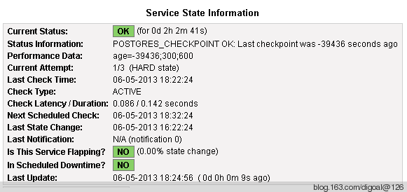

## PostgreSQL monitor - customize nagios script  
                 
### 作者                 
digoal                  
                    
### 日期                  
2013-06-05                                            
                  
### 标签                                                                                                                                  
PostgreSQL , 监控 , nagios , check_postgres , customize nagios script               
                
----                  
                
## 背景            
前一个章节介绍了使用bucardo提供的check_postgres脚本和nagios来监控数据库.   
  
本文主要介绍如何编写自定义监控脚本.  
  
在编写自定义脚本前首先要搞清楚nagios的判断标准.  
  
1\. 脚本的返回值  
  
nagios根据脚本返回值来输出该监控服务的状态. 返回值和状态对应关系如下.  
  
```  
0 : (OK)  
1 : (WARNING)  
2 : (CRITICAL)  
other : (UNKNOWN)  
```  
  
2\. 脚本的标准输出  
  
```  
pg92@db-172-16-3-39-> /opt/check_postgres-2.20.0/check_postgres.pl --PGBINDIR=/opt/pgsql92/bin --output=nagios --datadir=/pgdata1919 --action=checkpoint -w 300s -c 600s  
POSTGRES_CHECKPOINT CRITICAL:  Last checkpoint was 11418 seconds ago | age=11418;300;600   
```  
  
以上监控命令的标准输出为  
  
```  
POSTGRES_CHECKPOINT CRITICAL:  Last checkpoint was 11418 seconds ago | age=11418;300;600  
```  
  
注意|这个字符, 这个字符分隔了两部分信息 :  
  
```  
Status Information  
Performance Data  
```  
  
如图 :   
  
  
   
3\. 被监控机上的脚本是在nagios服务端通过check_nrpe远程调用的方式执行的.  
  
被监控端的nrpe程序以什么用户组执行在如下配置中 :   
  
```  
[root@db-172-16-3-39 check_postgres-2.20.0]# cat /etc/xinetd.d/nrpe |grep -E "group|user"  
        user            = pg92  
        group           = pg92  
```  
  
因此监控脚本需要有以上用户组的可执行权限.  
  
编写自定义脚本时需要遵循前面提到的3点.  
  
使用nagios监控常用PostgreSQL监控项举例 :   
  
http://blog.163.com/digoal@126/blog/static/163877040201412763135184/  
  
## 参考  
1\. http://blog.163.com/digoal@126/blog/static/1638770402013121102459107/  
  
2\. http://blog.163.com/digoal@126/blog/static/163877040201312241028667/  
  
3\. http://blog.163.com/digoal@126/blog/static/163877040201302714527/  
  
4\. http://blog.163.com/digoal@126/blog/static/16387704020130433036377/  
  
5\. http://blog.163.com/digoal@126/blog/static/163877040201292245228613/  
  
6\. http://blog.163.com/digoal@126/blog/static/163877040201141134748660/  
  
7\. http://blog.163.com/digoal@126/blog/static/16387704020116111445381/  
  
8\. http://blog.163.com/digoal@126/blog/static/16387704020130525628988/  
                                                                      
                                                                              
                                    
  
  
  
  
  
  
  
  
  
  
  
  
  
  
  
  
  
  
  
  
  
  
  
  
  
  
  
  
  
  
  
  
  
  
  
  
  
  
  
  
  
  
  
  
  
  
  
  
  
  
  
  
  
  
  
  
  
  
  
  
  
  
  
  
  
  
  
  
  
  
  
  
  
#### [PostgreSQL 许愿链接](https://github.com/digoal/blog/issues/76 "269ac3d1c492e938c0191101c7238216")
您的愿望将传达给PG kernel hacker、数据库厂商等, 帮助提高数据库产品质量和功能, 说不定下一个PG版本就有您提出的功能点. 针对非常好的提议，奖励限量版PG文化衫、纪念品、贴纸、PG热门书籍等，奖品丰富，快来许愿。[开不开森](https://github.com/digoal/blog/issues/76 "269ac3d1c492e938c0191101c7238216").  
  
  
#### [9.9元购买3个月阿里云RDS PostgreSQL实例](https://www.aliyun.com/database/postgresqlactivity "57258f76c37864c6e6d23383d05714ea")
  
  
#### [PostgreSQL 解决方案集合](https://yq.aliyun.com/topic/118 "40cff096e9ed7122c512b35d8561d9c8")
  
  
#### [德哥 / digoal's github - 公益是一辈子的事.](https://github.com/digoal/blog/blob/master/README.md "22709685feb7cab07d30f30387f0a9ae")
  
  

  
  
#### [PolarDB 学习图谱: 训练营、培训认证、在线互动实验、解决方案、生态合作、写心得拿奖品](https://www.aliyun.com/database/openpolardb/activity "8642f60e04ed0c814bf9cb9677976bd4")
  
  
#### [购买PolarDB云服务折扣活动进行中, 55元起](https://www.aliyun.com/activity/new/polardb-yunparter?userCode=bsb3t4al "e0495c413bedacabb75ff1e880be465a")
  
  
#### [About 德哥](https://github.com/digoal/blog/blob/master/me/readme.md "a37735981e7704886ffd590565582dd0")
  
