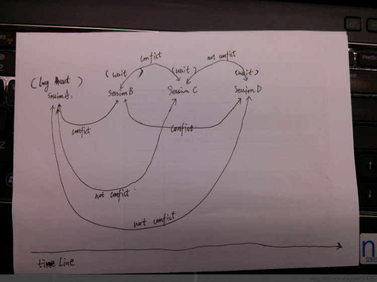

## PostgreSQL lock waiting order  
                            
### 作者                               
digoal                       
                        
### 日期                                                                                           
2013-06-20                     
                           
### 标签                        
PostgreSQL , 锁等待顺序  
                                                                                              
----                                                                                        
                                                                                                 
## 背景                    
本文介绍一下PostgreSQL数据库中多个会话的锁等待场景.  
  
通过这个场景的介绍, 让大家了解一下PostgreSQL 9.3 引入的lock_timeout潜在用意之一.  
  
场景介绍 :   
  
   
  
最下面是一个时间线,  
  
SESSION A是一个长事务, 并且它持有的锁与接下来的SESSION B有冲突.  
  
当SESSION B开启后, SESSION B处于锁等待状态.  
  
接下来发起的会话C和会话D, 如果C和D与B有锁冲突(这里PG假设B获得了锁), 那么即使目前B还没有获得锁, 并且C,D与会话A没有锁冲突, C,D也会处于等待状态无法进行下去.  
  
原因是PostgreSQL的另一个设计理念, 如果不断的有像C和D这样的会话发起, 那么会话B永远都获取不到锁, 那么它会一直处于等待状态.  
  
这么说, PG的锁是排队的, 先到先"得", 注意这个"得"是指不能违背的先到先得哦. 而不是完全按照已有的锁冲突来决定.  
  
因此这里肯定是B先得到锁, 所以C,D就不能在B未得到锁前得到锁了.  
  
但是这个设计理念带来的一个坏处就是, SESSION C和SESSION D会处于等待状态.  
  
测试 :   
  
SESSION A :   
  
```  
digoal=# create table lock_test(id int, info text);  
CREATE TABLE  
digoal=# insert into lock_test values(1,'test');  
INSERT 0 1  
digoal=# select pg_backend_pid();  
 pg_backend_pid   
----------------  
           1040  
(1 row)  
  
digoal=# begin;  
BEGIN  
digoal=# update lock_test set info='new' where id=1;  
UPDATE 1  
```  
  
SESSION X :   
  
查看SESSION A获得的锁 ,注意virtualxid的ExclusiveLock锁是在事务开启时就加载的, transactionid的ExclusiveLock是指该事务对数据库有更改的话需要获取的, 本例会话A有update操作, 因此会获取这个锁. 33155指lock_test的oid. RowExclusiveLock表锁.   
  
锁冲突参考 :   
  
http://www.postgresql.org/docs/9.3/static/explicit-locking.html  
  
```  
digoal=# select * from pg_locks where pid=1040;  
   locktype    | database | relation | page | tuple | virtualxid | transactionid | classid | objid | objsubid | virtualtransaction |  
 pid  |       mode       | granted | fastpath   
---------------+----------+----------+------+-------+------------+---------------+---------+-------+----------+--------------------+  
------+------------------+---------+----------  
 relation      |    16385 |    33155 |      |       |            |               |         |       |          | 3/460349           |  
 1040 | RowExclusiveLock | t       | t  
 virtualxid    |          |          |      |       | 3/460349   |               |         |       |          | 3/460349           |  
 1040 | ExclusiveLock    | t       | t  
 transactionid |          |          |      |       |            |       3252961 |         |       |          | 3/460349           |  
 1040 | ExclusiveLock    | t       | f  
(3 rows)  
```  
  
SESSION Y :   
  
```  
digoal=# select pg_backend_pid();  
 pg_backend_pid   
----------------  
           3682  
(1 row)  
digoal=# begin;  
BEGIN  
digoal=# select * from lock_test ;  
 id | info   
----+------  
  1 | test  
(1 row)  
```  
  
SESSION X :   
  
会话Y没有数据库更改的操作, 因此只有两个锁如下, virtualxid的ExlcusiveLock和33155的AccessShareLock. 这个锁和RowExclusiveLock不冲突, 所以可以granted.  
  
```  
digoal=#  select * from pg_locks where pid=3682;  
  locktype  | database | relation | page | tuple | virtualxid | transactionid | classid | objid | objsubid | virtualtransaction | pi  
d  |      mode       | granted | fastpath   
------------+----------+----------+------+-------+------------+---------------+---------+-------+----------+--------------------+---  
---+-----------------+---------+----------  
 relation   |    16385 |    33155 |      |       |            |               |         |       |          | 4/106613           | 36  
82 | AccessShareLock | t       | t  
 virtualxid |          |          |      |       | 4/106613   |               |         |       |          | 4/106613           | 36  
82 | ExclusiveLock   | t       | t  
(2 rows)  
```  
  
SESSION B :   
  
```  
digoal=# select pg_backend_pid();  
 pg_backend_pid   
----------------  
           4041  
(1 row)  
digoal=# begin;  
BEGIN  
digoal=# truncate lock_test;  
```  
  
SESSION X :   
  
会话B是truncate操作, 因此除了virtualxid和transactionid的ExclusiveLock, 还需要获取33155的AccessExclusiveLock.  
  
这个和SESSION A, Y冲突, 所以处于等待状态.  
  
```  
digoal=#  select * from pg_locks where pid=4041;  
   locktype    | database | relation | page | tuple | virtualxid | transactionid | classid | objid | objsubid | virtualtransaction |  
 pid  |        mode         | granted | fastpath   
---------------+----------+----------+------+-------+------------+---------------+---------+-------+----------+--------------------+  
------+---------------------+---------+----------  
 relation      |    16385 |     2663 |      |       |            |               |         |       |          | 5/5153             |  
 4041 | AccessShareLock     | t       | t  
 relation      |    16385 |     2662 |      |       |            |               |         |       |          | 5/5153             |  
 4041 | AccessShareLock     | t       | t  
 relation      |    16385 |     2685 |      |       |            |               |         |       |          | 5/5153             |  
 4041 | AccessShareLock     | t       | t  
 relation      |    16385 |     2684 |      |       |            |               |         |       |          | 5/5153             |  
 4041 | AccessShareLock     | t       | t  
 relation      |    16385 |     2615 |      |       |            |               |         |       |          | 5/5153             |  
 4041 | AccessShareLock     | t       | t  
 relation      |    16385 |     1259 |      |       |            |               |         |       |          | 5/5153             |  
 4041 | AccessShareLock     | t       | t  
 virtualxid    |          |          |      |       | 5/5153     |               |         |       |          | 5/5153             |  
 4041 | ExclusiveLock       | t       | t  
 transactionid |          |          |      |       |            |       3252962 |         |       |          | 5/5153             |  
 4041 | ExclusiveLock       | t       | f  
 relation      |    16385 |    33155 |      |       |            |               |         |       |          | 5/5153             |  
 4041 | AccessExclusiveLock | f       | f  
(9 rows)  
```  
  
SESSION C :   
  
```  
digoal=# select pg_backend_pid();  
 pg_backend_pid   
----------------  
           4872  
(1 row)  
digoal=# begin;  
BEGIN  
digoal=# select * from lock_test;  
```  
  
SESSION X :   
  
会话C处于等待状态.AccessShareLock  无法获取, 和会话B冲突.  
  
```  
digoal=#  select * from pg_locks where pid=4872;  
  locktype  | database | relation | page | tuple | virtualxid | transactionid | classid | objid | objsubid | virtualtransaction | pi  
d  |      mode       | granted | fastpath   
------------+----------+----------+------+-------+------------+---------------+---------+-------+----------+--------------------+---  
---+-----------------+---------+----------  
 relation   |    16385 |     2663 |      |       |            |               |         |       |          | 6/1311             | 48  
72 | AccessShareLock | t       | t  
 relation   |    16385 |     2662 |      |       |            |               |         |       |          | 6/1311             | 48  
72 | AccessShareLock | t       | t  
 relation   |    16385 |     2685 |      |       |            |               |         |       |          | 6/1311             | 48  
72 | AccessShareLock | t       | t  
 relation   |    16385 |     2684 |      |       |            |               |         |       |          | 6/1311             | 48  
72 | AccessShareLock | t       | t  
 relation   |    16385 |     2615 |      |       |            |               |         |       |          | 6/1311             | 48  
72 | AccessShareLock | t       | t  
 relation   |    16385 |     1259 |      |       |            |               |         |       |          | 6/1311             | 48  
72 | AccessShareLock | t       | t  
 virtualxid |          |          |      |       | 6/1311     |               |         |       |          | 6/1311             | 48  
72 | ExclusiveLock   | t       | t  
 relation   |    16385 |    33155 |      |       |            |               |         |       |          | 6/1311             | 48  
72 | AccessShareLock | f       | f  
(8 rows)  
```  
  
## 小结  
1\. 如果在生产环境中遇到了类似的情况, 可以通过配置锁超时来缓解这种问题.  
  
```  
lock_timeout = 0  
```  
  
这个参数也可以在会话或者事务中设置. 例如本文的SESSION B在事务开启或者会话中设置lock_timeout, 然后再执行truncate, 那么在指定时间内无法获取锁后将回滚, 不会长时间影响SESSION C和SESSION D.  
  
如下 :   
  
SESSION B :  
  
设置5秒超时.  
  
```  
digoal=# begin;  
BEGIN  
digoal=# set lock_timeout=5000;  
SET  
digoal=# truncate lock_test ;  
```  
  
SESSION C :   
  
```  
digoal=# select * from lock_test;  
```  
  
SESSION B :   
  
5秒后报错.  
  
```  
ERROR:  canceling statement due to lock timeout  
```  
  
SESSION C :   
  
会话 B报错后, 会话C可以或的锁正常返回数据.  
  
```   
 id | info   
----+------  
  1 | test  
(1 row)  
```  
  
## 参考  
1\. src/backend/storage/lmgr/README  
  
2\. http://www.postgresql.org/docs/9.3/static/explicit-locking.html  
  
<a rel="nofollow" href="http://info.flagcounter.com/h9V1"  ></a>  
  
  
  
  
  
  
## [digoal's 大量PostgreSQL文章入口](https://github.com/digoal/blog/blob/master/README.md "22709685feb7cab07d30f30387f0a9ae")
  
