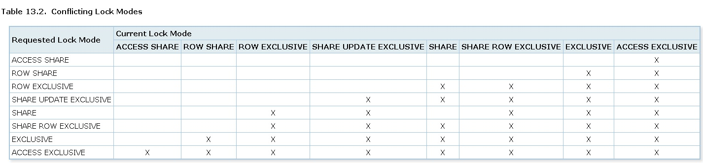
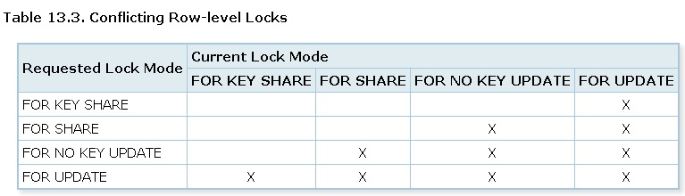
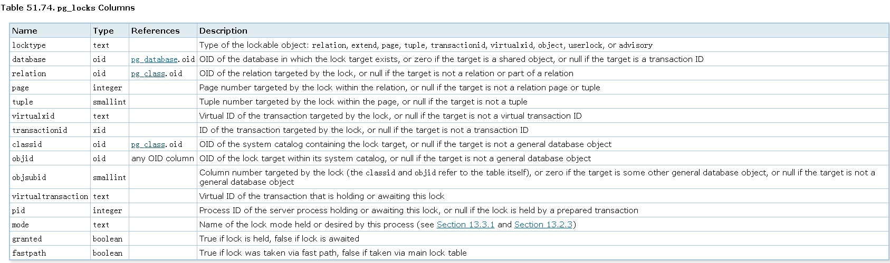

## PostgreSQL management - lock inspect (行锁监视 pgrowlocks)   
                 
### 作者                                                                 
digoal                                                                 
                                                                 
### 日期                                                                 
2013-06-24                                                              
                                                                 
### 标签                                                                 
PostgreSQL , 行锁 , pgrowlocks   
                                   
----                          
                        
## 背景     
锁在数据库中的使用频率非常高. 数据库的并发能力除了和它的并发控制机制有关, 还和数据库的锁粒度控制息息相关, 粒度越细, 冲突范围就越小, 并发能力就越强.  
  
以PostgreSQL 9.3为例, 它支持的表锁如下, X表示这两种锁会发生冲突 :   
  
https://www.postgresql.org/docs/devel/static/explicit-locking.html  
  
  
  
主外键相关行级锁  
  
  
  
  
PostgreSQL支持的行锁 :   
  
  
- exclusive row-level : select for update  
  
- shared row-level : select for share  
  
PostgreSQL支持的页锁 :   
  
- exclusive page-level : write access to table pages in the shared buffer pool.  
  
- shared page-level : write access to table pages in the shared buffer pool.  
  
另外PostgreSQL还支持advisory lock :   
  
http://blog.163.com/digoal@126/blog/static/163877040201172492217830/  
  
http://blog.163.com/digoal@126/blog/static/1638770402013518111043463/  
  
本文将介绍一下如何查看PostgreSQL数据库的锁状态.  
  
## 查看表锁, 页锁, advisory 锁  
查看表锁, 页锁, advisory 锁的视图 :   
  
pg_locks :   
  
https://www.postgresql.org/docs/devel/static/view-pg-locks.html  
  
  
  
  
关联视图 :   
  
- pg_stat_activity.pid 关联 pg_locks.pid  
  
- pg_prepared_xacts.transaction 关联pg_locks.transactionid  
  
- pg_class.oid 关联 pg_locks.relation, pg_locks.classid  
  
- pg_database.oid 关联 pg_locks.database  
  
注意PostgreSQL不会将已获得的行锁信息存储在内存中, 行锁信息存储在行的头部信息infomask中.  换句话锁, 获得行锁时需要修改t_infomask.   
  
一般在pg_locks中无法查看到行锁的信息.   
  
当然如果在pg_locks中查看到了行锁信息, 并不代表行锁信息存储在内存中. 这种情况往往出现在行锁等待时.  
  
如果需要查看行锁可以使用扩展模块pgrowlocks. 使用pgrowlocks模块查看行锁须知 :   
  
1\. 使用pgrowlocks查看行锁实际上是解析tuple的t_infomask信息, 所以表要能正常查询, 如果加了ACCESS Exclusive Lock, 那么正常的查询需要等待.  
  
2\. pgrowlocks不提供一致性数据, 例如tuple a locked, 但是在查看到lock b的时候, tuple a 可能已经unlocked了. 也就是说在查询过程中行锁随时都可以发生变化.  
  
## 举例  
### 一. 查看表锁  
  
SESSION A :   
  
```  
digoal=# begin; update lock_test set info='new' where id=1;  
BEGIN  
UPDATE 1  
```  
  
SESSION X :   
  
```  
digoal=# select * from pg_stat_activity;  
 datid | datname | pid  | usesysid | usename  | application_name | client_addr | client_hostname | client_port |         backend_sta  
rt         |          xact_start           |          query_start          |         state_change          | waiting |        state   
       |                    query                      
-------+---------+------+----------+----------+------------------+-------------+-----------------+-------------+--------------------  
-----------+-------------------------------+-------------------------------+-------------------------------+---------+--------------  
-------+---------------------------------------------  
 16385 | digoal  | 6102 |       10 | postgres | psql             |             |                 |          -1 | 2013-06-24 09:05:59  
.467026+08 | 2013-06-24 09:06:39.461293+08 | 2013-06-24 09:06:39.461425+08 | 2013-06-24 09:06:39.461689+08 | f       | idle in trans  
action | update lock_test set info='new' where id=1;  
```  
  
会话A的pid=6102, waiting=false.  
  
查看会话A的锁信息 :   
  
```  
digoal=# select * from pg_locks where pid=6102;  
   locktype    | database | relation | page | tuple | virtualxid | transactionid | classid | objid | objsubid | virtualtransaction |  
 pid  |       mode       | granted | fastpath   
---------------+----------+----------+------+-------+------------+---------------+---------+-------+----------+--------------------+  
------+------------------+---------+----------  
 relation      |    16385 |    33155 |      |       |            |               |         |       |          | 2/925855           |  
 6102 | RowExclusiveLock | t       | t  
 virtualxid    |          |          |      |       | 2/925855   |               |         |       |          | 2/925855           |  
 6102 | ExclusiveLock    | t       | t  
 transactionid |          |          |      |       |            |       3253067 |         |       |          | 2/925855           |  
 6102 | ExclusiveLock    | t       | f  
(3 rows)  
```  
  
解释, 事务开启后需要对virtualxid加ExclusiveLock锁.  
  
并且由于会话A对数据库有write操作, 所以需要加transactionid锁类型的ExclusiveLock锁.  
  
另外对数据库表lock_test有更新操作, 所以加了RowExclusiveLock的表锁. (注意是表锁, 不是行锁, 行锁在行头信息infomask中查看)  
  
SESSION B :   
  
```  
digoal=# begin;  
BEGIN  
digoal=# delete from lock_test where id=1;  
```  
  
SESSION X :   
  
```  
digoal=# select * from pg_stat_activity;  
 datid | datname | pid  | usesysid | usename  | application_name | client_addr | client_hostname | client_port |         backend_sta  
rt         |          xact_start           |          query_start          |         state_change          | waiting |        state   
       |                    query                      
-------+---------+------+----------+----------+------------------+-------------+-----------------+-------------+--------------------  
-----------+-------------------------------+-------------------------------+-------------------------------+---------+--------------  
-------+---------------------------------------------  
 16385 | digoal  | 6317 |       10 | postgres | psql             |             |                 |          -1 | 2013-06-24 09:06:10  
.860101+08 | 2013-06-24 09:06:41.471729+08 | 2013-06-24 09:06:48.446988+08 | 2013-06-24 09:06:48.446989+08 | t       | active         
       | delete from lock_test where id=1;  
```  
  
会话B对应的pid=6317, waiting=true, 说明它处于等待状态.   
  
那么它在等什么呢? 通过pg_locks来看一下 :   
  
```  
digoal=# select c.relname,l.* from pg_locks l left outer join pg_class c on l.relation=c.oid where l.pid=6317 order by l.relation;  
  relname  |   locktype    | database | relation | page | tuple | virtualxid | transactionid | classid | objid | objsubid | virtualt  
ransaction | pid  |        mode         | granted | fastpath   
-----------+---------------+----------+----------+------+-------+------------+---------------+---------+-------+----------+---------  
-----------+------+---------------------+---------+----------  
 lock_test | tuple         |    16385 |    33155 |    0 |     1 |            |               |         |       |          | 3/460438  
           | 6317 | AccessExclusiveLock | t       | f  
 lock_test | relation      |    16385 |    33155 |      |       |            |               |         |       |          | 3/460438  
           | 6317 | RowExclusiveLock    | t       | t  
           | transactionid |          |          |      |       |            |       3253069 |         |       |          | 3/460438  
           | 6317 | ExclusiveLock       | t       | f  
           | transactionid |          |          |      |       |            |       3253067 |         |       |          | 3/460438  
           | 6317 | ShareLock           | f       | f  
           | virtualxid    |          |          |      |       | 3/460438   |               |         |       |          | 3/460438  
           | 6317 | ExclusiveLock       | t       | t  
(5 rows)  
```  
  
这个输出需要详细解释一下,   
  
1\. 第一行为tuple锁类型, locktype=tuple, granted=t, 表明会话B以及获得了这个行锁, 行的物理位置为ctid=(0,1), 0号数据块的第一条记录.  
  
```  
digoal=# select ctid,* from lock_test where id=1;  
 ctid  | id | info   
-------+----+------  
 (0,1) |  1 | test  
(1 row)  
```  
  
2\. 第二行输出的为表锁, RowExclusiveLock. 锁对象为lock_test.  
  
3\. transactionid的ExclusiveLock出现在当会话有write 数据库的操作时.  
  
4\. 第四行的granted=false, 说明它在等待这个锁, 是什么锁呢?   
  
transactionid的ShareLock, transactionid=3253067 说明它在等事务号=3253067 的事务释放ExclusiveLock锁.  
  
在第二步操作时我们查看到了会话A的事务号为3253067. 所以会话B的行锁等待体现为等待会话A的transacitonid ExclusiveLock释放.  
  
5\. 最后一行是virtualxid的ExclusiveLock, 所有事务开启后都会获得这个锁.  
  
### 二. 查看advisory锁  
参考  
  
http://blog.163.com/digoal@126/blog/static/1638770402013518111043463/  
  
SESSION A :   
  
```  
digoal=# begin;  
BEGIN  
digoal=# select pg_advisory_lock(1,2);  
 pg_advisory_lock   
------------------  
   
(1 row)  
```  
  
SESSION X :   
  
```  
digoal=# select * from pg_locks where pid=6102;  
  locktype  | database | relation | page | tuple | virtualxid | transactionid | classid | objid | objsubid | virtualtransaction | pi  
d  |     mode      | granted | fastpath   
------------+----------+----------+------+-------+------------+---------------+---------+-------+----------+--------------------+---  
---+---------------+---------+----------  
 virtualxid |          |          |      |       | 2/925861   |               |         |       |          | 2/925861           | 61  
02 | ExclusiveLock | t       | t  
 advisory   |    16385 |          |      |       |            |               |       1 |     2 |        1 | 2/925861           | 61  
02 | ExclusiveLock | t       | f  
(2 rows)  
```  
  
  
advisory 锁的几个有效信息字段, classid, objid, objsubid.   
  
classid代表pg_advisory_lock($1,$2) 中的$1.  
  
objid代表pg_advisory_lock($1,$2) 中的$2.  
  
objsubid代表LOCKTAG.locktag_field4, 具体参考  
  
http://blog.163.com/digoal@126/blog/static/1638770402013518111043463/  
  
SESSION B :   
  
```  
digoal=# begin;  
BEGIN  
digoal=# select pg_advisory_lock(1,2);  
```  
  
SESSION X :   
  
```  
digoal=# select * from pg_locks where pid=6317;  
  locktype  | database | relation | page | tuple | virtualxid | transactionid | classid | objid | objsubid | virtualtransaction | pi  
d  |     mode      | granted | fastpath   
------------+----------+----------+------+-------+------------+---------------+---------+-------+----------+--------------------+---  
---+---------------+---------+----------  
 virtualxid |          |          |      |       | 3/460443   |               |         |       |          | 3/460443           | 63  
17 | ExclusiveLock | t       | t  
 advisory   |    16385 |          |      |       |            |               |       1 |     2 |        1 | 3/460443           | 63  
17 | ExclusiveLock | f       | f  
(2 rows)  
```  
  
会话B无法获得这个advisory ExclusiveLock, 因为它与会话A冲突.  
  
### 三. 查看行锁  
首先要安装pgrowlocks模块  
  
```  
digoal=# create extension pgrowlocks;  
CREATE EXTENSION  
```  
  
SESSION A :   
  
```  
digoal=# begin;  
BEGIN  
digoal=# update lock_test set info='new' where id=1;  
UPDATE 1  
```  
  
SESSION X :   
  
```  
digoal=# select * from pgrowlocks('lock_test');  
 locked_row | locker  | multi |   xids    |       modes       |  pids    
------------+---------+-------+-----------+-------------------+--------  
 (0,8)      | 3253077 | f     | {3253077} | {"No Key Update"} | {6102}  
(1 row)  
```  
  
测试阻断 :   
  
  
SESSION A :   
  
```  
digoal=# begin;  
BEGIN  
digoal=# lock table lock_test in access exclusive mode;  
  
LOCK TABLE  
```  
  
SESSION B :   
  
```  
digoal=# select * from pgrowlocks('lock_test');  
```  
  
会话B处于等待状态.  
  
## 参考  
1\. http://blog.163.com/digoal@126/blog/static/163877040201172492217830/  
  
2\. http://blog.163.com/digoal@126/blog/static/163877040201210134586363/  
  
3\. http://blog.163.com/digoal@126/blog/static/16387704020130305109687/  
  
4\. http://blog.163.com/digoal@126/blog/static/1638770402013463425483/  
  
5\. http://blog.163.com/digoal@126/blog/static/16387704020130249109133/  
  
6\. http://blog.163.com/digoal@126/blog/static/1638770402011515105557166/  
  
7\. http://blog.163.com/digoal@126/blog/static/16387704020130312271679/  
  
8\. http://blog.163.com/digoal@126/blog/static/16387704020131172754749/  
  
9\. http://blog.163.com/digoal@126/blog/static/16387704020130249109133/  
  
10\. http://www.postgresql.org/docs/9.3/static/pgrowlocks.html  
  
11\. http://www.postgresql.org/docs/9.3/static/view-pg-locks.html  
  
12\. http://www.postgresql.org/docs/9.3/static/explicit-locking.html  
  
13\. src/backend/storage/lmgr/README  
  
14\.   
  
src/include/storage/lock.h  
  
```  
/*  
 * LOCKTAG is the key information needed to look up a LOCK item in the  
 * lock hashtable.      A LOCKTAG value uniquely identifies a lockable object.  
 *  
 * The LockTagType enum defines the different kinds of objects we can lock.  
 * We can handle up to 256 different LockTagTypes.  
 */  
typedef enum LockTagType  
{  
        LOCKTAG_RELATION,                       /* whole relation */  
        /* ID info for a relation is DB OID + REL OID; DB OID = 0 if shared */  
        LOCKTAG_RELATION_EXTEND,        /* the right to extend a relation */  
        /* same ID info as RELATION */  
        LOCKTAG_PAGE,                           /* one page of a relation */  
        /* ID info for a page is RELATION info + BlockNumber */  
        LOCKTAG_TUPLE,                          /* one physical tuple */  
        /* ID info for a tuple is PAGE info + OffsetNumber */  
        LOCKTAG_TRANSACTION,            /* transaction (for waiting for xact done) */  
        /* ID info for a transaction is its TransactionId */  
        LOCKTAG_VIRTUALTRANSACTION, /* virtual transaction (ditto) */  
        /* ID info for a virtual transaction is its VirtualTransactionId */  
        LOCKTAG_OBJECT,                         /* non-relation database object */  
        /* ID info for an object is DB OID + CLASS OID + OBJECT OID + SUBID */  
  
        /*  
         * Note: object ID has same representation as in pg_depend and  
         * pg_description, but notice that we are constraining SUBID to 16 bits.  
         * Also, we use DB OID = 0 for shared objects such as tablespaces.  
         */  
        LOCKTAG_USERLOCK,                       /* reserved for old contrib/userlock code */  
        LOCKTAG_ADVISORY                        /* advisory user locks */  
} LockTagType;  
  
/*  
 * The LOCKTAG struct is defined with malice aforethought to fit into 16  
 * bytes with no padding.  Note that this would need adjustment if we were  
 * to widen Oid, BlockNumber, or TransactionId to more than 32 bits.  
 *  
 * We include lockmethodid in the locktag so that a single hash table in  
 * shared memory can store locks of different lockmethods.  
 */  
typedef struct LOCKTAG  
{  
        uint32          locktag_field1; /* a 32-bit ID field */  
        uint32          locktag_field2; /* a 32-bit ID field */  
        uint32          locktag_field3; /* a 32-bit ID field */  
        uint16          locktag_field4; /* a 16-bit ID field */  
        uint8           locktag_type;   /* see enum LockTagType */  
        uint8           locktag_lockmethodid;   /* lockmethod indicator */  
} LOCKTAG;  
  
/*  
 * These macros define how we map logical IDs of lockable objects into  
 * the physical fields of LOCKTAG.      Use these to set up LOCKTAG values,  
 * rather than accessing the fields directly.  Note multiple eval of target!  
 */  
#define SET_LOCKTAG_RELATION(locktag,dboid,reloid) \  
        ((locktag).locktag_field1 = (dboid), \  
         (locktag).locktag_field2 = (reloid), \  
         (locktag).locktag_field3 = 0, \  
         (locktag).locktag_field4 = 0, \  
         (locktag).locktag_type = LOCKTAG_RELATION, \  
         (locktag).locktag_lockmethodid = DEFAULT_LOCKMETHOD)  
... 设置其他类型说的macro略.  
```  
  
详见lock.h  
  
  
https://www.postgresql.org/docs/devel/static/pgrowlocks.html  
  
  
  
<a rel="nofollow" href="http://info.flagcounter.com/h9V1"  ></a>  
  
  
  
  
  
  
## [digoal's 大量PostgreSQL文章入口](https://github.com/digoal/blog/blob/master/README.md "22709685feb7cab07d30f30387f0a9ae")
  
