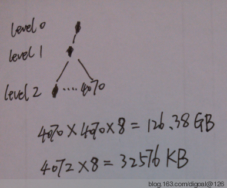

## PostgreSQL 如何精确计算表膨胀(fsm,数据块layout讲解) - PostgreSQL table exactly bloat monitor use freespace map data  
          
### 作者                                                       
digoal     
            
### 日期       
2013-06-28      
        
### 标签     
PostgreSQL , bloat , fsm , dead tuple , 表膨胀    
          
----    
             
## 背景    
对PostgreSQL数据库有一定了解的朋友都知道PostgreSQL的UPDATE, DELETE操作是通过新增tuple版本提供高并发处理的. 这样带来一个问题是需要经常vacuum 表, 回收老版本占用的存储空间. 只有回收的空间才能被重复利用, 如果回收不及时将会造成表的膨胀效应.  
  
那么怎么知道数据表有没有膨胀呢?  
  
方法举例如下 :   
  
## 一. 一般的做法是监控dead tuple和live tuple的比例.   
  
但是在执行完vacuum后, dead tuple会清除掉, 所以膨胀多少看不出来. 这种方法不适合监控表膨胀, 倒是适合监控dead tuple的比例(反推出是否存在长事务或者未开启autovacuum , 或者IO过于繁忙, DML操作频繁, 并且acuum不及时等等情况).  
  
例如 :   
  
创建测试表 :   
  
```  
digoal=# create table deadtuple_teste (id int, info text);  
CREATE TABLE  
```  
  
插入测试数据 :   
  
```  
digoal=# insert into deadtuple_teste select generate_series(1,100000),md5(random()::text);  
INSERT 0 100000  
```  
  
查看当前表的空间占用情况, 已占用834个page :   
  
```  
digoal=# select relpages from pg_class where relname='deadtuple_teste';  
 relpages   
----------  
      834  
(1 row)  
```  
  
查看live tuple和dead tuple : 当前没有dead tuple.  
  
```  
digoal=# select relname,n_live_tup,n_dead_tup from pg_stat_all_tables where relname='deadtuple_teste';  
     relname     | n_live_tup | n_dead_tup   
-----------------+------------+------------  
 deadtuple_teste |     100000 |          0  
(1 row)  
```  
  
删除29999条记录.  
  
```  
digoal=# delete from deadtuple_teste where id<30000;  
DELETE 29999  
```  
  
再次查看live tuple和dead tuple. 还是没有dead tuple, 原因是数据库开启了auto vacuum, 到达一定阈值后会自动触发, 回收掉了.  
  
```  
digoal=# select relname,n_live_tup,n_dead_tup from pg_stat_all_tables where relname='deadtuple_teste';  
     relname     | n_live_tup | n_dead_tup   
-----------------+------------+------------  
 deadtuple_teste |      70001 |          0  
(1 row)  
```  
  
如下 :   
  
```  
digoal=# select relname,n_live_tup,n_dead_tup,last_autoanalyze,last_autovacuum from pg_stat_all_tables where relname='deadtuple_teste';  
     relname     | n_live_tup | n_dead_tup |       last_autoanalyze        |        last_autovacuum          
-----------------+------------+------------+-------------------------------+-------------------------------  
 deadtuple_teste |      70001 |          0 | 2013-06-28 08:28:24.745492+08 | 2013-06-28 08:28:24.586153+08  
(1 row)  
```  
  
再次查看空间占用, 依然是834个page, 所以使用这种方法没法监控数据表的膨胀.  
  
```  
digoal=# select relpages from pg_class where relname='deadtuple_teste';  
 relpages   
----------  
      834  
(1 row)  
```  
  
## 二. 另一种方法是通过计算行平均占用空间计算出live tuple占用的空间, 计算出膨胀.  
  
这种方法不适合行的占用空间偏离非常大的情况, 如某些行占用1KB, 有的可能占用10KB. 最后导致空间不好估算.  
  
测试依然使用以上环境,  
  
但是为了数据准确, 需要将page的头信息, tuple的头信息, item信息记录在内.  
  
Table 58-2. Overall Page Layout  
  
Item|	Description  
---|---  
PageHeaderData|	24 bytes long. Contains general information about the page, including free space pointers.  
ItemIdData|	Array of (offset,length) pairs pointing to the actual items. 4 bytes per item.  
Free space|	The unallocated space. New item pointers are allocated from the start of this area, new items from the end.  
Items|	The actual items themselves.  
Special space|	Index access method specific data. Different methods store different data. Empty in ordinary tables.  
  
每个 page 头包含24字节固定长度. 每条tuple对应一条ItemIdData, 4字节.  
  
信息如下 :   
  
Table 58-3. PageHeaderData Layout  
  
  
Field|	Type|	Length|	Description  
---|---|---|---  
pd_lsn|	XLogRecPtr|	8 bytes|	LSN: next byte after last byte of xlog record for last change to this page  
pd_tli|	uint16|	2 bytes|	TimeLineID of last change (only its lowest 16 bits)  
pd_flags|	uint16|	2 bytes|	Flag bits  
pd_lower|	LocationIndex|	2 bytes|	Offset to start of free space  
pd_upper|	LocationIndex|	2 bytes|	Offset to end of free space  
pd_special|	LocationIndex|	2 bytes|	Offset to start of special space  
pd_pagesize_version|	uint16|	2 bytes|	Page size and layout version number information  
pd_prune_xid|	TransactionId|	4 bytes|	Oldest unpruned XMAX on page, or zero if none  
  
tuple头部则占用27字节. 如下.  
  
Table 58-4. HeapTupleHeaderData Layout  
  
Field|	Type|	Length|	Description  
---|---|---|---  
t_xmin|	TransactionId|	4 bytes|	insert XID stamp  
t_xmax|	TransactionId|	4 bytes|	delete XID stamp  
t_cid|	CommandId|	4 bytes|	insert and/or delete CID stamp (overlays with t_xvac)  
t_xvac|	TransactionId|	4 bytes|	XID for VACUUM operation moving a row version  
t_ctid|	ItemPointerData|	6 bytes|	current TID of this or newer row version  
t_infomask2|	uint16|	2 bytes|	number of attributes, plus various flag bits  
t_infomask|	uint16|	2 bytes|	various flag bits  
t_hoff|	uint8|	1 byte|	offset to user data  
  
因此1条记录真实的占用空间应该是ItemIdData+tupleHead+tupledata=4+27+?字节.  
  
第一个例子的长度如下 :   
  
```  
digoal=# select pg_column_size(id),pg_column_size('info') from deadtuple_teste limit 1;  
 pg_column_size | pg_column_size   
----------------+----------------  
              4 |              5  
(1 row)  
```  
  
一条tuple的空间是4+27+4+5=40字节.  
  
采样10000条计算平均值 :   
  
```  
digoal=# select avg(c1+c2) from (select pg_column_size(id) c1,pg_column_size('info') c2 from deadtuple_teste limit 1000) t;  
        avg           
--------------------  
 9.0000000000000000  
(1 row)  
```  
  
最终得到的单条tuple的空间占用是40字节.   
  
  
live tuple占用的空间如下 :   
  
```  
digoal=# select n_live_tup*40 from pg_stat_all_tables where relname='deadtuple_teste';  
 ?column?   
----------  
  2800040  
(1 row)  
```  
  
page头占用的空间如下 :   
  
```  
digoal=# select 24*relpages from pg_class where relname='deadtuple_teste';  
 ?column?   
----------  
    20016  
(1 row)  
```  
  
表的真实空间占用如下 :   
  
```  
digoal=# select pg_relation_size('deadtuple_teste'::regclass);  
 pg_relation_size   
------------------  
          6832128  
(1 row)  
```  
  
膨胀比例 ;   
  
```  
(6832128-2800040-20016)/6832128=0.58723607051858513189.  
```  
  
如果表中有字段使用了TOAST存储, 那么使用这种方法计算膨胀将更加复杂.   
  
```  
digoal=# select reltoastrelid::regclass from pg_class where relname='deadtuple_teste';  
      reltoastrelid        
-------------------------  
 pg_toast.pg_toast_33317  
(1 row)  
```  
  
## 三. 最后的绝招来了, 使用freespace map来计算膨胀是最赤裸的方法, 因为PostgreSQL 本身也是使用freespace map来获取定位所需空间的数据块的.  
  
自从8.4以后, 每个数据库对象有自己的fsm文件, 详细介绍可参考.  
  
[《PostgreSQL Free Space Map Principle》](../201005/20100511_02.md)  
  
fsm中存储的并不是每个表page的详细剩余字节数, 而是使用1个字节来存储1个page的剩余空间, 因此一个表的page被拆分成了256份, 剩余空间200代表这个page剩余blocksize*(200/256).  
  
fsm page内部使用binary tree存储, 1个fsm的page默认为8KB, 所以理论上可以存储8192/2-1个表page的剩余空间信息. 但是除掉fsm头信息实际上一个fsm page只能存储4069个表对象的page剩余空间信息.  
  
fsm pages本身也是树结构, 一个数据库对象最大为2^32-1个page组成. 所以只要3级就足以记录一个对象的page剩余空间信息 :   
  
```  
4069^3 > (2^32-1)  
```  
  
fsm page内部结构图例 :   
  
以下为第三级的fsm page内部结构举例 :   
  
```  
level  
1  
2  
4  
8  
16  
32  
64  
128  
256  
512      以上略, 逐渐收缩. 直到顶端.  
1024         4 ...  
2048      4     2  ...  
4069    3 4   0 2  ....    <- This level represents heap pages (如果是第二级或者第一级的fsm page, 这里表示child fsm page的信息)  
```  
  
(上面的3,4,0,2)每个数字代表heap page的剩余空间, 1个字节表示, 后面会打印fsm page的内容, 一目了然.  
  
fsm pages 结构图例 :   
  
```  
 0     <-- page 0 at level 2 (root page)  
  0     <-- page 0 at level 1  
   0     <-- page 0 at level 0  
   1     <-- page 1 at level 0  
   2     <-- ...  
   ...  
   4069  
  1     <-- page 1 at level 1  
   4069  
   ...  
  2  
   ...  
   4069*2  
  3  
   ...  
   4069*3  
  4069  
   ....  
   4069*4069  
1  
....  
....  
4069*4069*4069  
```  
  
一个二级节点,4069个三级节点可以记录大表的所有page信息呢?  
  
(注意图中有误, 4070应该改成4069)  
  
  
  
32MB的fsm page可以记录126.38GB的数据库对象的free space map信息.   
  
创建测试表 :   
  
```  
digoal=# create table fsm_test(id int, info text);  
CREATE TABLE  
```  
  
插入测试数据  
  
```  
digoal=# insert into fsm_test select generate_series(1,1000000),'test';  
INSERT 0 1000000  
```  
  
查看对象大小 :   
  
```  
digoal=# select pg_relation_size('fsm_test');  
 pg_relation_size   
------------------  
         44285952  
(1 row)  
```  
  
表对应的文件  
  
```  
digoal=# select pg_relation_filepath('fsm_test');  
 pg_relation_filepath   
----------------------  
 base/16385/33311  
(1 row)  
```  
  
fsm文件加_fsm后缀.   
  
```  
digoal=# select * from pg_stat_file('base/16385/33311_fsm');  
 size  |         access         |      modification      |         change         | creation | isdir   
-------+------------------------+------------------------+------------------------+----------+-------  
 32768 | 2013-06-27 21:59:21+08 | 2013-06-27 21:59:21+08 | 2013-06-27 21:59:21+08 |          | f  
(1 row)  
```  
  
fsm文件共计4个page, 所以有2个是三级page(2,3). 计算时也只需要统计三级page的信息.  
  
```  
digoal=# select 32768/8192;  
 ?column?   
----------  
        4  
(1 row)  
```  
  
fsm文件跟随对象文件名. 所以在truncate对象后fsm会重新生成. 但是必须要第一次vacuum后fsm才会出现, 否则是没有的.  
  
```  
digoal=# truncate fsm_test;  
TRUNCATE TABLE  
digoal=# insert into fsm_test select generate_series(1,1000000),'test';  
INSERT 0 1000000  
digoal=# select pg_relation_filepath('fsm_test');  
 pg_relation_filepath   
----------------------  
 base/16385/33325  
(1 row)  
```  
  
新fsm文件名 :   
  
```  
digoal=# select * from pg_stat_file('base/16385/33325_fsm');  
 size  |         access         |      modification      |         change         | creation | isdir   
-------+------------------------+------------------------+------------------------+----------+-------  
 32768 | 2013-06-28 09:55:16+08 | 2013-06-28 09:55:16+08 | 2013-06-28 09:55:16+08 |          | f  
(1 row)  
```  
  
查看freespace map page的内容可以通过pageinspect插件 :   
  
```  
digoal=# create extension pageinspect;  
CREATE EXTENSION  
digoal=# select * from fsm_page_contents(get_raw_page('fsm_test','fsm',0));  
 fsm_page_contents   
-------------------  
 fp_next_slot: 0  +  
   
(1 row)  
  
digoal=# select * from fsm_page_contents(get_raw_page('fsm_test','fsm',1));  
 fsm_page_contents   
-------------------  
 fp_next_slot: 0  +  
   
(1 row)  
  
digoal=# select * from fsm_page_contents(get_raw_page('fsm_test','fsm',2));  
 fsm_page_contents   
-------------------  
 fp_next_slot: 0  +  
   
(1 row)  
  
digoal=# select * from fsm_page_contents(get_raw_page('fsm_test','fsm',3));  
 fsm_page_contents   
-------------------  
 fp_next_slot: 0  +  
   
(1 row)  
```  
  
表明fsm_test表目前没有剩余空间.  
  
  
直接从get_raw_page取数据 :   
  
```  
digoal=# select * from get_raw_page('fsm_test','fsm',3);  
\x0000000000000000000000001800002000200420000000000000000000000000000000000000000000000000000000000000000000000000000000000000000000000000000000000000000000000000000000000000000000000000000000000000000000000000000000000000000000000000000000000000000000000000000000000000000000000000000000000000000000000000000000000000000000000000000000000000000000000000000000000000000000000000000000000000000000000000000000000000000000000000000000000000000000000000000000000000000000000000000000000000000000000000000000000000000000000000000000000000000000000000000000000000000000000000000000000000000000000000000000000000000000000000000000000000000000000000000000000000000000000000000000000000000000000000000000000000000000000000000000000000000000000000000000000000000000000000000000000000000000000000000000000000000000000000000000000000000000000000000000000000000000000000000000000000000000000000000000000000000000000000000000000000000000000000000000000000000000000000000000000000000000000000000000000000000000000000000000000000000000000000000000000000000000000000000000000000000000000000000000000000000000000000000000000000000000000000000000000000000000000000000000000000000000000000000000000000000000000000000000000000000000000000000000000000000000000000000000000000000000000000000000000000000000000000000000000000000000000000000000000000000000000000000000000000000000000000000000000000000000000000000000000000000000000000000000000000000000000000000000000000000000000000000000000000000000000000000000000000000000000000000000000000000000000000000000000000000000000000000000000000000000000000000000000000000000000000000000000000000000000000000000000000000000000000000000000000000000000000000000000000000000000000000000000000000000000000000000000000000000000000000000000000000000000000000000000000000000000000000000000000000000000000000000000000000000000000000000000000000000000000000000000000000000000000000000000000000000000000000000000000000000000000000000000000000000000000000000000000000000000000000000000000000000000000000000000000000000000000000000000000000000000000000000000000000000000000000000000000000000000000000000000000000000000000000000000000000000000000000000000000000000000000000000000000000000000000000000000000000000000000000000000000000000000000000000000000000000000000000000000000000000000000000000000000000000000000000000000000000000000000000000000000000000000000000000000000000000000000000000000000000000000000000000000000000000000000000000000000000000000000000000000000000000000000000000000000000000000000000000000000000000000000000000000000000000000000000000000000000000000000000000000000000000000000000000000000000000000000000000000000000000000000000000000000000000000000000000000000000000000000000000000000000000000000000000000000000000000000000000000000000000000000000000000000000000000000000000000000000000000000000000000000000000000000000000000000000000000000000000000000000000000000000000000000000000000000000000000000000000000000000000000000000000000000000000000000000000000000000000000000000000000000000000000000000000000000000000000000000000000000000000000000000000000000000000000000000000000000000000000000000000000000000000000000000000000000000000000000000000000000000000000000000000000000000000000000000000000000000000000000000000000000000000000000000000000000000000000000000000000000000000000000000000000000000000000000000000000000000000000000000000000000000000000000000000000000000000000000000000000000000000000000000000000000000000000000000000000000000000000000000000000000000000000000000000000000000000000000000000000000000000000000000000000000000000000000000000000000000000000000000000000000000000000000000000000000000000000000000000000000000000000000000000000000000000000000000000000000000000000000000000000000000000000000000000000000000000000000000000000000000000000000000000000000000000000000000000000000000000000000000000000000000000000000000000000000000000000000000000000000000000000000000000000000000000000000000000000000000000000000000000000000000000000000000000000000000000000000000000000000000000000000000000000000000000000000000000000000000000000000000000000000000000000000000000000000000000000000000000000000000000000000000000000000000000000000000000000000000000000000000000000000000000000000000000000000000000000000000000000000000000000000000000000000000000000000000000000000000000000000000000000000000000000000000000000000000000000000000000000000000000000000000000000000000000000000000000000000000000000000000000000000000000000000000000000000000000000000000000000000000000000000000000000000000000000000000000000000000000000000000000000000000000000000000000000000000000000000000000000000000000000000000000000000000000000000000000000000000000000000000000000000000000000000000000000000000000000000000000000000000000000000000000000000000000000000000000000000000000000000000000000000000000000000000000000000000000000000000000000000000000000000000000000000000000000000000000000000000000000000000000000000000000000000000000000000000000000000000000000000000000000000000000000000000000000000000000000000000000000000000000000000000000000000000000000000000000000000000000000000000000000000000000000000000000000000000000000000000000000000000000000000000000000000000000000000000000000000000000000000000000000000000000000000000000000000000000000000000000000000000000000000000000000000000000000000000000000000000000000000000000000000000000000000000000000000000000000000000000000000000000000000000000000000000000000000000000000000000000000000000000000000000000000000000000000000000000000000000000000000000000000000000000000000000000000000000000000000000000000000000000000000000000000000000000000000000000000000000000000000000000000000000000000000000000000000000000000000000000000000000000000000000000000000000000000000000000000000000000000000000000000000000000000000000000000000000000000000000000000000000000000000000000000000000000000000000000000000000000000000000000000000000000000000000000000000000000000000000000000000000000000000000000000000000000000000000000000000000000000000000000000000000000000000000000000000000000000000000000000000000000000000000000000000000000000000000000000000000000000000000000000000000000000000000000000000000000000000000000000000000000000000000000000000000000000000000000000000000000000000000000000000000000000000000000000000000000000000000000000000000000000000000000000000000000000000000000000000000000000000000000000000000000000000000000000000000000000000000000000000000000000000000000000000000000000000000000000000000000000000000000000000000000000000000000000000000000000000000000000000000000000000000000000000000000000000000000000000000000000000000000000000000000000000000000000000000000000000000000000000000000000000000000000000000000000000000000000000000000000000000000000000000000000000000000000000000000000000000000000000000000000000000000000000000000000000000000000000000000000000000000000000000000000000000000000000000000000000000000000000000000000000000000000000000000000000000000000000000000000000000000000000000000000000000000000000000000000000000000000000000000000000000000000000000000000000000000000000000000000000000000000000000000000000000000000000000000000000000000000000000000000000000000000000000000000000000000000000000000000000000000000000000000000000000000000000000000000000000000000000000000000000000000000000000000000000000000000000000000000000000000000000000000000000000000000000000000000000000000000000000000000000000000000000000000000000000000000000000000000000000000000000000000000000000000000000000000000000000000000000000000000000000000000000000000000000000000000000000000000000000000000000000000000000000000000000000000000000000000000000000000000000000000000000000000000000000000000000000000000000000000000000000000000000000000000000000000000000000000000000000000000000000000000000000000000000000000000000000000000000000000000000000000000000000000000000000000000000000000000000000000000000000000000000000000000000000000000000000000000000000000000000000000000000000000000000000000000000000000000000000000000000000000000000000000000000000000000000000000000000000000000000000000000000000000000000000000000000000000000000000000000000000000000000000000000000000000000000000000000000000000000000000000000000000000000000000000000000000000000000000000000000000000000000000000000000000000000000000000000000000000000000000000000000000000000000000000000000000000000000000000000000000000000000000000000000000000000000000000000000000000000000000000000000000000000000000000000000000000000000000000000000000000000000000000000000000000000000000000000000000000000000000000000000000000000000000000000000000000000000000000000000000000000000000000000000000000000000000000000000000000000000000000000000000000000000000000000000000000000000000000000000000000000000000000000000000000000000000000000000000000000000000000000000000000000000000000000000000000000000000000000000000000000000000000000000000000000000000000000000000000000000000000000000000000000000000000000000000000000000000000000000000000000000000000000000000000000000000000000000000000000000000000000000000000000000000000000000000000000000000000000000000000000000000000000000000000000000000000000000000000000000000000000000000000000000000000000000000000000000000000000000000000000000000000000000000000000000000000000000000000000000000000000000000000000000000000000000000000000000000000000000000000000000000000000000000000000000000000000000000000000000000000000000000000000000000000000000000000000000000000000000000000000000000000000000000000000000000000000000000000000000000000000000000000000000000000000000000000000000000000000000000000000000000000000000000000000000000000000000000000000000000000000000000000000000000000000000000000000000000000000000000000000000000000000000000000000000000000000000000000000000000000000000000000000000000000000000000000000000000000000000000000000000000000000000000000000000000000000000000000000000000000000000000000000000000000000000000000000000000000000000000000000000000000000000000000000000000000000000000000000000000000000000000000000000000000000000000000000000000000000000000000000000000000000000000000000000000000000000000000000000000000000000000000000000000000000000000000000000000000000000000000000000000000000000000000000000000000000000000000000000000000000000000000000000000000000000000000000000000000000000000000000000000000000000000000000000000000000000000000000000000000000000000000000000000000000000000000000000000000000000000000000000000000000000000000000000000000000000000000000000000000000000000000000000000000000000000000000000000000000000000000000000000000000000000000000000000000000000000000000000000000000000000000000000000000000000000000000000000000000000000000000000000000000000000000000000000000000000000000000000000000000000000000000000000000000000000000000000000000000000000000000000000000000000000000000000000000000000000000000000000000000000000000000000000000000000000000000000000000000000000000000000000000000000000000000000000000000000000000000000000000000000000000000000000000000000000000000000000000000000000000000000000000000000000000000000000000000000000000000000000000000000000000000000000000000000000000000000000000000000000000000000000000000000000000000000000000000000000000000000000000000000000000000000000000000000000000000000000000000000000000000000000000000000000000000000000000000000000000000000000000000000000000000000000000000000000000000000000000000000000000000000000000000000000000000000000000000000000000000000000000000000000000000000000000000000000000000000000000000000000000000000000000000000000000000000000000000000000000000000000000000000000000000000000000000000000000000000000000000000000000000000000000000000000000000000000000000000000000000000000000000000000000000000000000000000000000000000000000000000000000000000000000000000000000000000000000000000000000000000000000000000000000000000000000000000000000000000000000000000000000000000000000000000000000000000000000000000000000000000000000000000000000000000000000000000000000000000000000000000000000000000000000000000000000000000000000000000000000000000000000000000000000000000000000000000000000000000000000000000000000000000000000000000000000000000000000000000000000000000000000000000000000000000000000000000000000000000000000000000000000000000000000000000000000000000000000000000000000000000000000000000000000000000000000000000000000000000000000000000000000000000000000000000000000000000000000000000000000000000000000000000000000000000000000000000000000000000000000000000000000000000000000000000000000000000000000000000000000000000000000000000000000000000000000000000000000000000000000000000000000000000000000000000000000000000000000000000000000000000000000000000000000000000000000000000000000000000000000000000000000000000000000000000000000000000000000000000000000000000000000000000000000000000000000000000000000000000000000000000000000000000000000000000000000000000000000000000000000000000000000000000000000000000000000000000000000000000000000000000000000000000000000000000000000000000000000000000000000000000000000000000000000000000000000000000000000000000000000000000000000000000000000000000000000000000000000000000000000000000000000000000000000000000000000000000000000000000000000000000000000000000000000000000000000000000000000000000000000000000000000000000000000000000000000000000000000000000000000000000000000000000000000000000000000000000000000000000000000000000000000000000000000000000000000000000000000000000000000000000000000000000000000000000000000000000000000000000000000000000000000000000000000000000000000000000000000000000000000000000000000000000000000000000000000000000000000000000000000000000000000000000000000000000000000000000000000000000000000000000000000000000000000000000000000000000000000000000000000000000000000000000000000000000000000000000000000000000000000000000000000000000000000000000000000000000000000000000000000000000000000000000000000000000000000000000000000000000000000000000000000000000000000000000000000000000000000000000000000000000000000000000000000000000000000000000000000000000000000000000000000000000000000000000000000000000000000000000000000000000000000000000000000000000000000000000000000000000000000000000000000000000000000000000000000000000000000000000000000000000000000000000000000000000000000000000000000000000000000000000000000000000000000000000000000000000000000000000000000000000000000000000000000000000000000000000000000000000000000000000000000000000000000000000000000000000000000000000000000000000000000000000000000000000000000000000000000000000000000000000000000000000000000000000000000000000000000000000000000000000000000000000000000000000000000000000000000000000000000000000000000000000000000000000000000000000000000000000000000000000000000000000000000000000000000000000000000000000000000000000000000000000000000000000000000000000000000000000000000000000000000000000000000000000000000000000000000000000000000000000000000000000000000000000000000000000000000000000000000000000000000000000000000000000000000000000000000000000000000000000000000000000000000000000000000000000000000000000000000000000000000000000000000000000000000000000000000000000000000000000000000000000000000000000000000000000000000000000000000000000000000000000000000000000000000000000000000000000000000000000000000000000000000000000000000000000000000000000000000000000000000000000000000000000000000000000000000000000000000000000000000000000000000000000000000000000000000000000000000000000000000000000000000000000000000000000000000000000000000000000000000000000000000000000000000000000000000000000000000000000000000000000000000000000000000000000000000000000000000000000000000000000000000000000000000000000000000000000000000000000000000000000000000000000000000000000000000000000000000000000000000000000000000000000000000000000000000000000000000000000000000000000000000000000000000000000000000000000000000000000000000000000000000000000000000000000000000000000000000000000000000000000000000000000000000000000000000000000000000000000000000000000000000000000000000000000000000000000000000000000000000000000000000000000000000000000000000000000000000000000000000000000000000000000000000000000000000000000000000000000000000000000000000000000000000000000000000000000000000000000000000000000000000000000000000000000000000000000000000000000000000000000000000000000000000000000000000000000000000000000000000000000000000000000000000000000000000000000000000000000000000000000000000000000000000000000000000000000  
```  
  
删除fsm_test的数据, 只留最后一行.  
  
```  
digoal=# delete from fsm_test where id<1000000;  
DELETE 999999  
digoal=# delete from fsm_test where id<1000000;  
DELETE 999999  
digoal=# vacuum verbose analyze fsm_test ;  
INFO:  vacuuming "public.fsm_test"  
INFO:  "fsm_test": found 0 removable, 0 nonremovable row versions in 0 out of 5406 pages  
DETAIL:  0 dead row versions cannot be removed yet.  
There were 0 unused item pointers.  
0 pages are entirely empty.  
CPU 0.00s/0.00u sec elapsed 0.00 sec.  
INFO:  vacuuming "pg_toast.pg_toast_33311"  
INFO:  index "pg_toast_33311_index" now contains 0 row versions in 1 pages  
DETAIL:  0 index row versions were removed.  
0 index pages have been deleted, 0 are currently reusable.  
CPU 0.00s/0.00u sec elapsed 0.00 sec.  
INFO:  "pg_toast_33311": found 0 removable, 0 nonremovable row versions in 0 out of 0 pages  
DETAIL:  0 dead row versions cannot be removed yet.  
There were 0 unused item pointers.  
0 pages are entirely empty.  
CPU 0.00s/0.00u sec elapsed 0.00 sec.  
INFO:  analyzing "public.fsm_test"  
INFO:  "fsm_test": scanned 5406 of 5406 pages, containing 1 live rows and 0 dead rows; 1 rows in sample, 1 estimated total rows  
VACUUM  
```  
  
vacuum后空间回收并可以重复利用, 但是还占用了磁盘空间.  
  
  
这个时候查看fsm就不一样了.  
  
```  
digoal=# select * from get_raw_page('fsm_test','fsm',3);  
\x00000000000000000000000018000020002004200000000000000000f4f400e8f40000e8e8f40000000000e8e8e8e8e8f400000000000000000000e8e8e8e8e8e8e8e8e8e8f4000000000000000000000000000000000000000000e8e8e8e8e8e8e8e8e8e8e8e8e8e8e8e8e8e8e8e8f400000000000000000000000000000000000000000000000000000000000000000000000000000000000000e8e8e8e8e8e8e8e8e8e8e8e8e8e8e8e8e8e8e8e8e8e8e8e8e8e8e8e8e8e8e8e8e8e8e8e8e8e8e8e8e8f40000000000000000000000000000000000000000000000000000000000000000000000000000000000000000000000000000000000000000000000000000000000000000000000000000000000000000000000000000e8e8e8e8e8e8e8e8e8e8e8e8e8e8e8e8e8e8e8e8e8e8e8e8e8e8e8e8e8e8e8e8e8e8e8e8e8e8e8e8e8e8e8e8e8e8e8e8e8e8e8e8e8e8e8e8e8e8e8e8e8e8e8e8e8e8e8e8e8e8e8e8e8e8e8e8e8e8e8e8e8e8e8f400000000000000000000000000000000000000000000000000000000000000000000000000000000000000000000000000000000000000000000000000000000000000000000000000000000000000000000000000000000000000000000000000000000000000000000000000000000000000000000000000000000000000000000000000000000000000000000000000000000000000000000000000000000000000000000000000000000e8e8e8e8e8e8e8e8e8e8e8e8e8e8e8e8e8e8e8e8e8e8e8e8e8e8e8e8e8e8e8e8e8e8e8e8e8e8e8e8e8e8e8e8e8e8e8e8e8e8e8e8e8e8e8e8e8e8e8e8e8e8e8e8e8e8e8e8e8e8e8e8e8e8e8e8e8e8e8e8e8e8e8e8e8e8e8e8e8e8e8e8e8e8e8e8e8e8e8e8e8e8e8e8e8e8e8e8e8e8e8e8e8e8e8e8e8e8e8e8e8e8e8e8e8e8e8e8e8e8e8e8e8e8e8e8e8e8e8e8e8e8e8e8e8e8e8e8e8e8e8e8e8e8e8e8e8e8e8e8e8e8e8e8e8e8e8f40000000000000000000000000000000000000000000000000000000000000000000000000000000000000000000000000000000000000000000000000000000000000000000000000000000000000000000000000000000000000000000000000000000000000000000000000000000000000000000000000000000000000000000000000000000000000000000000000000000000000000000000000000000000000000000000000000000000000000000000000000000000000000000000000000000000000000000000000000000000000000000000000000000000000000000000000000000000000000000000000000000000000000000000000000000000000000000000000000000000000000000000000000000000000000000000000000000000000000000000000000000000000000000000000000000000000000000000000000000000000000000000000000000000000000e8e8e8e8e8e8e8e8e8e8e8e8e8e8e8e8e8e8e8e8e8e8e8e8e8e8e8e8e8e8e8e8e8e8e8e8e8e8e8e8e8e8e8e8e8e8e8e8e8e8e8e8e8e8e8e8e8e8e8e8e8e8e8e8e8e8e8e8e8e8e8e8e8e8e8e8e8e8e8e8e8e8e8e8e8e8e8e8e8e8e8e8e8e8e8e8e8e8e8e8e8e8e8e8e8e8e8e8e8e8e8e8e8e8e8e8e8e8e8e8e8e8e8e8e8e8e8e8e8e8e8e8e8e8e8e8e8e8e8e8e8e8e8e8e8e8e8e8e8e8e8e8e8e8e8e8e8e8e8e8e8e8e8e8e8e8e8e8e8e8e8e8e8e8e8e8e8e8e8e8e8e8e8e8e8e8e8e8e8e8e8e8e8e8e8e8e8e8e8e8e8e8e8e8e8e8e8e8e8e8e8e8e8e8e8e8e8e8e8e8e8e8e8e8e8e8e8e8e8e8e8e8e8e8e8e8e8e8e8e8e8e8e8e8e8e8e8e8e8e8e8e8e8e8e8e8e8e8e8e8e8e8e8e8e8e8e8e8e8e8e8e8e8e8e8e8e8e8e8e8e8e8e8e8e8e8e8e8e8e8e8e8e8e8e8e8e8e8e8e8e8e8e8e8e8e8e8e8e8e8e8e8e8e8e8e8e8e8e8e8e8e8e8e8e8e8e8e8e8e8e8e8e8e8f40000000000000000000000000000000000000000000000000000000000000000000000000000000000000000000000000000000000000000000000000000000000000000000000000000000000000000000000000000000000000000000000000000000000000000000000000000000000000000000000000000000000000000000000000000000000000000000000000000000000000000000000000000000000000000000000000000000000000000000000000000000000000000000000000000000000000000000000000000000000000000000000000000000000000000000000000000000000000000000000000000000000000000000000000000000000000000000000000000000000000000000000000000000000000000000000000000000000000000000000000000000000000000000000000000000000000000000000000000000000000000000000000000000000000000000000000000000000000000000000000000000000000000000000000000000000000000000000000000000000000000000000000000000000000000000000000000000000000000000000000000000000000000000000000000000000000000000000000000000000000000000000000000000000000000000000000000000000000000000000000000000000000000000000000000000000000000000000000000000000000000000000000000000000000000000000000000000000000000000000000000000000000000000000000000000000000000000000000000000000000000000000000000000000000000000000000000000000000000000000000000000000000000000000000000000000000000000000000000000000000000000000000000000000000000000000000000000000000000000000000000000000000000000000000000000000000000000000000000000000e8e8e8e8e8e8e8e8e8e8e8e8e8e8e8e8e8e8e8e8e8e8e8e8e8e8e8e8e8e8e8e8e8e8e8e8e8e8e8e8e8e8e8e8e8e8e8e8e8e8e8e8e8e8e8e8e8e8e8e8e8e8e8e8e8e8e8e8e8e8e8e8e8e8e8e8e8e8e8e8e8e8e8e8e8e8e8e8e8e8e8e8e8e8e8e8e8e8e8e8e8e8e8e8e8e8e8e8e8e8e8e8e8e8e8e8e8e8e8e8e8e8e8e8e8e8e8e8e8e8e8e8e8e8e8e8e8e8e8e8e8e8e8e8e8e8e8e8e8e8e8e8e8e8e8e8e8e8e8e8e8e8e8e8e8e8e8e8e8e8e8e8e8e8e8e8e8e8e8e8e8e8e8e8e8e8e8e8e8e8e8e8e8e8e8e8e8e8e8e8e8e8e8e8e8e8e8e8e8e8e8e8e8e8e8e8e8e8e8e8e8e8e8e8e8e8e8e8e8e8e8e8e8e8e8e8e8e8e8e8e8e8e8e8e8e8e8e8e8e8e8e8e8e8e8e8e8e8e8e8e8e8e8e8e8e8e8e8e8e8e8e8e8e8e8e8e8e8e8e8e8e8e8e8e8e8e8e8e8e8e8e8e8e8e8e8e8e8e8e8e8e8e8e8e8e8e8e8e8e8e8e8e8e8e8e8e8e8e8e8e8e8e8e8e8e8e8e8e8e8e8e8e8e8e8e8e8e8e8e8e8e8e8e8e8e8e8e8e8e8e8e8e8e8e8e8e8e8e8e8e8e8e8e8e8e8e8e8e8e8e8e8e8e8e8e8e8e8e8e8e8e8e8e8e8e8e8e8e8e8e8e8e8e8e8e8e8e8e8e8e8e8e8e8e8e8e8e8e8e8e8e8e8e8e8e8e8e8e8e8e8e8e8e8e8e8e8e8e8e8e8e8e8e8e8e8e8e8e8e8e8e8e8e8e8e8e8e8e8e8e8e8e8e8e8e8e8e8e8e8e8e8e8e8e8e8e8e8e8e8e8e8e8e8e8e8e8e8e8e8e8e8e8e8e8e8e8e8e8e8e8e8e8e8e8e8e8e8e8e8e8e8e8e8e8e8e8e8e8e8e8e8e8e8e8e8e8e8e8e8e8e8e8e8e8e8e8e8e8e8e8e8e8e8e8e8e8e8e8e8e8e8e8e8e8e8e8e8e8e8e8e8e8e8e8e8e8e8e8e8e8e8e8e8e8e8e8e8e8e8e8e8e8e8e8e8e8e8e8e8e8e8e8e8e8e8e8e8e8e8e8e8e8e8e8e8e8e8e8e8e8e8e8e8e8e8e8e8e8e8e8e8e8e8e8e8e8e8e8e8e8e8e8e8e8e8e8e8e8e8e8e8e8e8e8e8e8e8e8e8e8e8e8e8e8e8e8e8e8e8e8e8e8e8e8e8e8e8e8e8e8e8e8e8e8e8e8e8f40000000000000000000000000000000000000000000000000000000000000000000000000000000000000000000000000000000000000000000000000000000000000000000000000000000000000000000000000000000000000000000000000000000000000000000000000000000000000000000000000000000000000000000000000000000000000000000000000000000000000000000000000000000000000000000000000000000000000000000000000000000000000000000000000000000000000000000000000000000000000000000000000000000000000000000000000000000000000000000000000000000000000000000000000000000000000000000000000000000000000000000000000000000000000000000000000000000000000000000000000000000000000000000000000000000000000000000000000000000000000000000000000000000000000000000000000000000000000000000000000000000000000000000000000000000000000000000000000000000000000000000000000000000000000000000000000000000000000000000000000000000000000000000000000000000000000000000000000000000000000000000000000000000000000000000000000000000000000000000000000000000000000000000000000000000000000000000000000000000000000000000000000000000000000000000000000000000000000000000000000000000000000000000000000000000000000000000000000000000000000000000000000000000000000000000000000000000000000000000000000000000000000000000000000000000000000000000000000000000000000000000000000000000000000000000000000000000000000000000000000000000000000000000000000000000000000000000000000000000000000000000000000000000000000000000000000000000000000000000000000000000000000000000000000000000000000000000000000000000000000000000000000000000000000000000000000000000000000000000000000000000000000000000000000000000000000000000000000000000000000000000000000000000000000000000000000000000000000000000000000000000000000000000000000000000000000000000000000000000000000000000000000000000000000000000000000000000000000000000000000000000000000000000000000000000000000000000000000000000000000000000000000000000000000000000000000000000000000000000000000000000000000000000000000000000000000000000000000000000000000000000000000000000000000000000000000000000000000000000000000000000000000000000000000000000000000000000000000000000000000000000000000000000000000000000000000000000000000000000000000000000000000000000000000000000000000000000000000000000000000000000000000000000000000000000000000000000000000000000000000000000000000000000000000000000000000000000000000000000000000000000000000000000000000000000000000000000000000000000000000000000000000000000000000000000000000000000000000000000000000000000000000000000000000000000000000000000000000000000000000000000000000000000000000000000000000000000000000000000000000000000000000000000000000000000000000000000000000000000000000000000000000000000000000000000000000000000000000000000000000000000000000000000000000000000000000000000000000000000000e8e8e8e8e8e8e8e8e8e8e8e8e8e8e8e8e8e8e8e8e8e8e8e8e8e8e8e8e8e8e8e8e8e8e8e8e8e8e8e8e8e8e8e8e8e8e8e8e8e8e8e8e8e8e8e8e8e8e8e8e8e8e8e8e8e8e8e8e8e8e8e8e8e8e8e8e8e8e8e8e8e8e8e8e8e8e8e8e8e8e8e8e8e8e8e8e8e8e8e8e8e8e8e8e8e8e8e8e8e8e8e8e8e8e8e8e8e8e8e8e8e8e8e8e8e8e8e8e8e8e8e8e8e8e8e8e8e8e8e8e8e8e8e8e8e8e8e8e8e8e8e8e8e8e8e8e8e8e8e8e8e8e8e8e8e8e8e8e8e8e8e8e8e8e8e8e8e8e8e8e8e8e8e8e8e8e8e8e8e8e8e8e8e8e8e8e8e8e8e8e8e8e8e8e8e8e8e8e8e8e8e8e8e8e8e8e8e8e8e8e8e8e8e8e8e8e8e8e8e8e8e8e8e8e8e8e8e8e8e8e8e8e8e8e8e8e8e8e8e8e8e8e8e8e8e8e8e8e8e8e8e8e8e8e8e8e8e8e8e8e8e8e8e8e8e8e8e8e8e8e8e8e8e8e8e8e8e8e8e8e8e8e8e8e8e8e8e8e8e8e8e8e8e8e8e8e8e8e8e8e8e8e8e8e8e8e8e8e8e8e8e8e8e8e8e8e8e8e8e8e8e8e8e8e8e8e8e8e8e8e8e8e8e8e8e8e8e8e8e8e8e8e8e8e8e8e8e8e8e8e8e8e8e8e8e8e8e8e8e8e8e8e8e8e8e8e8e8e8e8e8e8e8e8e8e8e8e8e8e8e8e8e8e8e8e8e8e8e8e8e8e8e8e8e8e8e8e8e8e8e8e8e8e8e8e8e8e8e8e8e8e8e8e8e8e8e8e8e8e8e8e8e8e8e8e8e8e8e8e8e8e8e8e8e8e8e8e8e8e8e8e8e8e8e8e8e8e8e8e8e8e8e8e8e8e8e8e8e8e8e8e8e8e8e8e8e8e8e8e8e8e8e8e8e8e8e8e8e8e8e8e8e8e8e8e8e8e8e8e8e8e8e8e8e8e8e8e8e8e8e8e8e8e8e8e8e8e8e8e8e8e8e8e8e8e8e8e8e8e8e8e8e8e8e8e8e8e8e8e8e8e8e8e8e8e8e8e8e8e8e8e8e8e8e8e8e8e8e8e8e8e8e8e8e8e8e8e8e8e8e8e8e8e8e8e8e8e8e8e8e8e8e8e8e8e8e8e8e8e8e8e8e8e8e8e8e8e8e8e8e8e8e8e8e8e8e8e8e8e8e8e8e8e8e8e8e8e8e8e8e8e8e8e8e8e8e8e8e8e8e8e8e8e8e8e8e8e8e8e8e8e8e8e8e8e8e8e8e8e8e8e8e8e8e8e8e8e8e8e8e8e8e8e8e8e8e8e8e8e8e8e8e8e8e8e8e8e8e8e8e8e8e8e8e8e8e8e8e8e8e8e8e8e8e8e8e8e8e8e8e8e8e8e8e8e8e8e8e8e8e8e8e8e8e8e8e8e8e8e8e8e8e8e8e8e8e8e8e8e8e8e8e8e8e8e8e8e8e8e8e8e8e8e8e8e8e8e8e8e8e8e8e8e8e8e8e8e8e8e8e8e8e8e8e8e8e8e8e8e8e8e8e8e8e8e8e8e8e8e8e8e8e8e8e8e8e8e8e8e8e8e8e8e8e8e8e8e8e8e8e8e8e8e8e8e8e8e8e8e8e8e8e8e8e8e8e8e8e8e8e8e8e8e8e8e8e8e8e8e8e8e8e8e8e8e8e8e8e8e8e8e8e8e8e8e8e8e8e8e8e8e8e8e8e8e8e8e8e8e8e8e8e8e8e8e8e8e8e8e8e8e8e8e8e8e8e8e8e8e8e8e8e8e8e8e8e8e8e8e8e8e8e8e8e8e8e8e8e8e8e8e8e8e8e8e8e8e8e8e8e8e8e8e8e8e8e8e8e8e8e8e8e8e8e8e8e8e8e8e8e8e8e8e8e8e8e8e8e8e8e8e8e8e8e8e8e8e8e8e8e8e8e8e8e8e8e8e8e8e8e8e8e8e8e8e8e8e8e8e8e8e8e8e8e8e8e8e8e8e8e8e8e8e8e8e8e8e8e8e8e8e8e8e8e8e8e8e8e8e8e8e8e8e8e8e8e8e8e8e8e8e8e8e8e8e8e8e8e8e8e8e8e8e8e8e8e8e8e8e8e8e8e8e8e8e8e8e8e8e8e8e8e8e8e8e8e8e8e8e8e8e8e8e8e8e8e8e8e8e8e8e8e8e8e8e8e8e8e8e8e8e8e8e8e8e8e8e8e8e8e8e8e8e8e8e8e8e8e8e8e8e8e8e8e8e8e8e8e8e8e8e8e8e8e8e8e8e8e8e8e8e8e8e8e8e8e8e8e8e8e8e8e8e8e8e8e8e8e8e8e8e8e8e8e8e8e8e8e8e8e8e8e8e8e8e8e8e8e8e8e8e8e8e8e8e8e8e8e8e8e8e8e8e8e8e8e8e8e8e8e8e8e8e8e8e8e8e8e8e8e8e8e8e8e8e8e8e8e8e8e8e8e8e8e8e8e8e8e8e8e8e8e8e8e8e8e8e8e8e8e8e8e8e8e8e8e8e8e8e8e8e8e8e8e8e8e8e8e8e8e8e8e8e8e8e8e8e8e8e8e8e8e8e8e8e8e8e8e8e8e8e8e8e8e8e8e8e8e8e8e8e8e8e8e8e8e8e8e8e8e8e8e8e8e8e8e8e8e8e8e8e8e8e8e8e8e8e8e8e8e8e8e8e8e8e8e8e8e8e8e8e8e8e8e8e8e8e8e8e8e8e8e8e8e8e8e8e8e8e8e8e8e8e8e8e8e8e8e8e8e8e8e8e8e8e8f40000000000000000000000000000000000000000000000000000000000000000000000000000000000000000000000000000000000000000000000000000000000000000000000000000000000000000000000000000000000000000000000000000000000000000000000000000000000000000000000000000000000000000000000000000000000000000000000000000000000000000000000000000000000000000000000000000000000000000000000000000000000000000000000000000000000000000000000000000000000000000000000000000000000000000000000000000000000000000000000000000000000000000000000000000000000000000000000000000000000000000000000000000000000000000000000000000000000000000000000000000000000000000000000000000000000000000000000000000000000000000000000000000000000000000000000000000000000000000000000000000000000000000000000000000000000000000000000000000000000000000000000000000000000000000000000000000000000000000000000000000000000000000000000000000000000000000000000000000000000000000000000000000000000000000000000000000000000000000000000000000000000000000000000000000000000000000000000000000000000000000000000000000000000000000000000000000000000000000000000000000000000000000000000000000000000000000000000000000000000000000000000000000000000000000000000000000000000000000000000000000000000000000000000000000000000000000000000000000000000000000000000000000000000000000000000000000000000000000000000000000000000000000000000000000000000000000000000000000000000000000000000000000000000000000000000000000000000000000000000000000000000000000000000000000000000000000000000000000000000000000000000000000000000000000000000000000000000000000000000000000000000000000000000000000000000000000000000000000000000000000000000000000000000000000000000000000000000000000000000000000000000000000000000000000000000000000000000000000000000000000000000000000000000000000000000000000000000000000000000000000000000000000000000000000000000000000000000000000000000000000000000000000000000000000000000000000000000000000000000000000000000000000000000000000000000000000000000000000000000000000000000000000000000000000000000000000000000000000000000000000000000000000000000000000000000000000000000000000000000000000000000000000000000000000000000000000000000000000000000000000000000000000000000000000000000000000000000000000000000000000000000000000000000000000000000000000000000000000000000000000000000000000000000000000000000000000000000000000000000000000000000000000000000000000000000000000000000000000000000000000000000000000000000000000000000000000000000000000000000000000000000000000000000000000000000000000000000000000000000000000000000000000000000000000000000000000000000000000000000000000000000000000000000000000000000000000000000000000000000000000000000000000000000000000000000000000000000000000000000000000000000000000000000000000000000000000000000000000000000000000000000000000000000000000000000000000000000000000000000000000000000000000000000000000000000000000000000000000000000000000000000000000000000000000000000000000000000000000000000000000000000000000000000000000000000000000000000000000000000000000000000000000000000000000000000000000000000000000000000000000000000000000000000000000000000000000000000000000000000000000000000000000000000000000000000000000000000000000000000000000000000000000000000000000000000000000000000000000000000000000000000000000000000000000000000000000000000000000000000000000000000000000000000000000000000000000000000000000000000000000000000000000000000000000000000000000000000000000000000000000000000000000000000000000000000000000000000000000000000000000000000000000000000000000000000000000000000000000000000000000000000000000000000000000000000000000000000000000000000000000000000000000000000000000000000000000000000000000000000000000000000000000000000000000000000000000000000000000000000000000000000000000000000000000000000000000000000000000000000000000000000000000000000000000000000000000000000000000000000000000000000000000000000000000000000000000000000000000000000000000000000000000000000000000000000000000000000000000000000000000000000000000000000000000000000000000000000000000000000000000000000000000000000000000000000000000000000000000000000000000000000000000000000000000000000000000000000000000000000000000000000000000000000000000000000000000000000000000000000000000000000000000000000000000000000000000000000000000000000000000000000000000000000000000000000000000000000000000000000000000000000000000000000000000000000000000000000000000000000000000000000000000000000000000000000000000000000000000000000000000000000000000000000000000000000000000000000000000000000000000000000000000000000000000000000000000000000000000000000000000000000000000000000000000000000000000000000000000000000000000000000000000000000000000000000000000000000000000000000000000000000000000000000000000000000000000000000000000000000000000000000000000000000000000000000000000000000000000000000000000000000000000000000000000000000000000000000000000000000000000000000000000000000000000000000000000000000000000000000000000000000000000000000000000000000000000000000000000000000000000000000000000000000000000000000000000000000000000000000000000000000000000000000000000000000000000000000000000000000000000000000000000000000000000000000000000000000000000000000000000000000000000000000000000000000000000000000000000000000000000000000000000000000000000000000000000000000000000000000000000000000000000000000000000000000000000000000000000000000000000000000000000000000000000000000000000000000000000000000000000000000000000000000000000000000000000000000000000000000000000  
```  
  
分层后信息如下 :   
  
1\. 头信息 :   
  
```  
\x00000000000000000000000018000020002004200000000000000000  
```  
  
2\. 树信息如下 :   
  
```  
f4  
f400  
e8f40000  
e8e8f40000000000  
e8e8e8e8e8f400000000000000000000  
e8e8e8e8e8e8e8e8e8e8f4000000000000000000000000000000000000000000  
e8e8e8e8e8e8e8e8e8e8e8e8e8e8e8e8e8e8e8e8f400000000000000000000000000000000000000000000000000000000000000000000000000000000000000  
e8e8e8e8e8e8e8e8e8e8e8e8e8e8e8e8e8e8e8e8e8e8e8e8e8e8e8e8e8e8e8e8e8e8e8e8e8e8e8e8e8f40000000000000000000000000000000000000000000000000000000000000000000000000000000000000000000000000000000000000000000000000000000000000000000000000000000000000000000000000000  
e8e8e8e8e8e8e8e8e8e8e8e8e8e8e8e8e8e8e8e8e8e8e8e8e8e8e8e8e8e8e8e8e8e8e8e8e8e8e8e8e8e8e8e8e8e8e8e8e8e8e8e8e8e8e8e8e8e8e8e8e8e8e8e8e8e8e8e8e8e8e8e8e8e8e8e8e8e8e8e8e8e8e8f400000000000000000000000000000000000000000000000000000000000000000000000000000000000000000000000000000000000000000000000000000000000000000000000000000000000000000000000000000000000000000000000000000000000000000000000000000000000000000000000000000000000000000000000000000000000000000000000000000000000000000000000000000000000000000000000000000000  
e8e8e8e8e8e8e8e8e8e8e8e8e8e8e8e8e8e8e8e8e8e8e8e8e8e8e8e8e8e8e8e8e8e8e8e8e8e8e8e8e8e8e8e8e8e8e8e8e8e8e8e8e8e8e8e8e8e8e8e8e8e8e8e8e8e8e8e8e8e8e8e8e8e8e8e8e8e8e8e8e8e8e8e8e8e8e8e8e8e8e8e8e8e8e8e8e8e8e8e8e8e8e8e8e8e8e8e8e8e8e8e8e8e8e8e8e8e8e8e8e8e8e8e8e8e8e8e8e8e8e8e8e8e8e8e8e8e8e8e8e8e8e8e8e8e8e8e8e8e8e8e8e8e8e8e8e8e8e8e8e8e8e8e8e8e8e8f40000000000000000000000000000000000000000000000000000000000000000000000000000000000000000000000000000000000000000000000000000000000000000000000000000000000000000000000000000000000000000000000000000000000000000000000000000000000000000000000000000000000000000000000000000000000000000000000000000000000000000000000000000000000000000000000000000000000000000000000000000000000000000000000000000000000000000000000000000000000000000000000000000000000000000000000000000000000000000000000000000000000000000000000000000000000000000000000000000000000000000000000000000000000000000000000000000000000000000000000000000000000000000000000000000000000000000000000000000000000000000000000000000000000000000  
e8e8e8e8e8e8e8e8e8e8e8e8e8e8e8e8e8e8e8e8e8e8e8e8e8e8e8e8e8e8e8e8e8e8e8e8e8e8e8e8e8e8e8e8e8e8e8e8e8e8e8e8e8e8e8e8e8e8e8e8e8e8e8e8e8e8e8e8e8e8e8e8e8e8e8e8e8e8e8e8e8e8e8e8e8e8e8e8e8e8e8e8e8e8e8e8e8e8e8e8e8e8e8e8e8e8e8e8e8e8e8e8e8e8e8e8e8e8e8e8e8e8e8e8e8e8e8e8e8e8e8e8e8e8e8e8e8e8e8e8e8e8e8e8e8e8e8e8e8e8e8e8e8e8e8e8e8e8e8e8e8e8e8e8e8e8e8e8e8e8e8e8e8e8e8e8e8e8e8e8e8e8e8e8e8e8e8e8e8e8e8e8e8e8e8e8e8e8e8e8e8e8e8e8e8e8e8e8e8e8e8e8e8e8e8e8e8e8e8e8e8e8e8e8e8e8e8e8e8e8e8e8e8e8e8e8e8e8e8e8e8e8e8e8e8e8e8e8e8e8e8e8e8e8e8e8e8e8e8e8e8e8e8e8e8e8e8e8e8e8e8e8e8e8e8e8e8e8e8e8e8e8e8e8e8e8e8e8e8e8e8e8e8e8e8e8e8e8e8e8e8e8e8e8e8e8e8e8e8e8e8e8e8e8e8e8e8e8e8e8e8e8e8e8e8e8e8e8e8e8e8e8e8e8f40000000000000000000000000000000000000000000000000000000000000000000000000000000000000000000000000000000000000000000000000000000000000000000000000000000000000000000000000000000000000000000000000000000000000000000000000000000000000000000000000000000000000000000000000000000000000000000000000000000000000000000000000000000000000000000000000000000000000000000000000000000000000000000000000000000000000000000000000000000000000000000000000000000000000000000000000000000000000000000000000000000000000000000000000000000000000000000000000000000000000000000000000000000000000000000000000000000000000000000000000000000000000000000000000000000000000000000000000000000000000000000000000000000000000000000000000000000000000000000000000000000000000000000000000000000000000000000000000000000000000000000000000000000000000000000000000000000000000000000000000000000000000000000000000000000000000000000000000000000000000000000000000000000000000000000000000000000000000000000000000000000000000000000000000000000000000000000000000000000000000000000000000000000000000000000000000000000000000000000000000000000000000000000000000000000000000000000000000000000000000000000000000000000000000000000000000000000000000000000000000000000000000000000000000000000000000000000000000000000000000000000000000000000000000000000000000000000000000000000000000000000000000000000000000000000000000000000000000000000000  
e8e8e8e8e8e8e8e8e8e8e8e8e8e8e8e8e8e8e8e8e8e8e8e8e8e8e8e8e8e8e8e8e8e8e8e8e8e8e8e8e8e8e8e8e8e8e8e8e8e8e8e8e8e8e8e8e8e8e8e8e8e8e8e8e8e8e8e8e8e8e8e8e8e8e8e8e8e8e8e8e8e8e8e8e8e8e8e8e8e8e8e8e8e8e8e8e8e8e8e8e8e8e8e8e8e8e8e8e8e8e8e8e8e8e8e8e8e8e8e8e8e8e8e8e8e8e8e8e8e8e8e8e8e8e8e8e8e8e8e8e8e8e8e8e8e8e8e8e8e8e8e8e8e8e8e8e8e8e8e8e8e8e8e8e8e8e8e8e8e8e8e8e8e8e8e8e8e8e8e8e8e8e8e8e8e8e8e8e8e8e8e8e8e8e8e8e8e8e8e8e8e8e8e8e8e8e8e8e8e8e8e8e8e8e8e8e8e8e8e8e8e8e8e8e8e8e8e8e8e8e8e8e8e8e8e8e8e8e8e8e8e8e8e8e8e8e8e8e8e8e8e8e8e8e8e8e8e8e8e8e8e8e8e8e8e8e8e8e8e8e8e8e8e8e8e8e8e8e8e8e8e8e8e8e8e8e8e8e8e8e8e8e8e8e8e8e8e8e8e8e8e8e8e8e8e8e8e8e8e8e8e8e8e8e8e8e8e8e8e8e8e8e8e8e8e8e8e8e8e8e8e8e8e8e8e8e8e8e8e8e8e8e8e8e8e8e8e8e8e8e8e8e8e8e8e8e8e8e8e8e8e8e8e8e8e8e8e8e8e8e8e8e8e8e8e8e8e8e8e8e8e8e8e8e8e8e8e8e8e8e8e8e8e8e8e8e8e8e8e8e8e8e8e8e8e8e8e8e8e8e8e8e8e8e8e8e8e8e8e8e8e8e8e8e8e8e8e8e8e8e8e8e8e8e8e8e8e8e8e8e8e8e8e8e8e8e8e8e8e8e8e8e8e8e8e8e8e8e8e8e8e8e8e8e8e8e8e8e8e8e8e8e8e8e8e8e8e8e8e8e8e8e8e8e8e8e8e8e8e8e8e8e8e8e8e8e8e8e8e8e8e8e8e8e8e8e8e8e8e8e8e8e8e8e8e8e8e8e8e8e8e8e8e8e8e8e8e8e8e8e8e8e8e8e8e8e8e8e8e8e8e8e8e8e8e8e8e8e8e8e8e8e8e8e8e8e8e8e8e8e8e8e8e8e8e8e8e8e8e8e8e8e8e8e8e8e8e8e8e8e8e8e8e8e8e8e8e8e8e8e8e8e8e8e8e8e8e8e8e8e8e8e8e8e8e8e8e8e8e8e8e8e8e8e8e8e8e8e8e8e8e8e8e8e8e8e8e8e8e8e8e8e8e8e8e8e8e8e8e8e8e8e8e8e8e8e8e8e8e8e8e8e8e8e8e8e8e8e8e8e8e8e8e8e8e8e8e8f40000000000000000000000000000000000000000000000000000000000000000000000000000000000000000000000000000000000000000000000000000000000000000000000000000000000000000000000000000000000000000000000000000000000000000000000000000000000000000000000000000000000000000000000000000000000000000000000000000000000000000000000000000000000000000000000000000000000000000000000000000000000000000000000000000000000000000000000000000000000000000000000000000000000000000000000000000000000000000000000000000000000000000000000000000000000000000000000000000000000000000000000000000000000000000000000000000000000000000000000000000000000000000000000000000000000000000000000000000000000000000000000000000000000000000000000000000000000000000000000000000000000000000000000000000000000000000000000000000000000000000000000000000000000000000000000000000000000000000000000000000000000000000000000000000000000000000000000000000000000000000000000000000000000000000000000000000000000000000000000000000000000000000000000000000000000000000000000000000000000000000000000000000000000000000000000000000000000000000000000000000000000000000000000000000000000000000000000000000000000000000000000000000000000000000000000000000000000000000000000000000000000000000000000000000000000000000000000000000000000000000000000000000000000000000000000000000000000000000000000000000000000000000000000000000000000000000000000000000000000000000000000000000000000000000000000000000000000000000000000000000000000000000000000000000000000000000000000000000000000000000000000000000000000000000000000000000000000000000000000000000000000000000000000000000000000000000000000000000000000000000000000000000000000000000000000000000000000000000000000000000000000000000000000000000000000000000000000000000000000000000000000000000000000000000000000000000000000000000000000000000000000000000000000000000000000000000000000000000000000000000000000000000000000000000000000000000000000000000000000000000000000000000000000000000000000000000000000000000000000000000000000000000000000000000000000000000000000000000000000000000000000000000000000000000000000000000000000000000000000000000000000000000000000000000000000000000000000000000000000000000000000000000000000000000000000000000000000000000000000000000000000000000000000000000000000000000000000000000000000000000000000000000000000000000000000000000000000000000000000000000000000000000000000000000000000000000000000000000000000000000000000000000000000000000000000000000000000000000000000000000000000000000000000000000000000000000000000000000000000000000000000000000000000000000000000000000000000000000000000000000000000000000000000000000000000000000000000000000000000000000000000000000000000000000000000000000000000000000000000000000000000000000000000000000000000000000000000000000000000  
e8e8e8e8e8e8e8e8e8e8e8e8e8e8e8e8e8e8e8e8e8e8e8e8e8e8e8e8e8e8e8e8e8e8e8e8e8e8e8e8e8e8e8e8e8e8e8e8e8e8e8e8e8e8e8e8e8e8e8e8e8e8e8e8e8e8e8e8e8e8e8e8e8e8e8e8e8e8e8e8e8e8e8e8e8e8e8e8e8e8e8e8e8e8e8e8e8e8e8e8e8e8e8e8e8e8e8e8e8e8e8e8e8e8e8e8e8e8e8e8e8e8e8e8e8e8e8e8e8e8e8e8e8e8e8e8e8e8e8e8e8e8e8e8e8e8e8e8e8e8e8e8e8e8e8e8e8e8e8e8e8e8e8e8e8e8e8e8e8e8e8e8e8e8e8e8e8e8e8e8e8e8e8e8e8e8e8e8e8e8e8e8e8e8e8e8e8e8e8e8e8e8e8e8e8e8e8e8e8e8e8e8e8e8e8e8e8e8e8e8e8e8e8e8e8e8e8e8e8e8e8e8e8e8e8e8e8e8e8e8e8e8e8e8e8e8e8e8e8e8e8e8e8e8e8e8e8e8e8e8e8e8e8e8e8e8e8e8e8e8e8e8e8e8e8e8e8e8e8e8e8e8e8e8e8e8e8e8e8e8e8e8e8e8e8e8e8e8e8e8e8e8e8e8e8e8e8e8e8e8e8e8e8e8e8e8e8e8e8e8e8e8e8e8e8e8e8e8e8e8e8e8e8e8e8e8e8e8e8e8e8e8e8e8e8e8e8e8e8e8e8e8e8e8e8e8e8e8e8e8e8e8e8e8e8e8e8e8e8e8e8e8e8e8e8e8e8e8e8e8e8e8e8e8e8e8e8e8e8e8e8e8e8e8e8e8e8e8e8e8e8e8e8e8e8e8e8e8e8e8e8e8e8e8e8e8e8e8e8e8e8e8e8e8e8e8e8e8e8e8e8e8e8e8e8e8e8e8e8e8e8e8e8e8e8e8e8e8e8e8e8e8e8e8e8e8e8e8e8e8e8e8e8e8e8e8e8e8e8e8e8e8e8e8e8e8e8e8e8e8e8e8e8e8e8e8e8e8e8e8e8e8e8e8e8e8e8e8e8e8e8e8e8e8e8e8e8e8e8e8e8e8e8e8e8e8e8e8e8e8e8e8e8e8e8e8e8e8e8e8e8e8e8e8e8e8e8e8e8e8e8e8e8e8e8e8e8e8e8e8e8e8e8e8e8e8e8e8e8e8e8e8e8e8e8e8e8e8e8e8e8e8e8e8e8e8e8e8e8e8e8e8e8e8e8e8e8e8e8e8e8e8e8e8e8e8e8e8e8e8e8e8e8e8e8e8e8e8e8e8e8e8e8e8e8e8e8e8e8e8e8e8e8e8e8e8e8e8e8e8e8e8e8e8e8e8e8e8e8e8e8e8e8e8e8e8e8e8e8e8e8e8e8e8e8e8e8e8e8e8e8e8e8e8e8e8e8e8e8e8e8e8e8e8e8e8e8e8e8e8e8e8e8e8e8e8e8e8e8e8e8e8e8e8e8e8e8e8e8e8e8e8e8e8e8e8e8e8e8e8e8e8e8e8e8e8e8e8e8e8e8e8e8e8e8e8e8e8e8e8e8e8e8e8e8e8e8e8e8e8e8e8e8e8e8e8e8e8e8e8e8e8e8e8e8e8e8e8e8e8e8e8e8e8e8e8e8e8e8e8e8e8e8e8e8e8e8e8e8e8e8e8e8e8e8e8e8e8e8e8e8e8e8e8e8e8e8e8e8e8e8e8e8e8e8e8e8e8e8e8e8e8e8e8e8e8e8e8e8e8e8e8e8e8e8e8e8e8e8e8e8e8e8e8e8e8e8e8e8e8e8e8e8e8e8e8e8e8e8e8e8e8e8e8e8e8e8e8e8e8e8e8e8e8e8e8e8e8e8e8e8e8e8e8e8e8e8e8e8e8e8e8e8e8e8e8e8e8e8e8e8e8e8e8e8e8e8e8e8e8e8e8e8e8e8e8e8e8e8e8e8e8e8e8e8e8e8e8e8e8e8e8e8e8e8e8e8e8e8e8e8e8e8e8e8e8e8e8e8e8e8e8e8e8e8e8e8e8e8e8e8e8e8e8e8e8e8e8e8e8e8e8e8e8e8e8e8e8e8e8e8e8e8e8e8e8e8e8e8e8e8e8e8e8e8e8e8e8e8e8e8e8e8e8e8e8e8e8e8e8e8e8e8e8e8e8e8e8e8e8e8e8e8e8e8e8e8e8e8e8e8e8e8e8e8e8e8e8e8e8e8e8e8e8e8e8e8e8e8e8e8e8e8e8e8e8e8e8e8e8e8e8e8e8e8e8e8e8e8e8e8e8e8e8e8e8e8e8e8e8e8e8e8e8e8e8e8e8e8e8e8e8e8e8e8e8e8e8e8e8e8e8e8e8e8e8e8e8e8e8e8e8e8e8e8e8e8e8e8e8e8e8e8e8e8e8e8e8e8e8e8e8e8e8e8e8e8e8e8e8e8e8e8e8e8e8e8e8e8e8e8e8e8e8e8e8e8e8e8e8e8e8e8e8e8e8e8e8e8e8e8e8e8e8e8e8e8e8e8e8e8e8e8e8e8e8e8e8e8e8e8e8e8e8e8e8e8e8e8e8e8e8e8e8e8e8e8e8e8e8e8e8e8e8e8e8e8e8e8e8e8e8e8e8e8e8e8e8e8e8e8e8e8e8e8e8e8e8e8e8e8e8e8e8e8e8e8e8e8e8e8e8e8e8e8e8e8e8e8e8e8e8e8e8e8e8e8e8e8e8e8e8e8e8e8e8e8e8e8e8e8e8e8e8e8e8e8e8e8e8e8e8e8e8e8e8e8e8e8e8e8e8e8e8e8e8e8e8e8e8e8e8e8e8e8e8e8e8e8e8e8e8e8e8e8e8e8e8e8e8e8e8e8e8e8e8e8e8e8e8e8e8e8e8e8e8f40000000000000000000000000000000000000000000000000000000000000000000000000000000000000000000000000000000000000000000000000000000000000000000000000000000000000000000000000000000000000000000000000000000000000000000000000000000000000000000000000000000000000000000000000000000000000000000000000000000000000000000000000000000000000000000000000000000000000000000000000000000000000000000000000000000000000000000000000000000000000000000000000000000000000000000000000000000000000000000000000000000000000000000000000000000000000000000000000000000000000000000000000000000000000000000000000000000000000000000000000000000000000000000000000000000000000000000000000000000000000000000000000000000000000000000000000000000000000000000000000000000000000000000000000000000000000000000000000000000000000000000000000000000000000000000000000000000000000000000000000000000000000000000000000000000000000000000000000000000000000000000000000000000000000000000000000000000000000000000000000000000000000000000000000000000000000000000000000000000000000000000000000000000000000000000000000000000000000000000000000000000000000000000000000000000000000000000000000000000000000000000000000000000000000000000000000000000000000000000000000000000000000000000000000000000000000000000000000000000000000000000000000000000000000000000000000000000000000000000000000000000000000000000000000000000000000000000000000000000000000000000000000000000000000000000000000000000000000000000000000000000000000000000000000000000000000000000000000000000000000000000000000000000000000000000000000000000000000000000000000000000000000000000000000000000000000000000000000000000000000000000000000000000000000000000000000000000000000000000000000000000000000000000000000000000000000000000000000000000000000000000000000000000000000000000000000000000000000000000000000000000000000000000000000000000000000000000000000000000000000000000000000000000000000000000000000000000000000000000000000000000000000000000000000000000000000000000000000000000000000000000000000000000000000000000000000000000000000000000000000000000000000000000000000000000000000000000000000000000000000000000000000000000000000000000000000000000000000000000000000000000000000000000000000000000000000000000000000000000000000000000000000000000000000000000000000000000000000000000000000000000000000000000000000000000000000000000000000000000000000000000000000000000000000000000000000000000000000000000000000000000000000000000000000000000000000000000000000000000000000000000000000000000000000000000000000000000000000000000000000000000000000000000000000000000000000000000000000000000000000000000000000000000000000000000000000000000000000000000000000000000000000000000000000000000000000000000000000000000000000000000000000000000000000000000000000000000000000000000000000000000000000000000000000000000000000000000000000000000000000000000000000000000000000000000000000000000000000000000000000000000000000000000000000000000000000000000000000000000000000000000000000000000000000000000000000000000000000000000000000000000000000000000000000000000000000000000000000000000000000000000000000000000000000000000000000000000000000000000000000000000000000000000000000000000000000000000000000000000000000000000000000000000000000000000000000000000000000000000000000000000000000000000000000000000000000000000000000000000000000000000000000000000000000000000000000000000000000000000000000000000000000000000000000000000000000000000000000000000000000000000000000000000000000000000000000000000000000000000000000000000000000000000000000000000000000000000000000000000000000000000000000000000000000000000000000000000000000000000000000000000000000000000000000000000000000000000000000000000000000000000000000000000000000000000000000000000000000000000000000000000000000000000000000000000000000000000000000000000000000000000000000000000000000000000000000000000000000000000000000000000000000000000000000000000000000000000000000000000000000000000000000000000000000000000000000000000000000000000000000000000000000000000000000000000000000000000000000000000000000000000000000000000000000000000000000000000000000000000000000000000000000000000000000000000000000000000000000000000000000000000000000000000000000000000000000000000000000000000000000000000000000000000000000000000000000000000000000000000000000000000000000000000000000000000000000000000000000000000000000000000000000000000000000000000000000000000000000000000000000000000000000000000000000000000000000000000000000000000000000000000000000000000000000000000000000000000000000000000000000000000000000000000000000000000000000000000000000000000000000000000000000000000000000000000000000000000000000000000000000000000000000000000000000000000000000000000000000000000000000000000000000000000000000000000000000000000000000000000000000000000000000000000000000000000000000000000000000000000000000000000000000000000000000000000000000000000000000000000000000000000000000000000000000000000000000000000000000000000000000000000000000000000000000000000000000000000000000000000000000000000000000000000000000000000000000000000000000000000000000000000000000000000000000000000000000000000000000000000000000000000000000000000000000000000000000000000000000000000000000000000000000000000000000000000000000000000000000000000000000000000000000000000000000000000000000000000000000000000000000000000000000000000000000000000000000000000000000000000000000000000000000000000000000000000000000000000000000000000000000000000000000000000000000000000000000000000000000000000000000000  
```  
  
最后一级表示heap page的剩余空间, 刚好4069个字节. 往上是2048, 1024, 512, 256, 128, 64, 32, 16, 8, 4, 2, 1;  
  
所以在计算剩余空间的时候,也只需要计算最后的4096个字节, 同时去除1级和2级fsm page.  
  
本例的计算方法如下 :   
  
```  
do language plpgsql $$  
declare  
  v_fsm_node_id int;  
  v_fsm_pageid int;  
  v_fsm_pages int;  
  v_rel_pages int;  
  v_fsm_file text;  
  v_block_size int;  
  x int;  
  res int8 := 0;  
begin  
  -- 查出block_size  
  select setting::int into v_block_size from pg_settings where name='block_size';  
  -- 查出fsm文件名  
  select pg_relation_filepath('fsm_test')||'_fsm' into v_fsm_file;  
  -- 查处fsm占用多少个page  
  select size/v_block_size into v_fsm_pages from pg_stat_file(v_fsm_file);  
  -- 查出表占用多少个page  
  select relpages into v_rel_pages from pg_class where relname='fsm_test';  
  raise notice '%', v_rel_pages;  
  -- 查处剩余空间  
  for v_fsm_pageid in 2..(v_fsm_pages-1) loop  
    for v_fsm_node_id in 8249..16385 by 2 loop  
      execute $_$select (x'$_$||substring(textin(byteaout(get_raw_page('fsm_test','fsm',v_fsm_pageid))),v_fsm_node_id,2)||$_$')::int$_$ into x;   
      -- raise notice '%', x;  
      res := res+x;  
    end loop;  
  end loop;  
  raise notice 'res:%', res;  
end;  
$$;  
```  
  
  
  
结果  
  
```  
NOTICE:  5406  
NOTICE:  res:1254204  
DO  
```  
  
因此这个表当前可用的剩余空间占比如下 :   
  
```  
digoal=# select 1254204/(5406*256.0);  
-[ RECORD 1 ]--------------------  
?column? | 0.90625867092119866815  
```  
  
这个结果和pgstattuple得到的结果一致.  
  
```  
digoal=#  select * from pgstattuple('fsm_test');  
-[ RECORD 1 ]------+---------  
table_len          | 44285952  
tuple_count        | 1  
tuple_len          | 33  
tuple_percent      | 0  
dead_tuple_count   | 0  
dead_tuple_len     | 0  
dead_tuple_percent | 0  
free_space         | 40134544  
free_percent       | 90.63  
```  
  
所以监控膨胀用pgstattuple这个插件就可以了, 前面使用freespace map查看只是让大家了解里面的细节.  
  
注意, 在计算膨胀前最好先analyze一下表, 这样得到的结果更精确. 当然如果开启了autovacuum的话就没必要了哦  
  
## 四. 其实使用pg_freespacemap这个插件的话也可以达到同样的目的.  
  
这里省略不讲, 有兴趣的朋友可参考 :   
  
[《PostgreSQL Improve fsm & vm output》](../201307/20130719_01.md)  
  
http://www.postgresql.org/docs/devel/static/pgfreespacemap.html  
  
## 五. bucardo发布postgres_check中包含的查询膨胀的SQL  
  
查询表膨胀TOP5  
    
```
SELECT
  current_database() AS db, schemaname, tablename, reltuples::bigint AS tups, relpages::bigint AS pages, otta,
  ROUND(CASE WHEN otta=0 OR sml.relpages=0 OR sml.relpages=otta THEN 0.0 ELSE sml.relpages/otta::numeric END,1) AS tbloat,
  CASE WHEN relpages < otta THEN 0 ELSE relpages::bigint - otta END AS wastedpages,
  CASE WHEN relpages < otta THEN 0 ELSE bs*(sml.relpages-otta)::bigint END AS wastedbytes,
  CASE WHEN relpages < otta THEN $$0 bytes$$::text ELSE (bs*(relpages-otta))::bigint || $$ bytes$$ END AS wastedsize,
  iname, ituples::bigint AS itups, ipages::bigint AS ipages, iotta,
  ROUND(CASE WHEN iotta=0 OR ipages=0 OR ipages=iotta THEN 0.0 ELSE ipages/iotta::numeric END,1) AS ibloat,
  CASE WHEN ipages < iotta THEN 0 ELSE ipages::bigint - iotta END AS wastedipages,
  CASE WHEN ipages < iotta THEN 0 ELSE bs*(ipages-iotta) END AS wastedibytes,
  CASE WHEN ipages < iotta THEN $$0 bytes$$ ELSE (bs*(ipages-iotta))::bigint || $$ bytes$$ END AS wastedisize,
  CASE WHEN relpages < otta THEN
    CASE WHEN ipages < iotta THEN 0 ELSE bs*(ipages-iotta::bigint) END
    ELSE CASE WHEN ipages < iotta THEN bs*(relpages-otta::bigint)
      ELSE bs*(relpages-otta::bigint + ipages-iotta::bigint) END
  END AS totalwastedbytes
FROM (
  SELECT
    nn.nspname AS schemaname,
    cc.relname AS tablename,
    COALESCE(cc.reltuples,0) AS reltuples,
    COALESCE(cc.relpages,0) AS relpages,
    COALESCE(bs,0) AS bs,
    COALESCE(CEIL((cc.reltuples*((datahdr+ma-
      (CASE WHEN datahdr%ma=0 THEN ma ELSE datahdr%ma END))+nullhdr2+4))/(bs-20::float)),0) AS otta,
    COALESCE(c2.relname,$$?$$) AS iname, COALESCE(c2.reltuples,0) AS ituples, COALESCE(c2.relpages,0) AS ipages,
    COALESCE(CEIL((c2.reltuples*(datahdr-12))/(bs-20::float)),0) AS iotta -- very rough approximation, assumes all cols
  FROM
     pg_class cc
  JOIN pg_namespace nn ON cc.relnamespace = nn.oid AND nn.nspname <> $$information_schema$$
  LEFT JOIN
  (
    SELECT
      ma,bs,foo.nspname,foo.relname,
      (datawidth+(hdr+ma-(case when hdr%ma=0 THEN ma ELSE hdr%ma END)))::numeric AS datahdr,
      (maxfracsum*(nullhdr+ma-(case when nullhdr%ma=0 THEN ma ELSE nullhdr%ma END))) AS nullhdr2
    FROM (
      SELECT
        ns.nspname, tbl.relname, hdr, ma, bs,
        SUM((1-coalesce(null_frac,0))*coalesce(avg_width, 2048)) AS datawidth,
        MAX(coalesce(null_frac,0)) AS maxfracsum,
        hdr+(
          SELECT 1+count(*)/8
          FROM pg_stats s2
          WHERE null_frac<>0 AND s2.schemaname = ns.nspname AND s2.tablename = tbl.relname
        ) AS nullhdr
      FROM pg_attribute att 
      JOIN pg_class tbl ON att.attrelid = tbl.oid
      JOIN pg_namespace ns ON ns.oid = tbl.relnamespace 
      LEFT JOIN pg_stats s ON s.schemaname=ns.nspname
      AND s.tablename = tbl.relname
      AND s.inherited=false
      AND s.attname=att.attname,
      (
        SELECT
          (SELECT current_setting($$block_size$$)::numeric) AS bs,
            CASE WHEN SUBSTRING(SPLIT_PART(v, $$ $$, 2) FROM $$#"[0-9]+.[0-9]+#"%$$ for $$#$$)
              IN ($$8.0$$,$$8.1$$,$$8.2$$) THEN 27 ELSE 23 END AS hdr,
          CASE WHEN v ~ $$mingw32$$ OR v ~ $$64-bit$$ THEN 8 ELSE 4 END AS ma
        FROM (SELECT version() AS v) AS foo
      ) AS constants
      WHERE att.attnum > 0 AND tbl.relkind=$$r$$
      GROUP BY 1,2,3,4,5
    ) AS foo
  ) AS rs
  ON cc.relname = rs.relname AND nn.nspname = rs.nspname
  LEFT JOIN pg_index i ON indrelid = cc.oid
  LEFT JOIN pg_class c2 ON c2.oid = i.indexrelid
) AS sml order by wastedbytes desc limit 5
```
  
查询索引膨胀TOP5  
  
```
SELECT
  current_database() AS db, schemaname, tablename, reltuples::bigint AS tups, relpages::bigint AS pages, otta,
  ROUND(CASE WHEN otta=0 OR sml.relpages=0 OR sml.relpages=otta THEN 0.0 ELSE sml.relpages/otta::numeric END,1) AS tbloat,
  CASE WHEN relpages < otta THEN 0 ELSE relpages::bigint - otta END AS wastedpages,
  CASE WHEN relpages < otta THEN 0 ELSE bs*(sml.relpages-otta)::bigint END AS wastedbytes,
  CASE WHEN relpages < otta THEN $$0 bytes$$::text ELSE (bs*(relpages-otta))::bigint || $$ bytes$$ END AS wastedsize,
  iname, ituples::bigint AS itups, ipages::bigint AS ipages, iotta,
  ROUND(CASE WHEN iotta=0 OR ipages=0 OR ipages=iotta THEN 0.0 ELSE ipages/iotta::numeric END,1) AS ibloat,
  CASE WHEN ipages < iotta THEN 0 ELSE ipages::bigint - iotta END AS wastedipages,
  CASE WHEN ipages < iotta THEN 0 ELSE bs*(ipages-iotta) END AS wastedibytes,
  CASE WHEN ipages < iotta THEN $$0 bytes$$ ELSE (bs*(ipages-iotta))::bigint || $$ bytes$$ END AS wastedisize,
  CASE WHEN relpages < otta THEN
    CASE WHEN ipages < iotta THEN 0 ELSE bs*(ipages-iotta::bigint) END
    ELSE CASE WHEN ipages < iotta THEN bs*(relpages-otta::bigint)
      ELSE bs*(relpages-otta::bigint + ipages-iotta::bigint) END
  END AS totalwastedbytes
FROM (
  SELECT
    nn.nspname AS schemaname,
    cc.relname AS tablename,
    COALESCE(cc.reltuples,0) AS reltuples,
    COALESCE(cc.relpages,0) AS relpages,
    COALESCE(bs,0) AS bs,
    COALESCE(CEIL((cc.reltuples*((datahdr+ma-
      (CASE WHEN datahdr%ma=0 THEN ma ELSE datahdr%ma END))+nullhdr2+4))/(bs-20::float)),0) AS otta,
    COALESCE(c2.relname,$$?$$) AS iname, COALESCE(c2.reltuples,0) AS ituples, COALESCE(c2.relpages,0) AS ipages,
    COALESCE(CEIL((c2.reltuples*(datahdr-12))/(bs-20::float)),0) AS iotta -- very rough approximation, assumes all cols
  FROM
     pg_class cc
  JOIN pg_namespace nn ON cc.relnamespace = nn.oid AND nn.nspname <> $$information_schema$$
  LEFT JOIN
  (
    SELECT
      ma,bs,foo.nspname,foo.relname,
      (datawidth+(hdr+ma-(case when hdr%ma=0 THEN ma ELSE hdr%ma END)))::numeric AS datahdr,
      (maxfracsum*(nullhdr+ma-(case when nullhdr%ma=0 THEN ma ELSE nullhdr%ma END))) AS nullhdr2
    FROM (
      SELECT
        ns.nspname, tbl.relname, hdr, ma, bs,
        SUM((1-coalesce(null_frac,0))*coalesce(avg_width, 2048)) AS datawidth,
        MAX(coalesce(null_frac,0)) AS maxfracsum,
        hdr+(
          SELECT 1+count(*)/8
          FROM pg_stats s2
          WHERE null_frac<>0 AND s2.schemaname = ns.nspname AND s2.tablename = tbl.relname
        ) AS nullhdr
      FROM pg_attribute att 
      JOIN pg_class tbl ON att.attrelid = tbl.oid
      JOIN pg_namespace ns ON ns.oid = tbl.relnamespace 
      LEFT JOIN pg_stats s ON s.schemaname=ns.nspname
      AND s.tablename = tbl.relname
      AND s.inherited=false
      AND s.attname=att.attname,
      (
        SELECT
          (SELECT current_setting($$block_size$$)::numeric) AS bs,
            CASE WHEN SUBSTRING(SPLIT_PART(v, $$ $$, 2) FROM $$#"[0-9]+.[0-9]+#"%$$ for $$#$$)
              IN ($$8.0$$,$$8.1$$,$$8.2$$) THEN 27 ELSE 23 END AS hdr,
          CASE WHEN v ~ $$mingw32$$ OR v ~ $$64-bit$$ THEN 8 ELSE 4 END AS ma
        FROM (SELECT version() AS v) AS foo
      ) AS constants
      WHERE att.attnum > 0 AND tbl.relkind=$$r$$
      GROUP BY 1,2,3,4,5
    ) AS foo
  ) AS rs
  ON cc.relname = rs.relname AND nn.nspname = rs.nspname
  LEFT JOIN pg_index i ON indrelid = cc.oid
  LEFT JOIN pg_class c2 ON c2.oid = i.indexrelid
) AS sml order by wastedibytes desc limit 5
```
    
建议     
  
根据浪费的字节数, 设置合适的autovacuum_vacuum_scale_factor, 大表如果频繁的有更新或删除和插入操作, 建议设置较小的autovacuum_vacuum_scale_factor来降低浪费空间.   
  
同时还需要打开autovacuum, 根据服务器的内存大小, CPU核数, 设置足够大的autovacuum_work_mem 或 autovacuum_max_workers 或 maintenance_work_mem, 以及足够小的 autovacuum_naptime .   
  
同时还需要分析是否对大数据库使用了逻辑备份pg_dump, 系统中是否经常有长SQL, 长事务. 这些都有可能导致膨胀.   
  
使用pg_reorg或者vacuum full可以回收膨胀的空间.    
  
参考: [《PostgreSQL 垃圾回收原理以及如何预防膨胀 - How to prevent object bloat in PostgreSQL》](../201504/20150429_02.md)    
  
otta评估出的表实际需要页数, iotta评估出的索引实际需要页数;   
  
bs数据库的块大小;   
  
tbloat表膨胀倍数, ibloat索引膨胀倍数, wastedpages表浪费了多少个数据块, wastedipages索引浪费了多少个数据块;    
  
wastedbytes表浪费了多少字节, wastedibytes索引浪费了多少字节;   
  
## 六. 检查垃圾数据TOP5   
     
```
select current_database(),schemaname,relname,n_dead_tup from pg_stat_all_tables where n_live_tup>0 and n_dead_tup/n_live_tup>0.2 and schemaname not in ($$pg_toast$$,$$pg_catalog$$) order by n_dead_tup desc limit 5'
```
  
建议    
  
通常垃圾过多, 可能是因为无法回收垃圾, 或者回收垃圾的进程繁忙或没有及时唤醒, 或者没有开启autovacuum, 或在短时间内产生了大量的垃圾 .   
  
可以等待autovacuum进行处理, 或者手工执行vacuum table .   
  
## 参考  
1\. [《PostgreSQL Free Space Map Principle》](../201005/20100511_02.md)  
2\. [《PostgreSQL 9.3 improve pgstattuple》](../201305/20130516_02.md)   
3\. http://www.postgresql.org/docs/9.3/static/pgstattuple.html  
4\. http://www.postgresql.org/docs/9.3/static/storage-page-layout.html  
5\. [《PostgreSQL Improve fsm & vm output》](../201307/20130719_01.md)  
6\. http://www.postgresql.org/docs/devel/static/pgfreespacemap.html                                     
7\. https://wiki.postgresql.org/wiki/Show_database_bloat  
  
<a rel="nofollow" href="http://info.flagcounter.com/h9V1"  ></a>  
  
  
  
  
  
  
## [digoal's 大量PostgreSQL文章入口](https://github.com/digoal/blog/blob/master/README.md "22709685feb7cab07d30f30387f0a9ae")
  
