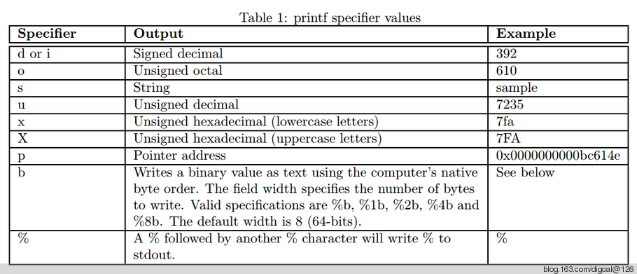
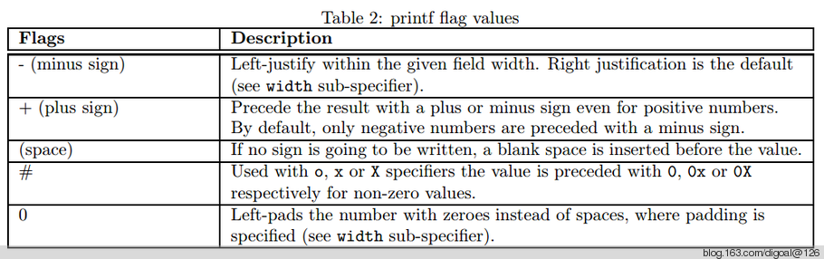
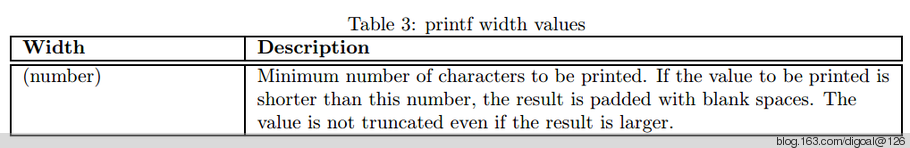
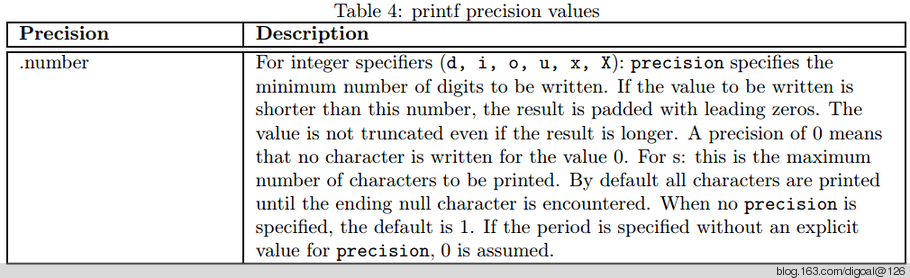

## Systemtap Formatted output  
                                   
### 作者                               
digoal                                 
                             
### 日期                                                
2013-10-10                             
                              
### 标签                             
PostgreSQL , Linux , systemtap , stap , dtrace , probe                              
                                                               
----                                       
                                                                           
## 背景          
```  
本文要讲的是Systemtap中的格式话输出函数 :   
print, println, printf, printd, printdln, sprint, sprintf.   
  
9.1 print  
print函数可用于打印输出任何类型,   
General syntax:  
print ()  
This function prints a single value of any type.  
例如 :   
[root@db-172-16-3-39 ~]# stap -e 'probe kernel.function("icmp_echo") {print($skb$$); exit()}'  
{.next=0x0, .prev=0x0, .sk=0x0, .tstamp={.off_sec=1381363468, .off_usec=801990}, .dev=0xffffffff80352b80, .input_dev=0xffffffff80352b80, .h={.th=0xffff810119cbd624, .uh=0xffff810119cbd624, .icmph=0xffff810119cbd624, .igmph=0xffff810119cbd624, .ipiph=0xffff810119cbd624, .ipv6h=0xffff810119cbd624, .raw="}, .nh={.iph=0xffff810119cbd610, .ipv6h=0xffff810119cbd610, .arph=0xffff810119cbd610, .raw="E"}, .mac={.raw=""}, .dst=0xffff8101e76eae40, .sp=0x0, .cb="", .len=56, .data_len=0, .mac_len=14, .csum=1265218710  
[root@db-172-16-3-39 ~]# stap -e 'global s; probe begin {for(i=0;i<100;i++) s <<< i; print(@hist_log(s)); exit()}'  
value |-------------------------------------------------- count  
    0 |@                                                   1  
    1 |@                                                   1  
    2 |@@                                                  2  
    4 |@@@@                                                4  
    8 |@@@@@@@@                                            8  
   16 |@@@@@@@@@@@@@@@@                                   16  
   32 |@@@@@@@@@@@@@@@@@@@@@@@@@@@@@@@@                   32  
   64 |@@@@@@@@@@@@@@@@@@@@@@@@@@@@@@@@@@@@               36  
  128 |                                                    0  
  256 |                                                    0  
这里的@hist_log使用printf的%s格式无法输出, 只有使用print才可以正常输出. 或者使用sprint进行转换(sprint后面会讲到)  
[root@db-172-16-3-39 ~]# stap -e 'global s; probe begin {for(i=0;i<100;i++) s <<< i; printf("%s", @hist_log(s)); exit()}'  
parse error: base histogram operator where expression expected  
        at: identifier '@hist_log' at <input>:1:65  
     source: global s; probe begin {for(i=0;i<100;i++) s <<< i; printf("%s", @hist_log(s)); exit()}  
                                                                             ^  
1 parse error.  
Pass 1: parse failed.  Try again with another '--vp 1' option.  
使用sprint将@hist_log的结果转换为字符串后, 可以使用printf的%s格式进行输出.  
[root@db-172-16-3-39 ~]# stap -e 'global s1; probe begin {for(i=0;i<100;i++) s1 <<< i; var=sprint(@hist_log(s1)); printf("%s\n", var); exit()}'  
value |-------------------------------------------------- count  
    0 |@                                                   1  
    1 |@                                                   1  
    2 |@@                                                  2  
    4 |@@@@                                                4  
    8 |@@@@@@@@                                            8  
   16 |@@@@@@@@@@@@@@@@                                   16  
   32 |@@@@@@@@@@@@@@@@@@@@@@@@@@@@@@@@                   32  
   64 |@@@@@@@@@@@@@  
  
9.2 printf  
printf函数用于格式化输出.    
General syntax:  
printf (fmt:string, ...)  
The printf function takes a formatting string as an argument, and a number of values of corresponding types, and prints them all.   
The format must be a literal string constant.   
The printf formatting directives are similar to those of C, except that they are fully checked for type by the translator.  
  
格式语法 :   
The formatting string can contain tags that are de?ned as follows:  
%[flags][width][.precision]specifier  
Where specifier is required and de?nes the type and the interpretation of the value of the corresponding argument.   
The following table shows the details of the speci?er parameter:  
格式包含有符号整型, 八进制, 字符串, 无符号整型, 无符号十六进制, 指针类型, 转码值(%b), %符号等.  
```  
  
  
  
```  
The tag can also contain flags, width, .precision and modifiers sub-speci?ers,   
which are optional and follow these speci?cations:  
flags包括格式左对齐, 右对齐, (%o,%x,%X的头0, 0x, 0X), 0代替空格等.  
width表示输出宽度. 不够长度的话以空格补齐. 如果输出长度超过指定的宽度, 不会进行截断.  
[root@db-172-16-3-39 ~]# stap -e 'probe begin {printf("%-10.d\n", 123); exit()}'  
123         
[root@db-172-16-3-39 ~]# stap -e 'probe begin {printf("%10.d\n", 123); exit()}'  
       123  
[root@db-172-16-3-39 ~]# stap -e 'probe begin {printf("%1.d\n", 123); exit()}'  
123  
[root@db-172-16-3-39 ~]# stap -e 'probe begin {printf("%-1.d\n", 123); exit()}'  
123  
[root@db-172-16-3-39 ~]# stap -e 'probe begin {printf("%#10.x\n", 123); exit()}'  
      0x7b  
精度(注意有数字和字符串格式之分) :   
For integer specifiers (d, i, o, u, x, X):   
precision specifies the minimum number of digits to be written.   
If the value to be written is shorter than this number, the result is padded with leading zeros.   
The value is not truncated even if the result is longer.   
A precision of 0 means that no character is written for the value 0.   
数字长度超出指定的精度时, 不会截断.  
[root@db-172-16-3-39 ~]# stap -e 'probe begin {printf("%.10d\n", 99999999); exit()}'  
0099999999  
[root@db-172-16-3-39 ~]# stap -e 'probe begin {printf("%.3d\n", 99999999); exit()}'  
99999999  
For s:   
this is the maximum number of characters to be printed.   
By default all characters are printed until the ending null character is encountered.   
When no precision is specified, the default is 1.   
If the period is specified without an explicit value for precision, 0 is assumed.   
字符串长度超出指定的精度时, 会截断.  
[root@db-172-16-3-39 ~]# stap -e 'probe begin {printf("%.1s\n", "hello world"); exit()}'  
h  
[root@db-172-16-3-39 ~]# stap -e 'probe begin {printf("%.10s\n", "hello world"); exit()}'  
hello worl  
```  
  
  
  
  
  
  
  
  
```  
Binary Write Examples :   
The following is an example of using the binary write functions:  
%b可以用于输出ascii值.  
[root@db-172-16-3-39 ~]# stap -e 'probe begin {  
> for (i = 97; i < 110; i++)  
> printf("%3d: %1b%1b%1b\n", i, i, i-32, i-64)  
> exit()  
> }'  
 97: aA!  
 98: bB"  
 99: cC#  
100: dD$  
101: eE%  
102: fF&  
103: gG'  
104: hH(  
105: iI)  
106: jJ*  
107: kK+  
108: lL,  
109: mM-  
Another example:  
[root@db-172-16-3-39 ~]# stap -e 'probe begin{printf("%b%b", 0xc0dedbad, 0x12345678);exit()}'| hexdump -C  
00000000  ad db de c0 00 00 00 00  78 56 34 12 00 00 00 00  |........xV4.....|  
00000010  
Another example:  
[root@db-172-16-3-39 ~]# stap -e 'probe begin{  
> printf("%1b%1b%1blo %1b%1brld\n", 72,101,108,87,111)  
> exit()  
> }'  
Hello World  
  
9.3 printd  
用于输出带分隔符的字符串.  
General syntax:  
printd (delimiter:string, ...)  
This function takes a string delimiter and two or more values of any type, then prints the values with the delimiter interposed.   
The delimiter must be a literal string constant.  
  
For example:  
printd("/", "one", "two", "three", 4, 5, 6)  
prints:  
one/two/three/4/5/6  
  
9.4 printdln  
General syntax:  
printdln (delimiter:string, ...)  
This function operates like printd, but also appends a newline.  
  
与printd类似, 只是末尾自动添加一个换行.  
[root@db-172-16-3-39 ~]# stap -e 'probe begin {printdln("/", "one", "two", "three", 4, 5, 6); exit()}'  
one/two/three/4/5/6  
[root@db-172-16-3-39 ~]#   
  
9.5 println  
General syntax:  
println ()  
This function prints a single value like print, but also appends a newline.  
  
println(), 就是带换行的print()  
[root@db-172-16-3-39 ~]# stap -e 'probe begin {print("hello"); exit()}'  
hello[root@db-172-16-3-39 ~]# stap -e 'probe begin {println("hello"); exit()}'  
hello  
  
9.6 sprint  
General syntax:  
sprint:string ()  
This function operates like print, but returns the string rather than printing it.  
  
sprint和print类似, 但是sprint不是将字符串输出到标准输出, 而是返回字符串.  
sprint不能单独执行, 需要赋值给变量.  
[root@db-172-16-3-39 ~]# stap -e 'probe begin {sprint("hello"); exit()}'  
WARNING: Eliding side-effect-free expression : identifier 'sprint' at <input>:1:14  
 source: probe begin {sprint("hello"); exit()}  
                      ^  
  
[root@db-172-16-3-39 ~]# stap -e 'probe begin {var=sprint("hello"); println(var); exit()}'  
hello  
需要把特殊的标准输出转换为字符串是可以考虑使用sprint, 例如本文中的@hist_log例子  
  
9.7 sprintf  
General syntax:  
sprintf:string (fmt:string, ...)  
This function operates like printf, but returns the formatted string rather than printing it.  
sprint和printf类似, 但是sprintf不是将字符串输出到标准输出, 而是返回字符串.  
```  
  
## 参考  
1\. https://sourceware.org/systemtap/langref.pdf  
  
<a rel="nofollow" href="http://info.flagcounter.com/h9V1"  ></a>  
  
  
  
  
  
  
## [digoal's 大量PostgreSQL文章入口](https://github.com/digoal/blog/blob/master/README.md "22709685feb7cab07d30f30387f0a9ae")
  
