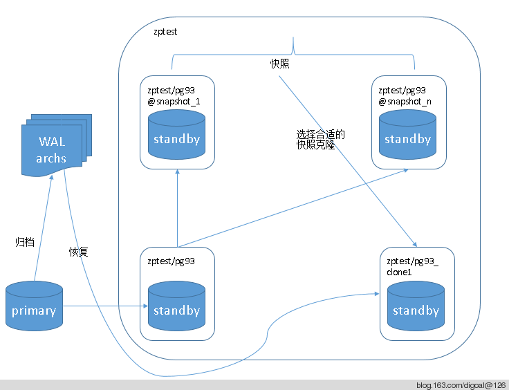

## ZFS snapshot used with PostgreSQL PITR or FAST degrade or PG-XC GreenPlum plproxy MPP DB's consistent backup  
                                                                                                                                                 
### 作者                                                                                                                                             
digoal                                                                                                                                               
                                                                                                                                           
### 日期                                                                                                                                                              
2014-05-18                                                                                                                                     
                                                                                                                                            
### 标签                                                                                                                                           
PostgreSQL , Linux , ZFS                                                                                                                                         
                                                                                                                                                                             
----                                                                                                                                                     
                                                                                                                                                                                         
## 背景          
```  
上一篇BLOG介绍了一下ZFS的使用, 以及zfs的log和l2arc机制带来的读写性能提升.  
本文将介绍一下ZFS的另一大功能, snapshot和clone. 结合PostgreSQL的PITR来使用, snapshot可以替换基础备份. 从而提高PostgreSQL恢复到过往时间点的速度(就近选择snapshot).  
同时还可以作为 PG-XC GreenPlum plproxy 等并行数据库解决方案的全局一致性备份, 对于pg-xc有冻结事务的功能, 所以可以不停库实现一致性备份, 对于greenplum和plproxy, 可以停库后做snapshot, 因为snapshot还是挺快的, 所以停库不需要多长时间. 这些快照可以在数据库起来后随时传输到备份环境, 不影响数据库运行, 当然传输过程会带来这个快照对应的数据块的读操作.  
  
首先回到上一篇创建的pool的地方.  
[root@db-172-16-3-150 ssd4]# /opt/zfs0.6.2/sbin/zpool create zptest /opt/zfs.disk1 /opt/zfs.disk2 /opt/zfs.disk3 /opt/zfs.disk4 log mirror /ssd4/zfs.log1 /ssd4/zfs.log2 cache /dev/disk/by-id/scsi-SATA_OCZ-REVODRIVE3_OCZ-Z2134R0TLQBNE659-part1  
  
[root@db-172-16-3-150 ssd4]# /opt/zfs0.6.2/sbin/zpool status zptest  
  pool: zptest  
 state: ONLINE  
  scan: none requested  
config:  
  
        NAME                STATE     READ WRITE CKSUM  
        zptest              ONLINE       0     0     0  
          /opt/zfs.disk1    ONLINE       0     0     0  
          /opt/zfs.disk2    ONLINE       0     0     0  
          /opt/zfs.disk3    ONLINE       0     0     0  
          /opt/zfs.disk4    ONLINE       0     0     0  
        logs  
          mirror-4          ONLINE       0     0     0  
            /ssd4/zfs.log1  ONLINE       0     0     0  
            /ssd4/zfs.log2  ONLINE       0     0     0  
        cache  
          sda1              ONLINE       0     0     0  
  
errors: No known data errors  
我们在上一篇是直接使用的pool, 这里要说一下, 在pool中创建dataset.  
[root@db-172-16-3-150 ~]# /opt/zfs0.6.2/sbin/zfs create zptest/dir1  
[root@db-172-16-3-150 ~]# /opt/zfs0.6.2/sbin/zfs list  
NAME          USED  AVAIL  REFER  MOUNTPOINT  
zptest        316K  3.81G    30K  /zptest  
zptest/dir1    30K  3.81G    30K  /zptest/dir1  
  
[root@db-172-16-3-150 ~]# df -h  
zptest/dir1           3.9G     0  3.9G   0% /zptest/dir1  
  
创建整个pool的snapshot或dataset的snapshot, snapshot格式如下 :   
pool/dataset@snapshot-name  
pool@snapshot-name  
例如, 我这里创建一个dataset的snapshot, 以时间命名.  
[root@db-172-16-3-150 ~]# /opt/zfs0.6.2/sbin/zfs snapshot zptest/dir1@`date +%F%T`  
[root@db-172-16-3-150 ~]# /opt/zfs0.6.2/sbin/zfs list -t snapshot  
NAME                             USED  AVAIL  REFER  MOUNTPOINT  
zptest/dir1@2014-05-1716:09:20      0      -    30K  -  
创建一个pool的snapshot.  
[root@db-172-16-3-150 ~]# /opt/zfs0.6.2/sbin/zfs snapshot zptest@`date +%F%T`  
[root@db-172-16-3-150 ~]# /opt/zfs0.6.2/sbin/zfs list -t snapshot  
NAME                             USED  AVAIL  REFER  MOUNTPOINT  
zptest@2014-05-1716:12:49           0      -    30K  -  
zptest/dir1@2014-05-1716:09:20      0      -    30K  -  
删除snapshot.  
[root@db-172-16-3-150 ~]# /opt/zfs0.6.2/sbin/zfs destroy zptest@2014-05-1716:12:49  
[root@db-172-16-3-150 ~]# /opt/zfs0.6.2/sbin/zfs destroy zptest/dir1@2014-05-1716:09:20  
[root@db-172-16-3-150 ~]# /opt/zfs0.6.2/sbin/zfs list -t snapshot  
no datasets available  
回滚到指定的snapshot.  
[root@db-172-16-3-150 ~]# df -h  
Filesystem            Size  Used Avail Use% Mounted on  
/dev/sdc1              29G  9.3G   19G  34% /  
tmpfs                  48G     0   48G   0% /dev/shm  
/dev/sdc3              98G   34G   59G  37% /opt  
/dev/sdd1             183G   33G  142G  19% /ssd1  
/dev/sdb1             221G   43G  167G  21% /ssd4  
/ssd4/test.img       1008M  207M  751M  22% /mnt  
zptest/dir1           3.9G     0  3.9G   0% /zptest/dir1  
[root@db-172-16-3-150 ~]# cd /zptest/dir1/  
[root@db-172-16-3-150 dir1]# ll  
total 0  
[root@db-172-16-3-150 dir1]# dd if=/dev/zero of=./1 bs=1k count=1024  
1024+0 records in  
1024+0 records out  
1048576 bytes (1.0 MB) copied, 0.0228468 s, 45.9 MB/s  
[root@db-172-16-3-150 dir1]# /opt/zfs0.6.2/sbin/zfs snapshot zptest/dir1@`date +%F%T`  
[root@db-172-16-3-150 dir1]# dd if=/dev/zero of=./2 bs=1k count=1024  
[root@db-172-16-3-150 dir1]# /opt/zfs0.6.2/sbin/zfs snapshot zptest/dir1@`date +%F%T`  
[root@db-172-16-3-150 dir1]# dd if=/dev/zero of=./3 bs=1k count=1024  
[root@db-172-16-3-150 dir1]# /opt/zfs0.6.2/sbin/zfs snapshot zptest/dir1@`date +%F%T`  
[root@db-172-16-3-150 dir1]# dd if=/dev/zero of=./4 bs=1k count=1024  
[root@db-172-16-3-150 dir1]# /opt/zfs0.6.2/sbin/zfs snapshot zptest/dir1@`date +%F%T`  
[root@db-172-16-3-150 dir1]# rm -f *  
[root@db-172-16-3-150 dir1]# ll  
total 0  
[root@db-172-16-3-150 dir1]# /opt/zfs0.6.2/sbin/zfs list -t snapshot  
NAME                             USED  AVAIL  REFER  MOUNTPOINT  
zptest/dir1@2014-05-1716:23:12    19K      -  1.03M  -  
zptest/dir1@2014-05-1716:23:19    19K      -  2.03M  -  
zptest/dir1@2014-05-1716:23:25    19K      -  3.04M  -  
zptest/dir1@2014-05-1716:23:30  1.02M      -  4.04M  -  
回滚前必须卸载对应的dataset或zpool, 并且只能回滚到最近的一个snapshot, 或者说, 要回滚到过去的snapshot, 必须删掉这个snapshot和当前之间的所有snapshot.  
[root@db-172-16-3-150 ~]# /opt/zfs0.6.2/sbin/zfs umount zptest/dir1  
[root@db-172-16-3-150 ~]# /opt/zfs0.6.2/sbin/zfs rollback zptest/dir1@2014-05-1716:23:25  
cannot rollback to 'zptest/dir1@2014-05-1716:23:25': more recent snapshots exist  
use '-r' to force deletion of the following snapshots:  
zptest/dir1@2014-05-1716:23:30  
这里提示删除1个snapshot, 因为这个snapshot是在回滚点后面创建的.  
使用-r自动删除.  
[root@db-172-16-3-150 ~]# /opt/zfs0.6.2/sbin/zfs rollback -r zptest/dir1@2014-05-1716:23:25  
[root@db-172-16-3-150 ~]# /opt/zfs0.6.2/sbin/zfs mount zptest/dir1  
[root@db-172-16-3-150 ~]# cd /zptest/dir1  
[root@db-172-16-3-150 dir1]# ll  
total 3080  
-rw-r--r-- 1 root root 1048576 May 17 16:22 1  
-rw-r--r-- 1 root root 1048576 May 17 16:23 2  
-rw-r--r-- 1 root root 1048576 May 17 16:23 3  
已经回到这个snapshot了.   
接下来要说的是clone, 因为snapshot一旦回滚后将丢失回滚点后面的所有文件系统的变更. 但是如果只想先看看这个snapshot是不是想要的, 那么可使用clone将一个snapshot克隆出来, 进行读写操作. 不是的话删掉clone即可.  
克隆必须在当前pool, 不能把克隆的集合放到其他pool里面. 例如我只创建了zptest这个pool, 可以把克隆后的目标放到同一个pool里面也就是zptest, 但是不能放到其他的pool, 例如zpool1.  
[root@db-172-16-3-150 dir1]# /opt/zfs0.6.2/sbin/zfs list -t snapshot  
NAME                             USED  AVAIL  REFER  MOUNTPOINT  
zptest/dir1@2014-05-1716:23:12    19K      -  1.03M  -  
zptest/dir1@2014-05-1716:23:19    19K      -  2.03M  -  
zptest/dir1@2014-05-1716:23:25    18K      -  3.04M  -  
克隆必须基于snapshot, 不能直接克隆dataset. 克隆后, 相当于新建了一个dataset.  
[root@db-172-16-3-150 dir1]# /opt/zfs0.6.2/sbin/zfs clone zptest/dir1 zptest/dir1_c1  
cannot open 'zptest/dir1': operation not applicable to datasets of this type  
[root@db-172-16-3-150 dir1]# /opt/zfs0.6.2/sbin/zfs clone zptest/dir1@2014-05-1716:23:12 zptest/dir1_c1  
[root@db-172-16-3-150 dir1]# df -h  
zptest/dir1           3.9G  3.0M  3.9G   1% /zptest/dir1  
zptest/dir1_c1        3.9G  1.0M  3.9G   1% /zptest/dir1_c1  
[root@db-172-16-3-150 dir1_c1]# /opt/zfs0.6.2/sbin/zfs list  
NAME             USED  AVAIL  REFER  MOUNTPOINT  
zptest          3.56M  3.81G    30K  /zptest  
zptest/dir1     3.09M  3.81G  3.04M  /zptest/dir1  
zptest/dir1_c1    18K  3.81G  1.03M  /zptest/dir1_c1  
[root@db-172-16-3-150 zptest]# cd /zptest/dir1_c1  
[root@db-172-16-3-150 dir1_c1]# ll  
total 1027  
-rw-r--r-- 1 root root 1048576 May 17 16:22 1  
你可以对这个clone出来的dataset进行读写.  
[root@db-172-16-3-150 dir1_c1]# cd /zptest/dir1_c1  
[root@db-172-16-3-150 dir1_c1]# cp 1 2  
[root@db-172-16-3-150 dir1_c1]# ll  
total 2053  
-rw-r--r-- 1 root root 1048576 May 17 16:22 1  
-rw-r--r-- 1 root root 1048576 May 17 16:57 2  
  
结合PostgreSQL的PITR来使用, 例如把$PGDATA放在dataset中, 对$PGDATA做基础备份可以通过对这个dataset做snapshot来达到目的, 但是建议在standby上这么做, 因为cow也是会带来额外的开销并且容易带来碎片的.  
另外一个建议在standby上做snapshot的原因是standby上的shared buffer中没有影响数据一致性的脏数据. 所以不需要执行pg_start_backup()直接创建snapshot即可, 如果在主库创建snapshot的话, 创建sanpshot前必须先执行pg_start_backup(), 在创建完snapshot后再执行pg_stop_backup().  
在standby上同时还需要使用archive_command将xlog归档, 这样的话在使用snapshot做PITR时可以用上需要的xlog.  
接下来我将演示一下使用场景.  
```  
  
  
  
```  
使用这种方法终于让PG可以和ORACLE一样有基于块增量备份了.   
  
注意, 使用clonerecovery时, 需要注意修改对应的archive command, 不要覆盖原有的wal.   
在普通目录初始化主库  
pg93@db-172-16-3-150-> initdb -D /ssd4/pg93/pg_root -E UTF8 --locale=C -U postgres -W  
pg93@db-172-16-3-150-> cd /ssd4/pg93/pg_root  
pg93@db-172-16-3-150-> cp /home/pg93/pgsql/share/recovery.conf.sample ./  
pg93@db-172-16-3-150-> mv recovery.conf.sample recovery.done  
pg93@db-172-16-3-150-> vi pg_hba.conf  
host all all 0.0.0.0/0 md5  
host replication postgres 127.0.0.1/32 trust  
pg93@db-172-16-3-150-> vi postgresql.conf  
listen_addresses = '0.0.0.0'            # what IP address(es) to listen on;  
port = 1921                             # (change requires restart)  
max_connections = 100                   # (change requires restart)  
superuser_reserved_connections = 13     # (change requires restart)  
unix_socket_directories = '.'   # comma-separated list of directories  
tcp_keepalives_idle = 60                # TCP_KEEPIDLE, in seconds;  
tcp_keepalives_interval = 10            # TCP_KEEPINTVL, in seconds;  
tcp_keepalives_count = 10               # TCP_KEEPCNT;  
shared_buffers = 1024MB                 # min 128kB  
maintenance_work_mem = 512MB            # min 1MB  
vacuum_cost_delay = 10                  # 0-100 milliseconds  
vacuum_cost_limit = 10000               # 1-10000 credits  
bgwriter_delay = 10ms                   # 10-10000ms between rounds  
wal_level = hot_standby                 # minimal, archive, or hot_standby  
synchronous_commit = off                # synchronization level;  
wal_writer_delay = 10ms         # 1-10000 milliseconds  
checkpoint_segments = 64                # in logfile segments, min 1, 16MB each  
archive_mode = on               # allows archiving to be done  
archive_command = '/usr/bin/test ! -f /ssd1/pg93/arch/%f && /bin/cp %p /ssd1/pg93/arch/%f'  
max_wal_senders = 32            # max number of walsender processes  
wal_keep_segments = 128         # in logfile segments, 16MB each; 0 disables  
hot_standby = on                        # "on" allows queries during recovery  
max_standby_archive_delay = 300s        # max delay before canceling queries  
max_standby_streaming_delay = 300s      # max delay before canceling queries  
wal_receiver_status_interval = 1s       # send replies at least this often  
hot_standby_feedback = on               # send info from standby to prevent  
effective_cache_size = 96000MB  
log_destination = 'csvlog'              # Valid values are combinations of  
logging_collector = on          # Enable capturing of stderr and csvlog  
log_truncate_on_rotation = on           # If on, an existing log file with the  
log_checkpoints = on  
log_connections = on  
log_disconnections = on  
log_error_verbosity = verbose           # terse, default, or verbose messages  
log_statement = 'ddl'                   # none, ddl, mod, all  
log_timezone = 'PRC'  
log_autovacuum_min_duration = 0 # -1 disables, 0 logs all actions and  
datestyle = 'iso, mdy'  
timezone = 'PRC'  
lc_messages = 'C'                       # locale for system error message  
lc_monetary = 'C'                       # locale for monetary formatting  
lc_numeric = 'C'                        # locale for number formatting  
lc_time = 'C'                           # locale for time formatting  
default_text_search_config = 'pg_catalog.english'  
  
pg93@db-172-16-3-150-> vi recovery.done  
recovery_target_timeline = 'latest'  
standby_mode = on  
primary_conninfo = 'host=127.0.0.1 port=1922 user=postgres keepalives_idle=60'  
  
pg93@db-172-16-3-150-> pg_ctl start -D /ssd4/pg93/pg_root  
  
创建归档目录  
[root@db-172-16-3-150 pg93]# mkdir -p /ssd1/pg93/arch  
[root@db-172-16-3-150 pg93]# chown pg93:pg93 /ssd1/pg93/arch  
  
创建zpool, dataset. 准备给standby使用.  
[root@db-172-16-3-150 ssd1]# df -h  
Filesystem            Size  Used Avail Use% Mounted on  
/dev/sdc1              29G  9.3G   19G  34% /  
tmpfs                  48G     0   48G   0% /dev/shm  
/dev/sdc3              98G   30G   63G  33% /opt  
/dev/sdd1             183G  5.4G  169G   4% /ssd1  
/dev/sdb1             221G   42G  168G  20% /ssd4  
  
[root@db-172-16-3-150 ssd1]# cd /ssd1  
[root@db-172-16-3-150 ssd1]# dd if=/dev/zero of=./zfs.disk1 bs=1024k count=8192   
8192+0 records in  
8192+0 records out  
8589934592 bytes (8.6 GB) copied, 10.1841 s, 843 MB/s  
[root@db-172-16-3-150 ssd1]# cp zfs.disk1 zfs.disk2  
[root@db-172-16-3-150 ssd1]# cp zfs.disk1 zfs.disk3  
[root@db-172-16-3-150 ssd1]# cp zfs.disk1 zfs.disk4  
  
[root@db-172-16-3-150 ssd1]# cd /ssd4  
[root@db-172-16-3-150 ssd4]# dd if=/dev/zero of=./zfs.log1 bs=1024k count=8192  
[root@db-172-16-3-150 ssd4]# cp zfs.log1 zfs.log2  
  
[root@db-172-16-3-150 ssd4]# ll /dev/disk/by-id/|grep sda  
lrwxrwxrwx 1 root root  9 May 16 21:48 ata-OCZ-REVODRIVE3_OCZ-Z2134R0TLQBNE659 -> ../../sda  
lrwxrwxrwx 1 root root 10 May 16 21:48 ata-OCZ-REVODRIVE3_OCZ-Z2134R0TLQBNE659-part1 -> ../../sda1  
lrwxrwxrwx 1 root root  9 May 16 21:48 scsi-SATA_OCZ-REVODRIVE3_OCZ-Z2134R0TLQBNE659 -> ../../sda  
lrwxrwxrwx 1 root root 10 May 16 21:48 scsi-SATA_OCZ-REVODRIVE3_OCZ-Z2134R0TLQBNE659-part1 -> ../../sda1  
lrwxrwxrwx 1 root root  9 May 16 21:48 wwn-0x5e83a97e827c316e -> ../../sda  
lrwxrwxrwx 1 root root 10 May 16 21:48 wwn-0x5e83a97e827c316e-part1 -> ../../sda1  
  
[root@db-172-16-3-150 ssd4]# zpool create zptest /ssd1/zfs.disk1 /ssd1/zfs.disk2 /ssd1/zfs.disk3 /ssd1/zfs.disk4 log mirror /ssd4/zfs.log1 /ssd4/zfs.log2 cache /dev/disk/by-id/wwn-0x5e83a97e827c316e-part1  
  
[root@db-172-16-3-150 ssd4]# zfs create zptest/pg93  
[root@db-172-16-3-150 ssd4]# df -h  
Filesystem            Size  Used Avail Use% Mounted on  
/dev/sdc1              29G  9.3G   19G  34% /  
tmpfs                  48G     0   48G   0% /dev/shm  
/dev/sdc3              98G   30G   63G  33% /opt  
/dev/sdd1             183G   38G  137G  22% /ssd1  
/dev/sdb1             221G   56G  154G  27% /ssd4  
zptest                 32G  128K   32G   1% /zptest  
zptest/pg93            32G  128K   32G   1% /zptest/pg93  
  
[root@db-172-16-3-150 ssd4]# chown -R pg93:pg93 /zptest/pg93  
  
在dataset中创建备库, 配置归档.  
pg93@db-172-16-3-150-> psql -h 127.0.0.1 -p 1921 -U postgres postgres  
psql (9.3.3)  
Type "help" for help.  
postgres=# select pg_start_backup(now()::text);  
 pg_start_backup   
-----------------  
 0/2000028  
(1 row)  
  
postgres=# \q  
    
pg93@db-172-16-3-150-> cp -r /ssd4/pg93/pg_root /zptest/pg93/  
pg93@db-172-16-3-150-> psql -h 127.0.0.1 -p 1921 -U postgres postgres  
psql (9.3.3)  
Type "help" for help.  
  
postgres=# select pg_stop_backup();  
NOTICE:  pg_stop_backup complete, all required WAL segments have been archived  
 pg_stop_backup   
----------------  
 0/20000F0  
(1 row)  
  
pg93@db-172-16-3-150-> cd /zptest/pg93/pg_root/  
pg93@db-172-16-3-150-> vi postgresql.conf   
port = 1922  
# archive_command = '/usr/bin/test ! -f /ssd1/pg93/arch/%f && /bin/cp %p /ssd1/pg93/arch/%f'  # 不注释也没有关系, standby不会触发archive主进程  
原因如下, 只有数据库是RUN状态时才能触发pgarch_start() , 或者加上PM_HOT_STANDBY, PM_RECOVERY状态, 那么在hotstandby中也可以执行归档:   
src/backend/postmaster/postmaster.c  
                /* If we have lost the archiver, try to start a new one */  
                if (XLogArchivingActive() && PgArchPID == 0 && pmState == PM_RUN)  
                        PgArchPID = pgarch_start();  
数据库的几种状态 :   
typedef enum  
{  
        PM_INIT,                                        /* postmaster starting */  
        PM_STARTUP,                                     /* waiting for startup subprocess */  
        PM_RECOVERY,                            /* in archive recovery mode */  
        PM_HOT_STANDBY,                         /* in hot standby mode */  
        PM_RUN,                                         /* normal "database is alive" state */  
        PM_WAIT_BACKUP,                         /* waiting for online backup mode to end */  
        PM_WAIT_READONLY,                       /* waiting for read only backends to exit */  
        PM_WAIT_BACKENDS,                       /* waiting for live backends to exit */  
        PM_SHUTDOWN,                            /* waiting for checkpointer to do shutdown  
                                                                 * ckpt */  
        PM_SHUTDOWN_2,                          /* waiting for archiver and walsenders to  
                                                                 * finish */  
        PM_WAIT_DEAD_END,                       /* waiting for dead_end children to exit */  
        PM_NO_CHILDREN                          /* all important children have exited */  
} PMState;  
  
  
pg93@db-172-16-3-150-> mv recovery.done recovery.conf  
pg93@db-172-16-3-150-> vi recovery.conf  
primary_conninfo = 'host=127.0.0.1 port=1921 user=postgres keepalives_idle=60'  
  
pg93@db-172-16-3-150-> rm -f postmaster.pid  
pg93@db-172-16-3-150-> pg_ctl start -D /zptest/pg93/pg_root  
  
使用pgbench给主库施加读写测试  
pg93@db-172-16-3-150-> psql -h 127.0.0.1 -p 1921 -U postgres postgres  
psql (9.3.3)  
Type "help" for help.  
  
postgres=# create table test(id int primary key, info text, crt_time timestamp);  
CREATE TABLE  
postgres=# create or replace function f_test(v_id int) returns void as $$  
declare  
begin  
  update test set info=md5(random()::text),crt_time=now() where id=v_id;  
  if not found then   
    insert into test values (v_id, md5(random()::text), now());  
  end if;  
  exception when SQLSTATE '23505' then  
    return;  
end;  
$$ language plpgsql strict;  
CREATE FUNCTION  
  
pg93@db-172-16-3-150-> cd ~  
pg93@db-172-16-3-150-> vi test.sql  
\setrandom id 1 500000  
select f_test(:id);  
  
pg93@db-172-16-3-150-> pgbench -M prepared -n -r -f ./test.sql -h 127.0.0.1 -p 1921 -U postgres -c 16 -j 8 -T 3000 postgres  
  
周期性的创建snapshot, snapshot并不会占用太多空间, 而且一个pool可以有2^64个snapshot, 足够用了, 所以可以多建立一些,  
例如每半个小时创建一个. (根据情况而定)  
# zfs snapshot zptest/pg93@`date +%F%T`  
查看snapshot空间占用情况.  
[root@db-172-16-3-150 ~]# zfs list -t snapshot  
NAME                             USED  AVAIL  REFER  MOUNTPOINT  
zptest/pg93@2014-05-1721:54:55   143M      -   185M  -  
zptest/pg93@2014-05-1723:17:23  99.0M      -  3.65G  -  
zptest/pg93@2014-05-1723:18:11  5.10M      -  3.65G  -  
zptest/pg93@2014-05-1723:35:32   214M      -  3.65G  -  
  
使用snapshot创建克隆, 并结合PostgreSQL PITR, 将数据库恢复到一个指定的状态.  
例如使用倒数第二个snapshot来克隆.  
[root@db-172-16-3-150 ~]# zfs clone zptest/pg93@2014-05-1723:18:11 zptest/pg93_clone1  
[root@db-172-16-3-150 ~]# df -h  
Filesystem            Size  Used Avail Use% Mounted on  
/dev/sdc1              29G  9.3G   19G  34% /  
tmpfs                  48G     0   48G   0% /dev/shm  
/dev/sdc3              98G   30G   63G  33% /opt  
/dev/sdd1             183G   41G  133G  24% /ssd1  
/dev/sdb1             221G   39G  171G  19% /ssd4  
zptest                 24G  128K   24G   1% /zptest  
zptest/pg93            28G  3.7G   24G  14% /zptest/pg93  
zptest/pg93_clone1     28G  3.7G   24G  14% /zptest/pg93_clone1  
修改必要的配置文件  
[root@db-172-16-3-150 ~]# su - pg93  
pg93@db-172-16-3-150-> cd /zptest/pg93_clone1/pg_root  
port = 1923  
# archive_command  #注释  
选择一个合适的还原点, 以时间为还原点最好确认 :   
pg93@db-172-16-3-150-> vi recovery.conf  
restore_command = 'cp /ssd1/pg93/arch/%f %p'            # e.g. 'cp /mnt/server/archivedir/%f %p'  
recovery_target_time = '2014-05-17 23:19:00.203219+08'  
recovery_target_timeline = 'latest'  
pause_at_recovery_target = true  
standby_mode = on  
  
pg93@db-172-16-3-150-> rm -f postmaster.pid  
pg93@db-172-16-3-150-> pg_ctl start -D /zptest/pg93_clone1/pg_root  
server starting  
pg93@db-172-16-3-150-> LOG:  00000: redirecting log output to logging collector process  
HINT:  Future log output will appear in directory "pg_log".  
LOCATION:  SysLogger_Start, syslogger.c:649  
  
一段时间后查看是否恢复到指定时间点.  
pg93@db-172-16-3-150-> psql -h 127.0.0.1 -p 1923 -U postgres postgres  
psql (9.3.3)  
Type "help" for help.  
postgres=# select max(crt_time) from test;  
            max              
---------------------------  
 2014-05-17 23:19:00.20281  
(1 row)  
  
如果觉得这个快照不合适, 可以关闭数据库后删掉它.  
pg93@db-172-16-3-150-> pg_ctl stop -m fast -D /zptest/pg93_clone1/pg_root  
[root@db-172-16-3-150 ~]# zfs destroy zptest/pg93_clone1  
  
最后说一下zpool的扩容, 增加磁盘即可. 最好选择和POOL中已存在磁盘容量大小, 性能一致的磁盘.  
[root@db-172-16-3-150 ssd1]# cd /ssd1  
[root@db-172-16-3-150 ssd1]# dd if=/dev/zero of=./zfs.disk5 bs=1024k count=8192  
[root@db-172-16-3-150 ssd1]# zpool add zptest /ssd1/zfs.disk5  
[root@db-172-16-3-150 ssd1]# zpool status zptest  
  pool: zptest  
 state: ONLINE  
  scan: none requested  
config:  
  
        NAME                            STATE     READ WRITE CKSUM  
        zptest                          ONLINE       0     0     0  
          /ssd1/zfs.disk1               ONLINE       0     0     0  
          /ssd1/zfs.disk2               ONLINE       0     0     0  
          /ssd1/zfs.disk3               ONLINE       0     0     0  
          /ssd1/zfs.disk4               ONLINE       0     0     0  
          /ssd1/zfs.disk5               ONLINE       0     0     0  
        logs  
          mirror-4                      ONLINE       0     0     0  
            /ssd4/zfs.log1              ONLINE       0     0     0  
            /ssd4/zfs.log2              ONLINE       0     0     0  
        cache  
          wwn-0x5e83a97e827c316e-part1  ONLINE       0     0     0  
  
errors: No known data errors  
[root@db-172-16-3-150 ssd1]# df -h  
Filesystem            Size  Used Avail Use% Mounted on  
/dev/sdc1              29G  9.3G   19G  34% /  
tmpfs                  48G     0   48G   0% /dev/shm  
/dev/sdc3              98G   30G   63G  33% /opt  
/dev/sdd1             183G   53G  122G  30% /ssd1  
/dev/sdb1             221G   39G  171G  19% /ssd4  
zptest                 29G  128K   29G   1% /zptest  
zptest/pg93            33G  3.7G   29G  12% /zptest/pg93  
zptest/pg93_clone1     33G  3.7G   29G  12% /zptest/pg93_clone1  
```  
  
## 其他  
1\. 其实zfs的快照在数据库版本升级, 做重大调整时用作快速回滚也是很有用的. 例如greenplum的版本升级, 可以在停库后对所有节点的dataset创建快照, 再升级, 如果升级失败, 全部回滚到快照即可.  
  
## 参考  
1\. http://blog.163.com/digoal@126/blog/static/163877040201441694022110/  
    
  
<a rel="nofollow" href="http://info.flagcounter.com/h9V1"  ></a>  
  
  
  
  
  
  
## [digoal's 大量PostgreSQL文章入口](https://github.com/digoal/blog/blob/master/README.md "22709685feb7cab07d30f30387f0a9ae")
  
