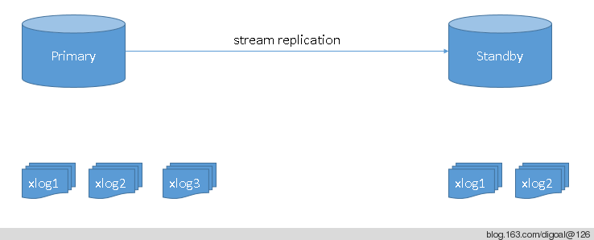
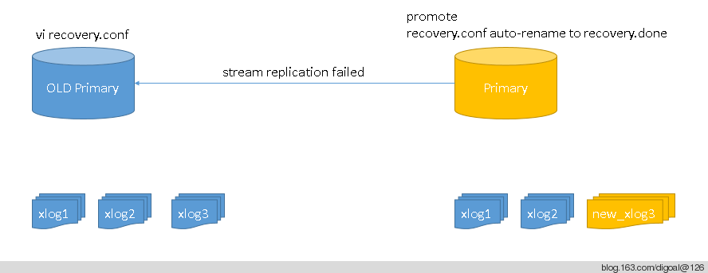
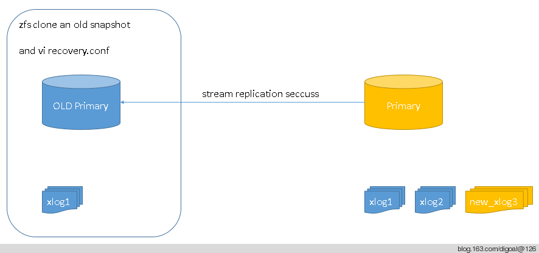

## use zfs snapshot rollback postgresql's primary to old status in PG HA  
                                                                                                                                                               
### 作者                                                                                                                                                           
digoal                                                                                                                                                             
                                                                                                                                                         
### 日期                                                                                                                                                                            
2014-05-19                                                                                                                                                   
                                                                                                                                                          
### 标签                                                                                                                                                         
PostgreSQL , Linux , ZFS                                                                                                                                                       
                                                                                                                                                                                           
----                                                                                                                                                                   
                                                                                                                                                                                                       
## 背景       
前几天讲过zfs的snapshot用作PostgreSQL PITR, 使用接近还原点的snapshot可以减少xlog的apply, 缩短数据库的恢复时间.  
  
其实snapshot还有一个作用, 用作流复制HA的主备角色切换后避免因为XLOG的差异导致old primary无法切换成standby角色.  
  
例如  :   
  
一个PG 流复制的HA场景如下 :   
  
  
  
在发生failover后, standby节点切换成主节点, 老的主节点切换成standby节点.  
  
但是由于standby节点和老的主节点存在差异, (即只接收了部分XLOG), 那么STANDBY激活后实际上是从primary节点的过去状态开始了新的读写, 所以primary节点不能直接切换成standby节点.  
  
  
  
如果primary节点有snapshot的话, 可以回到以往的snapshot, 使用rollback或者使用clone都没有问题. 只是clone更保险一点, 因为还能回来, 完全OK后可以删掉其他的dataset.  
  
注意必须回到一个节点并且所有的xlog都在新的primary可以找到.  
  
  
   
这种问题的另外一种解决办法是使用rsync , 这也是pgpool-II中的用法, 但是rsync对于比较大的数据库, 开销一是很大的, 因为所有的文件都要读一遍, 技术checksum, 然后与本地文件的checksum进行比对. 所以不推荐使用rsync.  
  
## 参考  
1\. http://blog.163.com/digoal@126/blog/static/163877040201441723450443/  
      
        
  
  
  
  
  
  
  
  
## [digoal's 大量PostgreSQL文章入口](https://github.com/digoal/blog/blob/master/README.md "22709685feb7cab07d30f30387f0a9ae")
  
