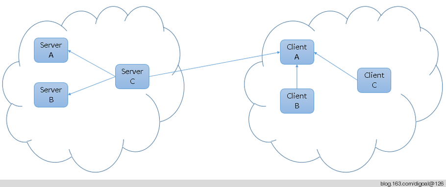
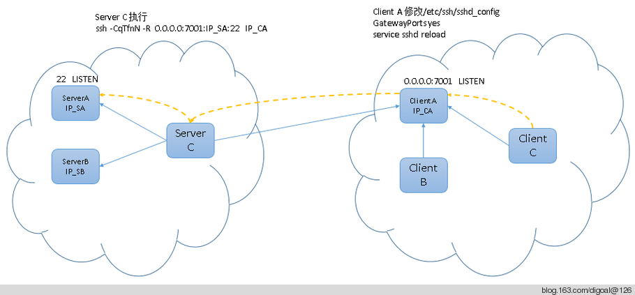
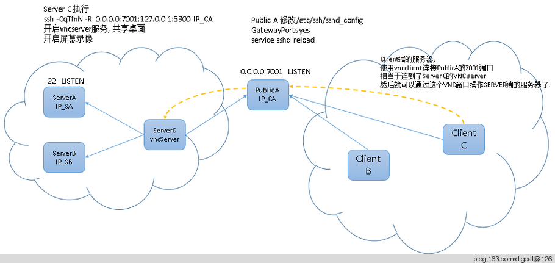
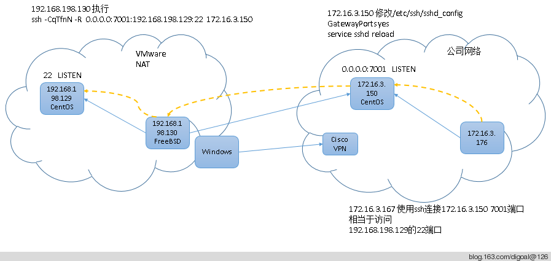

## 使用 ssh -R 建立反向/远程TCP端口转发代理  
                                   
### 作者                                   
digoal                                    
                                      
### 日期                                    
2014-06-14                                                            
                                    
### 标签                                                                                                                                                    
Linux , ssh , 反向代理 , 远程端口转发              
                                
----                                    
                                  
## 背景       
ssh是一个非常棒的工具, 不但能建立动态转发, 例如chrome的Switchy插件用到的就是这个技术.  
  
http://blog.163.com/digoal@126/blog/static/163877040201141821810103/  
  
还能建立TCP的转发隧道, 例如我以前写过的关于使用ssh 隧道加密和加速WAN传输的几个例子.  
  
http://blog.163.com/digoal@126/blog/static/163877040201342383123592/  
  
http://blog.163.com/digoal@126/blog/static/16387704020115294425540/  
  
上面的例子可以理解为正向的TCP端口转发代理(如local$ ssh -L 7001:1.1.1.1:1000 remote_A), 即本地服务器local建立和远程服务器的SSH连接, 本地监听一个端口7001, 连接本地的监听端口7001相当于"通过远程服务器remote_A访问指定的IP 1.1.1.1和PORT 1000".  
  
这种方法适用于本地网络中其他服务器想访问远程的服务器, 但是其他服务器没有直接访问远程服务器的权限, 通过本地网络中有权限的服务器做端口转发的场景.  
  
还有一种应用场景是这样的, 本地网络环境中没有任何一台服务器可以直接访问远程服务器, 但是远程服务器可以反过来访问本地的某台服务器, 这样的话也能实现本地服务器去访问远程服务器的目的. 这就是反向代理.  
  
实际的应用场景如,   
  
1\. 家里的网络是动态拨号网络, 没有固定IP, 如果想在上班的时候控制家里的电脑怎么办呢? 如果公司有一台服务器是可以在家拨号过去访问的, 那么你可以在家里的电脑上建立和这台公司服务器的反向代理, 到公司后, 就可以连接这台服务器上的反向代理(监听)来连接家里的电脑了.  
  
2\. 有的客户可能不希望提供VPN给你去访问他们的服务器, 但是又需要得到你的远程协助, 怎么办呢?  
  
你可以提供一台服务器让客户主动来访问你的服务器, 客户建立这样的反向代理, 然后你通过这个反向代理来连接客户开放的端口如VNC桌面共享, 进行远程协助. (这种方法比QQ远程协助是更安全的, 因为客户和这台服务器之间的数据时加密的, QQ远程协助毕竟有一定的风险存在.)  
  
## 正文
以下是反向代理的图例, 如图1 :   
  
箭头表示允许访问的方向, 也就是说Server C可以访问Server A和Server B以及Client A.  
  
而Client B和Client C可以访问Client A.  
  
我们的目的是要让Client 可以访问Server. 这里就要用到SSH的反向端口转发, 或远程端口转发.  
  
    
  
反向代理应用场景.  
  
例如, 以下虚线表示Client C最终要访问Server A的22端口.  
  
实现的步骤  
  
1\. Client A需要修改一下sshd_config, 开启GatewayPorts, 这样才能监听回环地址以外的地址, 如0.0.0.0, 这样的话其他服务器才能访问到这个端口.  
  
2\. Server C建立和Client A的反向端口转发, 让Client A在0.0.0.0上监听7001端口, 访问这个端口的数据转发到IP_SA的22端口.  
  
```  
ssh -CqTfnN -R  0.0.0.0:7001:IP_SA:22   IP_CA  
```  
  
其实再深层次一点,  因为client c和server a已经可以建立ssh了, 那么通过client c和server a建立反向代理, Server A也可以访问Client c. 这样需要经过了多层ssh隧道( IP_CA->IP_SC, IP_SA->IP_CC )  
  
    
  
这种反向代理的用法很容易应用到实际的场景中, 例如前面提到的 :  
  
有的客户可能不希望提供VPN给你去访问他们的服务器, 但是又需要得到你的远程协助, 怎么办呢?  
  
你可以提供一台服务器让客户主动来访问你的服务器, 客户建立这样的反向代理, 然后你通过这个反向代理来连接客户开放的端口如VNC桌面共享, 进行远程协助.  
  
如图 :   
  
Public A是一台公用主机, 可以被客户和服务提供商同时访问.  
  
当客户需要远程协助时.  
  
1\. 客户在SERVER C上开启一个VNC server  
  
2\. 客户将需要远程协助的窗口先登录好, 例如某些内网服务器(SERVER A , SERVER B)的telnet或ssh终端. 以供服务提供商使用.  
  
3\. 客户在SERVER C主动建立和这台公用主机的反向代理, 将端口转发到server c的vnc监听端口.  
  
4\. 服务提供商使用VNC客户端连接这台公共服务器的SSH代理监听端口, 相当于连接到了server c的vnc server. 以提供远程协助.  
  
5\. 客户可以在server c上观看, 录像, 控制这个VNC会话等.  
  
    
  
下面来举个例子 :   
  
场景 :   
  
家里有一台WINDOWS服务器, 通过VPN拨号到公司网络.  
  
WINDOWS服务器上跑了两个VMWARE的虚拟机, 分别是FreeBSD和CentOS.  
  
公司有1台主机172.16.3.150, 安装了CentOS,   
  
拨号后, 家里的虚拟机FreeBSD可以访问172.16.3.150.  
  
现在要让公司的其他服务器如172.16.3.167可以访问到家里的192.168.198.129虚拟机.  
  
    
  
简单步骤.  
  
1\. 拨号, 略  
  
2\. 172.16.3.150上需要修改sshd_config.  
  
```  
[root@db-172-16-3-150 ~]# vi /etc/ssh/sshd_config  
GatewayPorts yes  
[root@db-172-16-3-150 ~]# service sshd reload  
Reloading sshd: [  OK  ]  
```  
  
3\. 通过虚拟机192.168.198.130连接到172.16.3.150开启反向端口代理. (如果130不是LINUX是WINDOWS, 也可以用securecrt类似的软件进行代理配置.)  
  
```  
root@digoal:~ # ssh -CqTfnN -R 0.0.0.0:7001:192.168.198.129:22 172.16.3.150  
root@172.16.3.150's password:   
```  
  
4\. 在172.16.3.150上可以看到这个监听.  
  
```  
[root@db-172-16-3-150 ~]# netstat -anp|grep 7001  
tcp        0      0 0.0.0.0:7001                0.0.0.0:*                   LISTEN      2392/sshd    
tcp        0      0 :::7001                     :::*                        LISTEN      2392/sshd     
```  
  
5\. 现在到172.16.3.167上连接172.16.3.150的7001端口.  
  
```  
[root@db5 ~]# ifconfig  
bond0     Link encap:Ethernet  HWaddr 00:23:7D:A3:F0:4E    
          inet addr:172.16.3.176  Bcast:172.16.3.255  Mask:255.255.255.0  
          inet6 addr: fe80::223:7dff:fea3:f04e/64 Scope:Link  
          UP BROADCAST RUNNING MASTER MULTICAST  MTU:1500  Metric:1  
          RX packets:200422824 errors:0 dropped:0 overruns:0 frame:0  
          TX packets:16849618 errors:0 dropped:0 overruns:0 carrier:0  
          collisions:0 txqueuelen:0   
          RX bytes:23012276676 (21.4 GiB)  TX bytes:3567071726 (3.3 GiB)  
  
[root@db5 ~]# ping 172.16.3.150  
PING 172.16.3.150 (172.16.3.150) 56(84) bytes of data.  
64 bytes from 172.16.3.150: icmp_seq=1 ttl=64 time=0.337 ms  
  
--- 172.16.3.150 ping statistics ---  
1 packets transmitted, 1 received, 0% packet loss, time 0ms  
rtt min/avg/max/mdev = 0.337/0.337/0.337/0.000 ms  
  
[root@db5 ~]# ssh -p 7001 172.16.3.150  
Password for root@digoal.org:  
  
root@digoal:~ # ifconfig  
em0: flags=8843<UP,BROADCAST,RUNNING,SIMPLEX,MULTICAST> metric 0 mtu 1500  
        options=9b<RXCSUM,TXCSUM,VLAN_MTU,VLAN_HWTAGGING,VLAN_HWCSUM>  
        ether 00:0c:29:c0:4b:65  
        inet 192.168.198.129 netmask 0xffffff00 broadcast 192.168.198.255   
        nd6 options=29<PERFORMNUD,IFDISABLED,AUTO_LINKLOCAL>  
        media: Ethernet autoselect (1000baseT <full-duplex>)  
        status: active  
```  
  
到这里反向代理的测试完成.  
  
接下来我们看看如何在反向代理的基础上, 再做一层反向代理.  
  
例如我要在172.16.3.167建立和192.168.198.129的反向代理, 让192.168.198.130通过192.168.198.129来访问172.16.3.150.  
  
1\. 首先要修改192.168.198.129的sshd_config  
  
```  
root@digoal:~ # vi /etc/ssh/sshd_config  
GatewayPorts yes   
root@digoal:~ # service sshd reload  
Performing sanity check on sshd configuration.  
root@digoal:~ # exit  
logout  
Connection to 172.16.3.150 closed.  
```  
  
2\. 在172.16.3.167建立和192.168.198.129的反向代理  
  
```  
[root@db5 ~]# ssh -CqTfnN -p 7001 -R 0.0.0.0:7001:172.16.3.150:22 172.16.3.150  
Password for root@digoal.org:  
```  
  
3\. 在192.168.198.129上查看监听.  
  
```  
root@digoal:~ # netstat -AaLnSTW  
Current listen queue sizes (qlen/incqlen/maxqlen)  
Tcpcb            Proto Listen         Local Address           
fffff800076ce800 tcp4  0/0/128        *.7001   
```  
  
4\. 在192.168.198.130上通过192.168.198.129:7001来访问172.16.3.150:22.  
  
```  
[root@digoal ~]# ssh -p 7001 192.168.198.129  
The authenticity of host '[192.168.198.129]:7001 ([192.168.198.129]:7001)' can't be established.  
RSA key fingerprint is 01:0b:96:e1:a8:be:a3:a3:69:a4:0a:11:5d:2a:6f:c2.  
Are you sure you want to continue connecting (yes/no)? yes  
Warning: Permanently added '[192.168.198.129]:7001' (RSA) to the list of known hosts.  
root@192.168.198.129's password:   
Last login: Sat Jun 14 18:20:23 2014 from 10.0.0.60  
[root@db-172-16-3-150 ~]#   
```  
  
## 注意  
1\. 当使用vncserver共享桌面时, 有几点需要注意, 需要使用或勾选Shared connection选项, 否则一个连上来, 其他的就会断掉.  
  
2\. 使用vncserver共享桌面, 只要把5901端口共享出来就可以了.  
  
例如  
  
在172.16.3.150建立和172.16.3.221的反向隧道, 代理VNCSERVER端口的反向转发.  
  
```  
# ssh -CqTfnN -p 22 -R 0.0.0.0:5901:172.16.3.150:5901 172.16.3.221  
```  
  
这个使用的是172.16.3.221:5901来代理172.16.3.150:5901  
  
在172.16.3.150开启一个vncserver, 让A主机可以连到这个vncserver.  
  
在A主机开启一个vncviewer, 并打开共享连接, 连接到172.16.3.150:5901  
  
在B主机开启一个vncviewer, 并打开共享连接, 连接到172.16.3.221:5901  
  
最终, A变成了监控机, B是操作方.  
  
B的操作, A可以在VNCVIEWER观看到.  
  
使用完成后, 断开172.16.3.150和172.16.3.221的连接即可, 或者关闭172.16.3.150的vncserver服务即可. vncserver -kill :?.  
  
3\. 如果是跨广域网的隧道, 中间经过的某些网络设备可能会有会话空闲自动断开机制, 为了确保隧道不会被这种机制自动干掉, 我们可以设置一下SSH连接的心跳.  
  
```  
# sysctl -w net.ipv4.tcp_keepalive_time=30  
net.ipv4.tcp_keepalive_time = 30  
# ssh -CqTfnN -o TCPKeepAlive=yes -o ServerAliveInterval=10 -o ServerAliveCountMax=10 -p 22 -R 0.0.0.0:5901:172.16.3.150:5901 目标IP  
```  
  
现在TCP的心跳时间缩短了, 空闲会自动发送TCP心跳包.  
  
```  
[root@150 ~]# netstat -anpo|grep ssh  
tcp        0      0 0.0.0.0:22                  0.0.0.0:*                   LISTEN      2699/sshd           off (0.00/0/0)  
tcp        0      0 172.16.3.150:62230          目标IP:22          ESTABLISHED 21721/ssh           keepalive (21.48/0/0)  
```  
  
4\. 如果目标机的5901端口监听被占用了, 可以换个端口, 那么使用vncviewer或者其他客户端连接时, 需要使用::port指定端口.  
  
例如172.16.3.150::6666  
  
5\. 考虑到跨广域网的带宽有限问题, vncserver启动时, 最好设置一下位宽, 因为大多数操作不需要那么好的色彩, 例如 :   
  
```  
# vncserver :1 -geometry 1200x700 -depth 8 -cc 3   
```  
  
初次配置时, 输入密码  
  
```  
# vi ~/.vnc/xstartup   
#twm &  
gnome-session &  
  
# vncserver -kill :1  
# vncserver :1 -geometry 1200x700 -depth 8 -cc 3   
```  
  
参考  
  
man vncserver  
  
[图PPT](20140614_01_pdf_001.pptx)  
  
## 参考  
1\. [《Use SecureCRT and Chrome & Proxy Switchy! Plugin》](../201105/20110518_01.md)  
  
2\. [《ssh隧道加密压缩方法 - a simple wan speed method》](../201106/20110629_01.md)   
  
3\. [《PostgreSQL performance test use ssh tunnel》](../201305/20130523_01.md)  
  
4\. man ssh  
  
```  
     -R [bind_address:]port:host:hostport  
             Specifies that the given port on the remote (server) host is to be forwarded to the given host and port  
             on the local side.  This works by allocating a socket to listen to port on the remote side, and whenever  
             a connection is made to this port, the connection is forwarded over the secure channel, and a connection  
             is made to host port hostport from the local machine.  
  
             Port forwardings can also be specified in the configuration file.  Privileged ports can be forwarded only  
             when logging in as root on the remote machine.  IPv6 addresses can be specified by enclosing the address  
             in square braces or using an alternative syntax: [bind_address/]host/port/hostport.  
  
             By default, the listening socket on the server will be bound to the loopback interface only.  This may be  
             overridden by specifying a bind_address.  An empty bind_address, or the address ‘*’, indicates that the  
             remote socket should listen on all interfaces.  Specifying a remote bind_address will only succeed if the  
             server’s GatewayPorts option is enabled (see sshd_config(5)).  
  
             If the port argument is ‘0’, the listen port will be dynamically allocated on the server and reported to  
             the client at run time.  
```  
  
                                                                                                
                                                     
  
<a rel="nofollow" href="http://info.flagcounter.com/h9V1"  ></a>  
  
  
  
  
  
  
## [digoal's 大量PostgreSQL文章入口](https://github.com/digoal/blog/blob/master/README.md "22709685feb7cab07d30f30387f0a9ae")
  
