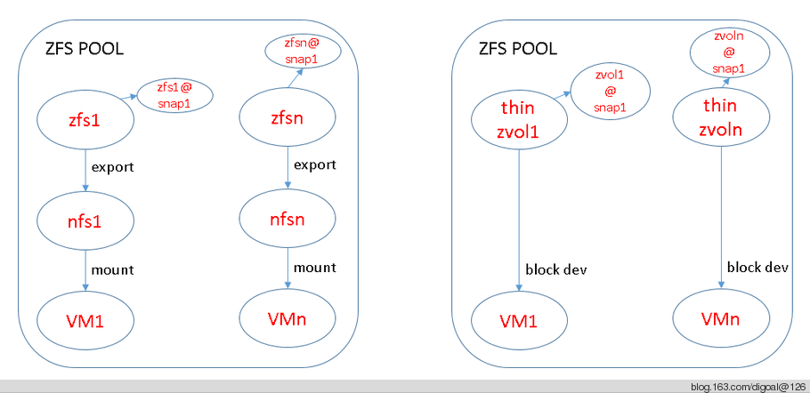
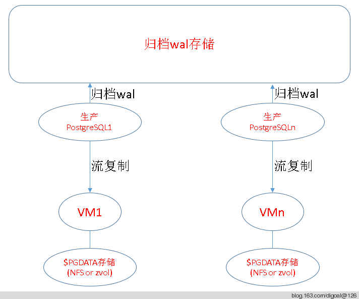
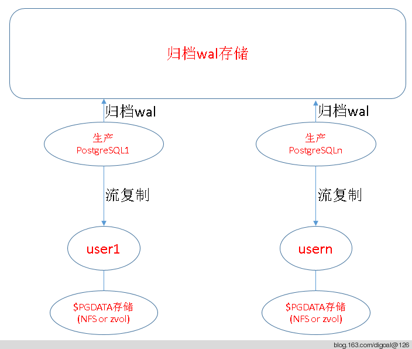

## PostgreSQL centrol PITR backup with kvm and zfs and nfs or zvol  
                                                                     
### 作者                                                                     
digoal                                                                     
                                                                     
### 日期                                                                     
2014-06-17                                                                   
                                                                     
### 标签                                                                     
PostgreSQL , ZFS , Linux , snapshot , PITR     
                                                                     
----                                                                     
                                                                     
## 背景            
在实际的生产环境中, 当数据库越来越多, 越来越大.  
  
备份可能会成为比较大的问题, 传统的逻辑备份对于大的数据库不适用(因为备份和还原可能是比较耗时的, 而且也不能回到任意时间点,还会造成数据库膨胀(长时间repeatable read iso), 好处是可以跨平台恢复, 可选恢复表等).  
  
但是基于XLOG的增量备份, 又需要结构一致, 如果要做集中的备份, 可能导致不同数据库集群占用同一个文件夹带来冲突(当然解决办法是重定向一个文件夹就好了)  
  
那么如果环境中已有虚拟机的话, 可以使用虚拟机来解决文件夹冲突的问题. (不过个人还是推荐使用重定向, 可以省掉一层虚拟机的管理成本)  
  
zfs在这里主要用到它的压缩, 去重和snapshot功能. 减少存储空间, 加快恢复速度等. 可以放在crontab定时执行, 例如2小时1次.  
  
以下是使用虚拟机和zfs来管理存储的一种集中式XLOG增量备份的场景举例 ;   
  
环境 :   
  
```  
DELL R720xd  
32G mem  
8 核 Intel(R) Xeon(R) CPU E5-2609 v2 @ 2.50GHz  
CentOS 6.5 x64  
```  
  
虚拟化, KVM  
  
存储管理, ZFS, 开启压缩, dedup. (也可以考虑开源的分布式文件系统)  
  
虚拟机数据分区, nfs或zvol.  
  
方案图 :   
  
这里的虚拟机数据分区用法, 分为两种, 一种是NFS, (VM中挂载NFS来实现PGDATA的存储)  
  
zvol则是直接使用zfs卷来管理的, 效率比nfs更高一点.  
  
  
  
使用nfs的好处, 虚拟机和ZFS设备不需要在同一台主机.  
  
使用zvol的话, 虚拟机和ZVOL必须是同一主机的.  
  
整体的架构.  
  
  
  
归档wal存储可以考虑zfs或分布式存储. 归档方法很多, 可以使用rsync, cp, nfs等.  
  
使用ZFS snapshot加速PITR.  
  
使用本地用户的话, 架构图如下 :   
  
每个用户配置独立的zfs存储对应的$PGDATA, 每个用户建议编译独立的$PGHOME.  
  
  
  
使用ZFS snapshot加速PITR.  
  
## 参考  
1\. http://blog.163.com/digoal@126/blog/static/16387704020144183320807/  
  
2\. http://blog.163.com/digoal@126/blog/static/163877040201322462042878/  
  
3\. http://blog.163.com/digoal@126/blog/static/163877040201451332042136/  
  
4\. https://access.redhat.com/site/documentation/en-US  
  
  
  
  
  
  
  
  
  
  
  
  
  
  
  
  
  
  
  
  
  
  
  
  
  
  
  
  
  
  
  
  
  
  
  
  
  
  
  
  
  
  
  
  
  
  
  
  
  
  
  
  
  
  
  
#### [9.9元购买3个月阿里云RDS PostgreSQL实例](https://www.aliyun.com/database/postgresqlactivity "57258f76c37864c6e6d23383d05714ea")
  
  
#### [PostgreSQL 解决方案集合](https://yq.aliyun.com/topic/118 "40cff096e9ed7122c512b35d8561d9c8")
- [1 任意维度实时圈人](https://yq.aliyun.com/topic/118 "40cff096e9ed7122c512b35d8561d9c8")
- [2 时序数据实时处理](https://yq.aliyun.com/topic/118 "40cff096e9ed7122c512b35d8561d9c8")
- [3 时间、空间、业务 多维数据实时透视](https://yq.aliyun.com/topic/118 "40cff096e9ed7122c512b35d8561d9c8")
- [4 独立事件相关性分析](https://yq.aliyun.com/topic/118 "40cff096e9ed7122c512b35d8561d9c8")
- [5 海量关系实时图式搜索](https://yq.aliyun.com/topic/118 "40cff096e9ed7122c512b35d8561d9c8")
- [6 社交业务案例](https://yq.aliyun.com/topic/118 "40cff096e9ed7122c512b35d8561d9c8")
- [7 流式数据实时处理案例](https://yq.aliyun.com/topic/118 "40cff096e9ed7122c512b35d8561d9c8")
- [8 IoT 物联网, 时序](https://yq.aliyun.com/topic/118 "40cff096e9ed7122c512b35d8561d9c8")
- [9 全文检索](https://yq.aliyun.com/topic/118 "40cff096e9ed7122c512b35d8561d9c8")
- [10 模糊、正则 查询案例](https://yq.aliyun.com/topic/118 "40cff096e9ed7122c512b35d8561d9c8")
- [11 图像识别](https://yq.aliyun.com/topic/118 "40cff096e9ed7122c512b35d8561d9c8")
- [12 向量相似检索](https://yq.aliyun.com/topic/118 "40cff096e9ed7122c512b35d8561d9c8")
- [13 数据清洗、采样、脱敏、批处理、合并](https://yq.aliyun.com/topic/118 "40cff096e9ed7122c512b35d8561d9c8")
- [14 GIS 地理信息空间数据应用](https://yq.aliyun.com/topic/118 "40cff096e9ed7122c512b35d8561d9c8")
- [15 金融业务](https://yq.aliyun.com/topic/118 "40cff096e9ed7122c512b35d8561d9c8")
- [16 异步消息应用案例](https://yq.aliyun.com/topic/118 "40cff096e9ed7122c512b35d8561d9c8")
- [17 海量数据 冷热分离](https://yq.aliyun.com/topic/118 "40cff096e9ed7122c512b35d8561d9c8")
- [18 倒排索引案例](https://yq.aliyun.com/topic/118 "40cff096e9ed7122c512b35d8561d9c8")
- [19 海量数据OLAP处理应用](https://yq.aliyun.com/topic/118 "40cff096e9ed7122c512b35d8561d9c8")
  
  
#### [德哥 / digoal's 趣味入口 - 努力成为灯塔, 公益是一辈子的事.](https://github.com/digoal/blog/blob/master/README.md "22709685feb7cab07d30f30387f0a9ae")
  
  

  
