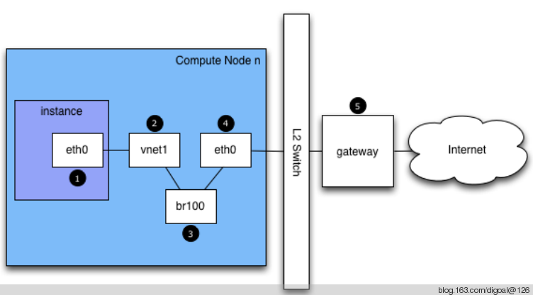

## OpenvSwitch readme & faq  
                  
### 作者                 
digoal                  
                  
### 日期                 
2014-08-01                      
                  
### 标签                
OpenvSwitch , OVS , bridge , VLAN , VM , 虚拟化 , 虚拟网桥  
                  
----                
                  
## 背景     
本文为转载文章，主要讲解的是虚拟交换机产品OpenVSwitch 简称OVS的原理，OVS在虚拟化技术中非常有用。    
    
如果不使用OVS，通常还可以使用bridge与net namespace以及流控的工具来达到类似的效果。      
    
http://blog.csdn.net/majieyue/article/details/7888400    
    
## 什么是OpenvSwitch  
OpenvSwitch，简称OVS是一个虚拟交换软件，主要用于虚拟机VM环境，作为一个虚拟交换机，支持Xen/XenServer, KVM, and VirtualBox多种虚拟化技术。    
    
在这种某一台机器的虚拟化的环境中，一个虚拟交换机（vswitch）主要有两个作用：    
    
传递虚拟机VM之间的流量，以及实现VM和外界网络的通信。    
    
整个OVS代码用C写的。目前有以下功能：    
```  
Standard 802.1Q VLAN model with trunk and access ports  
  
NIC bonding with or without LACP on upstream switch  
  
NetFlow, sFlow(R), and mirroring for increased visibility  
  
QoS (Quality of Service) configuration, plus policing  
  
GRE, GRE over IPSEC, VXLAN, and LISP tunneling  
  
802.1ag connectivity fault management  
  
OpenFlow 1.0 plus numerous extensions  
  
Transactional configuration database with C and Python bindings  
  
High-performance forwarding using a Linux kernel module  
```  
    
## OpenvSwitch的组成  
ovs-vswitchd：守护程序，实现交换功能，和Linux内核兼容模块一起，实现基于流的交换flow-based switching。    
  
ovsdb-server：轻量级的数据库服务，主要保存了整个OVS的配置信息，包括接口啊，交换内容，VLAN啊等等。ovs-vswitchd会根据数据库中的配置信息工作。  
  
ovs-dpctl：一个工具，用来配置交换机内核模块，可以控制转发规则。  
  
ovs-vsctl：主要是获取或者更改ovs-vswitchd的配置信息，此工具操作的时候会更新ovsdb-server中的数据库。  
  
ovs-appctl：主要是向OVS守护进程发送命令的，一般用不上。  
  
ovsdbmonitor：GUI工具来显示ovsdb-server中数据信息。   
  
ovs-controller：一个简单的OpenFlow控制器。  
  
ovs-ofctl：用来控制OVS作为OpenFlow交换机工作时候的流表内容。  
  
## OpenvSwitch和其他vswitch  
这里指的其他的vswitch,包括VMware vNetwork distributed switch以及思科的Cisco Nexus 1000V。  
  
VMware vNetwork distributed switch以及思科的Cisco Nexus 1000V这种虚拟交换机提供的是一个集中式的控制方式。  
  
而OVS则是一个独立的vswitch，他运行在每个实现虚拟化的物理机器上，并提供远程管理。  
  
OVS提供了两种在虚拟化环境中远程管理的协议：  
  
一个是OpenFlow,通过流表来管理交换机的行为，一个是OVSDB management protocol，用来暴露sietch的port状态。   
  
## 概念及工作流程 1 
1\. vswitch、Bridge、Datapath  
   
在网络中，交换机和桥都是同一个概念，OVS实现了一个虚拟机的以太交换机，换句话说，OVS也就是实现了一个以太桥。  
   
那么，在OVS中，给一个交换机，或者说一个桥，用了一个专业的名词，叫做DataPath！  
  
要了解，OVS如何工作，首先需要知道桥的概念。  
  
网桥也叫做桥接器，连接两个局域网的设备，网桥工作在数据链路层，将两个LAN连接，根据MAC地址来转发帧，可以看成一个“低层的路由器”（路由器工作在网络层，根据IP地质进行转发）。  
  
1\.1 网桥的工作原理  
  
网桥处理包遵循以下几条规则：  
  
在一个接口上接收到的包不会再往那个接口上发送此包。  
  
每个接收到的包都要学习其源MAC地址。  
  
如果数据包是多播或者广播包（通过2层MAC地址确定）则要向接收端口以外的所有端口转发，如果上层协议感兴趣，则还会递交上层处理。  
  
如果数据包的地址不能再CAM表中找到，则向接收端口以外的其他端口转发。  
  
如果CAM表中能找到，则转发给相应端口，如果发送和接收都是统一端口，则不发送。  
  
注意，网桥是以混杂模式工作的。关于网桥更多，请查阅相关资料。  
  
2\. OVS中的bridge  
  
上面，说到，一个桥就是一个交换机。在OVS中添加桥(交换机)，  
  
```
ovs-vsctl add-br brname(br-int)  
  
root@Compute2:~# ifconfig  
      br-int    Link encap:EthernetHWaddr1a:09:56:ea:0b:49    
      inet6 addr: fe80::1809:56ff:feea:b49/64Scope:Link  
      UP BROADCAST RUNNING MULTICAST  MTU:1500Metric:1  
      RX packets:1584 errors:0 dropped:0 overruns:0 frame:0  
      TX packets:6 errors:0 dropped:0 overruns:0 carrier:0  
      collisions:0 txqueuelen:0   
      RX bytes:316502(316.5 KB)  TX bytes:468(468.0 B)  
```
  
当我们创建了一个交换机（网桥）以后，此时网络功能不受影响，但是会产生一个虚拟网卡，名字就是brname，之所以会产生一个虚拟网卡，是为了实现接下来的网桥（交换机）功能。  
  
有了这个交换机以后，我还需要为这个交换机增加端口(port)，一个端口，就是一个物理网卡，当网卡加入到这个交换机之后，其工作方式就和普通交换机的一个端口的工作方式类似了。  
  
```
ovs-vsctl add-port brname port  
```
  
这里要特别注意，网卡加入网桥以后，要按照网桥的工作标准工作，那么加入的一个端口就必须是以混杂模式工作，工作在链路层，处理2层的帧，所以这个port就不需要配置IP了。（你没见过哪个交换的端口有IP的吧）  
  
注意这个port是实际存在的port, 也就是ifconfig -a或ip link能看到的端口 , 例如 :     
  
```
[root@db-172-16-3-150 ~]# ifconfig -a  
bond0     Link encap:Ethernet  HWaddr 00:00:00:00:00:00    
          BROADCAST MASTER MULTICAST  MTU:1500  Metric:1  
          RX packets:0 errors:0 dropped:0 overruns:0 frame:0  
          TX packets:0 errors:0 dropped:0 overruns:0 carrier:0  
          collisions:0 txqueuelen:0   
          RX bytes:0 (0.0 b)  TX bytes:0 (0.0 b)  
  
bond1     Link encap:Ethernet  HWaddr 00:00:00:00:00:00    
          BROADCAST MASTER MULTICAST  MTU:1500  Metric:1  
          RX packets:0 errors:0 dropped:0 overruns:0 frame:0  
          TX packets:0 errors:0 dropped:0 overruns:0 carrier:0  
          collisions:0 txqueuelen:0   
          RX bytes:0 (0.0 b)  TX bytes:0 (0.0 b)  
  
bond2     Link encap:Ethernet  HWaddr 00:00:00:00:00:00    
          BROADCAST MASTER MULTICAST  MTU:1500  Metric:1  
          RX packets:0 errors:0 dropped:0 overruns:0 frame:0  
          TX packets:0 errors:0 dropped:0 overruns:0 carrier:0  
          collisions:0 txqueuelen:0   
          RX bytes:0 (0.0 b)  TX bytes:0 (0.0 b)  
  
bond3     Link encap:Ethernet  HWaddr 00:00:00:00:00:00    
          BROADCAST MASTER MULTICAST  MTU:1500  Metric:1  
          RX packets:0 errors:0 dropped:0 overruns:0 frame:0  
          TX packets:0 errors:0 dropped:0 overruns:0 carrier:0  
          collisions:0 txqueuelen:0   
          RX bytes:0 (0.0 b)  TX bytes:0 (0.0 b)  
  
bond4     Link encap:Ethernet  HWaddr 00:00:00:00:00:00    
          BROADCAST MASTER MULTICAST  MTU:1500  Metric:1  
          RX packets:0 errors:0 dropped:0 overruns:0 frame:0  
          TX packets:0 errors:0 dropped:0 overruns:0 carrier:0  
          collisions:0 txqueuelen:0   
          RX bytes:0 (0.0 b)  TX bytes:0 (0.0 b)  
  
br0       Link encap:Ethernet  HWaddr 00:22:19:60:77:8F    
          inet addr:172.16.3.150  Bcast:172.16.3.255  Mask:255.255.255.0  
          inet6 addr: fe80::222:19ff:fe60:778f/64 Scope:Link  
          UP BROADCAST RUNNING MULTICAST  MTU:1500  Metric:1  
          RX packets:45547 errors:0 dropped:0 overruns:0 frame:0  
          TX packets:31036 errors:0 dropped:0 overruns:0 carrier:0  
          collisions:0 txqueuelen:0   
          RX bytes:7848640 (7.4 MiB)  TX bytes:3286303 (3.1 MiB)  
  
em1       Link encap:Ethernet  HWaddr 00:22:19:60:77:8F    
          inet6 addr: fe80::222:19ff:fe60:778f/64 Scope:Link  
          UP BROADCAST RUNNING MULTICAST  MTU:1500  Metric:1  
          RX packets:28583 errors:0 dropped:0 overruns:0 frame:0  
          TX packets:20748 errors:0 dropped:0 overruns:0 carrier:0  
          collisions:0 txqueuelen:1000   
          RX bytes:5273472 (5.0 MiB)  TX bytes:2133925 (2.0 MiB)  
  
em2       Link encap:Ethernet  HWaddr 00:22:19:60:77:91    
          BROADCAST MULTICAST  MTU:1500  Metric:1  
          RX packets:0 errors:0 dropped:0 overruns:0 frame:0  
          TX packets:0 errors:0 dropped:0 overruns:0 carrier:0  
          collisions:0 txqueuelen:1000   
          RX bytes:0 (0.0 b)  TX bytes:0 (0.0 b)  
  
em3       Link encap:Ethernet  HWaddr 00:22:19:60:77:93    
          BROADCAST MULTICAST  MTU:1500  Metric:1  
          RX packets:0 errors:0 dropped:0 overruns:0 frame:0  
          TX packets:0 errors:0 dropped:0 overruns:0 carrier:0  
          collisions:0 txqueuelen:1000   
          RX bytes:0 (0.0 b)  TX bytes:0 (0.0 b)  
  
em4       Link encap:Ethernet  HWaddr 00:22:19:60:77:95    
          BROADCAST MULTICAST  MTU:1500  Metric:1  
          RX packets:0 errors:0 dropped:0 overruns:0 frame:0  
          TX packets:0 errors:0 dropped:0 overruns:0 carrier:0  
          collisions:0 txqueuelen:1000   
          RX bytes:0 (0.0 b)  TX bytes:0 (0.0 b)  
  
lo        Link encap:Local Loopback    
          inet addr:127.0.0.1  Mask:255.0.0.0  
          inet6 addr: ::1/128 Scope:Host  
          UP LOOPBACK RUNNING  MTU:16436  Metric:1  
          RX packets:14685 errors:0 dropped:0 overruns:0 frame:0  
          TX packets:14685 errors:0 dropped:0 overruns:0 carrier:0  
          collisions:0 txqueuelen:0   
          RX bytes:3881472 (3.7 MiB)  TX bytes:3881472 (3.7 MiB)  
  
[root@db-172-16-3-150 ~]# ip link  
1: lo: <LOOPBACK,UP,LOWER_UP> mtu 16436 qdisc noqueue state UNKNOWN   
    link/loopback 00:00:00:00:00:00 brd 00:00:00:00:00:00  
2: em1: <BROADCAST,MULTICAST,UP,LOWER_UP> mtu 1500 qdisc mq state UP qlen 1000  
    link/ether 00:22:19:60:77:8f brd ff:ff:ff:ff:ff:ff  
3: em2: <BROADCAST,MULTICAST> mtu 1500 qdisc noop state DOWN qlen 1000  
    link/ether 00:22:19:60:77:91 brd ff:ff:ff:ff:ff:ff  
4: em3: <BROADCAST,MULTICAST> mtu 1500 qdisc noop state DOWN qlen 1000  
    link/ether 00:22:19:60:77:93 brd ff:ff:ff:ff:ff:ff  
5: em4: <BROADCAST,MULTICAST> mtu 1500 qdisc noop state DOWN qlen 1000  
    link/ether 00:22:19:60:77:95 brd ff:ff:ff:ff:ff:ff  
9: bond0: <BROADCAST,MULTICAST,MASTER> mtu 1500 qdisc noop state DOWN   
    link/ether 00:00:00:00:00:00 brd ff:ff:ff:ff:ff:ff  
10: bond4: <BROADCAST,MULTICAST,MASTER> mtu 1500 qdisc noop state DOWN   
    link/ether 00:00:00:00:00:00 brd ff:ff:ff:ff:ff:ff  
11: bond1: <BROADCAST,MULTICAST,MASTER> mtu 1500 qdisc noop state DOWN   
    link/ether 00:00:00:00:00:00 brd ff:ff:ff:ff:ff:ff  
12: bond2: <BROADCAST,MULTICAST,MASTER> mtu 1500 qdisc noop state DOWN   
    link/ether 00:00:00:00:00:00 brd ff:ff:ff:ff:ff:ff  
13: bond3: <BROADCAST,MULTICAST,MASTER> mtu 1500 qdisc noop state DOWN   
    link/ether 00:00:00:00:00:00 brd ff:ff:ff:ff:ff:ff  
15: br0: <BROADCAST,MULTICAST,UP,LOWER_UP> mtu 1500 qdisc noqueue state UNKNOWN   
    link/ether 00:22:19:60:77:8f brd ff:ff:ff:ff:ff:ff  
```
  
以上是实际存在的, 当使用KVM虚拟机时, 指定bridge后, 会自动帮你创建虚拟口, 这些虚拟口也可以被ovs控制, 例如打TAG. 建立VLAN.   
  
那么接下来你可能会问，通常的交换机不都是有一个管理接口，可以telnet到交换机上进行配置吧，那么在OVS中创建的虚拟交换机有木有这种呢，有的！上面既然创建交换机brname的时候产生了一个虚拟网口brname,   
  
那么，你给这个虚拟网卡配置了IP以后，就相当于给交换机的管理接口配置了IP，此时一个正常的虚拟交换机就搞定了。    
  
```
ip address add 192.168.1.1/24 dev brname  
```
  
最后，我们来看看一个br的具体信息：  
  
```
[root@db-172-16-3-150 ~]# ovs-vsctl show  
d267062e-d7ed-45e1-9de7-71d058127c1b  
    Bridge "br0"  
        Port "em1"  
            Interface "em1"  
        Port "br0"  
            Interface "br0"  
                type: internal  
    ovs_version: "1.9.3"  
```
  
首先，这里显示了一个名为br0的桥（交换机），这个交换机有两个接口, 一个是em1，一个是br0 (type: internal)，   
   
上面说到，创建桥的时候会创建一个和桥名字一样的接口，并自动作为该桥的一个端口，那么这个虚拟接口的作用，一方面是可以作为交换机的管理端口，另一方面也是基于这个虚拟接口，实现了桥的功能。    
  
## 概念及工作流程 2 
  
这一部分我以一个简单的例子，说明在虚拟化环境中OpenvSwitch的典型工作流程。  
  
前面已经说到，OVS主要是用来在虚拟化环境中。虚拟机之间一个虚拟机和外网之间的通信所用，如下是一个典型的结构图：  
  
那么，通常情况下的工作流程如下：  
  
    
  
(instance指虚拟机.)  
  
1\. VM实例instance产生一个数据包并发送至实例内的虚拟网络接口VNIC，图中就是instance中的eth0.  
  
2\. 这个数据包会传送到物理节点上的VNIC接口，如图就是vnet1接口。  
  
3\. 数据包从vnet NIC出来，到达桥（虚拟交换机）br100上.  
  
4\. 数据包经过交换机的处理，从物理节点上的物理接口发出，如图中物理节点上的eth0.  
  
5\. 数据包从eth0出去的时候，是按照物理节点上的路由以及默认网关操作的，这个时候该数据包其实已经不受你的控制了。  
  
一般L2 switch连接eth0的这个口是一个trunk口, 因为虚拟机对应的VNET往往会设置VLAN TAG, 可以通过对虚拟机对应的vnet打VALN TAG来控制虚拟机的网络广播域.   
  
如果跑多个虚拟机的话, 多个虚拟机对应的vnet可以设置不同的vlan tag, 那么这些虚拟机的包从eth0(4)出去的时候, 会带上TAG标记. 这样也就必须是trunk口才行.  
  
## 参考  
1\. http://git.openvswitch.org/cgi-bin/gitweb.cgi?p=openvswitch;a=blob_plain;f=FAQ;hb=HEAD  
2\. http://git.openvswitch.org/cgi-bin/gitweb.cgi?p=openvswitch;a=blob_plain;f=README;hb=HEAD  
3\. http://openvswitch.org/support/config-cookbooks/vlan-configuration-cookbook/  
      
             
          

  
<a rel="nofollow" href="http://info.flagcounter.com/h9V1"  ></a>  
  
  
  
  
  
  
## [digoal's 大量PostgreSQL文章入口](https://github.com/digoal/blog/blob/master/README.md "22709685feb7cab07d30f30387f0a9ae")
  
