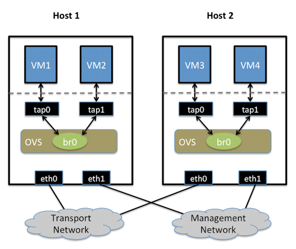

## USE OpenVSwitch Isolating VM traffic using VLANs     
                    
### 作者                   
digoal                    
                    
### 日期                   
2014-08-01                        
                    
### 标签                  
OpenvSwitch , OVS , bridge , VLAN , VM , 虚拟化 , 虚拟网桥                                      
                    
----                  
                    
## 背景       
本文为转载文章，主要讲解的是虚拟交换机产品OpenVSwitch 隔离网络的用法。      
          
http://openvswitch.org/support/config-cookbooks/vlan-configuration-cookbook/    
      
## 原文  
openvswitch在虚拟化环境中, 使用vlan隔离虚拟机通讯.  
  
本文模拟环境有2台物理机, 2个物理网卡(eth0和eth1), 其中eth0加入网桥br0, 用于虚拟机通讯; eth1未加入虚拟网桥, 用于物理连接.  
  
因为eth1已经用于管理了, 所以br0可以配, 也可以不配IP. eth0则不需要配置IP(配了也不通), 因为已经作为虚拟交换机端口使用了.  
  
tap0, tap1在KVM环境可能叫vnet0, vnet1;   
  
是创建虚拟机时, 在网桥br0中生成的端口, 本文通过控制这些端口在虚拟交换机中的vlan tag, 来隔离他们之间的通讯.   
  
注意ETH0连接的物理交换机的端口, 必须是trunk口, 才能携带TAG信息.    
  
配置示例  
  
  
  
```
VLANs  
  
Topic:  
  
Isolating VM traffic using VLANs  
  
Setup:  
  
两个物理网络
Two Physical Networks:  
  
Data Network:  Ethernet network for VM data traffic, which will carry VLAN tagged traffic between VMs.  

Your physical switch(es) must be capable of forwarding VLAN tagged traffic and the physical switch ports should be VLAN trunks (Usually this is default behavior.  

Configuring your physical switching hardware is beyond the scope of this document).  

管理网络
Management Network: 

This network is not strictly required, but it is a simple way to give the physical host an IP address for remote access, since an IP address cannot be assigned directly to eth0.    

物理主机
Two Physical Hosts:  
  
Host1, Host2.  Both hosts are running Open vSwitch.  Each host has two NICs:  
  
eth0 is connected to the Data Network.  No IP address can be assigned on eth0.  

eth1 is connected to the Management Network (if necessary).   

eth1 has an IP address that is used to reach the physical host for management.  

虚拟机
Four VMs:  
  
VM1,VM2 run on Host1.  VM3,VM4 run on Host2.  
  
Each VM has a single interface that appears as a Linux device (e.g., “tap0″) on the physical host.  (Note: for Xen/XenServer, VM interfaces appears as Linux devices with names like “vif1.0″)  
  
目标
Goal:  
  
Isolate VMs using VLANs on the Data Network.  
VLAN 1: VM1,VM3  
VLAN 2: VM2,VM4  
  
配置步骤
Configuration:  
  
Perform the following configuration on Host 1:  
  
Create an OVS bridge:  
  
    ovs-vsctl add-br br0  
  
Add eth0 to the bridge (by default, all OVS ports are VLAN trunks, so eth0 will pass all VLANs):  
  
    ovs-vsctl add-port br0 eth0  
  
Add VM1 as an “access port” on VLAN 1:  注意tap0是虚拟机创建好之后, 自动生成的, 不是使用ovs-vsctl生成的. 所以必须先创建虚拟机.  (当然也可以手工添加类似的peer设备，使用net namespace)   
  
    ovs-vsctl add-port br0 tap0 tag=1  
  
Add VM2 on VLAN 2:  
  
    ovs-vsctl add-port br0 tap1 tag=2  
  
On Host 2, repeat the same configuration to setup a bridge with eth0 as a trunk:  
  
    ovs-vsctl add-br br0  
  
    ovs-vsctl add-port br0 eth0  
  
Add VM3 to VLAN 1:  
  
    ovs-vsctl add-port br0 tap0 tag=1  
  
Add VM4 to VLAN 2:  
  
    ovs-vsctl add-port br0 tap1 tag=2  
  
检验  
Trouble-Shooting:  
  
Ping from VM1 to VM3, this should succeed.  
  
Ping from VM2 to VM4, this should succeed.  
  
Ping from VM1/VM3 to VM2/VM4, this should not succeed (unless you have a router configured to forward between the VLANs, 

in which case, packets arriving at VM3 should have the source MAC address of the router, not of VM1).  
```
  
## 参考
1\. http://openvswitch.org/support/config-cookbooks/vlan-configuration-cookbook/  
        
               
            

  
  
  
  
  
  
  
  
  
  
  
  
  
  
  
  
  
  
  
  
  
  
  
  
  
  
  
  
  
  
  
  
  
  
  
  
  
  
  
  
  
  
  
  
  
  
  
  
  
  
  
  
  
  
  
  
  
  
  
  
  
  
  
  
  
  
  
  
  
  
  
  
  
#### [PostgreSQL 许愿链接](https://github.com/digoal/blog/issues/76 "269ac3d1c492e938c0191101c7238216")
您的愿望将传达给PG kernel hacker、数据库厂商等, 帮助提高数据库产品质量和功能, 说不定下一个PG版本就有您提出的功能点. 针对非常好的提议，奖励限量版PG文化衫、纪念品、贴纸、PG热门书籍等，奖品丰富，快来许愿。[开不开森](https://github.com/digoal/blog/issues/76 "269ac3d1c492e938c0191101c7238216").  
  
  
#### [9.9元购买3个月阿里云RDS PostgreSQL实例](https://www.aliyun.com/database/postgresqlactivity "57258f76c37864c6e6d23383d05714ea")
  
  
#### [PostgreSQL 解决方案集合](https://yq.aliyun.com/topic/118 "40cff096e9ed7122c512b35d8561d9c8")
  
  
#### [德哥 / digoal's github - 公益是一辈子的事.](https://github.com/digoal/blog/blob/master/README.md "22709685feb7cab07d30f30387f0a9ae")
  
  

  
  
#### [PolarDB 学习图谱: 训练营、培训认证、在线互动实验、解决方案、生态合作、写心得拿奖品](https://www.aliyun.com/database/openpolardb/activity "8642f60e04ed0c814bf9cb9677976bd4")
  
  
#### [购买PolarDB云服务折扣活动进行中, 55元起](https://www.aliyun.com/activity/new/polardb-yunparter?userCode=bsb3t4al "e0495c413bedacabb75ff1e880be465a")
  
  
#### [About 德哥](https://github.com/digoal/blog/blob/master/me/readme.md "a37735981e7704886ffd590565582dd0")
  
