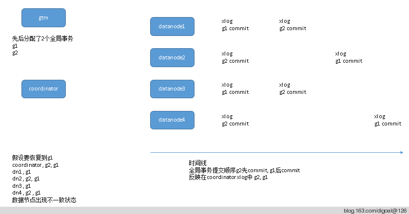
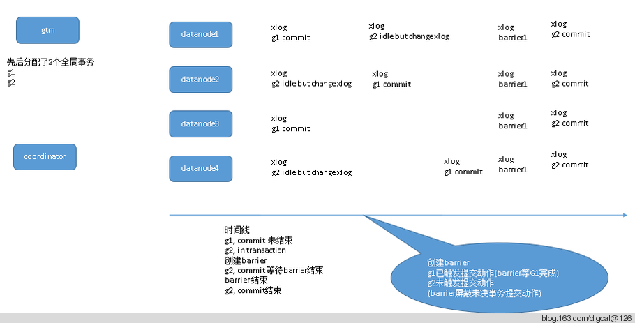

## consistent status in distributed database for exp postgres-xc xl  
                                          
### 作者                                             
digoal                                     
                                      
### 日期                                                                                                         
2014-12-03                                   
                                         
### 标签                                      
PostgreSQL , 分布式数据库全局一致性恢复     
                                                                                                            
----                                                                                                      
                                                                                                               
## 背景                                  
本文讨论一下分布式数据库的一致性状态.  
  
以前写过一篇类似文章, 参考  
  
[《PostgreSQL Distributed|Sharded Databases Consistent PITR Thinking》](../201302/20130206_01.md)   
  
什么情况下数据库可以恢复到全局一致的状态?  
  
以Postgres-XC为例, gtm是用来分配全局事务的.   
  
假设所有节点(coordinator和datanode) 的xid都以global xid代替 (目前xc,xl貌似没有这么做, 本地有本地的xid).  
  
我们来看一下全局事务分配和本地(各节点)写xlog可能出现的情况.  
  
  
  
只要xlog中提交顺序不一致, 就无法使用恢复到指定xid来达到恢复到一致状态的目的.  
  
那么恢复到哪些点, 全局才是一致的呢?   
  
1\. 最简单粗暴的方法, 也就是pg-xc pg-xl用的, 创建barrier. 创建barrier时, 任意单个全局事务在所有节点应该是已经提交或未提交的状态. barrier就是xlog中的一个target name.   
  
在恢复时, 恢复到指定的target name, 那么全局就是一致的.   
  
创建barrier时, 如果系统中有未提交的事务, 同时又有已提交, 但是在等待所有节点返回提交状态的事务, 应该怎么做呢?  
  
1\. 收到创建barrier命令,   
  
2\. 屏蔽提交事务的操作,   
  
3\. 等待所有已提交的事务完成提交或全部回滚,   
  
4\. 在所有节点创建barrier,   
  
5\. 开放提交事务的操作.  
  
6\. 结束创建barrier, 记录barrier完整性.  
  
  
   
postgres-xc, xl创建barrier是手工创建的, 未来可能加入自动创建的功能. 因为创建barrier需要短暂的堵塞commit操作, 所以如果创建barrier时已提交的事务完成时间比较长的话, 堵塞也会比较长.  
  
## 参考  
1\. http://www.postgres-xl.org/overview/  
  
  
  
  
  
  
  
  
## [digoal's 大量PostgreSQL文章入口](https://github.com/digoal/blog/blob/master/README.md "22709685feb7cab07d30f30387f0a9ae")
  
