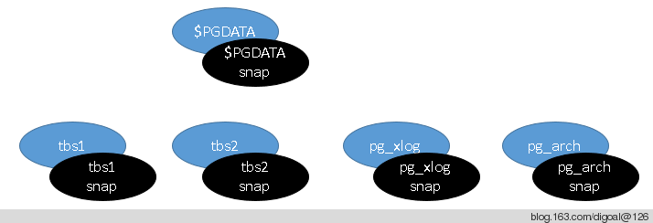

## PostgreSQL 快速大版本升级多种方案 - 含重点介绍fast & safe upgrade to PostgreSQL 9.4 use pg_upgrade & zfs     
                
### 作者                         
digoal                       
                                  
### 日期                                                                                                                                         
2014-12-19                                                                    
                                                                         
### 标签                                                                      
PostgreSQL , pg_upgrade , 跨版本升级 , 原地升级 , 快速       
                                                                                                                                            
----                                                                                                                                      
                                                                                                                                               
## 背景       
已使用pg_upgrade顺利将一个8TB的生产数据库(包含表, 索引, 类型, 函数, 外部对象等对象大概10万个)从9.3升级到9.4, 升级比较快(约2分钟), 因为数据库较大后期analyze的时间比较长, 不过你可以将常用的表优先analyze一下, 就可以放心大胆的提供服务了.  
  
PostgreSQL 9.4于(2014-12-18)正式发布, 为了让大家可以快速的享受9.4带来的强大特性, 写一篇使用zfs和pg_upgrade升级9.4的快速可靠的文章. 希望对大家有帮助.  
  
提醒:  
  
在正式升级9.4前, 请做好功课, 至少release note要阅读一遍, 特别是兼容性. 例如有些应用可能用了某些9.4不兼容的语法或者插件的话, 需要解决了再上. (以前就有出现过版本升级带来的bytea的默认表述变更导致的程序异常)  
  
pg_upgrade支持从8.3.x以及更新的版本的跨大版本升级, 使用LINK模式, 可以减少数据的拷贝工作, 大大提高版本升级的速度.  
  
本文将演示一下使用pg_upgrade将数据库从9.3.5升级到最新的9.4.  
  
使用zfs快照来保存老的数据文件和软件. 如果升级失败, 回滚非常简单, 回退到ZFS快照或者使用ZFS快照克隆都可以.  
  
实际上，使用备库来进行升级演练，把流程都跑通，是很不错的选择。ZFS则是加一道保险，或者说方便多次（克隆ZFS进行演练）演练。  
  
  
  
## 升级步骤简介  
1、假设主机已是基于ZFS  
  
```  
  停库  
  
  创建快照  
  
  使用upgrade升级  
```  
  
2、假设主机不是基于ZFS  
  
```  
  创建ZFS主机  
  
  创建PostgreSQL物理standby  
  
  主备角色切换，把主库切到ZFS主机下。  
  
  以下基于新的主库操作：  
  
  停主  
  
  创建快照  
  
  使用upgrade升级  
```  
  
3、如何把老版本的standby升级成为9.4 standby?  
  
```  
  pg start backup  
  
  rsync 数据文件  
  
  pg_stop_backup  
  
  创建recovery.conf 继续.  
```  
  
### 使用ZFS和pg_upgrade升级9.4的详细步骤  
以CentOS 7 x64为例,  
  
测试环境部署  
  
安装zfs  
  
http://download.fedoraproject.org/pub/epel 找到最新的epel7 rpm包, 加入YUM仓库.  
  
例如当下版本如下 :   
  
```  
[root@localhost ~]# yum localinstall --nogpgcheck http://ftp.cuhk.edu.hk/pub/linux/fedora-epel/7/x86_64/e/epel-release-7-5.noarch.rpm  
[root@localhost ~]# yum localinstall --nogpgcheck http://archive.zfsonlinux.org/epel/zfs-release.el7.noarch.rpm  
[root@localhost ~]# uname -r  
3.10.0-123.el7.x86_64  
[root@localhost ~]# yum install kernel-devel-3.10.0-123.el7 zfs   
```  
  
安装好ZFS后, 创建ZPOOL, 我们使用5个文件来模拟5块磁盘.  
  
```  
[root@localhost disks]# dd if=/dev/zero of=./disk1 bs=8192k count=1024 oflag=direct  
[root@localhost disks]# dd if=/dev/zero of=./disk2 bs=8192k count=1024 oflag=direct  
[root@localhost disks]# dd if=/dev/zero of=./disk3 bs=8192k count=1024 oflag=direct  
[root@localhost disks]# dd if=/dev/zero of=./disk4 bs=8192k count=1024 oflag=direct  
[root@localhost disks]# dd if=/dev/zero of=./disk5 bs=8192k count=1024 oflag=direct  
```  
  
创建zpool  
  
```  
[root@localhost disks]# zpool create -o ashift=12 zp1 raidz /data01/disks/disk1 /data01/disks/disk2 /data01/disks/disk3 /data01/disks/disk4 /data01/disks/disk5  
[root@localhost disks]# zpool status  
  pool: zp1  
 state: ONLINE  
  scan: none requested  
config:  
  
        NAME                     STATE     READ WRITE CKSUM  
        zp1                      ONLINE       0     0     0  
          raidz1-0               ONLINE       0     0     0  
            /data01/disks/disk1  ONLINE       0     0     0  
            /data01/disks/disk2  ONLINE       0     0     0  
            /data01/disks/disk3  ONLINE       0     0     0  
            /data01/disks/disk4  ONLINE       0     0     0  
            /data01/disks/disk5  ONLINE       0     0     0  
```  
  
设置zfs默认参数 :   
  
```  
[root@localhost disks]# zfs set atime=off zp1  
[root@localhost disks]# zfs set compression=lz4 zp1  
[root@localhost disks]# zfs set canmount=off zp1  
```  
  
接下来, 我们需要规划一下数据库的目录结构.  
  
假设分开5个文件系统来存放.  
  
```  
$PGDATA  
pg_xlog  
pg_arch  
tbs1  
tbs2  
```  
  
创建对应的zfs文件系统  
  
```  
[root@localhost disks]# zfs create -o mountpoint=/pgdata01 zp1/pg_root  
[root@localhost disks]# zfs create -o mountpoint=/pgdata02 zp1/pg_xlog  
[root@localhost disks]# zfs create -o mountpoint=/pgdata03 zp1/pg_arch  
[root@localhost disks]# zfs create -o mountpoint=/pgdata04 zp1/tbs1  
[root@localhost disks]# zfs create -o mountpoint=/pgdata05 zp1/tbs2  
[root@localhost disks]# df -h  
zp1/pg_root                 32G  256K   32G   1% /pgdata01  
zp1/pg_xlog                 32G  256K   32G   1% /pgdata02  
zp1/pg_arch                 32G  256K   32G   1% /pgdata03  
zp1/tbs1                    32G  256K   32G   1% /pgdata04  
zp1/tbs2                    32G  256K   32G   1% /pgdata05  
```  
  
创建数据目录  
  
```  
[root@localhost ~]# mkdir /pgdata01/pg_root  
[root@localhost ~]# mkdir /pgdata02/pg_xlog  
[root@localhost ~]# mkdir /pgdata03/pg_arch  
[root@localhost ~]# mkdir /pgdata04/tbs1  
[root@localhost ~]# mkdir /pgdata05/tbs2  
[root@localhost ~]# chown -R postgres:postgres /pgdata0*/  
```  
  
接下来安装PostgreSQL 9.3.5, 并初始化数据库, 生成测试数据.  
  
```  
[root@localhost soft_bak]# tar -jxvf postgresql-9.3.5.tar.bz2  
[root@localhost soft_bak]# cd postgresql-9.3.5  
```  
  
注意在升级到9.4时, 软件的编译参数要一致, 例如我们这里使用了非默认的数据块, 所以在编译9.4时也需要一致.  
  
```  
[root@localhost soft_bak]# yum -y install glib2 lrzsz sysstat e4fsprogs xfsprogs ntp readline-devel zlib zlib-devel openssl openssl-devel pam-devel libxml2-devel libxslt-devel python-devel tcl-devel gcc make smartmontools flex bison perl perl-devel perl-ExtUtils* OpenIPMI-tools openldap openldap-devel  
[root@localhost postgresql-9.3.5]# ./configure --prefix=/opt/pgsql9.3.5 --with-pgport=1921 --with-perl --with-tcl --with-python --with-openssl --with-pam --without-ldap --with-libxml --with-libxslt --enable-thread-safety --with-blocksize=32 --with-wal-blocksize=32 && gmake world && gmake install-world  
[root@localhost postgresql-9.3.5]# ln -s /opt/pgsql9.3.5 /opt/pgsql  
[root@localhost postgresql-9.3.5]# vi /etc/ld.so.conf  
/opt/pgsql/lib  
[root@localhost postgresql-9.3.5]# ldconfig  
  
[root@localhost postgresql-9.3.5]# ldconfig -p|grep /opt/pgsql  
        libpqwalreceiver.so (libc6,x86-64) => /opt/pgsql/lib/libpqwalreceiver.so  
        libpq.so.5 (libc6,x86-64) => /opt/pgsql/lib/libpq.so.5  
        libpq.so (libc6,x86-64) => /opt/pgsql/lib/libpq.so  
        libpgtypes.so.3 (libc6,x86-64) => /opt/pgsql/lib/libpgtypes.so.3  
        libpgtypes.so (libc6,x86-64) => /opt/pgsql/lib/libpgtypes.so  
        libecpg_compat.so.3 (libc6,x86-64) => /opt/pgsql/lib/libecpg_compat.so.3  
        libecpg_compat.so (libc6,x86-64) => /opt/pgsql/lib/libecpg_compat.so  
        libecpg.so.6 (libc6,x86-64) => /opt/pgsql/lib/libecpg.so.6  
        libecpg.so (libc6,x86-64) => /opt/pgsql/lib/libecpg.so  
[root@localhost postgresql-9.3.5]# vi /etc/profile  
export PATH=/opt/pgsql/bin:$PATH  
[root@localhost postgresql-9.3.5]# . /etc/profile  
[root@localhost postgresql-9.3.5]# which psql  
/opt/pgsql/bin/psql  
[root@localhost postgresql-9.3.5]# which pg_config  
/opt/pgsql/bin/pg_config  
```  
  
再安装一个外部插件, 提醒各位在使用pg_upgrade升级时, 也需要在新的版本中编译进去(请使用相同的版本).  
  
如果外部插件不支持PostgreSQL 9.4的话, 那么请在9.3的数据库中先卸载对应的插件(包括里面创建的类型, 函数等有依赖的一切).   
  
我这里以pldebug为例  
  
```  
http://git.postgresql.org/gitweb/?p=pldebugger.git;a=summary  
[root@localhost soft_bak]# tar -zxvf pldebugger-85d7b3b.tar.gz  
[root@localhost soft_bak]# mv pldebugger-85d7b3b postgresql-9.3.5/contrib/  
[root@localhost soft_bak]# cd postgresql-9.3.5/contrib/pldebugger-85d7b3b/  
[root@localhost pldebugger-85d7b3b]# which pg_config  
/opt/pgsql/bin/pg_config  
[root@localhost pldebugger-85d7b3b]# gmake clean  
[root@localhost pldebugger-85d7b3b]# gmake  
[root@localhost pldebugger-85d7b3b]# gmake install  
```  
  
初始化数据库  
  
```  
[root@localhost pldebugger-85d7b3b]# useradd postgres  
# su - postgres  
$ vi .bash_profile  
export PS1="$USER@`/bin/hostname -s`-> "  
export PGPORT=1921  
export PGDATA=/pgdata01/pg_root  
export LANG=en_US.utf8  
export PGHOME=/opt/pgsql  
export LD_LIBRARY_PATH=$PGHOME/lib:/lib64:/usr/lib64:/usr/local/lib64:/lib:/usr/lib:/usr/local/lib:$LD_LIBRARY_PATH  
export DATE=`date +"%Y%m%d%H%M"`  
export PATH=$PGHOME/bin:$PATH:.  
export MANPATH=$PGHOME/share/man:$MANPATH  
export PGUSER=postgres  
export PGHOST=$PGDATA  
export PGDATABASE=postgres  
alias rm='rm -i'  
alias ll='ls -lh'  
$ . ~/.bash_profile  
```  
  
修改权限  
  
```  
[root@localhost pldebugger-85d7b3b]# chown -R postgres:postgres /pgdata0*/*  
[root@localhost pldebugger-85d7b3b]# chmod -R 700 /pgdata0*/*  
```  
  
初始化数据库  
  
```  
postgres@localhost-> initdb -D $PGDATA -U postgres -E UTF8 --locale=C -W -X /pgdata02/pg_xlog  
```  
  
修改配置文件, 开启归档  
  
```  
vi pg_hba.conf  
host all all 0.0.0.0/0 md5  
  
vi postgresql.conf  
listen_addresses = '0.0.0.0'            # what IP address(es) to listen on;  
port = 1921                             # (change requires restart)  
max_connections = 100                   # (change requires restart)  
superuser_reserved_connections = 3      # (change requires restart)  
unix_socket_directories = '.'   # comma-separated list of directories  
unix_socket_permissions = 0700          # begin with 0 to use octal notation  
tcp_keepalives_idle = 60                # TCP_KEEPIDLE, in seconds;  
tcp_keepalives_interval = 10            # TCP_KEEPINTVL, in seconds;  
tcp_keepalives_count = 10               # TCP_KEEPCNT;  
shared_buffers = 512MB                  # min 128kB  
maintenance_work_mem = 512MB            # min 1MB  
vacuum_cost_delay = 10                  # 0-100 milliseconds  
vacuum_cost_limit = 10000               # 1-10000 credits  
bgwriter_delay = 10ms                   # 10-10000ms between rounds  
wal_level = hot_standby                 # minimal, archive, or hot_standby  
synchronous_commit = off                # synchronization level;  
wal_buffers = 16384kB                   # min 32kB, -1 sets based on shared_buffers  
wal_writer_delay = 10ms         # 1-10000 milliseconds  
checkpoint_segments = 32                # in logfile segments, min 1, 16MB each  
archive_mode = on               # allows archiving to be done  
archive_command = 'DIR="/pgdata03/pg_arch/`date +%F`";test -d $DIR || mkdir -p $DIR; cp %p $DIR/%f'               # command to use to archive a logfile segment  
archive_timeout = 600           # force a logfile segment switch after this  
effective_cache_size = 4096MB  
log_destination = 'csvlog'              # Valid values are combinations of  
logging_collector = on          # Enable capturing of stderr and csvlog  
log_directory = 'pg_log'                # directory where log files are written,  
log_filename = 'postgresql-%Y-%m-%d_%H%M%S.log' # log file name pattern,  
log_file_mode = 0600                    # creation mode for log files,  
log_truncate_on_rotation = on           # If on, an existing log file with the  
log_checkpoints = on  
log_connections = on  
log_disconnections = on  
log_error_verbosity = verbose           # terse, default, or verbose messages  
log_lock_waits = on                     # log lock waits >= deadlock_timeout  
log_statement = 'ddl'                   # none, ddl, mod, all  
log_timezone = 'PRC'  
autovacuum = on                 # Enable autovacuum subprocess?  'on'  
log_autovacuum_min_duration = 0 # -1 disables, 0 logs all actions and  
datestyle = 'iso, mdy'  
timezone = 'PRC'  
lc_messages = 'C'                       # locale for system error message  
lc_monetary = 'C'                       # locale for monetary formatting  
lc_numeric = 'C'                        # locale for number formatting  
lc_time = 'C'                           # locale for time formatting  
default_text_search_config = 'pg_catalog.english'  
```  
  
启动数据库  
  
```  
postgres@localhost-> pg_ctl start  
```  
  
创建测试用户  
  
```  
postgres=# create role digoal login encrypted password 'digoal';  
CREATE ROLE  
```  
  
创建表空间, 数据库  
  
```  
postgres=# create tablespace tbs1 location '/pgdata04/tbs1';  
CREATE TABLESPACE  
postgres=# create tablespace tbs2 location '/pgdata05/tbs2';  
CREATE TABLESPACE  
postgres=# create database digoal template template0 encoding 'UTF8' tablespace tbs1;  
CREATE DATABASE  
postgres=# grant all on database digoal to digoal;  
GRANT  
postgres=# grant all on tablespace tbs1 to digoal;  
GRANT  
postgres=# grant all on tablespace tbs2 to digoal;  
GRANT  
postgres=# \c digoal digoal  
You are now connected to database "digoal" as user "digoal".  
digoal=> create schema digoal;  
CREATE SCHEMA  
```  
  
创建extension, 用于后面模拟9.3升级到9.4的扩展模块.  
  
```  
postgres=# \c digoal postgres  
You are now connected to database "digoal" as user "postgres".  
digoal=# create extension pldbgapi;  
CREATE EXTENSION  
```  
  
该扩展会创建一些复合类型和函数  
  
```  
digoal=# \dT  
        List of data types  
 Schema |    Name    | Description   
--------+------------+-------------  
 public | breakpoint |   
 public | frame      |   
 public | proxyinfo  |   
 public | targetinfo |   
 public | var        |   
(5 rows)  
  
digoal=# \df  
                                                          List of functions  
 Schema |            Name             | Result data type |                       Argument data types                        |  Type   
   
--------+-----------------------------+------------------+------------------------------------------------------------------+-------  
 public | pldbg_abort_target          | SETOF boolean    | session integer                                                  | normal  
 public | pldbg_attach_to_port        | integer          | portnumber integer                                               | normal  
 public | pldbg_continue              | breakpoint       | session integer                                                  | normal  
 public | pldbg_create_listener       | integer          |                                                                  | normal  
 public | pldbg_deposit_value         | boolean          | session integer, varname text, linenumber integer, value text    | normal  
 public | pldbg_drop_breakpoint       | boolean          | session integer, func oid, linenumber integer                    | normal  
 public | pldbg_get_breakpoints       | SETOF breakpoint | session integer                                                  | normal  
 public | pldbg_get_proxy_info        | proxyinfo        |                                                                  | normal  
 public | pldbg_get_source            | text             | session integer, func oid                                        | normal  
 public | pldbg_get_stack             | SETOF frame      | session integer                                                  | normal  
 public | pldbg_get_target_info       | targetinfo       | signature text, targettype "char"                                | normal  
 public | pldbg_get_variables         | SETOF var        | session integer                                                  | normal  
 public | pldbg_oid_debug             | integer          | functionoid oid                                                  | normal  
 public | pldbg_select_frame          | breakpoint       | session integer, frame integer                                   | normal  
 public | pldbg_set_breakpoint        | boolean          | session integer, func oid, linenumber integer                    | normal  
 public | pldbg_set_global_breakpoint | boolean          | session integer, func oid, linenumber integer, targetpid integer | normal  
 public | pldbg_step_into             | breakpoint       | session integer                                                  | normal  
 public | pldbg_step_over             | breakpoint       | session integer                                                  | normal  
 public | pldbg_wait_for_breakpoint   | breakpoint       | session integer                                                  | normal  
 public | pldbg_wait_for_target       | integer          | session integer                                                  | normal  
 public | plpgsql_oid_debug           | integer          | functionoid oid                                                  | normal  
(21 rows)  
  
digoal=# \d breakpoint  
Composite type "public.breakpoint"  
   Column   |  Type   | Modifiers   
------------+---------+-----------  
 func       | oid     |   
 linenumber | integer |   
 targetname | text    |   
```  
  
创建测试数据表, 函数, 创建在tbs1和tbs2.  
  
```  
digoal=# \c digoal digoal  
You are now connected to database "digoal" as user "digoal".  
digoal=> create table userinfo (id int primary key, info text, crt_time timestamp);  
CREATE TABLE  
digoal=> \d userinfo  
              Table "digoal.userinfo"  
  Column  |            Type             | Modifiers   
----------+-----------------------------+-----------  
 id       | integer                     | not null  
 info     | text                        |   
 crt_time | timestamp without time zone |   
Indexes:  
    "userinfo_pkey" PRIMARY KEY, btree (id)  
  
digoal=> alter index userinfo_pkey set tablespace tbs2;  
ALTER INDEX  
  
digoal=> create or replace function f_digoal(i_id int) returns void as $$  
declare  
begin  
  update userinfo set info=$_$Hello,I'm digoal.$_$||md5(random()::text), crt_time=now() where id=i_id;  
  if not found then  
    insert into userinfo(id,info,crt_time) values(i_id, $_$Hello,I'm digoal.$_$||md5(random()::text), now());  
  end if;   
  return;  
exception when others then  
  return;  
end;  
$$ language plpgsql strict volatile;  
CREATE FUNCTION  
digoal=> select f_digoal(1);  
 f_digoal   
----------  
   
(1 row)  
  
digoal=> select * from userinfo ;  
 id |                       info                        |          crt_time            
----+---------------------------------------------------+----------------------------  
  1 | Hello,I'm digoal.607acd6f0bfe3c48eecde00f1b98ad85 | 2014-12-19 18:48:03.398352  
(1 row)  
digoal=> select f_digoal(1);  
 f_digoal   
----------  
   
(1 row)  
  
digoal=> select * from userinfo ;  
 id |                       info                        |          crt_time            
----+---------------------------------------------------+----------------------------  
  1 | Hello,I'm digoal.debe361485303d3bac72ea3d9a95aa42 | 2014-12-19 18:48:47.255641  
(1 row)  
```  
  
生成测试数据  
  
```  
digoal=> insert into userinfo select generate_series(2,10000000),'test',clock_timestamp();  
INSERT 0 9999999  
```  
  
安装PostgreSQL 9.4, 注意编译参数一致性, 以及内部和外部扩展模块(内部模块gmake world gmake install-world会全部安装).  
  
```  
[root@localhost soft_bak]# wget https://ftp.postgresql.org/pub/source/v9.4.0/postgresql-9.4.0.tar.bz2  
[root@localhost soft_bak]# tar -jxvf postgresql-9.4.0.tar.bz2  
[root@localhost soft_bak]# cd postgresql-9.4.0  
[root@localhost postgresql-9.4.0]# ./configure --prefix=/opt/pgsql9.4.0 --with-pgport=1921 --with-perl --with-tcl --with-python --with-openssl --with-pam --without-ldap --with-libxml --with-libxslt --enable-thread-safety --with-blocksize=32 --with-wal-blocksize=32 && gmake world && gmake install-world  
```  
  
检查安装包含upgrade和upgrade库.  
  
```  
[root@localhost ~]# cd /opt/pgsql9.4.0/lib/  
[root@localhost lib]# ll|grep upgr  
-rwxr-xr-x 1 root root   14352 Dec 19 19:12 pg_upgrade_support.so  
[root@localhost lib]# ll /opt/pgsql9.4.0/bin/pg_upgrade   
-rwxr-xr-x 1 root root 116368 Dec 19 19:12 /opt/pgsql9.4.0/bin/pg_upgrade  
```  
  
安装pldebug模块, 这个模块可以和9.4兼容.  
  
```  
[root@localhost postgresql-9.4.0]# cd ..  
[root@localhost soft_bak]# tar -zxvf pldebugger-85d7b3b.tar.gz  
[root@localhost soft_bak]# mv pldebugger-85d7b3b postgresql-9.4.0/contrib/  
[root@localhost soft_bak]# cd postgresql-9.4.0/contrib/pldebugger-85d7b3b/  
[root@localhost pldebugger-85d7b3b]# export PATH=/opt/pgsql9.4.0/bin:$PATH  
[root@localhost pldebugger-85d7b3b]# which pg_config  
/opt/pgsql9.4.0/bin/pg_config  
[root@localhost pldebugger-85d7b3b]# gmake clean  
[root@localhost pldebugger-85d7b3b]# gmake  
[root@localhost pldebugger-85d7b3b]# gmake install  
```  
  
如果我们要使用硬链接$PGDATA来加快升级速度的话, 那么新的集群$PGDATA要和老集群的$PGDATA在一个文件系统下.  
  
所以我们使用 /pgdata01/pg_root_9.4 :   
  
```  
[root@localhost lib]# mkdir /pgdata01/pg_root_9.4  
[root@localhost lib]# chown -R postgres:postgres /pgdata01/pg_root_9.4  
[root@localhost lib]# chmod 700 /pgdata01/pg_root_9.4  
```  
  
初始化XLOG目录和arch目录(如果使用了定制的pg_log, 则还需初始化pg_log目录, 本例使用的是$PGDATA/pg_log, 所以无需创建pg_log)  
  
```  
[root@localhost lib]# mkdir /pgdata02/pg_xlog_9.4  
[root@localhost lib]# chown -R postgres:postgres /pgdata02/pg_xlog_9.4  
[root@localhost lib]# chmod 700 /pgdata02/pg_xlog_9.4  
[root@localhost lib]# mkdir /pgdata03/pg_arch_9.4  
[root@localhost lib]# chown -R postgres:postgres /pgdata03/pg_arch_9.4  
[root@localhost lib]# chmod 700 /pgdata03/pg_arch_9.4  
```  
  
初始化9.4数据库, 注意除xlog,pgdata以为其他初始化参数和9.3一致(超级用户名也要一致) :   
  
```  
[root@localhost lib]# su - postgres  
Last login: Fri Dec 19 19:23:00 CST 2014 on pts/3  
postgres@localhost-> /opt/pgsql9.4.0/bin/initdb -D /pgdata01/pg_root_9.4 -X /pgdata02/pg_xlog_9.4 -E UTF8 --locale=C -U postgres -W  
```  
  
配置9.4集群  
  
将pg_hba.conf改为和老实例的9.3一致.  
  
另外, 因为升级需要多次连接新老集群数据库实例, 所以修改为使用本地trust认证.  
  
```  
postgres@localhost-> vi /pgdata01/pg_root/pg_hba.conf  
postgres@localhost-> vi /pgdata01/pg_root_9.4/pg_hba.conf  
```  
  
包含以下即可  
  
```  
# "local" is for Unix domain socket connections only  
local   all             all                                     trust  
# IPv4 local connections:  
host    all             all             127.0.0.1/32            trust  
```  
  
修改9.4实例的postgresql.conf, 注意使用不同的监听端口. (PostgreSQL 9.4新增了很多功能和参数, 本例一并提供了 )  
  
```  
listen_addresses = '0.0.0.0'            # what IP address(es) to listen on;  
port = 1922                             # (change requires restart)  
max_connections = 100                   # (change requires restart)  
unix_socket_directories = '.'   # comma-separated list of directories  
unix_socket_permissions = 0700          # begin with 0 to use octal notation  
tcp_keepalives_idle = 60                # TCP_KEEPIDLE, in seconds;  
tcp_keepalives_interval = 10            # TCP_KEEPINTVL, in seconds;  
tcp_keepalives_count = 10               # TCP_KEEPCNT;  
shared_buffers = 512MB                  # min 128kB  
huge_pages = try                        # on, off, or try  
maintenance_work_mem = 512MB            # min 1MB  
autovacuum_work_mem = -1                # min 1MB, or -1 to use maintenance_work_mem  
dynamic_shared_memory_type = posix      # the default is the first option  
vacuum_cost_delay = 10                  # 0-100 milliseconds  
vacuum_cost_limit = 10000               # 1-10000 credits  
bgwriter_delay = 10ms                   # 10-10000ms between rounds  
wal_level = logical                     # minimal, archive, hot_standby, or logical  
synchronous_commit = off                # synchronization level;  
wal_buffers = 16384kB                   # min 32kB, -1 sets based on shared_buffers  
wal_writer_delay = 10ms         # 1-10000 milliseconds  
checkpoint_segments = 32                # in logfile segments, min 1, 16MB each  
archive_mode = on               # allows archiving to be done  
archive_command = 'DIR="/pgdata03/pg_arch_9.4/`date +%F`";test -d $DIR || mkdir -p $DIR; cp %p $DIR/%f'         # command to use to archive a logfile segment  
archive_timeout = 600           # force a logfile segment switch after this  
log_destination = 'csvlog'              # Valid values are combinations of  
logging_collector = on          # Enable capturing of stderr and csvlog  
log_directory = 'pg_log'                # directory where log files are written,  
log_filename = 'postgresql-%Y-%m-%d_%H%M%S.log' # log file name pattern,  
log_file_mode = 0600                    # creation mode for log files,  
log_truncate_on_rotation = on           # If on, an existing log file with the  
log_checkpoints = on  
log_connections = on  
log_disconnections = on  
log_error_verbosity = verbose           # terse, default, or verbose messages  
log_lock_waits = on                     # log lock waits >= deadlock_timeout  
log_statement = 'ddl'                   # none, ddl, mod, all  
log_timezone = 'PRC'  
autovacuum = on                 # Enable autovacuum subprocess?  'on'  
log_autovacuum_min_duration = 0 # -1 disables, 0 logs all actions and  
datestyle = 'iso, mdy'  
timezone = 'PRC'  
lc_messages = 'C'                       # locale for system error message  
lc_monetary = 'C'                       # locale for monetary formatting  
lc_numeric = 'C'                        # locale for number formatting  
lc_time = 'C'                           # locale for time formatting  
default_text_search_config = 'pg_catalog.english'  
```  
  
停库  
  
```  
postgres@localhost-> /opt/pgsql9.3.5/bin/pg_ctl stop -m fast -D /pgdata01/pg_root  
postgres@localhost-> /opt/pgsql9.4.0/bin/pg_ctl stop -m fast -D /pgdata01/pg_root_9.4  
```  
  
创建9.3数据库的文件系统快照  
  
```  
[root@localhost ~]# df -h  
zp1/pg_root                 30G   19M   30G   1% /pgdata01  
zp1/pg_xlog                 31G  428M   30G   2% /pgdata02  
zp1/pg_arch                 31G  636M   30G   3% /pgdata03  
zp1/tbs1                    31G  170M   30G   1% /pgdata04  
zp1/tbs2                    31G   97M   30G   1% /pgdata05  
[root@localhost ~]# zfs snapshot zp1/pg_root@pg9.3.5  
[root@localhost ~]# zfs snapshot zp1/pg_xlog@pg9.3.5  
[root@localhost ~]# zfs snapshot zp1/pg_arch@pg9.3.5  
[root@localhost ~]# zfs snapshot zp1/tbs1@pg9.3.5  
[root@localhost ~]# zfs snapshot zp1/tbs2@pg9.3.5  
[root@localhost ~]# zfs list -t snapshot  
NAME                  USED  AVAIL  REFER  MOUNTPOINT  
zp1/pg_arch@pg9.3.5      0      -   635M  -  
zp1/pg_root@pg9.3.5      0      -  18.4M  -  
zp1/pg_xlog@pg9.3.5      0      -   428M  -  
zp1/tbs1@pg9.3.5         0      -   169M  -  
zp1/tbs2@pg9.3.5         0      -  96.2M  -  
```  
  
使用9.4的pg_upgrade检测兼容性  
  
```  
su - postgres  
postgres@localhost-> cd  
postgres@localhost-> mkdir upgrade_log  
postgres@localhost-> cd upgrade_log/  
postgres@localhost-> /opt/pgsql9.4.0/bin/pg_upgrade -b /opt/pgsql9.3.5/bin -B /opt/pgsql9.4.0/bin -d /pgdata01/pg_root -D /pgdata01/pg_root_9.4 -p 1921 -P 1922 -U postgres -j 8 -k -c  
Performing Consistency Checks  
-----------------------------  
Checking cluster versions                                   ok  
Checking database user is a superuser                       ok  
Checking for prepared transactions                          ok  
Checking for reg* system OID user data types                ok  
Checking for contrib/isn with bigint-passing mismatch       ok  
Checking for invalid "line" user columns                    ok  
Checking for presence of required libraries                 ok  
Checking database user is a superuser                       ok  
Checking for prepared transactions                          ok  
  
*Clusters are compatible*  
```  
  
验证兼容性正常, 可以正式升级了.   
  
```  
postgres@localhost-> /opt/pgsql9.4.0/bin/pg_upgrade -b /opt/pgsql9.3.5/bin -B /opt/pgsql9.4.0/bin -d /pgdata01/pg_root -D /pgdata01/pg_root_9.4 -p 1921 -P 1922 -U postgres -j 8 -k -r -v  
```  
  
最后输出如下 :   
  
```  
Upgrade Complete  
----------------  
Optimizer statistics are not transferred by pg_upgrade so,  
once you start the new server, consider running:  
    analyze_new_cluster.sh  
  
Running this script will delete the old cluster's data files:  
    delete_old_cluster.sh  
```  
  
给了2个脚本, 用于收集统计信息和删除老集群.  
  
```  
postgres@localhost-> ll  
total 20K  
-rwx------ 1 postgres postgres 785 Dec 19 19:50 analyze_new_cluster.sh  
-rwx------ 1 postgres postgres 114 Dec 19 19:50 delete_old_cluster.sh  
-rw------- 1 postgres postgres 326 Dec 19 19:51 pg_upgrade_internal.log  
-rw------- 1 postgres postgres 179 Dec 19 19:51 pg_upgrade_server.log  
-rw------- 1 postgres postgres 179 Dec 19 19:51 pg_upgrade_utility.log  
```  
  
接下来要做的是启动新的数据库集群.  
  
```  
postgres@localhost-> /opt/pgsql9.4.0/bin/pg_ctl start -D /pgdata01/pg_root_9.4  
```  
  
执行统计信息收集脚本, 因为使用pg_upgrade升级的话, 统计信息不会迁移过来. 所以需要手工统计一下.  
  
脚本内容如下  
  
```  
postgres@localhost-> cat analyze_new_cluster.sh   
#!/bin/sh  
  
echo 'This script will generate minimal optimizer statistics rapidly'  
echo 'so your system is usable, and then gather statistics twice more'  
echo 'with increasing accuracy.  When it is done, your system will'  
echo 'have the default level of optimizer statistics.'  
echo  
  
echo 'If you have used ALTER TABLE to modify the statistics target for'  
echo 'any tables, you might want to remove them and restore them after'  
echo 'running this script because they will delay fast statistics generation.'  
echo  
  
echo 'If you would like default statistics as quickly as possible, cancel'  
echo 'this script and run:'  
echo '    "/opt/pgsql9.4.0/bin/vacuumdb" -U "postgres" --all --analyze-only'  
echo  
  
"/opt/pgsql9.4.0/bin/vacuumdb" -U "postgres" --all --analyze-in-stages  
echo  
  
echo 'Done'  
```  
  
  
脚本需要我们自行提供连接参数，当然我们也可以设置环境变量，避免修改脚本(```$PGHOST $PGDATABASE $PGPASSWORD $PGUSER $PGPORT```等).  
  
```  
postgres@localhost-> "/opt/pgsql9.4.0/bin/vacuumdb" -U "postgres" --all --analyze-only -h /pgdata01/pg_root_9.4 -p 1922 -U postgres  
vacuumdb: vacuuming database "digoal"  
vacuumdb: vacuuming database "postgres"  
vacuumdb: vacuuming database "template1"  
```  
  
升级完成.  
  
```  
----------------------------------------------------------------------------------------------------------------------------------------------  
```  
  
查看数据  
  
```  
postgres@localhost-> /opt/pgsql9.4.0/bin/psql -h 127.0.0.1 -p 1922 -U digoal digoal  
psql (9.4.0)  
Type "help" for help.  
digoal=> \dt  
         List of relations  
 Schema |   Name   | Type  | Owner    
--------+----------+-------+--------  
 digoal | userinfo | table | digoal  
(1 row)  
  
digoal=> \dx  
                              List of installed extensions  
   Name   | Version |   Schema   |                     Description                        
----------+---------+------------+------------------------------------------------------  
 pldbgapi | 1.0     | public     | server-side support for debugging PL/pgSQL functions  
 plpgsql  | 1.0     | pg_catalog | PL/pgSQL procedural language  
(2 rows)  
digoal=> select count(*) from userinfo ;  
  count     
----------  
 10000000  
(1 row)  
```  
  
最后, 确认升级成功后, 我们可以把老的集群删掉. 删之前也请确认清楚是否真的可以删除, 不要太相信pg_upgrade.  
  
```  
postgres@localhost-> cat delete_old_cluster.sh   
#!/bin/sh  
  
rm -rf /pgdata01/pg_root  
rm -rf /pgdata04/tbs1/PG_9.3_201306121  
rm -rf /pgdata05/tbs2/PG_9.3_201306121  
```  
  
因为我们用了硬链接, 检查一下就可以删除了, 表空间, $PGDATA都使用了硬链接.  
  
```  
postgres@localhost-> stat PG_9.3_201306121  
  File: ‘PG_9.3_201306121’  
  Size: 3               Blocks: 27         IO Block: 131072 directory  
Device: 26h/38d Inode: 8           Links: 3  
Access: (0700/drwx------)  Uid: ( 1001/postgres)   Gid: ( 1001/postgres)  
Access: 2014-12-19 19:24:39.096630736 +0800  
Modify: 2014-12-19 19:24:47.718612433 +0800  
Change: 2014-12-19 19:24:47.718612433 +0800  
 Birth: -  
postgres@localhost-> du -sh *  
170M    PG_9.3_201306121  
3.0M    PG_9.4_201409291  
```  
  
删除后, 文件统计信息正确  
  
```  
postgres@localhost-> du -sh *  
170M    PG_9.4_201409291  
```  
  
如果要玩回退的话, 以下调整先不要做.  
  
确认要完全使用9.4以后, 我们还需要调整一下/etc/profile, ~/.bash_profile, 方便我们的使用.  
  
```  
rm -f /opt/pgsql  
ln -s /opt/pgsql9.4.0 /opt/pgsql  
  
vi /etc/profile  
export PATH=/opt/pgsql/bin:$PATH  
  
vi /home/postgres/.bash_profile  
export PGPORT=1921  
export PGDATA=/pgdata01/pg_root_9.4  
  
--------------------------------------------------------------------------------------------------------------------------------------------------------------  
```  
  
最后做一下ZFS回退测试 :   
  
  
回退也很简单, 简单的描述一下 :   
  
```  
[root@localhost ~]# zfs clone -o mountpoint=/old_pgdata01 zp1/pg_root@pg9.3.5 zp1/old_pgdata01  
[root@localhost ~]# zfs clone -o mountpoint=/old_pgdata02 zp1/pg_xlog@pg9.3.5 zp1/old_pgdata02  
[root@localhost ~]# zfs clone -o mountpoint=/old_pgdata03 zp1/pg_arch@pg9.3.5 zp1/old_pgdata03  
[root@localhost ~]# zfs clone -o mountpoint=/old_pgdata04 zp1/tbs1@pg9.3.5 zp1/old_pgdata04  
[root@localhost ~]# zfs clone -o mountpoint=/old_pgdata05 zp1/tbs2@pg9.3.5 zp1/old_pgdata05  
df -h  
zp1/old_pgdata01            30G   19M   30G   1% /old_pgdata01  
zp1/old_pgdata02            31G  428M   30G   2% /old_pgdata02  
zp1/old_pgdata03            31G  636M   30G   3% /old_pgdata03  
zp1/old_pgdata04            31G  170M   30G   1% /old_pgdata04  
zp1/old_pgdata05            30G   97M   30G   1% /old_pgdata05  
```  
  
调整pg_xlog,以及 表空间链接  
  
```  
[root@localhost ~]# su - postgres  
postgres@localhost-> cd /old_pgdata01  
postgres@localhost-> cd pg_root  
postgres@localhost-> ll  
total 225K  
lrwxrwxrwx 1 postgres postgres   17 Dec 19 19:23 pg_xlog -> /pgdata02/pg_xlog  
postgres@localhost-> rm -f pg_xlog  
postgres@localhost-> ln -s /old_pgdata02/pg_xlog ./  
postgres@localhost-> cd pg_tblspc/  
postgres@localhost-> ll  
total 1.0K  
lrwxrwxrwx 1 postgres postgres 14 Dec 19 19:24 16385 -> /pgdata04/tbs1  
lrwxrwxrwx 1 postgres postgres 14 Dec 19 19:24 16386 -> /pgdata05/tbs2  
postgres@localhost-> rm -f *  
postgres@localhost-> ln -s /old_pgdata04/tbs1 ./16385  
postgres@localhost-> ln -s /old_pgdata05/tbs2 ./16386  
```  
  
修改参数(新老版本不冲突),  
  
```  
archive_command = 'DIR="/old_pgdata03/pg_arch/`date +%F`";test -d $DIR || mkdir -p $DIR; cp %p $DIR/%f'  
port = 1922|1921  
```  
  
启动old数据库  
  
```  
postgres@localhost-> /opt/pgsql9.3.5/bin/pg_ctl start -D /old_pgdata01/pg_root  
server starting  
```  
  
链接到old数据库测试正常.  
  
```  
postgres@localhost-> /opt/pgsql9.3.5/bin/psql -h 127.0.0.1 -p 1921 -U digoal digoal  
psql (9.3.5)  
Type "help" for help.  
  
digoal=> select count(*) from userinfo ;  
  count     
----------  
 10000000  
(1 row)  
```  
  
## 参考  
1\. http://www.postgresql.org/docs/9.4/static/pgupgrade.html  
  
2\. [《PostgreSQL pg_upgrade 9.3 improve and example》](../201305/20130520_01.md)    
  
3\. http://download.fedoraproject.org/pub/epel  
  
4\. http://zfsonlinux.org/epel.html  
  
5\. pg_upgrade --help  
  
```  
Usage:  
  pg_upgrade [OPTION]...  
  
Options:  
  -b, --old-bindir=BINDIR       old cluster executable directory  
  -B, --new-bindir=BINDIR       new cluster executable directory  
  -c, --check                   check clusters only, don't change any data  
  -d, --old-datadir=DATADIR     old cluster data directory  
  -D, --new-datadir=DATADIR     new cluster data directory  
  -j, --jobs                    number of simultaneous processes or threads to use  
  -k, --link                    link instead of copying files to new cluster  
  -o, --old-options=OPTIONS     old cluster options to pass to the server  
  -O, --new-options=OPTIONS     new cluster options to pass to the server  
  -p, --old-port=PORT           old cluster port number (default 50432)  
  -P, --new-port=PORT           new cluster port number (default 50432)  
  -r, --retain                  retain SQL and log files after success  
  -U, --username=NAME           cluster superuser (default "postgres")  
  -v, --verbose                 enable verbose internal logging  
  -V, --version                 display version information, then exit  
  -?, --help                    show this help, then exit  
  
Before running pg_upgrade you must:  
  create a new database cluster (using the new version of initdb)  
  shutdown the postmaster servicing the old cluster  
  shutdown the postmaster servicing the new cluster  
  
When you run pg_upgrade, you must provide the following information:  
  the data directory for the old cluster  (-d DATADIR)  
  the data directory for the new cluster  (-D DATADIR)  
  the "bin" directory for the old version (-b BINDIR)  
  the "bin" directory for the new version (-B BINDIR)  
  
For example:  
  pg_upgrade -d oldCluster/data -D newCluster/data -b oldCluster/bin -B newCluster/bin  
or  
  $ export PGDATAOLD=oldCluster/data  
  $ export PGDATANEW=newCluster/data  
  $ export PGBINOLD=oldCluster/bin  
  $ export PGBINNEW=newCluster/bin  
  $ pg_upgrade  
```  
   
## 其他大版本升级思路
不管是小版本还是大版本升级，最重要的是减少业务停机时间，降低升级风险。   
  
1、pg_upgrade + zfs, 支持从PostgreSQL 8.3+升级到任何更高版本  
  
https://github.com/digoal/blog/blob/master/201412/20141219_01.md   
  
2、逻辑复制的方式，工具 - 支持从PostgreSQL 9.4+升级到任何更高版本  
  
https://github.com/aliyun/rds_dbsync  
  
https://www.2ndquadrant.com/en/resources/pglogical/   
  
3、采用FDW+ETL的方式, 支持升级到PostgreSQL 9.0+版本  
  
https://github.com/digoal/blog/blob/master/201710/20171027_01.md   
  
https://github.com/digoal/blog/blob/master/201710/20171027_02.md   
  
4、采用数据库订阅功能-逻辑复制, 支持从PostgreSQL 10+升级到更高版本  
  
https://github.com/digoal/blog/blob/master/201704/20170413_01.md  
  
https://github.com/digoal/blog/blob/master/201702/20170227_01.md  
  
https://github.com/digoal/blog/blob/master/201712/20171204_04.md  
  
https://github.com/digoal/blog/blob/master/201706/20170624_01.md  
  
  
<a rel="nofollow" href="http://info.flagcounter.com/h9V1"  ></a>  
  
  
  
  
  
  
## [digoal's 大量PostgreSQL文章入口](https://github.com/digoal/blog/blob/master/README.md "22709685feb7cab07d30f30387f0a9ae")
  
