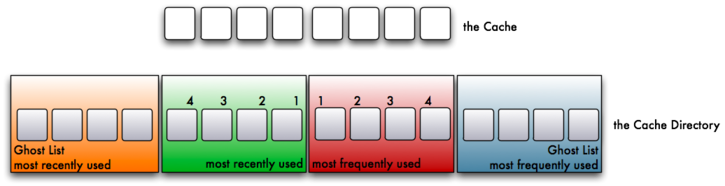
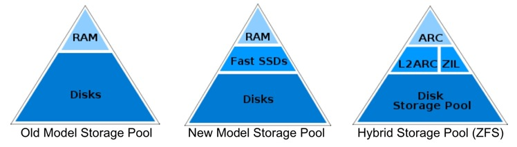

## zfs performance tuning basic  
                                                                                                                                                                                                       
### 作者                                                                                                                                                                                                   
digoal                                                                                                                                                                                                     
                                                                                                                                                                                                 
### 日期                                                                                                                                                                                                                    
2015-01-13                                                                                                                                                                                           
                                                                                                                                                                                                  
### 标签                                                                                                                                                                                                 
PostgreSQL , Linux , ZFS                                                                                                                                                                                               
                                                                                                                                                                                                                                   
----                                                                                                                                                                                                           
                                                                                                                                                                                                                                               
## 背景                                  
ZFS优化的一些基础常识.  
  
zfs模块每个参数的讲解, 包括IO调度, ARC的优化  
  
```  
man /usr/share/man/man5/zfs-module-parameters.5.gz  
```  
  
例如zfs将IO分为5个队列, 针对每个队列可以通过模块参数来控制IO调度, 例如为了提高同步写的能力, 同步写的active可以设大, 为了提高异步写的能力, 可以设置较大的脏ARC区域, 以及设置较宽的加速区域来降低同步写的冲突IO争抢.  
  
5个队列分别为同步读,写, 异步读,写, 以及ZFS自身的检查和修复操作IO.  
  
```  
ZFS I/O SCHEDULER  
       ZFS issues I/O operations to leaf vdevs to satisfy and complete I/Os.  The I/O scheduler determines when and in  
       what order those operations are issued.  The I/O scheduler divides operations into five I/O classes prioritized  
       in the following order: sync read, sync write, async read, async write, and scrub/resilver.  Each queue defines  
       the minimum and maximum number of concurrent operations that may be issued to the  device.   In  addition,  the  
       device  has  an  aggregate  maximum,  zfs_vdev_max_active. Note that the sum of the per-queue minimums must not  
       exceed the aggregate maximum.  If the sum of the per-queue maximums exceeds the  aggregate  maximum,  then  the  
       number of active I/Os may reach zfs_vdev_max_active, in which case no further I/Os will be issued regardless of  
       whether all per-queue minimums have been met.  
  
       For many physical devices, throughput increases with the number of concurrent operations, but latency typically  
       suffers. Further, physical devices typically have a limit at which more concurrent operations have no effect on  
       throughput or can actually cause it to decrease.  
  
       The scheduler selects the next operation to issue by first looking for an I/O class whose minimum has not  been  
       satisfied.  Once  all are satisfied and the aggregate maximum has not been hit, the scheduler looks for classes  
       whose maximum has not been satisfied. Iteration through the I/O classes is done in the order  specified  above.  
       No  further  operations  are issued if the aggregate maximum number of concurrent operations has been hit or if  
       there are no operations queued for an I/O class that has not hit its maximum.  Every time an I/O is  queued  or  
       an operation completes, the I/O scheduler looks for new operations to issue.  
  
       In general, smaller max_active’s will lead to lower latency of synchronous operations.  Larger max_active’s may  
       lead to higher overall throughput, depending on underlying storage.  
  
       The ratio of the queues’ max_actives determines the balance of performance between reads, writes,  and  scrubs.  
       E.g., increasing zfs_vdev_scrub_max_active will cause the scrub or resilver to complete more quickly, but reads  
       and writes to have higher latency and lower throughput.  
  
       All I/O classes have a fixed maximum number of outstanding operations except for the async write  class.  Asyn-  
       chronous writes represent the data that is committed to stable storage during the syncing stage for transaction  
       groups. Transaction groups enter the syncing state periodically so the  number  of  queued  async  writes  will  
       quickly burst up and then bleed down to zero. Rather than servicing them as quickly as possible, the I/O sched-  
       uler changes the maximum number of active async write I/Os according to the amount of dirty data in  the  pool.  
       Since  both throughput and latency typically increase with the number of concurrent operations issued to physi-  
       cal devices, reducing the burstiness in the number of concurrent operations also stabilizes the  response  time  
       of  operations  from other -- and in particular synchronous -- queues. In broad strokes, the I/O scheduler will  
       issue more concurrent operations from the async write queue as there’s more dirty data in the pool.  
  
       Async Writes  
  
       The number of concurrent operations issued for the async write I/O class follows a piece-wise  linear  function  
       defined by a few adjustable points.  
  
              |              o---------| <-- zfs_vdev_async_write_max_active  
         ^    |             /^         |  
         |    |            / |         |  
       active |           /  |         |  
        I/O   |          /   |         |  
       count  |         /    |         |  
              |        /     |         |  
              |-------o      |         | <-- zfs_vdev_async_write_min_active  
             0|_______^______|_________|  
              0%      |      |       100% of zfs_dirty_data_max  
                      |      |  
                      |      ‘-- zfs_vdev_async_write_active_max_dirty_percent  
                      ‘--------- zfs_vdev_async_write_active_min_dirty_percent  
  
       Until  the  amount  of  dirty  data exceeds a minimum percentage of the dirty data allowed in the pool, the I/O  
       scheduler will limit the number of concurrent operations to the minimum. As that threshold is crossed, the num-  
       ber  of  concurrent  operations issued increases linearly to the maximum at the specified maximum percentage of  
       the dirty data allowed in the pool.  
  
       Ideally, the amount of dirty data on a busy pool  will  stay  in  the  sloped  part  of  the  function  between  
       zfs_vdev_async_write_active_min_dirty_percent  and zfs_vdev_async_write_active_max_dirty_percent. If it exceeds  
       the maximum percentage, this indicates that the rate of incoming data is greater than the rate that the backend  
       storage can handle. In this case, we must further throttle incoming writes, as described in the next section.  
```  
  
通过延迟来控制IO请求.  
  
```  
ZFS TRANSACTION DELAY  
       We  delay  transactions  when  we’ve  determined that the backend storage isn’t able to accommodate the rate of  
       incoming writes.  
  
       If there is already a transaction waiting, we delay relative to when  that  transaction  will  finish  waiting.  
       This way the calculated delay time is independent of the number of threads concurrently executing transactions.  
  
       If we are the only waiter, wait relative to when the transaction started, rather than the current  time.   This  
       credits the transaction for "time already served", e.g. reading indirect blocks.  
  
       The minimum time for a transaction to take is calculated as:  
           min_time = zfs_delay_scale * (dirty - min) / (max - dirty)  
           min_time is then capped at 100 milliseconds.  
  
       The  delay has two degrees of freedom that can be adjusted via tunables.  The percentage of dirty data at which  
       we  start  to  delay  is  defined  by  zfs_delay_min_dirty_percent.  This  should  typically  be  at  or  above  
       zfs_vdev_async_write_active_max_dirty_percent  so  that  we only start to delay after writing at full speed has  
       failed to keep up with the incoming write rate. The scale of the curve is defined by  zfs_delay_scale.  Roughly  
       speaking, this variable determines the amount of delay at the midpoint of the curve.  
  
       delay  
        10ms +-------------------------------------------------------------*+  
             |                                                             *|  
         9ms +                                                             *+  
             |                                                             *|  
         8ms +                                                             *+  
             |                                                            * |  
         7ms +                                                            * +  
             |                                                            * |  
         6ms +                                                            * +  
             |                                                            * |  
         5ms +                                                           *  +  
             |                                                           *  |  
         4ms +                                                           *  +  
             |                                                           *  |  
         3ms +                                                          *   +  
             |                                                          *   |  
         2ms +                                              (midpoint) *    +  
             |                                                  |    **     |  
         1ms +                                                  v ***       +  
             |             zfs_delay_scale ---------->     ********         |  
           0 +-------------------------------------*********----------------+  
             0%                    <- zfs_dirty_data_max ->               100%  
  
       Note  that since the delay is added to the outstanding time remaining on the most recent transaction, the delay  
       is effectively the inverse of IOPS.  Here the midpoint of 500us translates to 2000 IOPS. The shape of the curve  
       was  chosen such that small changes in the amount of accumulated dirty data in the first 3/4 of the curve yield  
       relatively small differences in the amount of delay.  
  
       The effects can be easier to understand when the amount of delay is represented on a log scale:  
  
       delay  
       100ms +-------------------------------------------------------------++  
             +                                                              +  
             |                                                              |  
             +                                                             *+  
        10ms +                                                             *+  
             +                                                           ** +  
             |                                              (midpoint)  **  |  
             +                                                  |     **    +  
         1ms +                                                  v ****      +  
             +             zfs_delay_scale ---------->        *****         +  
             |                                             ****             |  
             +                                          ****                +  
       100us +                                        **                    +  
             +                                       *                      +  
             |                                      *                       |  
             +                                     *                        +  
        10us +                                     *                        +  
             +                                                              +  
             |                                                              |  
             +                                                              +  
             +--------------------------------------------------------------+  
             0%                    <- zfs_dirty_data_max ->               100%  
  
       Note here that only as the amount of dirty data approaches its limit does the delay start to increase  rapidly.  
       The  goal  of  a  properly  tuned  system should be to keep the amount of dirty data out of that range by first  
       ensuring that the appropriate limits are set for the I/O scheduler to reach optimal throughput on  the  backend  
       storage, and then by changing the value of zfs_delay_scale to increase the steepness of the curve.  
```  
  
## 最佳实践   
http://www.solarisinternals.com/wiki/index.php/ZFS_Best_Practices_Guide  
  
http://wiki.gentoo.org/wiki/ZFS  
  
zfs包的MAN文件 :   
  
```  
# rpm -ql zfs|grep man  
/usr/share/man/man1/zhack.1.gz  
/usr/share/man/man1/zpios.1.gz  
/usr/share/man/man1/ztest.1.gz  
/usr/share/man/man5/vdev_id.conf.5.gz  
/usr/share/man/man5/zfs-module-parameters.5.gz  
/usr/share/man/man5/zpool-features.5.gz  
/usr/share/man/man8/fsck.zfs.8.gz  
/usr/share/man/man8/mount.zfs.8.gz  
/usr/share/man/man8/vdev_id.8.gz  
/usr/share/man/man8/zdb.8.gz  
/usr/share/man/man8/zed.8.gz  
/usr/share/man/man8/zfs.8.gz  
/usr/share/man/man8/zinject.8.gz  
/usr/share/man/man8/zpool.8.gz  
/usr/share/man/man8/zstreamdump.8.gz  
  
# rpm -ql spl|grep man  
/usr/share/man/man1/splat.1.gz  
/usr/share/man/man5/spl-module-parameters.5.gz  
```  
  
模块信息  
  
```  
man /usr/share/man/man5/spl-module-parameters.5.gz	  
man /usr/share/man/man5/zfs-module-parameters.5.gz  
```  
  
模块配置举例  
  
```  
# vi /etc/modprobe.d/zfs.conf  
options zfs zfs_arc_max=140000000000                                                                                                  
options zfs zfs_dirty_data_max=28000000000                                                                                            
options zfs zfs_vdev_async_write_active_min_dirty_percent=10                                                                          
options zfs zfs_vdev_async_write_active_max_dirty_percent=30                                                                          
options zfs zfs_delay_min_dirty_percent=60                                                                                            
options zfs zfs_arc_shrink_shift=11   
```  
  
动态配置举例  
  
```  
# cd /sys/module/zfs/parameters/  
echo 140000000000 > zfs_arc_max  
```  
  
zfs arc统计信息举例  
  
```  
# cat /proc/spl/kstat/zfs/arcstats   
5 1 0x01 85 4080 8782326609 24297023672599  
name                            type data  
hits                            4    7126326  
misses                          4    427540  
demand_data_hits                4    6266146  
demand_data_misses              4    109399  
demand_metadata_hits            4    576415  
demand_metadata_misses          4    12326  
prefetch_data_hits              4    22855  
prefetch_data_misses            4    304415  
prefetch_metadata_hits          4    260910  
prefetch_metadata_misses        4    1400  
mru_hits                        4    1587485  
mru_ghost_hits                  4    8  
mfu_hits                        4    5255091  
mfu_ghost_hits                  4    16  
deleted                         4    9  
recycle_miss                    4    0  
mutex_miss                      4    0  
evict_skip                      4    0  
evict_l2_cached                 4    0  
evict_l2_eligible               4    0  
evict_l2_ineligible             4    2048  
hash_elements                   4    595708  
hash_elements_max               4    595728  
hash_collisions                 4    112924  
hash_chains                     4    19671  
hash_chain_max                  4    4  
p                               4    51202534400  
c                               4    102400000000  
c_min                           4    4194304  
c_max                           4    140000000000  
size                            4    66260770016  
hdr_size                        4    208741536  
data_size                       4    65659827200  
meta_size                       4    217717760  
other_size                      4    157795760  
anon_size                       4    4341760  
anon_evict_data                 4    0  
anon_evict_metadata             4    0  
mru_size                        4    51018742272  
mru_evict_data                  4    50805975040  
mru_evict_metadata              4    12618240  
mru_ghost_size                  4    7270469632  
mru_ghost_evict_data            4    7223246848  
mru_ghost_evict_metadata        4    47222784  
mfu_size                        4    14854460928  
mfu_evict_data                  4    14849526784  
mfu_evict_metadata              4    4213248  
mfu_ghost_size                  4    549280256  
mfu_ghost_evict_data            4    509110272  
mfu_ghost_evict_metadata        4    40169984  
l2_hits                         4    0  
l2_misses                       4    427519  
l2_feeds                        4    28921  
l2_rw_clash                     4    0  
l2_read_bytes                   4    0  
l2_write_bytes                  4    119772508160  
l2_writes_sent                  4    11483  
l2_writes_done                  4    11483  
l2_writes_error                 4    0  
l2_writes_hdr_miss              4    26  
l2_evict_lock_retry             4    0  
l2_evict_reading                4    0  
l2_free_on_write                4    1552  
l2_abort_lowmem                 4    0  
l2_cksum_bad                    4    0  
l2_io_error                     4    0  
l2_size                         4    51763794432  
l2_asize                        4    51697022976  
l2_hdr_size                     4    16687760  
l2_compress_successes           4    114612  
l2_compress_zeros               4    0  
l2_compress_failures            4    0  
memory_throttle_count           4    0  
duplicate_buffers               4    0  
duplicate_buffers_size          4    0  
duplicate_reads                 4    0  
memory_direct_count             4    0  
memory_indirect_count           4    0  
arc_no_grow                     4    0  
arc_tempreserve                 4    0  
arc_loaned_bytes                4    0  
arc_prune                       4    0  
arc_meta_used                   4    600942816  
arc_meta_limit                  4    76800000000  
arc_meta_max                    4    600942536  
```  
  
## ARC原理  
https://pthree.org/2012/12/07/zfs-administration-part-iv-the-adjustable-replacement-cache/  
  
ZFS adjustable replacement cache (ARC) 可以认为是IBM ARC的增强版.  
  
包含most recent used , most frequency used, mru ghost(数据块已驱逐到磁盘, 但是目录中还存储了磁盘的位置来加速读取), mfu ghost(数据块已驱逐到磁盘, 但是目录中还存储了磁盘的位置来加速读取)  
  
  
  
  
  
  
## 术语   
### Adjustable Replacement Cache, or ARC-   
  
A cache residing in physical RAM. It is built using two caches- the most frequently used cached and the most recently used cache. A cache directory indexes pointers to the caches, including pointers to disk called the ghost frequently used cache, and the ghost most recently used cache.  
  
### Cache Directory-   
  
An indexed directory of pointers making up the MRU, MFU, ghost MRU and ghost MFU caches.  
  
### MRU Cache-   
  
The most recently used cache of the ARC. The most recently requested blocks from the filesystem are cached here.  
  
### MFU Cache-   
  
The most frequently used cache of the ARC. The most frequently requested blocks from the filesystem are cached here.  
  
### Ghost MRU-   
  
Evicted pages from the MRU cache back to disk to save space in the MRU. Pointers still track the location of the evicted pages on disk.  
  
  
### Ghost MFU-   
  
Evicted pages from the MFU cache back to disk to save space in the MFU. Pointers still track the location of the evicted pages on disk.  
  
### Level 2 Adjustable Replacement Cache, or L2ARC-   
  
A cache residing outside of physical memory, typically on a fast SSD. It is a literal, physical extension of the RAM ARC.  
    
  
<a rel="nofollow" href="http://info.flagcounter.com/h9V1"  ></a>  
  
  
  
  
  
  
## [digoal's 大量PostgreSQL文章入口](https://github.com/digoal/blog/blob/master/README.md "22709685feb7cab07d30f30387f0a9ae")
  
