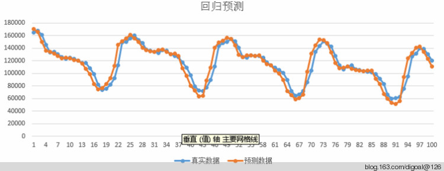
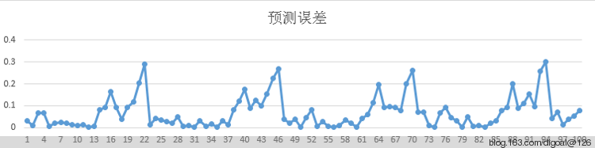
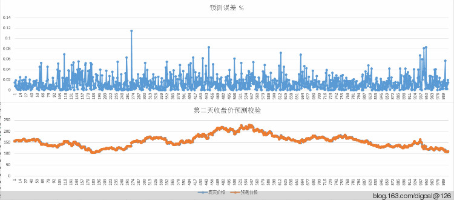

## 在PostgreSQL中用线性回归分析(linear regression) - 实现数据预测   
           
### 作者    
digoal      
    
### 日期      
2015-03-03           
           
### 标签     
PostgreSQL , 线性回归 , 数据预测              
           
----       
                                     
## 背景  
首先来个线性回归分析linear regression, 最小二乘法least-squares-fit的小故事(取自百度) :   
  
1801年，意大利天文学家朱赛普·皮亚齐发现了第一颗小行星谷神星。经过40天的跟踪观测后，由于谷神星运行至太阳背后，使得皮亚齐失去了谷神星的位置。随后全世界的科学家利用皮亚齐的观测数据开始寻找谷神星，但是根据大多数人计算的结果来寻找谷神星都没有结果。时年24岁的高斯也计算了谷神星的轨道。奥地利天文学家海因里希·奥尔伯斯根据高斯计算出来的轨道重新发现了谷神星。  
  
高斯使用的最小二乘法的方法发表于1809年他的著作《天体运动论》中。  
  
法国科学家勒让德于1806年独立发现“最小二乘法”，但因不为世人所知而默默无闻。  
  
勒让德曾与高斯为谁最早创立最小二乘法原理发生争执。  
  
1829年，高斯提供了最小二乘法的优化效果强于其他方法的证明，因此被称为高斯-马尔可夫定理.  
  
上面的故事说明通过已有数据可以对未来的数据进行预测. 但是预测结果是否准确有不确定因素, 所以需要不断的调整和校验.  
  
如何做回归分析呢? (取自百度)  
  
研究一个或多个随机变量Y1 ，Y2 ，…，Yi与另一些变量X1、X2，…，Xk之间的关系的统计方法，又称多重回归分析。通常称Y1，Y2，…，Yi为因变量，X1、X2，…，Xk为自变量。回归分析是一类数学模型，特别当因变量和自变量为线性关系时，它是一种特殊的线性模型。最简单的情形是一个自变量和一个因变量，且它们大体上有线性关系，这叫一元线性回归，即模型为Y=a+bX+ε，这里X是自变量，Y是因变量，ε是随机误差，通常假定随机误差的均值为0，方差为σ^2（σ^2大于0）σ^2与X的值无关。若进一步假定随机误差遵从正态分布，就叫做正态线性模型。一般的情形，它有k个自变量和一个因变量，因变量的值可以分解为两部分：一部分是由于自变量的影响，即表示为自变量的函数，其中函数形式已知，但含一些未知参数；另一部分是由于其他未被考虑的因素和随机性的影响，即随机误差。当函数形式为未知参数的线性函数时，称线性回归分析模型；当函数形式为未知参数的非线性函数时，称为非线性回归分析模型。当自变量的个数大于1时称为多元回归，当因变量个数大于1时称为多重回归。  
  
回归分析的主要内容为：  
  
①从一组数据出发，确定某些变量之间的定量关系式，即建立数学模型并估计其中的未知参数。估计参数的常用方法是最小二乘法。  
  
②对这些关系式的可信程度进行检验。  
  
③在许多自变量共同影响着一个因变量的关系中，判断哪个（或哪些）自变量的影响是显著的，哪些自变量的影响是不显著的，将影响显著的自变量入模型中，而剔除影响不显著的变量，通常用逐步回归、向前回归和向后回归等方法。  
  
④利用所求的关系式对某一生产过程进行预测或控制。回归分析的应用是非常广泛的，统计软件包使各种回归方法计算十分方便。  
  
在回归分析中，把变量分为两类。一类是因变量，它们通常是实际问题中所关心的一类指标，通常用Y表示；而影响因变量取值的的另一类变量称为自变量，用X来表示。  
  
回归分析研究的主要问题是：  
  
（1）确定Y与X间的定量关系表达式，这种表达式称为回归方程；  
  
（2）对求得的回归方程的可信度进行检验；  
  
（3）判断自变量X对因变量Y有无影响；  
  
（4）利用所求得的回归方程进行预测和控制。  
  
一个例子 :   
  
例如，如果要研究质量和用户满意度之间的因果关系，从实践意义上讲，产品质量会影响用户的满意情况，因此设用户满意度为因变量，记为Y；质量为自变量，记为X。  
  
根据图8－3的散点图，可以建立下面的线性关系：   
  
Y=A+BX+§  
  
公式中：A和B为待定参数，A为回归直线的截距；B为回归直线的斜率，表示X变化一个单位时，Y的平均变化情况；§为依赖于用户满意度的随机误差项。  
  
对于经验回归方程： y=0.857+0.836x  
  
回归直线在y轴上的截距为0.857、斜率0.836，即质量每提高一分，用户满意度平均上升0.836分；或者说质量每提高1分对用户满意度的贡献是0.836分。  
  
## PostgreSQL 线性回归分析相关函数  
在PostgreSQL中提供了回归分析的一些聚合函数,   
  
函数 | 参数类型 | 返回类型 | 描述  
---|---|---|---  
regr_avgx(Y, X)|	double precision|	double precision|	average of the independent variable (sum(X)/N)  
regr_avgy(Y, X)|	double precision|	double precision|	average of the dependent variable (sum(Y)/N)  
regr_count(Y, X)|	double precision|	bigint|	number of input rows in which both expressions are nonnull  
regr_intercept(Y, X)|	double precision|	double precision|	y-intercept of the least-squares-fit linear equation determined by the (X, Y) pairs  
regr_r2(Y, X)|	double precision|	double precision|	square of the correlation coefficient  
regr_slope(Y, X)|	double precision|	double precision|	slope of the least-squares-fit linear equation determined by the (X, Y) pairs  
regr_sxx(Y, X)|	double precision|	double precision|	sum(X^2) - sum(X)^2/N ("sum of squares" of the independent variable)  
regr_sxy(Y, X)|	double precision|	double precision|	sum(X*Y) - sum(X) * sum(Y)/N ("sum of products" of independent times dependent variable)  
regr_syy(Y, X)|	double precision|	double precision|	sum(Y^2) - sum(Y)^2/N ("sum of squares" of the dependent variable)  
  
本文会用到如下几个 :   
  
regr_intercept, 计算截距.  
  
regr_slope, 计算斜率.  
  
regr_r2, 计算相关性, 相关性越高, 说明这组数据用于预估的准确度越高.  
  
下面来举个例子 :   
  
将最近一年的某个业务的日访问量数据统计放到一张测试表.  
  
利用这一年的数据进行一元回归分析, 要预测的是因变量, 用作预测的是自变量. 因为要预测的数据未发生, 所以我们可以把时间交错一下, 就可以作为自变量来使用.  
  
例如下面这组数据, 自变量就是数据下移一行产生的. :   
  
因变量 | 自变量   
---|---  
 48000 | 54624  
 47454 | 48000  
 56766 | 47454  
 60488 | 56766  
 58191 | 60488  
 57443 | 58191  
 54277 | 57443  
 55508 | 54277  
 52716 | 55508  
 63748 | 52716  
 43462 | 63748  
 44248 | 43462  
 40145 | 44248  
  
如果影响的因素较多, 需要做多元回归, 你可以选择PostgreSQL R语言插件来分析，或者使用madlib库的训练函数进行分析.  
  
本文做的是一元回归的例子, 接下来进入测试 :   
  
创建一张过去365天的某业务的日下载量数据表.  
  
```  
digoal=> create table test as select row_number() over(order by dt) as rn,cnt from   
         (select date(createtime) as dt, count(*) as cnt from tbl_app_download where createtime>=( date(now())-366 ) and createtime<( date(now())-1 ) group by date(createtime)) as t;  
SELECT 365  
```  
  
数据大概是这样的  
  
```  
digoal=> select * from test;  
....  
 329 |   36293  
 330 |   40886  
 331 |   34465  
 332 |   30785  
 333 |   33318  
 334 |   34480  
....  
```  
  
接下来我们要来测试在不同数据范围内的回归的线性相关性,   
  
例如最近362天的数据交错后的回归线性相关性.  
  
```  
digoal=> select count(*),regr_r2(t.cnt,test.cnt) from   
(select rn-1 as rn,cnt from test) as t,test where t.rn=test.rn and test.rn>2;  
 count |      regr_r2        
-------+-------------------  
   362 | 0.835282212765017  
(1 row)  
```  
  
但是如果时间放大到最近363天, 相关性就降低到0.32915622582628了  
  
```  
digoal=> select count(*),regr_r2(t.cnt,test.cnt) from   
(select rn-1 as rn,cnt from test) as t,test where t.rn=test.rn and test.rn>1;  
 count |     regr_r2        
-------+------------------  
   363 | 0.32915622582628  
(1 row)  
```  
  
我们要不断的尝试来得到更好的相关性, 当获得最高的相关性(接近1)时, 预测数据最准确.  
  
接下来我们看看以上两个时间段产生的截距和斜率的预测准确度.  
  
截距  
  
```  
digoal=> select count(*),regr_intercept(t.cnt,test.cnt) from   
(select rn-1 as rn,cnt from test) as t,test where t.rn=test.rn and test.rn>2;  
 count |  regr_intercept    
-------+------------------  
   362 | 6274.25023499543  
(1 row)  
```  
  
斜率  
  
```  
digoal=> select count(*),regr_slope(t.cnt,test.cnt) from       
(select rn-1 as rn,cnt from test) as t,test where t.rn=test.rn and test.rn>2;  
 count |    regr_slope       
-------+-------------------  
   362 | 0.906861594725424  
(1 row)  
```  
  
使用自变量44248推测因变量40145.  
  
使用公式推测的结果为46401.062078405991152  
  
```  
digoal=> select 44248*0.906861594725424+6274.25023499543;  
       ?column?          
-----------------------  
 46401.062078405991152  
(1 row)  
```  
  
准确度 :   
  
```  
digoal=> select 40145/46401.062078405991152;  
        ?column?          
------------------------  
 0.86517416200873079820  
(1 row)  
```  
  
  
当我们使用另一组截距和斜率时, 准确度最低是0.32915622582628. 所以得到的预测结果可能不及以上的.  
  
截距  
  
```  
digoal=> select count(*),regr_intercept(t.cnt,test.cnt) from   
(select rn-1 as rn,cnt from test) as t,test where t.rn=test.rn and test.rn>1;  
 count |  regr_intercept    
-------+------------------  
   363 | 49279.0342891155  
(1 row)  
```  
  
斜率  
  
```  
digoal=> select count(*),regr_slope(t.cnt,test.cnt) from       
(select rn-1 as rn,cnt from test) as t,test where t.rn=test.rn and test.rn>1;  
 count |    regr_slope       
-------+-------------------  
   363 | 0.292250474909646  
(1 row)  
```  
  
预测结果  
  
```  
digoal=> select 44248*0.292250474909646+49279.0342891155;  
       ?column?          
-----------------------  
 62210.533302917516208  
(1 row)  
```  
  
准确度  
  
```  
digoal=> select 40145/62210.533302917516208;  
        ?column?          
------------------------  
 0.64530872616900233730  
(1 row)  
```  
  
接下来再提一下另外几个和回归相关的函数 :   
  
regr_avgx(y, x)其实就是算x的平均值(数学期望), y在这里没有任何作用.  
  
regr_avgy(y, x)其实就是算y的平均值(数学期望), x在这里没有任何作用.  
  
regr_count(y, x) 计算x和y都不是空的记录数.  
  
另外三个是辅助函数, 计算诊断统计信息(总方差, 总协方差).  
  
```  
regr_sxx(y, x)  :  sum(X^2) - sum(X)^2/N   
regr_sxy(y, x)  :  sum(X*Y) - sum(X) * sum(Y)/N  
regr_syy(y, x)  :  sum(Y^2) - sum(Y)^2/N   
  
REGR_SXY, REGR_SXX, REGR_SYY are auxiliary functions that are used to compute various diagnostic statistics.  
REGR_SXX makes the following computation after the elimination of null (expr1, expr2) pairs:  
REGR_COUNT(expr1, expr2) * VAR_POP(expr2)  
  
REGR_SYY makes the following computation after the elimination of null (expr1, expr2) pairs:  
REGR_COUNT(expr1, expr2) * VAR_POP(expr1)  
  
REGR_SXY makes the following computation after the elimination of null (expr1, expr2) pairs:  
REGR_COUNT(expr1, expr2) * COVAR_POP(expr1, expr2)  
```  
  
验证regr_sxx, sxy, syy.  
  
```  
postgres=# select regr_sxx(y,x), REGR_COUNT(y,x)*VAR_POP(x) from (values(2,400),(6,401),(7,400),(3,400),(1000,488)) as t(x,y);  
 regr_sxx |      ?column?         
----------+---------------------  
 792833.2 | 792833.200000000000  
(1 row)  
  
postgres=# select regr_sxy(y,x), REGR_COUNT(y,x)*COVAR_POP(x,y) from (values(2,400),(6,401),(7,400),(3,400),(1000,488)) as t(x,y);  
 regr_sxy | ?column?   
----------+----------  
  69885.6 |  69885.6  
(1 row)  
  
postgres=# select regr_syy(y,x), REGR_COUNT(y,x)*VAR_POP(y) from (values(2,400),(6,401),(7,400),(3,400),(1000,488)) as t(x,y);  
 regr_syy |       ?column?          
----------+-----------------------  
   6160.8 | 6160.8000000000000000  
(1 row)  
```  
  
好了, 先写到这里, 你还可以尝试更多的折腾玩法.  
  
自动选择最优相关的例子如下 .  
  
```  
=> select * from test order by to_char desc limit 10;  
  to_char   | count    
------------+--------  
 2015030123 | 149496  
 2015030122 | 165320  
 2015030121 | 167663  
 2015030120 | 161071  
 2015030119 | 145570  
 2015030118 | 133155  
 2015030117 | 133962  
 2015030116 | 130484  
 2015030115 | 126182  
 2015030114 | 122998  
(10 rows)  
  
=> do language plpgsql $$                           
declare   
  r2_1 numeric := 0;   
  r2_2 numeric := 0;   
  var int;  
  inter numeric;  
  slope numeric;  
  inter_2 numeric;  
  slope_2 numeric;  
  realv numeric;  
  predicv numeric;  
  offset_var int := 0; -- 最后一个值的预测值  
begin  
  for i in 1..450 loop  
    with t1 as (select row_number() over(order by to_char) as rn,count from test order by to_char desc offset offset_var),   
         t2 as (select row_number() over(order by to_char)-1 as rn,count from test order by to_char desc offset offset_var)    
      select regr_intercept(t2.count,t1.count),regr_slope(t2.count,t1.count),regr_r2(t1.count,t2.count) into inter,slope,r2_1 from t1,t2 where t1.rn=t2.rn and t1.rn>i;   
    if r2_1>r2_2 then   
      inter_2:=inter;  
      slope_2:=slope;  
      r2_2:=r2_1;   
      var:=i;  
    end if;   
  end loop;   
  
  raise notice '%, %, %, %', var, inter_2,slope_2,r2_2;  
  select slope_2*count+inter_2 into predicv from test order by to_char desc offset offset_var+1 limit 1;  
  select count into realv from test order by to_char desc offset offset_var limit 1;  
  raise notice '%, %', realv, predicv;  
end;  
$$;  
NOTICE:  436, 16599.0041292694, 0.896184690654355, 0.925125327496365  
NOTICE:  149496, 164756.257188247368600  
DO  
  
=> select 149496/164756.2;  
        ?column?          
------------------------  
 0.90737708201572990880  
(1 row)  
  
=> do language plpgsql $$                           
declare   
  r2_1 numeric := 0; -- 相关性  
  r2_2 numeric := 0; -- 最大相关性  
  var int;  --  样本数量  
  inter_1 numeric;  --  截距  
  slope_1 numeric;  --  斜率  
  inter_2 numeric;  --  最大相关性截距  
  slope_2 numeric;  --  最大相关性斜率  
  realv numeric;    --  真实数据  
  predicv numeric;  --  预测数据  
  offset_var int := 1;   -- 倒数第二个值的预测值, 不停迭代, 最后计算所有的实际值和预测值的corr, 看看相似度如何?  
begin  
  for i in 1..450 loop  
    with t1 as (select row_number() over(order by to_char) as rn,count from test order by to_char desc offset offset_var),   
         t2 as (select row_number() over(order by to_char)-1 as rn,count from test order by to_char desc offset offset_var)   
      select regr_intercept(t2.count,t1.count),regr_slope(t2.count,t1.count),regr_r2(t1.count,t2.count) into inter_1,slope_1,r2_1 from t1,t2 where t1.rn=t2.rn and t1.rn>i;  
    if r2_1>r2_2 then   
      inter_2 := inter_1;  
      slope_2 := slope_1;  
      r2_2 := r2_1;  
      var := i;  
    end if;  
  end loop;  
  
  raise notice '样本数量%, 截距%, 斜率%, 相关性%', var, round(inter_2,4), round(slope_2,4), round(r2_2,4);  
  select slope_2*count+inter_2 into predicv from test order by to_char desc offset offset_var+1 limit 1;  
  select count into realv from test order by to_char desc offset offset_var limit 1;  
  raise notice '真实数据%, 预测数据%, 本次预测偏差,%%%', realv, round(predicv), abs(1-round(predicv/realv,4))*100;  
end;  
$$;  
NOTICE:  样本数量436, 截距10109.8500, 斜率0.9573, 相关性0.9476  
NOTICE:  真实数据165320, 预测数据170611, 本次预测偏差,%3.2000  
DO  
```  
  
校验函数  
  
```  
=> create or replace function check_predict(IN ov int, OUT rv numeric, OUT pv numeric, OUT dev numeric) returns record as $$  
declare   
  r2_1 numeric := 0; -- 相关性  
  r2_2 numeric := 0; -- 最大相关性  
  var int;  --  样本数量  
  inter_1 numeric;  --  截距  
  slope_1 numeric;  --  斜率  
  inter_2 numeric;  --  最大相关性截距  
  slope_2 numeric;  --  最大相关性斜率  
  realv numeric;    --  真实数据  
  predicv numeric;  --  预测数据  
  offset_var int := ov;   -- 倒数第二个值的预测值, 不停迭代, 最后计算所有的实际值和预测值的corr, 看看相似度如何?  
  lps int := 0;  
begin  
  select count(*)-offset_var-4 into lps from test;  --  循环不要超过总样本数, 同时至少给2个样本.  
  for i in 1..lps loop   
    with t1 as (select row_number() over(order by to_char) as rn,to_char,count from test order by to_char desc offset offset_var),   
         t2 as (select row_number() over(order by to_char)-1 as rn,to_char,count from test order by to_char desc offset offset_var)   
      select regr_intercept(t2.count,t1.count),regr_slope(t2.count,t1.count),regr_r2(t1.count,t2.count) into inter_1,slope_1,r2_1 from t1,t2 where t1.rn=t2.rn and t1.rn>i;  
    if r2_1>r2_2 then   
      inter_2 := inter_1;  
      slope_2 := slope_1;  
      r2_2 := r2_1;  
      var := i;  
    end if;  
  end loop;  
  
  raise notice '样本数量%, 截距%, 斜率%, 相关性%', var, round(inter_2,4), round(slope_2,4), round(r2_2,4);  
  select slope_2*count+inter_2 into predicv from test order by to_char desc offset offset_var+1 limit 1;  
  select count into realv from test order by to_char desc offset offset_var limit 1;  
  raise notice '真实数据%, 预测数据%, 本次预测偏差%%%', realv, round(predicv), abs(1-round(predicv/realv,4))*100;  
  
  rv := realv;  
  pv := round(predicv);  
  dev := abs(1-round(predicv/realv,4));  
  return;  
end;  
$$ language plpgsql;  
```  
  
校验测试 :   
  
```  
=> select check_predict(i) from generate_series(1,100) t(i);  
NOTICE:  样本数量436, 截距10109.8500, 斜率0.9573, 相关性0.9476  
NOTICE:  真实数据165320, 预测数据170611, 本次预测偏差%3.2000  
NOTICE:  样本数量436, 截距6909.3635, 斜率0.9872, 相关性0.9419  
NOTICE:  真实数据167663, 预测数据165922, 本次预测偏差%1.0400  
NOTICE:  样本数量436, 截距8151.8730, 斜率0.9754, 相关性0.9249  
NOTICE:  真实数据161071, 预测数据150145, 本次预测偏差%6.7800  
NOTICE:  样本数量436, 截距14388.5296, 斜率0.9135, 相关性0.9275  
NOTICE:  真实数据145570, 预测数据136026, 本次预测偏差%6.5600  
NOTICE:  样本数量437, 截距30451.0167, 斜率0.7726, 相关性0.9570  
NOTICE:  真实数据133155, 预测数据133953, 本次预测偏差%0.6000  
NOTICE:  样本数量446, 截距343.4262, 斜率1.0262, 相关性0.9785  
NOTICE:  真实数据133962, 预测数据134241, 本次预测偏差%0.2100  
NOTICE:  样本数量437, 截距31491.5019, 斜率0.7616, 相关性0.9494  
NOTICE:  真实数据130484, 预测数据127596, 本次预测偏差%2.2100  
NOTICE:  样本数量438, 截距48512.9273, 斜率0.6126, 相关性0.9484  
NOTICE:  真实数据126182, 预测数据123864, 本次预测偏差%1.8400  
NOTICE:  样本数量438, 截距50299.8161, 斜率0.5940, 相关性0.9526  
NOTICE:  真实数据122998, 预测数据124578, 本次预测偏差%1.2800  
NOTICE:  样本数量442, 截距33561.3690, 斜率0.7444, 相关性0.9983  
NOTICE:  真实数据125052, 预测数据125119, 本次预测偏差%0.0500  
NOTICE:  样本数量438, 截距50126.2968, 斜率0.5954, 相关性0.9475  
NOTICE:  真实数据123000, 预测数据121572, 本次预测偏差%1.1600  
NOTICE:  样本数量438, 截距52640.6564, 斜率0.5687, 相关性0.9400  
NOTICE:  真实数据119991, 预测数据118710, 本次预测偏差%1.0700  
NOTICE:  样本数量438, 截距55198.2911, 斜率0.5404, 相关性0.9301  
NOTICE:  真实数据116182, 预测数据118363, 本次预测偏差%1.8800  
NOTICE:  样本数量438, 截距43721.8498, 斜率0.6665, 相关性0.9845  
NOTICE:  真实数据116887, 预测数据116082, 本次预测偏差%0.6900  
NOTICE:  样本数量1, 截距4661.3951, 斜率0.9464, 相关性0.8978  
NOTICE:  真实数据108562, 预测数据98517, 本次预测偏差%9.2500  
NOTICE:  样本数量1, 截距4675.5276, 斜率0.9460, 相关性0.8979  
NOTICE:  真实数据99168, 预测数据82725, 本次预测偏差%16.5800  
NOTICE:  样本数量432, 截距39520.3078, 斜率0.4823, 相关性0.9201  
NOTICE:  真实数据82505, 预测数据74942, 本次预测偏差%9.1700  
NOTICE:  样本数量432, 截距31502.3387, 斜率0.5457, 相关性0.9985  
NOTICE:  真实数据73450, 预测数据72804, 本次预测偏差%0.8800  
NOTICE:  样本数量432, 截距30417.7790, 斜率0.5542, 相关性0.9989  
NOTICE:  真实数据75681, 预测数据76143, 本次预测偏差%0.6100  
NOTICE:  样本数量432, 截距31775.6232, 斜率0.5440, 相关性0.9992  
NOTICE:  真实数据82509, 预测数据82187, 本次预测偏差%0.3900  
NOTICE:  样本数量1, 截距4622.2503, 斜率0.9465, 相关性0.8993  
NOTICE:  真实数据92670, 预测数据111447, 本次预测偏差%20.2600  
NOTICE:  样本数量1, 截距4531.6850, 斜率0.9481, 相关性0.9003  
NOTICE:  真实数据112865, 预测数据145539, 本次预测偏差%28.9500  
NOTICE:  样本数量412, 截距19211.5611, 斜率0.8778, 相关性0.9590  
NOTICE:  真实数据148731, 预测数据150848, 本次预测偏差%1.4200  
NOTICE:  样本数量412, 截距18806.5399, 斜率0.8820, 相关性0.9580  
NOTICE:  真实数据149961, 预测数据156169, 本次预测偏差%4.1400  
NOTICE:  样本数量412, 截距17050.6057, 斜率0.8991, 相关性0.9603  
NOTICE:  真实数据155748, 预测数据161289, 本次预测偏差%3.5600  
NOTICE:  样本数量412, 截距14830.5241, 斜率0.9202, 相关性0.9607  
NOTICE:  真实数据160430, 预测数据155939, 本次预测偏差%2.8000  
NOTICE:  样本数量412, 截距16540.9704, 斜率0.9034, 相关性0.9574  
NOTICE:  真实数据153344, 预测数据150240, 本次预测偏差%2.0200  
NOTICE:  样本数量412, 截距17692.1060, 斜率0.8917, 相关性0.9532  
NOTICE:  真实数据147997, 预测数据140772, 本次预测偏差%4.8800  
NOTICE:  样本数量414, 截距41717.5731, 斜率0.6980, 相关性0.9736  
NOTICE:  真实数据138023, 预测数据137013, 本次预测偏差%0.7300  
NOTICE:  样本数量414, 截距42191.4454, 斜率0.6933, 相关性0.9722  
NOTICE:  真实数据136535, 预测数据135075, 本次预测偏差%1.0700  
NOTICE:  样本数量414, 截距42836.5141, 斜率0.6866, 相关性0.9716  
NOTICE:  真实数据133978, 预测数据133909, 本次预测偏差%0.0500  
NOTICE:  样本数量414, 截距42868.4919, 斜率0.6863, 相关性0.9698  
NOTICE:  真实数据132634, 预测数据136891, 本次预测偏差%3.2100  
NOTICE:  样本数量414, 截距39356.6117, 斜率0.7213, 相关性0.9849  
NOTICE:  真实数据136998, 预测数据137674, 本次预测偏差%0.4900  
NOTICE:  样本数量418, 截距-98886.5041, 斜率1.7965, 相关性0.9925  
NOTICE:  真实数据136303, 预测数据136431, 本次预测偏差%0.0900  
NOTICE:  样本数量414, 截距41274.0892, 斜率0.7011, 相关性0.9848  
NOTICE:  真实数据130987, 预测数据130817, 本次预测偏差%0.1300  
NOTICE:  样本数量414, 截距41537.1100, 斜率0.6983, 相关性0.9803  
NOTICE:  真实数据127722, 预测数据129731, 本次预测偏差%1.5700  
NOTICE:  样本数量414, 截距35567.9284, 斜率0.7625, 相关性0.9901  
NOTICE:  真实数据126303, 预测数据124949, 本次预测偏差%1.0700  
NOTICE:  样本数量414, 截距41599.7365, 斜率0.6944, 相关性0.9993  
NOTICE:  真实数据117218, 预测数据117405, 本次预测偏差%0.1600  
NOTICE:  样本数量413, 截距1686.3033, 斜率1.1262, 相关性0.8957  
NOTICE:  真实数据109160, 预测数据110726, 本次预测偏差%1.4300  
NOTICE:  样本数量412, 截距-126088.7154, 斜率2.7998, 相关性0.9671  
NOTICE:  真实数据96823, 预测数据97097, 本次预测偏差%0.2800  
NOTICE:  样本数量408, 截距36426.6219, 斜率0.5003, 相关性0.9205  
NOTICE:  真实数据79716, 预测数据72776, 本次预测偏差%8.7100  
NOTICE:  样本数量408, 截距29915.3284, 斜率0.5522, 相关性0.9813  
NOTICE:  真实数据72658, 预测数据69530, 本次预测偏差%4.3100  
NOTICE:  样本数量409, 截距30542.2158, 斜率0.5286, 相关性0.9970  
NOTICE:  真实数据71739, 预测数据71377, 本次预测偏差%0.5100  
NOTICE:  样本数量408, 截距21294.1724, 斜率0.6206, 相关性0.9985  
NOTICE:  真实数据77243, 预测数据76786, 本次预测偏差%0.5900  
NOTICE:  样本数量1, 截距4921.7169, 斜率0.9414, 相关性0.8898  
NOTICE:  真实数据89412, 预测数据109386, 本次预测偏差%22.3400  
NOTICE:  样本数量406, 截距-771730.9711, 斜率6.1383, 相关性0.9650  
NOTICE:  真实数据110972, 预测数据112269, 本次预测偏差%1.1700  
NOTICE:  样本数量388, 截距15580.3852, 斜率0.9001, 相关性0.9520  
NOTICE:  真实数据144014, 预测数据149237, 本次预测偏差%3.6300  
NOTICE:  样本数量388, 截距14377.9729, 斜率0.9129, 相关性0.9524  
NOTICE:  真实数据148483, 预测数据151688, 本次预测偏差%2.1600  
NOTICE:  样本数量388, 截距13455.2553, 斜率0.9226, 相关性0.9497  
NOTICE:  真实数据150405, 预测数据156324, 本次预测偏差%3.9400  
NOTICE:  样本数量402, 截距71505.3386, 斜率0.5561, 相关性0.9759  
NOTICE:  真实数据154850, 预测数据155607, 本次预测偏差%0.4900  
NOTICE:  样本数量388, 截距11270.4334, 斜率0.9451, 相关性0.9387  
NOTICE:  真实数据151244, 预测数据144638, 本次预测偏差%4.3700  
NOTICE:  样本数量388, 截距14060.3682, 斜率0.9147, 相关性0.9332  
NOTICE:  真实数据141118, 预测数据129415, 本次预测偏差%8.2900  
NOTICE:  样本数量390, 截距36957.1231, 斜率0.7099, 相关性0.9656  
NOTICE:  真实数据126106, 预测数据125617, 本次预测偏差%0.3900  
NOTICE:  样本数量390, 截距37150.1505, 斜率0.7077, 相关性0.9636  
NOTICE:  真实数据124896, 预测数据128489, 本次预测偏差%2.8800  
NOTICE:  样本数量390, 截距34760.7660, 斜率0.7330, 相关性0.9714  
NOTICE:  真实数据129061, 预测数据128477, 本次预测偏差%0.4500  
NOTICE:  样本数量390, 截距35229.1317, 斜率0.7280, 相关性0.9667  
NOTICE:  真实数据127849, 预测数据128208, 本次预测偏差%0.2800  
NOTICE:  样本数量392, 截距4342.9938, 斜率1.0018, 相关性0.9702  
NOTICE:  真实数据127715, 预测数据129117, 本次预测偏差%1.1000  
NOTICE:  样本数量393, 截距-32076.9878, 斜率1.3312, 相关性0.9964  
NOTICE:  真实数据124554, 预测数据124206, 本次预测偏差%0.2800  
NOTICE:  样本数量393, 截距-19541.0766, 斜率1.2152, 相关性1.0000  
NOTICE:  真实数据117397, 预测数据117404, 本次预测偏差%0.0100  
NOTICE:  样本数量390, 截距47549.0400, 斜率0.5872, 相关性0.9902  
NOTICE:  真实数据112693, 预测数据111435, 本次预测偏差%1.1200  
NOTICE:  样本数量390, 截距50098.4943, 斜率0.5560, 相关性0.9977  
NOTICE:  真实数据108804, 预测数据108821, 本次预测偏差%0.0200  
NOTICE:  样本数量390, 截距50042.2813, 斜率0.5567, 相关性0.9964  
NOTICE:  真实数据105623, 预测数据105973, 本次预测偏差%0.3300  
NOTICE:  样本数量1, 截距5273.1579, 斜率0.9358, 相关性0.8782  
NOTICE:  真实数据100474, 预测数据89115, 本次预测偏差%11.3100  
NOTICE:  样本数量1, 截距5280.4763, 斜率0.9354, 相关性0.8785  
NOTICE:  真实数据89591, 预测数据72087, 本次预测偏差%19.5400  
NOTICE:  样本数量384, 截距30325.0273, 斜率0.5354, 相关性0.9387  
NOTICE:  真实数据71422, 预测数据64918, 本次预测偏差%9.1100  
NOTICE:  样本数量386, 截距37631.4820, 斜率0.4029, 相关性0.9941  
NOTICE:  真实数据64616, 预测数据64377, 本次预测偏差%0.3700  
NOTICE:  样本数量384, 截距20707.7226, 斜率0.6191, 相关性0.9961  
NOTICE:  真实数据66389, 预测数据65428, 本次预测偏差%1.4500  
NOTICE:  样本数量384, 截距17341.5766, 斜率0.6472, 相关性0.9978  
NOTICE:  真实数据72238, 预测数据72772, 本次预测偏差%0.7400  
NOTICE:  样本数量1, 截距5202.6036, 斜率0.9363, 相关性0.8805  
NOTICE:  真实数据85644, 预测数据102774, 本次预测偏差%20.0000  
NOTICE:  样本数量382, 截距-211937.8855, 斜率2.3700, 相关性0.9232  
NOTICE:  真实数据104207, 预测数据107341, 本次预测偏差%3.0100  
NOTICE:  样本数量363, 截距10473.2297, 斜率0.9328, 相关性0.9381  
NOTICE:  真实数据134716, 预测数据144319, 本次预测偏差%7.1300  
NOTICE:  样本数量363, 截距8082.7467, 斜率0.9608, 相关性0.9426  
NOTICE:  真实数据143484, 预测数据153571, 本次预测偏差%7.0300  
NOTICE:  样本数量379, 截距90033.9242, 斜率0.4106, 相关性0.9539  
NOTICE:  真实数据151426, 预测数据150648, 本次预测偏差%0.5100  
NOTICE:  样本数量363, 截距3555.4288, 斜率1.0121, 相关性0.9344  
NOTICE:  真实数据147628, 预测数据148068, 本次预测偏差%0.3000  
NOTICE:  样本数量377, 截距-22855.0642, 斜率1.3040, 相关性0.9608  
NOTICE:  真实数据142781, 预测数据143858, 本次预测偏差%0.7500  
NOTICE:  样本数量363, 截距8135.3139, 斜率0.9564, 相关性0.9081  
NOTICE:  真实数据127852, 预测数据116232, 本次预测偏差%9.0900  
NOTICE:  样本数量363, 截距11650.2051, 斜率0.9095, 相关性0.9209  
NOTICE:  真实数据113022, 预测数据107993, 本次预测偏差%4.4500  
NOTICE:  样本数量366, 截距43850.9025, 斜率0.5911, 相关性0.9231  
NOTICE:  真实数据105932, 预测数据109352, 本次预测偏差%3.2300  
NOTICE:  样本数量366, 截距41459.4112, 斜率0.6193, 相关性0.9421  
NOTICE:  真实数据110807, 预测数据111147, 本次预测偏差%0.3100  
NOTICE:  样本数量366, 截距41099.7207, 斜率0.6234, 相关性0.9330  
NOTICE:  真实数据112531, 预测数据107192, 本次预测偏差%4.7400  
NOTICE:  样本数量366, 截距45144.8340, 斜率0.5733, 相关性0.9910  
NOTICE:  真实数据106011, 预测数据105444, 本次预测偏差%0.5400  
NOTICE:  样本数量366, 截距45652.0542, 斜率0.5670, 相关性0.9907  
NOTICE:  真实数据105170, 预测数据104365, 本次预测偏差%0.7600  
NOTICE:  样本数量368, 截距57233.9599, 斜率0.4495, 相关性0.9969  
NOTICE:  真实数据103554, 预测数据103401, 本次预测偏差%0.1500  
NOTICE:  样本数量368, 截距58816.4609, 斜率0.4327, 相关性0.9999  
NOTICE:  真实数据102706, 预测数据102719, 本次预测偏差%0.0100  
NOTICE:  样本数量366, 截距45837.1316, 斜率0.5648, 相关性0.9874  
NOTICE:  真实数据101460, 预测数据101473, 本次预测偏差%0.0100  
NOTICE:  样本数量366, 截距45788.3201, 斜率0.5655, 相关性0.9787  
NOTICE:  真实数据98505, 预测数据97660, 本次预测偏差%0.8600  
NOTICE:  样本数量1, 截距5430.0126, 斜率0.9322, 相关性0.8723  
NOTICE:  真实数据91734, 预测数据83227, 本次预测偏差%9.2700  
NOTICE:  样本数量1, 截距5423.3347, 斜率0.9320, 相关性0.8726  
NOTICE:  真实数据83453, 预测数据66847, 本次预测偏差%19.9000  
NOTICE:  样本数量360, 截距30435.2931, 斜率0.4928, 相关性0.9223  
NOTICE:  真实数据65904, 预测数据59957, 本次预测偏差%9.0200  
NOTICE:  样本数量360, 截距25313.6494, 斜率0.5394, 相关性0.9738  
NOTICE:  真实数据59911, 预测数据58046, 本次预测偏差%3.1100  
NOTICE:  样本数量360, 截距22789.5261, 斜率0.5623, 相关性0.9761  
NOTICE:  真实数据60677, 预测数据57848, 本次预测偏差%4.6600  
NOTICE:  样本数量360, 截距14289.6380, 斜率0.6383, 相关性1.0000  
NOTICE:  真实数据62350, 预测数据62309, 本次预测偏差%0.0700  
NOTICE:  样本数量1, 截距5349.6991, 斜率0.9328, 相关性0.8743  
NOTICE:  真实数据75224, 预测数据94495, 本次预测偏差%25.6200  
NOTICE:  样本数量1, 截距5276.8974, 斜率0.9345, 相关性0.8761  
NOTICE:  真实数据95563, 预测数据124211, 本次预测偏差%29.9800  
NOTICE:  样本数量339, 截距10611.8990, 斜率0.9248, 相关性0.9273  
NOTICE:  真实数据127277, 预测数据132503, 本次预测偏差%4.1100  
NOTICE:  样本数量339, 截距9346.7583, 斜率0.9398, 相关性0.9270  
NOTICE:  真实数据131802, 预测数据141158, 本次预测偏差%7.1000  
NOTICE:  样本数量354, 截距45602.8301, 斜率0.6964, 相关性0.9378  
NOTICE:  真实数据140259, 预测数据142531, 本次预测偏差%1.6200  
NOTICE:  样本数量354, 截距22118.2940, 斜率0.8984, 相关性0.9995  
NOTICE:  真实数据139179, 预测数据139044, 本次预测偏差%0.1000  
NOTICE:  样本数量339, 截距7066.6202, 斜率0.9646, 相关性0.9085  
NOTICE:  真实数据130151, 预测数据123330, 本次预测偏差%5.2400  
NOTICE:  样本数量352, 截距788258.5127, 斜率-6.1054, 相关性0.9259  
NOTICE:  真实数据120531, 预测数据120243, 本次预测偏差%0.2400  
     check_predict        
------------------------  
 (165320,170611,0.0320)  
 (167663,165922,0.0104)  
 (161071,150145,0.0678)  
 (145570,136026,0.0656)  
 (133155,133953,0.0060)  
 (133962,134241,0.0021)  
 (130484,127596,0.0221)  
 (126182,123864,0.0184)  
 (122998,124578,0.0128)  
 (125052,125119,0.0005)  
 (123000,121572,0.0116)  
 (119991,118710,0.0107)  
 (116182,118363,0.0188)  
 (116887,116082,0.0069)  
 (108562,98517,0.0925)  
 (99168,82725,0.1658)  
 (82505,74942,0.0917)  
 (73450,72804,0.0088)  
 (75681,76143,0.0061)  
 (82509,82187,0.0039)  
 (92670,111447,0.2026)  
 (112865,145539,0.2895)  
 (148731,150848,0.0142)  
 (149961,156169,0.0414)  
 (155748,161289,0.0356)  
 (160430,155939,0.0280)  
 (153344,150240,0.0202)  
 (147997,140772,0.0488)  
 (138023,137013,0.0073)  
 (136535,135075,0.0107)  
 (133978,133909,0.0005)  
 (132634,136891,0.0321)  
 (136998,137674,0.0049)  
 (136303,136431,0.0009)  
 (130987,130817,0.0013)  
 (127722,129731,0.0157)  
 (126303,124949,0.0107)  
 (117218,117405,0.0016)  
 (109160,110726,0.0143)  
 (96823,97097,0.0028)  
 (79716,72776,0.0871)  
 (72658,69530,0.0431)  
 (71739,71377,0.0051)  
 (77243,76786,0.0059)  
 (89412,109386,0.2234)  
 (110972,112269,0.0117)  
 (144014,149237,0.0363)  
 (148483,151688,0.0216)  
 (150405,156324,0.0394)  
 (154850,155607,0.0049)  
 (151244,144638,0.0437)  
 (141118,129415,0.0829)  
 (126106,125617,0.0039)  
 (124896,128489,0.0288)  
 (129061,128477,0.0045)  
 (127849,128208,0.0028)  
 (127715,129117,0.0110)  
 (124554,124206,0.0028)  
 (117397,117404,0.0001)  
 (112693,111435,0.0112)  
 (108804,108821,0.0002)  
 (105623,105973,0.0033)  
 (100474,89115,0.1131)  
 (89591,72087,0.1954)  
 (71422,64918,0.0911)  
 (64616,64377,0.0037)  
 (66389,65428,0.0145)  
 (72238,72772,0.0074)  
 (85644,102774,0.2000)  
 (104207,107341,0.0301)  
 (134716,144319,0.0713)  
 (143484,153571,0.0703)  
 (151426,150648,0.0051)  
 (147628,148068,0.0030)  
 (142781,143858,0.0075)  
 (127852,116232,0.0909)  
 (113022,107993,0.0445)  
 (105932,109352,0.0323)  
 (110807,111147,0.0031)  
 (112531,107192,0.0474)  
 (106011,105444,0.0054)  
 (105170,104365,0.0076)  
 (103554,103401,0.0015)  
 (102706,102719,0.0001)  
 (101460,101473,0.0001)  
 (98505,97660,0.0086)  
 (91734,83227,0.0927)  
 (83453,66847,0.1990)  
 (65904,59957,0.0902)  
 (59911,58046,0.0311)  
 (60677,57848,0.0466)  
 (62350,62309,0.0007)  
 (75224,94495,0.2562)  
 (95563,124211,0.2998)  
 (127277,132503,0.0411)  
 (131802,141158,0.0710)  
 (140259,142531,0.0162)  
 (139179,139044,0.0010)  
 (130151,123330,0.0524)  
 (120531,120243,0.0024)  
(100 rows)  
```  
  
预测曲线 :   
  
  
  
预测误差 :    
  
  
  
以下是拿贵州茅台的日收盘价格做的第二天收盘价格一元回归预测以及校验图,   
  
  
  
## 参考  
1\. http://www.math.zju.edu.cn/ligangliu/Courses/MathematicalModeling_2005-2006/Syllabus/chapter_10.pdf  
  
2\. http://210.28.216.200/cai/tongji/html/main.htm  
  
3\. http://zh.wikipedia.org/wiki/%E6%9C%80%E5%B0%8F%E4%BA%8C%E4%B9%98%E6%B3%95  
  
4\. http://baike.baidu.com/view/145440.htm  
  
5\. http://baike.baidu.com/view/139822.htm  
  
6\. http://en.wikipedia.org/wiki/Simple_linear_regression  
  
7\. http://docs.oracle.com/cd/B28359_01/server.111/b28286/functions139.htm  
  
8\. http://www.postgresql.org/docs/9.4/static/functions-aggregate.html  
  
9\. http://v.ku6.com/playlist/index_6598382.html  
  
10\. http://cos.name/tag/%E5%9B%9E%E5%BD%92%E5%88%86%E6%9E%90/  
  
11\. http://my.oschina.net/u/1047640/blog/198956  
  
  
                                                                              
                              
  
<a rel="nofollow" href="http://info.flagcounter.com/h9V1"  ></a>  
  
  
  
  
  
  
## [digoal's 大量PostgreSQL文章入口](https://github.com/digoal/blog/blob/master/README.md "22709685feb7cab07d30f30387f0a9ae")
  
