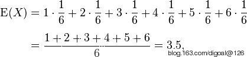
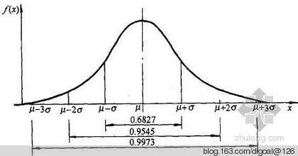
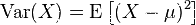
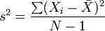
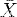
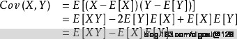

## 用PostgreSQL了解一些统计学术语以及计算方法和表示方法 - 1  
                 
### 作者          
digoal            
          
### 日期            
2015-03-03                 
                 
### 标签           
PostgreSQL , 线性回归 , 数据预测 , 股价预测 , 统计学 , 方差 , 截距 , 斜率 , 相关性                        
                 
----             
                                           
## 背景        
1\. 数学期望值, 平均值, mean  
  
http://zh.wikipedia.org/wiki/%E6%9C%9F%E6%9C%9B%E5%80%BC  
  
表示: E[X], 即X变量的平均值.  
  
  
  
也用miu表示 : μ=E[X]  
  
PostgreSQL中举例 :   
  
```  
postgres=# select avg(c1) from (values(null),(1),(2)) as t(c1);  
        avg           
--------------------  
 1.5000000000000000  
(1 row)  
```  
  
以上为离散概率, 数学期望就是每个值乘以它的概率除以值的个数.  
  
如果是连续概率的话, 要统计一个取值范围的区间概率, 统计一个区间的面积.  
  
  
  
2\. 众数, mode  
  
http://zh.wikipedia.org/wiki/%E4%BC%97%E6%95%B0_(%E6%95%B0%E5%AD%A6)  
  
出现频率最高的值.  
  
PostgreSQL中举例, 如果有多个同样频率的, 取第一个 :   
  
```  
postgres=# select mode() WITHIN GROUP (ORDER BY c1) from (values(null),(1),(2),(1),(2),(3)) as t(c1);  
 mode   
------  
    1  
(1 row)  
postgres=# select mode() WITHIN GROUP (ORDER BY c1 desc) from (values(null),(1),(2),(1),(2),(3)) as t(c1);  
 mode   
------  
    2  
(1 row)  
```  
  
其实在PostgreSQL统计信息中也用到了众数类似(延展)的概念, 即mcv, mce. 最频繁出现的值. 见pg_stats.  
  
```  
postgres=# \d pg_stats  
          View "pg_catalog.pg_stats"  
         Column         |   Type   | Modifiers   
------------------------+----------+-----------  
 schemaname             | name     |   
 tablename              | name     |   
 attname                | name     |   
 inherited              | boolean  |   
 null_frac              | real     |   
 avg_width              | integer  | 数学期望  
 n_distinct             | real     |   
 most_common_vals       | anyarray |  众数类似  
 most_common_freqs      | real[]   |  众数概率  
 histogram_bounds       | anyarray | 中位数类似  
 correlation            | real     | 相关度  
 most_common_elems      | anyarray |   众数类似  
 most_common_elem_freqs | real[]   |   众数概率  
 elem_count_histogram   | real[]   | 中位数类似  
```  
  
3\. 中位数, Median  
  
http://zh.wikipedia.org/wiki/%E4%B8%AD%E4%BD%8D%E6%95%B8  
  
取按数字大小顺序排好后的中间数字, 如果是偶数个, 则取两个值的平均值.  
  
例如: 1,3,5,7,9的中位数为5.  
  
例如: 1,3,5,7,9,10的中位数为(5+7)/2=6  
  
中位数在PostgreSQL统计信息中也有类似的应用, 即柱状分布, 见pg_stats.histogram_bounds. 每个区间(bucket)的概率是相等的, 每个值的两边的bucket概率是相等的. 类似中位数的概念.  
  
4\. 方差, Variance  
  
http://zh.wikipedia.org/wiki/%E6%96%B9%E5%B7%AE  
  
方差是各个数据分别与其平均数之差的平方的和的平均数，用字母D表示。在概率论和数理统计中，方差（Variance）用来度量随机变量和其数学期望（即均值）之间的偏离程度。在许多实际问题中，研究随机变量和均值之间的偏离程度有着重要意义。  
  
设X为服从分布F的随机变量， 如果E[X]是随机变量X的期望值（平均数μ=E[X]）  
  
随机变量X或者分布F的方差为  
  
(总体方差) :   
  
  
  
(样本方差) :   
  
样本方差是依据所给样本对方差做出的一个无偏估计。  
  
样本方差的计算公式以及表述符号为:   
  
  
  
其中： 为样本均值 N为样本个数  
  
PostgreSQL中举例 :   
  
从计算方法来看.方差可以评估一组数字的离散度(如下).  
  
总体方差.  
  
```  
postgres=# select var_pop(c1) from (values(1),(2),(3),(4),(5)) as t(c1);  
      var_pop         
--------------------  
 2.0000000000000000  
(1 row)  
postgres=# select var_pop(c1) from (values(1),(2),(3),(4),(5),(1000)) as t(c1);  
       var_pop         
---------------------  
 138058.472222222222  
(1 row)  
postgres=# select var_pop(c1) from (values(1000),(1001),(1003),(1004),(1005),(1000)) as t(c1);  
      var_pop         
--------------------  
 3.8055555555555556  
(1 row)  
```  
  
样本方差  
  
```  
postgres=# select var_samp(c1) from (values(1),(2),(3),(4),(5)) as t(c1);  
      var_samp        
--------------------  
 2.5000000000000000  
(1 row)  
postgres=# select var_samp(c1) from (values(1),(2),(3),(4),(5),(1000)) as t(c1);  
      var_samp         
---------------------  
 165670.166666666667  
(1 row)  
postgres=# select var_samp(c1) from (values(1000),(1001),(1003),(1004),(1005),(1000)) as t(c1);  
      var_samp        
--------------------  
 4.5666666666666667  
(1 row)  
```  
  
5\. 标准差, Standard Deviation, 对应方差的平方根. 也可用于评估离散度.  
  
表示符号和方差一样, 但是符号上头没有代表平方的2.  
  
http://zh.wikipedia.org/wiki/%E6%A8%99%E6%BA%96%E5%B7%AE  
  
标准差（Standard Deviation） ，中文环境中又常称均方差，但不同于均方误差（mean squared error，均方误差是各数据偏离真实值的距离平方的平均数，也即误差平方和的平均数，计算公式形式上接近方差，它的开方叫均方根误差，均方根误差才和标准差形式上接近），标准差是离均差平方和平均后的方根，用σ表示。标准差是方差的算术平方根。标准差能反映一个数据集的离散程度。平均数相同的，标准差未必相同。  
  
标准差（Standard Deviation），在概率统计中最常使用作为统计分布程度（statistical dispersion）上的测量。标准差定义是总体各单位标准值与其平均数离差平方的算术平均数的平方根。它反映组内个体间的离散程度。  
  
总体标准差  
  
```  
postgres=# select stddev_pop(c1) from (values(1000),(1001),(1003),(1004),(1005),(1000)) as t(c1);  
     stddev_pop       
--------------------  
 1.9507833184532709  
(1 row)  
postgres=# select dsqrt(var_pop(c1)) from (values(1000),(1001),(1003),(1004),(1005),(1000)) as t(c1);  
      dsqrt         
------------------  
 1.95078331845327  
(1 row)  
```  
  
样本标准差  
  
```  
postgres=# select stddev_samp(c1) from (values(1000),(1001),(1003),(1004),(1005),(1000)) as t(c1);  
    stddev_samp       
--------------------  
 2.1369760566432809  
(1 row)  
postgres=# select dsqrt(var_samp(c1)) from (values(1000),(1001),(1003),(1004),(1005),(1000)) as t(c1);  
      dsqrt         
------------------  
 2.13697605664328  
(1 row)  
```  
  
6\. 协方差, Covariance  
  
http://zh.wikipedia.org/wiki/%E5%8D%8F%E6%96%B9%E5%B7%AE  
  
在概率论和统计学中，协方差用于衡量两个变量的总体误差(如果两组数据的误差一样, 那么和计算一组数据的方差得到的结果是一样的)。  
  
而方差是协方差的一种特殊情况，即当两个变量是相同的情况。  
  
注意这里提到方差是两个变量相等时的协方差, 一会我在PostgreSQL里面验证一下.  
  
  
  
在PostgreSQL中计算一组数据协方差的方法.  
  
总体协方差  
  
```  
postgres=# select covar_pop(c1,c2) from (values(1,2),(2,3),(3,4),(4,5),(5,6),(1000,1001)) as t(c1,c2);  
    covar_pop       
------------------  
 138058.472222222  
(1 row)  
```  
  
样本协方差  
  
```  
postgres=# select covar_samp(c1,c2) from (values(1,2),(2,3),(3,4),(4,5),(5,6),(1000,1001)) as t(c1,c2);  
    covar_samp      
------------------  
 165670.166666667  
(1 row)  
```  
  
在PostgreSQL中验证 : 方差是两个变量相等时的协方差  
  
```  
postgres=# select var_pop(c1) from (values(1),(2),(3),(4),(5),(1000)) as t(c1);  
       var_pop         
---------------------  
 138058.472222222222  
(1 row)  
postgres=# select covar_pop(c1,c1) from (values(1),(2),(3),(4),(5),(1000)) as t(c1);  
    covar_pop       
------------------  
 138058.472222222  
(1 row)  
```  
  
验证 : (如果两组数据的误差一样, 那么和计算一组数据的方差得到的结果是一样的)。  
  
如下两组数据, 1,2,3,4,5,1000; 2,3,4,5,6,1001; 他们各自的方差一样, 所以协方差也一样  
  
```  
postgres=# select var_pop(c1) from (values(1,2),(2,3),(3,4),(4,5),(5,6),(1000,1001)) as t(c1,c2);  
       var_pop         
---------------------  
 138058.472222222222  
(1 row)  
postgres=# select var_pop(c2) from (values(1,2),(2,3),(3,4),(4,5),(5,6),(1000,1001)) as t(c1,c2);  
       var_pop         
---------------------  
 138058.472222222222  
(1 row)  
postgres=# select covar_pop(c1,c2) from (values(1,2),(2,3),(3,4),(4,5),(5,6),(1000,1001)) as t(c1,c2);  
    covar_pop       
------------------  
 138058.472222222  
(1 row)  
```  
  
7\. 相关性, 线性相关性, Correlation   
  
表示两组数据的相关性, 相关值从0到1取值, 趋向1表示完全相关, 趋向0 表示完全不相关.  
  
http://zh.wikipedia.org/wiki/%E7%9B%B8%E5%85%B3  
  
http://baike.baidu.com/view/172091.htm  
  
相关表和相关图可反映两个变量之间的相互关系及其相关方向，但无法确切地表明两个变量之间相关的程度。于是，著名统计学家卡尔·皮尔逊设计了统计指标——相关系数(Correlation coefficient)。相关系数是用以反映变量之间相关关系密切程度的统计指标。相关系数是按积差方法计算，同样以两变量与各自平均值的离差为基础，通过两个离差相乘来反映两变量之间相关程度；着重研究线性的单相关系数。  
  
在PostgreSQL中的统计信息中也有相关性的应用, 例如用于评估数据的物理存储和值的相关性, 方便优化器计算索引扫描的成本, 相关性越高, 越趋向索引, 因为离散块扫描会更少. 可以参考如下.  
  
http://blog.163.com/digoal@126/blog/static/163877040201512810112541/  
  
在PostgreSQL中计算两组数据的相关性.  
  
```  
postgres=# select corr(c1,c2) from (values(1,2),(2,3),(3,4),(4,5),(5,6),(1000,1001)) as t(c1,c2);  
 corr   
------  
    1  
(1 row)  
postgres=# select corr(c1,c2) from (values(1,2),(2,3),(3,4),(4,5),(5,6),(1000,1)) as t(c1,c2);  
        corr          
--------------------  
 -0.652023240836194  
(1 row)  
```  
  
另外可看百度提到的例子 :   
  
软件公司在全国有许多代理商，为研究它的财务软件产品的广告投入与销售额的关系，统计人员随机选择10家代理商进行观察，搜集到年广告投入费和月平均销售额的数据，并编制成相关表，见表1:  
  
表1　广告费与月平均销售额相关表　单位：万元  
  
```  
年广告费投入 | 月均销售额  
12.5　　15.3　　23.2　　26.4　　33.5　　34.4　　39.4　　45.2　　55.4　　60.9  
21.2　　23.9　　32.9　　34.1　　42.5　　43.2　　49.0　　52.8　　59.4　　63.5  
```  
  
参照表1，可计算相关系数如表2：  
  
```  
序号 | 广告投入(万元) x | 月均销售额(万元) y  
1　　2　　3　　4　　5　　6　　7　　8　　9　　10  
12.5　　15.3　　23.2　　26.4　　33.5　　34.4　　39.4　　45.2　　55.4　　60.9  
21.2　　23.9　　32.9　　34.1　　42.5　　43.2　　49.0　　52.8　　59.4　　63.5  
156.25　　234.09　　538.24　　696.96　　1122.25　　1183.36　　1552.36　　2043.04　　3069.16　　3708.81  
449.44　　571.21　　1082.41　　1162.81　　1806.25　　1866.24　　2401.00　　2787.84　　3528.36　　4032.25  
265.00　　365.67　　763.28　　900.24　　1423.75　　1486.08　　1930.60　　2386.56　　3290.76　　3867.15  
合计  346.2  422.5  14304.52  19687.81  16679.09  
```  
  
=0.9942  
  
相关系数为0.9942，说明广告投入费与月平均销售额之间有高度的线性正相关关系。  
  
相关性越高, 说明广告投入和销售额的关系越明显.  
  
相关性是如何计算的呢? 实际上是 "协方差(x,y)除以(平方根(方差(x)*方差(y)))" .   
  
  
  
```  
postgres=# select corr(c1,c2) from (values(1,2),(2,3),(3,4),(4,5),(5,6),(1000,1)) as t(c1,c2);  
        corr          
--------------------  
 -0.652023240836194  
(1 row)  
```  
  
使用以上公式计算结果一致 :   
  
```  
postgres=# select covar_pop(c1,c2)/dsqrt(var_pop(c1)*var_pop(c2)) from (values(1,2),(2,3),(3,4),(4,5),(5,6),(1000,1)) as t(c1,c2);  
      ?column?        
--------------------  
 -0.652023240836194  
(1 row)  
```  
  
## 参考  
1\. 百度百科  
  
2\. 百度词条  
  
3\. 维基百科  
  
4\. http://www.postgresql.org/docs/9.4/static/functions-aggregate.html  
  
5\. 用到的PostgreSQL聚合函数源码在此  
  
    src/backend/utils/adt/float.c  
  
6\. 更多玩法, 如果要在PostgreSQL中使用R语言或MADlib库, 请参考如下.  
  
http://www.joeconway.com/plr/  
  
http://madlib.net/  
  
  
        
                                                                                    
                                    
  
<a rel="nofollow" href="http://info.flagcounter.com/h9V1"  ></a>  
  
  
  
  
  
  
## [digoal's 大量PostgreSQL文章入口](https://github.com/digoal/blog/blob/master/README.md "22709685feb7cab07d30f30387f0a9ae")
  
