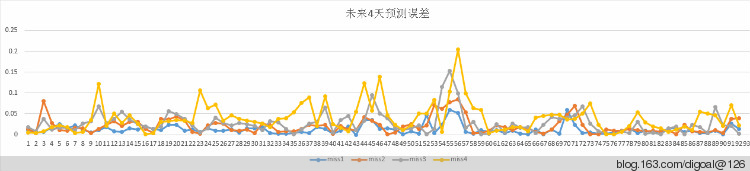

## 在PostgreSQL中用线性回归分析linear regression做预测 - 例子2, 预测未来数日某股收盘价   
               
### 作者        
digoal          
        
### 日期          
2015-03-05               
               
### 标签         
PostgreSQL , 线性回归 , 数据预测 , 股价预测                    
               
----           
                                         
## 背景      
请先参考如下文章，了解线性回归的原理，以及PostgreSQL有哪些函数可以支撑线性回归分析。  
  
[《PostgreSQL aggregate function 2 : Aggregate Functions for Statistics》](../201503/20150303_03.md)  
  
[《用PostgreSQL了解一些统计学术语以及计算方法和表示方法 - 1》](../201503/20150303_02.md)  
  
[《在PostgreSQL中用线性回归分析(linear regression) - 实现数据预测》](../201503/20150303_01.md)  
  
[《PostgreSQL 线性回归 - 股价预测 1》](../201503/20150304_01.md)  
  
## 正文  
以贵州茅台的历史数据为例, 校验预测误差如下 :   
  
未来1天的最准  
  
未来第二天的预测开始误差开始放大, 但是放大还不明显..  
  
未来第三天,第四天的就有比较大的误差率.  
  
  
  
将数据导入源表  
  
插入顺序从旧到新排列. 不要搞反了, 例如  
  
```  
06/02/2010	13.49	13.49	12.52	13.03	38670320	1571709568.000  
06/03/2010	13.09	13.26	12.69	12.75	27873689	1135419264.000  
06/04/2010	12.63	12.99	12.56	12.77	19305447	775373248.000  
06/07/2010	12.52	13.13	12.43	13.03	24762597	997748928.000  
06/08/2010	12.99	13.02	12.56	12.82	18987054	762023168.000  
06/09/2010	12.87	13.90	12.87	13.36	38510441	1623107328.000  
06/10/2010	13.37	13.51	13.26	13.39	19669987	823111744.000  
06/11/2010	13.46	13.58	13.27	13.37	18622806	783614336.000  
06/17/2010	13.48	13.99	13.29	13.31	25604558	1095663744.000  
06/18/2010	13.13	13.23	12.37	12.57	24897719	996842496.000  
....  
  
create table orig (id int, x numeric);  
```  
  
数据转换为  
  
```  
1, 13.49  
2, 13.09  
,......  
```  
  
创建样本表  
  
```  
create table tmp (  
id int,   
x numeric, -- 自变量  
y numeric  -- 因变量  
);  
```  
  
自变量和因变量的选择很有讲究.  
  
例如你可以选择昨天的收盘价和今天的开盘价作为自变量和因变量.  
  
当然也可以做多元的分析, 例如昨天的收盘价, 交易量作为自变量, 今天的开盘价作为因变量.  
  
等等......  
  
昨天预测今天的样本数据  
  
```  
truncate tmp;  
insert into tmp   
  select id,   
  lag(x,1) over(order by id),   
  x from orig;  
```  
  
生成最近2天预测未来1天的样本数据  
  
```  
create table tmp1 (like tmp);  
insert into tmp1   
select id,  
x+  
lag(x,1) over(order by id),  
lead(x,1) over(order by id)  
from orig;  
```  
  
生成最近3天预测未来2天的样本数据  
  
```  
create table tmp2 (like tmp);  
insert into tmp2   
select id,  
x+  
lag(x,1) over(order by id)+  
lag(x,2) over(order by id),  
lead(x,1) over(order by id)+  
lead(x,2) over(order by id)  
from orig;  
```  
  
生成最近4天预测未来3天的样本数据  
  
```  
create table tmp3 (like tmp);  
insert into tmp3   
select id,  
x+  
lag(x,1) over(order by id)+  
lag(x,2) over(order by id)+  
lag(x,3) over(order by id),  
lead(x,1) over(order by id)+  
lead(x,2) over(order by id)+  
lead(x,3) over(order by id)  
from orig;  
```  
  
生成最近5天预测未来4天的样本数据  
  
```  
create table tmp4 (like tmp);  
insert into tmp4   
select id,  
x+  
lag(x,1) over(order by id)+  
lag(x,2) over(order by id)+  
lag(x,3) over(order by id)+  
lag(x,4) over(order by id),  
lead(x,1) over(order by id)+  
lead(x,2) over(order by id)+  
lead(x,3) over(order by id)+  
lead(x,4) over(order by id)  
from orig;  
```  
  
生成预测数据的函数如下  
  
```  
CREATE OR REPLACE FUNCTION public.check_predict(  
IN v_tbl name,       --  样本表名  
IN OUT ov integer,   --  校验哪条记录, 倒数第?个值的预测值, 不停迭代, 最后计算所有的实际值和预测值的corr, 选择最佳相关?  
OUT v_id int,        --  真实值唯一标识  
OUT r_chkv numeric,  --  真实值, 用于校验  
OUT p_yv numeric,    --  预测值,因变量  
OUT r_xv numeric,    --  自变量,用于预测因变量  
OUT dev numeric,     --  误差  
OUT v_slope numeric, --  斜率  
OUT v_inter numeric, --  截距  
OUT v_r2  numeric,   --  相关性  
OUT sampcnt int      --  获得最大相关度的样本数  
)  
 RETURNS record  
 LANGUAGE plpgsql  
AS $function$  
declare   
  r2_1 numeric := 0; -- 相关性  
  r2_2 numeric := 0; -- 最大相关性  
  inter_1 numeric;  --  截距  
  slope_1 numeric;  --  斜率  
  inter_2 numeric;  --  最大相关性截距  
  slope_2 numeric;  --  最大相关性斜率  
  v_lmt int := 90;  --  使用的最大样本集, 影响预测准确度  
  v_min int := 5;   --  使用的最小样本数, 影响预测准确度  
begin  
  --  自变量 tbl.x  
  --  因变量 tbl.y  
  
  --  筛选最大相关度的样本数, 并记录下储斜率, 截距.  
  for i in 0..v_lmt   
  loop  
    execute $_$with t1 as   
      (   
       select row_number() over(order by id desc) as rn,*   
       from   
       (select id,x,y from $_$||v_tbl||$_$ where x+y is not null order by id desc offset $1 limit $2) t  
      )  
        select regr_intercept(t1.y,t1.x), regr_slope(t1.y,t1.x), regr_r2(t1.y,t1.x)   
        from t1  
        where t1.rn<=$3 $_$  
    into inter_1,slope_1,r2_1  
    using ov, v_lmt+v_min, i+v_min;  
  
    if r2_1>r2_2 then   
      inter_2 := inter_1;  
      slope_2 := slope_1;  
      r2_2 := r2_1;  
      sampcnt := i+v_min;  
    end if;  
  end loop;  
  
  --  下一个自变量ID, 用于预测因变量  
  execute $_$select id+1 from $_$||v_tbl||$_$ where x+y is not null order by id desc offset $1 limit 1$_$  
  into v_id using ov;  
  
  --  预测值,自变量,真实值, 如果真实值为空, 说明该条记录没有未来的真实记录, 就是要预测的将来值.  
  execute $_$select round($_$||slope_2||'*x+'||inter_2||$_$,4), x, y from $_$||v_tbl||$_$ where id=$1 $_$   
  into p_yv,r_xv,r_chkv  
  using v_id;  
  
  dev := abs(1-round(p_yv/r_chkv,4));  
  v_slope := round(slope_2,5);  
  v_inter := round(inter_2,5);  
  v_r2 := round(r2_2,5);  
  
  return;  
end;  
$function$;  
```  
  
生成最近100天的历史产生的预测数据和校验数据.  
  
```  
create table p1 as select (check_predict('tmp1',i)).* from generate_series(0,100) t(i);  
create table p2 as select (check_predict('tmp2',i)).* from generate_series(0,100) t(i);  
create table p3 as select (check_predict('tmp3',i)).* from generate_series(0,100) t(i);  
create table p4 as select (check_predict('tmp4',i)).* from generate_series(0,100) t(i);  
```  
  
预测未来4天的数据的方法.  
  
未来第1天 p1  
  
未来第2天 p2-p1  
  
未来第3天 p3-p2  
  
未来第4天 p4-p3  
  
验证方法 :   
  
```  
select   
v_id,  
r_chkv,  
p_yv,  
abs(1-round(p_yv/r_chkv,4)) as mis1,  
r_chkv2,  
p_yv2,  
abs(1-round(p_yv2/r_chkv2,4)) as mis2,  
r_chkv3,  
p_yv3,  
abs(1-round(p_yv3/r_chkv3,4)) as mis3,  
r_chkv4,  
p_yv4,  
abs(1-round(p_yv4/r_chkv4,4)) as mis4  
from  
(  
select   
  p1.v_id,  
  p1.r_chkv,  
  p1.p_yv,  
  lag(p1.r_chkv,1) over(order by p1.v_id desc) as r_chkv2,  
  p2.p_yv-p1.p_yv as p_yv2,  
  lag(p1.r_chkv,2) over(order by p1.v_id desc) as r_chkv3,  
  p3.p_yv-p2.p_yv as p_yv3,  
  lag(p1.r_chkv,3) over(order by p1.v_id desc) as r_chkv4,  
  p4.p_yv-p3.p_yv as p_yv4  
  from   
  p1,p2,p3,p4   
  where p1.v_id=p2.v_id and p1.v_id=p3.v_id and p1.v_id=p4.v_id  
) t;  
```  
  
验证数据 :   
  
```  
 v_id | r_chkv |   p_yv   | miss1  | r_chkv2 |  p_yv2   |  mis2  | r_chkv3 |  p_yv3   | miss3  | r_chkv4 |  p_yv4   | miss4    
------+--------+----------+--------+---------+----------+--------+---------+----------+--------+---------+----------+--------  
 1050 | 157.81 | 159.5745 | 0.0112 |         | 160.7402 |        |         | 162.2997 |        |         | 151.4013 |         
 1049 | 159.02 | 160.5464 | 0.0096 |  157.81 | 162.1956 | 0.0278 |         | 162.3978 |        |         | 148.0711 |         
 1048 | 159.87 | 161.9598 | 0.0131 |  159.02 | 162.4292 | 0.0214 |  157.81 | 162.0693 | 0.0270 |         | 147.9578 |         
 1047 | 161.00 | 162.6313 | 0.0101 |  159.87 | 162.1514 | 0.0143 |  159.02 | 161.7551 | 0.0172 |  157.81 | 158.5270 | 0.0045  
 1046 | 162.74 | 162.0216 | 0.0044 |  161.00 | 161.6165 | 0.0038 |  159.87 | 158.5411 | 0.0083 |  159.02 | 158.4651 | 0.0035  
 1045 | 162.33 | 161.3257 | 0.0062 |  162.74 | 149.7262 | 0.0800 |  161.00 | 167.0954 | 0.0379 |  159.87 | 161.2083 | 0.0084  
 1044 | 161.50 | 158.8824 | 0.0162 |  162.33 | 157.8832 | 0.0274 |  162.74 | 160.6849 | 0.0126 |  161.00 | 163.8815 | 0.0179  
 1043 | 160.92 | 156.8056 | 0.0256 |  161.50 | 159.7366 | 0.0109 |  162.33 | 159.6163 | 0.0167 |  162.74 | 159.0992 | 0.0224  
 1042 | 156.49 | 158.8599 | 0.0151 |  160.92 | 159.4193 | 0.0093 |  161.50 | 158.9038 | 0.0161 |  162.33 | 159.4251 | 0.0179  
 1041 | 156.70 | 160.1439 | 0.0220 |  156.49 | 159.0677 | 0.0165 |  160.92 | 159.2684 | 0.0103 |  161.50 | 160.9401 | 0.0035  
 1040 | 160.71 | 158.8216 | 0.0118 |  156.70 | 158.9957 | 0.0147 |  156.49 | 160.6000 | 0.0263 |  160.92 | 161.9692 | 0.0065  
 1039 | 159.25 | 158.4342 | 0.0051 |  160.71 | 160.1400 | 0.0035 |  156.70 | 161.7433 | 0.0322 |  156.49 | 161.8723 | 0.0344  
 1038 | 158.02 | 159.6522 | 0.0103 |  159.25 | 161.4267 | 0.0137 |  160.71 | 149.8541 | 0.0675 |  156.70 | 175.7699 | 0.1217  
 1037 | 158.47 | 161.3605 | 0.0182 |  158.02 | 161.7616 | 0.0237 |  159.25 | 163.7032 | 0.0280 |  160.71 | 164.0469 | 0.0208  
 1036 | 160.50 | 161.8688 | 0.0085 |  158.47 | 163.5362 | 0.0320 |  158.02 | 163.9749 | 0.0377 |  159.25 | 167.3141 | 0.0506  
 1035 | 161.90 | 162.8418 | 0.0058 |  160.50 | 163.8163 | 0.0207 |  158.47 | 167.1359 | 0.0547 |  158.02 | 153.6915 | 0.0274  
 1034 | 161.49 | 163.9804 | 0.0154 |  161.90 | 166.8222 | 0.0304 |  160.50 | 166.4108 | 0.0368 |  158.47 | 151.0944 | 0.0465  
 1033 | 163.87 | 165.8788 | 0.0123 |  161.49 | 166.3372 | 0.0300 |  161.90 | 165.9846 | 0.0252 |  160.50 | 164.6662 | 0.0260  
 1032 | 163.70 | 166.9794 | 0.0200 |  163.87 | 166.0894 | 0.0135 |  161.49 | 164.6576 | 0.0196 |  161.90 | 161.7623 | 0.0009  
 1031 | 167.65 | 165.4608 | 0.0131 |  163.70 | 164.2976 | 0.0037 |  163.87 | 161.5290 | 0.0143 |  161.49 | 160.9499 | 0.0033  
 1030 | 165.70 | 163.8841 | 0.0110 |  167.65 | 161.2073 | 0.0384 |  163.70 | 160.5254 | 0.0194 |  163.87 | 158.8926 | 0.0304  
 1029 | 164.70 | 160.9278 | 0.0229 |  165.70 | 159.7672 | 0.0358 |  167.65 | 158.2872 | 0.0558 |  163.70 | 158.4474 | 0.0321  
 1028 | 162.58 | 158.7257 | 0.0237 |  164.70 | 157.5536 | 0.0434 |  165.70 | 157.6546 | 0.0486 |  167.65 | 173.5841 | 0.0354  
 1027 | 158.81 | 157.3449 | 0.0092 |  162.58 | 157.0147 | 0.0342 |  164.70 | 158.5247 | 0.0375 |  165.70 | 171.3281 | 0.0340  
 1026 | 158.20 | 156.2507 | 0.0123 |  158.81 | 157.7433 | 0.0067 |  162.58 | 158.9512 | 0.0223 |  164.70 | 160.1243 | 0.0278  
 1025 | 156.00 | 157.0983 | 0.0070 |  158.20 | 158.4975 | 0.0019 |  158.81 | 159.6796 | 0.0055 |  162.58 | 145.3973 | 0.1057  
 1024 | 156.00 | 158.3550 | 0.0151 |  156.00 | 159.4457 | 0.0221 |  158.20 | 160.4796 | 0.0144 |  158.81 | 148.8340 | 0.0628  
 1023 | 157.72 | 159.1382 | 0.0090 |  156.00 | 160.2608 | 0.0273 |  156.00 | 162.2360 | 0.0400 |  158.20 | 146.8649 | 0.0717  
 1022 | 158.50 | 159.9296 | 0.0090 |  157.72 | 161.8630 | 0.0263 |  156.00 | 160.3253 | 0.0277 |  156.00 | 161.2206 | 0.0335  
 1021 | 159.27 | 161.3250 | 0.0129 |  158.50 | 160.2559 | 0.0111 |  157.72 | 161.1143 | 0.0215 |  156.00 | 163.1739 | 0.0460  
 1020 | 160.00 | 160.7364 | 0.0046 |  159.27 | 160.7603 | 0.0094 |  158.50 | 162.8499 | 0.0274 |  157.72 | 163.6353 | 0.0375  
 1019 | 162.00 | 159.5627 | 0.0150 |  160.00 | 161.9158 | 0.0120 |  159.27 | 163.1346 | 0.0243 |  158.50 | 163.7176 | 0.0329  
 1018 | 158.74 | 161.2400 | 0.0157 |  162.00 | 162.5665 | 0.0035 |  160.00 | 163.4097 | 0.0213 |  159.27 | 164.0869 | 0.0302  
 1017 | 159.75 | 162.5560 | 0.0176 |  158.74 | 163.0135 | 0.0269 |  162.00 | 163.6795 | 0.0104 |  160.00 | 164.2167 | 0.0264  
 1016 | 162.00 | 162.5926 | 0.0037 |  159.75 | 163.1884 | 0.0215 |  158.74 | 163.7584 | 0.0316 |  162.00 | 164.8763 | 0.0178  
 1015 | 162.20 | 162.5296 | 0.0020 |  162.00 | 163.0662 | 0.0066 |  159.75 | 164.4497 | 0.0294 |  158.74 | 164.8095 | 0.0382  
 1014 | 162.02 | 162.4474 | 0.0026 |  162.20 | 163.5357 | 0.0082 |  162.00 | 164.2277 | 0.0138 |  159.75 | 166.0446 | 0.0394  
 1013 | 162.04 | 162.6981 | 0.0041 |  162.02 | 163.3388 | 0.0081 |  162.20 | 162.3852 | 0.0011 |  162.00 | 170.6363 | 0.0533  
 1012 | 161.81 | 162.8286 | 0.0063 |  162.04 | 164.2343 | 0.0135 |  162.02 | 160.1472 | 0.0116 |  162.20 | 174.4763 | 0.0757  
 1011 | 162.48 | 163.1765 | 0.0043 |  161.81 | 165.7026 | 0.0241 |  162.04 | 157.7701 | 0.0264 |  162.02 | 176.5230 | 0.0895  
 1010 | 161.96 | 164.7836 | 0.0174 |  162.48 | 165.9001 | 0.0210 |  161.81 | 166.6854 | 0.0301 |  162.04 | 165.4803 | 0.0212  
 1009 | 163.10 | 165.4185 | 0.0142 |  161.96 | 165.6852 | 0.0230 |  162.48 | 152.0170 | 0.0644 |  161.81 | 176.6369 | 0.0916  
 1008 | 164.80 | 164.4899 | 0.0019 |  163.10 | 163.5277 | 0.0026 |  161.96 | 161.2467 | 0.0044 |  162.48 | 166.5030 | 0.0248  
 1007 | 164.00 | 162.4525 | 0.0094 |  164.80 | 161.3928 | 0.0207 |  163.10 | 168.8513 | 0.0353 |  161.96 | 164.6355 | 0.0165  
 1006 | 163.00 | 159.8954 | 0.0190 |  164.00 | 162.0882 | 0.0117 |  164.80 | 172.2702 | 0.0453 |  163.10 | 164.4402 | 0.0082  
 1005 | 160.17 | 160.1776 | 0.0000 |  163.00 | 164.6717 | 0.0103 |  164.00 | 165.7490 | 0.0107 |  164.80 | 155.6993 | 0.0552  
 1004 | 158.29 | 163.8475 | 0.0351 |  160.17 | 166.8448 | 0.0417 |  163.00 | 168.3659 | 0.0329 |  164.00 | 143.8282 | 0.1230  
 1003 | 160.74 | 166.3904 | 0.0352 |  158.29 | 163.5572 | 0.0333 |  160.17 | 175.3659 | 0.0949 |  163.00 | 172.4586 | 0.0580  
 1002 | 164.30 | 166.5811 | 0.0139 |  160.74 | 164.5718 | 0.0238 |  158.29 | 166.3753 | 0.0511 |  160.17 | 182.3603 | 0.1385  
 1001 | 164.23 | 166.7825 | 0.0155 |  164.30 | 164.0588 | 0.0015 |  160.74 | 167.1305 | 0.0398 |  158.29 | 165.5798 | 0.0461  
 1000 | 164.00 | 166.1178 | 0.0129 |  164.23 | 165.1107 | 0.0054 |  164.30 | 166.9978 | 0.0164 |  160.74 | 164.5353 | 0.0236  
  999 | 163.76 | 163.8419 | 0.0005 |  164.00 | 167.2181 | 0.0196 |  164.23 | 162.5489 | 0.0102 |  164.30 | 165.9863 | 0.0103  
  998 | 162.00 | 163.2600 | 0.0078 |  163.76 | 159.6280 | 0.0252 |  164.00 | 166.3823 | 0.0145 |  164.23 | 167.9779 | 0.0228  
  997 | 159.60 | 159.9979 | 0.0025 |  162.00 | 159.8471 | 0.0133 |  163.76 | 167.4848 | 0.0227 |  164.00 | 172.3491 | 0.0509  
  996 | 160.39 | 152.9068 | 0.0467 |  159.60 | 163.1250 | 0.0221 |  162.00 | 161.9731 | 0.0002 |  163.76 | 172.0482 | 0.0506  
  995 | 153.59 | 152.9868 | 0.0039 |  160.39 | 149.1597 | 0.0700 |  159.60 | 161.8337 | 0.0140 |  162.00 | 148.5907 | 0.0828  
  994 | 154.09 | 150.5045 | 0.0233 |  153.59 | 144.0137 | 0.0623 |  160.39 | 142.0351 | 0.1144 |  159.60 | 158.6477 | 0.0060  
  993 | 153.85 | 144.8516 | 0.0585 |  154.09 | 142.1239 | 0.0777 |  153.59 | 130.1523 | 0.1526 |  160.39 | 143.8730 | 0.1030  
  992 | 149.11 | 141.3053 | 0.0523 |  153.85 | 140.7890 | 0.0849 |  154.09 | 169.4041 | 0.0994 |  153.59 | 122.2508 | 0.2040  
  991 | 141.87 | 140.9553 | 0.0064 |  149.11 | 141.0677 | 0.0539 |  153.85 | 151.3856 | 0.0160 |  154.09 | 138.8321 | 0.0990  
  990 | 141.47 | 141.1875 | 0.0020 |  141.87 | 142.3318 | 0.0033 |  149.11 | 144.5009 | 0.0309 |  153.85 | 144.1629 | 0.0630  
  989 | 141.12 | 142.5450 | 0.0101 |  141.47 | 141.9629 | 0.0035 |  141.87 | 141.8605 | 0.0001 |  149.11 | 140.3056 | 0.0590  
  988 | 142.00 | 142.9206 | 0.0065 |  141.12 | 142.4254 | 0.0093 |  141.47 | 141.1854 | 0.0020 |  141.87 | 141.4228 | 0.0032  
  987 | 144.10 | 142.5783 | 0.0106 |  142.00 | 145.0599 | 0.0215 |  141.12 | 137.6055 | 0.0249 |  141.47 | 140.2459 | 0.0087  
  986 | 142.80 | 142.3051 | 0.0035 |  144.10 | 141.4349 | 0.0185 |  142.00 | 141.3055 | 0.0049 |  141.12 | 139.3921 | 0.0122  
  985 | 143.40 | 142.0016 | 0.0098 |  142.80 | 141.2233 | 0.0110 |  144.10 | 140.3575 | 0.0260 |  142.00 | 139.5268 | 0.0174  
  984 | 142.21 | 141.8180 | 0.0028 |  143.40 | 140.7662 | 0.0184 |  142.80 | 140.4219 | 0.0167 |  144.10 | 146.7834 | 0.0186  
  983 | 142.03 | 142.0947 | 0.0005 |  142.21 | 140.1053 | 0.0148 |  143.40 | 140.8399 | 0.0179 |  142.80 | 141.7092 | 0.0076  
  982 | 142.59 | 140.8774 | 0.0120 |  142.03 | 141.0675 | 0.0068 |  142.21 | 142.7018 | 0.0035 |  143.40 | 137.5108 | 0.0411  
  981 | 141.18 | 141.3493 | 0.0012 |  142.59 | 142.9580 | 0.0026 |  142.03 | 138.6157 | 0.0240 |  142.21 | 135.7893 | 0.0451  
  980 | 141.42 | 143.1335 | 0.0121 |  141.18 | 139.4681 | 0.0121 |  142.59 | 136.6854 | 0.0414 |  142.03 | 135.3345 | 0.0471  
  979 | 142.23 | 141.9348 | 0.0021 |  141.42 | 136.7925 | 0.0327 |  141.18 | 135.8861 | 0.0375 |  142.59 | 135.7501 | 0.0480  
  978 | 145.33 | 136.8286 | 0.0585 |  142.23 | 135.5206 | 0.0472 |  141.42 | 135.6964 | 0.0405 |  141.18 | 135.9612 | 0.0370  
  977 | 138.41 | 135.1052 | 0.0239 |  145.33 | 135.1948 | 0.0697 |  142.23 | 135.5496 | 0.0470 |  141.42 | 136.0220 | 0.0382  
  976 | 135.57 | 135.1128 | 0.0034 |  138.41 | 135.2206 | 0.0230 |  145.33 | 135.5166 | 0.0675 |  142.23 | 134.9895 | 0.0509  
  975 | 134.84 | 135.5939 | 0.0056 |  135.57 | 135.6036 | 0.0002 |  138.41 | 134.6630 | 0.0271 |  145.33 | 134.4826 | 0.0746  
  974 | 135.62 | 135.9134 | 0.0022 |  134.84 | 134.9537 | 0.0008 |  135.57 | 134.4806 | 0.0080 |  138.41 | 135.1341 | 0.0237  
  973 | 135.84 | 136.2169 | 0.0028 |  135.62 | 134.0258 | 0.0118 |  134.84 | 135.2289 | 0.0029 |  135.57 | 135.5020 | 0.0005  
  972 | 136.30 | 135.5374 | 0.0056 |  135.84 | 134.5033 | 0.0098 |  135.62 | 135.6042 | 0.0001 |  134.84 | 134.6588 | 0.0013  
  971 | 135.02 | 136.0409 | 0.0076 |  136.30 | 134.9620 | 0.0098 |  135.84 | 134.7869 | 0.0078 |  135.62 | 136.5069 | 0.0065  
  970 | 134.83 | 136.8923 | 0.0153 |  135.02 | 136.8753 | 0.0137 |  136.30 | 136.7761 | 0.0035 |  135.84 | 138.5646 | 0.0201  
  969 | 136.09 | 136.5405 | 0.0033 |  134.83 | 136.2487 | 0.0105 |  135.02 | 130.9540 | 0.0301 |  136.30 | 143.5801 | 0.0534  
  968 | 136.71 | 135.4534 | 0.0092 |  136.09 | 137.1882 | 0.0081 |  134.83 | 134.5044 | 0.0024 |  135.02 | 138.9483 | 0.0291  
  967 | 135.34 | 136.0370 | 0.0051 |  136.71 | 135.3722 | 0.0098 |  136.09 | 136.8509 | 0.0056 |  134.83 | 137.4119 | 0.0191  
  966 | 134.48 | 135.5328 | 0.0078 |  135.34 | 136.1922 | 0.0063 |  136.71 | 136.7664 | 0.0004 |  136.09 | 138.0672 | 0.0145  
  965 | 136.64 | 134.7746 | 0.0137 |  134.48 | 135.9564 | 0.0110 |  135.34 | 137.3660 | 0.0150 |  136.71 | 137.6435 | 0.0068  
  964 | 133.41 | 135.5599 | 0.0161 |  136.64 | 136.7964 | 0.0011 |  134.48 | 137.1349 | 0.0197 |  135.34 | 137.0746 | 0.0128  
  963 | 135.11 | 136.0755 | 0.0071 |  133.41 | 136.6319 | 0.0242 |  136.64 | 136.5669 | 0.0005 |  134.48 | 137.0378 | 0.0190  
  962 | 135.11 | 136.3818 | 0.0094 |  135.11 | 136.1917 | 0.0080 |  133.41 | 136.5466 | 0.0235 |  136.64 | 138.1209 | 0.0108  
  961 | 136.25 | 135.7434 | 0.0037 |  135.11 | 136.0128 | 0.0067 |  135.11 | 137.5760 | 0.0183 |  133.41 | 126.0336 | 0.0553  
  960 | 135.78 | 135.3767 | 0.0030 |  136.25 | 136.9301 | 0.0050 |  135.11 | 134.5556 | 0.0041 |  135.11 | 128.1953 | 0.0512  
  959 | 135.01 | 136.2514 | 0.0092 |  135.78 | 134.3601 | 0.0105 |  136.25 | 127.2257 | 0.0662 |  135.11 | 141.2927 | 0.0458  
  958 | 135.11 | 134.9542 | 0.0012 |  135.01 | 134.4525 | 0.0041 |  135.78 | 132.8486 | 0.0216 |  136.25 | 139.1490 | 0.0213  
  957 | 136.84 | 133.1440 | 0.0270 |  135.11 | 130.0163 | 0.0377 |  135.01 | 132.2245 | 0.0206 |  135.78 | 145.3409 | 0.0704  
  956 | 132.39 | 130.5360 | 0.0140 |  136.84 | 131.4004 | 0.0398 |  135.11 | 134.8190 | 0.0022 |  135.01 | 137.9683 | 0.0219  
  955 | 133.21 | 129.2345 | 0.0298 |  132.39 | 133.5173 | 0.0085 |  136.84 | 137.1225 | 0.0021 |  135.11 | 137.3024 | 0.0162  
  954 | 127.02 | 132.9641 | 0.0468 |  133.21 | 118.8850 | 0.1075 |  132.39 | 154.8653 | 0.1698 |  136.84 | 140.8124 | 0.0290  
  953 | 130.66 | 136.5636 | 0.0452 |  127.02 | 137.1733 | 0.0799 |  133.21 | 102.4452 | 0.2309 |  132.39 | 118.3449 | 0.1061  
(98 rows)  
```  
  
希望可以有更多的行业数据拿来验证一下这种预测方法的可行性.   
  
例如餐饮, 零售行业的销售数据, 商场的人流量数据, 车流量数据, 火车站, 汽车站的人流量数据等等.  
  
农副业的生产和销售数据.  
  
## 参考  
[《PostgreSQL aggregate function 2 : Aggregate Functions for Statistics》](../201503/20150303_03.md)

[《用PostgreSQL了解一些统计学术语以及计算方法和表示方法 - 1》](../201503/20150303_02.md)

[《在PostgreSQL中用线性回归分析(linear regression) - 实现数据预测》](../201503/20150303_01.md)

[《PostgreSQL 线性回归 - 股价预测 1》](../201503/20150304_01.md)

      
                                                                                  
                                  
  
<a rel="nofollow" href="http://info.flagcounter.com/h9V1"  ></a>  
  
  
  
  
  
  
## [digoal's 大量PostgreSQL文章入口](https://github.com/digoal/blog/blob/master/README.md "22709685feb7cab07d30f30387f0a9ae")
  
