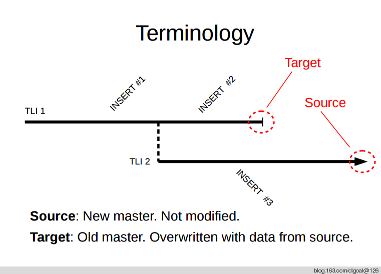
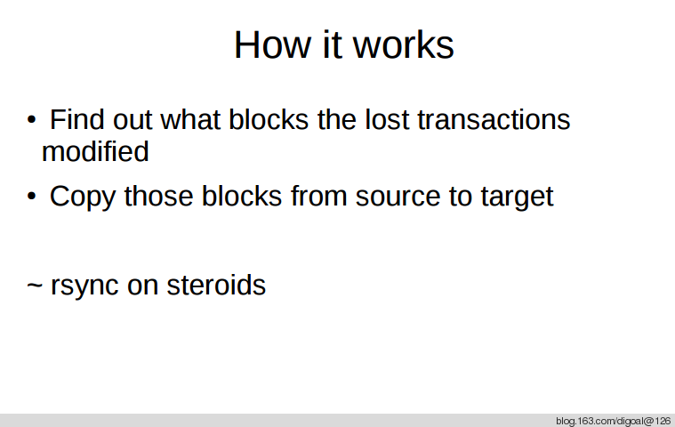
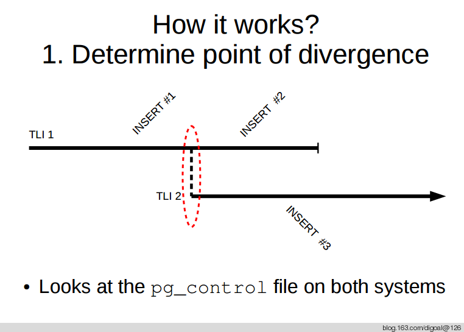
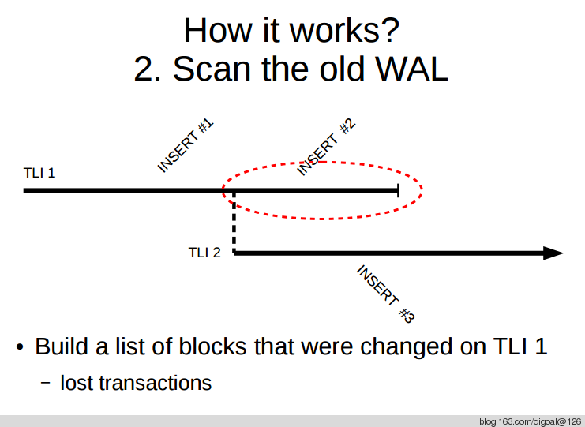
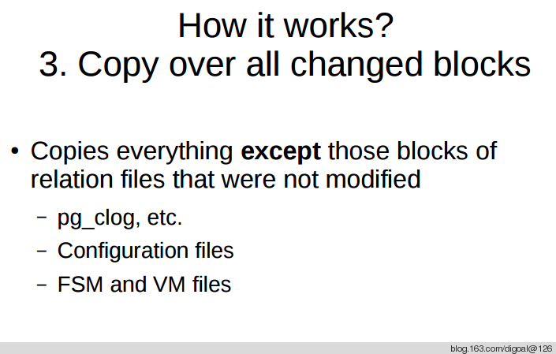
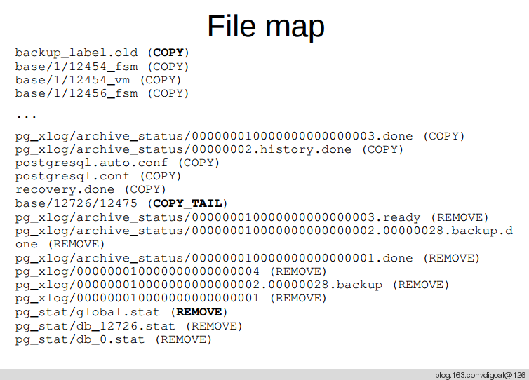
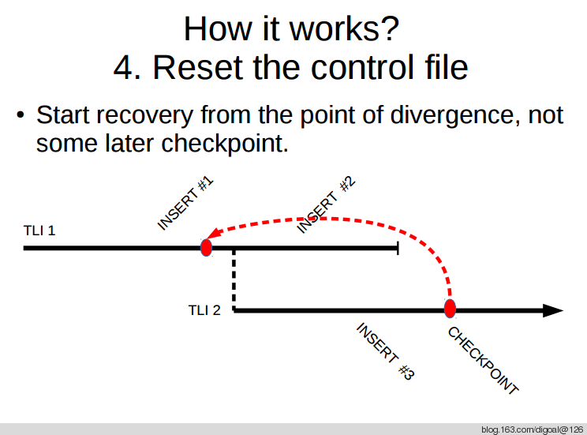
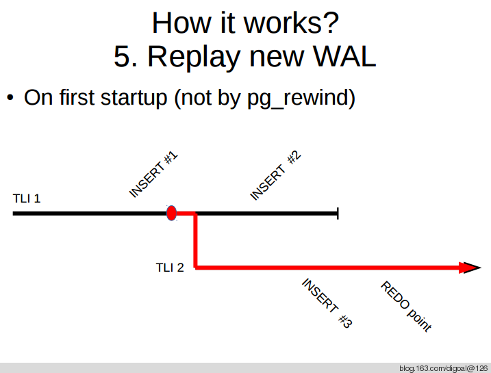
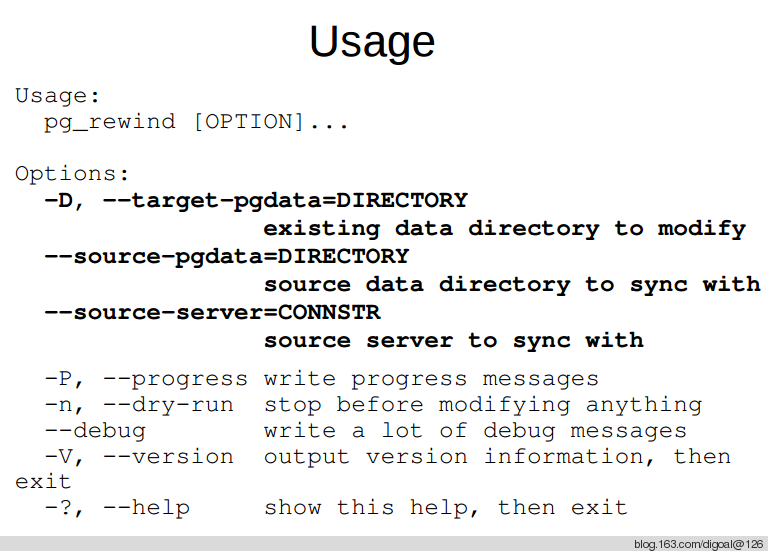
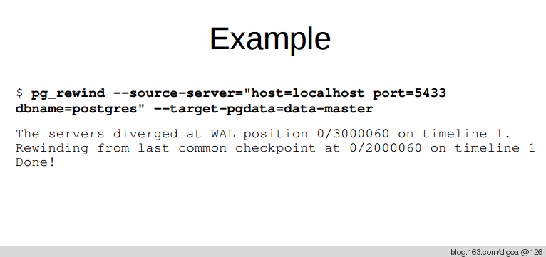

## PostgreSQL 9.5 add pg_rewind for Fast align for PostgreSQL unaligned primary & standby   
                                  
### 作者                                  
digoal                                  
                                  
### 日期                                  
2015-03-25                                 
                                  
### 标签                                  
PostgreSQL , 时间线分歧 , pg_rewind , 修复分歧 , 脑裂修复     
                                  
----                                  
                                  
## 背景     
详细的测试文章见 :   
  
[<PostgreSQL 9.5 new feature - pg_rewind fast sync Split Brain Primary & Standby>](20150325_02.md)  
  
http://hlinnaka.iki.fi/2015/03/23/pg_rewind-in-postgresql-9-5/  
  
pg_rewind已加入9.5了, 以后主备出现差异无法对其时, 可以使用这个快速的对其,   
  
http://git.postgresql.org/gitweb/?p=postgresql.git;a=commit;h=61081e75c6741024f7717ade0450090590e96c85  
  
原理 :   
  
[<PostgreSQL 9.5 new feature - pg_rewind fast sync Split Brain Primary & Standby>](20150325_01_pdf_001.pdf)  
  
  
  
  
  
  
  
  
  
  
  
  
  
  
  
  
  
  
  
  
  
  
那么我写的这个重新同步的过程就可以使用pg_rewind来高效的实现了.  
  
https://github.com/digoal/PostgreSQL_HA_with_primary_standby_2vip  
  
  
  
  
  
  
  
  
  
  
  
  
  
  
  
  
  
  
  
  
  
  
  
  
  
  
  
  
  
  
  
  
  
  
  
  
  
  
  
  
  
  
  
  
  
  
  
  
  
  
  
  
  
  
  
  
  
  
  
  
  
  
  
  
  
  
  
  
  
  
  
  
  
  
#### [PostgreSQL 许愿链接](https://github.com/digoal/blog/issues/76 "269ac3d1c492e938c0191101c7238216")
您的愿望将传达给PG kernel hacker、数据库厂商等, 帮助提高数据库产品质量和功能, 说不定下一个PG版本就有您提出的功能点. 针对非常好的提议，奖励限量版PG文化衫、纪念品、贴纸、PG热门书籍等，奖品丰富，快来许愿。[开不开森](https://github.com/digoal/blog/issues/76 "269ac3d1c492e938c0191101c7238216").  
  
  
#### [9.9元购买3个月阿里云RDS PostgreSQL实例](https://www.aliyun.com/database/postgresqlactivity "57258f76c37864c6e6d23383d05714ea")
  
  
#### [PostgreSQL 解决方案集合](https://yq.aliyun.com/topic/118 "40cff096e9ed7122c512b35d8561d9c8")
  
  
#### [德哥 / digoal's github - 公益是一辈子的事.](https://github.com/digoal/blog/blob/master/README.md "22709685feb7cab07d30f30387f0a9ae")
  
  

  
  
#### [PolarDB 学习图谱: 训练营、培训认证、在线互动实验、解决方案、生态合作、写心得拿奖品](https://www.aliyun.com/database/openpolardb/activity "8642f60e04ed0c814bf9cb9677976bd4")
  
  
#### [购买PolarDB云服务折扣活动进行中, 55元起](https://www.aliyun.com/activity/new/polardb-yunparter?userCode=bsb3t4al "e0495c413bedacabb75ff1e880be465a")
  
  
#### [About 德哥](https://github.com/digoal/blog/blob/master/me/readme.md "a37735981e7704886ffd590565582dd0")
  
