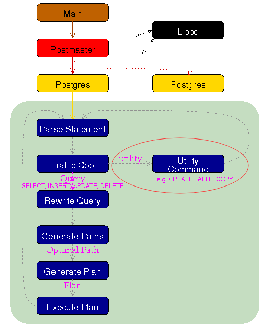

## PostgreSQL Oracle 兼容性之 - 事件触发器实现类似Oracle的回收站功能
##### [TAG 21](../class/21.md)
                                                                    
### 作者                                                                   
digoal                                                                    
                                                                    
### 日期                                                                  
2015-04-29                                                                     
                                                                    
### 标签                                                                  
PostgreSQL , 事件触发器 , event trigger , oracle recycle bin , 回收站                                                                                                                                         
                                                                    
----                                                                  
                                                                    
## 背景                    
早上一位网友问我，能否让用户在删除表时，不执行删除操作，而是重命名表。  
  
这不就是Oracle的recycle bin的特性吗？即删表时将表放到回收站，以后还可以恢复。  
  
从9.3开始，PostgreSQL提供了event trigger的功能。目前支持几个TAG：  
  
ddl_command_start  
sql_drop  
table_rewrite  
ddl_command_end  
  
如果要获取被删除的对象名，目前只有sql_drop的TAG支持，也就是在sql_drop的事件触发器函数中可以调用以下函数类获取对象信息。  
  
pg_event_trigger_dropped_objects returns a list of all objects dropped by the command in whose sql_drop event it is called.   
  
If called in any other context, pg_event_trigger_dropped_objects raises an error.   
  
pg_event_trigger_dropped_objects returns the following columns:  
  
Name	|Type	|Description  
---|---|---  
classid|	Oid|	OID of catalog the object belonged in  
objid|	Oid|	OID the object had within the catalog  
objsubid|	int32|	Object sub-id (e.g. attribute number for columns)  
original|	bool|	Flag used to identify the root object(s) of the deletion  
normal|	bool|	Flag indicating that there's a normal dependency relationship in the dependency graph leading to this object  
is_temporary|	bool|	Flag indicating that the object was a temporary object.  
object_type|	text|	Type of the object  
schema_name|	text|	Name of the schema the object belonged in, if any; otherwise NULL. No quoting is applied.  
object_name|	text|	Name of the object, if the combination of schema and name can be used as a unique identifier for the object; otherwise NULL. No quoting is applied, and name is never schema-qualified.  
object_identity|	text|	Text rendering of the object identity, schema-qualified. Each and every identifier present in the identity is quoted if necessary.  
address_names|	text[]|	An array that, together with object_type and address_args, can be used by the pg_get_object_address() to recreate the object address in a remote server containing an identically named object of the same kind.  
address_args|	text[]|	Complement for address_names above.  
  
那么我们是否能用它来实现类似oracle recycle bin的功能呢？  
  
即 用户在删除表时，不执行删除操作，而是重命名表。  
  
当然是可以的，本文将为大家揭示event trigger的recycle bin功能实现。   
  
## 挑战
我们在事务中可以模拟这样的情形。  
  
例子：  
  
```
postgres=# begin;  
BEGIN  
postgres=# drop table test12;  
DROP TABLE  
postgres=# alter table test12 rename to t;  
ERROR:  relation "test12" does not exist  
postgres=# rollback;  
ROLLBACK  
```
    
如果是这样的话，使用事件触发器可能会遇到同样的问题，没法rename操作了。    
   
但是幸运的是，我们可以使用dblink的异步QUERY来处理，所以可以避免以上的问题。  
  
```
postgres=# create extension dblink;    
```
  
异步接口参考  
  
https://www.postgresql.org/docs/9.6/static/contrib-dblink-send-query.html   
  
既然这样，那就开工吧。   
  
## 用事件触发器来实现recycle bin
我们创建一个schema来存放重命名的对象。  
  
用一个表来记录重命名的前后关系。  
  
```
postgres=# create schema recyclebin;  
postgres=# create table recyclebin.trace(id serial8 primary key,type_name text,nsp_name text,obj_name text,tg_tag text,new_nsp_name text,new_obj_name text,crt_time timestamp);  
CREATE TABLE  
```
  
创建一个事件触发器函数进行测试：  
   
在遇到sql_drops事件时被触发，执行rename的动作，而不是真实的DROP TABLE。从而实现recycle bin的功能。   
  
```
CREATE OR REPLACE FUNCTION test_event_trigger_for_drops()  
        RETURNS event_trigger LANGUAGE plpgsql AS $$  
DECLARE  
    obj record;  
    v_type_name text[] := '{}'::text[];  
    v_nsp_name text[] := '{}'::text[];  
    v_obj_name text[] := '{}'::text[];  
    v_tg_tag text := TG_TAG;  
    v_crt_time timestamp := now();  
    i int := 1;  
    v_new_nsp_name text := 'recyclebin';  
    v_new_obj_name text;  
    have_table boolean := false;  
    x text;  
    tt text;  
    v_sql1 text;  
    v_sql2 text;  
    v_sql text;  
    v_insert text;  
    v_cname text;  
BEGIN  
    FOR obj IN SELECT * FROM pg_event_trigger_dropped_objects()  
  
    LOOP  
	RAISE NOTICE '% dropped object: % %.% %',  
                     v_tg_tag,  
                     obj.object_type,  
                     obj.schema_name,  
                     obj.object_name,  
                     obj.object_identity;  
	v_type_name := array_append(v_type_name, obj.object_type);  
	v_nsp_name := array_append(v_nsp_name, obj.schema_name);  
	v_obj_name := array_append(v_obj_name, obj.object_name);  
  
--  调试, 在这里已经查不到被删除对象的信息了.  
      select t.*::text into tt from pg_class t where relname=obj.object_name and relnamespace=(select oid from pg_namespace where nspname=obj.schema_name);  
      raise notice '%', tt;  
        if (obj.object_type = 'table') then  
	  RAISE NOTICE 'Found table in drop list. %', v_obj_name;  
	  have_table := true;  
	end if;  
    END LOOP;  
  
    if ( have_table = true ) then  
      RAISE NOTICE 'Move table to recycle bin';  
      RAISE exception 'Found table in drop list.';  
    end if;  
    EXCEPTION WHEN others then  
      raise notice 'exception handler';  
  
--  调试, 在这里已经查不到被删除对象的信息了.  
      select t.*::text into tt from pg_class t where relname=obj.object_name and relnamespace=(select oid from pg_namespace where nspname=obj.schema_name);  
      raise notice '%', tt;  
  
      FOREACH x in ARRAY v_obj_name LOOP  
        raise notice 'loop';  
	if v_type_name[i] = 'table' then  
	  v_new_obj_name := 'md5'||md5(random()::text||clock_timestamp()::text);  
	    
	  -- 如果这里调用DBLINK则可以做到，因为当前会话未提交，其他会话还是能看到被删除的表的。  
	  -- 每个连接只能有一条异步QUERY  
	    
	  v_sql1 := 'alter table '||v_nsp_name[i]||'.'||x||' set schema '||v_new_nsp_name;  
	  v_sql2 := 'alter table '||v_new_nsp_name||'.'||x||' rename to '||v_new_obj_name;  
	  v_sql := v_sql1||';'||v_sql2||';' ;  
	  v_insert := format('insert into recyclebin.trace(type_name,nsp_name,obj_name,tg_tag,new_nsp_name,new_obj_name,crt_time)   
	                        values (%L, %L, %L, %L, %L, %L, %L)',  
				v_type_name[i],v_nsp_name[i],v_obj_name[i],v_tg_tag,v_new_nsp_name,v_new_obj_name,v_crt_time);  
	  -- raise notice '%', v_insert;  
	  -- execute v_sql;  
	  v_cname := 'myconn'||i;  
	  if (dblink_get_connections() @> array[v_cname] is not true) then  
	    perform dblink_connect(v_cname, 'dbname='||current_database());  
	  else  
	    perform dblink_disconnect(v_cname);  
	    perform dblink_connect(v_cname, 'dbname='||current_database());  
	  end if;  
	  perform dblink_exec(v_cname, v_insert, true);  
	  perform dblink_send_query(v_cname, v_sql);  
          perform dblink_disconnect(v_cname);  
                      
          -- 需要注意DDL锁等待的问题，比如某个表正在被查询或者某个长事务持有共享锁，DDL会失败  
  
          -- 另外，如果一个事务中删除多个表时，如删除主表，导致一堆子表被删除，小心异步调用占用所有连接  
	  -- 建议还是使用HOOK解决这个问题，见本文末尾  
  
	end if;  
        i := i+1;  
      END LOOP;  
    raise exception 'Table remove to recyclebin.';  
END;  
$$;  
```
  
创建事件触发器：  
  
```
CREATE EVENT TRIGGER test_event_trigger_for_drops  
   ON sql_drop   
   EXECUTE PROCEDURE test_event_trigger_for_drops();  
```
  
删除表测试：  
  
```
postgres=# create table test(id int);  
CREATE TABLE  
postgres=# create table test1(like test including all) inherits(test);  
NOTICE:  merging column "id" with inherited definition  
CREATE TABLE  
postgres=# create table test2(like test including all) inherits(test);  
NOTICE:  merging column "id" with inherited definition  
CREATE TABLE  
postgres=# \dt  
         List of relations  
 Schema | Name  | Type  |  Owner     
--------+-------+-------+----------  
 public | test  | table | postgres  
 public | test1 | table | postgres  
 public | test2 | table | postgres  
(3 rows)  
```
  
由于被删除的表使用了继承，这一次删除了3张表  
  
```
postgres=# drop table test cascade;  
NOTICE:  drop cascades to 2 other objects  
DETAIL:  drop cascades to table test1  
drop cascades to table test2  
NOTICE:  DROP TABLE dropped object: table public.test public.test  
NOTICE:  <NULL>  
NOTICE:  Found table in drop list. {test}  
NOTICE:  DROP TABLE dropped object: type public.test public.test  
NOTICE:  <NULL>  
NOTICE:  DROP TABLE dropped object: type public._test public.test[]  
NOTICE:  <NULL>  
NOTICE:  DROP TABLE dropped object: table public.test1 public.test1  
NOTICE:  <NULL>  
NOTICE:  Found table in drop list. {test,test,_test,test1}  
NOTICE:  DROP TABLE dropped object: type public.test1 public.test1  
NOTICE:  <NULL>  
NOTICE:  DROP TABLE dropped object: type public._test1 public.test1[]  
NOTICE:  <NULL>  
NOTICE:  DROP TABLE dropped object: table public.test2 public.test2  
NOTICE:  <NULL>  
NOTICE:  Found table in drop list. {test,test,_test,test1,test1,_test1,test2}  
NOTICE:  DROP TABLE dropped object: type public.test2 public.test2  
NOTICE:  <NULL>  
NOTICE:  DROP TABLE dropped object: type public._test2 public.test2[]  
NOTICE:  <NULL>  
NOTICE:  Move table to recycle bin  
NOTICE:  exception handler  
NOTICE:  <NULL>  
NOTICE:  loop  
NOTICE:  insert into recyclebin.trace(type_name,nsp_name,obj_name,tg_tag,new_nsp_name,new_obj_name,crt_time)   
                        values ('table', 'public', 'test', 'DROP TABLE', 'recyclebin', 'md5be413eefcb0a06359a813ea235aec991', '2016-12-24 11:51:46.498338')  
NOTICE:  loop  
NOTICE:  loop  
NOTICE:  loop  
NOTICE:  insert into recyclebin.trace(type_name,nsp_name,obj_name,tg_tag,new_nsp_name,new_obj_name,crt_time)   
                        values ('table', 'public', 'test1', 'DROP TABLE', 'recyclebin', 'md5c703b51dfd054b08b092df4e4ad24074', '2016-12-24 11:51:46.498338')  
NOTICE:  loop  
NOTICE:  loop  
NOTICE:  loop  
NOTICE:  insert into recyclebin.trace(type_name,nsp_name,obj_name,tg_tag,new_nsp_name,new_obj_name,crt_time)   
                        values ('table', 'public', 'test2', 'DROP TABLE', 'recyclebin', 'md50b59927a9a61e0324d4434a246da79b6', '2016-12-24 11:51:46.498338')  
NOTICE:  loop  
NOTICE:  loop  
ERROR:  Table remove to recyclebin.  
CONTEXT:  PL/pgSQL function test_event_trigger_for_drops() line 89 at RAISE  
postgres=# select * from recyclebin.trace;  
 id | type_name |  nsp_name  | obj_name |   tg_tag   | new_nsp_name |            new_obj_name             |          crt_time            
----+-----------+------------+----------+------------+--------------+-------------------------------------+----------------------------  
  1 | table     | public     | test     | DROP TABLE | recyclebin   | md56015e0b40b55526be0bc35591f749438 | 2016-12-24 11:12:39.535339  
  2 | table     | public     | test     | DROP TABLE | recyclebin   | md5697b9f6a4ddca7c5d3a5e555bc13524e | 2016-12-24 11:17:56.478331  
  3 | table     | public     | test     | DROP TABLE | recyclebin   | md56e003aa8d4580d773dfb9ed218095350 | 2016-12-24 11:18:26.072341  
  4 | table     | public     | test     | DROP TABLE | recyclebin   | md5987a31420a41c0335096e13bf3104bee | 2016-12-24 11:24:28.805337  
  7 | table     | public     | test     | DROP TABLE | recyclebin   | md5ab75b9adad19028dc139c9594c1ad283 | 2016-12-24 11:30:57.128355  
  9 | table     | recyclebin | test     | DROP TABLE | recyclebin   | md556dc1d9f932e19958780ec9088015531 | 2016-12-24 11:42:34.987422  
 10 | table     | public     | test     | DROP TABLE | recyclebin   | md5dfe0ecb69b7f0c559b5512ac2cc3ac5f | 2016-12-24 11:43:00.849329  
```
  
以下三张为刚才删除的表，看看在recyclebin中在不在。  
  
```
 11 | table     | public     | test     | DROP TABLE | recyclebin   | md5be413eefcb0a06359a813ea235aec991 | 2016-12-24 11:51:46.498338  
 12 | table     | public     | test1    | DROP TABLE | recyclebin   | md5c703b51dfd054b08b092df4e4ad24074 | 2016-12-24 11:51:46.498338  
 13 | table     | public     | test2    | DROP TABLE | recyclebin   | md50b59927a9a61e0324d4434a246da79b6 | 2016-12-24 11:51:46.498338  
(10 rows)  
```
  
这些被删掉的表都还在的，小心脏扑通扑通跳  
  
```
postgres=# select * from recyclebin.  
recyclebin.md50b59927a9a61e0324d4434a246da79b6  recyclebin.md556dc1d9f932e19958780ec9088015531  recyclebin.md5c703b51dfd054b08b092df4e4ad24074  recyclebin.trace  
recyclebin.md52467fcfa8c69d7ef34ec24afd36c1624  recyclebin.md5be413eefcb0a06359a813ea235aec991  recyclebin.md5dfe0ecb69b7f0c559b5512ac2cc3ac5f  recyclebin.trace_id_seq  
```
  
和预想的一样。  
  
## 为了节省异步连接的数量，我们可以把以上函数修改成如下函数，只发送一个异步QUERY就可以了        
  
```
CREATE OR REPLACE FUNCTION test_event_trigger_for_drops()  
        RETURNS event_trigger LANGUAGE plpgsql AS $$  
DECLARE  
    obj record;  
    v_type_name text[] := '{}'::text[];  
    v_nsp_name text[] := '{}'::text[];  
    v_obj_name text[] := '{}'::text[];  
    v_tg_tag text := TG_TAG;  
    v_crt_time timestamp := now();  
    i int := 1;  
    v_new_nsp_name text := 'recyclebin';  
    v_new_obj_name text;  
    have_table boolean := false;  
    x text;  
    tt text := '';  
    v_sql text[];  
    v_sqlend text := '';  
    v_cname text;  
BEGIN  
    FOR obj IN SELECT * FROM pg_event_trigger_dropped_objects()  
    LOOP  
	RAISE NOTICE '% dropped object: % %.% %',  
                     v_tg_tag,  
                     obj.object_type,  
                     obj.schema_name,  
                     obj.object_name,  
                     obj.object_identity;  
	v_type_name := array_append(v_type_name, obj.object_type);  
	v_nsp_name := array_append(v_nsp_name, obj.schema_name);  
	v_obj_name := array_append(v_obj_name, obj.object_name);  
        if (obj.object_type = 'table') then  
	  have_table := true;  
	end if;  
    END LOOP;  
    if ( have_table = true ) then  
      RAISE NOTICE 'Move table to recycle bin';  
      RAISE exception 'Found table in drop list.';  
    end if;  
      
    EXCEPTION WHEN others then  
      raise notice 'begin: ';  
      raise notice '-----------------------------------------------------------';  
      FOREACH x in ARRAY v_obj_name LOOP  
	if v_type_name[i] = 'table' then  
	  v_new_obj_name := 'md5'||md5(random()::text||clock_timestamp()::text);  
          v_sql[1] := 'alter table '||v_nsp_name[i]||'.'||x||' set schema '||v_new_nsp_name||';';  
          v_sql[2] := 'alter table '||v_new_nsp_name||'.'||x||' rename to '||v_new_obj_name||';';            
	  v_sql[3] := 'insert into recyclebin.trace(type_name,nsp_name,obj_name,tg_tag,new_nsp_name,new_obj_name,crt_time)   
	    values ('||quote_nullable(v_type_name[i])||','||quote_nullable(v_nsp_name[i])||','||quote_nullable(v_obj_name[i])||','||quote_nullable(v_tg_tag)||','||quote_nullable(v_new_nsp_name)||','||quote_nullable(v_new_obj_name)||','||quote_nullable(v_crt_time)||');';  
	  v_sqlend := v_sqlend||v_sql[1]||v_sql[2]||v_sql[3];  
	end if;  
        i := i+1;  
      END LOOP;  
  
	  v_cname := 'myconn';  
	  if (dblink_get_connections() @> array[v_cname] is not true) then  
	    perform dblink_connect(v_cname, 'dbname='||current_database());  
	  else  
	    perform dblink_disconnect(v_cname);  
	    perform dblink_connect(v_cname, 'dbname='||current_database());  
	  end if;  
	  perform dblink_send_query(v_cname, v_sqlend);  
          perform dblink_disconnect(v_cname);  
  
      raise notice 'BEGIN; % COMMIT;', v_sqlend;  
      raise notice '-----------------------------------------------------------';  
      raise exception 'Good Luck.';  
END;  
$$;  
```
  
测试：  
  
```
postgres=# create table test(id int);  
CREATE TABLE  
postgres=# create table test1(id int) inherits(test);  
NOTICE:  merging column "id" with inherited definition  
CREATE TABLE  
postgres=# create table test2(id int) inherits(test);  
NOTICE:  merging column "id" with inherited definition  
CREATE TABLE  
postgres=# create table test3(id int) inherits(test);  
NOTICE:  merging column "id" with inherited definition  
CREATE TABLE  
```
  
删除  
  
```
postgres=# drop table test cascade;  
NOTICE:  drop cascades to 3 other objects  
DETAIL:  drop cascades to table test1  
drop cascades to table test2  
drop cascades to table test3  
NOTICE:  DROP TABLE dropped object: table public.test public.test  
NOTICE:  DROP TABLE dropped object: type public.test public.test  
NOTICE:  DROP TABLE dropped object: type public._test public.test[]  
NOTICE:  DROP TABLE dropped object: table public.test1 public.test1  
NOTICE:  DROP TABLE dropped object: type public.test1 public.test1  
NOTICE:  DROP TABLE dropped object: type public._test1 public.test1[]  
NOTICE:  DROP TABLE dropped object: table public.test2 public.test2  
NOTICE:  DROP TABLE dropped object: type public.test2 public.test2  
NOTICE:  DROP TABLE dropped object: type public._test2 public.test2[]  
NOTICE:  DROP TABLE dropped object: table public.test3 public.test3  
NOTICE:  DROP TABLE dropped object: type public.test3 public.test3  
NOTICE:  DROP TABLE dropped object: type public._test3 public.test3[]  
NOTICE:  Move table to recycle bin  
NOTICE:  begin:   
NOTICE:  -----------------------------------------------------------  
NOTICE:  BEGIN; alter table public.test set schema recyclebin;alter table recyclebin.test rename to md584b8a4bd192773d3bfe554016b4f4b46;insert into recyclebin.trace(type_name,nsp_name,obj_name,tg_tag,new_nsp_name,new_obj_name,crt_time)   
    values ('table','public','test','DROP TABLE','recyclebin','md584b8a4bd192773d3bfe554016b4f4b46','2016-12-24 11:58:23.497347');alter table public.test1 set schema recyclebin;alter table recyclebin.test1 rename to md59e63afc3c45a334f054e1a04711c1b9b;insert into recyclebin.trace(type_name,nsp_name,obj_name,tg_tag,new_nsp_name,new_obj_name,crt_time)   
    values ('table','public','test1','DROP TABLE','recyclebin','md59e63afc3c45a334f054e1a04711c1b9b','2016-12-24 11:58:23.497347');alter table public.test2 set schema recyclebin;alter table recyclebin.test2 rename to md599fc68c328a54d5a4ded5cb98b5468eb;insert into recyclebin.trace(type_name,nsp_name,obj_name,tg_tag,new_nsp_name,new_obj_name,crt_time)   
    values ('table','public','test2','DROP TABLE','recyclebin','md599fc68c328a54d5a4ded5cb98b5468eb','2016-12-24 11:58:23.497347');alter table public.test3 set schema recyclebin;alter table recyclebin.test3 rename to md5de3d73b4c8d0afe47cbcd61ba9a8f7e1;insert into recyclebin.trace(type_name,nsp_name,obj_name,tg_tag,new_nsp_name,new_obj_name,crt_time)   
    values ('table','public','test3','DROP TABLE','recyclebin','md5de3d73b4c8d0afe47cbcd61ba9a8f7e1','2016-12-24 11:58:23.497347'); COMMIT;  
NOTICE:  -----------------------------------------------------------  
ERROR:  Good Luck.  
CONTEXT:  PL/pgSQL function test_event_trigger_for_drops() line 66 at RAISE  
```
  
表已经被弄到recyclebin了，很神奇吧。     
  
```
postgres=# \dt  
No relations found.  
  
  
postgres=# select * from recyclebin.  
recyclebin.md50b59927a9a61e0324d4434a246da79b6  recyclebin.md584b8a4bd192773d3bfe554016b4f4b46  recyclebin.md5be413eefcb0a06359a813ea235aec991  recyclebin.md5dfe0ecb69b7f0c559b5512ac2cc3ac5f  
recyclebin.md52467fcfa8c69d7ef34ec24afd36c1624  recyclebin.md599fc68c328a54d5a4ded5cb98b5468eb  recyclebin.md5c703b51dfd054b08b092df4e4ad24074  recyclebin.trace  
recyclebin.md556dc1d9f932e19958780ec9088015531  recyclebin.md59e63afc3c45a334f054e1a04711c1b9b  recyclebin.md5de3d73b4c8d0afe47cbcd61ba9a8f7e1  recyclebin.trace_id_seq  
postgres=# select * from recyclebin.trace;  
 id | type_name |  nsp_name  | obj_name |   tg_tag   | new_nsp_name |            new_obj_name             |          crt_time            
----+-----------+------------+----------+------------+--------------+-------------------------------------+----------------------------  
  1 | table     | public     | test     | DROP TABLE | recyclebin   | md56015e0b40b55526be0bc35591f749438 | 2016-12-24 11:12:39.535339  
  2 | table     | public     | test     | DROP TABLE | recyclebin   | md5697b9f6a4ddca7c5d3a5e555bc13524e | 2016-12-24 11:17:56.478331  
  3 | table     | public     | test     | DROP TABLE | recyclebin   | md56e003aa8d4580d773dfb9ed218095350 | 2016-12-24 11:18:26.072341  
  4 | table     | public     | test     | DROP TABLE | recyclebin   | md5987a31420a41c0335096e13bf3104bee | 2016-12-24 11:24:28.805337  
  7 | table     | public     | test     | DROP TABLE | recyclebin   | md5ab75b9adad19028dc139c9594c1ad283 | 2016-12-24 11:30:57.128355  
  9 | table     | recyclebin | test     | DROP TABLE | recyclebin   | md556dc1d9f932e19958780ec9088015531 | 2016-12-24 11:42:34.987422  
 10 | table     | public     | test     | DROP TABLE | recyclebin   | md5dfe0ecb69b7f0c559b5512ac2cc3ac5f | 2016-12-24 11:43:00.849329  
 11 | table     | public     | test     | DROP TABLE | recyclebin   | md5be413eefcb0a06359a813ea235aec991 | 2016-12-24 11:51:46.498338  
 12 | table     | public     | test1    | DROP TABLE | recyclebin   | md5c703b51dfd054b08b092df4e4ad24074 | 2016-12-24 11:51:46.498338  
 13 | table     | public     | test2    | DROP TABLE | recyclebin   | md50b59927a9a61e0324d4434a246da79b6 | 2016-12-24 11:51:46.498338  
 14 | table     | public     | test     | DROP TABLE | recyclebin   | md584b8a4bd192773d3bfe554016b4f4b46 | 2016-12-24 11:58:23.497347  
 15 | table     | public     | test1    | DROP TABLE | recyclebin   | md59e63afc3c45a334f054e1a04711c1b9b | 2016-12-24 11:58:23.497347  
 16 | table     | public     | test2    | DROP TABLE | recyclebin   | md599fc68c328a54d5a4ded5cb98b5468eb | 2016-12-24 11:58:23.497347  
 17 | table     | public     | test3    | DROP TABLE | recyclebin   | md5de3d73b4c8d0afe47cbcd61ba9a8f7e1 | 2016-12-24 11:58:23.497347  
(14 rows)  
```
  
使用event trigger实现了类似recyclebin的功能，不过我这里只是个DEMO，还不是很友好，用户可以再细化一下。    
  
## 其他方法  
1\. hook, 用在执行utility命令时，目前已经有插件实现了这个功能，很好用的。  
  
图例  
  
    
  
钩子代码：  
  
src/backend/tcop/utility.c  
  
```  
  70 /* Hook for plugins to get control in ProcessUtility() */  
  71 ProcessUtility_hook_type ProcessUtility_hook = NULL;  
 273 /*  
 274  * ProcessUtility  
 275  *      general utility function invoker  
 276  *  
 277  *  parsetree: the parse tree for the utility statement  
 278  *  queryString: original source text of command  
 279  *  context: identifies source of statement (toplevel client command,  
 280  *      non-toplevel client command, subcommand of a larger utility command)  
 281  *  params: parameters to use during execution  
 282  *  dest: where to send results  
 283  *  completionTag: points to a buffer of size COMPLETION_TAG_BUFSIZE  
 284  *      in which to store a command completion status string.  
 285  *  
 286  * Notes: as of PG 8.4, caller MUST supply a queryString; it is not  
 287  * allowed anymore to pass NULL.  (If you really don't have source text,  
 288  * you can pass a constant string, perhaps "(query not available)".)  
 289  *  
 290  * completionTag is only set nonempty if we want to return a nondefault status.  
 291  *  
 292  * completionTag may be NULL if caller doesn't want a status string.  
 293  */  
 294 void  
 295 ProcessUtility(Node *parsetree,  
 296                const char *queryString,  
 297                ProcessUtilityContext context,  
 298                ParamListInfo params,  
 299                DestReceiver *dest,  
 300                char *completionTag)  
 301 {  
 302     Assert(queryString != NULL);    /* required as of 8.4 */  
 303   
 304     /*  
 305      * We provide a function hook variable that lets loadable plugins get  
 306      * control when ProcessUtility is called.  Such a plugin would normally  
 307      * call standard_ProcessUtility().  
 308      */  
 309     if (ProcessUtility_hook)  
 310         (*ProcessUtility_hook) (parsetree, queryString,  
 311                                 context, params,  
 312                                 dest, completionTag);  
 313     else  
 314         standard_ProcessUtility(parsetree, queryString,  
 315                                 context, params,  
 316                                 dest, completionTag);  
 317 }  
```  
  
利用这个钩子的例子：  
  
https://github.com/petere/pgtrashcan  
  
[PostgreSQL pgtrashcan use hook _PG_init catch feature like Oracle's recycle bin](20140403_01.md)    
  
钩子例子截取自pgtrashcan：  
  
```  
#if PG_VERSION_NUM >= 90300  
static void  
pgtrashcan_ProcessUtility(Node *parsetree,  
						  const char *queryString,  
						  ProcessUtilityContext context,  
						  ParamListInfo params,  
						  DestReceiver *dest,  
						  char *completionTag)  
#else  
static void  
pgtrashcan_ProcessUtility(Node *parsetree,  
						  const char *queryString,  
						  ParamListInfo params,  
						  bool isTopLevel,  
						  DestReceiver *dest,  
						  char *completionTag)  
#endif  
{  
	if (nodeTag(parsetree) == T_DropStmt)  
	{  
		DropStmt *stmt = (DropStmt *) parsetree;  
		if (stmt->removeType == OBJECT_TABLE)  
		{  
			RangeVar *r;  
			AlterObjectSchemaStmt *newstmt = makeNode(AlterObjectSchemaStmt);  
			newstmt->objectType = stmt->removeType;  
			newstmt->newschema = pstrdup(trashcan_nspname);   // 重设SCHEMA  
#if PG_VERSION_NUM >= 90200  
			newstmt->missing_ok = stmt->missing_ok;  
#endif  
			if (stmt->behavior != DROP_RESTRICT)  
			ereport(ERROR,  
					(errcode(ERRCODE_FEATURE_NOT_SUPPORTED),  
					 errmsg("trash can does not support DROP CASCADE")));  
			r = makeRangeVarFromAnyName(linitial(stmt->objects));  
			r->inhOpt = INH_YES;  
			r->alias = NULL;  
			newstmt->relation = r;  
			if (!r->schemaname || strcmp(r->schemaname, trashcan_nspname) != 0)  
			{  
				parsetree = (Node *) newstmt;  
				create_trashcan_schema();  
			}  
		}  
	}  
#if PG_VERSION_NUM >= 90300  
	(*prev_ProcessUtility) (parsetree, queryString,	context, params, dest, completionTag);   
        // 传送至PG ProcessUtility@src/backend/tcop/utility.c  
#else  
	(*prev_ProcessUtility) (parsetree, queryString,	params, isTopLevel, dest, completionTag);  
#endif  
}  
```  
  
## 参考  
1\. http://www.postgresql.org/docs/devel/static/functions-event-triggers.html  
  
2\. [《PostgreSQL 回收站功能 - 基于HOOK的recycle bin pgtrashcan》](../201404/20140403_01.md)     
  
      
              
              

  
<a rel="nofollow" href="http://info.flagcounter.com/h9V1"  ></a>  
  
  
  
  
  
  
## [digoal's 大量PostgreSQL文章入口](https://github.com/digoal/blog/blob/master/README.md "22709685feb7cab07d30f30387f0a9ae")
  
