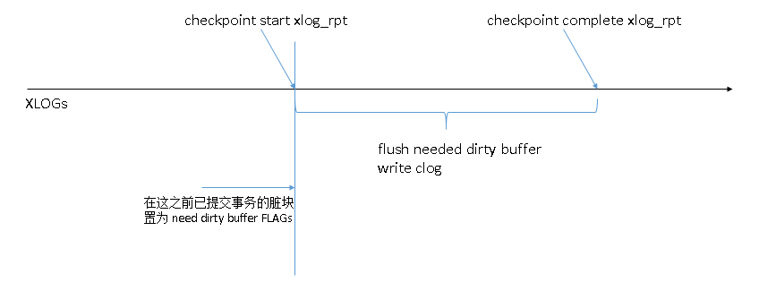

## PostgreSQL 检查点性能影响及源码分析 - 1  
                  
### 作者                 
digoal                  
                  
### 日期                
2015-05-06                    
                  
### 标签                
PostgreSQL , 检查点 , 性能影响 , full page write , FPW , 可靠性                                                
                  
----                
                  
## 背景  
数据库可靠性从何而来？    
    
数据库崩溃后如何恢复，从什么位置开始恢复？    
    
数据库检查点是什么？    
    
检查点要干些什么？    
    
为什么脏数据较多时，检查点会对性能有一定的影响？    
    
什么是full page write？    
    
相信这些问题是搞数据库的同学都想搞明白的。    
    
接下里的一系列文章，围绕检查点展开讲解，讲一讲检查点的原理，以及为什么脏数据较多是，它会对数据库产生一定的性能影响。      
    
## 正文  
检查点，通俗的理解就是数据库处于数据一致性，完整性的点。  
  
因此在这个点之前提交的事务确保数据已经写入数据文件，事务状态已经写入pg_clog文件。  
  
通常创建检查点会需要一个漫长的过程，那么怎么保证数据的一致性和完整性呢？  
  
从数据恢复（XLOG）的角度来看，检查点在XLOG文件中分为两个位置，一个是逻辑位置，一个是物理位置。  
  
逻辑位置即开始位置，也是一致性位置，在这个位置之前已提交的事务，确保它们的事务状态和脏数据都已经写入持久化存储。  
  
物理位置即结束位置，因为做检查点时，需要将逻辑位置之前已提交事务的事务状态和脏数据都写入持久化存储，这个需要一个过程，这些刷脏页面和CLOG的动作同样会产生XLOG，所以这一系列动作完成后，就是检查点结束的位置，即物理位置。  
  
从逻辑角度来看，这两个XLOG位置实际是同一个位置，所以在做数据恢复时，先找到检查点的XLOG物理位置，然后根据这里的结束检查点时写入的XLOG信息找到逻辑位置，从逻辑位置开始，读取XLOG并实施xlog replay恢复，至少要恢复到XLOG物理位置才能确保数据库的一致性和完整性。  
  
如图：  
  
创建检查点示意图：  
    
     
    
数据恢复示意图：    
    
     
  
当然，检查点不仅仅是刷脏数据这么简单，还有其他一些操作，见下面的分析。  
  
checkpointer process 介绍，挑选了一些关键步骤进行讲解：  
  
CheckpointerMain@src/backend/postmaster/checkpointer.c  
  
接收检查点请求：  
  
```
 365         /*  
 366          * Process any requests or signals received recently.  
 367          */  
 368         AbsorbFsyncRequests();  
......  
 388         if (checkpoint_requested)  
 389         {  
 390             checkpoint_requested = false;  
 391             do_checkpoint = true;  
 392             BgWriterStats.m_requested_checkpoints++;  
 393         }  
超时(checkpoint_timeout参数)触发检查点：  
 407         /*  
 408          * Force a checkpoint if too much time has elapsed since the last one.  
 409          * Note that we count a timed checkpoint in stats only when this  
 410          * occurs without an external request, but we set the CAUSE_TIME flag  
 411          * bit even if there is also an external request.  
 412          */  
 413         now = (pg_time_t) time(NULL);  
 414         elapsed_secs = now - last_checkpoint_time;  
 415         if (elapsed_secs >= CheckPointTimeout)  
 416         {  
 417             if (!do_checkpoint)  
 418                 BgWriterStats.m_timed_checkpoints++;  
 419             do_checkpoint = true;  
 420             flags |= CHECKPOINT_CAUSE_TIME;  
 421         }  
......  
进入检查点，记录检查点的逻辑位置（即开始位置的XLOG OFFSET），调用CreateCheckPoint创建检查点。  
 423         /*  
 424          * Do a checkpoint if requested.  
 425          */  
 426         if (do_checkpoint)  
 427         {  
 428             bool        ckpt_performed = false;  
 429             bool        do_restartpoint;  
 430   
 431             /* use volatile pointer to prevent code rearrangement */  
 432             volatile CheckpointerShmemStruct *cps = CheckpointerShmem;  
 433   
 434             /*  
 435              * Check if we should perform a checkpoint or a restartpoint. As a  
 436              * side-effect, RecoveryInProgress() initializes TimeLineID if  
 437              * it's not set yet.  
 438              */  
 439             do_restartpoint = RecoveryInProgress();  
 440   
 441             /*  
 442              * Atomically fetch the request flags to figure out what kind of a  
 443              * checkpoint we should perform, and increase the started-counter  
 444              * to acknowledge that we've started a new checkpoint.  
 445              */  
 446             SpinLockAcquire(&cps->ckpt_lck);  
 447             flags |= cps->ckpt_flags;  
 448             cps->ckpt_flags = 0;  
 449             cps->ckpt_started++;  
 450             SpinLockRelease(&cps->ckpt_lck);  
 451   
 452             /*  
 453              * The end-of-recovery checkpoint is a real checkpoint that's  
 454              * performed while we're still in recovery.  
 455              */  
 456             if (flags & CHECKPOINT_END_OF_RECOVERY)  
 457                 do_restartpoint = false;  
 458   
 459             /*  
 460              * We will warn if (a) too soon since last checkpoint (whatever  
 461              * caused it) and (b) somebody set the CHECKPOINT_CAUSE_XLOG flag  
 462              * since the last checkpoint start.  Note in particular that this  
 463              * implementation will not generate warnings caused by  
 464              * CheckPointTimeout < CheckPointWarning.  
 465              */  
 466             if (!do_restartpoint &&  
 467                 (flags & CHECKPOINT_CAUSE_XLOG) &&  
 468                 elapsed_secs < CheckPointWarning)  
 469                 ereport(LOG,  
 470                         (errmsg_plural("checkpoints are occurring too frequently (%d second apart)",  
 471                 "checkpoints are occurring too frequently (%d seconds apart)",  
 472                                        elapsed_secs,  
 473                                        elapsed_secs),  
 474                          errhint("Consider increasing the configuration parameter \"max_wal_size\".")));  
 475   
 476             /*  
 477              * Initialize checkpointer-private variables used during  
 478              * checkpoint  
 479              */  
 480             ckpt_active = true;  
 481             if (!do_restartpoint)  
 482                 ckpt_start_recptr = GetInsertRecPtr();     // 记录检查点开始前的XLOG位置,用于检查点调度判断  
                                                                                             //  不要和逻辑位置混淆，这还不是。  
 483             ckpt_start_time = now;  
 484             ckpt_cached_elapsed = 0;  
 485   
 486             /*  
 487              * Do the checkpoint.  
 488              */  
 489             if (!do_restartpoint)  
 490             {  
 491                 CreateCheckPoint(flags);    // 创建检查点  
 492                 ckpt_performed = true;  
 493             }  
 494             else  
 495                 ckpt_performed = CreateRestartPoint(flags);  
 496   
 497             /*  
 498              * After any checkpoint, close all smgr files.  This is so we  
 499              * won't hang onto smgr references to deleted files indefinitely.  
 500              */  
 501             smgrcloseall();  
 502   
 503             /*  
 504              * Indicate checkpoint completion to any waiting backends.  
 505              */  
 506             SpinLockAcquire(&cps->ckpt_lck);  
 507             cps->ckpt_done = cps->ckpt_started;  
 508             SpinLockRelease(&cps->ckpt_lck);  
 509   
 510             if (ckpt_performed)  
 511             {  
 512                 /*  
 513                  * Note we record the checkpoint start time not end time as  
 514                  * last_checkpoint_time.  This is so that time-driven  
 515                  * checkpoints happen at a predictable spacing.  
 516                  */  
 517                 last_checkpoint_time = now;  
 518             }  
 519             else  
 520             {  
 521                 /*  
 522                  * We were not able to perform the restartpoint (checkpoints  
 523                  * throw an ERROR in case of error).  Most likely because we  
 524                  * have not received any new checkpoint WAL records since the  
 525                  * last restartpoint. Try again in 15 s.  
 526                  */  
 527                 last_checkpoint_time = now - CheckPointTimeout + 15;  
 528             }  
 529   
 530             ckpt_active = false;  
 531         }  
```
  
记录检查点开始前的XLOG位置, 用于检查点调度,和逻辑位置无关。  
  
GetInsertRecPtr@src/backend/access/transam/xlog.c  
  
```
/*  
 * GetInsertRecPtr -- Returns the current insert position.  
 *  
 * NOTE: The value *actually* returned is the position of the last full  
 * xlog page. It lags behind the real insert position by at most 1 page.  
 * For that, we don't need to scan through WAL insertion locks, and an  
 * approximation is enough for the current usage of this function.  
 */  
XLogRecPtr  
GetInsertRecPtr(void)  
{  
        /* use volatile pointer to prevent code rearrangement */  
        volatile XLogCtlData *xlogctl = XLogCtl;  
        XLogRecPtr      recptr;  
  
        SpinLockAcquire(&xlogctl->info_lck);  
        recptr = xlogctl->LogwrtRqst.Write;    //   写入并返回XLOG位置  
        SpinLockRelease(&xlogctl->info_lck);  
  
        return recptr;  
}  
```
  
检查点调度  
  
IsCheckpointOnSchedule@src/backend/postmaster/checkpointer.c  
  
```
/*  
 * IsCheckpointOnSchedule -- are we on schedule to finish this checkpoint  
 *               in time?  
 *  
 * Compares the current progress against the time/segments elapsed since last  
 * checkpoint, and returns true if the progress we've made this far is greater  
 * than the elapsed time/segments.  
 */  
static bool  
IsCheckpointOnSchedule(double progress)  
{  
        XLogRecPtr      recptr;  
        struct timeval now;  
        double          elapsed_xlogs,  
                                elapsed_time;  
  
        Assert(ckpt_active);  
  
        /* Scale progress according to checkpoint_completion_target. */  
        progress *= CheckPointCompletionTarget;   // checkpoint_completion_target 参数控制系数，所以系数越大，progress越大。  
  
        /*  
         * Check against the cached value first. Only do the more expensive  
         * calculations once we reach the target previously calculated. Since  
         * neither time or WAL insert pointer moves backwards, a freshly  
         * calculated value can only be greater than or equal to the cached value.  
         */  
        if (progress < ckpt_cached_elapsed)  
                return false;  // 返回false，checkpointer不休息  
  
        /*  
         * Check progress against WAL segments written and checkpoint_segments.  
         *  
         * We compare the current WAL insert location against the location  
         * computed before calling CreateCheckPoint. The code in XLogInsert that  
         * actually triggers a checkpoint when checkpoint_segments is exceeded  
         * compares against RedoRecptr, so this is not completely accurate.  
ca  
         * However, it's good enough for our purposes, we're only calculating an  
         * estimate anyway.  
         */  
        if (!RecoveryInProgress())  
        {  
                recptr = GetInsertRecPtr();  
                elapsed_xlogs = (((double) (recptr - ckpt_start_recptr)) / XLogSegSize) / CheckPointSegments;  
                //  CheckPointSegments由参数checkpoint_segments控制.  
                //  checkpoint_completion_target 是0-1的范围  
                //  checkpoint_segments是触发检查点的XLOG个数，  
                //  假设checkpoint_completion_target = 0.1, progress传入参数=1, 那么  
                //  checkpoint_segments=100, 那么每产生 0.1×100=10个XLOG文件后, checkpointer要休息一下，以免对性能造成太大影响  
                //   checkpointer休息多久由CheckpointWriteDelay函数来控制。  
  
                if (progress < elapsed_xlogs)  // 未达到休息点  
                {  
                        ckpt_cached_elapsed = elapsed_xlogs;  
                        return false;  // 返回false，checkpointer不休息  
                }  
        }  
  
        /*  
         * Check progress against time elapsed and checkpoint_timeout.  
         */  
        gettimeofday(&now, NULL);  
        elapsed_time = ((double) ((pg_time_t) now.tv_sec - ckpt_start_time) +  
                                        now.tv_usec / 1000000.0) / CheckPointTimeout;  //  另一个判断依据是检查点耗时和checkpoint_timeout参数。  
  
        if (progress < elapsed_time)  
        {  
                ckpt_cached_elapsed = elapsed_time;  
                return false;  
        }  
  
        /* It looks like we're on schedule. */  
        return true;  
}  
```
  
检查点调度的另一个函数，处理延迟逻辑，每次100毫秒：  
  
```
/*  
 * CheckpointWriteDelay -- control rate of checkpoint  
 *  
 * This function is called after each page write performed by BufferSync().  
 * It is responsible for throttling BufferSync()'s write rate to hit  
 * checkpoint_completion_target.  
 *  
 * The checkpoint request flags should be passed in; currently the only one  
 * examined is CHECKPOINT_IMMEDIATE, which disables delays between writes.  
 *  
 * 'progress' is an estimate of how much of the work has been done, as a  
 * fraction between 0.0 meaning none, and 1.0 meaning all done.  
 */  
void  
CheckpointWriteDelay(int flags, double progress)  
{  
        static int      absorb_counter = WRITES_PER_ABSORB;  
  
        /* Do nothing if checkpoint is being executed by non-checkpointer process */  
        if (!AmCheckpointerProcess())  
                return;  
  
        /*  
         * Perform the usual duties and take a nap, unless we're behind schedule,  
         * in which case we just try to catch up as quickly as possible.  
         */  
        if (!(flags & CHECKPOINT_IMMEDIATE) &&  
                !shutdown_requested &&  
                !ImmediateCheckpointRequested() &&  
                IsCheckpointOnSchedule(progress))   //  IsCheckpointOnSchedule 即判断是否达到调度位置  
        {  
                if (got_SIGHUP)  
                {  
                        got_SIGHUP = false;  
                        ProcessConfigFile(PGC_SIGHUP);  
                        /* update shmem copies of config variables */  
                        UpdateSharedMemoryConfig();  
                }  
                AbsorbFsyncRequests();  
                absorb_counter = WRITES_PER_ABSORB;  
  
                CheckArchiveTimeout();  
  
                /*  
                 * Report interim activity statistics to the stats collector.  
                 */  
                pgstat_send_bgwriter();  
  
                /*  
                 * This sleep used to be connected to bgwriter_delay, typically 200ms.  
                 * That resulted in more frequent wakeups if not much work to do.  
                 * Checkpointer and bgwriter are no longer related so take the Big  
                 * Sleep.  
                 */  
                pg_usleep(100000L);  // 休息100000微秒即100毫秒，虽然checkpointer休息了，但是bgwriter同样会在一定的时间后被唤醒，由bgwriter_delay控制。  
        }  
        else if (--absorb_counter <= 0)  
        {  
                /*  
                 * Absorb pending fsync requests after each WRITES_PER_ABSORB write  
                 * operations even when we don't sleep, to prevent overflow of the  
                 * fsync request queue.  
                 */  
                AbsorbFsyncRequests();  
                absorb_counter = WRITES_PER_ABSORB;  
        }  
}  
```
  
检查点调度的小结：  
  
如果我们开启了检查点调度，默认是开启的，调度系数设置为0.5。  
  
这个调度值到底是什么用意呢？  
  
检查点的任务之一是刷脏块，例如有1000个脏块需要刷新，那么当刷到100个脏块时，progress=(100/1000)*0.5=0.05  
  
如果这个时候，XLOG经历了10个文件，checkpoint_segments为100，也就是0.1  
  
0.05<0.1, 返回false, 不休息。什么情况能休息？ 当xlog经历个数比值小于等于0.05时才能休息，也就是发生在XLOG 5个或以内时。  
  
如果调大调度系数到1，那么progress=(100/1000)*1=0.1，当xlog经历个数比值小于等于0.1时才能休息，也就是发生在XLOG 10个或以内时。  
  
现在可以理解为，调度系数就是休息区间系数，休息区间为checkpoint_segments和checkpoint_timeout。  
  
调度系数越大，checkpointer休息区间越大，checkpointer可以经常休息，慢悠悠的fsync；  
  
调度系数越小，checkpointer休息区间越小，checkpointer只能在最初的小范围内休息，超过后就要快马加鞭了。  
  
创建检查点的函数：  
  
CreateCheckPoint@src/backend/access/transam/xlog.c  
  
```
/*  
 * Perform a checkpoint --- either during shutdown, or on-the-fly  
 *  
 * flags is a bitwise OR of the following:  
 *      CHECKPOINT_IS_SHUTDOWN: checkpoint is for database shutdown.  
 *      CHECKPOINT_END_OF_RECOVERY: checkpoint is for end of WAL recovery.  
 *      CHECKPOINT_IMMEDIATE: finish the checkpoint ASAP,  
 *              ignoring checkpoint_completion_target parameter.  
 *      CHECKPOINT_FORCE: force a checkpoint even if no XLOG activity has occurred  
 *              since the last one (implied by CHECKPOINT_IS_SHUTDOWN or  
 *              CHECKPOINT_END_OF_RECOVERY).  
 *  
 * Note: flags contains other bits, of interest here only for logging purposes.  
 * In particular note that this routine is synchronous and does not pay  
 * attention to CHECKPOINT_WAIT.  
 *  
 * If !shutdown then we are writing an online checkpoint. This is a very special  
 * kind of operation and WAL record because the checkpoint action occurs over  
 * a period of time yet logically occurs at just a single LSN. The logical  逻辑位置是检查点开始时的位置。  
 * position of the WAL record (redo ptr) is the same or earlier than the  
 * physical position. When we replay WAL we locate the checkpoint via its  
 * physical position then read the redo ptr and actually start replay at the  
 * earlier logical position. Note that we don't write *anything* to WAL at  逻辑位置不写任何东西，在GetInsertRecPtr这里。  
 * the logical position, so that location could be any other kind of WAL record.  
 * All of this mechanism allows us to continue working while we checkpoint.    
 * As a result, timing of actions is critical here and be careful to note that  
 * this function will likely take minutes to execute on a busy system.  
 */  
void  
CreateCheckPoint(int flags)  
{  
        /* use volatile pointer to prevent code rearrangement */  
        volatile XLogCtlData *xlogctl = XLogCtl;  
        bool            shutdown;  
        CheckPoint      checkPoint;  
        XLogRecPtr      recptr;  
        XLogCtlInsert *Insert = &XLogCtl->Insert;  
        XLogRecData rdata;  
        uint32          freespace;  
        XLogSegNo       _logSegNo;  
        XLogRecPtr      curInsert;  
        VirtualTransactionId *vxids;  
        int                     nvxids;  
......  
获取检查点排他锁，确保同一时刻只有一个检查点在干活  
        /*  
         * Acquire CheckpointLock to ensure only one checkpoint happens at a time.  
         * (This is just pro forma, since in the present system structure there is  
         * only one process that is allowed to issue checkpoints at any given  
         * time.)  
         */  
        LWLockAcquire(CheckpointLock, LW_EXCLUSIVE);  
......  
判断是否为关机检查点，如果是，先写控制文件。  
        if (shutdown)  
        {  
                LWLockAcquire(ControlFileLock, LW_EXCLUSIVE);  
                ControlFile->state = DB_SHUTDOWNING;  
                ControlFile->time = (pg_time_t) time(NULL);  
                UpdateControlFile();  
                LWLockRelease(ControlFileLock);  
        }  
......  
获取XLOG插入排他锁，计算checkpoint的逻辑XLOG位置，即开始位置。  
        /*  
         * We must block concurrent insertions while examining insert state to  
         * determine the checkpoint REDO pointer.  
         */  
        WALInsertLockAcquireExclusive();  
        curInsert = XLogBytePosToRecPtr(Insert->CurrBytePos);  
.....  
计算checkpoint的逻辑XLOG位置，即开始位置，检查点执行fsync时依赖这个位置信息。  
fsync的内容需要确保在这个XLOG位置前的已提交事务，它们的脏数据必须写入数据文件，CLOG完整。  
        /*  
         * Compute new REDO record ptr = location of next XLOG record.  
         *  
         * NB: this is NOT necessarily where the checkpoint record itself will be,  
         * since other backends may insert more XLOG records while we're off doing  
         * the buffer flush work.  Those XLOG records are logically after the  
         * checkpoint, even though physically before it.  Got that?  
         */  
        freespace = INSERT_FREESPACE(curInsert);  
        if (freespace == 0)  
        {  
                if (curInsert % XLogSegSize == 0)  
                        curInsert += SizeOfXLogLongPHD;  
                else  
                        curInsert += SizeOfXLogShortPHD;  
        }  
        checkPoint.redo = curInsert;  
        /*  
         * Here we update the shared RedoRecPtr for future XLogInsert calls; this  
         * must be done while holding all the insertion locks.  
         *  
         * Note: if we fail to complete the checkpoint, RedoRecPtr will be left  
         * pointing past where it really needs to point.  This is okay; the only  
         * consequence is that XLogInsert might back up whole buffers that it  
         * didn't really need to.  We can't postpone advancing RedoRecPtr because  
         * XLogInserts that happen while we are dumping buffers must assume that  
         * their buffer changes are not included in the checkpoint.  
         */  
        RedoRecPtr = xlogctl->Insert.RedoRecPtr = checkPoint.redo;  
  
        /*  
         * Now we can release the WAL insertion locks, allowing other xacts to  
         * proceed while we are flushing disk buffers.  
         */  
释放XLOG插入排他锁。  
        WALInsertLockRelease();  
获得检查点的其他数据，例如XID,OID,MXID等，后面需要刷到控制文件中。  
        /*  
         * Get the other info we need for the checkpoint record.  
         */  
        LWLockAcquire(XidGenLock, LW_SHARED);  
        checkPoint.nextXid = ShmemVariableCache->nextXid;  
        checkPoint.oldestXid = ShmemVariableCache->oldestXid;  
        checkPoint.oldestXidDB = ShmemVariableCache->oldestXidDB;  
        LWLockRelease(XidGenLock);  
  
        /* Increase XID epoch if we've wrapped around since last checkpoint */  
        checkPoint.nextXidEpoch = ControlFile->checkPointCopy.nextXidEpoch;  
        if (checkPoint.nextXid < ControlFile->checkPointCopy.nextXid)  
                checkPoint.nextXidEpoch++;  
  
        LWLockAcquire(OidGenLock, LW_SHARED);  
        checkPoint.nextOid = ShmemVariableCache->nextOid;  
        if (!shutdown)  
                checkPoint.nextOid += ShmemVariableCache->oidCount;  
        LWLockRelease(OidGenLock);  
  
        MultiXactGetCheckptMulti(shutdown,  
                                                         &checkPoint.nextMulti,  
                                                         &checkPoint.nextMultiOffset,  
                                                         &checkPoint.oldestMulti,  
                                                         &checkPoint.oldestMultiDB);  
在checkpoint开始Fsync数据据前，务必等待已提交事务的clog 以及clog的XLOG都已经写完整。  
        /*  
         * In some cases there are groups of actions that must all occur on one  
         * side or the other of a checkpoint record. Before flushing the  
         * checkpoint record we must explicitly wait for any backend currently  
         * performing those groups of actions.  
         *  
         * One example is end of transaction, so we must wait for any transactions  
         * that are currently in commit critical sections.  If an xact inserted  
         * its commit record into XLOG just before the REDO point, then a crash  
         * restart from the REDO point would not replay that record, which means  
         * that our flushing had better include the xact's update of pg_clog.  So  
         * we wait till he's out of his commit critical section before proceeding.  
         * See notes in RecordTransactionCommit().  
         *  
         * Because we've already released the insertion locks, this test is a bit  
         * fuzzy: it is possible that we will wait for xacts we didn't really need  
         * to wait for.  But the delay should be short and it seems better to make  
         * checkpoint take a bit longer than to hold off insertions longer than  
         * necessary. (In fact, the whole reason we have this issue is that xact.c    //  根源在这里，因为提交写clog的XLOG和写CLOG分两部分完成，分别由2个锁来保护，但实际上这两部分信息应该在检查点的同一边，要么检查点前，要么检查点后。  
//  所以这里才需要等待，就是等它们到同一面，即那些在检查点前写XLOG的但是没有更新CLOG的，必须等它们的CLOG完成。  
// 为什么呢？因为RECOVERY时检查点之前的XLOG是不会去replay的，如果clog的xlog在这之前，但是CLOG未写成功，那么在恢复时又不会去replay这些xlog，将导致这些CLOG缺失。  
         * does commit record XLOG insertion and clog update as two separate steps  
         * protected by different locks, but again that seems best on grounds of  
         * minimizing lock contention.)  
         *  
         * A transaction that has not yet set delayChkpt when we look cannot be at  
         * risk, since he's not inserted his commit record yet; and one that's  
         * already cleared it is not at risk either, since he's done fixing clog  
         * and we will correctly flush the update below.  So we cannot miss any  
         * xacts we need to wait for.  
         */  
        vxids = GetVirtualXIDsDelayingChkpt(&nvxids);  
        if (nvxids > 0)  
        {  
                do  
                {  
                        pg_usleep(10000L);      /* wait for 10 msec */  
                } while (HaveVirtualXIDsDelayingChkpt(vxids, nvxids));  
        }  
        pfree(vxids);  
执行检查点最重要也是最拖累性能的任务，fsync：  
        CheckPointGuts(checkPoint.redo, flags);  
CheckPointGuts函数内容后面叙述。  
  
Fsync完成后，写入一段XLOG，表示检查点完成  
        /*  
         * Now insert the checkpoint record into XLOG.  
         */  
        rdata.data = (char *) (&checkPoint);  
        rdata.len = sizeof(checkPoint);  
        rdata.buffer = InvalidBuffer;  
        rdata.next = NULL;  
  
        recptr = XLogInsert(RM_XLOG_ID,  
                                                shutdown ? XLOG_CHECKPOINT_SHUTDOWN :  
                                                XLOG_CHECKPOINT_ONLINE,  
                                                &rdata);  
  
        XLogFlush(recptr);  
更新控制文件，控制文件中写入检查点的XLOG逻辑位置，物理位置等信息。  
        /*  
         * Select point at which we can truncate the log, which we base on the  
         * prior checkpoint's earliest info.  
         */  
        XLByteToSeg(ControlFile->checkPointCopy.redo, _logSegNo);  
  
        /*  
         * Update the control file.  
         */  
        LWLockAcquire(ControlFileLock, LW_EXCLUSIVE);  
        if (shutdown)  
                ControlFile->state = DB_SHUTDOWNED;  
        ControlFile->prevCheckPoint = ControlFile->checkPoint;  
        ControlFile->checkPoint = ProcLastRecPtr;    //  包含检查点的 xlog 结束位置,  ProcLastRecPtr是XLogInsert中更新的一个全局变量,表示XLOG位置。  
        ControlFile->checkPointCopy = checkPoint;    // 包含检查点的 xlog 逻辑位置，在前面记录了，请看前面的代码  
        ControlFile->time = (pg_time_t) time(NULL);  
        /* crash recovery should always recover to the end of WAL */  
        ControlFile->minRecoveryPoint = InvalidXLogRecPtr;  
        ControlFile->minRecoveryPointTLI = 0;  
  
        /*  
         * Persist unloggedLSN value. It's reset on crash recovery, so this goes  
         * unused on non-shutdown checkpoints, but seems useful to store it always  
         * for debugging purposes.  
         */  
        SpinLockAcquire(&XLogCtl->ulsn_lck);  
        ControlFile->unloggedLSN = XLogCtl->unloggedLSN;  
        SpinLockRelease(&XLogCtl->ulsn_lck);  
  
        UpdateControlFile();  
        LWLockRelease(ControlFileLock);  
释放检查点排他锁  
        LWLockRelease(CheckpointLock);  
  
Fsync涉及的函数CheckPointGuts如下：  
/*  
 * Flush all data in shared memory to disk, and fsync  
 *  
 * This is the common code shared between regular checkpoints and  
 * recovery restartpoints.  
 */  
static void  
CheckPointGuts(XLogRecPtr checkPointRedo, int flags)  
{  
        CheckPointCLOG();   // src/backend/access/transam/clog.c  
        CheckPointSUBTRANS();  // src/backend/access/transam/subtrans.c  
        CheckPointMultiXact();  // src/backend/access/transam/multixact.c  
        CheckPointPredicate();  // src/backend/storage/lmgr/predicate.c  
        CheckPointRelationMap();  // src/backend/utils/cache/relmapper.c  
        CheckPointReplicationSlots();  //  src/backend/replication/slot.c  
        CheckPointSnapBuild();  // src/backend/replication/logical/snapbuild.c  
        CheckPointLogicalRewriteHeap();  // src/backend/access/heap/rewriteheap.c  
        CheckPointBuffers(flags);       /* performs all required fsyncs */  // src/backend/storage/buffer/bufmgr.c  
        /* We deliberately delay 2PC checkpointing as long as possible */    
        CheckPointTwoPhase(checkPointRedo);  //  src/backend/access/transam/twophase.c  
}  
```
  
最后，回答一个问题，为什么检查点会带来巨大的性能损耗呢？  
  
需要分析CheckPointGuts函数内调用的这些函数来回答这个问题，整个检查点的过程只有这里是重量级任务，而且涉及到大量的排他锁。  
  
例如BufferSync里面需要将所有检查点逻辑位置前所有已提交事务的buffer脏数据刷入数据文件(这个说法并不严谨，也可能包含检查点开始后某一个时间差内产生的脏数据，见BufferSync@src/backend/storage/buffer/bufmgr.c)。  
内容太多，放到下一篇文章进行讲解。  
   
如果你要跟踪这里面的开销，在linux下面可以使用systemtap跟踪这些函数，或者探针。  
  
方法参考：  
  
http://blog.163.com/digoal@126/blog/static/1638770402015380712956/  
  
http://blog.163.com/digoal@126/blog/#m=0&t=1&c=fks_084068084086080075085082085095085080082075083081086071084  
  
## 其他 
根据XLOG切换个数触发检查点，  
  
判断经过N个XLOG后是否要做检查点。  
  
```
/*  
 * Check whether we've consumed enough xlog space that a checkpoint is needed.  
 *  
 * new_segno indicates a log file that has just been filled up (or read  
 * during recovery). We measure the distance from RedoRecPtr to new_segno  
 * and see if that exceeds CheckPointSegments.  
 *  
 * Note: it is caller's responsibility that RedoRecPtr is up-to-date.  
 */  
static bool  
XLogCheckpointNeeded(XLogSegNo new_segno)  
{  
        XLogSegNo       old_segno;  
  
        XLByteToSeg(RedoRecPtr, old_segno);  
  
        if (new_segno >= old_segno + (uint64) (CheckPointSegments - 1))    
           // CheckPointSegments取决于参数checkpoint_segments  
                return true;  
        return false;  
}  
```
  
在写XLOG(XLogWrite@src/backend/access/transam/xlog.c)和读XLOG(XLogPageRead@src/backend/access/transam/xlog.c)时会触发这个检查。  
  
```
/*  
 * Write and/or fsync the log at least as far as WriteRqst indicates.  
 *  
 * If flexible == TRUE, we don't have to write as far as WriteRqst, but  
 * may stop at any convenient boundary (such as a cache or logfile boundary).  
 * This option allows us to avoid uselessly issuing multiple writes when a  
 * single one would do.  
 *  
 * Must be called with WALWriteLock held. WaitXLogInsertionsToFinish(WriteRqst)  
 * must be called before grabbing the lock, to make sure the data is ready to  
 * write.  
 */  
static void  
XLogWrite(XLogwrtRqst WriteRqst, bool flexible)  
{  
......  
                                /*  
                                 * Request a checkpoint if we've consumed too much xlog since  
                                 * the last one.  For speed, we first check using the local  
                                 * copy of RedoRecPtr, which might be out of date; if it looks  
                                 * like a checkpoint is needed, forcibly update RedoRecPtr and  
                                 * recheck.  
                                 */  
                                if (IsUnderPostmaster && XLogCheckpointNeeded(openLogSegNo))  
                                {  
                                        (void) GetRedoRecPtr();  
                                        if (XLogCheckpointNeeded(openLogSegNo))  
                                                RequestCheckpoint(CHECKPOINT_CAUSE_XLOG);  
                                }  
......  
```
  
## 参考 
1\. src/backend/postmaster/checkpointer.c  
  
2\. src/backend/access/transam/xlog.c  
  
3\. src/backend/storage/buffer/bufmgr.c  
  
4\. src/backend/storage/buffer  
  
5\. src/include/storage/buf_internals.h  
  
6\. src/backend/storage/smgr/smgr.c  
  
7\. http://blog.163.com/digoal@126/blog/static/1638770402015380712956/  
  
8\. http://blog.163.com/digoal@126/blog/#m=0&t=1&c=fks_084068084086080075085082085095085080082075083081086071084  
    
          
  
<a rel="nofollow" href="http://info.flagcounter.com/h9V1"  ></a>  
  
  
  
  
  
  
## [digoal's 大量PostgreSQL文章入口](https://github.com/digoal/blog/blob/master/README.md "22709685feb7cab07d30f30387f0a9ae")
  
