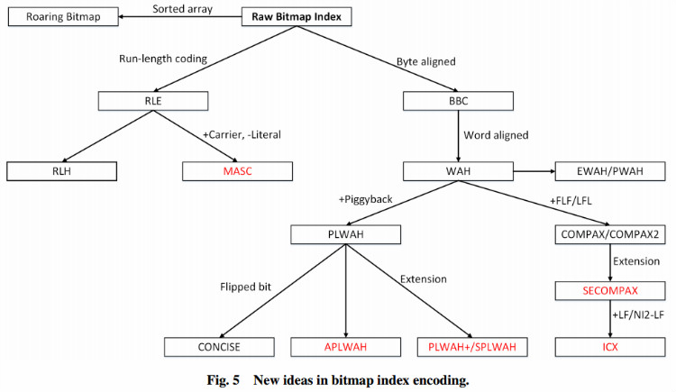

## Roaring Bitmap - A better compressed bitset  
           
### 作者          
digoal          
          
### 日期                          
2015-05-07                         
                          
### 标签                          
PostgreSQL , roaring bitmap , bitmap index      
          
----          
          
## 背景        
### A better compressed bitset  
  
Bitsets, also called bitmaps, are commonly used as fast data structures. Unfortunately, they can use too much memory. To compensate, we often use compressed bitmaps.  
  
Roaring bitmaps are compressed bitmaps which tend to outperform conventional compressed bitmaps such as WAH, EWAH or Concise. In some instances, they can be hundreds of times faster and they often offer significantly better compression.  
  
Roaring bitmaps are used in Apache Lucene (as of version 5.0 using anindependent implementation), Druid.io (as of version 0.7) and Apache Spark (as of version 1.2).  
  
Roaring bitmap是一种高效的bitmap压缩算法，应用广泛。  
  
Bitmap indexes are commonly used in databases and search engines.   
  
By exploiting bit-level parallelism, they can significantly accelerate queries.   
  
However, they can use much memory, and thus we might prefer compressed bitmap indexes.   
  
Following Oracle's lead, bitmaps are often compressed using run-length encoding (RLE).   
  
Building on prior work, we introduce the Roaring compressed bitmap format:   
it uses packed arrays for compression instead of RLE.   
  
We compare it to two high-performance RLE-based bitmap encoding techniques:   
WAH (Word Aligned Hybrid compression scheme) and Concise (Compressed `n' Composable Integer Set).   
  
On synthetic and real data, we find that Roaring bitmaps  
  
 (1) often compress significantly better (e.g., 2 times)   
  
 (2) are faster than the compressed alternatives (up to 900 times faster for intersections).   
  
Our results challenge the view that RLE-based bitmap compression is best.  
  
roaring bitmap相比Oracle使用的bitmap压缩技术有两点好处。  
  
压缩比高，速度快。  
  
下面摘录一篇论文中的两幅图，说明了历年来出的一些BITMAP压缩算法以及他们之间的关系。  
  
http://ieeexplore.ieee.org/stamp/stamp.jsp?arnumber=7040519  
  
http://www.academia.edu/7140159/Bitmap_index_in_search_of_Internet_traffic_big_data  
  
  
  
  
  
## PostgreSQL用到的一种bitmap

压缩方法是基于hybrid run-length compression algorithm的，  
  
参考：  
  
https://wiki.postgresql.org/wiki/Bitmap_Indexes  
  
算法：  
  
将bitmap拆成两个部分，第一个部分是header,第二个部分是content,  
  
第一个部分每一个比特位对应第二个部分的一个word.  
  
第一个部分比特0表示对应的第二个部分的word是未压缩的。  
  
第一个部分比特1表示对应的第二个部分的word是压缩的。  
  
如果第二个部分的word是压缩的，第一个比特位表示压缩存储的值是1还是0，剩余的比特位表示压缩存储了多少个word。  
  
所以1个word是没有压缩意义的，至少要2个word压缩才有意义.  
  
Header Section (Header Words)  
  
The header section contains bits, each of which corresponds to a word in the content section. If a bit in the header section is 1, then the corresponding word in the content section is a compressed word; if the bit is 0, then the corresponding word is not a compressed word.  
  
  
Content Section (Content Words)  
  
For a compressed word in the content section, the first bit in this word indicates whether 1s or 0s are compressed. The rest of the bits represent the value of "<the number of bits>/<word size>".  
  
Example  
  
Consider the uncompressed bitmap vector for LOV item M:  
  
```  
11111111 10001000 11110001 11100010 11111111 11111111  
```  
  
If the size of a word is set to 8, then an HRL compressed form for this bitmap vector is as follows:  
  
```  
header section:   00001  
  
content section:  11111111 10001000 11110001 11100010 10000010  
```  
  
The first word is uncompressed.  
  
The second word is uncompressed.  
  
The fifth word is compressed and it's first bit is set to one. As such it compresses ones. As 10 evaluates to 2, this compressed word represents 16 bits of ones (2 * 8 = 16).  
  
可以做排序优化来提高压缩比。  
  
排序后，更好的发挥压缩算法。  
  
Sort-based Optimization  
  
As bitmap indexes are often used in data warehousing systems, pre-sorting the values during the ETL stage can offer much better compression.  
  
Example  
  
Consider the uncompressed bitmap vector for LOV item M:  
  
```  
00000000 00000111 11111111 11111111 11111111 11111111  
```  
  
If the size of a word is set to 8, then an HRL compressed form for this bitmap vector is as follows:  
  
```  
header section:   001  
  
content section:  00000000 00000111 10000100  
```  
  
The first word is uncompressed.  
  
The second word is uncompressed.  
  
The third word is compressed and it's first bit is set to one. As such it compresses ones. As 100 evaluates to 4, this compressed word represents 32 bits of ones (4 * 8 = 32).  
  
## 参考  
1\. http://roaringbitmap.org/  
  
2\. https://github.com/andreasvc/roaringbitmap  
  
3\. https://pypi.python.org/pypi/roaringbitmap/0.1  
  
4\. http://arxiv.org/abs/1402.6407  
  
5. http://arxiv.org/pdf/1402.6407.pdf  
  
6\. http://lemire.me/data/realroaring2014.html  
  
7\. http://www.postgresql.org/message-id/flat/12553.1135634231@sss.pgh.pa.us#12553.1135634231@sss.pgh.pa.us  
  
8\. https://wiki.postgresql.org/wiki/Bitmap_Indexes  
  
9\. http://ieeexplore.ieee.org/stamp/stamp.jsp?arnumber=7040519  
  
10\. http://en.wikipedia.org/wiki/Run-length_encoding  
  
11\. http://www.academia.edu/7140159/Bitmap_index_in_search_of_Internet_traffic_big_data  
  
12\. [pdf1](20150507_01_pdf_001.pdf)  
  
13\. [pdf2](20150507_01_pdf_002.pdf)  
  
  
  
  
  
  
  
  
  
  
  
  
  
  
  
  
  
  
  
  
  
  
  
  
  
  
  
  
  
  
  
  
  
  
  
  
  
  
  
  
  
  
  
  
  
  
  
  
  
  
  
  
  
  
  
  
  
  
  
  
  
  
  
  
  
  
  
  
  
  
  
  
  
#### [PostgreSQL 许愿链接](https://github.com/digoal/blog/issues/76 "269ac3d1c492e938c0191101c7238216")
您的愿望将传达给PG kernel hacker、数据库厂商等, 帮助提高数据库产品质量和功能, 说不定下一个PG版本就有您提出的功能点. 针对非常好的提议，奖励限量版PG文化衫、纪念品、贴纸、PG热门书籍等，奖品丰富，快来许愿。[开不开森](https://github.com/digoal/blog/issues/76 "269ac3d1c492e938c0191101c7238216").  
  
  
#### [9.9元购买3个月阿里云RDS PostgreSQL实例](https://www.aliyun.com/database/postgresqlactivity "57258f76c37864c6e6d23383d05714ea")
  
  
#### [PostgreSQL 解决方案集合](https://yq.aliyun.com/topic/118 "40cff096e9ed7122c512b35d8561d9c8")
  
  
#### [德哥 / digoal's github - 公益是一辈子的事.](https://github.com/digoal/blog/blob/master/README.md "22709685feb7cab07d30f30387f0a9ae")
  
  

  
  
#### [PolarDB 学习图谱: 训练营、培训认证、在线互动实验、解决方案、生态合作、写心得拿奖品](https://www.aliyun.com/database/openpolardb/activity "8642f60e04ed0c814bf9cb9677976bd4")
  
  
#### [购买PolarDB云服务折扣活动进行中, 55元起](https://www.aliyun.com/activity/new/polardb-yunparter?userCode=bsb3t4al "e0495c413bedacabb75ff1e880be465a")
  
  
#### [About 德哥](https://github.com/digoal/blog/blob/master/me/readme.md "a37735981e7704886ffd590565582dd0")
  
