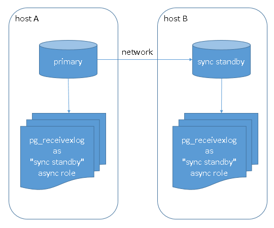

## PostgreSQL 9.5 new feature - pg_receivexlog run as synchronous standby  
                                                                                                                                                           
### 作者                                                                                                                                          
digoal                                                                                                                                          
                                                                                                                                          
### 日期                                                                                                                                           
2015-05-25                                                                                                                               
                                                                                                                                            
### 标签                                                                                                                                          
PostgreSQL , pg_receivexlog , 同步接收xlog , 瘦同步           
                                                                                                                                                      
----                                                                                                                                                      
                                                                                                                                                       
## 背景                                                                               
PostgreSQL 9.5 允许pg_receivexlog实时反馈wal的flush位置，并且可以将pg_receivexlog作为sync standby角色来使用。  
  
这样的话，我们可以利用pg_receivexlog来担任sync standby的第三者角色，从而实现更轻量级的数据0丢失以及高可用（以前我们需要改一下pg_receivexlog来实现这个功能，现在9.5已经添加了，看样子市场需求蛮大）。  
  
以往，我们使用同步流复制的话，如果只配置了一台standby，当standby或网络异常时，主节点会hang住，因为需要等待sync standby返回wal的flush位置来返回事务提交状态。  
  
  
  
为了避免primary hang住，我们需要将sync状态改为async状态，但是这样需要一个后台进程来完成监护，当primary出现异常时，有数据丢失的风险，同时在修改synchronous_standby_names = ''前，primary 的写事务也是会hang住的。  
  
所以为了避免sync standby带来的单点故障，我们往往需要配置多台standby，请注意，每台standby都需要和primary同样的存储空间，并且需要有足够强的io能力，如果你不需要读负载均衡的话，这样的搭配有点浪费。  
   
  
   
现在好了，PostgreSQL 9.5允许pg_receivexlog这个工具作为sync standby角色来使用，那么我们只需要一台standby即可，另外再开一个pg_receivexlog来避免standby的单点故障，当standby发生故障时，pg_receivexlog会向主节点回报wal flush位置，所以不会导致primary hang住。  
  
使用pg_receivexlog的好处，不需要和primary一样大的存储空间，只需要放xlog的空间即可。  
  
  
  
我们可以把pg_receivexlog配置在数据库主机本地，这样来避免流复制网络问题导致的primary hang住。  
  
  
  
 这样的同步流复制HA，确保0数据丢失的同时还能提供非常好的可用性。  
  
(当然，这么做其实没有意义，因为本地不需要放多份wal，只是为了避免standby return wal flush lsn异常)  
  
  
  
如果可以的话，可以用性能较好的云硬盘来放wal。但是要和sync standby流复制走不同的数据链路，否则也无法避免链路问题导致的primary hang。  
  
   
  
  
  
相关参数：  
  
```  
pg_receivexlog can perform one of the two following actions in order to control physical replication slots:  
--create-slot  
Create a new physical replication slot with the name specified in --slot, then start to stream WAL.  
  
--drop-slot  
Drop the replication slot with the name specified in --slot, then exit.  
  
-S slotname  
--slot=slotname  
Require pg_receivexlog to use an existing replication slot (see Section 25.2.6). When this option is used, pg_receivexlog will report a flush position to the server, indicating when each segment has been synchronized to disk so that the server can remove that segment if it is not otherwise needed. --synchronous option must be specified when making pg_receivexlog run as synchronous standby by using replication slot. Otherwise WAL data cannot be flushed frequently enough for this to work correctly.  
  
--synchronous  
Flush the WAL data to disk immediately after it has been received. Also send a status packet back to the server immediately after flushing, regardless of --status-interval.  
```  
  
小测：  
  
```  
pg_hba.conf  
# replication privilege.  
local   replication     postgres                                trust  
  
postgresql.conf  
synchronous_standby_names = '*'  
  
pg95@db-172-16-3-150-> pg_receivexlog --create-slot -S xlogsync_node1 --synchronous -D /data03/pgdata95/sync  
  
postgres=# select * from pg_stat_replication ;  
-[ RECORD 1 ]----+-----------------------------  
pid              | 3851  
usesysid         | 10  
usename          | postgres  
application_name | pg_receivexlog  
client_addr      |   
client_hostname  |   
client_port      | -1  
backend_start    | 2015-05-25 15:07:42.50071+08  
backend_xmin     |   
state            | streaming  
sent_location    | 1/8A77B690  
write_location   | 1/8A77B690  
flush_location   | 1/8A77B690  
replay_location  |   
sync_priority    | 1  
sync_state       | sync  
postgres=# select * from pg_replication_slots ;  
-[ RECORD 1 ]+---------------  
slot_name    | xlogsync_node1  
plugin       |   
slot_type    | physical  
datoid       |   
database     |   
active       | t  
active_pid   | 3851  
xmin         |   
catalog_xmin |   
restart_lsn  | 1/8A77BBD0  
```  
  
## 参考  
1\. http://www.postgresql.org/docs/devel/static/app-pgreceivexlog.html  
  
<a rel="nofollow" href="http://info.flagcounter.com/h9V1"  ></a>  
  
  
  
  
  
  
## [digoal's 大量PostgreSQL文章入口](https://github.com/digoal/blog/blob/master/README.md "22709685feb7cab07d30f30387f0a9ae")
  
