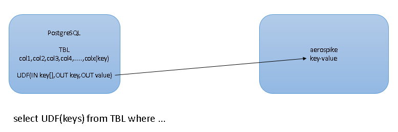

## PostgreSQL use UDF combine NoSQL DB's Computing Power  
                                                                                                                                                 
### 作者                                                                                                                                
digoal                                                                                                                                
                                                                                                                                
### 日期                                                                                                                                 
2015-07-22                                                                                                                     
                                                                                                                                  
### 标签                                                                                                                                
PostgreSQL , UDF , 整合      
                                                                                                                                            
----                                                                                                                                            
                                                                                                                                             
## 背景                                                                     
PostgreSQL数据库如何利用NoSQL数据库的强大计算能力或某些特性呢？  
  
这个问题实际上是因为一种数据库不可能做到适合任何场景，一个企业的不同业务类型可能使用的数据产品也千差万别。昨天和一位朋友聊到一个应用场景，他们有部分数据是存储在aerospike的，在aerospike中做BIT运算是很快的，但是当需要多个条件的组合时（多级索引），可能就不是那么适合了。  
  
这个时候PostgreSQL就派上用场了，将aerospike中的KEY存储到PostgreSQL中，还有多级索引涉及的字段内容也存储到PostgreSQL中，VALUE（bitmap）还是存储在aerospike中。  
  
这么做之后，原来的查询就变成PostgreSQL中的查询了，但是如何才能结合aerospike中的bit运算结果呢？这个时候需要使用PostgreSQL的UDF功能，参考本文参考部分，例如aerospike支持python，那么我们就在PostgreSQL中使用PL/python语言来编写这个UDF。  
  
  
  
使用UDF可以很好的调动外部数据源的计算能力。目前PostgreSQL支持多种语言的函数，例如C,python,perl,tcl,java,javascript,R等等。  
  
当然除了UDF，实际上PostgreSQL还有FDW，只是不是所有的数据源目前都有开源的FDW，所以UDF使用起来门槛更低，还有一点，并不是所有的查询FDW都支持where条件的push down，所以这个时候还是要靠UDF。  
  
目前PostgreSQL支持的FDW请参考：  
  
https://wiki.postgresql.org/wiki/Fdw  
  
UDF这种用法，其实在其他产品中也屡见不鲜，例如R的pivotalR包，也可以认为是一种UDF包，它实际上是在Greenplum或HAWQ中执行相应的SQL语句，并将数据返回给R，这正是R利用MPP的数据处理能力的一种手段。与本文在PostgreSQL中使用UDF利用aerospike的计算能力的思路是一样的。  
  
## 参考  
1\. http://www.postgresql.org/docs/9.4/static/plpython.html  
  
2\. http://www.postgresql.org/docs/9.4/static/server-programming.html  
  
3\. https://wiki.postgresql.org/wiki/Fdw  
  
  
  
  
  
  
  
  
## [digoal's 大量PostgreSQL文章入口](https://github.com/digoal/blog/blob/master/README.md "22709685feb7cab07d30f30387f0a9ae")
  
