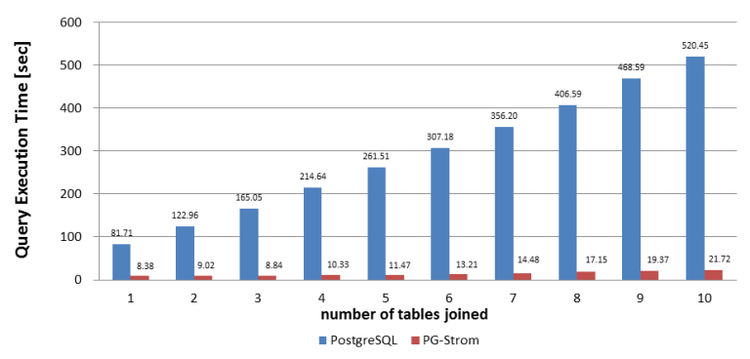

## 试用 PGStrom   
                                               
### 作者                              
digoal                              
                              
### 日期                               
2015-08-14                            
                                
### 标签                              
PostgreSQL , GPU , pgstrom     
                                          
----                                          
                                           
## 背景                               
PGStrom是一个使用GPU进行并行计算的custom scan provider插件，架构如下：  
  
  
  
  
  
从WIKI上的文档来看，性能提升非常可观。JOIN的表越多，提升效果越明显。  
  
  
  
需要安装cuda7.0的驱动，以及toolkit。  
  
参考 https://developer.nvidia.com/cuda-downloads    
  
安装过程遇到一个问题，libcuda.so没有放在Makefile指定的-L中。  
  
```  
gcc -Wall -Wmissing-prototypes -Wpointer-arith -Wdeclaration-after-statement -Wendif-labels -Wmissing-format-attribute -Wformat-security -fno-strict-aliasing -fwrapv -g -O2 -fpic src/gpuinfo.c -Wall -DPGSTROM_DEBUG=1 -O0 -DCMD_GPUINGO_PATH=\"/app_data/digoal/pgsql9.5/bin/gpuinfo\" -I /usr/local/cuda/include -L /usr/local/cuda/lib64 -lcuda -o src/gpuinfo  
/usr/bin/ld: cannot find -lcuda  
collect2: ld returned 1 exit status  
make: *** [src/gpuinfo] Error 1  
```  
  
这个修改一下可以解决。  
  
```  
digoal-> cp /usr/local/cuda-7.0/lib64/stubs/libcuda.so /usr/local/cuda-7.0/lib64/  
digoal-> ll /usr/local  
total 92K  
drwxr-xr-x   2 root root 4.0K Jun  9 11:35 bin  
drwxr-xr-x 139 root root 4.0K Apr 14 18:40 clonescripts  
drwxr-xr-x   4 root root 4.0K Apr 14 19:05 csf  
lrwxrwxrwx   1 root root   19 Aug 14 16:42 cuda -> /usr/local/cuda-7.0  
drwxr-xr-x  17 root root 4.0K Apr 15 16:37 cuda-6.5  
drwxr-xr-x  17 root root 4.0K Aug 14 16:42 cuda-7.0  
```  
  
安装用到了PostgreSQL 9.5 alpha 2以及最新的PGStrom代码。  
  
安装完后，通过gpuinfo可以看到当前的GPU信息：  
  
```  
digoal-> gpuinfo   
CUDA Runtime version: 7.0.0  
NVIDIA Driver version: 346.59  
Number of devices: 2  
--------  
Device Identifier: 0  
Device Name: Tesla K40m  
Global memory size: 11519MB  
Maximum number of threads per block: 1024  
Maximum block dimension X: 1024  
Maximum block dimension Y: 1024  
Maximum block dimension Z: 64  
Maximum grid dimension X: 2147483647  
Maximum grid dimension Y: 65535  
Maximum grid dimension Z: 65535  
Maximum shared memory available per block in bytes: 49152KB  
Memory available on device for __constant__ variables: 65536bytes  
Warp size in threads: 32  
Maximum number of 32-bit registers available per block: 65536  
Typical clock frequency in kilohertz: 745000KHZ  
Number of multiprocessors on device: 15  
Specifies whether there is a run time limit on kernels: 0  
Device is integrated with host memory: false  
Device can map host memory into CUDA address space: true  
Compute mode (See CUcomputemode for details): default  
Device can possibly execute multiple kernels concurrently: true  
Device has ECC support enabled: true  
PCI bus ID of the device: 2  
PCI device ID of the device: 0  
Device is using TCC driver model: false  
Peak memory clock frequency in kilohertz: 3004000KHZ  
Global memory bus width in bits: 384  
Size of L2 cache in bytes: 1572864bytes  
Maximum resident threads per multiprocessor: 2048  
Number of asynchronous engines: 2  
Device shares a unified address space with the host: true  
Major compute capability version number: 3  
Minor compute capability version number: 5  
Device supports stream priorities: true  
Device supports caching globals in L1: true  
Device supports caching locals in L1: true  
Maximum shared memory available per multiprocessor: 49152bytes  
Maximum number of 32bit registers per multiprocessor: 65536  
Device can allocate managed memory on this system: true  
Device is on a multi-GPU board: false  
Unique id for a group of devices on the same multi-GPU board: 0  
--------  
Device Identifier: 1  
Device Name: Tesla K40m  
Global memory size: 11519MB  
Maximum number of threads per block: 1024  
Maximum block dimension X: 1024  
Maximum block dimension Y: 1024  
Maximum block dimension Z: 64  
Maximum grid dimension X: 2147483647  
Maximum grid dimension Y: 65535  
Maximum grid dimension Z: 65535  
Maximum shared memory available per block in bytes: 49152KB  
Memory available on device for __constant__ variables: 65536bytes  
Warp size in threads: 32  
Maximum number of 32-bit registers available per block: 65536  
Typical clock frequency in kilohertz: 745000KHZ  
Number of multiprocessors on device: 15  
Specifies whether there is a run time limit on kernels: 0  
Device is integrated with host memory: false  
Device can map host memory into CUDA address space: true  
Compute mode (See CUcomputemode for details): default  
Device can possibly execute multiple kernels concurrently: true  
Device has ECC support enabled: true  
PCI bus ID of the device: 3  
PCI device ID of the device: 0  
Device is using TCC driver model: false  
Peak memory clock frequency in kilohertz: 3004000KHZ  
Global memory bus width in bits: 384  
Size of L2 cache in bytes: 1572864bytes  
Maximum resident threads per multiprocessor: 2048  
Number of asynchronous engines: 2  
Device shares a unified address space with the host: true  
Major compute capability version number: 3  
Minor compute capability version number: 5  
Device supports stream priorities: true  
Device supports caching globals in L1: true  
Device supports caching locals in L1: true  
Maximum shared memory available per multiprocessor: 49152bytes  
Maximum number of 32bit registers per multiprocessor: 65536  
Device can allocate managed memory on this system: true  
Device is on a multi-GPU board: false  
Unique id for a group of devices on the same multi-GPU board: 1  
```  
  
加载PGStrom  
  
```  
# vi $PGDATA/postgresql.conf  
shared_preload_libraries = '$libdir/pg_strom'    
  
digoal-> pg_ctl restart -m fast  
waiting for server to shut down.... done  
server stopped  
server starting  
  
LOG:  CUDA Runtime version: 7.0.0  
LOG:  NVIDIA driver version: 346.59  
LOG:  GPU0 Tesla K40m (2880 CUDA cores, 745MHz), L2 1536KB, RAM 11519MB (384bits, 3004MHz), capability 3.5  
LOG:  GPU1 Tesla K40m (2880 CUDA cores, 745MHz), L2 1536KB, RAM 11519MB (384bits, 3004MHz), capability 3.5  
LOG:  NVRTC - CUDA Runtime Compilation vertion 7.0  
LOG:  redirecting log output to logging collector process  
HINT:  Future log output will appear in directory "pg_log".  
```  
  
试用：  
  
```  
postgres=# create extension pg_strom;  
CREATE EXTENSION  
postgres=# create table t1(c1 int,c2 int);  
CREATE TABLE  
postgres=# create table t2(c1 int,c2 int);  
CREATE TABLE  
postgres=# create table t3(c1 int,c2 int);  
CREATE TABLE  
postgres=# insert into t1 select generate_series(1,10000000),1;  
INSERT 0 10000000  
postgres=# insert into t2 select generate_series(1,10000000),1;  
INSERT 0 10000000  
postgres=# insert into t3 select generate_series(1,10000000),1;  
INSERT 0 10000000  
  
  
postgres=# explain (analyze,verbose,costs,buffers,timing) select count(*) from t1;  
                                                                    QUERY PLAN                                                                      
--------------------------------------------------------------------------------------------------------------------------------------------------  
 Aggregate  (cost=169247.71..169247.72 rows=1 width=0) (actual time=686.566..686.567 rows=1 loops=1)  
   Output: pgstrom.count((pgstrom.nrows()))  
   Buffers: shared hit=44275  
   ->  Custom Scan (GpuPreAgg)  (cost=1000.00..145747.99 rows=22 width=4) (actual time=679.224..686.552 rows=28 loops=1)  
         Output: pgstrom.nrows()  
         Bulkload: On (density: 100.00%)  
         Reduction: NoGroup  
         Features: format: tuple-slot, bulkload: unsupported  
         Buffers: shared hit=44275  
         ->  Custom Scan (BulkScan) on public.t1  (cost=0.00..144247.77 rows=9999977 width=0) (actual time=13.184..354.634 rows=10000000 loops=1)  
               Output: c1, c2  
               Features: format: heap-tuple, bulkload: supported  
               Buffers: shared hit=44275  
 Planning time: 0.117 ms  
 Execution time: 845.541 ms  
(15 rows)  
  
postgres=# explain (analyze,verbose,costs,buffers,timing) select count(*) from t1,t2,t3 where t1.c1=t2.c1 and t2.c1=t3.c1;  
WARNING:  01000: failed on cuCtxSynchronize: CUDA_ERROR_ASSERT - device-side assert triggered  
LOCATION:  pgstrom_release_gpucontext, cuda_control.c:974  
WARNING:  01000: failed on cuCtxSynchronize: CUDA_ERROR_ASSERT - device-side assert triggered  
LOCATION:  pgstrom_release_gpucontext, cuda_control.c:974  
WARNING:  01000: AbortTransaction while in ABORT state  
LOCATION:  AbortTransaction, xact.c:2471  
ERROR:  XX000: failed on cuEventElapsedTime: CUDA_ERROR_ASSERT - device-side assert triggered  
LOCATION:  gpujoin_task_complete, gpujoin.c:3404  
ERROR:  XX000: failed on cuMemFree: CUDA_ERROR_ASSERT - device-side assert triggered  
LOCATION:  gpuMemFreeAll, cuda_control.c:713  
  
  
postgres=# explain (analyze,verbose,costs,buffers,timing) select count(*) from t1 natural join t2;  
WARNING:  01000: failed on cuStreamDestroy: CUDA_ERROR_ASSERT - device-side assert triggered  
LOCATION:  pgstrom_cleanup_gputask_cuda_resources, cuda_control.c:1718  
WARNING:  01000: failed on cuStreamDestroy: CUDA_ERROR_ASSERT - device-side assert triggered  
LOCATION:  pgstrom_cleanup_gputask_cuda_resources, cuda_control.c:1718  
WARNING:  01000: failed on cuCtxSynchronize: CUDA_ERROR_ASSERT - device-side assert triggered  
LOCATION:  pgstrom_release_gpucontext, cuda_control.c:974  
WARNING:  01000: failed on cuCtxSynchronize: CUDA_ERROR_ASSERT - device-side assert triggered  
LOCATION:  pgstrom_release_gpucontext, cuda_control.c:974  
WARNING:  01000: AbortTransaction while in ABORT state  
LOCATION:  AbortTransaction, xact.c:2471  
ERROR:  XX000: failed on cuMemFree: CUDA_ERROR_ASSERT - device-side assert triggered  
LOCATION:  __gpuMemFree, cuda_control.c:645  
ERROR:  XX000: failed on cuMemFree: CUDA_ERROR_ASSERT - device-side assert triggered  
LOCATION:  gpuMemFreeAll, cuda_control.c:701  
```  
  
JOIN 遇到以上问题. 没研究过CUDA，  
  
```  
/*  
 * pgstrom_cleanup_gputask_cuda_resources  
 *  
 * it clears a common cuda resources; assigned on cb_task_process  
 */  
void  
pgstrom_cleanup_gputask_cuda_resources(GpuTask *gtask)  
{  
        CUresult        rc;  
  
        if (gtask->cuda_stream)  
        {  
                rc = cuStreamDestroy(gtask->cuda_stream);  
                if (rc != CUDA_SUCCESS)  
                        elog(WARNING, "failed on cuStreamDestroy: %s", errorText(rc));  
        }  
        gtask->cuda_index = 0;  
        gtask->cuda_context = NULL;  
        gtask->cuda_device = 0UL;  
        gtask->cuda_stream = NULL;  
        gtask->cuda_module = NULL;  
}  
  
void  
__gpuMemFree(GpuContext *gcontext, int cuda_index, CUdeviceptr chunk_addr)  
{  
        GpuMemHead         *gm_head;  
        GpuMemBlock        *gm_block;  
        GpuMemChunk        *gm_chunk;  
        GpuMemChunk        *gm_prev;  
        GpuMemChunk        *gm_next;  
        dlist_node         *dnode;  
        dlist_iter              iter;  
        CUresult                rc;  
        int                             index;  
。。。。。。  
                        rc = cuMemFree(gm_block->block_addr);  
                        if (rc != CUDA_SUCCESS)  
                                elog(ERROR, "failed on cuMemFree: %s", errorText(rc));  
```  
  
## 参考  
1\. https://wiki.postgresql.org/wiki/PGStrom  
  
  
<a rel="nofollow" href="http://info.flagcounter.com/h9V1"  ></a>  
  
  
  
  
  
  
## [digoal's 大量PostgreSQL文章入口](https://github.com/digoal/blog/blob/master/README.md "22709685feb7cab07d30f30387f0a9ae")
  
